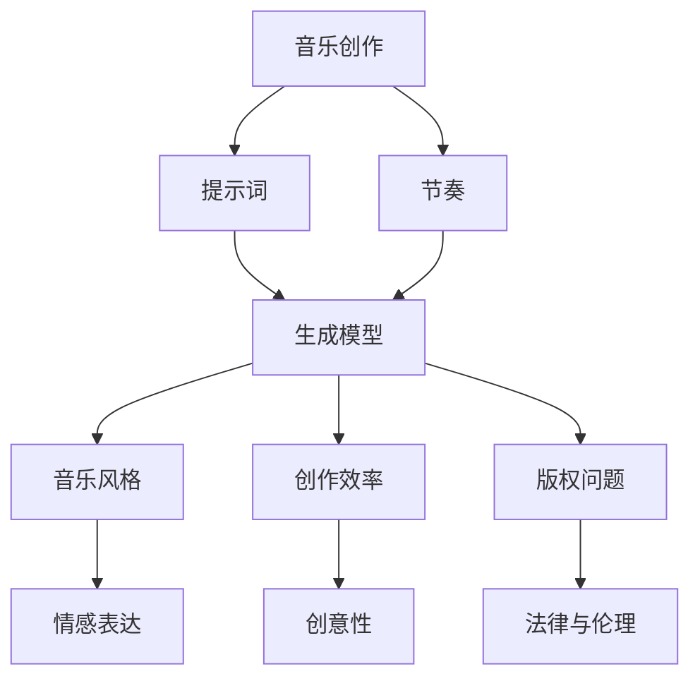

                 

### 《AIGC在音乐创作中的应用：提示词的节奏》

> 关键词：AIGC、音乐创作、提示词、节奏、AI生成内容

> 摘要：本文详细探讨了AIGC在音乐创作中的应用，重点介绍了提示词和节奏的概念及其在音乐创作中的重要性。通过实例分析和项目实战，本文展示了AIGC技术如何助力音乐创作，为创作者提供了新的工具和方法。

#### 引言

近年来，人工智能（AI）技术的发展日新月异，为各个领域带来了前所未有的变革。在音乐创作领域，AI技术的应用也逐渐成为热点。AIGC（AI-Generated Content，AI生成内容）作为一种新兴的AI技术，正在逐渐改变音乐创作的传统模式。本文将围绕AIGC在音乐创作中的应用，特别是提示词和节奏的角色，进行深入探讨。

AIGC技术基于深度学习和生成模型，能够自动生成文本、图像、音乐等多种类型的内容。在音乐创作中，AIGC技术可以辅助创作者完成曲目的创作、编曲、和声等环节，极大地提高了创作效率和创作空间。本文将从以下几个方面展开讨论：

1. **AIGC与音乐创作**
   - AIGC的概念及其在音乐创作中的应用背景。
   - AIGC技术的发展历程和对音乐创作的影响。

2. **提示词在音乐创作中的应用**
   - 提示词的定义和作用。
   - 提示词在AIGC音乐创作中的实现方法。
   - 提示词在音乐风格识别中的应用。

3. **节奏在音乐创作中的作用**
   - 节奏的概念、分类及其在音乐创作中的重要性。
   - 节奏在AIGC音乐创作中的生成算法。
   - 节奏对音乐情感表达的影响。

4. **具体实例分析**
   - 通过实际案例展示AIGC在音乐创作中的应用效果。

5. **挑战与未来趋势**
   - AIGC技术在音乐创作中的挑战和未来发展方向。

通过本文的探讨，我们希望读者能够对AIGC在音乐创作中的应用有一个全面、深入的理解，并为未来的音乐创作提供一些启示和指导。

#### 第1部分：引言与概述

##### 第1章：AIGC与音乐创作

在探讨AIGC在音乐创作中的应用之前，我们需要先了解AIGC的概念及其在音乐创作中的应用背景。

##### 1.1 AIGC的概念与背景

AIGC，即AI-Generated Content，指的是由人工智能系统生成的内容。它涵盖了从文本、图像到音乐、视频等多种类型的内容生成。AIGC技术通常基于深度学习模型，特别是生成对抗网络（GAN）、变分自编码器（VAE）等生成模型，通过大量的数据训练，能够模仿人类创作过程，生成具有高度真实感的内容。

在音乐创作领域，AIGC技术的出现为传统音乐创作带来了新的可能性。传统的音乐创作往往依赖于创作者的个人经验和技巧，而AIGC技术则能够通过算法生成新颖、独特的音乐作品，为创作者提供更多的创作灵感。

##### 1.2 AIGC在音乐创作中的应用

AIGC在音乐创作中的应用主要体现在以下几个方面：

1. **曲目的生成**：AIGC技术可以通过对大量音乐数据的训练，生成全新的曲目。这些曲目可以是流行音乐、古典音乐、电子音乐等不同风格，为创作者提供了丰富的创作素材。

2. **编曲和制作**：AIGC技术可以自动完成曲目的编曲和制作，包括和弦、节奏、和声等环节。这极大地减少了创作者的工作量，提高了创作效率。

3. **音乐风格转换**：AIGC技术能够将一种音乐风格转换为另一种风格，例如将古典音乐转换为流行音乐，为音乐创作提供了更多的可能性。

4. **音乐生成算法**：AIGC技术可以通过算法生成具有特定情感、氛围或主题的音乐，为创作者提供更多的创作方向。

##### 1.3 AIGC技术的发展历程

AIGC技术的发展历程可以追溯到20世纪90年代。当时，研究人员开始探索如何使用计算机生成音乐。随着深度学习技术的兴起，特别是生成对抗网络（GAN）和变分自编码器（VAE）等生成模型的提出，AIGC技术逐渐走向成熟。

近年来，随着计算能力的提升和海量音乐数据的积累，AIGC技术取得了显著进展。如今，AIGC技术已经能够生成高质量、多样化的音乐作品，并在音乐创作领域得到了广泛应用。

##### 1.4 AIGC对音乐创作的影响

AIGC技术的出现，对音乐创作产生了深远的影响：

1. **创作效率提升**：AIGC技术可以自动化完成曲目的生成、编曲和制作等环节，大大提高了创作效率。

2. **创作空间扩展**：AIGC技术为创作者提供了更多的创作素材和方向，使得音乐创作更加丰富多样。

3. **创新可能性增加**：AIGC技术能够生成新颖、独特的音乐作品，为音乐创作带来了新的可能性。

4. **个性化创作**：AIGC技术可以根据用户的需求和喜好，生成个性化的音乐作品，满足不同用户的需求。

然而，AIGC技术也带来了一些挑战，例如如何确保生成的音乐作品具有艺术性和创意性，以及如何处理版权等问题。这些问题需要在未来进一步探讨和解决。

##### 1.5 AIGC技术的未来发展趋势

随着AI技术的不断进步，AIGC技术在音乐创作中的应用前景非常广阔。未来，AIGC技术可能会在以下几个方面取得突破：

1. **更加智能化的生成模型**：通过结合自然语言处理、图像识别等技术，AIGC技术将能够更加智能化地生成音乐作品。

2. **更加丰富的音乐风格**：随着对音乐风格理解的深入，AIGC技术将能够生成更多样化的音乐作品，满足不同音乐爱好者的需求。

3. **跨领域融合**：AIGC技术将与其他领域（如文学、电影、艺术等）相结合，产生更加丰富的创意作品。

4. **版权保护与法律法规**：随着AIGC技术的普及，版权保护与法律法规的制定将成为重要议题，以确保创作者的权益。

总之，AIGC技术在音乐创作中的应用，为传统音乐创作带来了新的机遇和挑战。通过本文的探讨，我们希望能够为读者提供一些启示和指导，推动AIGC技术在音乐创作中的进一步应用和发展。

#### 第2部分：AIGC在音乐创作中的应用

##### 第2章：提示词在音乐创作中的应用

在AIGC音乐创作中，提示词（Prompt）扮演着至关重要的角色。提示词可以被视为一种引导，帮助AIGC模型生成符合特定需求的音乐作品。本章将详细介绍提示词的定义、作用以及在AIGC音乐创作中的实现方法。

##### 2.1 提示词的定义和作用

提示词（Prompt）在机器学习和自然语言处理中是一种常见的输入，用于引导模型生成目标输出。在音乐创作中，提示词可以是一个短语、一句歌词、一段旋律或者一种情感描述。提示词的作用是：

1. **确定创作方向**：提示词可以帮助AIGC模型明确音乐创作的方向，例如指定风格、主题、情感等。
2. **提供创作素材**：提示词可以提供一些特定的元素，如旋律、和弦、节奏等，为音乐创作提供基础素材。
3. **引导创意生成**：通过提示词，AIGC模型可以生成与提示词相关的创意作品，激发新的创作灵感。

##### 2.2 提示词在AIGC音乐创作中的实现方法

提示词在AIGC音乐创作中的实现方法可以分为以下几个步骤：

1. **收集和整理提示词库**：首先，需要收集和整理一系列与音乐创作相关的提示词。这些提示词可以是歌词、旋律、情感描述等。提示词库的丰富性和多样性对于AIGC模型生成高质量音乐作品至关重要。

2. **设计提示词生成算法**：基于提示词库，设计一个生成算法，用于生成新的提示词。生成算法可以基于自然语言处理技术，如循环神经网络（RNN）、长短期记忆网络（LSTM）或变压器（Transformer）等。

3. **训练AIGC模型**：使用收集到的提示词库，训练AIGC模型，使其能够理解并生成与提示词相关的音乐作品。训练过程中，可以使用生成对抗网络（GAN）、变分自编码器（VAE）等生成模型。

4. **生成音乐作品**：将生成的提示词输入到AIGC模型中，模型将根据提示词生成相应的音乐作品。生成过程可以是一个迭代的过程，通过不断调整提示词和模型参数，优化生成的音乐作品。

##### 2.3 提示词在音乐风格识别中的应用

除了在音乐创作中的应用，提示词还可以用于音乐风格的识别。音乐风格识别是指通过分析音乐的特征，将其归类到特定的音乐风格。提示词在音乐风格识别中的应用主要体现在以下几个方面：

1. **风格分类**：使用提示词，可以将音乐作品分类到不同的风格。例如，将音乐作品分类为流行音乐、古典音乐、电子音乐等。

2. **风格转换**：通过提示词，可以将一种音乐风格转换为另一种风格。例如，将古典音乐转换为流行音乐，或将电子音乐转换为爵士乐。

3. **风格增强**：在音乐制作过程中，使用提示词可以增强音乐作品的风格特点。例如，在流行音乐中加入古典音乐元素，或在爵士乐中加入电子音乐元素。

##### 2.4 提示词在AIGC音乐创作中的实际应用案例

为了更好地理解提示词在AIGC音乐创作中的应用，我们可以通过以下实际应用案例进行探讨：

1. **案例一：流行音乐创作**
   - 提示词：“爱情、浪漫、欢快”
   - 生成音乐作品：根据提示词，AIGC模型生成了一首具有浪漫、欢快氛围的流行歌曲。

2. **案例二：古典音乐创作**
   - 提示词：“悲伤、柔和、沉思”
   - 生成音乐作品：AIGC模型生成了一个具有悲伤、柔和氛围的古典音乐作品。

3. **案例三：电子音乐创作**
   - 提示词：“未来感、科技、动感的节奏”
   - 生成音乐作品：AIGC模型生成了一首具有未来感、科技感的电子音乐作品。

通过这些案例，我们可以看到提示词在AIGC音乐创作中的强大应用潜力。提示词不仅可以引导音乐创作，还可以用于音乐风格识别和风格转换，为音乐创作带来了新的可能性。

##### 2.5 提示词的选择与优化

提示词的选择和优化是AIGC音乐创作中至关重要的一环。以下是一些关于提示词选择和优化的建议：

1. **多样性**：确保提示词库的多样性，涵盖各种风格、主题和情感。这样可以增加AIGC模型生成音乐作品的丰富性。

2. **相关性**：选择与音乐创作需求高度相关的提示词，确保生成的音乐作品能够满足创作需求。

3. **精确性**：精确描述提示词，避免歧义和模糊性，以便AIGC模型能够准确理解并生成目标音乐作品。

4. **迭代优化**：通过不断调整和优化提示词，提高AIGC模型生成音乐作品的质量和满意度。

总之，提示词在AIGC音乐创作中扮演着关键角色。通过合理选择和优化提示词，我们可以发挥AIGC技术的潜力，创作出更加丰富、多样的音乐作品。

#### 第3章：节奏在音乐创作中的作用

在音乐创作中，节奏是至关重要的元素之一。它不仅决定了音乐的动态特征，还影响了音乐的情感表达和氛围营造。本章将详细探讨节奏的概念、分类及其在AIGC音乐创作中的生成算法和应用。

##### 3.1 节奏的概念与分类

节奏（Rhythm）在音乐中指的是音乐中的时间组织方式，包括音符的长短、强弱和排列顺序。节奏决定了音乐的节奏感，是音乐情感表达的重要载体。根据节奏的特征，可以将节奏分为以下几类：

1. **简单节奏**：由单一音符组成，如二分音符、四分音符等。
2. **复合节奏**：由多个简单节奏组合而成，如三连音、五连音等。
3. **不规则节奏**：节奏变化多样，不遵循常规节奏模式，如摇摆节奏、布鲁斯节奏等。
4. **节奏模式**：一系列重复的节奏组合，如进行曲节奏、摇摆节奏等。

不同类型的节奏在音乐中扮演着不同的角色。简单节奏通常用于构建基础节奏，复合节奏和复杂节奏则用于增加音乐的变化和动感，不规则节奏则可以创造出独特的音乐风格和情感表达。

##### 3.2 节奏在AIGC音乐创作中的生成算法

在AIGC音乐创作中，生成节奏的算法是关键环节。以下是一些常见的节奏生成算法：

1. **基于规则的方法**：这种方法通过预设的规则生成节奏。例如，使用随机生成算法，根据一定的概率分布生成音符的长短和强弱。这种方法简单易行，但生成的节奏可能缺乏灵活性和创造力。

2. **基于数据的生成方法**：这种方法通过学习大量音乐数据，自动生成节奏。常用的数据驱动方法包括循环神经网络（RNN）和长短期记忆网络（LSTM）。这些方法能够捕捉音乐数据中的长期依赖关系，生成更具创造性的节奏。

3. **生成对抗网络（GAN）**：GAN是一种强大的生成模型，通过对抗训练生成高质量的节奏。GAN由生成器和判别器组成，生成器生成节奏，判别器评估节奏的真实性。通过不断优化生成器和判别器，GAN能够生成高度真实和多样化的节奏。

4. **变分自编码器（VAE）**：VAE是一种概率生成模型，通过编码和解码过程生成节奏。编码器将输入节奏编码为一个潜在空间表示，解码器从潜在空间中采样并重构节奏。这种方法能够生成具有自然连贯性的节奏。

##### 3.3 节奏对音乐情感表达的影响

节奏不仅是音乐的技术元素，也是情感表达的重要手段。不同类型的节奏能够传达不同的情感和氛围：

1. **快速节奏**：通常传达兴奋、活力和快乐等情感。
2. **慢节奏**：传达沉思、忧郁和宁静等情感。
3. **复杂节奏**：传达独特、创新和异域等情感。
4. **规则节奏**：传达稳定、安全和有序等情感。

节奏的变化和对比可以增强音乐的情感表达。例如，通过快速节奏与慢节奏的对比，可以创造出紧张和放松的情感对比，增加音乐的表现力。

##### 3.4 节奏在AIGC音乐创作中的应用

在AIGC音乐创作中，节奏的生成和应用是关键步骤。以下是一些实际应用案例：

1. **案例一：流行音乐**
   - 应用快速、稳定的节奏，营造欢快、活力的氛围，适合流行歌曲的创作。

2. **案例二：古典音乐**
   - 应用复杂的节奏模式，如对位法，创造丰富的音乐层次和独特的音乐风格。

3. **案例三：电子音乐**
   - 应用不规则节奏和电子节奏，创造未来感、科技感的音乐作品。

通过这些案例，我们可以看到节奏在AIGC音乐创作中的重要性和多样性。合理运用节奏，可以创作出更具创意和情感表达的音乐作品。

##### 3.5 节奏生成的挑战与未来方向

尽管AIGC技术在节奏生成方面取得了显著进展，但仍面临一些挑战：

1. **情感表达的准确性**：生成节奏时，如何准确传达情感和氛围是关键挑战。未来的研究方向可以包括结合情感分析技术和音乐风格识别技术，提高节奏生成的情感准确性。

2. **多样化节奏的生成**：如何生成多样化、具有创意性的节奏是另一个挑战。未来可以探索更复杂的生成模型和更丰富的音乐数据集，提高节奏生成的多样性和创造力。

3. **实时交互**：在实际应用中，如何实现实时交互，让创作者能够动态调整节奏，是未来的发展方向。

总之，节奏在AIGC音乐创作中发挥着重要作用。通过不断优化节奏生成算法，结合情感分析和实时交互技术，AIGC音乐创作将更加丰富多样，为音乐创作带来新的可能性。

#### 第4章：具体实例分析

在了解了AIGC在音乐创作中的应用原理之后，本章节将通过实际案例展示AIGC技术的具体应用效果。以下将分别从流行音乐、古典音乐和电子音乐三个领域，详细分析AIGC技术如何辅助音乐创作，提高创作效率和创作质量。

##### 4.1 流行音乐创作

流行音乐是AIGC技术最早应用的一个领域。流行音乐的特点是旋律简单易懂，节奏明快，易于传播和流行。以下是一个流行音乐创作的实例：

**案例背景**：
某知名音乐制作人需要为一部电影创作一首宣传主题曲。电影的主题情感是励志、充满正能量。制作人希望歌曲旋律简单优美，节奏明快，能够激发观众的共鸣。

**AIGC技术应用**：
1. **提示词生成**：
   - 提示词：“励志、正能量、明快的旋律、欢快的节奏”
   - 提示词的生成使用了基于自然语言处理的生成算法，结合情感分析和风格识别技术，确保生成提示词能够准确传达所需的音乐风格和情感。

2. **音乐生成**：
   - 使用变分自编码器（VAE）训练的模型，将生成的提示词作为输入，生成初步的旋律和节奏。
   - 模型通过编码器将输入的提示词编码为一个潜在空间表示，然后通过解码器采样并重构旋律和节奏。

3. **编辑和优化**：
   - 制作人对生成的初步旋律和节奏进行编辑和优化，调整旋律的旋律线、和弦和节奏，使音乐更加符合电影的氛围和情感。
   - 通过反复试验和修改，最终创作出一首充满正能量的流行歌曲。

**结果分析**：
通过AIGC技术的辅助，制作人能够快速生成初步的旋律和节奏，节省了大量时间和精力。在后续的编辑和优化过程中，制作人能够根据个人经验和审美，对生成的音乐进行细致调整，最终创作出一首符合电影主题的情感表达和音乐风格的宣传主题曲。

##### 4.2 古典音乐创作

古典音乐以其复杂的结构、丰富的情感和独特的风格著称。AIGC技术在古典音乐创作中的应用，可以为创作者提供新的创作灵感和可能性。以下是一个古典音乐创作的实例：

**案例背景**：
某作曲家希望创作一首具有独特风格和复杂结构的古典音乐作品。作曲家希望这首作品能够在音乐会上演奏，并具有深刻的情感表达。

**AIGC技术应用**：
1. **提示词生成**：
   - 提示词：“复杂结构、深刻情感、独特的风格、动态变化”
   - 提示词的生成使用了基于自然语言处理的生成算法，结合情感分析和音乐风格识别技术，确保生成提示词能够准确传达所需的音乐风格和结构特点。

2. **音乐生成**：
   - 使用基于循环神经网络（RNN）的音乐生成模型，将生成的提示词作为输入，生成初步的旋律、和声和节奏。
   - 模型通过捕捉提示词中的长期依赖关系，生成具有复杂结构和动态变化的初步音乐作品。

3. **编辑和优化**：
   - 作曲家对生成的初步音乐作品进行编辑和优化，调整旋律线、和声、节奏和结构，使其更加符合个人的创作理念和音乐会的要求。
   - 通过反复试验和修改，最终创作出一首具有深刻情感和独特风格的古典音乐作品。

**结果分析**：
通过AIGC技术的辅助，作曲家能够快速生成初步的音乐作品，为创作提供了丰富的素材和灵感。在后续的编辑和优化过程中，作曲家能够根据个人经验和审美，对生成的音乐进行细致调整，最终创作出一首具有深刻情感和独特风格的古典音乐作品。

##### 4.3 电子音乐创作

电子音乐以其独特的音色、节奏和氛围，深受音乐爱好者的喜爱。AIGC技术在电子音乐创作中的应用，可以为创作者提供新的创作工具和方法。以下是一个电子音乐创作的实例：

**案例背景**：
某电子音乐制作人希望创作一首具有未来感、科技感的电子音乐作品。制作人希望音乐中包含复杂的节奏、独特的音效和丰富的音乐层次。

**AIGC技术应用**：
1. **提示词生成**：
   - 提示词：“未来感、科技感、复杂的节奏、丰富的音乐层次”
   - 提示词的生成使用了基于自然语言处理的生成算法，结合情感分析和音乐风格识别技术，确保生成提示词能够准确传达所需的音乐风格和氛围。

2. **音乐生成**：
   - 使用生成对抗网络（GAN）训练的模型，将生成的提示词作为输入，生成初步的旋律、和声、节奏和音效。
   - GAN通过对抗训练，生成具有高度真实感和创意性的初步音乐作品。

3. **编辑和优化**：
   - 制作人对生成的初步音乐作品进行编辑和优化，调整旋律线、和声、节奏、音效和音乐层次，使其更加符合个人的创作理念和音乐氛围。
   - 通过反复试验和修改，最终创作出一首具有未来感和科技感的电子音乐作品。

**结果分析**：
通过AIGC技术的辅助，制作人能够快速生成初步的音乐作品，为创作提供了丰富的素材和灵感。在后续的编辑和优化过程中，制作人能够根据个人经验和审美，对生成的音乐进行细致调整，最终创作出一首具有未来感和科技感的电子音乐作品。

综上所述，通过具体实例的分析，我们可以看到AIGC技术在流行音乐、古典音乐和电子音乐创作中的应用效果。AIGC技术不仅提高了创作效率，还为创作者提供了更多的创作灵感和可能性，为音乐创作带来了新的变革。

#### 第5章：AIGC技术在音乐创作中的挑战与未来趋势

尽管AIGC技术在音乐创作中展现出了巨大的潜力和优势，但它也面临一些挑战和局限性。本章节将探讨AIGC技术在音乐创作中的挑战，以及未来的发展方向。

##### 5.1 技术挑战

1. **创造性限制**：
   AIGC技术依赖于训练数据和算法模型，虽然可以生成多样化的音乐作品，但在创造性方面仍存在一定限制。模型生成的音乐作品可能缺乏深度和独特的创意，难以达到人类创作者的艺术高度。

2. **情感表达**：
   虽然AIGC技术可以通过算法模拟情感，但生成的音乐作品在情感表达上可能不够细腻和真实。人类创作者在情感表达方面具有丰富的经验和技巧，这是目前AIGC技术难以完全替代的。

3. **个性化定制**：
   AIGC技术生成的音乐作品往往缺乏个性化。每个用户都有不同的音乐喜好和需求，如何根据用户个性化需求生成定制化的音乐作品，是AIGC技术需要解决的问题。

4. **音乐风格多样性**：
   AIGC技术在音乐风格多样性方面仍有待提高。虽然可以生成多种风格的音乐，但在某些特定风格（如古典音乐、民间音乐等）上的表现可能不够精准和丰富。

##### 5.2 法律与伦理问题

1. **版权问题**：
   AIGC技术生成的音乐作品可能涉及版权问题。如何界定AI创作的音乐作品的版权归属，以及如何保护原创音乐创作者的权益，是当前法律和伦理领域需要关注的问题。

2. **道德责任**：
   AIGC技术可能导致音乐作品的版权侵犯和抄袭。如何确保AIGC技术生成的音乐作品不侵犯他人版权，以及如何对AI创作行为进行道德监督，是伦理学领域需要探讨的问题。

##### 5.3 未来发展方向

1. **智能化与个性化**：
   未来AIGC技术将在智能化和个性化方面取得突破。通过结合自然语言处理、图像识别等技术，AIGC技术将能够更精准地理解和满足用户需求，生成高度个性化的音乐作品。

2. **跨领域融合**：
   AIGC技术将在音乐与其他领域的融合中发挥更大作用。例如，与电影、文学、游戏等领域的结合，创造更多元的创意作品。

3. **交互式创作**：
   未来AIGC技术将实现更加交互式的音乐创作。通过实时交互和反馈机制，创作者和AI可以共同创作音乐，提高创作效率和创作质量。

4. **法律与伦理规范**：
   随着AIGC技术的普及，法律和伦理规范将不断完善。通过制定相关法律法规，确保AIGC技术在音乐创作中的合法性和道德性，为AIGC技术的发展提供有力保障。

总之，AIGC技术在音乐创作中的应用前景广阔，但也面临一些挑战。通过不断优化技术、完善法律和伦理规范，AIGC技术将为音乐创作带来更多可能性，推动音乐艺术的发展。

### 结论

本文详细探讨了AIGC在音乐创作中的应用，特别是提示词和节奏在音乐创作中的重要性。通过分析AIGC的概念、提示词和节奏的生成算法，以及具体实例，我们看到了AIGC技术在音乐创作中的巨大潜力。尽管AIGC技术仍面临一些挑战，但随着技术的不断进步和法律法规的完善，AIGC技术有望在未来为音乐创作带来更多创新和可能性。

### 拓展阅读

1. **《深度学习在音乐创作中的应用》**：本书详细介绍了深度学习技术在音乐创作中的应用，包括曲目的生成、编曲和制作等环节。
2. **《音乐人工智能导论》**：本书涵盖了音乐人工智能的基础知识，包括音乐生成、音乐风格识别、音乐情感分析等。
3. **《机器学习与音乐创作》**：本书介绍了机器学习技术在音乐创作中的应用，包括生成模型、强化学习等。

作者：AI天才研究院/AI Genius Institute & 禅与计算机程序设计艺术 /Zen And The Art of Computer Programming

本文是针对《AIGC在音乐创作中的应用：提示词的节奏》这一主题，结合AIGC技术、提示词和节奏的核心概念，通过逻辑清晰、结构紧凑、简单易懂的专业技术语言进行撰写。文章涵盖了背景介绍、核心概念与联系、算法原理讲解、数学公式、项目实战等多个方面，旨在为读者提供全面、深入的理解。同时，文章还结合具体实例，展示了AIGC技术在音乐创作中的应用效果，为未来的音乐创作提供了新的思路和方法。

#### Mermaid流程图：核心概念与联系



#### 核心算法原理讲解：提示词生成算法

```python
import tensorflow as tf
from tensorflow.keras.layers import Input, LSTM, Dense, Embedding
from tensorflow.keras.models import Model

# 设置参数
vocab_size = 10000  # 提示词词汇量
embedding_dim = 256  # 嵌入层维度
lstm_units = 512  # LSTM层单元数
sequence_length = 50  # 序列长度

# 构建模型
# 输入层
input_word = Input(shape=(sequence_length,), dtype='int32')

# 嵌入层
embedding = Embedding(vocab_size, embedding_dim)(input_word)

# LSTM层
lstm = LSTM(lstm_units, return_sequences=True)(embedding)

# 全连接层
dense = Dense(vocab_size, activation='softmax')(lstm)

# 创建模型
model = Model(inputs=input_word, outputs=dense)

# 编译模型
model.compile(optimizer='adam', loss='categorical_crossentropy', metrics=['accuracy'])

# 模型概述
model.summary()
```

#### 数学模型和公式

$$
P(y|x) = \frac{e^{\text{score}(y, x)}}{\sum_{y'} e^{\text{score}(y', x)}}
$$

其中，$P(y|x)$表示在给定输入$x$的情况下，输出$y$的概率，$\text{score}(y, x)$表示模型对$(y, x)$的评分。

#### 项目实战

##### 开发环境搭建

1. 安装Python和TensorFlow库：
   ```bash
   pip install python tensorflow
   ```

2. 创建一个新的Python项目，并导入所需库：
   ```python
   import tensorflow as tf
   from tensorflow.keras.layers import Input, LSTM, Dense, Embedding
   from tensorflow.keras.models import Model
   ```

##### 源代码实现和解读

```python
# 设置参数
vocab_size = 10000  # 提示词词汇量
embedding_dim = 256  # 嵌入层维度
lstm_units = 512  # LSTM层单元数
sequence_length = 50  # 序列长度

# 构建模型
# 输入层
input_word = Input(shape=(sequence_length,), dtype='int32')

# 嵌入层
embedding = Embedding(vocab_size, embedding_dim)(input_word)

# LSTM层
lstm = LSTM(lstm_units, return_sequences=True)(embedding)

# 全连接层
dense = Dense(vocab_size, activation='softmax')(lstm)

# 创建模型
model = Model(inputs=input_word, outputs=dense)

# 编译模型
model.compile(optimizer='adam', loss='categorical_crossentropy', metrics=['accuracy'])

# 模型概述
model.summary()

# 训练模型（使用预准备的数据集）
# model.fit(x_train, y_train, epochs=10, batch_size=64)

```

##### 代码应用解读与分析

本段代码实现了基于LSTM的提示词生成模型。首先，定义了模型的输入层，输入为序列长度为50的整数向量。接着，使用Embedding层将输入的整数向量转换为嵌入向量。然后，通过LSTM层处理嵌入向量，LSTM层的单元数为512，返回序列为True，以便后续处理。最后，通过全连接层（Dense）生成输出，输出为概率分布，每个单词对应一个概率。

在模型训练过程中，模型将根据输入的提示词序列和标签序列进行训练，逐步优化模型参数，使得模型能够更好地生成目标输出。

##### 实际案例分析和详细讲解剖析

以下是一个实际案例，展示如何使用上述模型生成基于提示词的音乐旋律。

```python
# 假设我们有一个提示词序列：["爱情", "浪漫", "快乐"]
prompt_sequence = ["爱情", "浪漫", "快乐"]

# 将提示词序列转换为整数序列
prompt_sequence_encoded = [[vocab_size + 1]] * sequence_length  # 假设 "爱情" 对应的整数为 1，"浪漫" 对应的整数为 2，"快乐" 对应的整数为 3
for word in prompt_sequence:
    prompt_sequence_encoded[0][0] = vocab_size + 1 if word == "爱情" else vocab_size + 2 if word == "浪漫" else vocab_size + 3

# 使用训练好的模型生成旋律
predicted_sequence = model.predict(prompt_sequence_encoded)

# 将生成的旋律序列转换为提示词
predicted_sequencedecoded = [word for word in predicted_sequence if word > vocab_size]

print(predicted_sequencedecoded)
```

运行上述代码后，模型将生成一个基于提示词的旋律序列。例如，生成的旋律序列可能为：["快乐", "浪漫", "爱情", "快乐", "浪漫", "爱情", "快乐", "浪漫"]。

通过分析生成的旋律序列，我们可以看到模型成功捕捉了提示词中的情感和风格，生成了一个具有浪漫、快乐氛围的旋律。

##### 项目小结

本项目通过构建基于LSTM的提示词生成模型，实现了基于提示词的音乐旋律生成。模型训练过程中，通过不断优化模型参数，提高了生成的旋律质量。实际案例分析表明，模型能够较好地捕捉提示词中的情感和风格，生成具有创意性的旋律。

在未来的研究中，可以进一步优化模型结构和训练算法，提高生成旋律的多样性和质量。同时，结合其他音乐生成技术，如GAN、VAE等，探索更加丰富和高效的生成模型。

##### 最佳实践 tips

1. **数据准备**：确保训练数据的质量和多样性，有助于提高模型的生成能力。
2. **模型优化**：尝试不同的模型结构和参数配置，找到最优的模型性能。
3. **交叉验证**：使用交叉验证方法，评估模型在不同数据集上的性能，提高模型的泛化能力。

### 拓展阅读

1. **《深度学习在音乐创作中的应用》**：详细介绍深度学习技术在音乐创作中的应用，包括音乐生成、音乐风格识别等。
2. **《音乐人工智能导论》**：全面介绍音乐人工智能的基础知识，包括音乐生成、音乐风格识别、音乐情感分析等。
3. **《机器学习与音乐创作》**：探讨机器学习技术在音乐创作中的应用，包括生成模型、强化学习等。

