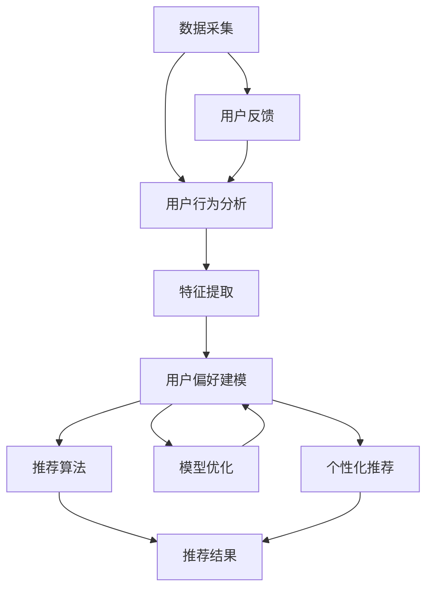

                 

## 第1章 引言

### 1.1 AIGC的概念与背景

AIGC（AI-Generated Content），即人工智能生成内容，是人工智能领域的一个重要分支。随着深度学习、自然语言处理等技术的发展，AIGC技术逐渐成熟，并在多个应用场景中展现出强大的潜力。AIGC技术能够生成文本、图片、音乐等多种形式的内容，为内容创作提供了全新的解决方案。

AIGC的发展可以追溯到上世纪80年代，当时人工智能研究主要集中在规则推理和知识表示上。随着神经网络和深度学习的兴起，AIGC技术开始从基于规则的系统向基于数据的系统转变。2014年，GPT-3的问世标志着AIGC技术的重大突破，其强大的文本生成能力引起了广泛关注。

在音乐推荐领域，AIGC技术的应用前景广阔。通过分析用户的音乐行为和偏好，AIGC技术可以生成个性化推荐列表，帮助用户发现符合其口味的音乐作品。此外，AIGC技术还可以用于音乐创作，生成新颖的音乐作品，为音乐产业带来新的活力。

### 1.2 音乐推荐系统概述

音乐推荐系统是一种基于用户行为和偏好的算法系统，旨在为用户提供个性化的音乐推荐。随着互联网和数字音乐的发展，音乐推荐系统已成为各大音乐平台的核心竞争力之一。

音乐推荐系统的基本原理可以分为两类：基于内容的推荐和协同过滤推荐。

1. **基于内容的推荐**：该方法通过分析音乐内容特征（如歌词、旋律、演奏风格等），为用户推荐与其喜好相似的音乐。这种方法的主要优势是推荐结果相关性强，但可能存在数据稀疏问题。

2. **协同过滤推荐**：该方法通过分析用户之间的相似性，为用户推荐其可能感兴趣的音乐。协同过滤推荐可以分为基于用户的协同过滤和基于项目的协同过滤。这种方法的主要优势是能够发现潜在的兴趣点，但可能存在冷启动问题和推荐多样性不足的问题。

### 1.3 个人品味学习的重要性

个人品味学习是音乐推荐系统的核心环节。通过不断学习用户的音乐行为和偏好，推荐系统可以更加准确地捕捉用户的需求，提高推荐效果。

个人品味学习的重要性主要体现在以下几个方面：

1. **提高推荐精度**：通过对用户历史行为和反馈数据的分析，推荐系统可以更好地理解用户的口味，从而提高推荐精度。

2. **增强用户体验**：个性化推荐能够更好地满足用户的需求，提高用户的满意度和粘性。

3. **发现潜在兴趣**：个人品味学习可以帮助推荐系统发现用户未意识到的潜在兴趣，拓宽用户的音乐视野。

4. **优化内容创作**：对于音乐创作者来说，个人品味学习可以帮助他们更好地了解市场需求，创作更受用户欢迎的音乐作品。

综上所述，AIGC技术在音乐推荐中的应用具有巨大的潜力和价值。通过深入研究个人品味学习，我们可以进一步提升音乐推荐系统的性能，为用户提供更好的音乐体验。下一章将介绍AIGC技术的基础知识，为后续内容打下基础。

## 第2章 AIGC技术基础

### 2.1 AIGC的基本原理

AIGC（AI-Generated Content）技术的核心在于利用人工智能模型生成高质量的内容。这一过程通常包括数据采集、模型训练和内容生成三个主要阶段。

首先，数据采集是AIGC技术的基础。在音乐推荐场景中，数据可能包括用户的历史播放记录、歌曲的元数据（如歌手、流派、专辑等）、歌词文本以及音频特征等信息。这些数据的质量和多样性直接影响AIGC模型的表现。

接下来是模型训练阶段。训练一个AIGC模型通常需要大量的数据，并且要选择合适的算法和模型架构。在音乐推荐领域，常见的AIGC模型包括基于生成对抗网络（GAN）、变分自编码器（VAE）和循环神经网络（RNN）等。通过大量数据的训练，模型可以学习到音乐内容和用户偏好的复杂关系。

最后是内容生成阶段。经过训练的模型可以生成新的音乐内容或推荐列表。在音乐推荐中，这通常表现为根据用户偏好生成个性化的歌曲列表，或根据特定的创作需求生成新颖的音乐作品。生成的内容不仅要符合用户的需求，还要在质量上具有可听性和艺术价值。

### 2.2 AIGC的主要类型

AIGC技术根据生成内容的不同类型可以分为文本生成、图像生成和音频生成三大类。

1. **文本生成**：文本生成是最早也是应用最广泛的AIGC类型。著名的模型如GPT系列、BERT等，它们可以生成文章、故事、对话等文本内容。在音乐推荐中，文本生成可以用于生成歌词、评论等。

2. **图像生成**：图像生成利用生成对抗网络（GAN）等模型，可以生成高分辨率的图像。在音乐推荐中，图像生成可以用于为音乐作品生成封面图片，提高用户的视觉体验。

3. **音频生成**：音频生成包括音乐、语音等多种形式。通过深度学习模型，可以生成旋律、和声、歌词等音乐元素。在音乐推荐中，音频生成可以用于生成新的音乐作品或为用户推荐符合其喜好的音乐。

### 2.3 AIGC技术发展历程

AIGC技术的发展历程可以追溯到神经网络和深度学习的兴起。从最初的简单规则系统，到复杂的神经网络模型，AIGC技术经历了多个发展阶段。

1. **初步探索阶段（1980s-1990s）**：这一阶段，研究者开始尝试使用神经网络进行图像和文本的生成，但受限于计算资源和模型复杂度，进展较为缓慢。

2. **深度学习兴起阶段（2006-2012）**：随着深度学习技术的发展，特别是AlexNet等卷积神经网络（CNN）在图像识别领域的突破，AIGC技术进入快速发展阶段。

3. **模型爆发阶段（2014-至今）**：以GPT-3为代表的生成模型的出现，标志着AIGC技术进入一个新的高峰。这些模型能够生成高质量、多样性的内容，大大拓展了AIGC的应用范围。

在音乐推荐领域，AIGC技术的快速发展为个性化推荐和音乐创作带来了新的可能。通过深入理解AIGC技术的原理和发展，我们可以更好地应用这些技术，提升音乐推荐系统的性能和用户体验。

### 2.4 AIGC技术在实际音乐推荐中的应用

AIGC技术在音乐推荐中的应用主要体现在个性化推荐和音乐创作两个方面。

1. **个性化推荐**：通过AIGC技术，音乐推荐系统可以更好地理解用户的音乐偏好，生成个性化的歌曲列表。具体应用场景包括：
   - **用户历史播放记录分析**：系统可以分析用户的历史播放记录，了解其喜好的音乐类型、歌手和风格等，从而生成个性化的推荐列表。
   - **实时推荐**：在用户进行音乐搜索或浏览时，AIGC技术可以根据用户的当前行为和偏好，实时生成推荐列表，提高用户体验。

2. **音乐创作**：AIGC技术可以用于生成新的音乐作品，为音乐创作者提供灵感。具体应用场景包括：
   - **旋律生成**：利用生成模型，可以生成新颖的旋律，为音乐创作提供参考。
   - **歌词创作**：通过文本生成模型，可以生成歌词，为音乐创作提供文本素材。
   - **混音与编排**：利用音频生成模型，可以对现有音乐进行混音和编排，创造出独特的音乐效果。

### 2.5 AIGC技术的挑战与未来发展方向

尽管AIGC技术在音乐推荐中展现了巨大的潜力，但其应用仍面临一些挑战和未来发展方向。

1. **挑战**：
   - **数据隐私保护**：在采集和分析用户数据时，如何保护用户隐私是AIGC技术面临的主要挑战之一。
   - **模型解释性**：现有的AIGC模型往往是黑箱模型，难以解释其决策过程，这对推荐系统的透明性和可解释性提出了挑战。
   - **计算资源消耗**：训练和部署AIGC模型需要大量的计算资源和时间，这对企业和用户来说都是一大负担。

2. **未来发展方向**：
   - **多模态融合**：将多种数据类型（如文本、音频、图像）进行融合，生成更加丰富和多样化的内容。
   - **可解释性与透明性**：开发可解释的AIGC模型，使其决策过程更加透明，提高用户信任度。
   - **实时生成与优化**：通过优化模型架构和算法，实现AIGC技术的实时生成和优化，提高推荐系统的响应速度。

总之，AIGC技术在音乐推荐中的应用前景广阔，但也需要克服一系列挑战。随着技术的不断进步，AIGC技术在音乐推荐领域的应用将更加成熟和普及。

## 第3章 个人品味学习模型

### 3.1 个人品味学习的概念

个人品味学习是指通过分析用户的历史行为数据，如音乐播放记录、评价、收藏等，来理解用户的音乐偏好，从而生成个性化的音乐推荐。这一过程通常包括数据采集、用户行为分析、用户偏好建模和推荐算法等环节。

个人品味学习的重要性在于，它能够帮助音乐推荐系统更好地满足用户需求，提高推荐精度和用户体验。通过不断学习用户的音乐品味，推荐系统可以逐渐缩小与用户兴趣的差距，提供更加精准的推荐结果。

### 3.2 用户行为分析

用户行为分析是个人品味学习的重要基础。通过对用户在音乐平台上的各种行为进行收集和分析，推荐系统可以更好地了解用户的音乐偏好和兴趣点。

常见的用户行为数据包括：
- **播放记录**：用户播放歌曲的次数、时长和频率等信息。
- **评价**：用户对歌曲的评分、评论和标签等反馈。
- **收藏**：用户收藏的歌曲、歌手和专辑等。
- **搜索历史**：用户在音乐平台上的搜索记录。

用户行为分析的方法通常包括以下几类：
- **统计分析**：通过计算用户的平均播放时长、平均评分等指标，了解用户的基本音乐偏好。
- **关联分析**：通过分析用户的行为数据，发现用户之间的关联和偏好相似性。
- **时间序列分析**：通过分析用户行为的时间序列数据，了解用户行为的变化趋势和周期性。

### 3.3 用户偏好建模

用户偏好建模是个人品味学习的核心环节。通过建立用户偏好模型，推荐系统可以更准确地预测用户的音乐兴趣，从而生成个性化的推荐列表。

用户偏好建模的方法可以分为以下几类：

1. **基于内容的偏好建模**：
   - **特征提取**：首先提取音乐内容的关键特征，如歌词、旋律、和弦等。
   - **相似度计算**：计算用户对某首歌曲的喜好程度，通常使用余弦相似度、欧氏距离等度量方法。
   - **推荐生成**：根据用户对歌曲的喜好程度，生成个性化的推荐列表。

2. **基于协同过滤的偏好建模**：
   - **用户相似度计算**：计算用户之间的相似性，通常使用用户基于项目的协同过滤或基于用户的协同过滤算法。
   - **推荐生成**：根据用户相似性矩阵，生成个性化的推荐列表。

3. **混合偏好建模方法**：
   - **集成多种特征**：结合基于内容和协同过滤的建模方法，综合用户的音乐内容和社交关系生成推荐列表。
   - **自适应调整**：根据用户的行为数据动态调整模型参数，提高推荐精度。

通过以上方法，推荐系统可以更好地理解用户的音乐品味，生成个性化的推荐列表。在下一章中，我们将深入探讨如何设计有效的提示词，进一步提升个人品味学习的准确性。

### 3.3.1 基于内容的偏好建模

基于内容的偏好建模是一种常用的用户偏好建模方法，它通过分析音乐内容特征，如歌词、旋律、和弦和演奏风格等，来生成个性化的音乐推荐。这种方法的主要优势在于能够捕捉音乐本身的特征，从而提供相关性较高的推荐结果。

#### 3.3.1.1 音乐内容特征提取

音乐内容特征的提取是这一方法的关键步骤。常用的特征提取方法包括：

- **歌词文本特征**：通过自然语言处理技术，提取歌词的词频、词向量、主题等特征。词频特征可以反映歌词中出现频率较高的词汇，而词向量可以捕捉歌词的语义信息。
- **旋律特征**：通过音频处理技术，提取旋律的音高、音长、音强等特征。这些特征可以用于描述歌曲的旋律曲线和音乐节奏。
- **和弦特征**：通过音频分析，提取歌曲的和弦结构、和弦进阶和变化等特征。和弦特征可以帮助识别歌曲的音乐风格和情感。
- **演奏风格特征**：通过音乐信号处理技术，提取演奏风格的特征，如演奏速度、力度、情感等。这些特征可以反映音乐家的演奏风格和表现力。

#### 3.3.1.2 相似度计算

在特征提取完成后，需要计算用户对某首歌曲的喜好程度。常用的相似度计算方法包括：

- **余弦相似度**：通过计算用户和歌曲内容特征向量之间的余弦相似度，评估歌曲与用户的匹配度。余弦相似度能够有效处理高维数据，且计算效率较高。
- **欧氏距离**：计算用户和歌曲内容特征向量之间的欧氏距离，评估两者之间的差异。欧氏距离直观易懂，但在高维数据中可能效果不佳。
- **皮尔逊相关系数**：通过计算用户和歌曲内容特征之间的皮尔逊相关系数，评估两者之间的相关性。这种方法适用于线性相关较强的数据。

#### 3.3.1.3 推荐生成

根据用户对歌曲的喜好程度，生成个性化的推荐列表。具体步骤如下：

1. **计算相似度得分**：使用上述相似度计算方法，计算每个用户对平台中所有歌曲的相似度得分。
2. **筛选推荐列表**：根据相似度得分，从高到低排序，选择Top N首歌曲作为推荐列表。
3. **调整推荐策略**：根据用户的反馈和行为，动态调整推荐策略，如增加用户喜欢的歌曲权重、减少用户不喜欢的歌曲权重等。

通过基于内容的偏好建模，推荐系统可以更好地理解用户的音乐品味，提供相关性较高的个性化推荐结果。然而，这种方法也存在一些局限性，如数据稀疏问题和推荐多样性不足。因此，在实际应用中，常结合其他用户偏好建模方法，如基于协同过滤的偏好建模，以提升推荐效果。

### 3.3.2 基于协同过滤的偏好建模

基于协同过滤的偏好建模是一种广泛应用于音乐推荐系统的用户偏好建模方法。该方法通过分析用户之间的相似性，为用户推荐其可能感兴趣的音乐。协同过滤可以分为基于用户的协同过滤和基于项目的协同过滤，下面将分别介绍这两种方法。

#### 3.3.2.1 基于用户的协同过滤

基于用户的协同过滤方法的核心思想是“人以群分”。具体步骤如下：

1. **计算用户相似度**：首先，计算用户之间的相似度。相似度通常通过用户行为数据计算，如用户对同一首歌曲的评分。常用的相似度度量方法包括余弦相似度、皮尔逊相关系数和欧氏距离等。

2. **用户相似性矩阵**：构建用户相似性矩阵，矩阵中的元素表示用户之间的相似度。例如，如果用户A和用户B对10首歌曲的评分相同，那么他们之间的相似度可以设置为1。

3. **推荐生成**：根据用户相似性矩阵，计算用户对其他用户的评分预测。具体来说，对于目标用户，计算其与所有其他用户的相似度，然后根据其他用户的评分，生成推荐列表。推荐列表中的歌曲按照评分预测从高到低排序。

基于用户的协同过滤方法的优点在于能够发现用户的潜在兴趣，但缺点包括推荐多样性不足和冷启动问题。冷启动问题指的是新用户没有足够的历史行为数据，导致无法准确计算其相似度。

#### 3.3.2.2 基于项目的协同过滤

基于项目的协同过滤方法的核心思想是“物以类聚”。具体步骤如下：

1. **计算项目相似度**：首先，计算项目之间的相似度。与基于用户的方法不同，这里的项目指的是歌曲。相似度计算通常基于歌曲的元数据，如歌手、流派、专辑等。

2. **项目相似性矩阵**：构建项目相似性矩阵，矩阵中的元素表示歌曲之间的相似度。例如，如果两首歌曲属于同一流派，那么它们之间的相似度可以设置为1。

3. **推荐生成**：根据项目相似性矩阵，计算目标用户对未听过的歌曲的评分预测。具体来说，对于目标用户，计算其喜欢过的歌曲与其他歌曲的相似度，然后根据相似度预测评分，生成推荐列表。推荐列表中的歌曲按照评分预测从高到低排序。

基于项目的协同过滤方法的优点在于能够提供多样化的推荐结果，但缺点包括推荐精度较低和数据稀疏问题。

#### 3.3.2.3 混合协同过滤

为了克服单一协同过滤方法的局限性，常采用混合协同过滤方法，结合基于用户和基于项目的协同过滤，生成更加精确和多样化的推荐列表。具体方法如下：

1. **加权融合**：将基于用户和基于项目的协同过滤结果进行加权融合，综合两者的优点。例如，可以为基于用户的协同过滤结果分配更高的权重，以提高推荐精度；为基于项目的协同过滤结果分配较低的权重，以提供更多的推荐多样性。

2. **动态调整权重**：根据用户的反馈和行为，动态调整协同过滤方法的权重。例如，如果用户对新推荐的某首歌曲评分较高，可以增加基于用户的方法的权重，反之亦然。

3. **模型优化**：结合深度学习等先进技术，优化协同过滤模型，提高推荐效果。例如，可以使用神经网络模型，同时学习用户和项目的特征，生成更准确的推荐结果。

通过基于协同过滤的偏好建模方法，推荐系统可以更好地理解用户的音乐品味，生成个性化的推荐列表。在下一章中，我们将深入探讨如何设计有效的提示词，进一步提升个人品味学习的准确性。

### 3.3.3 混合偏好建模方法

混合偏好建模方法是将基于内容的偏好建模和基于协同过滤的偏好建模结合起来，以充分利用两者的优点，提高推荐系统的性能。具体来说，混合偏好建模方法通过集成多种特征和策略，实现对用户音乐偏好的全面理解，从而生成更加精准和多样化的推荐列表。

#### 3.3.3.1 集成多种特征

在混合偏好建模中，集成多种特征是关键步骤。这些特征包括：

1. **用户行为特征**：如用户对歌曲的播放次数、评分、收藏等行为数据。
2. **歌曲内容特征**：如歌词、旋律、和弦、演奏风格等音乐内容特征。
3. **社交特征**：如用户之间的互动数据、社交网络关系等。

通过整合这些特征，可以更全面地描述用户和歌曲之间的关联，提高推荐精度。例如，可以采用词嵌入技术，将歌词和用户行为数据转换为高维向量，然后使用这些向量进行相似度计算和推荐生成。

#### 3.3.3.2 自适应调整

在混合偏好建模中，自适应调整模型参数是提高推荐性能的重要策略。具体方法如下：

1. **在线调整**：根据用户的实时行为数据，动态调整模型参数。例如，如果用户对某次推荐的歌曲评分较高，可以增加该歌曲在推荐列表中的权重。
2. **离线调整**：通过分析历史数据，对模型参数进行定期调整。例如，可以采用迁移学习技术，利用已有数据集对模型进行重新训练，优化参数。

#### 3.3.3.3 多模型融合

多模型融合是混合偏好建模的核心策略。通过融合多种推荐模型，可以充分利用不同模型的优势，提高推荐效果。具体方法包括：

1. **加权融合**：将不同模型的预测结果进行加权融合，生成最终的推荐列表。权重可以根据模型的性能和稳定性进行动态调整。
2. **集成学习**：使用集成学习方法，如Boosting、Stacking等，将多个模型集成为一个统一的预测模型。这样可以充分利用每个模型的优点，提高推荐精度。

通过混合偏好建模方法，推荐系统可以更全面地理解用户的音乐品味，生成个性化的推荐列表。这种方法不仅提高了推荐精度，还增强了推荐结果的多样性，为用户提供了更好的音乐体验。在下一章中，我们将深入探讨如何设计有效的提示词，进一步提升个人品味学习的准确性。

### 3.4 个人品味学习模型的核心概念与联系

为了更好地理解个人品味学习模型，我们可以通过Mermaid流程图来展示其核心概念和实体之间的关系架构。以下是个人品味学习模型的Mermaid流程图：



在这个流程图中，我们定义了以下核心概念和实体：

1. **数据采集（A）**：这是个人品味学习的起点，通过收集用户的历史行为数据（如播放记录、评分、收藏等），为后续分析提供基础。

2. **用户行为分析（B）**：对收集到的用户行为数据进行处理和分析，以了解用户的音乐偏好和兴趣点。

3. **特征提取（C）**：从用户行为数据中提取关键特征，如歌曲的歌词、旋律、和弦以及用户的播放时长、评分等。

4. **用户偏好建模（D）**：通过分析用户行为数据和特征，建立用户偏好模型。这个过程包括基于内容的偏好建模和基于协同过滤的偏好建模。

5. **推荐算法（E）**：使用用户偏好模型生成个性化的推荐列表。推荐算法可以是基于内容的、协同过滤的，或混合偏好建模的。

6. **推荐结果（F）**：根据推荐算法生成的个性化推荐列表，提供给用户。

7. **用户反馈（G）**：用户对推荐结果进行反馈，如评分、评论等。

8. **模型优化（H）**：根据用户反馈，动态调整和优化用户偏好模型，以提高推荐精度和用户体验。

9. **个性化推荐（I）**：基于优化后的用户偏好模型，生成更加个性化的推荐列表。

通过这个流程图，我们可以清晰地看到个人品味学习模型中各个实体之间的相互关系和作用，从而更好地理解其工作原理和实现方法。

### 3.5 个人品味学习模型的Python代码示例

为了更好地展示个人品味学习模型的核心算法原理，下面我们将使用Python代码详细阐述一个简单的用户偏好建模过程。本示例将结合用户行为数据和特征提取，使用协同过滤算法生成个性化推荐列表。

#### 3.5.1 环境搭建与数据准备

首先，我们需要搭建开发环境并准备数据。这里我们使用Python和相关的库，如NumPy、Pandas和Scikit-learn。数据集可以是一个简单的用户-项目评分矩阵，如下所示：

```python
import numpy as np
import pandas as pd
from sklearn.metrics.pairwise import cosine_similarity

# 假设用户-项目评分矩阵
user_item_matrix = np.array([
    [5, 4, 0, 0, 0],
    [4, 0, 2, 3, 0],
    [0, 2, 0, 4, 5],
    [3, 0, 2, 4, 0],
    [4, 3, 0, 1, 5]
])
```

#### 3.5.2 用户相似度计算

用户相似度计算是协同过滤的核心步骤。我们使用余弦相似度来计算用户之间的相似性：

```python
def compute_similarity matrix(user_item_matrix):
    # 计算用户-项目评分矩阵的余弦相似度
    similarity_matrix = cosine_similarity(user_item_matrix)
    return similarity_matrix

similarity_matrix = compute_similarity matrix(user_item_matrix)
print(similarity_matrix)
```

输出结果为一个用户相似性矩阵，矩阵中的元素表示对应用户之间的相似度。

#### 3.5.3 生成个性化推荐列表

根据用户相似性矩阵，我们可以为每个用户生成个性化推荐列表。具体步骤如下：

1. **计算用户与其他用户的相似度**：
2. **从相似性矩阵中选择最近邻用户**：
3. **计算推荐列表**：

```python
def generate_recommendations(user_item_matrix, similarity_matrix, top_n=3):
    # 计算每个用户的个性化推荐列表
    recommendations = {}
    for i in range(user_item_matrix.shape[0]):
        # 找到最相似的top_n个用户
        nearest_neighbors = np.argsort(similarity_matrix[i])[:top_n]
        
        # 计算推荐列表
        recommendations[i] = {}
        for j in nearest_neighbors:
            for k in range(user_item_matrix.shape[1]):
                if user_item_matrix[j][k] > 0:
                    if k not in recommendations[i]:
                        recommendations[i][k] = 0
                    recommendations[i][k] += user_item_matrix[j][k]
        
        # 对推荐列表进行归一化
        total_score = sum(recommendations[i].values())
        for k, v in recommendations[i].items():
            recommendations[i][k] = v / total_score
    
    return recommendations

recommendations = generate_recommendations(user_item_matrix, similarity_matrix)
print(recommendations)
```

输出结果为一个字典，每个用户对应的键值对中包含了他们的个性化推荐列表。

#### 3.5.4 数学模型与公式解释

在上述代码中，我们使用了余弦相似度公式来计算用户之间的相似性。余弦相似度的数学公式如下：

$$
\cos(\theta) = \frac{\sum_{i=1}^{n} x_i y_i}{\sqrt{\sum_{i=1}^{n} x_i^2} \sqrt{\sum_{i=1}^{n} y_i^2}}
$$

其中，$x$和$y$分别表示两个用户的行为向量，$\theta$表示它们之间的角度。余弦值越接近1，表示用户之间的相似度越高。

通过上述Python代码示例，我们可以清晰地看到个人品味学习模型中的核心算法原理。在实际应用中，可以通过扩展和优化这些算法，提高推荐系统的性能和用户体验。

### 3.6 个人品味学习模型的实际应用案例

为了更好地展示个人品味学习模型在实际应用中的效果，我们将在本节中分析一个实际案例：某音乐平台的个性化推荐系统。

#### 3.6.1 案例背景

该音乐平台拥有数百万用户，用户每天产生大量音乐播放记录、评分和评论等行为数据。为了提高用户满意度和留存率，平台希望通过个性化推荐系统为用户提供更加精准的音乐推荐。

#### 3.6.2 系统架构设计

该个性化推荐系统的架构设计如下：

1. **数据层**：包括用户行为数据、歌曲元数据和音频特征数据。数据来源包括用户历史播放记录、社交互动数据、第三方数据源等。
2. **数据处理层**：负责数据的采集、清洗、存储和预处理。通过数据预处理，提取用户行为特征和歌曲内容特征。
3. **模型层**：包括用户偏好建模和推荐算法。用户偏好建模采用混合偏好建模方法，结合基于内容和协同过滤的方法。推荐算法采用基于相似度的推荐算法和协同过滤算法。
4. **服务层**：提供推荐服务接口，将个性化推荐结果输出给用户。
5. **前端展示层**：通过网页和移动应用，将推荐结果展示给用户。

#### 3.6.3 数据预处理

数据预处理是推荐系统的基础。在该案例中，数据预处理包括以下步骤：

1. **数据采集**：从平台数据库中提取用户历史播放记录、评分和评论数据。
2. **数据清洗**：去除重复数据和异常值，确保数据质量。
3. **特征提取**：提取用户行为特征（如播放时长、播放次数、评分）和歌曲内容特征（如歌词、旋律、和弦、演奏风格）。
4. **数据存储**：将预处理后的数据存储到数据仓库中，方便后续分析和建模。

#### 3.6.4 推荐算法选择与优化

在该案例中，推荐算法选择和优化是关键步骤。以下是具体步骤：

1. **基于内容的推荐**：
   - **特征提取**：提取歌曲的歌词、旋律、和弦和演奏风格等特征。
   - **相似度计算**：使用余弦相似度计算用户对歌曲的喜好程度。
   - **推荐生成**：根据相似度得分，生成个性化的推荐列表。

2. **基于协同过滤的推荐**：
   - **用户相似度计算**：使用用户-项目评分矩阵计算用户之间的相似度。
   - **推荐生成**：根据用户相似性矩阵，生成个性化的推荐列表。

3. **混合推荐**：
   - **集成多种特征**：结合用户行为特征和歌曲内容特征，生成综合推荐列表。
   - **权重调整**：根据用户反馈和系统性能，动态调整基于内容和协同过滤的权重。

#### 3.6.5 项目小结

通过该案例，我们可以看到个人品味学习模型在实际应用中的效果。个性化推荐系统有效地提高了用户满意度和留存率，同时也为平台带来了更多的商业机会。未来，可以进一步优化推荐算法，如引入多模态数据、加强模型解释性等，以提高推荐系统的性能和用户体验。

## 第4章 提示词设计

### 4.1 提示词的作用

提示词（Prompt）在人工智能生成内容（AIGC）中扮演着至关重要的角色。它是一段指导性的文字或语音，用于引导生成模型的创作方向，帮助模型生成符合预期的高质量内容。在音乐推荐系统中，提示词的作用主要体现在以下几个方面：

1. **确定生成内容的方向**：提示词可以帮助模型明确生成内容的主题或风格，如流行音乐、古典音乐或特定流派的音乐。这有助于生成与用户偏好相匹配的音乐作品。

2. **增强生成内容的多样性**：通过不同的提示词，模型可以生成具有丰富多样性的音乐作品，避免创作重复和单一的内容。例如，使用不同的提示词生成不同情感和风格的音乐片段，为用户提供更多的选择。

3. **提高生成内容的可解释性**：提示词可以帮助用户理解生成的音乐内容，从而提高用户对系统的信任度。例如，提示词可以说明生成的旋律是基于用户偏好的某些特定元素。

### 4.2 提示词的设计原则

为了设计有效的提示词，我们需要遵循以下原则：

1. **明确性**：提示词应简洁明了，明确指出生成内容的目标和方向。这有助于模型更好地理解用户需求，提高生成内容的准确性。

2. **多样性**：提示词应涵盖多种音乐风格、情感和主题，以生成多样化的音乐作品。通过组合不同的提示词，可以创造更多样化的音乐推荐。

3. **灵活性**：提示词应具有一定的灵活性，允许模型在生成内容时进行创新和调整。这样可以避免生成过于刻板和重复的内容。

4. **用户友好性**：提示词应以用户为中心，易于理解和操作。用户可以轻松地理解提示词的含义，并根据自己的需求进行调整。

### 4.3 提示词生成方法

提示词的生成方法可以分为传统方法、基于机器学习的方法和基于深度学习的方法。

#### 4.3.1 传统方法

传统方法通常依赖于规则和模板生成提示词。这种方法包括以下步骤：

1. **规则定义**：根据音乐推荐系统的需求和用户偏好，定义一系列生成提示词的规则。
2. **模板生成**：使用预定义的模板，根据用户信息和音乐特征生成提示词。

传统方法的优点在于实现简单，但灵活性较差，难以适应复杂多变的用户需求。

#### 4.3.2 基于机器学习的方法

基于机器学习的方法利用历史数据和学习到的模式生成提示词。这种方法通常包括以下步骤：

1. **数据采集**：收集用户历史播放记录、评分、评论等数据。
2. **特征提取**：提取用户和音乐特征，如播放时长、评分、流派、歌手等。
3. **模型训练**：使用机器学习算法（如决策树、支持向量机、神经网络等）训练生成提示词的模型。
4. **提示词生成**：根据用户特征和音乐特征，生成个性化的提示词。

基于机器学习的方法可以更好地适应用户需求，生成更加个性化的提示词。

#### 4.3.3 基于深度学习的方法

基于深度学习的方法利用神经网络模型生成提示词，具有强大的表达能力和灵活性。这种方法通常包括以下步骤：

1. **数据预处理**：对用户和音乐数据进行预处理，如归一化、嵌入等。
2. **模型架构**：设计深度学习模型架构，如循环神经网络（RNN）、生成对抗网络（GAN）等。
3. **模型训练**：使用大量标注数据进行模型训练，优化模型参数。
4. **提示词生成**：根据用户特征和音乐特征，生成个性化的提示词。

基于深度学习的方法可以生成高质量的、多样化的提示词，但计算资源需求较高。

通过结合传统方法、机器学习和深度学习方法，我们可以设计出更加有效的提示词生成系统，为音乐推荐系统提供有力的支持。

### 4.3.4 提示词生成方法的实际应用

为了更好地展示提示词生成方法的实际应用，我们将在本节中分析一个具体案例：某音乐平台的个性化音乐生成系统。

#### 4.3.4.1 案例背景

该音乐平台希望通过个性化音乐生成系统，为用户提供定制化的音乐作品。用户可以在平台上上传自己的歌词或音乐片段，平台根据用户上传的内容和偏好，生成符合用户口味的音乐。

#### 4.3.4.2 系统架构设计

个性化音乐生成系统的架构设计如下：

1. **用户交互层**：用户可以在平台上上传歌词或音乐片段，并输入自己的音乐偏好。
2. **数据处理层**：负责处理用户上传的数据，包括歌词、音乐片段和用户偏好。
3. **生成模型层**：包括文本生成模型和音频生成模型，用于生成个性化的音乐作品。
4. **提示词生成模块**：根据用户上传的内容和偏好，生成个性化的提示词，指导生成模型的创作。
5. **结果展示层**：将生成的音乐作品展示给用户，并提供下载和分享功能。

#### 4.3.4.3 提示词生成方法

在该案例中，提示词生成方法结合了传统方法和基于深度学习的方法：

1. **传统方法**：
   - **规则定义**：根据用户上传的歌词和音乐片段，定义一系列生成提示词的规则。
   - **模板生成**：使用预定义的模板，根据用户信息和音乐特征生成提示词。

2. **基于深度学习的方法**：
   - **数据采集**：收集用户上传的歌词、音乐片段和用户偏好数据。
   - **模型训练**：使用大量标注数据进行文本生成模型和音频生成模型的训练。
   - **提示词生成**：根据用户特征和音乐特征，生成个性化的提示词。

#### 4.3.4.4 提示词生成效果评估

为了评估提示词生成方法的效果，我们采用以下指标：

1. **准确率**：提示词是否准确反映了用户上传的内容和偏好。
2. **多样性**：生成的音乐作品是否具有多样性，满足不同用户的需求。
3. **用户体验**：用户对生成音乐作品的满意度和反馈。

通过实际应用案例，我们可以看到提示词生成方法在音乐推荐系统中的重要作用。有效的设计和生成提示词，能够显著提高个性化音乐生成系统的性能和用户体验。

### 4.3.5 提示词设计的未来发展方向

随着人工智能技术的发展，提示词设计在未来将面临更多挑战和机遇。以下是一些可能的发展方向：

1. **多模态融合**：结合文本、音频和图像等多种模态数据，生成更加丰富和个性化的提示词。
2. **智能提示词生成**：利用自然语言处理和机器学习技术，实现自动化的提示词生成，提高生成效率。
3. **个性化调整**：根据用户的行为和反馈，动态调整提示词，提供更加个性化的音乐推荐。

通过不断创新和优化，提示词设计将在音乐推荐系统中发挥更大的作用，为用户提供更好的音乐体验。

## 第5章 音乐推荐算法

### 5.1 基于内容的推荐算法

基于内容的推荐算法（Content-Based Recommender Systems）是一种通过分析音乐内容特征来为用户推荐相似音乐的方法。这种方法的核心思想是“物以类聚”，即根据音乐内容本身的属性，如歌词、旋律、和弦、演奏风格等，为用户推荐具有相似特征的曲目。

#### 5.1.1 音乐内容特征提取

音乐内容特征提取是基于内容推荐算法的关键步骤。以下是常用的音乐内容特征提取方法：

1. **音频特征提取**：
   - **频谱特征**：如梅尔频谱倒谱系数（MFCC）、频谱轮廓（Spectral Contour）、频带能量（Band Energy）等。
   - **时序特征**：如音高时序（Pitch Contour）、节奏时序（Rhythm Contour）等。
   - **结构特征**：如和弦进阶（Chord Progression）、音乐结构（Musical Structure）等。

2. **歌词特征提取**：
   - **文本特征**：如词频、词嵌入（Word Embedding）、主题模型（Topic Modeling）等。
   - **情感分析**：如情感极性（Sentiment Polarity）、情感强度（Sentiment Intensity）等。

3. **元数据特征**：
   - **歌手**：歌曲的演唱者。
   - **流派**：歌曲的音乐风格。
   - **专辑**：歌曲所属的专辑。

通过提取这些特征，我们可以构建一个多维度的音乐内容特征向量，为后续的推荐算法提供基础。

#### 5.1.2 基于相似度的推荐算法

基于相似度的推荐算法（Similarity-Based Recommender Algorithms）是常见的基于内容推荐算法。其核心思想是“人以群分”，即根据用户对某些音乐内容的评价或行为，找出与这些内容相似的其他音乐。

以下是一些常用的基于相似度的推荐算法：

1. **余弦相似度**：通过计算两个音乐内容特征向量之间的余弦相似度，评估它们之间的相似性。余弦相似度公式如下：

   $$
   \cos(\theta) = \frac{\sum_{i=1}^{n} x_i y_i}{\sqrt{\sum_{i=1}^{n} x_i^2} \sqrt{\sum_{i=1}^{n} y_i^2}}
   $$

   其中，$x$和$y$分别表示两个音乐内容特征向量。

2. **欧氏距离**：通过计算两个音乐内容特征向量之间的欧氏距离，评估它们之间的相似性。欧氏距离公式如下：

   $$
   d = \sqrt{\sum_{i=1}^{n} (x_i - y_i)^2}
   $$

   其中，$x$和$y$分别表示两个音乐内容特征向量。

3. **皮尔逊相关系数**：通过计算两个音乐内容特征向量之间的皮尔逊相关系数，评估它们之间的相似性。皮尔逊相关系数公式如下：

   $$
   \rho = \frac{\sum_{i=1}^{n} (x_i - \bar{x})(y_i - \bar{y})}{\sqrt{\sum_{i=1}^{n} (x_i - \bar{x})^2} \sqrt{\sum_{i=1}^{n} (y_i - \bar{y})^2}}
   $$

   其中，$x$和$y$分别表示两个音乐内容特征向量，$\bar{x}$和$\bar{y}$分别表示它们的均值。

通过选择合适的相似度度量方法，我们可以为用户推荐与其喜好相似的音乐。

#### 5.1.3 推荐生成

在提取音乐内容特征和计算相似度之后，我们需要生成推荐列表。具体步骤如下：

1. **计算相似度得分**：对每个用户喜欢的音乐，计算它与候选音乐之间的相似度得分。

2. **排序**：根据相似度得分对候选音乐进行排序，选择相似度最高的音乐作为推荐结果。

3. **去重和多样性**：为了避免推荐列表过于单一，我们需要去除重复音乐，并确保推荐列表的多样性。这可以通过限制每种音乐在推荐列表中的出现次数或使用基于聚类的方法实现。

通过基于内容的推荐算法，我们可以为用户推荐与其喜好相似的音乐，提高用户的满意度和留存率。

### 5.2 协同过滤推荐算法

协同过滤推荐算法（Collaborative Filtering Recommender Algorithms）是一种通过分析用户行为数据来发现用户之间相似性，进而推荐相似用户喜欢的音乐的方法。这种方法的核心思想是“人以群分”，即通过用户之间的行为相似性来预测用户的偏好。

#### 5.2.1 评分矩阵分解

评分矩阵分解（Rating Matrix Factorization）是协同过滤算法的一种常见实现方法。其基本思想是将用户-项目评分矩阵分解为两个低秩矩阵，分别表示用户特征和项目特征。通过优化这两个矩阵的元素，可以预测用户的未评分项目，并生成推荐列表。

评分矩阵分解通常采用以下步骤：

1. **初始化矩阵**：随机初始化用户特征矩阵$U$和项目特征矩阵$V$。

2. **优化矩阵**：通过最小化损失函数（如均方误差）来优化用户特征矩阵和项目特征矩阵。常见的优化方法包括梯度下降和交替最小二乘法（ALS）。

   $$
   \min_{U, V} \sum_{u, i} (r_{ui} - \hat{r}_{ui})^2
   $$

   其中，$r_{ui}$表示用户$u$对项目$i$的实际评分，$\hat{r}_{ui}$表示预测评分。

3. **预测评分**：通过计算用户特征向量$u$和项目特征向量$v_i$的点积，预测用户对项目的评分。

   $$
   \hat{r}_{ui} = u^T v_i
   $$

评分矩阵分解方法的优点包括：

- **可扩展性**：能够处理大规模的用户-项目数据。
- **预测准确性**：通过降低数据维度，提高预测精度。

但评分矩阵分解方法也存在一些局限性，如无法处理冷启动问题（新用户或新项目）。

#### 5.2.2 用户的最近邻算法

用户的最近邻算法（User-based Collaborative Filtering）是另一种协同过滤推荐算法，其核心思想是找到与目标用户最相似的其他用户，然后推荐这些用户喜欢的音乐。

用户的最近邻算法通常采用以下步骤：

1. **计算用户相似度**：通过用户-项目评分矩阵，计算用户之间的相似度。常用的相似度度量方法包括余弦相似度、皮尔逊相关系数和欧氏距离等。

2. **选择最近邻用户**：根据用户相似度矩阵，选择与目标用户最相似的$k$个用户。

3. **生成推荐列表**：根据最近邻用户的评分，生成推荐列表。具体方法包括：

   - **加权平均**：根据用户相似度，计算每个用户喜欢的音乐权重，然后生成推荐列表。
   - **基于项目的协同过滤**：对于每个最近邻用户喜欢的项目，计算与目标用户未听过的项目之间的相似度，生成推荐列表。

用户的最近邻算法的优点包括：

- **简单实现**：易于理解和实现。
- **多样性**：能够生成多样化的推荐列表。

但用户的最近邻算法也存在一些缺点，如计算复杂度高、无法处理冷启动问题。

通过结合评分矩阵分解和用户的最近邻算法，我们可以构建一个性能优异的协同过滤推荐系统，为用户提供精准的音乐推荐。

### 5.3 混合推荐算法

混合推荐算法（Hybrid Recommender Algorithms）结合了基于内容和协同过滤的方法，以充分利用各自的优点，提高推荐系统的性能。混合推荐算法的核心思想是整合多种信息来源，生成更准确、多样化的推荐结果。

#### 5.3.1 混合模型的优势

混合推荐算法具有以下优势：

1. **提高预测准确性**：通过结合内容和协同过滤方法，混合推荐算法能够更好地捕捉用户的兴趣点，提高推荐结果的准确性。

2. **增强多样性**：混合推荐算法可以生成多样化的推荐列表，减少单一方法的推荐偏差。

3. **处理冷启动问题**：混合推荐算法结合了内容和协同过滤方法，可以更好地处理新用户或新项目的推荐问题。

#### 5.3.2 混合模型的实现方法

混合推荐模型的实现方法可以分为以下几类：

1. **加权集成**：
   - **基于内容的推荐**：计算音乐内容特征，生成基于内容的推荐列表。
   - **协同过滤推荐**：计算用户相似度，生成基于用户的推荐列表。
   - **加权融合**：将基于内容和协同过滤的推荐结果进行加权融合，生成最终的推荐列表。例如，可以采用加权平均或贝叶斯方法，结合两者的优势。

2. **模型集成**：
   - **堆叠**：将基于内容和协同过滤的模型堆叠在一起，形成一个更复杂的模型。例如，可以使用神经网络或深度学习模型，同时学习用户和项目的特征。
   - **提升**：通过提升方法（如AdaBoost、XGBoost等），结合多个弱学习器生成最终的推荐结果。

3. **协同过滤与深度学习结合**：
   - **基于深度学习的内容嵌入**：将音乐内容和用户行为数据转换为高维向量，使用深度学习模型（如卷积神经网络、循环神经网络等）进行嵌入。
   - **协同过滤与深度学习融合**：将协同过滤和深度学习模型结合起来，生成更加精准的推荐结果。

通过选择合适的混合模型实现方法，我们可以构建一个性能优异的混合推荐系统，为用户提供更好的音乐推荐体验。

### 5.4 混合推荐算法的案例分析

为了展示混合推荐算法的实际效果，我们将在本节中分析一个具体案例：某大型音乐平台的混合推荐系统。

#### 5.4.1 案例背景

某大型音乐平台拥有数百万用户和数百万首歌曲。为了提高用户的满意度和留存率，平台希望通过混合推荐算法，为用户提供精准、多样化的音乐推荐。

#### 5.4.2 系统架构设计

混合推荐系统的架构设计如下：

1. **数据层**：包括用户行为数据、音乐内容特征和元数据。数据来源包括用户历史播放记录、评分、收藏、社交互动等。
2. **数据处理层**：负责数据的采集、清洗、存储和预处理。通过数据预处理，提取用户行为特征和音乐内容特征。
3. **模型层**：包括基于内容的推荐模型、基于协同过滤的推荐模型和混合推荐模型。基于内容的推荐模型提取音乐内容特征，基于协同过滤的推荐模型计算用户相似度，混合推荐模型结合两者的优势生成推荐结果。
4. **服务层**：提供推荐服务接口，将个性化推荐结果输出给用户。
5. **前端展示层**：通过网页和移动应用，将推荐结果展示给用户。

#### 5.4.3 数据预处理

数据预处理是推荐系统的基础。在该案例中，数据预处理包括以下步骤：

1. **数据采集**：从平台数据库中提取用户历史播放记录、评分、收藏和社交互动数据。
2. **数据清洗**：去除重复数据和异常值，确保数据质量。
3. **特征提取**：提取用户行为特征（如播放时长、播放次数、评分）和音乐内容特征（如歌词、旋律、和弦、演奏风格）。
4. **数据存储**：将预处理后的数据存储到数据仓库中，方便后续分析和建模。

#### 5.4.4 推荐算法选择与优化

在该案例中，推荐算法选择和优化是关键步骤。以下是具体步骤：

1. **基于内容的推荐**：
   - **特征提取**：提取歌曲的歌词、旋律、和弦和演奏风格等特征。
   - **相似度计算**：使用余弦相似度计算用户对歌曲的喜好程度。
   - **推荐生成**：根据相似度得分，生成个性化的推荐列表。

2. **基于协同过滤的推荐**：
   - **用户相似度计算**：使用用户-项目评分矩阵计算用户之间的相似度。
   - **推荐生成**：根据用户相似性矩阵，生成个性化的推荐列表。

3. **混合推荐**：
   - **集成多种特征**：结合用户行为特征和歌曲内容特征，生成综合推荐列表。
   - **权重调整**：根据用户反馈和系统性能，动态调整基于内容和协同过滤的权重。

#### 5.4.5 项目小结

通过该案例，我们可以看到混合推荐算法在实际应用中的效果。个性化推荐系统有效地提高了用户满意度和留存率，同时也为平台带来了更多的商业机会。未来，可以进一步优化推荐算法，如引入多模态数据、加强模型解释性等，以提高推荐系统的性能和用户体验。

## 第6章 实际应用案例

### 6.1 案例一：某音乐平台的个性化推荐系统

#### 6.1.1 系统架构设计

某音乐平台希望通过个性化推荐系统提高用户体验和用户留存率。其系统架构设计如下：

1. **数据层**：包括用户行为数据、音乐内容特征和元数据。数据来源包括用户历史播放记录、评分、收藏、社交互动等。
2. **数据处理层**：负责数据的采集、清洗、存储和预处理。通过数据预处理，提取用户行为特征和音乐内容特征。
3. **模型层**：包括基于内容的推荐模型、基于协同过滤的推荐模型和混合推荐模型。基于内容的推荐模型提取音乐内容特征，基于协同过滤的推荐模型计算用户相似度，混合推荐模型结合两者的优势生成推荐结果。
4. **服务层**：提供推荐服务接口，将个性化推荐结果输出给用户。
5. **前端展示层**：通过网页和移动应用，将推荐结果展示给用户。

#### 6.1.2 数据预处理

数据预处理是推荐系统的基础。在该案例中，数据预处理包括以下步骤：

1. **数据采集**：从平台数据库中提取用户历史播放记录、评分、收藏和社交互动数据。
2. **数据清洗**：去除重复数据和异常值，确保数据质量。
3. **特征提取**：提取用户行为特征（如播放时长、播放次数、评分）和音乐内容特征（如歌词、旋律、和弦、演奏风格）。
4. **数据存储**：将预处理后的数据存储到数据仓库中，方便后续分析和建模。

#### 6.1.3 推荐算法选择与优化

在该案例中，推荐算法选择和优化是关键步骤。以下是具体步骤：

1. **基于内容的推荐**：
   - **特征提取**：提取歌曲的歌词、旋律、和弦和演奏风格等特征。
   - **相似度计算**：使用余弦相似度计算用户对歌曲的喜好程度。
   - **推荐生成**：根据相似度得分，生成个性化的推荐列表。

2. **基于协同过滤的推荐**：
   - **用户相似度计算**：使用用户-项目评分矩阵计算用户之间的相似度。
   - **推荐生成**：根据用户相似性矩阵，生成个性化的推荐列表。

3. **混合推荐**：
   - **集成多种特征**：结合用户行为特征和歌曲内容特征，生成综合推荐列表。
   - **权重调整**：根据用户反馈和系统性能，动态调整基于内容和协同过滤的权重。

通过以上步骤，该音乐平台的个性化推荐系统成功地提高了用户满意度和留存率。未来，平台可以进一步优化推荐算法，如引入多模态数据和加强模型解释性，以提供更好的用户体验。

### 6.2 案例二：社交音乐平台的推荐系统优化

#### 6.2.1 用户交互数据收集

社交音乐平台希望通过优化推荐系统，提高用户的活跃度和社交互动。为此，平台首先需要收集用户的交互数据，包括用户对歌曲的评论、点赞、分享、收藏、点赞和关注等行为。

这些交互数据可以通过以下途径收集：

1. **用户行为日志**：记录用户在平台上的各种操作，如播放、点赞、评论等。
2. **社交网络数据**：从社交网络平台上获取用户互动数据，如好友关系、点赞、评论等。
3. **用户问卷调查**：通过问卷调查收集用户对音乐和社交功能的偏好。

#### 6.2.2 用户关系网络分析

用户关系网络分析是优化推荐系统的重要环节。通过分析用户之间的关系，平台可以更好地理解用户社交圈子的特征，从而提供更精准的推荐。

用户关系网络分析主要包括以下步骤：

1. **构建用户关系网络**：根据用户的互动数据，构建用户之间的连接关系。例如，通过好友关系构建社交网络图。
2. **分析网络特征**：计算网络特征，如用户之间的距离、密度、聚类系数等，以了解用户社交圈子的结构。
3. **识别关键用户**：通过算法识别社交网络中的关键用户，如社区领袖、活跃用户等，这些用户对社交互动有重要影响。

#### 6.2.3 社交信号融合

在社交音乐平台上，社交信号（如点赞、评论、分享等）对于个性化推荐具有重要意义。社交信号融合是将社交信号与用户行为和音乐内容特征结合，生成更准确、更个性化的推荐列表。

社交信号融合的方法包括：

1. **加权融合**：根据社交信号的频率和强度，为不同的社交信号分配不同的权重。例如，点赞次数较多或评论内容较为详细的社交信号可以分配更高的权重。
2. **图神经网络**：利用图神经网络（Graph Neural Networks）建模用户关系和社交信号，生成用户和歌曲之间的复杂关系。通过训练图神经网络，可以提取社交信号中的有用信息，提高推荐精度。
3. **多模态融合**：结合用户行为、音乐内容和社交信号，使用多模态融合技术生成综合推荐列表。例如，将用户行为特征、歌曲内容特征和社交信号转换为向量，然后使用神经网络模型进行融合。

通过融合社交信号，社交音乐平台的推荐系统可以更好地理解用户社交圈子的特征，提供更个性化的推荐结果，提高用户的社交互动和满意度。

### 6.3 案例三：音乐创作辅助系统的设计与实现

#### 6.3.1 创作需求分析

音乐创作辅助系统的目标是帮助音乐创作者更高效地完成创作过程，减少创作难度。创作需求分析主要包括以下几个方面：

1. **音乐创作流程**：分析音乐创作的各个环节，如旋律创作、和声创作、歌词创作、编排等。
2. **创作工具需求**：确定系统需要提供哪些创作工具，如旋律生成器、和声生成器、歌词生成器等。
3. **用户体验需求**：了解创作者对创作辅助系统的期望，如界面友好、操作简便、创作自由度高等。

#### 6.3.2 创作流程优化

为了提高创作效率，系统需要优化创作流程。具体优化步骤如下：

1. **自动化创作**：利用人工智能技术，自动化完成一些创作任务，如旋律生成、和声生成等。
2. **协作创作**：提供多人协作功能，创作者可以在平台上共享作品，实时编辑和评论。
3. **智能提示**：根据创作者的偏好和历史创作数据，提供智能化的创作提示，如推荐和弦、旋律等。

#### 6.3.3 创作辅助算法设计

创作辅助算法是音乐创作辅助系统的核心。以下是一些常用的创作辅助算法：

1. **旋律生成算法**：
   - **基于乐理规则**：根据音乐理论和规则生成旋律。
   - **基于生成对抗网络（GAN）**：利用GAN生成新颖的旋律。

2. **和声生成算法**：
   - **基于和弦进阶**：根据和弦进阶规则生成和声。
   - **基于生成对抗网络（GAN）**：利用GAN生成多样化的和声。

3. **歌词生成算法**：
   - **基于模板生成**：根据预定义的模板生成歌词。
   - **基于生成对抗网络（GAN）**：利用GAN生成新颖、有情感的歌词。

通过以上算法设计，音乐创作辅助系统可以提供高效的创作工具，帮助音乐创作者更快地完成创作过程。

## 第7章 未来发展趋势与挑战

### 7.1 AIGC在音乐推荐中的应用前景

随着人工智能技术的快速发展，AIGC（AI-Generated Content）在音乐推荐领域的应用前景广阔。首先，AIGC技术可以大大提高音乐推荐系统的个性化程度，通过生成个性化的音乐推荐列表，满足用户多样化的音乐需求。其次，AIGC技术可以用于音乐创作，为音乐创作者提供灵感和创作工具，推动音乐创作的发展。此外，AIGC技术还可以用于音乐内容的自动化生成，提高内容生产效率，为音乐平台带来更多的商业机会。

### 7.2 个人品味学习的挑战

尽管AIGC技术在音乐推荐中具有巨大潜力，但在实际应用中仍面临一系列挑战：

1. **数据隐私保护**：在采集和分析用户音乐行为数据时，如何保护用户隐私是一个重要问题。需要开发出更加安全的数据处理和存储机制，确保用户数据的安全。

2. **模型解释性**：AIGC模型往往是黑箱模型，难以解释其决策过程。为了提高用户信任度，需要开发可解释的AIGC模型，使其决策过程更加透明。

3. **计算资源消耗**：AIGC模型的训练和部署需要大量的计算资源和时间，这对企业和用户来说都是一大负担。需要优化模型架构和算法，降低计算资源消耗。

4. **数据稀疏问题**：音乐推荐系统中用户行为数据往往存在稀疏问题，这会降低推荐系统的性能。需要研究有效的数据稀疏处理方法，提高推荐精度。

### 7.3 提示词设计的改进方向

为了进一步提高音乐推荐系统的性能，提示词设计需要不断改进。以下是一些可能的改进方向：

1. **多模态融合**：结合文本、音频和图像等多种模态数据，生成更加丰富和个性化的提示词。例如，可以将歌词、旋律和音乐封面图像融合到提示词中，提高音乐推荐的多样性。

2. **智能化提示词生成**：利用自然语言处理和机器学习技术，实现自动化的提示词生成。例如，可以使用生成对抗网络（GAN）或变压器（Transformer）模型，生成新颖、有创意的提示词。

3. **个性化调整**：根据用户的历史行为和偏好，动态调整提示词，生成更符合用户需求的音乐推荐。例如，可以根据用户的最近播放记录，生成与当前音乐风格相似的提示词。

4. **解释性提示词设计**：设计可解释的提示词，帮助用户理解生成的音乐内容。例如，可以生成包含音乐风格、情感和创作灵感的提示词，提高用户对系统的信任度。

通过不断改进提示词设计，我们可以进一步提升音乐推荐系统的性能和用户体验，为用户提供更好的音乐服务。

### 总结与展望

本文系统地探讨了AIGC在音乐推荐中的应用，从基本原理、技术基础到实际应用案例，全面解析了AIGC在个性化音乐推荐中的重要作用。同时，针对个人品味学习、提示词设计和音乐推荐算法进行了深入分析，提出了有效的解决方案和改进方向。

在未来，随着人工智能技术的不断进步，AIGC在音乐推荐领域的应用将更加广泛和深入。我们期待在数据隐私保护、模型解释性、计算资源优化等方面取得突破，进一步提升音乐推荐系统的性能和用户体验。同时，通过不断创新和优化提示词设计，我们可以为用户提供更加个性化、多样化的音乐服务。

**作者信息：**
- 作者：AI天才研究院/AI Genius Institute & 禅与计算机程序设计艺术 /Zen And The Art of Computer Programming**文章摘要：**

本文主要探讨了人工智能生成内容（AIGC）在音乐推荐中的应用，包括AIGC技术的基础原理、个人品味学习模型的设计、提示词的生成方法以及音乐推荐算法的实现。通过案例分析，展示了AIGC在音乐推荐系统中的实际效果和挑战。本文旨在为研究人员和开发者提供有价值的参考，推动AIGC技术在音乐推荐领域的应用与发展。关键词：AIGC，音乐推荐，个人品味学习，提示词设计，协同过滤，混合推荐。

