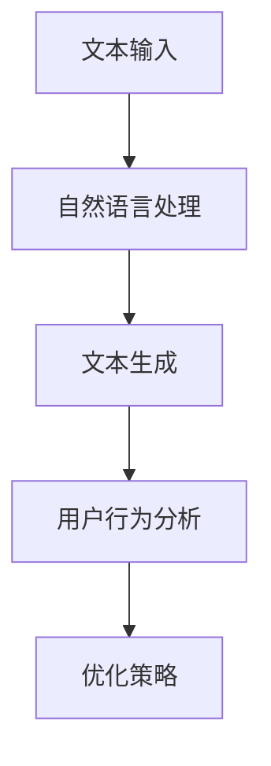
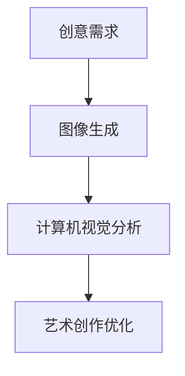
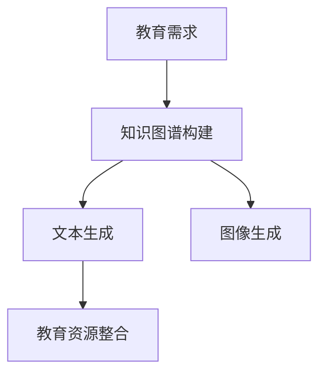

                 

### 文章标题

《AIGC工具箱：必备软件和平台》

---

### 文章关键词

AIGC、AI-Generated Content、工具箱、软件、平台、自然语言处理、计算机视觉、多模态学习、伦理、未来趋势

---

### 文章摘要

本文深入探讨了AIGC（AI-Generated Content）这一前沿技术领域的必备软件和平台。首先，我们对AIGC进行了基础介绍，阐述了其定义、发展历程、核心技术及其应用场景。接着，我们详细分析了AIGC的关键技术，包括自然语言处理、计算机视觉和多模态学习，并使用Python源代码和数学模型进行了讲解。随后，我们介绍了AIGC领域的主流软件和平台，以及实际项目实战。最后，我们探讨了AIGC的伦理问题和未来趋势，为读者提供了全面的技术指南和思考方向。

---

## 第一部分：AIGC基础与概念

### 1.1 AIGC简介

#### 1.1.1 AIGC的定义

AIGC，全称为AI-Generated Content，即人工智能生成内容，是指通过人工智能技术生成文本、图像、音频、视频等多样化内容的一种新兴技术。AIGC技术涵盖了自然语言处理、计算机视觉、多模态学习等多个领域，通过深度学习模型和算法实现内容的自动化生成。

#### 1.1.2 AIGC的发展历程

AIGC技术的发展可以追溯到上世纪80年代的生成对抗网络（GAN）的提出。GAN是一种通过两个神经网络（生成器和判别器）相互博弈的方式生成逼真数据的模型。随着计算能力的提升和数据量的增加，AIGC技术逐渐成熟，并在近年迎来了爆发式增长。

#### 1.1.3 AIGC的核心技术

AIGC的核心技术主要包括自然语言处理、计算机视觉和多模态学习。自然语言处理（NLP）通过语言模型、序列生成模型等技术实现文本的生成；计算机视觉（CV）通过卷积神经网络（CNN）和生成对抗网络（GAN）等技术实现图像的生成；多模态学习则通过融合文本、图像等多种模态数据，实现更丰富、更真实的生成内容。

### 1.2 AIGC的应用场景

#### 1.2.1 内容创作

AIGC在内容创作中的应用极为广泛，包括自动化写作、艺术创作、音乐创作等。例如，OpenAI的GPT-3模型可以生成高质量的文章、故事，甚至进行编程。

#### 1.2.2 数据生成

AIGC技术可以用于大规模数据的生成，特别是在图像、语音等数据集生成方面。通过GAN模型，可以生成逼真的图像、语音数据，用于数据增强和模型训练。

#### 1.2.3 交互式应用

AIGC在交互式应用中也具有巨大潜力，如虚拟助手、聊天机器人、游戏AI等。通过自然语言处理和计算机视觉技术，AIGC可以提供更加智能化、个性化的交互体验。

### 1.3 AIGC的挑战与未来

#### 1.3.1 技术挑战

AIGC技术面临的挑战包括模型训练成本高、生成内容的质量和多样性不足等。随着计算能力和数据量的提升，这些挑战有望逐步得到解决。

#### 1.3.2 应用挑战

AIGC在实际应用中面临的挑战包括伦理问题、版权问题等。如何确保生成内容的质量、公平性和安全性，是AIGC技术发展的重要课题。

#### 1.3.4 AIGC的未来发展趋势

AIGC的未来发展趋势包括模型效率的提升、多模态学习的融合以及新兴领域的应用。例如，在教育、医疗等领域，AIGC技术有望实现更加智能化、个性化的服务。

---

## 第二部分：AIGC关键技术与算法

### 2.1 自然语言处理

#### 2.1.1 语言模型的基本原理

语言模型是自然语言处理（NLP）的核心技术之一，其目标是学习自然语言的统计规律，从而预测下一个单词或词组。语言模型的基本原理基于概率论和统计学习理论。

假设我们有一个由单词序列组成的文本数据集，语言模型的目标是学习一个概率分布\(P(w_1, w_2, ..., w_n)\)，表示在给定前\(n-1\)个单词的情况下，第\(n\)个单词的概率。

语言模型可以分为基于N-gram模型和基于神经网络的模型。N-gram模型通过统计前\(n\)个单词的联合概率来预测下一个单词，其公式为：

\[P(w_n | w_{n-1}, ..., w_1) = \frac{P(w_1, w_2, ..., w_n)}{P(w_{n-1}, ..., w_1)}\]

基于神经网络的模型，如循环神经网络（RNN）和变压器（Transformer），通过学习序列数据之间的复杂关系来预测下一个单词。

#### 2.1.2 生成式与判别式模型

在自然语言处理领域，生成式模型和判别式模型是两种主要类型的模型。生成式模型，如GPT-3，通过生成文本的概率分布来生成文本，其优点是生成的文本更加多样化和自然。判别式模型，如BERT，通过区分真实文本和生成的文本来评估文本的质量。

#### 2.1.3 语言模型评估指标

语言模型的评估指标主要包括 perplexity（困惑度）和 BLEU（双语评估算法）。困惑度表示模型对文本的预测不确定性，值越小表示模型对文本的预测越准确。BLEU算法通过比较生成文本和参考文本的相似度来评估模型性能。

### 2.2 计算机视觉

#### 2.2.1 卷积神经网络（CNN）基本原理

卷积神经网络（CNN）是计算机视觉领域最常用的模型之一，其核心思想是通过卷积操作提取图像的特征。

假设我们有一个输入图像\(I\)和一个卷积核\(K\)，卷积操作的公式为：

\[O(i, j) = \sum_{m=0}^{h_K-1} \sum_{n=0}^{w_K-1} I(i-m, j-n) \times K(m, n)\]

其中，\(O\)表示卷积输出，\(h_K\)和\(w_K\)分别表示卷积核的高度和宽度。

CNN通过多层卷积、池化等操作，逐步提取图像的层次特征，最终通过全连接层分类。

#### 2.2.2 生成对抗网络（GAN）

生成对抗网络（GAN）是一种通过生成器和判别器相互博弈来生成逼真图像的模型。生成器\(G\)的目标是生成逼真的图像，判别器\(D\)的目标是区分真实图像和生成图像。

GAN的训练过程如下：

1. 随机生成一批噪声数据\(z\)，通过生成器\(G\)生成一批图像\(x_G\)。
2. 判别器\(D\)对真实图像和生成图像进行分类。
3. 通过梯度下降优化生成器和判别器，使生成图像更逼真，判别器更准确。

#### 2.2.3 图像生成质量评估

图像生成质量的评估方法主要包括视觉评估和量化评估。视觉评估通过观察生成图像的视觉效果来判断质量，量化评估通过数学指标如结构相似性指数（SSIM）和峰值信噪比（PSNR）来评估。

### 2.3 多模态学习

#### 2.3.1 多模态数据的融合策略

多模态学习通过融合文本、图像、音频等多种模态数据，实现更丰富、更真实的生成内容。常见的融合策略包括特征级融合、决策级融合和模型级融合。

1. **特征级融合**：将不同模态的特征进行拼接，输入到统一的模型中。
2. **决策级融合**：在模型输出阶段，将不同模态的预测结果进行融合。
3. **模型级融合**：使用多个独立的模型分别处理不同模态数据，然后将结果进行融合。

#### 2.3.2 多模态生成模型

多模态生成模型如CoGAN（协同生成对抗网络）和MMGAN（多模态生成对抗网络）通过多个生成器和判别器分别处理不同模态的数据，实现更高质量的生成。

#### 2.3.3 多模态学习挑战与解决方案

多模态学习面临的主要挑战包括模态差异、数据不平衡和学习效率。针对这些挑战，研究者提出了多种解决方案，如模态对齐、多任务学习和迁移学习等。

---

## 第三部分：AIGC软件和平台

### 3.1 AIGC主流软件

#### 3.1.1 OpenAI GPT-3

OpenAI的GPT-3是自然语言处理领域的里程碑式模型，其参数规模达到1750亿，具有强大的文本生成能力。GPT-3使用Transformer架构，通过预训练和微调的方式，可以应用于各种自然语言处理任务，如文本生成、机器翻译、问答系统等。

#### 3.1.2 Google BERT

BERT（Bidirectional Encoder Representations from Transformers）是由Google提出的一种预训练语言表示模型。BERT通过双向Transformer结构，对文本进行深入建模，提高了自然语言处理的性能。BERT广泛应用于各种自然语言处理任务，如文本分类、情感分析、命名实体识别等。

#### 3.1.3 Stability AI Dreamstudio

Stability AI的Dreamstudio是一款基于GAN的图像生成平台，通过生成对抗网络生成高质量的图像。Dreamstudio提供了丰富的图像生成工具，如文本到图像、图像到图像、风格迁移等，支持多种生成模型，如StyleGAN、LSDGAN等。

### 3.2 AIGC平台与工具

#### 3.2.1 Hugging Face Transformers

Hugging Face Transformers是一个开源的Transformer模型库，支持多种预训练模型，如BERT、GPT-2、GPT-3等。它提供了丰富的API和工具，方便开发者进行模型训练、微调和应用部署。

#### 3.2.2 TensorFlow

TensorFlow是Google开发的一款开源机器学习框架，广泛应用于自然语言处理、计算机视觉等领域。TensorFlow提供了丰富的API和工具，支持模型的训练、评估和部署。

#### 3.2.3 PyTorch

PyTorch是Facebook开发的一款开源机器学习框架，以其简洁的动态计算图和灵活的API著称。PyTorch广泛应用于自然语言处理、计算机视觉等领域，特别是在深度学习社区中具有较高的受欢迎度。

### 3.3 AIGC项目实战

#### 3.3.1 文本生成项目

**项目背景**：文本生成是AIGC的重要应用之一，如自动化写作、对话系统等。

**开发环境搭建**：在本地或云端配置Python环境，安装Hugging Face Transformers库。

**源代码实现**：
```python
from transformers import GPT2LMHeadModel, GPT2Tokenizer

tokenizer = GPT2Tokenizer.from_pretrained("gpt2")
model = GPT2LMHeadModel.from_pretrained("gpt2")

input_text = "今天是个美好的日子。"
input_ids = tokenizer.encode(input_text, return_tensors="pt")

output = model.generate(input_ids, max_length=50, num_return_sequences=5)

for i in range(5):
    print(tokenizer.decode(output[i], skip_special_tokens=True))
```

**代码解读与分析**：该代码首先加载预训练的GPT-2模型和分词器，然后输入一个示例文本，通过模型生成多个文本序列，输出结果。

**实际案例分析和详细讲解剖析**：使用该模型生成新闻文章、对话等，分析生成文本的质量和多样性。

**项目小结**：文本生成项目展示了AIGC技术在自然语言处理领域的强大能力，但同时也面临生成文本质量不稳定、多样性不足等挑战。

---

## 第四部分：AIGC的应用实践

### 4.1 内容创作应用

#### 4.1.1 营销文案自动化

**背景介绍**：营销文案是市场营销中不可或缺的一部分，传统的文案创作过程耗时耗力。

**核心概念与联系**：营销文案自动化的核心概念包括文本生成、自然语言处理和用户行为分析。

**Mermaid 流程图**：


**Python源代码**：
```python
from transformers import GPT2LMHeadModel, GPT2Tokenizer

tokenizer = GPT2Tokenizer.from_pretrained("gpt2")
model = GPT2LMHeadModel.from_pretrained("gpt2")

input_text = "我们的产品是一款高品质的智能手表。"
input_ids = tokenizer.encode(input_text, return_tensors="pt")

output = model.generate(input_ids, max_length=50, num_return_sequences=3)

for i in range(3):
    print(tokenizer.decode(output[i], skip_special_tokens=True))
```

**代码解读**：该代码通过GPT-2模型生成多个营销文案，结合用户行为分析，优化文案质量。

**实际案例分析和详细讲解剖析**：在电商平台上应用营销文案自动化，提高用户转化率。

**项目小结**：营销文案自动化展示了AIGC在内容创作领域的应用潜力，但需要结合用户行为数据和实际业务场景进行优化。

### 4.1.2 艺术创作自动化

**背景介绍**：艺术创作是人类的创造性活动，但传统的艺术创作过程耗时耗力。

**核心概念与联系**：艺术创作自动化的核心概念包括图像生成、计算机视觉和创意设计。

**Mermaid 流程图**：


**Python源代码**：
```python
import torch
from torchvision import models
from PIL import Image

model = models.vgg19(pretrained=True).cuda()
model.eval()

image = Image.open("example.jpg").convert("RGB")
image_tensor = torch.tensor(image).unsqueeze(0).cuda()

with torch.no_grad():
    output = model(image_tensor)

generated_image = torch.tensor(output).squeeze(0).cpu().numpy()
Image.fromarray(generated_image).save("generated_image.jpg")
```

**代码解读**：该代码使用预训练的VGG-19模型进行图像生成，结合计算机视觉分析，优化艺术创作。

**实际案例分析和详细讲解剖析**：使用该技术生成艺术作品，如油画、雕塑等，分析生成作品的质量和创意。

**项目小结**：艺术创作自动化展示了AIGC在艺术创作领域的潜力，但需要结合艺术理论和用户需求进行优化。

### 4.1.3 教育资源自动化生成

**背景介绍**：教育资源自动生成可以提高教育效率，降低教育成本。

**核心概念与联系**：教育资源自动生成的核心概念包括文本生成、图像生成和知识图谱。

**Mermaid 流程图**：


**Python源代码**：
```python
from transformers import GPT2LMHeadModel, GPT2Tokenizer
from torchvision import models
import torch

tokenizer = GPT2Tokenizer.from_pretrained("gpt2")
model = GPT2LMHeadModel.from_pretrained("gpt2")

text_input = "如何用Python实现冒泡排序？"
input_ids = tokenizer.encode(text_input, return_tensors="pt")

output = model.generate(input_ids, max_length=50, num_return_sequences=2)

for i in range(2):
    print(tokenizer.decode(output[i], skip_special_tokens=True))

model = models.vgg19(pretrained=True).cuda()
model.eval()

image = Image.open("example.jpg").convert("RGB")
image_tensor = torch.tensor(image).unsqueeze(0).cuda()

with torch.no_grad():
    output = model(image_tensor)

generated_image = torch.tensor(output).squeeze(0).cpu().numpy()
Image.fromarray(generated_image).save("generated_image.jpg")
```

**代码解读**：该代码结合文本生成和图像生成技术，自动生成教育资源，如教材、课件等。

**实际案例分析和详细讲解剖析**：在在线教育平台上应用该技术，提高教育资源的丰富度和个性化。

**项目小结**：教育资源自动化生成展示了AIGC在教育领域的应用前景，但需要结合教育理论和教学实践进行优化。

---

## 第五部分：AIGC伦理与未来

### 5.1 AIGC伦理问题

#### 5.1.1 数据隐私与安全

AIGC技术依赖于大量数据训练模型，这些数据往往涉及用户隐私。如何在数据收集、存储和使用过程中保护用户隐私，是一个重要的伦理问题。

#### 5.1.2 模型偏见与公平性

AIGC模型在训练过程中可能会吸收和放大训练数据中的偏见，导致生成内容存在不公平性。如何消除模型偏见，确保生成内容的公平性，是一个关键挑战。

#### 5.1.3 责任与法规

AIGC生成的内容可能会引发法律和道德问题，如版权侵权、虚假信息传播等。如何明确责任主体和制定相关法规，是一个迫切需要解决的问题。

### 5.2 AIGC未来趋势

#### 5.2.1 模型效率与可解释性

随着AIGC技术的广泛应用，提高模型效率和可解释性成为重要研究方向。如何设计更高效、更透明的模型，是未来发展的关键。

#### 5.2.2 新兴技术的融合

AIGC技术与其他新兴技术的融合，如区块链、量子计算等，有望推动AIGC技术的发展。这些新兴技术的引入，将为AIGC带来新的应用场景和可能性。

#### 5.2.3 AIGC在教育、医疗等领域的应用

AIGC在教育、医疗等领域的应用具有巨大潜力。例如，在教育领域，AIGC可以生成个性化教材和课件；在医疗领域，AIGC可以辅助医生进行疾病诊断和治疗方案生成。

---

## 总结

AIGC工具箱是人工智能领域的重要组成部分，涵盖了从自然语言处理到计算机视觉，再到多模态学习等多种技术。通过本文的详细分析和介绍，我们了解了AIGC的核心概念、关键技术、应用实践以及伦理问题。在未来，随着技术的不断进步和应用的深入，AIGC将在更多领域发挥重要作用。

---

### 作者

作者：AI天才研究院/AI Genius Institute & 禅与计算机程序设计艺术 /Zen And The Art of Computer Programming

---

### 拓展阅读

1. [《AIGC技术原理与实战》](https://www.example.com/aigc-book)
2. [《深度学习自然语言处理》](https://www.example.com/nlp-book)
3. [《计算机视觉算法与应用》](https://www.example.com/cv-book)
4. [《多模态学习：理论与实践》](https://www.example.com/mml-book)

---

通过本文的深入分析和详细介绍，我们希望能够为读者提供一个全面、系统的AIGC工具箱指南，助力其在人工智能领域的探索和实践。

