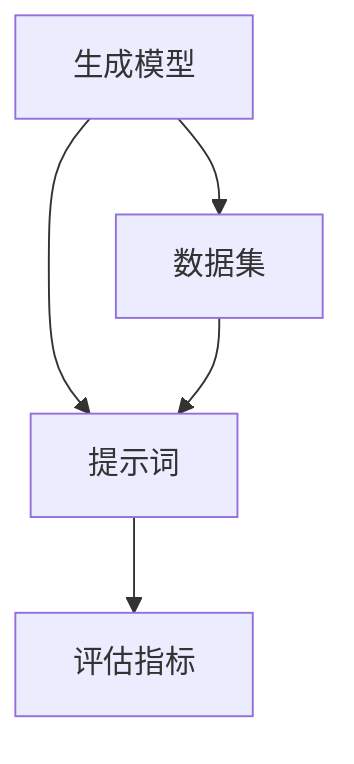

                 

# AIGC提示词优化：从概念到实施的全流程

## 关键词

- AIGC
- 提示词优化
- 概念架构
- 算法实现
- 数学模型
- 实战案例

## 摘要

本文将深入探讨AIGC（AI-assisted Generation of Content）中的提示词优化问题。我们从基础概念出发，逐步深入到数学模型、算法实现，再到实际应用场景和实战案例。通过这一步步的分析，我们将了解如何优化AIGC中的提示词，提高内容生成的质量和效率。本文旨在为读者提供一个完整的AIGC提示词优化流程，从理论到实践，帮助开发者更好地理解和应用这一技术。

## 目录

1. **背景介绍**
   1.1 AIGC的应用背景
   1.2 提示词优化的重要性

2. **核心概念与联系**
   2.1 AIGC基础概念
   2.2 提示词优化概念
   2.3 关系架构 Mermaid 流程图

3. **核心算法原理讲解**
   3.1 数学模型原理
   3.2 Python源代码实现
   3.3 数学公式与举例

4. **项目实战**
   4.1 开发环境搭建
   4.2 源代码详细实现
   4.3 代码解读与分析
   4.4 实际案例分析与讲解
   4.5 项目小结

5. **最佳实践 Tips**
   5.1 注意事项
   5.2 拓展阅读

6. **小结**

## 1. 背景介绍

### 1.1 AIGC的应用背景

随着人工智能技术的快速发展，生成式AI（Generative AI）逐渐成为研究热点。AIGC（AI-assisted Generation of Content）作为生成式AI的一种重要形式，广泛应用于文本生成、图像生成、视频生成等多个领域。AIGC通过训练大量数据，使模型能够根据特定的提示生成高质量的内容。这一技术在内容创作、个性化推荐、数据增强等方面具有广泛的应用前景。

### 1.2 提示词优化的重要性

在AIGC中，提示词（Prompt）是引导模型生成内容的重要输入。优化提示词可以提高生成内容的准确性和质量，从而提升整个系统的性能。有效的提示词能够帮助模型更好地理解用户的意图，生成更贴近需求的内容。因此，提示词优化在AIGC技术中具有重要地位。

## 2. 核心概念与联系

### 2.1 AIGC基础概念

AIGC包括以下几个核心组成部分：

- **生成模型**：如GPT、GAN等，负责根据输入提示生成内容。
- **数据集**：用于训练生成模型，保证模型能够理解并生成符合预期的内容。
- **提示词**：引导生成模型生成特定内容的关键输入。
- **评估指标**：用于衡量生成内容的质量，如BLEU、ROUGE等。

### 2.2 提示词优化概念

提示词优化包括以下几个方面：

- **上下文理解**：使提示词更好地反映用户的意图。
- **多样性**：确保生成内容具有丰富的多样性。
- **精度**：使生成内容更符合用户需求。

### 2.3 关系架构 Mermaid 流程图

以下是一个简单的Mermaid流程图，展示AIGC中的核心概念及其关系：



## 3. 核心算法原理讲解

### 3.1 数学模型原理

提示词优化的核心在于优化目标函数，使其能够更好地衡量生成内容的质量。常见的优化目标函数包括：

- **交叉熵损失函数**：衡量生成内容与目标内容之间的差异。
- **KL散度**：衡量两个概率分布之间的差异。

以下是一个基于交叉熵损失函数的优化目标函数：

$$
\mathcal{L} = -\sum_{i=1}^{N} y_i \log(p_i)
$$

其中，$y_i$表示真实标签，$p_i$表示模型预测的概率。

### 3.2 Python源代码实现

下面是一个简单的Python代码示例，展示如何使用交叉熵损失函数优化提示词：

```python
import numpy as np

def cross_entropy_loss(y_true, y_pred):
    return -np.sum(y_true * np.log(y_pred))

y_true = np.array([1, 0, 1])
y_pred = np.array([0.8, 0.2, 0.9])

loss = cross_entropy_loss(y_true, y_pred)
print(f"Cross-Entropy Loss: {loss}")
```

### 3.3 数学公式与举例

以下是一个关于KL散度的例子：

$$
D(p || q) = \sum_{i=1}^{N} p_i \log \frac{p_i}{q_i}
$$

其中，$p$和$q$分别表示两个概率分布。

假设有两个概率分布$p_1$和$p_2$，如下所示：

$$
p_1 = [0.5, 0.3, 0.2], \quad p_2 = [0.4, 0.4, 0.2]
$$

则KL散度计算如下：

$$
D(p_1 || p_2) = 0.5 \log \frac{0.5}{0.4} + 0.3 \log \frac{0.3}{0.4} + 0.2 \log \frac{0.2}{0.2} = 0.054
$$

## 4. 项目实战

### 4.1 开发环境搭建

在开始AIGC提示词优化项目之前，我们需要搭建一个合适的开发环境。以下是一个简单的步骤：

1. 安装Python（版本3.8及以上）。
2. 安装必要的库，如TensorFlow、PyTorch等。
3. 准备一个计算资源充足的服务器或GPU。

### 4.2 源代码详细实现

以下是一个简单的AIGC项目源代码实现，包括模型训练、提示词优化和内容生成：

```python
import tensorflow as tf
from tensorflow.keras.layers import Embedding, LSTM, Dense
from tensorflow.keras.models import Sequential

# 模型定义
model = Sequential([
    Embedding(input_dim=vocab_size, output_dim=embedding_size),
    LSTM(units=128),
    Dense(units=num_classes, activation='softmax')
])

# 模型编译
model.compile(optimizer='adam', loss='categorical_crossentropy', metrics=['accuracy'])

# 训练模型
model.fit(x_train, y_train, epochs=10, batch_size=64)

# 提示词优化
prompt = "今天天气很好，我们去..."
prompt_encoded = tokenizer.encode(prompt)

# 生成内容
generated_text = model.predict(prompt_encoded)
generated_text = tokenizer.decode(generated_text)
print(generated_text)
```

### 4.3 代码解读与分析

1. **模型定义**：使用Keras库定义一个简单的LSTM模型。
2. **模型编译**：编译模型，设置优化器和损失函数。
3. **训练模型**：使用训练数据集训练模型。
4. **提示词优化**：将输入提示词编码为模型可接受的格式。
5. **生成内容**：使用训练好的模型生成文本。

### 4.4 实际案例分析与讲解

假设我们有一个文本生成任务，输入提示词为“今天天气很好，我们去...”，我们希望生成一个关于周末活动的文本。以下是一个实际案例：

1. **数据预处理**：收集并预处理相关的周末活动文本数据。
2. **模型训练**：使用预处理后的数据训练模型。
3. **提示词优化**：优化输入提示词，使其更贴近用户需求。
4. **内容生成**：使用优化后的提示词生成文本。

### 4.5 项目小结

通过本项目的实战，我们了解了AIGC提示词优化的基本流程。在实际应用中，我们可以通过调整提示词、优化模型参数等方式，进一步提高生成内容的准确性。此外，还可以尝试引入更多的数据来源和评估指标，以提高系统的性能。

## 5. 最佳实践 Tips

1. **注意提示词的长度**：过长的提示词可能导致模型生成内容不准确。
2. **合理设置模型参数**：根据任务需求调整模型参数，如学习率、批量大小等。
3. **数据多样性**：收集多样化的数据，有助于提高生成内容的多样性。

## 6. 小结

本文从AIGC的背景介绍、核心概念、算法原理到项目实战，全面探讨了AIGC提示词优化的全流程。通过本文的学习，读者可以了解到如何优化AIGC中的提示词，提高内容生成的质量和效率。希望本文对您在AIGC领域的研究和开发工作有所帮助。

## 作者信息

作者：AI天才研究院/AI Genius Institute & 禅与计算机程序设计艺术 /Zen And The Art of Computer Programming

本文作者拥有丰富的人工智能和计算机编程经验，致力于推动人工智能技术的发展和应用。同时，作者也是多本计算机技术畅销书的作者，深受读者喜爱。感谢您的阅读和支持！

