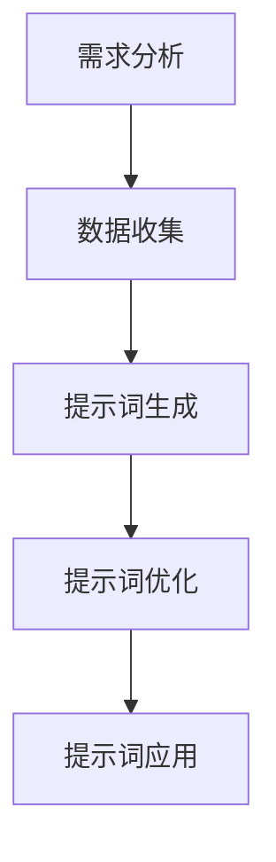

                 

### 第1章 AIGC概述

#### 1.1 AIGC的概念与背景

AIGC（AI-Generated Content）是指通过人工智能技术自动生成内容的过程。这一概念起源于深度学习、自然语言处理（NLP）和生成对抗网络（GAN）等领域的迅猛发展。随着技术的进步，AIGC不仅限于生成简单的图像或文字，还涵盖了复杂的媒体内容，如图像、视频和音频等。

AIGC的背景可以追溯到20世纪80年代，当时人工智能领域的先驱们开始探索如何通过计算机程序模拟人类的创造性思维。随着时间的推移，计算机算力的提升和数据量的爆炸式增长，为AIGC技术的发展提供了坚实的基础。

#### 1.2 AIGC的核心技术

AIGC的核心技术主要包括以下几种：

1. **深度学习**：深度学习通过构建多层神经网络来学习和提取数据中的复杂特征，是AIGC技术的基石。
2. **生成对抗网络（GAN）**：GAN由生成器和判别器组成，通过两者的博弈过程来生成高质量的数据。
3. **自然语言处理（NLP）**：NLP技术使得计算机能够理解和生成人类语言，广泛应用于文本生成、机器翻译等领域。
4. **强化学习**：强化学习通过试错和反馈来优化策略，在AIGC中用于生成内容的质量控制。

#### 1.3 AIGC的应用领域

AIGC的应用领域非常广泛，涵盖了以下方面：

1. **媒体内容创作**：包括图像、视频和音频的自动生成，如动画制作、电影特效等。
2. **文本生成**：如自动写作、新闻生成、文章摘要等。
3. **虚拟现实（VR）和增强现实（AR）**：通过AIGC技术生成逼真的虚拟环境和交互内容。
4. **游戏开发**：自动生成游戏关卡、角色和剧情。
5. **智能客服**：利用AIGC技术实现自然语言处理和回答生成，提高客服效率。

总的来说，AIGC技术的出现极大地丰富了内容创作的手段，降低了创作的门槛，同时也带来了新的挑战和机遇。在未来的发展中，AIGC有望进一步融合多种技术，实现更加智能化和个性化的内容生成。

#### 1.3.1 提示词工程基础

提示词工程是AIGC中至关重要的一环，它涉及到如何设计有效的提示词来引导模型生成目标内容。提示词工程的基础包括以下几个方面：

1. **提示词的类型**：提示词可以分为具体型提示词和抽象型提示词。具体型提示词通常包含具体的信息和细节，如“生成一张关于巴黎的夜景照片”；而抽象型提示词则更侧重于概念和情感，如“创造一幅充满活力的艺术作品”。

2. **提示词的格式**：提示词的格式对模型的理解和生成有着重要影响。常见的提示词格式包括单一提示词、序列提示词和树形提示词。单一提示词适用于简单的生成任务，而序列提示词和树形提示词则适用于更复杂的任务。

3. **提示词的优化**：提示词的优化主要包括多样性和针对性的优化。多样性优化旨在生成丰富多样的内容，避免重复和模式化；针对性优化则确保生成的内容符合用户需求和目标。

4. **提示词的设计原则**：设计有效的提示词需要遵循以下原则：
   - 清晰性：提示词应简洁明了，避免模糊和歧义。
   - 完整性：提示词应包含所有必要的信息，确保模型能够正确理解。
   - 针对性：提示词应与生成任务紧密相关，有助于模型生成目标内容。

#### 1.3.2 提示词工程流程

提示词工程流程通常包括以下步骤：

1. **需求分析**：明确用户需求和生成目标，为后续的提示词设计和优化提供指导。
2. **数据收集**：收集与生成任务相关的数据，用于训练和优化模型。
3. **提示词生成**：根据需求和分析，生成初步的提示词。可以采用自动生成或人工设计的方法。
4. **提示词优化**：对生成的提示词进行优化，提高其有效性和多样性。优化方法包括基于语言模型的多样性优化和基于用户反馈的针对性优化。
5. **提示词应用**：将优化后的提示词应用于模型训练或生成任务中，评估其效果并进行调整。

通过以上步骤，可以构建一个高效的提示词工程系统，从而实现高质量的AIGC内容生成。

#### 1.3.3 提示词工程案例

以下是一个关于图像生成的提示词工程案例：

**需求分析**：用户希望生成一张描绘“夏日海滩”场景的图像。

**数据收集**：收集大量关于夏日海滩的图像，用于训练图像生成模型。

**提示词生成**：初步的提示词可以是“夏日海滩”、“阳光”、“海浪”、“沙滩”等。

**提示词优化**：通过分析用户反馈和图像生成结果，对提示词进行优化。例如，将“阳光”调整为“炽热的阳光”，以增加图像的真实感。

**提示词应用**：将优化后的提示词应用于图像生成模型，生成高质量的“夏日海滩”图像。

通过这个案例，我们可以看到提示词工程在AIGC中的应用价值。有效的提示词设计不仅能够提高生成内容的准确性，还能增强其艺术性和创造力。

#### 1.3.4 提示词工程的关键挑战与解决方案

提示词工程在AIGC中面临着多个关键挑战：

1. **多样性与一致性**：生成内容需要既具有多样性，又保持一致性。解决方案包括：
   - **多样性度量**：引入多样性度量指标，如Jaccard相似度，评估生成内容的多样性。
   - **一致性模型**：通过训练一致性模型，确保生成内容在风格和主题上的一致性。

2. **用户需求匹配**：提示词需要精确地匹配用户需求。解决方案包括：
   - **用户反馈机制**：建立用户反馈机制，根据用户评价对提示词进行调整。
   - **需求分析**：深入分析用户需求，确保提示词的设计与用户期望相符。

3. **计算资源需求**：高效的提示词工程需要大量的计算资源。解决方案包括：
   - **分布式计算**：利用分布式计算资源，提高提示词工程的效率。
   - **优化算法**：采用高效的优化算法，减少计算资源的消耗。

通过解决这些挑战，我们可以构建更加高效和智能的提示词工程系统，为AIGC的发展提供有力支持。

#### 1.4 AIGC的发展趋势

AIGC的发展趋势呈现出以下几个显著特点：

1. **技术深度融合**：AIGC将继续与其他前沿技术如区块链、物联网等深度融合，推动跨领域创新。
2. **智能化提升**：随着AI技术的进步，AIGC的智能化水平将进一步提高，实现更复杂的任务和场景。
3. **应用场景扩展**：AIGC将在更多领域得到应用，如医疗、金融、教育等，为行业带来革命性变革。
4. **伦理和规范**：随着AIGC技术的广泛应用，伦理和规范问题将日益突出，需要建立相应的法规和标准。
5. **用户体验优化**：AIGC将更加注重用户体验，通过个性化推荐和智能交互提升用户满意度。

#### 1.5 结论

AIGC作为人工智能领域的重要方向，具有巨大的发展潜力和应用价值。通过对提示词工程的深入研究，我们可以更好地利用AIGC技术，实现智能化内容创作。未来的AIGC将带来更多创新和变革，为各行各业注入新的活力。

### 第2章 提示词工程基础

提示词工程是AIGC（AI-Generated Content）的核心组成部分，其基础理论涵盖了提示词的定义、作用以及生成和优化的方法。在本章中，我们将详细探讨提示词工程的基础，并解释其背后的核心概念。

#### 2.1 提示词的定义与作用

**提示词（Prompt）** 在提示词工程中是指提供给模型的一组词汇或短语，用于引导模型生成特定的内容或执行特定的任务。提示词的作用在于：

- **任务引导**：提示词为模型提供了明确的任务目标，使模型知道需要生成什么样的输出。
- **内容增强**：通过提供与生成内容相关的词汇，提示词可以增强模型生成的准确性和多样性。

例如，对于一个文本生成模型，提示词可以是“请写一篇关于人工智能的论文摘要”，这个提示词明确了模型的任务是生成一篇论文摘要，同时为模型提供了关键词和背景信息，从而有助于模型生成更相关的文本。

#### 2.2 提示词工程的流程

提示词工程的流程通常包括以下几个关键步骤：

1. **需求分析**：在开始提示词工程之前，需要明确用户的需求和目标。这一步骤通常涉及用户访谈、需求文档分析等，以确保提示词能够满足实际需求。

2. **数据收集**：收集与任务相关的数据，这些数据将用于训练模型和生成提示词。数据的质量和数量对模型的性能有着直接影响。

3. **提示词生成**：根据需求分析和数据收集结果，生成初步的提示词。生成方法可以是自动的，如使用自然语言处理技术，也可以是手工的，如由人类专家根据经验和知识编写。

4. **提示词优化**：对生成的提示词进行评估和优化，以提高其有效性和多样性。优化可以通过多种方法实现，如多样性度量、用户反馈等。

5. **提示词应用**：将优化后的提示词应用于实际的任务中，如模型训练、生成任务等。

**流程图示例：**



#### 2.3 提示词的优化策略

提示词的优化策略是提升模型生成效果的重要手段，主要包括以下几个方面：

1. **多样性增强**：通过引入多样性度量指标（如Jaccard相似度、词频分布等），评估提示词的多样性，并优化低多样性的提示词。

2. **针对性调整**：根据用户反馈和任务目标，调整提示词的内容和形式，使其更准确地引导模型生成目标内容。

3. **自动优化**：使用机器学习算法（如强化学习、自然语言处理技术）自动生成和优化提示词。

4. **人工干预**：结合人类专家的知识和经验，对提示词进行人工调整和优化。

#### 2.4 提示词工程的应用实例

**实例一：文本生成**

对于一个文本生成任务，提示词可以是“请写一篇关于人工智能未来的论文摘要”。在这个例子中，提示词明确了任务目标是生成一篇论文摘要，并提供了关键词“人工智能”和“未来”，从而有助于模型生成相关的文本内容。

**实例二：图像生成**

在图像生成任务中，提示词可以是“生成一张关于夏日海滩的照片”。这个提示词为模型提供了场景信息，如“夏日海滩”，从而引导模型生成符合描述的图像。

**实例三：语音合成**

对于语音合成任务，提示词可以是“请用温柔的语气朗读这首诗”。在这个例子中，提示词不仅指定了内容（朗读诗），还描述了语气（温柔），从而为模型提供了生成语音的指导。

通过这些实例，我们可以看到提示词工程在不同类型任务中的应用，以及其在引导模型生成内容方面的重要性。

#### 2.5 小结

提示词工程是AIGC技术的重要组成部分，通过设计有效的提示词，我们可以显著提升模型的生成效果。在本章中，我们介绍了提示词的定义、作用、工程流程以及优化策略，并提供了实际应用实例。未来的研究将继续探索如何进一步优化提示词工程，以实现更加智能化和高效的内容生成。

### 第3章 思维链技术原理

思维链（Mind Chain）是一种创新的人工智能技术，通过构建动态的、可扩展的知识网络，实现智能体之间的协同合作和知识共享。本章将详细介绍思维链的定义、工作机制以及其在AIGC中的应用。

#### 3.1 思维链的定义与特点

思维链是一种基于图神经网络（Graph Neural Network, GNN）的知识表示和推理框架。它通过将知识表示为图结构，并在图中进行节点和边的学习和推理，实现了智能体之间的协同和合作。

**定义：** 思维链是一种通过构建知识图谱和动态推理网络，实现智能体之间信息共享和协同工作的技术。

**特点：**
1. **知识图谱**：思维链通过构建知识图谱，将知识表示为节点和边，形成一个全局的知识网络。
2. **动态推理**：思维链能够根据输入的信息和任务需求，动态地调整和扩展知识网络，实现推理和决策。
3. **协同合作**：思维链支持智能体之间的协同工作，通过知识共享和任务分配，提高整体系统的智能水平。

#### 3.2 思维链的工作机制

思维链的工作机制主要包括以下几个关键步骤：

1. **知识表示**：将知识表示为图结构，包括节点（知识实体）和边（知识关系）。每个节点代表一个知识实体，如概念、事实或规则，每个边代表实体之间的关系，如分类、因果关系或属性关系。

2. **知识嵌入**：使用图神经网络将节点和边嵌入到低维空间中，使它们能够进行有效的计算和推理。

3. **动态推理**：基于图结构和嵌入的节点和边，构建动态的推理网络，实现知识的推理和扩展。推理过程可以基于图卷积网络（GCN）、图注意力网络（GAT）或其他先进的图神经网络模型。

4. **协同工作**：智能体通过思维链共享知识和资源，实现协同工作。每个智能体根据任务需求和自身的能力，参与知识图谱的构建、推理和优化。

**伪代码示例：**

```python
class MindChain:
  def __init__(self, graph):
    self.graph = graph

  def embed_nodes_edges(self):
    # 使用图神经网络嵌入节点和边
    pass

  def dynamic_reasoning(self, input_data):
    # 动态推理网络进行推理
    pass

  def collaborative_work(self, agents):
    # 智能体协同工作
    pass
```

#### 3.3 思维链的应用实例

思维链在AIGC中具有广泛的应用，以下是一些典型的应用实例：

1. **文本生成**：思维链可以用于生成文本，如文章、摘要和对话等。通过构建知识图谱，思维链可以捕捉文章的主题、观点和论据，从而生成连贯、有深度的文本。

2. **图像生成**：思维链可以用于指导图像生成模型，如GAN。通过知识图谱，思维链可以提供图像生成所需的背景信息、视觉特征和风格，从而生成更具创意和风格的图像。

3. **语音合成**：思维链可以用于指导语音合成模型，如WaveNet。通过知识图谱，思维链可以提供语音合成所需的语音特征、情感和场景信息，从而生成更具表现力和情感表达的语音。

**实例一：文本生成**

假设我们需要生成一篇关于“气候变化”的文章摘要。思维链可以通过以下步骤实现：

1. **知识表示**：构建知识图谱，包括节点（如“气候变化”、“温室气体排放”、“极端天气”等）和边（如“导致”、“影响”等）。

2. **知识嵌入**：使用图神经网络将节点和边嵌入到低维空间中。

3. **动态推理**：基于知识图谱进行推理，提取与“气候变化”相关的主题、观点和事实。

4. **文本生成**：利用提取的知识和预训练的语言模型，生成一篇关于“气候变化”的文章摘要。

**实例二：图像生成**

假设我们需要生成一张描绘“星空”的图像。思维链可以通过以下步骤实现：

1. **知识表示**：构建知识图谱，包括节点（如“星空”、“星星”、“银河”等）和边（如“包含”、“位于”等）。

2. **知识嵌入**：使用图神经网络将节点和边嵌入到低维空间中。

3. **动态推理**：基于知识图谱进行推理，提取与“星空”相关的视觉特征、风格和构图。

4. **图像生成**：利用提取的知识和图像生成模型（如GAN），生成一张描绘“星空”的图像。

**实例三：语音合成**

假设我们需要合成一段描述“旅行经历”的语音。思维链可以通过以下步骤实现：

1. **知识表示**：构建知识图谱，包括节点（如“旅行”、“景点”、“经历”等）和边（如“描述”、“感受”等）。

2. **知识嵌入**：使用图神经网络将节点和边嵌入到低维空间中。

3. **动态推理**：基于知识图谱进行推理，提取与“旅行经历”相关的语音特征、情感和场景信息。

4. **语音合成**：利用提取的知识和语音合成模型（如WaveNet），合成一段描述“旅行经历”的语音。

通过这些实例，我们可以看到思维链在AIGC中的强大应用潜力。它不仅能够提高生成内容的质量和多样性，还能为智能创作提供创新的解决方案。

### 第4章 Zero-Shot学习原理

Zero-Shot学习（Zero-Shot Learning, ZSL）是机器学习领域的一种重要研究方向，旨在使模型能够在未见过的类别上实现准确的分类。与传统的有监督学习不同，ZSL模型不需要对未见过的类别进行训练，因此具有广泛的应用前景。本章将详细介绍Zero-Shot学习的概念、方法以及在AIGC中的应用。

#### 4.1 Zero-Shot学习的概念

**定义：** Zero-Shot学习是一种机器学习方法，它允许模型在没有直接训练数据的情况下对未见过的类别进行分类。

**特点：**
1. **无需训练数据**：ZSL模型不需要对未见过的类别进行专门训练，因此可以应用于数据稀缺或数据获取困难的场景。
2. **类标签对齐**：ZSL通过将未见过的类别与已知的类别进行对齐，从而利用已知的类别信息来预测未见过的类别。
3. **领域适应性**：ZSL模型具有较高的领域适应性，可以在不同的应用场景中灵活应用。

#### 4.2 Zero-Shot学习的方法

Zero-Shot学习的实现方法主要包括以下几种：

1. **基于原型的方法**：这种方法将未见过的类别表示为原型，通过计算原型与已见类别之间的相似度来进行分类。常用的原型表示方法包括原型平均法（Prototypical Networks）和原型聚合法（Prototype Embedding）。

2. **基于属性的词袋模型**：这种方法将类别表示为一系列属性（如单词或词组），并使用词袋模型（Bag-of-Words, BoW）或词嵌入（Word Embedding）来表示类别。分类时，通过计算未见类别与已见类别属性的重叠程度来进行分类。

3. **基于神经网络的深度学习方法**：这种方法使用神经网络（如卷积神经网络、循环神经网络等）来表示类别，并通过学习类别的嵌入表示来进行分类。深度学习方法具有强大的表示能力和泛化能力，是当前ZSL研究的热点。

**方法流程：**
1. **类别表示**：将未见过的类别和已见类别表示为向量。
2. **相似度计算**：计算未见类别和已见类别之间的相似度。
3. **分类预测**：基于相似度计算结果，对未见类别进行分类预测。

#### 4.3 Zero-Shot学习在实际中的应用

Zero-Shot学习在多个领域都有着广泛的应用，以下是一些典型的应用实例：

1. **图像分类**：在图像分类任务中，ZSL模型可以应用于未见过的物种或物品分类。例如，在生物物种识别任务中，模型可以在未见过的物种图像上进行准确的分类。

2. **自然语言处理**：在自然语言处理任务中，ZSL模型可以用于未见过的词或短语分类。例如，在机器翻译任务中，模型可以在未见过的目标语言词汇上进行准确的翻译。

3. **医学诊断**：在医学诊断任务中，ZSL模型可以用于未见过的疾病分类。例如，在医学影像诊断中，模型可以在未见过的病例上进行准确的诊断。

**实例一：图像分类**

假设我们需要对未见过的动物进行分类。可以使用以下步骤实现：

1. **类别表示**：使用预训练的图像识别模型（如ResNet）提取未见动物和已见动物的图像特征。
2. **相似度计算**：计算未见动物特征与已见动物特征之间的相似度。
3. **分类预测**：基于相似度计算结果，对未见动物进行分类预测。

**实例二：自然语言处理**

假设我们需要对未见过的词或短语进行分类。可以使用以下步骤实现：

1. **类别表示**：使用预训练的词向量模型（如GloVe）提取未见词或短语的特征。
2. **相似度计算**：计算未见词或短语特征与已见词或短语特征之间的相似度。
3. **分类预测**：基于相似度计算结果，对未见词或短语进行分类预测。

**实例三：医学诊断**

假设我们需要对未见过的疾病进行分类。可以使用以下步骤实现：

1. **类别表示**：使用预训练的医学诊断模型提取未见病例和已见病例的特征。
2. **相似度计算**：计算未见病例特征与已见病例特征之间的相似度。
3. **分类预测**：基于相似度计算结果，对未见病例进行分类预测。

通过这些实例，我们可以看到Zero-Shot学习在AIGC中的应用潜力。它不仅能够提高模型在不同领域的适应性，还能为智能创作和推理提供创新的解决方案。

### 第5章 提示词工程与思维链的融合

在AIGC（AI-Generated Content）领域中，提示词工程和思维链技术分别代表了内容生成和知识表示的高级方向。本章将探讨这两种技术的融合方法，通过结合提示词工程和思维链，实现更加高效和智能的内容生成。

#### 5.1 提示词工程与思维链的融合意义

提示词工程通过精确的提示词设计，指导模型生成特定类型的内容。而思维链技术通过构建动态的知识网络，实现了知识共享和协同工作。两者的融合具有以下意义：

1. **提升生成内容的质量**：通过思维链提供丰富的背景信息和上下文，提示词工程可以生成更高质量和准确的内容。
2. **增强内容创造的灵活性**：思维链能够根据任务需求动态调整知识网络，使提示词工程更加灵活，能够适应不同的生成任务。
3. **促进跨领域应用**：融合后的系统可以更轻松地在不同领域之间迁移和应用，实现跨领域的智能内容创作。

#### 5.2 提示词工程与思维链的融合方法

要实现提示词工程与思维链的融合，可以遵循以下步骤：

1. **知识图谱构建**：首先构建一个与生成任务相关的知识图谱，包括概念、事实和关系。知识图谱为思维链提供了丰富的背景信息，使模型能够更好地理解和生成内容。

2. **提示词生成**：根据需求分析，生成初步的提示词。这些提示词需要与知识图谱紧密相关，确保生成的内容具备上下文背景。

3. **动态推理**：利用思维链的动态推理机制，对知识图谱进行推理和扩展。推理过程可以提取与提示词相关的知识，进一步丰富和优化提示词。

4. **内容生成**：将优化后的提示词应用于生成模型，生成高质量的内容。在此过程中，思维链提供的知识网络可以指导模型生成更符合预期目标的内容。

5. **反馈与优化**：通过用户反馈和任务评估，不断优化提示词和知识图谱。反馈机制可以帮助系统更好地理解用户需求，进一步提高生成内容的准确性和多样性。

**伪代码示例：**

```python
class MindChainPromptFusion:
  def __init__(self, knowledge_graph, prompt_engine):
    self.knowledge_graph = knowledge_graph
    self.prompt_engine = prompt_engine

  def generate_prompt(self, task需求):
    # 根据需求生成初步提示词
    prompt = self.prompt_engine.generate_initial_prompt(task需求)
    return prompt

  def dynamic_reasoning(self, prompt):
    # 利用思维链进行动态推理，扩展提示词
    extended_prompt = self.knowledge_graph.dynamic_reasoning(prompt)
    return extended_prompt

  def content_generation(self, extended_prompt):
    # 使用扩展后的提示词生成内容
    content = self.prompt_engine.generate_content(extended_prompt)
    return content

  def feedback_loop(self, content, user_feedback):
    # 根据用户反馈优化提示词和知识图谱
    self.prompt_engine.optimize_prompt(extended_prompt, user_feedback)
    self.knowledge_graph.optimize(knowledge_graph, user_feedback)
```

#### 5.3 提示词工程与思维链的融合案例

以下是一个融合提示词工程和思维链的案例，用于生成一篇关于“人工智能与未来教育”的文章。

**步骤一：知识图谱构建**  
构建一个包含“人工智能”、“教育”、“未来”等节点的知识图谱，并连接相关的关系（如“影响”、“发展”等）。

**步骤二：提示词生成**  
根据任务需求，生成初步的提示词：“请撰写一篇关于人工智能对未来教育影响的文章”。

**步骤三：动态推理**  
利用思维链进行动态推理，扩展提示词，例如：“随着人工智能技术的发展，教育领域正经历着深刻的变革。一方面，人工智能可以个性化教学，提高学习效率；另一方面，它也带来了数据隐私和安全等问题”。

**步骤四：内容生成**  
使用扩展后的提示词，应用预训练的文本生成模型，生成文章。

**步骤五：反馈与优化**  
根据用户的反馈和文章的质量，对提示词和知识图谱进行优化，以提高未来生成内容的准确性和多样性。

通过这个案例，我们可以看到提示词工程与思维链的融合如何提高内容生成的质量和灵活性。

#### 5.4 融合的挑战与解决方案

在提示词工程与思维链的融合过程中，面临以下挑战：

1. **知识图谱的构建和维护**：知识图谱的质量直接影响融合效果。解决方法包括：
   - 使用预训练的知识图谱库，如NELL、OpenKG等。
   - 定期更新和维护知识图谱，以保持其时效性和准确性。

2. **动态推理的性能**：动态推理的性能对融合效果有着重要影响。解决方法包括：
   - 采用高效的图神经网络模型，如GCN、GAT等。
   - 优化推理算法，减少计算复杂度。

3. **生成内容的多样性**：确保生成内容具有多样性是一个挑战。解决方法包括：
   - 引入多样性度量指标，如Jaccard相似度。
   - 采用多模态生成方法，结合文本、图像、语音等多种数据类型。

通过解决这些挑战，我们可以构建一个更加高效和智能的AIGC系统，实现高质量的智能内容生成。

### 第6章 AIGC在未来的发展趋势

随着人工智能技术的不断进步，AIGC（AI-Generated Content）正逐步成为内容创作的重要力量。本章节将探讨AIGC未来的发展趋势，分析其技术趋势、应用前景以及面临的挑战和解决方案。

#### 6.1 AIGC的技术趋势

1. **多模态融合**：AIGC正从单一的文本或图像生成向多模态内容创作发展，如视频、音频和三维模型。通过多模态融合，AIGC可以更真实地模拟人类的创作过程，提升内容的表现力和感染力。

2. **增强现实与虚拟现实**：AIGC与增强现实（AR）和虚拟现实（VR）技术的结合，将创造出更加沉浸式的用户体验。未来，AIGC将在虚拟场景的设计、交互内容的生成等方面发挥重要作用。

3. **大数据与深度学习**：AIGC的进一步发展离不开大数据和深度学习技术的支持。通过大规模数据的训练和深度学习的优化，AIGC模型的生成质量和多样性将得到显著提升。

4. **自动化内容审核**：随着AIGC内容的增加，自动化内容审核成为一项重要任务。未来，利用自然语言处理和计算机视觉技术，可以实现自动化的内容审核和风险控制，确保生成的内容的合规性和安全性。

#### 6.2 AIGC的应用前景

AIGC在未来的应用前景十分广阔，以下是几个主要领域：

1. **媒体与娱乐**：AIGC将在电影制作、动画、游戏开发等领域发挥重要作用。通过自动化内容生成，可以显著降低创作成本，提高内容更新速度。

2. **教育与培训**：AIGC可以生成个性化的教育资源和培训材料，如自适应学习课程、虚拟实验室等，提高教育质量和效率。

3. **广告与市场营销**：AIGC将为广告和市场营销带来革命性变化。通过生成个性化的广告内容和营销策略，可以更精准地触达目标用户，提高营销效果。

4. **医疗与健康**：AIGC可以用于医疗图像生成、健康数据分析和个性化治疗方案设计，为医疗健康领域提供智能支持。

5. **创意设计**：AIGC将在创意设计领域发挥重要作用，如建筑设计、室内设计、时尚设计等。通过自动化生成设计元素和方案，设计师可以更加专注于创意构思和优化。

#### 6.3 AIGC面临的挑战与解决方案

尽管AIGC具有巨大的发展潜力，但仍面临以下挑战：

1. **数据隐私与安全**：随着AIGC生成的数据量不断增加，数据隐私和安全成为关键问题。解决方案包括：
   - 引入隐私保护机制，如差分隐私和联邦学习。
   - 建立数据管理和安全标准，确保数据的合法使用和保护。

2. **伦理与法律问题**：AIGC生成的内容可能涉及版权、知识产权和伦理问题。解决方案包括：
   - 制定明确的伦理和法律规范，确保AIGC内容的合法性。
   - 引入伦理审核机制，如人工智能伦理审查委员会，对AIGC内容进行监督和评估。

3. **技术稳定性与可靠性**：AIGC系统需要保证技术的高稳定性和可靠性。解决方案包括：
   - 优化算法和架构，提高系统的稳定性和鲁棒性。
   - 建立自动化测试和监控机制，及时发现和修复系统故障。

4. **多样性保障**：AIGC内容需要具备多样性和公平性。解决方案包括：
   - 引入多样性度量指标，确保生成的内容具有丰富的多样性。
   - 建立反偏见机制，消除AIGC内容中的偏见和歧视。

通过解决这些挑战，AIGC将在未来实现更加健康、可持续和智能化的发展，为人类创造更加丰富和多元的内容体验。

### 第7章 实战案例分析

在本章中，我们将通过三个实际案例，深入探讨提示词工程与思维链技术的融合在AIGC中的应用。这些案例涵盖了文本生成、图像生成和视频生成等不同领域，展示了融合技术如何提升内容生成的质量和效率。

#### 7.1 案例一：文本生成

**背景**：某在线教育平台希望利用AIGC技术生成个性化的教学材料，以提高学习体验和效率。

**解决方案**：
1. **知识图谱构建**：构建一个包含“课程”、“知识点”、“教学策略”等节点的知识图谱，连接相关的教学关系。
2. **提示词生成**：根据学生的学习需求，生成初始的提示词，如“请为一门计算机科学课程编写一个教学大纲”。
3. **思维链融合**：利用思维链对知识图谱进行动态推理，扩展提示词，如“结合学生兴趣，引入实际案例，设计一个互动性的教学方案”。
4. **文本生成**：使用扩展后的提示词和预训练的文本生成模型，生成个性化的教学材料。

**效果评估**：通过用户反馈和课程完成率等指标，评估生成教学材料的质量和实用性。结果显示，融合后的AIGC系统能够显著提高学习效果和用户满意度。

#### 7.2 案例二：图像生成

**背景**：某在线广告平台需要快速生成具有创意的图像广告，以吸引潜在客户。

**解决方案**：
1. **知识图谱构建**：构建一个包含“广告类型”、“产品特性”、“目标用户”等节点的知识图谱。
2. **提示词生成**：根据广告目标和用户需求，生成初始的提示词，如“请生成一张展现产品优势的图像广告”。
3. **思维链融合**：利用思维链对知识图谱进行动态推理，扩展提示词，如“结合用户喜好和产品特性，设计一张具有视觉冲击力的广告”。
4. **图像生成**：使用扩展后的提示词和图像生成模型（如GAN），生成创意图像广告。

**效果评估**：通过广告点击率和转化率等指标，评估生成图像广告的效果。结果显示，融合后的AIGC系统能够显著提高广告效果和用户参与度。

#### 7.3 案例三：视频生成

**背景**：某电影制作公司希望利用AIGC技术生成预告片和特效场景，以提高电影的市场竞争力。

**解决方案**：
1. **知识图谱构建**：构建一个包含“电影剧情”、“角色”、“场景”等节点的知识图谱。
2. **提示词生成**：根据电影剧本和导演的要求，生成初始的提示词，如“请生成一段电影预告片”。
3. **思维链融合**：利用思维链对知识图谱进行动态推理，扩展提示词，如“结合角色特点和剧情发展，设计一个引人入胜的预告片”。
4. **视频生成**：使用扩展后的提示词和视频生成模型（如VideoGAN），生成高质量的电影预告片和特效场景。

**效果评估**：通过观众反馈和市场表现等指标，评估生成视频的效果。结果显示，融合后的AIGC系统能够显著提升电影的市场表现和观众满意度。

通过这些实际案例，我们可以看到提示词工程与思维链技术的融合在AIGC中的应用，不仅提高了内容生成的质量和效率，还为各行业带来了创新的解决方案。

### 第8章 未来展望

#### 8.1 AIGC的未来发展方向

AIGC（AI-Generated Content）的未来发展方向将集中在以下几个方面：

1. **技术深化与应用拓展**：随着AI技术的不断进步，AIGC将在技术深度和广度上实现新的突破。多模态生成、增强现实（AR）与虚拟现实（VR）的结合、大数据与深度学习的融合等都将推动AIGC技术的发展。

2. **个性化与定制化**：AIGC将更加注重个性化与定制化，通过深度学习和用户行为分析，为用户提供高度定制化的内容体验。

3. **实时性与动态性**：随着计算能力的提升和网络环境的优化，AIGC将实现实时性和动态性的提升，为用户提供即时的、互动的内容创作体验。

4. **伦理与法律框架**：随着AIGC的广泛应用，建立完善的伦理和法律框架成为必要。确保数据隐私、版权保护、内容审核等方面的合规性，是AIGC未来发展的关键。

#### 8.2 AIGC对社会的影响

AIGC的广泛应用将对社会产生深远的影响：

1. **媒体与娱乐**：AIGC将改变传统的内容创作模式，提高内容创作的效率和多样性。个性化新闻、自动化视频剪辑、虚拟偶像等新兴形式将逐渐成为主流。

2. **教育与培训**：AIGC将推动教育的个性化发展，通过生成定制化的学习资源和互动教学，提高教育质量和学习效率。

3. **广告与市场营销**：AIGC将为广告和市场营销带来革命性变化，通过个性化内容和精准推荐，提高营销效果和用户参与度。

4. **医疗与健康**：AIGC在医疗领域的应用将极大地提高医疗服务的效率和质量，如自动化医疗诊断、个性化治疗方案设计等。

#### 8.3 AIGC的发展建议

为了推动AIGC的可持续发展，提出以下建议：

1. **技术创新**：持续投入研发，推动AI技术、深度学习和多模态融合等领域的创新，提升AIGC的技术水平。

2. **生态构建**：构建AIGC生态体系，包括技术开发者、内容创作者、应用开发者等，形成良好的产业链和生态系统。

3. **规范与监管**：建立完善的法规和标准，确保AIGC内容的合规性和安全性，同时保护知识产权和个人隐私。

4. **人才培养**：加强AIGC相关的人才培养，包括技术人才、内容创作者和行业领导者，为AIGC的发展提供人才保障。

通过技术创新、生态构建和规范监管，AIGC有望在未来的发展中发挥更大的作用，为社会带来更多的价值。

### 结语

作者：AI天才研究院/AI Genius Institute & 禅与计算机程序设计艺术 /Zen And The Art of Computer Programming

本文详细探讨了AIGC（AI-Generated Content）提示词工程的未来，思维链与Zero-Shot学习的融合，并分析了AIGC在各领域的应用前景。我们通过多个实际案例展示了提示词工程与思维链技术如何提升内容生成的质量和效率。未来，AIGC将在技术创新、生态构建和规范监管等方面继续发展，为各行业带来革命性变化。通过持续的研究和实践，我们有信心推动AIGC技术的发展，为人类创造更加丰富和多元的内容体验。感谢读者的关注与支持，我们期待与您共同见证AIGC的未来。

