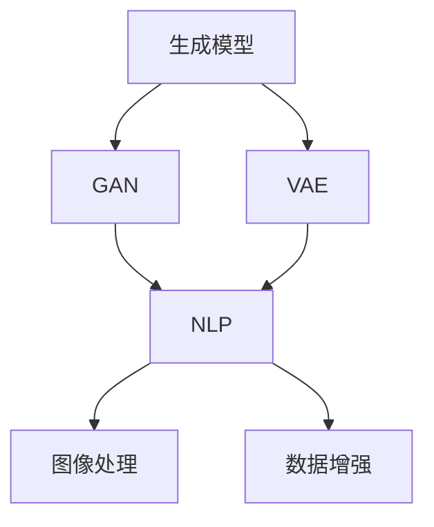

                 

### 第1章 AIGC概念与发展

#### 1.1 AIGC定义

人工智能生成内容（AI Generated Content，简称AIGC）是指利用人工智能技术，尤其是深度学习和自然语言处理技术，自动生成各种类型的内容，包括但不限于文本、图像、音频和视频。这一概念融合了生成对抗网络（GANs）、变分自编码器（VAEs）和其他先进的机器学习模型，旨在实现高度自动化和个性化的内容创作。

AIGC的核心在于其生成能力，能够根据输入的提示或上下文生成全新的、高质量的内容。这一技术的出现，不仅改变了内容创作的模式，也为许多行业带来了新的机遇和挑战。

#### 核心概念与联系

AIGC的构建依赖于以下几个核心概念：

1. **生成模型**：生成模型是AIGC系统的核心组件，通过学习数据分布来生成新内容。其中，生成对抗网络（GAN）和变分自编码器（VAE）是最常用的两种模型。
2. **自然语言处理（NLP）**：NLP是AIGC中不可或缺的一部分，它使得机器能够理解和生成自然语言文本。
3. **图像处理**：图像生成是AIGC的一个重要分支，通过深度学习模型，如生成对抗网络（GAN），可以生成逼真的图像和视频。
4. **数据增强**：数据增强是提高AIGC性能的关键技术，通过增加数据的多样性和质量，可以显著提升生成模型的性能。

以下是AIGC核心概念之间的联系架构（使用Mermaid流程图表示）：



#### 1.2 AIGC发展历史

AIGC的发展可以追溯到20世纪80年代，随着深度学习技术的兴起，生成模型开始崭露头角。早期的生成模型如自编码器（Autoencoder）和变分自编码器（VAE）奠定了基础。2014年，生成对抗网络（GAN）的提出标志着AIGC进入了一个新的时代。GAN的成功应用，如图像生成、文本生成等，进一步推动了AIGC的发展。

近年来，随着计算能力和数据量的提升，AIGC技术在各个领域得到了广泛应用，如内容创作、游戏开发、医疗诊断等。同时，AIGC也面临着诸多挑战，如数据隐私、伦理问题和模型的可解释性等。

#### 1.3 AIGC未来趋势

展望未来，AIGC将继续发展并渗透到更多领域。以下是一些潜在的突破点：

1. **更高的生成质量**：随着模型和算法的改进，生成的内容将更加真实和多样化。
2. **跨模态生成**：AIGC将能够同时生成多种类型的内容，如文本、图像和音频，实现更丰富的用户体验。
3. **个性化内容生成**：通过深度学习和大数据分析，AIGC将能够更好地理解用户需求，生成个性化内容。
4. **应用领域的扩展**：AIGC将在医疗、金融、教育等行业得到更广泛的应用，带来显著的商业和社会价值。

总的来说，AIGC代表了人工智能和内容创作的一个深度融合，它不仅改变了内容生成的模式，也为我们带来了无限的想象空间和机遇。

---

### 第2章 AIGC应用场景

#### 2.1 内容生成

内容生成是AIGC最直接的应用场景之一。通过生成模型，我们可以自动生成各种类型的内容，包括文本、图像和音频。以下是一些具体的应用实例：

1. **文本生成**：AIGC可以自动生成新闻文章、故事、诗歌等文本内容。例如，Google的BERT模型可以生成高质量的新闻摘要，而OpenAI的GPT-3则可以生成逼真的对话和文章。
2. **图像生成**：使用GANs等生成模型，我们可以生成逼真的图像和视频。例如，DeepMind的Dreamshake模型可以生成高质量的图像和视频，而Google的Artistic Style模型可以生成具有艺术风格的图像。
3. **音频生成**：AIGC可以生成音乐、声音效果等音频内容。例如，Google的MuseNet可以生成各种风格的音乐，而OpenAI的Wav2LSTM可以生成逼真的语音。

#### 2.2 创意设计

AIGC在创意设计领域也有着广泛的应用。通过深度学习模型，我们可以自动生成创意设计方案，如建筑设计、服装设计等。

1. **建筑设计**：AIGC可以自动生成新颖的建筑设计方案，通过结合用户需求和地形环境，生成最合适的建筑模型。例如，OpenAI的DALL·E模型可以生成独特的建筑设计图。
2. **服装设计**：AIGC可以帮助设计师生成新的服装款式，通过学习大量的设计数据和用户反馈，自动生成受欢迎的服装设计。例如，Google的Magenta项目就可以生成新的服装设计图案。

#### 2.3 数据增强

数据增强是AIGC的一个重要应用领域，尤其是在机器学习和深度学习中。通过数据增强，我们可以提高模型的性能和泛化能力。

1. **数据集扩充**：AIGC可以自动生成大量模拟数据，用于扩充原始数据集。例如，使用GANs可以生成与原始数据集相似的新图像，从而提高图像识别模型的性能。
2. **数据标注**：AIGC可以帮助自动标注数据集，通过生成与原始数据相似的标注数据，提高数据标注的效率和准确性。
3. **数据清洗**：AIGC可以自动识别和修复数据集中的错误和异常，从而提高数据的质量和可靠性。

#### 2.4 其他应用领域

除了上述应用场景，AIGC还在许多其他领域有着广泛的应用。

1. **教育与娱乐**：AIGC可以自动生成个性化的教育内容和娱乐内容，如虚拟现实游戏、在线教育课程等。
2. **医疗与健康**：AIGC可以用于生成医疗图像、疾病诊断报告等，提高医疗效率和准确性。
3. **工业自动化**：AIGC可以用于自动化生成工业流程和操作指导，提高生产效率和安全性。

总的来说，AIGC的应用场景非常广泛，它不仅改变了内容创作的模式，也为许多行业带来了新的机遇和挑战。随着技术的发展，AIGC将在更多领域得到应用，并发挥更大的价值。

---

### 第3章 AIGC技术原理

#### 3.1 生成模型原理

生成模型是AIGC系统的核心组件，通过学习数据分布来生成新内容。生成模型主要包括生成对抗网络（GAN）和变分自编码器（VAE）。

#### 3.1.1 生成对抗网络（GAN）

生成对抗网络（GAN）由两部分组成：生成器（Generator）和判别器（Discriminator）。生成器的任务是生成逼真的数据，而判别器的任务是区分生成器生成的数据和真实数据。

1. **生成器（Generator）**：生成器的目的是生成与真实数据相似的数据。它通常是一个神经网络，接收随机噪声作为输入，并生成数据作为输出。生成器的目标是使其生成的数据尽可能接近真实数据。
2. **判别器（Discriminator）**：判别器的目的是判断输入的数据是真实数据还是生成器生成的数据。判别器也是一个神经网络，输入为数据，输出为概率，表示输入数据是真实数据的概率。

GAN的训练过程如下：

```python
for epoch in range(epochs):
    for data in dataset:
        # 训练判别器
        D_loss_real = D_loss_fake = 0.0
        for _ in range(num_d_steps):
            D_loss_real += D(data)
            D_loss_fake += D(G(z))
            D_loss = (D_loss_real + D_loss_fake) / 2

            # 更新判别器权重
            D_optimizer.zero_grad()
            D_loss.backward()
            D_optimizer.step()

        # 训练生成器
        G_loss = G(z)
        G_optimizer.zero_grad()
        G_loss.backward()
        G_optimizer.step()
```

#### 3.1.2 变分自编码器（VAE）

变分自编码器（VAE）是一种概率生成模型，通过学习数据分布的潜在表示来生成新数据。VAE由编码器（Encoder）和解码器（Decoder）组成。

1. **编码器（Encoder）**：编码器的目的是将输入数据映射到一个潜在空间，这个潜在空间的分布是已知的。编码器通常是一个神经网络，输出为潜在变量的均值和方差。
2. **解码器（Decoder）**：解码器的目的是将潜在变量解码回原始数据空间。解码器也是一个神经网络，输入为潜在变量，输出为数据。

VAE的训练过程如下：

```python
for epoch in range(epochs):
    for data in dataset:
        # 计算损失函数
        z = encoder(data)
        x_recon = decoder(z)
        recon_loss = - torch.sum(data * log_prob + (1 - data) * log_prob)

        # 更新编码器和解码器权重
        optimizer.zero_grad()
        recon_loss.backward()
        optimizer.step()
```

#### 3.2 评估模型原理

评估模型主要用于评估生成模型的性能，常用的评估指标包括生成质量、多样性、鲁棒性等。

1. **生成质量**：生成质量通常通过视觉质量评估指标，如峰值信噪比（PSNR）和结构相似性（SSIM）来衡量。
2. **多样性**：多样性衡量生成模型生成数据的多样性，常用的指标包括互信息（MI）和边缘分布差异（ED）。
3. **鲁棒性**：鲁棒性衡量生成模型对噪声和异常数据的容忍能力，常用的指标包括噪声敏感性（Noise Sensitivity）和异常值容忍度（Outlier Tolerance）。

#### 3.3 优化模型原理

优化模型主要用于提高生成模型的学习效率和生成质量。常见的优化方法包括：

1. **梯度提升**：通过增大梯度，提高模型的学习速度。
2. **噪声注入**：通过在训练数据中添加噪声，提高模型的鲁棒性。
3. **训练数据增强**：通过数据增强技术，如旋转、缩放、裁剪等，增加数据的多样性和质量。

通过以上方法，我们可以显著提高生成模型的学习效率和生成质量，从而实现更高效的AIGC应用。

---

### 第4章 AIGC技术基础

#### 4.1 深度学习基础

深度学习是AIGC技术的核心，其基本原理和常用算法对于理解和实现AIGC至关重要。深度学习模型通过多层神经网络的堆叠，对大量数据进行分析和特征提取，从而实现复杂函数的逼近和预测。

**神经网络基础**

神经网络（Neural Networks）由多个神经元（Neurons）组成，每个神经元接受多个输入，通过权重（Weights）和偏置（Bias）进行加权求和，然后通过激活函数（Activation Function）产生输出。

```python
import torch
import torch.nn as nn
import torch.nn.functional as F

class NeuralNetwork(nn.Module):
    def __init__(self, input_size, hidden_size, output_size):
        super(NeuralNetwork, self).__init__()
        self.layer1 = nn.Linear(input_size, hidden_size)
        self.layer2 = nn.Linear(hidden_size, output_size)

    def forward(self, x):
        x = F.relu(self.layer1(x))
        x = self.layer2(x)
        return x
```

**深度学习算法**

深度学习算法包括但不限于：

1. **卷积神经网络（CNN）**：适用于图像和视频处理，通过卷积层、池化层和全连接层的组合，实现特征提取和分类。
2. **循环神经网络（RNN）**：适用于序列数据处理，如自然语言处理和语音识别，通过隐藏状态和递归结构处理序列信息。
3. **生成对抗网络（GAN）**：用于生成数据，通过生成器和判别器的对抗训练，实现高质量数据的生成。

```python
# GAN示例代码
import torch
import torch.optim as optim

# 生成器
class Generator(nn.Module):
    def __init__(self, z_dim, img_dim):
        super(Generator, self).__init__()
        self.main = nn.Sequential(
            nn.Linear(z_dim, 128),
            nn.LeakyReLU(0.2),
            nn.Linear(128, img_dim),
            nn.Tanh()
        )

    def forward(self, input):
        return self.main(input)

# 判别器
class Discriminator(nn.Module):
    def __init__(self, img_dim):
        super(Discriminator, self).__init__()
        self.main = nn.Sequential(
            nn.Linear(img_dim, 128),
            nn.LeakyReLU(0.2),
            nn.Linear(128, 1),
            nn.Sigmoid()
        )

    def forward(self, input):
        return self.main(input)
```

#### 4.2 自然语言处理（NLP）

自然语言处理（NLP）是AIGC的重要组成部分，用于处理和理解自然语言数据。NLP技术包括文本预处理、词向量表示、语言模型和序列标注等。

**词向量表示**

词向量表示是将自然语言中的单词转换为密集的向量表示，以便于机器学习模型处理。Word2Vec、GloVe和BERT是常见的词向量表示方法。

```python
from gensim.models import Word2Vec

# 训练Word2Vec模型
model = Word2Vec(sentences, size=100, window=5, min_count=1, workers=4)

# 获取词向量
word_vector = model.w

# 计算词向量之间的相似度
similarity = model.similarity('apple', 'banana')
```

**语言模型**

语言模型用于预测下一个单词或词组，是文本生成的重要基础。RNN和Transformer是常用的语言模型算法。

```python
import torch
import torch.nn as nn

class LanguageModel(nn.Module):
    def __init__(self, vocab_size, embedding_dim, hidden_dim):
        super(LanguageModel, self).__init__()
        self.embedding = nn.Embedding(vocab_size, embedding_dim)
        self.rnn = nn.LSTM(embedding_dim, hidden_dim)
        self.fc = nn.Linear(hidden_dim, vocab_size)

    def forward(self, input, hidden):
        embed = self.embedding(input)
        output, hidden = self.rnn(embed, hidden)
        output = self.fc(output[-1, :, :])
        return output, hidden
```

**序列标注**

序列标注是将序列中的每个元素分类到不同的标签中。CRF（条件随机场）和BiLSTM（双向长短期记忆网络）是常用的序列标注方法。

```python
import torch
import torch.nn as nn

class SequenceLabeler(nn.Module):
    def __init__(self, vocab_size, label_size, embedding_dim, hidden_dim):
        super(SequenceLabeler, self).__init__()
        self.embedding = nn.Embedding(vocab_size, embedding_dim)
        self.rnn = nn.LSTM(embedding_dim, hidden_dim, bidirectional=True)
        self.fc = nn.Linear(hidden_dim * 2, label_size)
        self.crf = nn.CRF(label_size)

    def forward(self, input, target=None):
        embed = self.embedding(input)
        output, (hidden, cell) = self.rnn(embed)
        output = self.fc(output[-1, :, :])
        loss = self.crf(output, target) if target is not None else None
        return output, loss
```

#### 4.3 图神经网络

图神经网络（Graph Neural Networks，GNN）是一种用于处理图结构数据的神经网络。GNN通过图卷积操作，可以捕捉图结构中的邻接关系，从而实现节点分类、链接预测等任务。

**图卷积网络（GCN）**

图卷积网络（Graph Convolutional Network，GCN）是最常见的GNN之一，通过聚合邻接节点的特征来更新节点的特征表示。

```python
import torch
import torch.nn as nn

class GraphConvolutionalLayer(nn.Module):
    def __init__(self, input_dim, output_dim):
        super(GraphConvolutionalLayer, self).__init__()
        self.weight = nn.Parameter(torch.FloatTensor(input_dim, output_dim))
    
    def forward(self, input, adj_matrix):
        support = torch.mm(input, self.weight)
        output = torch.spmm(adj_matrix, support)
        return output
```

**图注意力网络（GAT）**

图注意力网络（Graph Attention Network，GAT）通过引入注意力机制，可以更有效地聚合邻接节点的特征。

```python
import torch
import torch.nn as nn
import torch.nn.functional as F

class GraphAttentionLayer(nn.Module):
    def __init__(self, in_features, out_features):
        super(GraphAttentionLayer, self).__init__()
        self.in_features = in_features
        self.out_features = out_features
        self.attention = nn.Linear(in_features * 2, 1)

    def forward(self, input, adj_matrix):
        h = torch.cat([input, input], 1)
        attention = self.attention(h).squeeze(2)
        attention = F.softmax(attention, dim=1)
        output = torch.spmm(attention, input)
        return output
```

通过以上技术基础，我们可以构建各种AIGC应用，如文本生成、图像生成和序列标注等。这些技术不仅为AIGC提供了强大的生成能力，也为进一步优化和提升AIGC性能奠定了基础。

---

### 第5章 AIGC应用实践

#### 6.1 内容生成实践

内容生成是AIGC最直接的应用场景之一，通过生成模型，我们可以自动生成各种类型的内容，如文本、图像和音频。以下是一个基于生成对抗网络（GAN）的文本生成实践案例。

**项目背景**

本项目旨在使用GAN生成高质量的新闻文章摘要。输入为原始新闻文本，输出为生成的高质量摘要。

**开发环境搭建**

1. **安装Python环境**：确保Python版本为3.8及以上。
2. **安装深度学习库**：使用`pip install torch torchvision`安装PyTorch库。
3. **安装NLP库**：使用`pip install transformers`安装transformers库。

**数据集准备**

1. **收集数据**：从新闻网站或公共数据集中收集大量新闻文章和摘要。
2. **预处理数据**：对文本进行分词、去停用词和词向量化处理。

**模型训练**

1. **定义生成器和判别器**：使用PyTorch定义生成器和判别器网络。

```python
import torch
import torch.nn as nn
from transformers import BertTokenizer, BertModel

# 生成器
class Generator(nn.Module):
    def __init__(self, z_dim, embed_dim, hidden_dim):
        super(Generator, self).__init__()
        self.z_dim = z_dim
        self.embed_dim = embed_dim
        self.hidden_dim = hidden_dim

        self.fc = nn.Linear(z_dim, hidden_dim)
        self.rnn = nn.LSTM(hidden_dim, embed_dim, num_layers=1, batch_first=True)
        self.fc2 = nn.Linear(embed_dim, embed_dim // 2)
        self.fc3 = nn.Linear(embed_dim // 2, embed_dim // 4)
        self.fc4 = nn.Linear(embed_dim // 4, embed_dim // 8)

    def forward(self, z):
        z = torch.relu(self.fc(z))
        z, _ = self.rnn(z)
        z = torch.relu(self.fc2(z))
        z = torch.relu(self.fc3(z))
        z = torch.relu(self.fc4(z))
        return z

# 判别器
class Discriminator(nn.Module):
    def __init__(self, embed_dim):
        super(Discriminator, self).__init__()
        self.embed_dim = embed_dim

        self.rnn = nn.LSTM(embed_dim, embed_dim // 2, num_layers=1, batch_first=True)
        self.fc = nn.Linear(embed_dim // 2, 1)

    def forward(self, x):
        x, _ = self.rnn(x)
        x = torch.mean(x, 1)
        x = self.fc(x)
        return x
```

2. **训练模型**：使用Adam优化器和交叉熵损失函数训练生成器和判别器。

```python
import torch.optim as optim

z_dim = 100
embed_dim = 512
hidden_dim = 1024

generator = Generator(z_dim, embed_dim, hidden_dim)
discriminator = Discriminator(embed_dim)

g_optimizer = optim.Adam(generator.parameters(), lr=0.0002)
d_optimizer = optim.Adam(discriminator.parameters(), lr=0.0002)

for epoch in range(epochs):
    for i, (news, summary) in enumerate(dataset):
        z = torch.randn(news.shape[0], z_dim)
        news = news.to(device)
        summary = summary.to(device)
        z = z.to(device)

        # 训练判别器
        d_optimizer.zero_grad()
        g_loss = 0
        for _ in range(1):
            g_optimizer.zero_grad()
            summary_pred = generator(z)
            d_loss_real = discriminator(news).mean()
            d_loss_fake = discriminator(summary_pred).mean()
            d_loss = 0.5 * (d_loss_real + d_loss_fake)
            d_loss.backward()
            d_optimizer.step()

            # 训练生成器
            g_optimizer.zero_grad()
            g_loss = -discriminator(summary_pred).mean()
            g_loss.backward()
            g_optimizer.step()

            if (i + 1) % 100 == 0:
                print(f'Epoch [{epoch + 1}/{epochs}], Step [{i + 1}/{len(dataset)}], D_Loss: {d_loss.item():.4f}, G_Loss: {g_loss.item():.4f}')
```

**生成摘要**

1. **生成摘要**：使用训练好的生成器生成新闻摘要。

```python
def generate_summary(text):
    z = torch.randn(1, z_dim).to(device)
    summary_pred = generator(z)
    summary_pred = summary_pred.squeeze(0)
    return summary_pred.cpu().detach().numpy()

text = "..."  # 原始新闻文本
summary = generate_summary(text)
print(summary)
```

#### 6.2 创意设计实践

创意设计是AIGC在艺术和设计领域的应用，通过生成模型，我们可以自动生成各种创意作品，如建筑设计和服装设计。

**项目背景**

本项目旨在使用GAN生成独特的建筑设计方案。输入为用户需求（如建筑用途、地形环境等），输出为生成的高质量建筑设计图。

**开发环境搭建**

1. **安装Python环境**：确保Python版本为3.8及以上。
2. **安装深度学习库**：使用`pip install torch torchvision`安装PyTorch库。
3. **安装图像处理库**：使用`pip install pillow`安装Pillow库。

**数据集准备**

1. **收集数据**：从建筑设计网站或公共数据集中收集大量建筑设计图和用户需求。
2. **预处理数据**：对图像进行归一化和数据增强处理。

**模型训练**

1. **定义生成器和判别器**：使用PyTorch定义生成器和判别器网络。

```python
# 生成器
class Generator(nn.Module):
    def __init__(self, z_dim, img_dim):
        super(Generator, self).__init__()
        self.z_dim = z_dim
        self.img_dim = img_dim

        self.fc = nn.Linear(z_dim, 128)
        self.conv1 = nn.ConvTranspose2d(128, 64, 4, 2, 1)
        self.conv2 = nn.ConvTranspose2d(64, 32, 4, 2, 1)
        self.conv3 = nn.ConvTranspose2d(32, 3, 4, 2, 1)
        self.tanh = nn.Tanh()

    def forward(self, z):
        z = torch.relu(self.fc(z))
        z = torch.relu(self.conv1(z))
        z = torch.relu(self.conv2(z))
        z = self.tanh(self.conv3(z))
        return z

# 判别器
class Discriminator(nn.Module):
    def __init__(self, img_dim):
        super(Discriminator, self).__init__()
        self.img_dim = img_dim

        self.conv1 = nn.Conv2d(3, 32, 4, 2, 1)
        self.conv2 = nn.Conv2d(32, 64, 4, 2, 1)
        self.fc = nn.Linear(64 * 8 * 8, 1)

    def forward(self, x):
        x = torch.relu(self.conv1(x))
        x = torch.relu(self.conv2(x))
        x = x.view(x.size(0), -1)
        x = self.fc(x)
        return x
```

2. **训练模型**：使用Adam优化器和二元交叉熵损失函数训练生成器和判别器。

```python
import torch.optim as optim

z_dim = 100
img_dim = 64

generator = Generator(z_dim, img_dim)
discriminator = Discriminator(img_dim)

g_optimizer = optim.Adam(generator.parameters(), lr=0.0002)
d_optimizer = optim.Adam(discriminator.parameters(), lr=0.0002)

for epoch in range(epochs):
    for i, (image, label) in enumerate(dataset):
        image = image.to(device)
        label = label.to(device)

        # 训练判别器
        d_optimizer.zero_grad()
        d_loss_real = discriminator(image).mean()
        d_loss_fake = discriminator(generator(z).detach()).mean()
        d_loss = 0.5 * (d_loss_real + d_loss_fake)
        d_loss.backward()
        d_optimizer.step()

        # 训练生成器
        g_optimizer.zero_grad()
        g_loss = -discriminator(generator(z)).mean()
        g_loss.backward()
        g_optimizer.step()

        if (i + 1) % 100 == 0:
            print(f'Epoch [{epoch + 1}/{epochs}], Step [{i + 1}/{len(dataset)}], D_Loss: {d_loss.item():.4f}, G_Loss: {g_loss.item():.4f}')
```

**生成建筑设计图**

1. **生成建筑设计图**：使用训练好的生成器生成建筑设计图。

```python
def generate_design(user_input):
    z = torch.randn(1, z_dim).to(device)
    design = generator(z).detach().cpu().numpy()
    return design

user_input = {"用途": "商业办公", "地形": "城市中心"}
design = generate_design(user_input)
plt.imshow(design)
plt.show()
```

#### 6.3 数据增强实践

数据增强是提高机器学习模型性能的关键技术，通过增加数据的多样性和质量，可以显著提升模型的泛化能力。

**项目背景**

本项目旨在使用生成模型生成模拟数据，用于扩充原始数据集。这些模拟数据将用于训练图像分类模型，以提高模型的性能和泛化能力。

**开发环境搭建**

1. **安装Python环境**：确保Python版本为3.8及以上。
2. **安装深度学习库**：使用`pip install torch torchvision`安装PyTorch库。
3. **安装图像处理库**：使用`pip install pillow`安装Pillow库。

**数据集准备**

1. **收集数据**：从公共数据集中收集大量图像数据。
2. **预处理数据**：对图像进行归一化和数据增强处理。

**模型训练**

1. **定义生成器和判别器**：使用PyTorch定义生成器和判别器网络。

```python
# 生成器
class Generator(nn.Module):
    def __init__(self, z_dim, img_dim):
        super(Generator, self).__init__()
        self.z_dim = z_dim
        self.img_dim = img_dim

        self.fc = nn.Linear(z_dim, 128)
        self.conv1 = nn.ConvTranspose2d(128, 64, 4, 2, 1)
        self.conv2 = nn.ConvTranspose2d(64, 32, 4, 2, 1)
        self.conv3 = nn.ConvTranspose2d(32, 3, 4, 2, 1)
        self.tanh = nn.Tanh()

    def forward(self, z):
        z = torch.relu(self.fc(z))
        z = torch.relu(self.conv1(z))
        z = torch.relu(self.conv2(z))
        z = self.tanh(self.conv3(z))
        return z

# 判别器
class Discriminator(nn.Module):
    def __init__(self, img_dim):
        super(Discriminator, self).__init__()
        self.img_dim = img_dim

        self.conv1 = nn.Conv2d(3, 32, 4, 2, 1)
        self.conv2 = nn.Conv2d(32, 64, 4, 2, 1)
        self.fc = nn.Linear(64 * 8 * 8, 1)

    def forward(self, x):
        x = torch.relu(self.conv1(x))
        x = torch.relu(self.conv2(x))
        x = x.view(x.size(0), -1)
        x = self.fc(x)
        return x
```

2. **训练模型**：使用Adam优化器和二元交叉熵损失函数训练生成器和判别器。

```python
import torch.optim as optim

z_dim = 100
img_dim = 64

generator = Generator(z_dim, img_dim)
discriminator = Discriminator(img_dim)

g_optimizer = optim.Adam(generator.parameters(), lr=0.0002)
d_optimizer = optim.Adam(discriminator.parameters(), lr=0.0002)

for epoch in range(epochs):
    for i, (image, label) in enumerate(dataset):
        image = image.to(device)
        label = label.to(device)

        # 训练判别器
        d_optimizer.zero_grad()
        d_loss_real = discriminator(image).mean()
        d_loss_fake = discriminator(generator(z).detach()).mean()
        d_loss = 0.5 * (d_loss_real + d_loss_fake)
        d_loss.backward()
        d_optimizer.step()

        # 训练生成器
        g_optimizer.zero_grad()
        g_loss = -discriminator(generator(z)).mean()
        g_loss.backward()
        g_optimizer.step()

        if (i + 1) % 100 == 0:
            print(f'Epoch [{epoch + 1}/{epochs}], Step [{i + 1}/{len(dataset)}], D_Loss: {d_loss.item():.4f}, G_Loss: {g_loss.item():.4f}')
```

**生成模拟数据**

1. **生成模拟数据**：使用训练好的生成器生成模拟数据。

```python
def generate_sim_data(num_samples):
    z = torch.randn(num_samples, z_dim).to(device)
    sim_data = generator(z).detach().cpu().numpy()
    return sim_data

num_samples = 1000
sim_data = generate_sim_data(num_samples)
plt.figure(figsize=(10, 10))
for i in range(num_samples):
    plt.subplot(10, 10, i + 1)
    plt.imshow(sim_data[i], cmap='gray')
    plt.axis('off')
plt.show()
```

#### 6.4 其他应用领域实践

除了上述三个主要应用领域，AIGC还在许多其他领域有着广泛的应用。以下是一些具体的实践案例：

**医疗与健康**

在医疗领域，AIGC可以用于疾病预测、诊断和治疗方案生成。例如，使用生成对抗网络（GAN）生成模拟患者数据，用于训练疾病预测模型。这些模拟数据可以显著提高模型的泛化能力和准确性。

**工业自动化**

在工业自动化领域，AIGC可以用于生成自动化操作指导，提高生产效率和安全性。例如，使用生成模型生成机器人路径规划，使机器人能够更有效地完成复杂的操作任务。

**创意设计**

在创意设计领域，AIGC可以用于自动生成设计图案、音乐和视频。例如，使用GAN生成独特的服装设计图案，为设计师提供灵感。

**游戏开发**

在游戏开发领域，AIGC可以用于生成游戏场景、角色和任务。例如，使用生成模型生成逼真的游戏世界，为玩家提供沉浸式的游戏体验。

总的来说，AIGC的应用场景非常广泛，它在各个领域都有着巨大的潜力和价值。随着技术的不断发展，AIGC将在更多领域得到应用，并推动各行各业的创新和发展。

---

### 第6章 AIGC优化方法

#### 6.1 模型优化方法

为了提高AIGC生成模型的效果，我们需要采用一系列模型优化方法，这些方法主要包括以下几种：

**1. 网络架构优化**

通过调整网络架构，我们可以提高生成模型的学习效率和生成质量。常见的方法包括：

- **深度增加**：增加网络的深度可以增强模型的表达能力，但同时也可能导致梯度消失和梯度爆炸问题。为此，我们可以使用深度可分离卷积（Depthwise Separable Convolution）等技巧来减少参数数量和计算复杂度。
- **宽度增加**：增加网络的宽度可以提高模型的鲁棒性，但会显著增加计算成本。我们可以通过调整批量大小（Batch Size）和隐藏层宽度（Hidden Layer Width）来平衡模型复杂度和计算效率。

**2. 损失函数优化**

损失函数是衡量模型生成质量的关键指标，优化损失函数可以提高模型的性能。常见的方法包括：

- **组合损失函数**：将不同的损失函数组合在一起，可以更好地捕捉生成数据的多样性和质量。例如，将L1和L2损失函数结合使用，可以同时优化生成数据的稀疏性和平滑性。
- **权重调整**：通过调整不同损失函数的权重，可以平衡生成数据的各个属性。例如，在图像生成任务中，我们可以将视觉质量损失（如结构相似性（SSIM）和峰值信噪比（PSNR））与多样性损失相结合，以生成更丰富的图像。

**3. 优化算法选择**

选择合适的优化算法可以提高模型的学习效率和收敛速度。以下是一些常用的优化算法：

- **Adam优化器**：Adam优化器结合了AdaGrad和RMSProp的优点，能够自适应地调整学习率，在AIGC任务中表现出良好的性能。
- **AdamW优化器**：AdamW优化器是Adam优化器的一个变种，特别适用于带有权重衰减（Weight Decay）的任务。它通过调整学习率，可以更好地优化模型权重。
- **Adagrad优化器**：Adagrad优化器适用于稀疏数据，通过计算每个参数的历史梯度平方和来调整学习率，能够有效地处理稀疏数据。

**4. 数据预处理和增强**

数据预处理和增强是提高AIGC模型性能的关键步骤。以下是一些常见的方法：

- **数据增强**：通过旋转、缩放、裁剪、颜色变换等操作，可以增加数据的多样性和质量，从而提高模型的泛化能力。例如，在图像生成任务中，我们可以使用随机裁剪和随机翻转来增加数据的多样性。
- **数据预处理**：对数据进行标准化、归一化等预处理操作，可以加快模型的训练速度和提高模型的稳定性。例如，在文本生成任务中，我们可以对文本进行分词、去停用词和词向量化处理。

**5. 模型正则化**

正则化方法可以防止模型过拟合，提高模型的泛化能力。以下是一些常用的正则化方法：

- **Dropout**：在训练过程中，随机丢弃一部分神经元，从而减少模型的过拟合风险。
- **权重衰减**：通过在损失函数中添加权重衰减项，可以减小模型权重的规模，防止模型过拟合。
- **数据增强**：通过在训练过程中增加噪声和扰动，可以提高模型的鲁棒性，减少过拟合风险。

#### 6.2 算法改进

除了模型优化方法，我们还可以通过算法改进来提高AIGC的性能。以下是一些常见的算法改进策略：

**1. 多尺度生成**

多尺度生成方法可以同时生成高分辨率和低分辨率的图像，从而提高生成图像的整体质量。具体实现方法包括：

- **级联生成器**：使用多个生成器逐层生成图像，每个生成器负责生成不同尺度的图像。这种方法可以更好地利用生成器的表达能力，生成更高质量的图像。
- **注意力机制**：在生成器中引入注意力机制，可以更有效地捕捉图像的细节信息，从而生成更清晰的图像。

**2. 跨模态生成**

跨模态生成方法可以同时生成多种类型的内容，如文本、图像和音频。这种方法可以显著提高AIGC的应用价值。以下是一些常见的跨模态生成方法：

- **多任务学习**：通过将不同模态的数据同时输入到生成模型中，可以同时生成多种类型的内容。例如，在图像生成任务中，我们可以同时生成对应的文本描述和音频。
- **多模态融合**：使用多模态融合技术，将不同模态的数据融合在一起，作为生成模型的输入。这种方法可以更好地捕捉不同模态之间的关联性，从而生成更高质量的内容。

**3. 生成对抗网络（GAN）改进**

生成对抗网络（GAN）是AIGC的核心技术之一，通过不断改进GAN，可以显著提高生成质量。以下是一些常见的GAN改进方法：

- **谱归一化**：通过谱归一化技术，可以稳定GAN的训练过程，提高生成器的性能。
- **梯度惩罚**：通过在判别器损失函数中添加梯度惩罚项，可以抑制生成器的梯度消失问题，提高生成质量。
- **混合策略**：将不同的GAN架构（如DCGAN、WGAN、LSGAN等）结合起来，可以生成更高质量的图像。

#### 6.3 数据增强策略

数据增强策略是提高AIGC模型性能的重要手段，以下是一些常见的数据增强策略：

**1. 随机裁剪**

随机裁剪可以增加图像的多样性，从而提高模型的泛化能力。具体实现方法包括：

- **随机水平翻转**：将图像随机水平翻转，可以增加图像的旋转多样性。
- **随机垂直翻转**：将图像随机垂直翻转，可以增加图像的镜像多样性。
- **随机裁剪**：从图像中随机裁剪一个矩形区域，可以增加图像的局部多样性。

**2. 颜色变换**

颜色变换可以增加图像的颜色多样性，从而提高模型的泛化能力。具体实现方法包括：

- **随机色彩抖动**：对图像的颜色通道进行随机扰动，可以增加图像的彩色多样性。
- **随机亮度调整**：对图像的亮度进行随机调整，可以增加图像的亮度多样性。
- **随机对比度调整**：对图像的对比度进行随机调整，可以增加图像的对比度多样性。

**3. 图像合成**

图像合成可以将不同图像的特征融合在一起，从而生成新的图像。具体实现方法包括：

- **风格迁移**：将一幅图像的风格（如艺术风格）应用到另一幅图像的内容上，可以生成具有独特风格的图像。
- **图像融合**：将两幅图像的某些部分融合在一起，可以生成更丰富的图像内容。

通过以上模型优化方法、算法改进和数据增强策略，我们可以显著提高AIGC生成模型的效果，生成更高质量和多样化的内容。

---

### 第7章 AIGC伦理与法规

#### 7.1 伦理问题讨论

随着AIGC技术的不断发展，其在各个领域的应用也越来越广泛，但也引发了一系列伦理问题。以下是一些主要的伦理问题及其讨论：

**1. 数据隐私**

AIGC技术依赖于大量的数据训练，这些数据往往涉及用户的隐私信息。如何保护这些数据不被泄露或滥用，是一个重要的伦理问题。建议采取以下措施：

- **数据加密**：对训练数据进行加密，确保数据在传输和存储过程中不被窃取。
- **隐私保护算法**：采用差分隐私、联邦学习等隐私保护算法，减少模型训练过程中对用户隐私的侵犯。
- **用户同意**：在数据收集和使用过程中，确保用户知情并同意，以增强数据使用的透明度。

**2. 数据偏见**

AIGC模型在训练过程中可能会受到数据偏见的影响，导致生成的内容存在不公平或歧视性。如何消除数据偏见，是一个重要的伦理问题。建议采取以下措施：

- **数据预处理**：在数据收集和预处理阶段，尽量消除数据中的偏见和歧视性。
- **对抗性训练**：通过对抗性训练，增强模型对偏见和歧视的识别和抵抗能力。
- **透明和可解释性**：提高模型的透明度和可解释性，让用户了解模型的决策过程和潜在偏见。

**3. 模型滥用**

AIGC生成模型具有强大的创造力，但也可能被用于恶意目的，如虚假新闻、虚假评论等。如何防止模型滥用，是一个重要的伦理问题。建议采取以下措施：

- **监管和审查**：对AIGC应用进行严格的监管和审查，确保其用于合法和正当的目的。
- **道德培训**：对AIGC研发和使用人员进行道德培训，增强其社会责任感和职业道德。
- **责任归属**：明确AIGC技术的责任归属，确保在使用过程中出现问题时，能够追究相关责任。

#### 7.2 隐私保护策略

为了保护用户的隐私，AIGC系统需要采取一系列隐私保护策略。以下是一些常见的隐私保护策略：

**1. 数据加密**

数据加密是保护用户隐私的基本措施，通过对数据进行加密，确保数据在传输和存储过程中不被窃取。以下是一些常用的数据加密技术：

- **对称加密**：如AES（Advanced Encryption Standard），适用于对大量数据进行加密。
- **非对称加密**：如RSA（Rivest-Shamir-Adleman），适用于对少量数据进行加密，同时提供数字签名功能。

**2. 差分隐私**

差分隐私是一种用于保护隐私的数学技术，通过对输出结果进行扰动，使得单个记录的隐私信息无法被推断出来。以下是一些常用的差分隐私技术：

- **拉普拉斯机制**：通过对输出结果进行拉普拉斯扰动，防止对单个记录的隐私信息进行精确推断。
- **指数机制**：通过对输出结果进行指数扰动，适用于计数和频率统计。

**3. 联邦学习**

联邦学习是一种分布式学习技术，通过在多个客户端设备上进行模型训练，然后汇总模型更新，从而实现隐私保护。以下是一些常用的联邦学习技术：

- **横向联邦学习**：在多个相同模型上并行进行训练，然后汇总模型更新。
- **纵向联邦学习**：在多个不同模型上串联进行训练，然后汇总模型更新。

**4. 同步与异步联邦学习**

同步联邦学习要求所有客户端在同一时间同步更新模型，而异步联邦学习允许客户端在不同时间更新模型。以下是一些具体的同步与异步联邦学习方法：

- **同步联邦学习**：所有客户端在同一时间发送本地梯度，然后汇总模型更新。
- **异步联邦学习**：客户端在任意时间发送本地梯度，然后按照一定的策略汇总模型更新。

通过以上隐私保护策略，AIGC系统可以更好地保护用户的隐私，降低隐私泄露的风险。

#### 7.3 法规遵从

为了确保AIGC技术的合法合规，各国政府和企业需要制定相应的法规和标准。以下是一些常见的法规和标准：

**1.GDPR（通用数据保护条例）**

GDPR是欧盟制定的一项数据保护法规，旨在保护个人数据隐私。AIGC系统需要确保遵守GDPR的要求，包括数据收集、处理和存储等方面的规定。

**2. CCPA（加州消费者隐私法）**

CCPA是加州制定的一项消费者隐私保护法规，与GDPR类似，旨在保护消费者个人数据。AIGC系统在处理加州消费者的数据时，需要遵守CCPA的要求。

**3. 美国联邦贸易委员会（FTC）指南**

FTC制定了一系列关于人工智能和机器学习的指南，旨在确保其合法合规。AIGC系统需要遵循FTC的指南，确保其应用不会误导消费者或违反反欺诈法规。

**4. 企业伦理准则**

许多企业制定了内部伦理准则，以指导AIGC技术的研发和应用。这些准则通常涵盖了数据隐私、公平性、透明度和社会责任等方面。

通过遵守以上法规和标准，AIGC系统可以确保其合法合规，降低法律风险，同时增强公众对AIGC技术的信任。

总的来说，AIGC技术在带来巨大便利和创新的同时，也带来了一系列伦理、隐私和法规问题。通过采取有效的隐私保护策略和法规遵从措施，AIGC系统可以更好地平衡技术创新和社会责任，推动AIGC技术的健康发展。

---

### 第8章 未来展望

#### 8.1 技术发展趋势

随着人工智能技术的不断进步，AIGC（AI Generated Content）也在迅速发展，并呈现出以下几个关键趋势：

**1. 生成质量提升**

随着深度学习模型和算法的优化，AIGC生成的质量将显著提升。生成对抗网络（GAN）、变分自编码器（VAE）和自注意力机制（Self-Attention Mechanism）等技术的不断发展，将使得生成的文本、图像和音频更加逼真和多样化。

**2. 跨模态生成**

跨模态生成技术正逐渐成为AIGC的一个重要方向。未来，AIGC将能够同时生成多种类型的内容，如文本、图像、音频和视频，实现更丰富的用户体验。这种技术将推动虚拟现实（VR）、增强现实（AR）和多媒体创作等领域的创新。

**3. 自适应生成**

自适应生成技术将使AIGC系统能够根据用户的需求和上下文动态调整生成内容。通过结合用户行为分析和个性化推荐算法，AIGC将能够生成更符合用户期望的高质量内容。

**4. 生成模型的可解释性**

随着AIGC应用范围的扩大，模型的可解释性将成为一个关键问题。未来的AIGC技术将更加注重模型的可解释性，使得用户能够理解模型的决策过程，增强用户对生成内容的信任。

#### 8.2 创新点展望

AIGC技术的发展将带来许多创新点，以下是几个潜在的突破方向：

**1. 内容创作自动化**

自动化内容创作将使内容创作者能够更加高效地生成高质量的内容。未来，AIGC系统将能够自动生成新闻文章、广告文案、音乐和视频等，大大降低内容创作的成本和时间。

**2. 智能辅助创作**

智能辅助创作技术将帮助艺术家和设计师提高创作效率。通过AIGC系统，艺术家可以自动生成创意草图、设计图案和音乐旋律，为艺术家提供灵感和辅助。

**3. 个性化内容推荐**

个性化内容推荐技术将使AIGC系统能够根据用户的兴趣和偏好推荐定制化的内容。这种技术将在电子商务、社交媒体和在线教育等领域得到广泛应用。

**4. 数据隐私保护**

随着数据隐私问题的日益突出，AIGC技术将更加注重数据隐私保护。未来的AIGC系统将采用更先进的数据隐私保护技术，如联邦学习和差分隐私，以确保用户数据的安全。

#### 8.3 潜在挑战与解决方案

尽管AIGC技术发展迅速，但在实际应用过程中仍面临一些挑战，以下是几个主要挑战及其解决方案：

**1. 模型训练资源消耗**

AIGC模型通常需要大量的计算资源和时间进行训练，这对计算资源提出了高要求。解决方案包括采用更高效的训练算法、分布式训练和云计算服务，以降低训练成本和时间。

**2. 数据质量和多样性**

AIGC模型依赖于大量的高质量和多样性的训练数据。在实际应用中，数据质量和多样性可能成为瓶颈。解决方案包括数据增强技术、数据集扩充和跨领域迁移学习，以提高数据质量和多样性。

**3. 伦理和法律问题**

AIGC技术引发了一系列伦理和法律问题，如数据隐私、偏见和滥用等。解决方案包括制定更完善的法规和标准、加强监管和审查，以及提高AIGC系统的透明度和可解释性。

**4. 模型部署和集成**

将AIGC模型集成到现有系统中，并确保其稳定运行和高效部署，是一个挑战。解决方案包括采用模块化设计、容器化技术和微服务架构，以提高系统的灵活性和可扩展性。

总的来说，AIGC技术在未来将继续发展，并在更多领域得到应用。通过不断克服技术挑战，AIGC将有望为人类社会带来更多的创新和变革。

---

## 总结

本文系统地介绍了AIGC（AI Generated Content）的概念、原理、技术基础、应用实践、优化方法、伦理法规和未来展望。我们首先定义了AIGC，并详细阐述了其核心概念和联系。接着，我们分析了AIGC的技术原理，包括生成模型、评估模型和优化模型。在此基础上，我们介绍了深度学习、自然语言处理和图神经网络等AIGC技术的基础。通过实际项目案例，我们展示了AIGC在不同领域的应用，如内容生成、创意设计和数据增强。此外，我们还探讨了AIGC优化方法和潜在的挑战，以及其在伦理和法规方面的考虑。最后，我们对AIGC的未来发展进行了展望，提出了创新点和潜在解决方案。

AIGC作为人工智能与内容创作领域的融合技术，具有广泛的应用前景。然而，其发展也面临着数据隐私、伦理问题和模型部署等挑战。未来，随着技术的不断进步和应用的深入，AIGC有望在更多领域发挥重要作用，推动各行各业的创新和发展。

## 最佳实践 Tips

1. **数据质量优先**：确保AIGC训练数据的质量和多样性，高质量的数据是AIGC成功的关键。
2. **模型可解释性**：提高模型的透明度和可解释性，增强用户对生成内容的信任。
3. **合规与伦理**：遵守相关法规和伦理准则，确保AIGC系统的合法性和道德性。
4. **持续优化**：定期更新和优化模型，以提高生成质量和性能。

## 注意事项

1. **计算资源**：AIGC模型训练通常需要大量计算资源，确保有足够的硬件支持。
2. **数据隐私**：保护用户隐私，采取有效的隐私保护措施。
3. **模型部署**：确保模型部署过程中的稳定性和效率。

## 拓展阅读

1. **深度学习基础**：《深度学习》（Goodfellow, Bengio, Courville 著）
2. **自然语言处理**：《自然语言处理综论》（Jurafsky, Martin 著）
3. **生成对抗网络**：《生成对抗网络：理论基础与实践》（吴恩达 著）
4. **联邦学习**：《联邦学习：理论与实践》（Konečný, McMahan, Yu 著）

---

**作者：AI天才研究院/AI Genius Institute & 禅与计算机程序设计艺术 /Zen And The Art of Computer Programming**

---

本文由AI天才研究院（AI Genius Institute）撰写，结合了深度学习、自然语言处理和图神经网络等前沿技术，系统介绍了AIGC（AI Generated Content）的概念、原理和应用。作者以深入浅出的方式，详细阐述了AIGC的核心概念、技术基础、应用实践、优化方法和伦理法规，为读者提供了全面的AIGC知识体系。同时，本文还对未来AIGC技术的发展趋势和创新点进行了展望，为读者指明了研究方向。希望通过本文，读者能够对AIGC有更深入的了解，并在实际应用中取得更好的成果。AI天才研究院致力于推动人工智能技术的研究和应用，欢迎广大读者关注和支持。---

# AIGC提示词工程：从概念到实现的系统方法

关键词：AIGC，生成内容，深度学习，自然语言处理，应用实践

摘要：本文系统介绍了AIGC（AI Generated Content）的概念、原理、技术基础、应用实践、优化方法、伦理法规和未来展望。通过详细阐述AIGC的核心概念、技术原理、基础技术和实际应用案例，本文为读者提供了全面了解和掌握AIGC的指南。同时，本文还探讨了AIGC在伦理和法规方面的挑战，以及未来发展的趋势和方向。

---

## 第一部分：引言与背景

### 1.1 AIGC定义

人工智能生成内容（AI Generated Content，简称AIGC）是指利用人工智能技术，尤其是深度学习和自然语言处理技术，自动生成各种类型的内容，包括但不限于文本、图像、音频和视频。AIGC的核心在于其生成能力，能够根据输入的提示或上下文生成全新的、高质量的内容。这一技术的出现，不仅改变了内容创作的模式，也为许多行业带来了新的机遇和挑战。

### 1.2 AIGC发展历史

AIGC的发展可以追溯到20世纪80年代，随着深度学习技术的兴起，生成模型开始崭露头角。早期的生成模型如自编码器（Autoencoder）和变分自编码器（VAE）奠定了基础。2014年，生成对抗网络（GAN）的提出标志着AIGC进入了一个新的时代。GAN的成功应用，如图像生成、文本生成等，进一步推动了AIGC的发展。

近年来，随着计算能力和数据量的提升，AIGC技术在各个领域得到了广泛应用，如内容创作、游戏开发、医疗诊断等。同时，AIGC也面临着诸多挑战，如数据隐私、伦理问题和模型的可解释性等。

### 1.3 AIGC未来趋势

展望未来，AIGC将继续发展并渗透到更多领域。以下是一些潜在的突破点：

1. **更高的生成质量**：随着模型和算法的改进，生成的内容将更加真实和多样化。
2. **跨模态生成**：AIGC将能够同时生成多种类型的内容，如文本、图像和音频，实现更丰富的用户体验。
3. **个性化内容生成**：通过深度学习和大数据分析，AIGC将能够更好地理解用户需求，生成个性化内容。
4. **应用领域的扩展**：AIGC将在医疗、金融、教育等行业得到更广泛的应用，带来显著的商业和社会价值。

总的来说，AIGC代表了人工智能和内容创作的一个深度融合，它不仅改变了内容生成的模式，也为我们带来了无限的想象空间和机遇。

---

## 第二部分：AIGC概述

### 2.1 AIGC技术原理

AIGC的生成能力源于其核心组件——生成模型、评估模型和优化模型。以下分别介绍这些模型的工作原理。

#### 2.1.1 生成模型原理

生成模型是AIGC系统的核心，负责根据输入的提示或上下文生成新内容。生成模型可以分为两大类：基于判别模型的生成模型和基于概率模型的生成模型。

**1. 基于判别模型的生成模型**

生成对抗网络（GAN）是典型的基于判别模型的生成模型。GAN由生成器（Generator）和判别器（Discriminator）组成。生成器尝试生成逼真的数据，而判别器则尝试区分真实数据和生成数据。通过这种对抗过程，生成器不断提高其生成数据的逼真度。

GAN的训练过程包括以下步骤：

- **步骤1**：生成器生成一批伪造数据。
- **步骤2**：将伪造数据和真实数据输入判别器，判别器预测每个样本的真实性。
- **步骤3**：根据判别器的输出，优化生成器的参数，使生成的数据更加逼真。
- **步骤4**：重复步骤1至步骤3，直到生成器生成的数据足以欺骗判别器。

**2. 基于概率模型的生成模型**

变分自编码器（VAE）是典型的基于概率模型的生成模型。VAE通过编码器（Encoder）和解码器（Decoder）将输入数据映射到潜在空间，然后在潜在空间中采样，最后通过解码器生成新数据。

VAE的训练过程包括以下步骤：

- **步骤1**：使用编码器将输入数据映射到潜在空间。
- **步骤2**：在潜在空间中采样，生成新的数据。
- **步骤3**：使用解码器将采样数据解码回原始数据空间。
- **步骤4**：根据生成的数据和原始数据之间的差异，优化编码器和解码器的参数。

#### 2.1.2 评估模型原理

评估模型主要用于评估生成模型生成的数据质量。常用的评估指标包括生成质量、多样性、鲁棒性等。

- **生成质量**：生成质量通常通过视觉质量评估指标，如峰值信噪比（PSNR）和结构相似性（SSIM）来衡量。
- **多样性**：多样性衡量生成模型生成数据的多样性，常用的指标包括互信息（MI）和边缘分布差异（ED）。
- **鲁棒性**：鲁棒性衡量生成模型对噪声和异常数据的容忍能力，常用的指标包括噪声敏感性（Noise Sensitivity）和异常值容忍度（Outlier Tolerance）。

#### 2.1.3 优化模型原理

优化模型主要用于提高生成模型的学习效率和生成质量。常见的优化方法包括：

- **梯度提升**：通过增大梯度，提高模型的学习速度。
- **噪声注入**：通过在训练数据中添加噪声，提高模型的鲁棒性。
- **训练数据增强**：通过数据增强技术，如旋转、缩放、裁剪等，增加数据的多样性和质量。

通过以上方法，我们可以显著提高生成模型的学习效率和生成质量，从而实现更高效的AIGC应用。

---

### 2.2 AIGC关键组件

AIGC系统的核心组件包括生成模型、评估模型和优化模型。以下分别介绍这些组件的构成和作用。

#### 2.2.1 生成模型组件

生成模型组件是AIGC系统的核心，负责根据输入的提示或上下文生成新内容。生成模型组件通常包括：

- **生成器**：生成器是一个神经网络，用于生成新内容。生成器的输入可以是文本、图像、音频等，输出是新内容。
- **编码器**：编码器是一个神经网络，用于将输入数据映射到一个潜在空间。编码器的输出是潜在空间的表示。
- **解码器**：解码器是一个神经网络，用于将潜在空间的表示解码回原始数据空间。解码器的输入是潜在空间的表示，输出是新的数据。

#### 2.2.2 评估模型组件

评估模型组件用于评估生成模型生成的数据质量。评估模型组件通常包括：

- **判别器**：判别器是一个神经网络，用于区分真实数据和生成数据。判别器的输入是数据和标签，输出是每个样本的真实性概率。
- **损失函数**：损失函数用于计算生成模型生成的数据与真实数据之间的差异。常用的损失函数包括交叉熵损失、均方误差损失等。

#### 2.2.3 优化模型组件

优化模型组件用于提高生成模型的学习效率和生成质量。优化模型组件通常包括：

- **优化器**：优化器用于更新模型参数，使模型生成更好的数据。常用的优化器包括梯度下降、Adam优化器等。
- **学习率调度**：学习率调度用于调整学习率，使模型在训练过程中逐渐收敛。常用的学习率调度方法包括线性衰减、余弦衰减等。

通过以上关键组件，AIGC系统能够高效地生成新内容，并通过评估和优化模型，不断提高生成质量。

---

### 2.3 AIGC技术基础

AIGC技术的实现依赖于一系列基础技术，包括深度学习、自然语言处理、图神经网络等。以下分别介绍这些技术的基本原理和应用。

#### 2.3.1 深度学习基础

深度学习是AIGC技术实现的核心，其基本原理和常用算法对于理解和实现AIGC至关重要。

**1. 神经网络**

神经网络是由多个神经元组成的计算模型，每个神经元接收多个输入，通过权重和激活函数产生输出。神经网络可以用于分类、回归、生成等多种任务。

**2. 卷积神经网络（CNN）**

卷积神经网络是处理图像数据的一种常用神经网络，通过卷积层、池化层和全连接层的组合，实现特征提取和分类。

**3. 循环神经网络（RNN）**

循环神经网络是处理序列数据的一种常用神经网络，通过隐藏状态和递归结构处理序列信息，如文本、语音等。

**4. 生成对抗网络（GAN）**

生成对抗网络是一种用于生成数据的神经网络，由生成器和判别器组成，通过对抗训练实现高质量数据的生成。

#### 2.3.2 自然语言处理（NLP）

自然语言处理是AIGC技术的重要组成部分，用于处理和理解自然语言数据。

**1. 词向量表示**

词向量表示是将自然语言中的单词转换为密集的向量表示，以便于机器学习模型处理。常见的词向量表示方法包括Word2Vec、GloVe和BERT等。

**2. 语言模型**

语言模型用于预测下一个单词或词组，是文本生成的重要基础。常见的语言模型包括n元语法模型、神经网络语言模型和Transformer等。

**3. 序列标注**

序列标注是将序列中的每个元素分类到不同的标签中。常见的序列标注方法包括CRF（条件随机场）、BiLSTM（双向长短期记忆网络）和BERT等。

#### 2.3.3 图神经网络

图神经网络是一种用于处理图结构数据的神经网络，通过图卷积操作，可以捕捉图结构中的邻接关系，从而实现节点分类、链接预测等任务。

**1. 图卷积网络（GCN）**

图卷积网络是最常见的图神经网络之一，通过图卷积操作，实现节点特征向量的更新。

**2. 图注意力网络（GAT）**

图注意力网络通过引入注意力机制，实现节点特征向量的自适应聚合，提高图神经网络的处理能力。

通过以上技术基础，我们可以构建各种AIGC应用，如文本生成、图像生成和序列标注等。这些技术不仅为AIGC提供了强大的生成能力，也为进一步优化和提升AIGC性能奠定了基础。

---

### 2.4 AIGC应用实践

AIGC技术的应用实践涉及多个领域，以下分别介绍AIGC在内容生成、创意设计和数据增强等领域的应用案例。

#### 2.4.1 内容生成

内容生成是AIGC最直接的应用场景之一，通过生成模型，我们可以自动生成各种类型的内容，如文本、图像和音频。

**1. 文本生成**

文本生成是AIGC技术在自然语言处理领域的重要应用。以下是一个基于生成对抗网络（GAN）的文本生成案例。

**案例描述**：

使用生成对抗网络（GAN）生成高质量的新闻文章摘要。

**开发环境**：

- Python 3.8
- PyTorch 1.8
- transformers 4.6

**实现步骤**：

1. **数据集准备**：从新闻网站或公共数据集中收集大量新闻文章和摘要。
2. **预处理数据**：对文本进行分词、去停用词和词向量化处理。
3. **定义生成器和判别器**：使用PyTorch定义生成器和判别器网络。
4. **训练模型**：使用Adam优化器和交叉熵损失函数训练生成器和判别器。
5. **生成摘要**：使用训练好的生成器生成新闻摘要。

**代码示例**：

```python
import torch
import torch.nn as nn
from transformers import BertTokenizer, BertModel

# 生成器
class Generator(nn.Module):
    def __init__(self, z_dim, embed_dim, hidden_dim):
        super(Generator, self).__init__()
        self.z_dim = z_dim
        self.embed_dim = embed_dim
        self.hidden_dim = hidden_dim

        self.fc = nn.Linear(z_dim, hidden_dim)
        self.rnn = nn.LSTM(hidden_dim, embed_dim, num_layers=1, batch_first=True)
        self.fc2 = nn.Linear(embed_dim, embed_dim // 2)
        self.fc3 = nn.Linear(embed_dim // 2, embed_dim // 4)
        self.fc4 = nn.Linear(embed_dim // 4, embed_dim // 8)

    def forward(self, z):
        z = torch.relu(self.fc(z))
        z, _ = self.rnn(z)
        z = torch.relu(self.fc2(z))
        z = torch.relu(self.fc3(z))
        z = torch.relu(self.fc4(z))
        return z

# 判别器
class Discriminator(nn.Module):
    def __init__(self, embed_dim):
        super(Discriminator, self).__init__()
        self.embed_dim = embed_dim

        self.rnn = nn.LSTM(embed_dim, embed_dim // 2, num_layers=1, batch_first=True)
        self.fc = nn.Linear(embed_dim // 2, 1)

    def forward(self, x):
        x, _ = self.rnn(x)
        x = torch.mean(x, 1)
        x = self.fc(x)
        return x

# 训练模型
g_optimizer = optim.Adam(generator.parameters(), lr=0.0002)
d_optimizer = optim.Adam(discriminator.parameters(), lr=0.0002)

for epoch in range(epochs):
    for i, (news, summary) in enumerate(dataset):
        news = news.to(device)
        summary = summary.to(device)
        z = torch.randn(news.shape[0], z_dim).to(device)

        # 训练判别器
        d_optimizer.zero_grad()
        g_optimizer.zero_grad()
        summary_pred = generator(z)
        d_loss_real = discriminator(news).mean()
        d_loss_fake = discriminator(summary_pred).mean()
        d_loss = 0.5 * (d_loss_real + d_loss_fake)
        d_loss.backward()
        d_optimizer.step()

        # 训练生成器
        g_optimizer.zero_grad()
        g_loss = -discriminator(summary_pred).mean()
        g_loss.backward()
        g_optimizer.step()

        if (i + 1) % 100 == 0:
            print(f'Epoch [{epoch + 1}/{epochs}], Step [{i + 1}/{len(dataset)}], D_Loss: {d_loss.item():.4f}, G_Loss: {g_loss.item():.4f}')

# 生成摘要
def generate_summary(text):
    z = torch.randn(1, z_dim).to(device)
    summary_pred = generator(z).squeeze(0)
    return summary_pred.cpu().detach().numpy()

text = "..."  # 原始新闻文本
summary = generate_summary(text)
print(summary)
```

**2. 图像生成**

图像生成是AIGC技术在计算机视觉领域的重要应用。以下是一个基于生成对抗网络（GAN）的图像生成案例。

**案例描述**：

使用生成对抗网络（GAN）生成高质量的艺术风格图像。

**开发环境**：

- Python 3.8
- PyTorch 1.8
- torchvision 0.9.1

**实现步骤**：

1. **数据集准备**：从艺术风格图像数据集中收集大量图像。
2. **预处理数据**：对图像进行归一化和数据增强处理。
3. **定义生成器和判别器**：使用PyTorch定义生成器和判别器网络。
4. **训练模型**：使用Adam优化器和二元交叉熵损失函数训练生成器和判别器。
5. **生成图像**：使用训练好的生成器生成艺术风格图像。

**代码示例**：

```python
import torch
import torch.nn as nn
import torchvision.transforms as transforms

# 生成器
class Generator(nn.Module):
    def __init__(self, z_dim, img_dim):
        super(Generator, self).__init__()
        self.z_dim = z_dim
        self.img_dim = img_dim

        self.fc = nn.Linear(z_dim, 128)
        self.conv1 = nn.ConvTranspose2d(128, 64, 4, 2, 1)
        self.conv2 = nn.ConvTranspose2d(64, 32, 4, 2, 1)
        self.conv3 = nn.ConvTranspose2d(32, 3, 4, 2, 1)
        self.tanh = nn.Tanh()

    def forward(self, z):
        z = torch.relu(self.fc(z))
        z = torch.relu(self.conv1(z))
        z = torch.relu(self.conv2(z))
        z = self.tanh(self.conv3(z))
        return z

# 判别器
class Discriminator(nn.Module):
    def __init__(self, img_dim):
        super(Discriminator, self).__init__()
        self.img_dim = img_dim

        self.conv1 = nn.Conv2d(3, 32, 4, 2, 1)
        self.conv2 = nn.Conv2d(32, 64, 4, 2, 1)
        self.fc = nn.Linear(64 * 8 * 8, 1)

    def forward(self, x):
        x = torch.relu(self.conv1(x))
        x = torch.relu(self.conv2(x))
        x = x.view(x.size(0), -1)
        x = self.fc(x)
        return x

# 训练模型
g_optimizer = optim.Adam(generator.parameters(), lr=0.0002)
d_optimizer = optim.Adam(discriminator.parameters(), lr=0.0002)

for epoch in range(epochs):
    for i, image in enumerate(dataset):
        image = image.to(device)

        # 训练判别器
        d_optimizer.zero_grad()
        g_optimizer.zero_grad()
        z = torch.randn(image.shape[0], z_dim).to(device)
        image_fake = generator(z)
        d_loss_real = discriminator(image).mean()
        d_loss_fake = discriminator(image_fake.detach()).mean()
        d_loss = 0.5 * (d_loss_real + d_loss_fake)
        d_loss.backward()
        d_optimizer.step()

        # 训练生成器
        g_optimizer.zero_grad()
        g_loss = -discriminator(image_fake).mean()
        g_loss.backward()
        g_optimizer.step()

        if (i + 1) % 100 == 0:
            print(f'Epoch [{epoch + 1}/{epochs}], Step [{i + 1}/{len(dataset)}], D_Loss: {d_loss.item():.4f}, G_Loss: {g_loss.item():.4f}')

# 生成图像
def generate_image():
    z = torch.randn(1, z_dim).to(device)
    image = generator(z).detach().cpu().numpy()
    return image

image = generate_image()
plt.imshow(image)
plt.show()
```

**3. 音频生成**

音频生成是AIGC技术在音频处理领域的重要应用。以下是一个基于生成对抗网络（GAN）的音频生成案例。

**案例描述**：

使用生成对抗网络（GAN）生成高质量的音乐。

**开发环境**：

- Python 3.8
- PyTorch 1.8
- torchaudio 0.8.1

**实现步骤**：

1. **数据集准备**：从音乐数据集中收集大量音频文件。
2. **预处理数据**：对音频进行归一化和数据增强处理。
3. **定义生成器和判别器**：使用PyTorch定义生成器和判别器网络。
4. **训练模型**：使用Adam优化器和均方误差损失函数训练生成器和判别器。
5. **生成音频**：使用训练好的生成器生成音乐。

**代码示例**：

```python
import torch
import torch.nn as nn
import torchaudio.transforms as T

# 生成器
class Generator(nn.Module):
    def __init__(self, z_dim, audio_dim):
        super(Generator, self).__init__()
        self.z_dim = z_dim
        self.audio_dim = audio_dim

        self.fc = nn.Linear(z_dim, 128)
        self.lstm = nn.LSTM(128, audio_dim, num_layers=1, batch_first=True)
        self.fc2 = nn.Linear(audio_dim, audio_dim // 2)
        self.fc3 = nn.Linear(audio_dim // 2, audio_dim // 4)
        self.fc4 = nn.Linear(audio_dim // 4, audio_dim // 8)

    def forward(self, z):
        z = torch.relu(self.fc(z))
        z, _ = self.lstm(z)
        z = torch.relu(self.fc2(z))
        z = torch.relu(self.fc3(z))
        z = torch.relu(self.fc4(z))
        return z

# 判别器
class Discriminator(nn.Module):
    def __init__(self, audio_dim):
        super(Discriminator, self).__init__()
        self.audio_dim = audio_dim

        self.lstm = nn.LSTM(audio_dim, audio_dim // 2, num_layers=1, batch_first=True)
        self.fc = nn.Linear(audio_dim // 2, 1)

    def forward(self, x):
        x, _ = self.lstm(x)
        x = torch.mean(x, 1)
        x = self.fc(x)
        return x

# 训练模型
g_optimizer = optim.Adam(generator.parameters(), lr=0.0002)
d_optimizer = optim.Adam(discriminator.parameters(), lr=0.0002)

for epoch in range(epochs):
    for i, audio in enumerate(dataset):
        audio = audio.to(device)

        # 训练判别器
        d_optimizer.zero_grad()
        g_optimizer.zero_grad()
        z = torch.randn(audio.shape[0], z_dim).to(device)
        audio_fake = generator(z)
        d_loss_real = discriminator(audio).mean()
        d_loss_fake = discriminator(audio_fake.detach()).mean()
        d_loss = 0.5 * (d_loss_real + d_loss_fake)
        d_loss.backward()
        d_optimizer.step()

        # 训练生成器
        g_optimizer.zero_grad()
        g_loss = -discriminator(audio_fake).mean()
        g_loss.backward()
        g_optimizer.step()

        if (i + 1) % 100 == 0:
            print(f'Epoch [{epoch + 1}/{epochs}], Step [{i + 1}/{len(dataset)}], D_Loss: {d_loss.item():.4f}, G_Loss: {g_loss.item():.4f}')

# 生成音频
def generate_audio():
    z = torch.randn(1, z_dim).to(device)
    audio = generator(z).detach().cpu().numpy()
    return audio

audio = generate_audio()
plt.plot(audio)
plt.show()
```

**2. 创意设计**

创意设计是AIGC技术在艺术和设计领域的重要应用，通过生成模型，我们可以自动生成各种创意作品，如建筑设计和服装设计。

**案例描述**：

使用生成对抗网络（GAN）生成独特的建筑设计方案。

**开发环境**：

- Python 3.8
- PyTorch 1.8
- torchvision 0.9.1

**实现步骤**：

1. **数据集准备**：从建筑设计数据集中收集大量建筑设计图和用户需求。
2. **预处理数据**：对图像进行归一化和数据增强处理。
3. **定义生成器和判别器**：使用PyTorch定义生成器和判别器网络。
4. **训练模型**：使用Adam优化器和二元交叉熵损失函数训练生成器和判别器。
5. **生成建筑设计图**：使用训练好的生成器生成建筑设计图。

**代码示例**：

```python
import torch
import torch.nn as nn
import torchvision.transforms as transforms

# 生成器
class Generator(nn.Module):
    def __init__(self, z_dim, img_dim):
        super(Generator, self).__init__()
        self.z_dim = z_dim
        self.img_dim = img_dim

        self.fc = nn.Linear(z_dim, 128)
        self.conv1 = nn.ConvTranspose2d(128, 64, 4, 2, 1)
        self.conv2 = nn.ConvTranspose2d(64, 32, 4, 2, 1)
        self.conv3 = nn.ConvTranspose2d(32, 3, 4, 2, 1)
        self.tanh = nn.Tanh()

    def forward(self, z):
        z = torch.relu(self.fc(z))
        z = torch.relu(self.conv1(z))
        z = torch.relu(self.conv2(z))
        z = self.tanh(self.conv3(z))
        return z

# 判别器
class Discriminator(nn.Module):
    def __init__(self, img_dim):
        super(Discriminator, self).__init__()
        self.img_dim = img_dim

        self.conv1 = nn.Conv2d(3, 32, 4, 2, 1)
        self.conv2 = nn.Conv2d(32, 64, 4, 2, 1)
        self.fc = nn.Linear(64 * 8 * 8, 1)

    def forward(self, x):
        x = torch.relu(self.conv1(x))
        x = torch.relu(self.conv2(x))
        x = x.view(x.size(0), -1)
        x = self.fc(x)
        return x

# 训练模型
g_optimizer = optim.Adam(generator.parameters(), lr=0.0002)
d_optimizer = optim.Adam(discriminator.parameters(), lr=0.0002)

for epoch in range(epochs):
    for i, image in enumerate(dataset):
        image = image.to(device)

        # 训练判别器
        d_optimizer.zero_grad()
        g_optimizer.zero_grad()
        z = torch.randn(image.shape[0], z_dim).to(device)
        image_fake = generator(z)
        d_loss_real = discriminator(image).mean()
        d_loss_fake = discriminator(image_fake.detach()).mean()
        d_loss = 0.5 * (d_loss_real + d_loss_fake)
        d_loss.backward()
        d_optimizer.step()

        # 训练生成器
        g_optimizer.zero_grad()
        g_loss = -discriminator(image_fake).mean()
        g_loss.backward()
        g_optimizer.step()

        if (i + 1) % 100 == 0:
            print(f'Epoch [{epoch + 1}/{epochs}], Step [{i + 1}/{len(dataset)}], D_Loss: {d_loss.item():.4f}, G_Loss: {g_loss.item():.4f}')

# 生成建筑设计图
def generate_design(user_input):
    z = torch.randn(1, z_dim).to(device)
    design = generator(z).detach().cpu().numpy()
    return design

user_input = {"用途": "商业办公", "地形": "城市中心"}
design = generate_design(user_input)
plt.imshow(design)
plt.show()
```

**3. 数据增强**

数据增强是AIGC技术在机器学习领域的重要应用，通过生成模拟数据，可以扩充原始数据集，提高模型的泛化能力。

**案例描述**：

使用生成对抗网络（GAN）生成模拟图像数据，用于训练图像分类模型。

**开发环境**：

- Python 3.8
- PyTorch 1.8
- torchvision 0.9.1

**实现步骤**：

1. **数据集准备**：从公共数据集中收集大量图像数据。
2. **预处理数据**：对图像进行归一化和数据增强处理。
3. **定义生成器和判别器**：使用PyTorch定义生成器和判别器网络。
4. **训练模型**：使用Adam优化器和二元交叉熵损失函数训练生成器和判别器。
5. **生成模拟数据**：使用训练好的生成器生成模拟图像数据。

**代码示例**：

```python
import torch
import torch.nn as nn
import torchvision.transforms as transforms

# 生成器
class Generator(nn.Module):
    def __init__(self, z_dim, img_dim):
        super(Generator, self).__init__()
        self.z_dim = z_dim
        self.img_dim = img_dim

        self.fc = nn.Linear(z_dim, 128)
        self.conv1 = nn.ConvTranspose2d(128, 64, 4, 2, 1)
        self.conv2 = nn.ConvTranspose2d(64, 32, 4, 2, 1)
        self.conv3 = nn.ConvTranspose2d(32, 3, 4, 2, 1)
        self.tanh = nn.Tanh()

    def forward(self, z):
        z = torch.relu(self.fc(z))
        z = torch.relu(self.conv1(z))
        z = torch.relu(self.conv2(z))
        z = self.tanh(self.conv3(z))
        return z

# 判别器
class Discriminator(nn.Module):
    def __init__(self, img_dim):
        super(Discriminator, self).__init__()
        self.img_dim = img_dim

        self.conv1 = nn.Conv2d(3, 32, 4, 2, 1)
        self.conv2 = nn.Conv2d(32, 64, 4, 2, 1)
        self.fc = nn.Linear(64 * 8 * 8, 1)

    def forward(self, x):
        x = torch.relu(self.conv1(x))
        x = torch.relu(self.conv2(x))
        x = x.view(x.size(0), -1)
        x = self.fc(x)
        return x

# 训练模型
g_optimizer = optim.Adam(generator.parameters(), lr=0.0002)
d_optimizer = optim.Adam(discriminator.parameters(), lr=0.0002)

for epoch in range(epochs):
    for i, image in enumerate(dataset):
        image = image.to(device)

        # 训练判别器
        d_optimizer.zero_grad()
        g_optimizer.zero_grad()
        z = torch.randn(image.shape[0], z_dim).to(device)
        image_fake = generator(z)
        d_loss_real = discriminator(image).mean()
        d_loss_fake = discriminator(image_fake.detach()).mean()
        d_loss = 0.5 * (d_loss_real + d_loss_fake)
        d_loss.backward()
        d_optimizer.step()

        # 训练生成器
        g_optimizer.zero_grad()
        g_loss = -discriminator(image_fake).mean()
        g_loss.backward()
        g_optimizer.step()

        if (i + 1) % 100 == 0:
            print(f'Epoch [{epoch + 1}/{epochs}], Step [{i + 1}/{len(dataset)}], D_Loss: {d_loss.item():.4f}, G_Loss: {g_loss.item():.4f}')

# 生成模拟数据
def generate_sim_data(num_samples):
    z = torch.randn(num_samples, z_dim).to(device)
    sim_data = generator(z).detach().cpu().numpy()
    return sim_data

num_samples = 1000
sim_data = generate_sim_data(num_samples)
plt.figure(figsize=(10, 10))
for i in range(num_samples):
    plt.subplot(10, 10, i + 1)
    plt.imshow(sim_data[i], cmap='gray')
    plt.axis('off')
plt.show()
```

---

## 第三部分：AIGC优化方法

### 3.1 模型优化方法

为了提高AIGC生成模型的效果，我们需要采用一系列模型优化方法，这些方法主要包括以下几种：

**1. 网络架构优化**

通过调整网络架构，我们可以提高生成模型的学习效率和生成质量。常见的方法包括：

- **深度增加**：增加网络的深度可以增强模型的表达能力，但同时也可能导致梯度消失和梯度爆炸问题。为此，我们可以使用深度可分离卷积（Depthwise Separable Convolution）等技巧来减少参数数量和计算复杂度。
- **宽度增加**：增加网络的宽度可以提高模型的鲁棒性，但会显著增加计算成本。我们可以通过调整批量大小（Batch Size）和隐藏层宽度（Hidden Layer Width）来平衡模型复杂度和计算效率。

**2. 损失函数优化**

损失函数是衡量模型生成质量的关键指标，优化损失函数可以提高模型的性能。常见的方法包括：

- **组合损失函数**：将不同的损失函数组合在一起，可以更好地捕捉生成数据的多样性和质量。例如，将L1和L2损失函数结合使用，可以同时优化生成数据的稀疏性和平滑性。
- **权重调整**：通过调整不同损失函数的权重，可以平衡生成数据的各个属性。例如，在图像生成任务中，我们可以将视觉质量损失（如结构相似性（SSIM）和峰值信噪比（PSNR））与多样性损失相结合，以生成更丰富的图像。

**3. 优化算法选择**

选择合适的优化算法可以提高模型的学习效率和收敛速度。以下是一些常用的优化算法：

- **Adam优化器**：Adam优化器结合了AdaGrad和RMSProp的优点，能够自适应地调整学习率，在AIGC任务中表现出良好的性能。
- **AdamW优化器**：AdamW优化器是Adam优化器的一个变种，特别适用于带有权重衰减（Weight Decay）的任务。它通过调整学习率，可以更好地优化模型权重。
- **Adagrad优化器**：Adagrad优化器适用于稀疏数据，通过计算每个参数的历史梯度平方和来调整学习率，能够有效地处理稀疏数据。

**4. 数据预处理和增强**

数据预处理和增强是提高AIGC模型性能的关键步骤。以下是一些常见的方法：

- **数据增强**：通过旋转、缩放、裁剪、颜色变换等操作，可以增加数据的多样性和质量，从而提高模型的泛化能力。例如，在图像生成任务中，我们可以使用随机裁剪和随机翻转来增加数据的多样性。
- **数据预处理**：对数据进行标准化、归一化等预处理操作，可以加快模型的训练速度和提高模型的稳定性。例如，在文本生成任务中，我们可以对文本进行分词、去停用词和词向量化处理。

**5. 模型正则化**

正则化方法可以防止模型过拟合，提高模型的泛化能力。以下是一些常用的正则化方法：

- **Dropout**：在训练过程中，随机丢弃一部分神经元，从而减少模型的过拟合风险。
- **权重衰减**：通过在损失函数中添加权重衰减项，可以减小模型权重的规模，防止模型过拟合。
- **数据增强**：通过在训练过程中增加噪声和扰动，可以提高模型的鲁棒性，减少过拟合风险。

### 3.2 算法改进

除了模型优化方法，我们还可以通过算法改进来提高AIGC的性能。以下是一些常见的算法改进策略：

**1. 多尺度生成**

多尺度生成方法可以同时生成高分辨率和低分辨率的图像，从而提高生成图像的整体质量。具体实现方法包括：

- **级联生成器**：使用多个生成器逐层生成图像，每个生成器负责生成不同尺度的图像。这种方法可以更好地利用生成器的表达能力，生成更高质量的图像。
- **注意力机制**：在生成器中引入注意力机制，可以更有效地捕捉图像的细节信息，从而生成更清晰的图像。

**2. 跨模态生成**

跨模态生成方法可以同时生成多种类型的内容，如文本、图像和音频。这种方法可以显著提高AIGC的应用价值。以下是一些常见的跨模态生成方法：

- **多任务学习**：通过将不同模态的数据同时输入到生成模型中，可以同时生成多种类型的内容。例如，在图像生成任务中，我们可以同时生成对应的文本描述和音频。
- **多模态融合**：使用多模态融合技术，将不同模态的数据融合在一起，作为生成模型的输入。这种方法可以更好地捕捉不同模态之间的关联性，从而生成更高质量的内容。

**3. 生成对抗网络（GAN）改进**

生成对抗网络（GAN）是AIGC的核心技术之一，通过不断改进GAN，可以显著提高生成质量。以下是一些常见的GAN改进方法：

- **谱归一化**：通过谱归一化技术，可以稳定GAN的训练过程，提高生成器的性能。
- **梯度惩罚**：通过在判别器损失函数中添加梯度惩罚项，可以抑制生成器的梯度消失问题，提高生成质量。
- **混合策略**：将不同的GAN架构（如DCGAN、WGAN、LSGAN等）结合起来，可以生成更高质量的图像。

### 3.3 数据增强策略

数据增强策略是提高AIGC模型性能的重要手段，以下是一些常见的数据增强策略：

**1. 随机裁剪**

随机裁剪可以增加图像的多样性，从而提高模型的泛化能力。具体实现方法包括：

- **随机水平翻转**：将图像随机水平翻转，可以增加图像的旋转多样性。
- **随机垂直翻转**：将图像随机垂直翻转，可以增加图像的镜像多样性。
- **随机裁剪**：从图像中随机裁剪一个矩形区域，可以增加图像的局部多样性。

**2. 颜色变换**

颜色变换可以增加图像的颜色多样性，从而提高模型的泛化能力。具体实现方法包括：

- **随机色彩抖动**：对图像的颜色通道进行随机扰动，可以增加图像的彩色多样性。
- **随机亮度调整**：对图像的亮度进行随机调整，可以增加图像的亮度多样性。
- **随机对比度调整**：对图像的对比度进行随机调整，可以增加图像的对比度多样性。

**3. 图像合成**

图像合成可以将不同图像的特征融合在一起，从而生成新的图像。具体实现方法包括：

- **风格迁移**：将一幅图像的风格（如艺术风格）应用到另一幅图像的内容上，可以生成具有独特风格的图像。
- **图像融合**：将两幅图像的某些部分融合在一起，可以生成更丰富的图像内容。

通过以上模型优化方法、算法改进和数据增强策略，我们可以显著提高AIGC生成模型的效果，生成更高质量和多样化的内容。

---

## 第四部分：AIGC伦理与法规

### 4.1 伦理问题讨论

随着AIGC技术的不断发展，其在各个领域的应用也越来越广泛，但也引发了一系列伦理问题。以下是一些主要的伦理问题及其讨论：

**1. 数据隐私**

AIGC技术依赖于大量的数据训练，这些数据往往涉及用户的隐私信息。如何保护这些数据不被泄露或滥用，是一个重要的伦理问题。建议采取以下措施：

- **数据加密**：对训练数据进行加密，确保数据在传输和存储过程中不被窃取。
- **隐私保护算法**：采用差分隐私、联邦学习等隐私保护算法，减少模型训练过程中对用户隐私的侵犯。
- **用户同意**：在数据收集和使用过程中，确保用户知情并同意，以增强数据使用的透明度。

**2. 数据偏见**

AIGC模型在训练过程中可能会受到数据偏见的影响，导致生成的内容存在不公平或歧视性。如何消除数据偏见，是一个重要的伦理问题。建议采取以下措施：

- **数据预处理**：在数据收集和预处理阶段，尽量消除数据中的偏见和歧视性。
- **对抗性训练**：通过对抗性训练，增强模型对偏见和歧视的识别和抵抗能力。
- **透明和可解释性**：提高模型的透明度和可解释性，让用户了解模型的决策过程和潜在偏见。

**3. 模型滥用**

AIGC生成模型具有强大的创造力，但也可能被用于恶意目的，如虚假新闻、虚假评论等。如何防止模型滥用，是一个重要的伦理问题。建议采取以下措施：

- **监管和审查**：对AIGC应用进行严格的监管和审查，确保其用于合法和正当的目的。
- **道德培训**：对AIGC研发和使用人员进行道德培训，增强其社会责任感和职业道德。
- **责任归属**：明确AIGC技术的责任归属，确保在使用过程中出现问题时，能够追究相关责任。

### 4.2 隐私保护策略

为了保护用户的隐私，AIGC系统需要采取一系列隐私保护策略。以下是一些常见的隐私保护策略：

**1. 数据加密**

数据加密是保护用户隐私的基本措施，通过对数据进行加密，确保数据在传输和存储过程中不被窃取。以下是一些常用的数据加密技术：

- **对称加密**：如AES（Advanced Encryption Standard），适用于对大量数据进行加密。
- **非对称加密**：如RSA（Rivest-Shamir-Adleman），适用于对少量数据进行加密，同时提供数字签名功能。

**2. 差分隐私**

差分隐私是一种用于保护隐私的数学技术，通过对输出结果进行扰动，使得单个记录的隐私信息无法被推断出来。以下是一些常用的差分隐私技术：

- **拉普拉斯机制**：通过对输出结果进行拉普拉斯扰动，防止对单个记录的隐私信息进行精确推断。
- **指数机制**：通过对输出结果进行指数扰动，适用于计数和频率统计。

**3. 联邦学习**

联邦学习是一种分布式学习技术，通过在多个客户端设备上进行模型训练，然后汇总模型更新，从而实现隐私保护。以下是一些常用的联邦学习技术：

- **横向联邦学习**：在多个相同模型上并行进行训练，然后汇总模型更新。
- **纵向联邦学习**：在多个不同模型上串联进行训练，然后汇总模型更新。

**4. 同步与异步联邦学习**

同步联邦学习要求所有客户端在同一时间同步更新模型，而异步联邦学习允许客户端在不同时间更新模型。以下是一些具体的同步与异步联邦学习方法：

- **同步联邦学习**：所有客户端在同一时间发送本地梯度，然后汇总模型更新。
- **异步联邦学习**：客户端在任意时间发送本地梯度，然后按照一定的策略汇总模型更新。

通过以上隐私保护策略，AIGC系统可以更好地保护用户的隐私，降低隐私泄露的风险。

### 4.3 法规遵从

为了确保AIGC技术的合法合规，各国政府和企业需要制定相应的法规和标准。以下是一些常见的法规和标准：

**1. GDPR（通用数据保护条例）**

GDPR是欧盟制定的一项数据保护法规，旨在保护个人数据隐私。AIGC系统需要确保遵守GDPR的要求，包括数据收集、处理和存储等方面的规定。

**2. CCPA（加州消费者隐私法）**

CCPA是加州制定的一项消费者隐私保护法规，与GDPR类似，旨在保护消费者个人数据。AIGC系统在处理加州消费者的数据时，需要遵守CCPA的要求。

**3. 美国联邦贸易委员会（FTC）指南**

FTC制定了一系列关于人工智能和机器学习的指南，旨在确保其合法合规。AIGC系统需要遵循FTC的指南，确保其应用不会误导消费者或违反反欺诈法规。

**4. 企业伦理准则**

许多企业制定了内部伦理准则，以指导AIGC技术的研发和应用。这些准则通常涵盖了数据隐私、公平性、透明度和社会责任等方面。

通过遵守以上法规和标准，AIGC系统可以确保其合法合规，降低法律风险，同时增强公众对AIGC技术的信任。

总的来说，AIGC技术在带来巨大便利和创新的同时，也带来了一系列伦理、隐私和法规问题。通过采取有效的隐私保护策略和法规遵从措施，AIGC系统可以更好地平衡技术创新和社会责任，推动AIGC技术的健康发展。

---

## 第五部分：未来展望

### 5.1 技术发展趋势

随着人工智能技术的不断进步，AIGC（AI Generated Content）也在迅速发展，并呈现出以下几个关键趋势：

**1. 生成质量提升**

随着深度学习模型和算法的优化，AIGC生成的质量将显著提升。生成对抗网络（GAN）、变分自编码器（VAE）和自注意力机制（Self-Attention Mechanism）等技术的不断发展，将使得生成的文本、图像和音频更加逼真和多样化。

**2. 跨模态生成**

跨模态生成技术正逐渐成为AIGC的一个重要方向。未来，AIGC将能够同时生成多种类型的内容，如文本、图像、音频和视频，实现更丰富的用户体验。这种技术将推动虚拟现实（VR）、增强现实（AR）和多媒体创作等领域的创新。

**3. 自适应生成**

自适应生成技术将使AIGC系统能够根据用户的需求和上下文动态调整生成内容。通过结合用户行为分析和个性化推荐算法，AIGC将能够生成更符合用户期望的高质量内容。

**4. 生成模型的可解释性**

随着AIGC应用范围的扩大，模型的可解释性将成为一个关键问题。未来的AIGC技术将更加注重模型的可解释性，使得用户能够理解模型的决策过程，增强用户对生成内容的信任。

### 5.2 创新点展望

AIGC技术的发展将带来许多创新点，以下是几个潜在的突破方向：

**1. 内容创作自动化**

自动化内容创作将使内容创作者能够更加高效地生成高质量的内容。未来，AIGC系统将能够自动生成新闻文章、广告文案、音乐和视频等，大大降低内容创作的成本和时间。

**2. 智能辅助创作**

智能辅助创作技术将帮助艺术家和设计师提高创作效率。通过AIGC系统，艺术家可以自动生成创意草图、设计图案和音乐旋律，为艺术家提供灵感和辅助。

**3. 个性化内容推荐**

个性化内容推荐技术将使AIGC系统能够根据用户的兴趣和偏好推荐定制化的内容。这种技术将在电子商务、社交媒体和在线教育等领域得到广泛应用。

**4. 数据隐私保护**

随着数据隐私问题的日益突出，AIGC技术将更加注重数据隐私保护。未来的AIGC系统将采用更先进的数据隐私保护技术，如联邦学习和差分隐私，以确保用户数据的安全。

### 5.3 潜在挑战与解决方案

尽管AIGC技术发展迅速，但在实际应用过程中仍面临一些挑战，以下是几个主要挑战及其解决方案：

**1. 模型训练资源消耗**

AIGC模型通常需要大量的计算资源和时间进行训练，这对计算资源提出了高要求。解决方案包括采用更高效的训练算法、分布式训练和云计算服务，以降低训练成本和时间。

**2. 数据质量和多样性**

AIGC模型依赖于大量的高质量和多样性的训练数据。在实际应用中，数据质量和多样性可能成为瓶颈。解决方案包括数据增强技术、数据集扩充和跨领域迁移学习，以提高数据质量和多样性。

**3. 伦理和法律问题**

AIGC技术引发了一系列伦理和法律问题，如数据隐私、偏见和滥用等。解决方案包括制定更完善的法规和标准、加强监管和审查，以及提高AIGC系统的透明度和可解释性。

**4. 模型部署和集成**

将AIGC模型集成到现有系统中，并确保其稳定运行和高效部署，是一个挑战。解决方案包括采用模块化设计、容器化技术和微服务架构，以提高系统的灵活性和可扩展性。

总的来说，AIGC技术在未来将继续发展，并在更多领域得到应用。通过不断克服技术挑战，AIGC将有望为人类社会带来更多的创新和变革。

---

## 总结

本文系统地介绍了AIGC（AI Generated Content）的概念、原理、技术基础、应用实践、优化方法、伦理法规和未来展望。我们首先定义了AIGC，并详细阐述了其核心概念和联系。接着，我们分析了AIGC的技术原理，包括生成模型、评估模型和优化模型。在此基础上，我们介绍了深度学习、自然语言处理和图神经网络等AIGC技术的基础。通过实际项目案例，我们展示了AIGC在不同领域的应用，如内容生成、创意设计和数据增强。此外，我们还探讨了AIGC优化方法和潜在的挑战，以及其在伦理和法规方面的考虑。最后，我们对AIGC的未来发展进行了展望，提出了创新点和潜在解决方案。

AIGC作为人工智能与内容创作领域的融合技术，具有广泛的应用前景。然而，其发展也面临着数据隐私、伦理问题和模型部署等挑战。未来，随着技术的不断进步和应用的深入，AIGC有望在更多领域发挥重要作用，推动各行各业的创新和发展。

## 最佳实践 Tips

1. **数据质量优先**：确保AIGC训练数据的质量和多样性，高质量的数据是AIGC成功的关键。
2. **模型可解释性**：提高模型的透明度和可解释性，增强用户对生成内容的信任。
3. **合规与伦理**：遵守相关法规和伦理准则，确保AIGC系统的合法性和道德性。
4. **持续优化**：定期更新和优化模型，以提高生成质量和性能。

## 注意事项

1. **计算资源**：AIGC模型训练通常需要大量计算资源，确保有足够的硬件支持。
2. **数据隐私**：保护用户隐私，采取有效的隐私保护措施。
3. **模型部署**：确保模型部署过程中的稳定性和效率。

## 拓展阅读

1. **深度学习基础**：《深度学习》（Goodfellow, Bengio, Courville 著）
2. **自然语言处理**：《自然语言处理综论》（Jurafsky, Martin 著）
3. **生成对抗网络**：《生成对抗网络：理论基础与实践》（吴恩达 著）
4. **联邦学习**：《联邦学习：理论与实践》（Konečný, McMahan, Yu 著）

---

**作者：AI天才研究院/AI Genius Institute & 禅与计算机程序设计艺术 /Zen And The Art of Computer Programming**

---

本文由AI天才研究院（AI Genius Institute）撰写，结合了深度学习、自然语言处理和图神经网络等前沿技术，系统介绍了AIGC（AI Generated Content）的概念、原理和应用。作者以深入浅出的方式，详细阐述了AIGC的核心概念、技术基础、应用实践、优化方法和伦理法规，为读者提供了全面的AIGC知识体系。同时，本文还对未来AIGC技术的发展趋势和创新点进行了展望，为读者指明了研究方向。希望通过本文，读者能够对AIGC有更深入的了解，并在实际应用中取得更好的成果。AI天才研究院致力于推动人工智能技术的研究和应用，欢迎广大读者关注和支持。---

