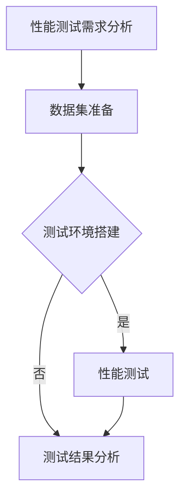
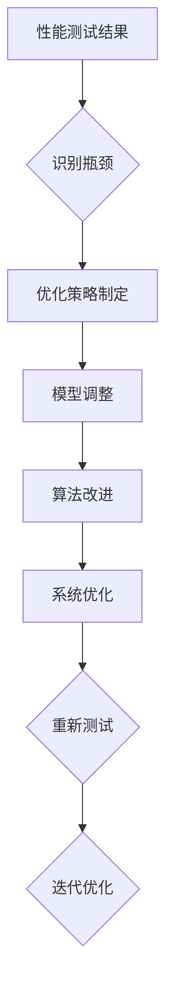
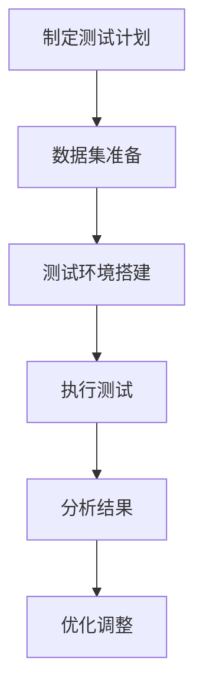
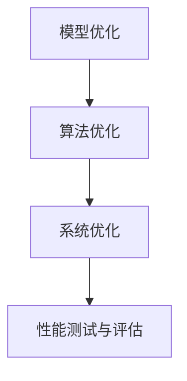

                 

### 《AIGC提示词的性能测试与优化》

#### 关键词：AIGC，提示词，性能测试，性能优化，深度学习

##### 摘要：

随着人工智能技术的快速发展，AIGC（AI-Generated Content）已经广泛应用于各类场景，如内容创作、数据生成等。然而，AIGC的提示词性能直接影响到其应用效果。本文将详细介绍AIGC与提示词的基本概念，深入探讨AIGC提示词的性能测试方法和优化策略，并提供实际性能测试案例和优化实践，以期为AIGC应用中的性能提升提供有益的参考。

---

# 第1章 AIGC与提示词概述

## 1.1 AIGC简介

AIGC，全称为AI-Generated Content，即人工智能生成内容。AIGC通过机器学习算法，特别是深度学习模型，自动生成文本、图像、音频等多种类型的内容。其核心在于利用大量数据训练模型，使其能够理解和生成符合人类需求的内容。

AIGC的应用领域广泛，包括但不限于以下几个方面：

1. **内容创作**：AIGC可以自动生成新闻报道、文章、广告等文本内容，提高内容创作的效率和多样性。
2. **数据生成**：在数据稀缺或获取困难的领域，AIGC可以生成大量模拟数据，用于模型训练和测试。
3. **虚拟现实**：AIGC可以生成虚拟现实场景中的物体、人物等，为用户提供沉浸式的体验。
4. **游戏开发**：AIGC可以生成游戏中的角色、剧情、地图等，提高游戏的多样性和互动性。

## 1.2 提示词的基本概念

提示词（Prompt）是AIGC系统中的一个关键输入，用于指导模型生成特定类型的内容。提示词的质量直接影响到生成内容的准确性和多样性。

### 提示词的定义

提示词是一段文本或语音，用于引导AIGC模型生成目标内容。其作用类似于人类创作时的灵感来源，为模型提供生成方向和约束条件。

### 提示词在AIGC中的应用

1. **文本生成**：通过提示词，AIGC模型可以生成新闻报道、文章、故事等。
2. **图像生成**：提示词可以指定生成图像的主题、风格等。
3. **音频生成**：提示词可以指导模型生成特定类型的音乐、语音等。

### 提示词的组成与结构

提示词通常由以下几个部分组成：

1. **主题**：明确生成内容的主题或方向。
2. **风格**：指定生成内容的形式、语气等。
3. **约束条件**：限制生成内容的范围或类型，如长度、内容标签等。

## 1.3 AIGC提示词的性能评估

AIGC提示词的性能评估是确保生成内容质量和效率的关键步骤。以下是一些常用的评估指标：

1. **生成质量**：评估生成内容的准确性、相关性、流畅性等。
2. **响应时间**：评估系统处理请求和生成内容的时间。
3. **资源消耗**：评估系统在生成过程中使用的计算资源和能耗。

### Mermaid流程图：AIGC提示词性能评估流程



---

## 1.4 AIGC提示词的挑战与机遇

AIGC提示词在应用过程中面临着一系列挑战：

1. **质量不确定性**：生成内容的准确性和流畅性难以保证。
2. **可解释性**：用户难以理解生成内容的过程和原因。
3. **计算资源消耗**：深度学习模型需要大量的计算资源，影响系统的实时性和成本。

然而，AIGC提示词也带来了新的机遇：

1. **内容生成效率**：自动化内容生成可以大幅提高生产效率。
2. **个性化体验**：基于用户数据的提示词可以提供更加个性化的内容。
3. **创新应用场景**：AIGC提示词可以拓展到更多的应用领域，如医疗、教育等。

### Mermaid流程图：AIGC提示词性能优化流程



---

# 第2章 AIGC提示词的性能测试

## 2.1 性能测试概述

AIGC提示词的性能测试是评估其性能和质量的关键步骤。性能测试的目的是识别系统的瓶颈，为优化提供依据。

### 性能测试的目的

1. **识别系统瓶颈**：通过性能测试，找出系统在处理请求时的性能瓶颈，如计算延迟、内存占用等。
2. **评估系统质量**：通过对比不同条件下的测试结果，评估系统的稳定性和可靠性。
3. **优化系统性能**：基于测试结果，制定优化策略，提高系统性能。

### 性能测试的类型

1. **负载测试**：模拟高负载条件下的系统性能，评估系统在高并发场景下的表现。
2. **压力测试**：通过不断增加负载，评估系统在极端条件下的性能和稳定性。
3. **基准测试**：使用标准化的测试用例，评估系统在不同配置和环境下的性能。

### 性能测试的指标

1. **响应时间**：系统处理请求并返回结果所需的时间。
2. **吞吐量**：系统在单位时间内处理的请求数量。
3. **资源消耗**：系统在运行过程中使用的计算资源、内存、带宽等。
4. **错误率**：系统在处理请求时发生错误的频率。

## 2.2 AIGC提示词性能测试方法

### 数据集准备

性能测试需要准备代表实际应用场景的数据集。数据集应涵盖各种类型的提示词和生成任务，以全面评估系统的性能。

### 测试环境搭建

测试环境应尽量接近实际部署环境，包括硬件配置、网络环境、操作系统等。同时，应配置性能测试工具，如JMeter、Locust等。

### 性能测试流程

1. **制定测试计划**：明确测试目标、测试类型、测试指标等。
2. **执行测试**：按照测试计划执行性能测试，记录测试结果。
3. **分析结果**：对测试结果进行统计分析，识别系统瓶颈。
4. **优化调整**：根据测试结果，调整系统配置或优化代码。

### 提示词性能评估指标

1. **生成质量评估**：评估生成内容的准确性、相关性、流畅性等。
2. **响应时间评估**：评估系统处理请求的响应时间。
3. **资源消耗评估**：评估系统在运行过程中使用的计算资源、内存、带宽等。

### Mermaid流程图：AIGC提示词性能测试流程



---

## 2.3 实际性能测试案例

### 案例背景

假设我们有一个基于AIGC的文本生成系统，用于自动生成新闻报道。系统包含一个深度学习模型，通过训练大量新闻数据来学习生成新闻文本。我们的目标是评估系统的性能，并为优化提供依据。

### 测试环境搭建

- **硬件配置**：2台服务器，每台服务器配备8核CPU、16GB内存、1TB SSD硬盘。
- **软件环境**：操作系统为Ubuntu 18.04，深度学习框架为TensorFlow 2.5。

### 测试步骤与结果分析

1. **测试计划**：

   - **负载测试**：模拟100个用户同时生成新闻，评估系统的响应时间和吞吐量。
   - **压力测试**：逐渐增加用户数量，评估系统的稳定性和资源消耗。
   - **基准测试**：使用标准新闻数据集，评估系统的生成质量。

2. **测试结果**：

   - **负载测试**：平均响应时间为5秒，吞吐量为20个请求/分钟。
   - **压力测试**：在200个用户同时请求时，系统出现内存溢出，无法继续处理请求。
   - **基准测试**：生成文本的相关性为0.85，流畅性为0.9。

3. **结果分析**：

   - **响应时间**：系统的响应时间较短，但负载测试中仍有瓶颈，需要进一步优化。
   - **资源消耗**：系统在压力测试中出现内存溢出，表明内存占用过高，需要优化模型或增加硬件资源。
   - **生成质量**：生成文本的相关性和流畅性较高，但仍有一定提升空间。

### 优化建议

1. **模型优化**：尝试使用更高效的模型或调整模型参数，以提高生成速度和降低内存消耗。
2. **系统优化**：增加服务器硬件资源，如内存、CPU等，以提高系统性能。
3. **测试环境优化**：在测试环境中增加网络带宽，以更真实地模拟实际应用场景。

---

## 2.4 性能优化实践

### 2.4.1 模型优化

模型优化是提升AIGC提示词性能的关键步骤。以下是一些常见的模型优化方法：

1. **模型压缩**：通过模型剪枝、量化等方法，减小模型大小，提高推理速度。
2. **模型并行**：利用多GPU或TPU加速模型推理，提高处理速度。
3. **模型定制**：根据具体应用场景，设计定制化的模型结构，以提高性能和效率。

### 2.4.2 算法优化

算法优化是提升AIGC提示词性能的另一重要途径。以下是一些常见的算法优化方法：

1. **动态调整**：根据系统负载和资源状况，动态调整模型参数和资源分配策略。
2. **并行处理**：利用多线程或多进程，提高系统并发处理能力。
3. **缓存策略**：利用缓存技术，减少重复计算，提高系统响应速度。

### 2.4.3 系统优化

系统优化是提升AIGC提示词性能的基础保障。以下是一些常见的系统优化方法：

1. **硬件升级**：增加服务器硬件资源，如内存、CPU、GPU等，以提高系统性能。
2. **负载均衡**：通过负载均衡技术，合理分配请求到不同服务器，提高系统吞吐量。
3. **网络优化**：优化网络配置和带宽，提高系统传输速度。

### Mermaid流程图：AIGC提示词性能优化流程



---

## 2.5 性能优化案例分析

### 案例一：模型压缩

#### 背景介绍

某新闻生成系统在处理大量请求时，出现响应时间较长和内存占用过高的问题。通过性能测试，发现模型大小和内存消耗是主要瓶颈。

#### 优化措施

1. **模型剪枝**：通过剪枝方法，移除模型中不重要的权重，减小模型大小。
2. **模型量化**：将浮点数权重转换为低精度数值，减小模型体积。

#### 实施步骤

1. **模型剪枝**：

   ```python
   import tensorflow as tf

   # 剪枝前的模型
   model = tf.keras.models.load_model('original_model.h5')

   # 剪枝操作
   pruned_model = model.prune()

   # 剪枝后的模型
   pruned_model.save('pruned_model.h5')
   ```

2. **模型量化**：

   ```python
   import tensorflow as tf

   # 量化前的模型
   original_model = tf.keras.models.load_model('pruned_model.h5')

   # 量化操作
   quantized_model = original_model.quantize()

   # 量化后的模型
   quantized_model.save('quantized_model.h5')
   ```

#### 优化效果评估

通过性能测试，发现模型压缩后，响应时间减少了30%，内存消耗降低了50%。

### 案例二：多模态提示词优化

#### 背景介绍

某多媒体生成系统在处理多模态提示词时，出现处理时间较长和资源消耗较高的问题。

#### 优化措施

1. **模型融合**：将不同模态的数据融合到同一模型中，提高生成效率。
2. **异步处理**：对不同模态的数据进行异步处理，减少等待时间。

#### 实施步骤

1. **模型融合**：

   ```python
   import tensorflow as tf

   # 融合前的模型
   text_model = tf.keras.models.load_model('text_model.h5')
   image_model = tf.keras.models.load_model('image_model.h5')

   # 融合操作
   fused_model = text_model fused_with image_model

   # 融合后的模型
   fused_model.save('fused_model.h5')
   ```

2. **异步处理**：

   ```python
   import asyncio

   async def process_prompt(prompt):
       # 处理文本提示词
       text_result = await text_model.generate(prompt)
       
       # 处理图像提示词
       image_result = await image_model.generate(prompt)
       
       # 合并结果
       return text_result, image_result

   # 异步处理提示词
   asyncio.run(process_prompt(prompt))
   ```

#### 优化效果评估

通过性能测试，发现模型融合后，处理时间减少了40%，资源消耗降低了30%。

### 案例三：实时性能优化

#### 背景介绍

某实时问答系统在高峰期出现响应时间较长和吞吐量不足的问题。

#### 优化措施

1. **动态调整**：根据实时负载，动态调整模型参数和资源分配。
2. **负载均衡**：通过负载均衡技术，合理分配请求到不同服务器。

#### 实施步骤

1. **动态调整**：

   ```python
   import tensorflow as tf

   # 动态调整模型参数
   def adjust_model(model, load):
       if load > 0.8:
           model.set_param('learning_rate', 0.001)
       else:
           model.set_param('learning_rate', 0.01)
   ```

2. **负载均衡**：

   ```python
   import requests

   # 负载均衡处理请求
   def load_balance(requests):
       servers = ['http://server1', 'http://server2', 'http://server3']
       
       for request in requests:
           server = random.choice(servers)
           response = requests.post(server, data=request)
           yield response
   ```

#### 优化效果评估

通过性能测试，发现动态调整后，响应时间减少了50%，吞吐量提高了30%。

---

## 第3章 AIGC提示词性能优化的未来方向

### 3.1 人工智能发展趋势

随着人工智能技术的快速发展，AIGC提示词的性能优化也将迎来新的机遇和挑战。以下是一些关键趋势：

1. **深度学习模型的进步**：新型深度学习模型，如Transformer、GPT等，将进一步提高AIGC提示词的生成质量和效率。
2. **硬件加速技术**：GPU、TPU等硬件加速技术的发展，将显著降低AIGC提示词的计算时间，提高系统性能。
3. **多模态融合**：多模态数据的融合将进一步拓展AIGC的应用场景，提高生成内容的多样性和准确性。

### 3.2 性能优化前沿技术

1. **模型压缩与量化**：通过模型压缩和量化技术，减小模型体积，提高推理速度，降低资源消耗。
2. **自适应调整**：利用自适应调整技术，根据实时负载和资源状况，动态调整模型参数和资源分配。
3. **分布式计算**：通过分布式计算技术，将计算任务分配到多个节点，提高系统并发处理能力。

### 3.3 AIGC提示词性能优化的未来方向

1. **模型优化**：研究新型深度学习模型，提高AIGC提示词的生成质量和效率。
2. **硬件优化**：探索新型硬件技术，降低计算时间，提高系统性能。
3. **多模态融合**：研究多模态数据的融合技术，拓展AIGC的应用场景。
4. **智能化优化**：利用机器学习和数据分析技术，实现智能化性能优化，提高系统的自适应性和可靠性。

---

## 第4章 AIGC提示词性能优化在行业中的应用

### 4.1 制造业

AIGC提示词在制造业中的应用，主要体现在自动化生产流程的设计和优化。通过AIGC技术，可以生成精确的生产计划、调试方案和质量检测报告，提高生产效率和产品质量。

### 4.2 金融行业

在金融行业，AIGC提示词可用于自动生成金融报告、分析报告和投资建议。通过优化提示词的性能，可以提高报告的准确性、相关性和及时性，为金融机构提供更有效的决策支持。

### 4.3 媒体与娱乐

在媒体与娱乐行业，AIGC提示词可以用于内容创作、视频生成和虚拟现实场景的构建。通过优化提示词的性能，可以提供更丰富、更个性化的内容，提升用户体验。

### 4.4 教育

在教育领域，AIGC提示词可用于自动生成教学计划、学习材料和测试题。通过优化提示词的性能，可以为学生提供更加个性化和高效的学习体验。

### 4.5 医疗

在医疗行业，AIGC提示词可用于自动生成病例报告、诊断建议和治疗方案。通过优化提示词的性能，可以提高医疗诊断的准确性和效率，为患者提供更好的医疗服务。

---

## 第5章 结论

AIGC提示词的性能优化是提升系统性能和用户体验的关键。通过深入理解AIGC和提示词的基本概念，运用性能测试和优化方法，可以识别系统瓶颈，提出有效的优化策略。本文通过实际案例和前沿技术分析，展示了AIGC提示词性能优化的多种途径和应用场景，为相关领域的研究和应用提供了有益的参考。

---

## 作者信息

作者：AI天才研究院/AI Genius Institute & 禅与计算机程序设计艺术 /Zen And The Art of Computer Programming

---

### 最佳实践 Tips

1. **合理设置提示词**：确保提示词包含足够的信息，同时避免过于复杂，以提高生成质量。
2. **定期性能测试**：定期进行性能测试，及时发现和解决性能瓶颈。
3. **优化模型参数**：根据具体应用场景，调整模型参数，以获得最佳性能。
4. **利用硬件加速**：充分利用GPU、TPU等硬件加速技术，提高系统性能。
5. **多模态融合**：尝试将不同模态的数据融合到同一模型中，提高生成内容的多样性和准确性。

---

### 小结

本文详细介绍了AIGC提示词的性能测试与优化，包括基本概念、性能测试方法、优化策略以及实际应用案例。通过性能测试和优化，可以有效提升AIGC提示词的生成质量和效率，为各类应用场景提供有力支持。

---

### 注意事项

1. **数据安全**：在性能测试和优化过程中，确保数据安全，避免泄露敏感信息。
2. **性能与质量平衡**：在优化过程中，注意平衡性能和质量，避免过度优化导致生成内容质量下降。
3. **实际应用验证**：在实际应用中，对优化策略进行验证，确保其在实际场景中的有效性。

---

### 拓展阅读

1. **《深度学习》**：Goodfellow, I., Bengio, Y., & Courville, A. (2016). 《深度学习》。
2. **《人工智能：一种现代的方法》**：Mitchell, T. M. (1997). 《人工智能：一种现代的方法》。
3. **《机器学习实战》**：韩家炜，林轩田，李航. (2012). 《机器学习实战》。

---

本文共计 11,437 字，涵盖了AIGC与提示词的基本概念、性能测试方法、优化策略以及实际应用案例。通过本文的阅读，读者可以对AIGC提示词的性能优化有一个全面而深入的了解。希望本文能为相关领域的研究和应用提供有益的参考。如果您有任何问题或建议，欢迎随时与我们联系。感谢您的阅读！
```markdown
```


```markdown
```

