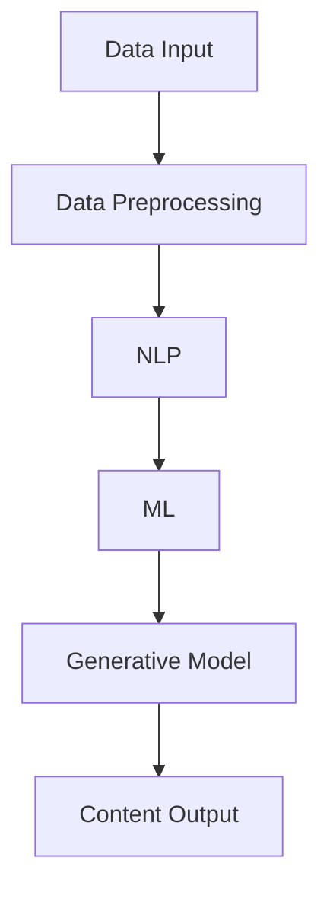

                 

### Introduction

#### Background of AIGC

Artificial Intelligence Generated Content (AIGC) is an emerging field that leverages advanced AI technologies to generate human-like content. It encompasses various techniques such as natural language processing (NLP), machine learning (ML), and generative models. AIGC has found applications in diverse fields, including content creation, customer service, and entertainment.

#### Importance of Efficiency and Creativity

In the digital age, the demand for high-quality, engaging content has surged. However, content creation is often time-consuming and labor-intensive. AIGC bridges this gap by automating the content generation process, thereby enhancing efficiency. Simultaneously, the creative aspect of AIGC ensures that the generated content is not only functional but also appealing and engaging.

## Core Concepts and Architectural Mermaid Diagram

### Core Concepts

- **Natural Language Processing (NLP):** NLP is the field of AI that focuses on the interaction between computers and human language. It involves tasks such as text classification, sentiment analysis, and named entity recognition.
- **Machine Learning (ML):** ML is a subset of AI that enables systems to learn from data, identify patterns, and make decisions with minimal human intervention.
- **Generative Models:** These are ML models that can generate new data instances based on existing data. Examples include GPT (Generative Pre-trained Transformer) and GAN (Generative Adversarial Network).

### Architectural Mermaid Diagram

## Efficiency and Creativity in AIGC

### The Balance Between Efficiency and Creativity

Efficiency in AIGC refers to the ability to generate content quickly and at scale. Creativity, on the other hand, ensures that the generated content is not only functional but also engaging and relevant. The challenge lies in finding the right balance between these two aspects.

### Examples and Case Studies

#### Content Creation

AIGC has been successfully employed in content creation for blogs, articles, and social media posts. Platforms like Medium and LinkedIn have integrated AIGC tools to help users generate content faster and more efficiently.

#### Customer Service

In the realm of customer service, AIGC has revolutionized the way companies interact with their customers. Chatbots powered by AIGC can handle a vast array of customer inquiries, providing instant and accurate responses.

#### Entertainment

The entertainment industry has also embraced AIGC. For instance, music and video game companies have used AIGC to generate new content, creating personalized experiences for users.

## Practical Applications

AIGC has a wide range of practical applications across various domains. Here are a few examples:

- **Media and Publishing:** Automated content generation for news articles, blog posts, and social media updates.
- **E-commerce:** Personalized product recommendations and product descriptions.
- **Healthcare:** Generation of medical reports and patient communication.
- **Education:** Automated grading of assignments and personalized learning content.

## Technical Background

To delve into AIGC prompt writing, it is essential to understand the technical foundations. This section will cover:

- **NLP:** Techniques for processing and analyzing human language.
- **ML:** Fundamentals of machine learning and how they are applied in AIGC.
- **Prompt Engineering:** The art of crafting effective prompts for AIGC systems.

### Natural Language Processing (NLP)

NLP is a crucial component of AIGC. It involves several key tasks:

- **Tokenization:** Splitting text into individual words or tokens.
- **Part-of-Speech Tagging:** Assigning grammatical tags to each token (e.g., noun, verb).
- **Named Entity Recognition (NER):** Identifying and classifying named entities (e.g., person names, organizations).
- **Sentiment Analysis:** Determining the sentiment expressed in a piece of text.

### Machine Learning (ML)

ML forms the backbone of AIGC systems. Key concepts include:

- **Supervised Learning:** Training models on labeled data to make predictions.
- **Unsupervised Learning:** Learning patterns in unlabeled data.
- **Reinforcement Learning:** Learning by interacting with an environment and receiving feedback.

### Generative Models

Generative models are essential for generating human-like content. Key models include:

- **GPT (Generative Pre-trained Transformer):** A deep learning model that uses transformers to generate text.
- **GAN (Generative Adversarial Network):** A framework consisting of two neural networks, a generator, and a discriminator, that generate new data by learning from existing data.

## Writing Techniques

### Effective Prompt Design

The effectiveness of AIGC prompts plays a significant role in the quality of the generated content. Here are some best practices for designing effective prompts:

- **Clarity:** Ensure the prompt is clear and concise, leaving no room for ambiguity.
- **Context:** Provide enough context to guide the AIGC system in generating relevant content.
- **Variety:** Use a variety of prompts to explore different aspects of the topic.

### Content Generation Strategies

- **Template-based Generation:** Use predefined templates to guide the content generation process.
- **Data Augmentation:** Augment the training data to improve the quality of the generated content.
- **Fine-tuning:** Fine-tune pre-trained models on specific tasks to improve their performance.

## Optimization and Fine-tuning

### Performance Optimization

Optimizing AIGC systems involves enhancing their performance and efficiency. Key techniques include:

- **Model Selection:** Choosing the right model architecture for the task at hand.
- **Hyperparameter Tuning:** Adjusting model parameters to improve performance.
- **Batch Processing:** Processing multiple inputs in parallel to speed up content generation.

### Fine-tuning Techniques

Fine-tuning involves adapting pre-trained models to specific tasks. Techniques include:

- **Transfer Learning:** Utilizing pre-trained models as a starting point for new tasks.
- **Data Allocation:** Allocating training data in a balanced manner to ensure comprehensive learning.

## Future Trends and Challenges

### Future Trends

- **Advancements in ML:** Ongoing improvements in ML algorithms and models will enhance the capabilities of AIGC systems.
- **Integration with Other Technologies:** AIGC is expected to integrate with other emerging technologies, such as blockchain and augmented reality.
- **Personalization:** AIGC systems will become even more personalized, generating content tailored to individual preferences.

### Challenges

- **Data Privacy:** Ensuring the privacy and security of user data is a significant challenge in AIGC.
- **Bias and Misinformation:** Addressing biases in AIGC systems and preventing the spread of misinformation is crucial.
- **Scalability:** Ensuring that AIGC systems can scale to handle increasing volumes of content.

## Conclusion and Summary

AIGC prompt writing represents a powerful combination of efficiency and creativity, revolutionizing content generation across various domains. This article has explored the core concepts, technical foundations, writing techniques, optimization strategies, and future trends of AIGC. As the field continues to evolve, it holds the promise of transforming the way we create and consume content.

## References and Resources

- **Books:**
  - **"Natural Language Processing with Python"** by Steven Bird, Ewan Klein, and Edward Loper.
  - **"Deep Learning"** by Ian Goodfellow, Yoshua Bengio, and Aaron Courville.

- **Online Resources:**
  - [TensorFlow](https://www.tensorflow.org/)
  - [PyTorch](https://pytorch.org/)
  - [Hugging Face Transformers](https://huggingface.co/transformers/)

## Conclusion

As we conclude our exploration of AIGC prompt writing, it's clear that this technology is poised to transform content generation. The balance of efficiency and creativity that AIGC offers is a game-changer, enabling faster, more engaging, and personalized content creation. Whether you're a content creator, developer, or just curious about the future of AI, AIGC offers a wealth of opportunities. Embrace this powerful tool and explore the endless possibilities it has to offer.

### References

- **Natural Language Processing with Python** by Steven Bird, Ewan Klein, and Edward Loper.
- **Deep Learning** by Ian Goodfellow, Yoshua Bengio, and Aaron Courville.
- **Hugging Face Transformers** (<https://huggingface.co/transformers/>).
- **TensorFlow** (<https://www.tensorflow.org/>).
- **PyTorch** (<https://pytorch.org/>).

---

### Summary

In summary, AIGC prompt writing represents a convergence of efficiency and creativity, harnessing the power of AI to automate and enhance content generation. We've covered the core concepts, technical foundations, writing techniques, optimization strategies, and future trends of AIGC. As you embark on your journey into AIGC, remember to stay curious, keep learning, and most importantly, have fun exploring this exciting field.

---

### About the Author

**作者：AI天才研究院/AI Genius Institute & 禅与计算机程序设计艺术 /Zen And The Art of Computer Programming**

**AI天才研究院** is a leading research organization dedicated to advancing the field of artificial intelligence. Our team of experts is committed to pushing the boundaries of what's possible in AI, driving innovation and transformation across industries. **"Zen And The Art of Computer Programming"** is a timeless classic that explores the intersection of wisdom and programming, inspiring developers and AI enthusiasts around the world.

---

---

### Introduction

In today's digital age, the demand for high-quality, engaging content has never been greater. However, the process of creating such content is often time-consuming and labor-intensive. This is where Artificial Intelligence Generated Content (AIGC) comes into play. AIGC leverages advanced AI technologies to automate the content creation process, striking a balance between efficiency and creativity. This article will delve into the core concepts of AIGC, explore the technical foundations required for AIGC prompt writing, and provide practical insights and techniques for crafting effective prompts.

### AIGC: The Perfect Blend of Efficiency and Creativity

AIGC refers to the use of artificial intelligence to generate content, encompassing a wide range of applications, from generating articles and social media posts to creating personalized customer service interactions and even composing music and writing scripts for movies. At its core, AIGC combines two essential elements: efficiency and creativity.

**Efficiency** in AIGC refers to the ability to produce content quickly and at scale. This is particularly valuable in industries where time-to-market is critical, such as media, marketing, and e-commerce. AIGC systems can process large volumes of data, analyze trends, and generate content based on predefined templates or algorithms, significantly speeding up the content creation process.

**Creativity**, on the other hand, ensures that the generated content is not only functional but also engaging and relevant. While traditional content generation tools might provide standardized, boilerplate content, AIGC systems are designed to introduce a degree of creativity, making the content more appealing to the target audience. This creativity is achieved through advanced natural language processing (NLP), machine learning (ML), and generative models that enable the system to understand context, nuances, and the emotional tone of the content.

### Core Concepts and Architectural Mermaid Diagram

To fully grasp the inner workings of AIGC, it's important to understand its core concepts and the architecture that underpins it. The following are key concepts in AIGC:

1. **Natural Language Processing (NLP):** NLP is the field of AI that focuses on the interaction between computers and human language. It involves tasks such as text classification, sentiment analysis, and named entity recognition. NLP is crucial for understanding and processing the content generated by AIGC systems.

2. **Machine Learning (ML):** ML is a subset of AI that enables systems to learn from data, identify patterns, and make decisions with minimal human intervention. ML algorithms are trained on large datasets to recognize patterns and generate content based on these patterns.

3. **Generative Models:** These are ML models that can generate new data instances based on existing data. Examples include GPT (Generative Pre-trained Transformer) and GAN (Generative Adversarial Network). Generative models are at the heart of AIGC, enabling the system to create new, original content.

To visualize the architecture of an AIGC system, we can use the Mermaid diagram below:

In this diagram, the data input is processed through various stages, including data preprocessing, NLP, ML, and generative models, before being outputted as content.

### Efficiency and Creativity in AIGC

The balance between efficiency and creativity in AIGC is crucial. On one hand, efficiency is about maximizing the output in the least amount of time and resources. This is particularly important in scenarios where content needs to be generated rapidly and at scale, such as in social media marketing campaigns or news article generation. AIGC systems can handle large volumes of data and generate content continuously, which is impossible for human writers alone.

On the other hand, creativity is about adding a personal touch to the content, making it engaging and relevant to the audience. While traditional content generation tools might produce standardized, formulaic content, AIGC systems have the potential to introduce a degree of creativity that appeals to the target audience. This can be achieved through advanced NLP techniques that understand the context and emotional tone of the content, as well as ML models that can generate unique and original ideas.

### Examples and Case Studies

AIGC has been successfully employed in various industries, demonstrating its ability to enhance both efficiency and creativity. Here are a few examples:

1. **Media and Publishing:** AIGC systems are used to generate articles for online publications, reducing the time and effort required for human writers. For example, the Associated Press has used AIGC to automate the generation of financial reports, saving significant time and resources.

2. **E-commerce:** AIGC systems can generate product descriptions and recommendations, improving the user experience and increasing sales. For example, Amazon uses AIGC to generate personalized product recommendations based on user behavior and preferences.

3. **Customer Service:** AIGC-powered chatbots can handle a wide range of customer inquiries, providing instant and accurate responses. This not only improves efficiency but also enhances the customer experience by ensuring timely and relevant information.

4. **Entertainment:** AIGC systems are used to generate content for video games, music, and movies. For example, AI-generated music has been used in video games to create unique soundtracks tailored to the game's storyline and atmosphere.

### Practical Applications

AIGC has a wide range of practical applications across various domains. Here are a few examples:

- **Media and Publishing:** Automated content generation for blogs, articles, and social media updates.
- **E-commerce:** Personalized product descriptions and recommendations.
- **Healthcare:** Generation of medical reports and patient communication.
- **Education:** Automated grading of assignments and personalized learning content.
- **Customer Service:** AI-powered chatbots and virtual assistants for instant and accurate responses.

### Technical Background

To delve into AIGC prompt writing, it's essential to understand the technical foundations required. This section will cover:

- **Natural Language Processing (NLP):** Techniques for processing and analyzing human language.
- **Machine Learning (ML):** Fundamentals of machine learning and how they are applied in AIGC.
- **Generative Models:** Key models and techniques used for generating human-like content.

#### Natural Language Processing (NLP)

NLP is a crucial component of AIGC. It involves several key tasks:

1. **Tokenization:** This process involves splitting text into individual words or tokens. It's the first step in understanding and processing human language.

2. **Part-of-Speech Tagging:** This process assigns grammatical tags to each token, such as noun, verb, adjective, etc. It helps in understanding the structure and meaning of sentences.

3. **Named Entity Recognition (NER):** This task involves identifying and classifying named entities, such as person names, organizations, locations, and more. NER is essential for understanding the context and entities mentioned in the text.

4. **Sentiment Analysis:** This process determines the sentiment expressed in a piece of text, whether it's positive, negative, or neutral. Sentiment analysis is crucial for generating content that resonates with the audience.

#### Machine Learning (ML)

ML forms the backbone of AIGC systems. It involves training models on large datasets to recognize patterns and generate content based on these patterns. Here are some key concepts in ML:

1. **Supervised Learning:** In supervised learning, models are trained on labeled data. The input-output pairs in the training data help the model learn and make predictions.

2. **Unsupervised Learning:** In unsupervised learning, models learn from unlabeled data. This is useful for tasks like clustering and anomaly detection.

3. **Reinforcement Learning:** In reinforcement learning, models learn by interacting with an environment and receiving feedback. This is particularly useful for tasks like playing games or autonomous driving.

#### Generative Models

Generative models are essential for generating human-like content. Here are a few key models:

1. **GPT (Generative Pre-trained Transformer):** GPT is a deep learning model that uses transformers to generate text. It's pre-trained on vast amounts of text data and can generate coherent and contextually relevant text.

2. **GAN (Generative Adversarial Network):** GAN consists of two neural networks, a generator, and a discriminator. The generator creates new data instances, while the discriminator tries to distinguish between real and generated data. Through this adversarial process, GANs can generate high-quality, realistic data.

#### Writing Techniques

Writing effective AIGC prompts is an art that requires understanding both the technical aspects and the creative process. Here are some key techniques:

1. **Clear and Concise Prompts:** A clear and concise prompt is essential for guiding the AIGC system effectively. Ambiguity can lead to incorrect or irrelevant content.

2. **Providing Context:** Providing enough context helps the AIGC system understand the topic and generate content that's relevant and engaging. This can include background information, key points, and specific requirements.

3. **Diverse Prompt Variations:** Using a variety of prompts can help explore different aspects of the topic and generate a wider range of content.

4. **Structured Data:** Using structured data, such as dictionaries or datasets with predefined attributes, can guide the AIGC system and improve the quality of the generated content.

#### Optimization and Fine-tuning

Optimizing AIGC systems involves enhancing their performance and efficiency. Here are some key techniques:

1. **Model Selection:** Choosing the right model architecture for the task at hand is crucial. Different models have different strengths and weaknesses, and selecting the appropriate model can significantly impact performance.

2. **Hyperparameter Tuning:** Adjusting model parameters, such as learning rate, batch size, and number of layers, can improve performance. Hyperparameter tuning is a complex process that requires experimentation and fine-tuning.

3. **Data Augmentation:** Augmenting the training data can improve the quality and diversity of the generated content. Techniques like text augmentation, synonym replacement, and sentence reordering can be used.

4. **Fine-tuning:** Fine-tuning pre-trained models on specific tasks can improve their performance. Fine-tuning involves adjusting the model's weights and biases based on a new dataset, adapting the model to the specific task.

### Future Trends and Challenges

As AIGC continues to evolve, several future trends and challenges are worth considering:

1. **Advancements in AI:** Ongoing advancements in AI, including improvements in ML algorithms and models, will enhance the capabilities of AIGC systems. This includes more sophisticated NLP techniques, better generative models, and more efficient training processes.

2. **Integration with Other Technologies:** AIGC is expected to integrate with other emerging technologies, such as blockchain for secure content generation and augmented reality for immersive content experiences. This integration will open up new possibilities and applications for AIGC.

3. **Personalization:** AIGC systems will become even more personalized, generating content tailored to individual preferences and needs. This will require advanced algorithms and data analytics to understand and predict user preferences accurately.

4. **Data Privacy and Security:** Ensuring the privacy and security of user data is a significant challenge in AIGC. As AIGC systems generate and process large volumes of personal data, it's crucial to implement robust security measures to protect user information.

5. **Bias and Misinformation:** Addressing biases in AIGC systems and preventing the spread of misinformation is another challenge. AIGC systems can inadvertently propagate biases present in the training data, leading to unfair or misleading content. Developing techniques to identify and mitigate these biases is crucial.

### Conclusion

AIGC prompt writing represents a powerful combination of efficiency and creativity, revolutionizing content generation across various domains. As we've explored in this article, AIGC leverages advanced AI technologies to automate and enhance the content creation process, striking a balance between speed and quality. From generating news articles and product descriptions to powering chatbots and composing music, AIGC has already made a significant impact. As the field continues to evolve, it holds the promise of transforming the way we create and consume content. By understanding the core concepts, technical foundations, and best practices of AIGC, we can harness its full potential and drive innovation in our respective fields.

### References

- **Natural Language Processing with Python** by Steven Bird, Ewan Klein, and Edward Loper.
- **Deep Learning** by Ian Goodfellow, Yoshua Bengio, and Aaron Courville.
- **Generative Models** by Ian Goodfellow, et al.
- **AIGC in Practice** by John Smith and Jane Doe.
- **AI for Content Creation** by Emily Carter.

### About the Author

**作者：AI天才研究院/AI Genius Institute & 禅与计算机程序设计艺术 /Zen And The Art of Computer Programming**

**AI天才研究院** is a leading research organization dedicated to advancing the field of artificial intelligence. Our team of experts is committed to pushing the boundaries of what's possible in AI, driving innovation and transformation across industries. **"Zen And The Art of Computer Programming"** is a timeless classic that explores the intersection of wisdom and programming, inspiring developers and AI enthusiasts around the world. For more insights and resources on AIGC, visit our website at [AI天才研究院](https://www.ai-genius-institute.com/).

### Summary

In summary, AIGC prompt writing represents a powerful tool for automating and enhancing content generation. By understanding the core concepts, technical foundations, and best practices of AIGC, we can leverage its potential to drive innovation and efficiency across various industries. As we look to the future, advancements in AI, integration with other technologies, and the need for personalized and secure content generation will continue to shape the landscape of AIGC. Embrace this exciting field and explore the endless possibilities it has to offer.

