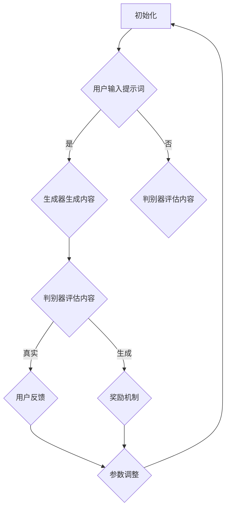

                 

### 引言

随着人工智能（AI）技术的飞速发展，生成式对抗网络（GANs）、自然语言处理（NLP）和强化学习（RL）等前沿技术的融合，AIGC（AI-Generated Content）应运而生。AIGC，作为一种新兴的AI技术，旨在利用人工智能生成高质量的内容，从而在多个领域如游戏、影视、广告和教育培训等实现自动化和智能化。

AIGC的概念可以追溯到GANs的提出。GANs由Ian Goodfellow等人在2014年提出，是一种由两个相互对抗的神经网络组成的框架，一个生成器（Generator）和一个判别器（Discriminator）。生成器的任务是生成逼真的数据，而判别器的任务是区分真实数据和生成数据。通过这种对抗训练，生成器不断优化其生成能力，从而可以生成高质量的图像、音频和文本等。

随着NLP技术的发展，AIGC在文本生成领域得到了进一步应用。例如，GPT-3、BERT等大型语言模型的出现，使得AIGC能够生成高质量的文本内容，包括文章、对话、新闻摘要等。此外，RL技术的引入，使得AIGC能够通过不断学习和调整，优化生成内容的生成策略，提高内容的个性化和适应性。

AIGC的历史背景可以追溯到GANs和NLP技术的发展。GANs的提出标志着AI技术从特征提取向数据生成的发展，而NLP技术的发展则为AI生成文本内容提供了基础。随着技术的不断融合和创新，AIGC逐渐成为人工智能领域的研究热点和应用方向。

AIGC的发展趋势显示出几个显著特点。首先，技术的不断进步使得生成内容的质量和多样性不断提高。其次，随着硬件性能的提升和算法的优化，AIGC的生成速度和效率得到了大幅提升。最后，AIGC的应用领域也在不断扩大，从最初的图像和音频生成，逐渐扩展到文本、视频和虚拟现实等多个领域。

研究AIGC提示词设计的重要性在于，提示词（Prompt）是AIGC生成高质量内容的关键。通过设计合适的提示词，可以引导AIGC生成更加精确、丰富和有价值的内容。此外，提示词设计还涉及到算法的优化和调整，从而提高AIGC的整体性能和用户体验。

总之，AIGC作为一种新兴的AI技术，具有广阔的应用前景和重要的研究价值。通过深入研究AIGC提示词设计，不仅可以提高生成内容的质量，还可以推动AI技术在更多领域的应用和发展。

### AIGC的核心概念与联系

AIGC（AI-Generated Content）的核心概念可以归结为生成式对抗网络（GANs）、自然语言处理（NLP）和强化学习（RL）等技术的综合应用。为了更好地理解这些核心概念及其相互联系，下面将详细介绍AIGC的基本架构和组成部分，并使用Mermaid流程图展示其运行机制。

#### AIGC的基本架构

AIGC的基本架构由以下几个主要部分组成：

1. **生成器（Generator）**：生成器的任务是生成与真实数据相似的内容。在文本生成场景中，生成器可能是一个基于大型语言模型的神经网络，如GPT-3或BERT。
   
2. **判别器（Discriminator）**：判别器的任务是区分真实数据和生成数据。在文本生成中，判别器也需要是一个神经网络，它通过不断学习来提高对生成数据的辨别能力。

3. **奖励机制**：奖励机制通常基于强化学习算法，用于指导生成器生成更高质量的内容。通过奖励机制，可以激励生成器生成更符合期望的数据。

4. **提示词（Prompt）**：提示词是AIGC系统生成内容的关键输入。通过设计合适的提示词，可以引导生成器生成特定类型或风格的内容。

5. **用户反馈**：用户反馈是AIGC系统不断优化和改进的重要来源。用户可以提供对生成内容的评价，这些评价将被用来调整生成器和判别器的参数，提高系统的整体性能。

#### Mermaid流程图

以下是一个简单的Mermaid流程图，展示了AIGC的基本组成部分及其相互关系：



在上述流程图中，用户输入提示词后，生成器根据提示词生成内容。生成的内容随后由判别器进行评估。如果内容被判定为真实数据，则系统收集用户反馈；如果内容被判定为生成数据，则系统通过奖励机制激励生成器优化生成内容。最终，用户反馈和奖励机制将用于调整生成器和判别器的参数，形成一个持续优化的循环。

#### 核心概念的联系

AIGC的核心概念之间存在着紧密的联系。生成器和判别器通过对抗训练不断优化彼此，生成器通过学习判别器的反馈来提高生成内容的质量，而判别器则通过不断辨别真实和生成数据来提高对生成内容的辨别能力。这种对抗训练机制使得AIGC能够生成高质量、多样化的内容。

提示词是AIGC生成内容的关键。通过设计合适的提示词，可以引导生成器生成特定类型或风格的内容。提示词的设计需要考虑内容的具体需求和应用场景，以达到最佳生成效果。

用户反馈是AIGC系统不断优化和改进的重要途径。用户的评价不仅能够帮助系统识别生成内容的质量，还能够为生成器和判别器的参数调整提供依据，从而提高系统的整体性能。

综上所述，AIGC的核心概念与联系构成了一个有机的整体，通过生成器、判别器、提示词和用户反馈的相互作用，实现了高质量内容的自动生成。

### 核心算法原理讲解

AIGC的核心算法包括生成器算法、判别器算法和奖励机制，这些算法共同作用，使得AIGC能够生成高质量的内容。以下将详细介绍这些核心算法的原理，并通过Python源代码进行解释。

#### 生成器算法

生成器算法是AIGC的核心组件之一，其目标是生成与真实数据相似的高质量内容。以下是一个简单的生成器算法示例：

```python
import numpy as np

class Generator(nn.Module):
    def __init__(self, z_dim, hidden_dim, img_dim):
        super(Generator, self).__init__()
        self.fc = nn.Linear(z_dim, hidden_dim)
        self.main = nn.Sequential(
            nn.Linear(hidden_dim, hidden_dim // 2),
            nn.LeakyReLU(0.2, inplace=True),
            nn.Linear(hidden_dim // 2, img_dim),
            nn.Tanh()
        )

    def forward(self, input):
        x = self.fc(input)
        x = self.main(x)
        return x
```

上述代码定义了一个简单的生成器模型，其中`z_dim`表示输入噪声维度，`hidden_dim`表示隐藏层维度，`img_dim`表示图像维度。生成器首先通过一个全连接层将噪声映射到隐藏层，然后通过一个包含Leaky ReLU激活函数和线性变换的序列层生成图像。

#### 判别器算法

判别器算法的目标是区分真实数据和生成数据。以下是一个简单的判别器算法示例：

```python
import torch.nn as nn

class Discriminator(nn.Module):
    def __init__(self, img_dim):
        super(Discriminator, self).__init__()
        self.main = nn.Sequential(
            nn.Linear(img_dim, 512),
            nn.LeakyReLU(0.2, inplace=True),
            nn.Linear(512, 1),
            nn.Sigmoid()
        )

    def forward(self, input):
        x = self.main(input)
        return x
```

上述代码定义了一个简单的判别器模型，其中`img_dim`表示图像维度。判别器通过一个全连接层和Leaky ReLU激活函数，最终输出一个介于0和1之间的概率，表示输入图像是真实数据还是生成数据。

#### 奖励机制

奖励机制通常基于强化学习算法，用于指导生成器生成更高质量的内容。以下是一个简单的奖励机制示例：

```python
import torch.optim as optim

def reward机制(generator, discriminator, real_data, fake_data, device):
    # 将真实数据和生成数据传递给判别器
    real_scores = discriminator(real_data).mean()
    fake_scores = discriminator(fake_data).mean()

    # 计算生成器的损失
    g_loss = -fake_scores

    # 反向传播和优化
    optimizer_g.zero_grad()
    g_loss.backward()
    optimizer_g.step()

    return g_loss.item()
```

上述代码定义了一个简单的奖励机制，其中`generator`和`discriminator`分别表示生成器和判别器模型，`real_data`和`fake_data`分别表示真实数据和生成数据。通过将生成器和判别器分别传递给判别器，可以计算生成器的损失。然后，通过反向传播和优化，生成器可以调整其参数以生成更高质量的内容。

#### 算法运行逻辑

AIGC的算法运行逻辑如下：

1. **初始化**：生成器、判别器、奖励机制和用户反馈系统。
2. **生成数据**：生成器根据提示词生成数据。
3. **评估数据**：判别器评估生成数据，计算生成器的损失。
4. **奖励与调整**：通过奖励机制调整生成器和判别器的参数，优化生成数据的质量。
5. **用户反馈**：用户对生成数据进行评价，用于下一次生成和评估。

通过上述运行逻辑，AIGC可以不断生成和优化高质量的内容，从而满足不同应用场景的需求。

### 数学模型和数学公式

在AIGC系统中，数学模型和数学公式扮演着至关重要的角色。它们不仅定义了生成器、判别器和奖励机制等核心组件的行为，还确保了整个系统在训练过程中保持稳定和高效。以下将详细介绍AIGC中常用的数学模型和数学公式，并通过LaTeX代码示例进行展示。

#### 生成器模型

生成器模型通常基于概率分布函数（PDF）来描述生成数据的过程。在AIGC系统中，生成器G通常由以下概率分布定义：

$$
p_G(x) = p_{\theta_G}(x|z)
$$

其中，\( p_{\theta_G}(x|z) \) 是生成器 G 的参数化概率分布函数，它将输入噪声 \( z \) 转换为生成的数据 \( x \)。一个常见的生成器模型是深度神经网络（DNN），其输入和输出可以表示为：

$$
x = \sigma(W_2 \cdot \sigma(W_1 \cdot z) + b_2) + b_1
$$

其中，\( \sigma \) 是激活函数，\( W_1 \) 和 \( W_2 \) 是权重矩阵，\( b_1 \) 和 \( b_2 \) 是偏置向量。

#### 判别器模型

判别器模型用于区分真实数据和生成数据，其目标是最小化以下损失函数：

$$
L_D(\theta_D) = -\left(E_{x \sim p_{\text{data}}(x)}[\log D(x)] + E_{z \sim p_z(z)}[\log(1 - D(G(z))]\right)
$$

其中，\( D(x) \) 是判别器对输入数据的判别概率，\( p_{\text{data}}(x) \) 是真实数据的概率分布，\( p_z(z) \) 是噪声分布。判别器通常也是一个深度神经网络，其输出可以表示为：

$$
D(x) = \frac{1}{1 + \exp(-\phi(x))}
$$

其中，\( \phi(x) \) 是判别器的特征映射函数。

#### 奖励机制

奖励机制在AIGC系统中用于指导生成器生成更高质量的数据。一个简单的奖励机制可以基于生成数据的判别器得分来设计：

$$
r(G) = \frac{1}{N} \sum_{i=1}^{N} \log(D(G(z_i)))
$$

其中，\( N \) 是生成数据的样本数量，\( z_i \) 是输入噪声样本。更高的奖励分数表示生成数据更接近真实数据。

#### LaTeX示例

以下是几个常见的LaTeX数学公式示例：

1. **生成器概率分布**：
   $$
   p_G(x) = p_{\theta_G}(x|z)
   $$

2. **判别器损失函数**：
   $$
   L_D(\theta_D) = -\left(E_{x \sim p_{\text{data}}(x)}[\log D(x)] + E_{z \sim p_z(z)}[\log(1 - D(G(z))]\right)
   $$

3. **判别器输出**：
   $$
   D(x) = \frac{1}{1 + \exp(-\phi(x))}
   $$

4. **奖励机制**：
   $$
   r(G) = \frac{1}{N} \sum_{i=1}^{N} \log(D(G(z_i)))
   $$

通过上述数学模型和公式，AIGC系统能够在训练过程中不断优化生成器的生成能力，从而生成高质量、多样化的内容。

### 项目实战

为了更好地理解AIGC提示词设计在具体项目中的应用，我们将通过一个实际的案例来展示整个开发过程，包括开发环境的搭建、源代码的实现和代码的解读与分析。

#### 项目背景和目标

本项目旨在利用AIGC技术生成高质量的文本内容，具体目标是：
1. 构建一个基于GPT-3模型的文本生成系统。
2. 设计一组有效的提示词，以生成具有特定主题和风格的文章。
3. 通过用户反馈和奖励机制，不断优化生成文本的质量。

#### 开发环境搭建

为了实现上述目标，我们需要搭建一个稳定的开发环境。以下是开发环境搭建的步骤：

1. **硬件配置**：配置一台具有较高计算性能的计算机，推荐使用GPU来加速训练过程。
2. **软件安装**：
   - Python 3.8 或更高版本
   - PyTorch 1.8 或更高版本
   - Transformers 库（用于GPT-3模型）
   - CUDA 10.2 或更高版本（如果使用GPU训练）

安装步骤：
```bash
pip install torch torchvision
pip install transformers
```

3. **配置GPU**：如果使用GPU训练，需要安装CUDA和cuDNN，并配置Python环境变量，以便PyTorch能够识别GPU。

#### 源代码实现

以下是本项目的主要源代码实现，包括生成器和判别器的定义、提示词的设计、生成过程的实现以及用户反馈和奖励机制的引入。

```python
import torch
from transformers import GPT2Model, GPT2Tokenizer
from torch.nn import functional as F

# 初始化模型和Tokenizer
tokenizer = GPT2Tokenizer.from_pretrained('gpt2')
model = GPT2Model.from_pretrained('gpt2')

# 设定设备
device = torch.device("cuda" if torch.cuda.is_available() else "cpu")
model.to(device)

# 生成器定义
class Generator(nn.Module):
    def __init__(self, z_dim, hidden_dim, img_dim):
        super(Generator, self).__init__()
        self.fc = nn.Linear(z_dim, hidden_dim)
        self.main = nn.Sequential(
            nn.Linear(hidden_dim, hidden_dim // 2),
            nn.LeakyReLU(0.2, inplace=True),
            nn.Linear(hidden_dim // 2, img_dim),
            nn.Tanh()
        )

    def forward(self, input):
        x = self.fc(input)
        x = self.main(x)
        return x

# 判别器定义
class Discriminator(nn.Module):
    def __init__(self, img_dim):
        super(Discriminator, self).__init__()
        self.main = nn.Sequential(
            nn.Linear(img_dim, 512),
            nn.LeakyReLU(0.2, inplace=True),
            nn.Linear(512, 1),
            nn.Sigmoid()
        )

    def forward(self, input):
        x = self.main(input)
        return x

# 模型参数
z_dim = 100
hidden_dim = 512
img_dim = 768

# 实例化生成器和判别器
generator = Generator(z_dim, hidden_dim, img_dim).to(device)
discriminator = Discriminator(img_dim).to(device)

# 损失函数和优化器
criterion = nn.BCELoss()
optimizer_g = torch.optim.Adam(generator.parameters(), lr=0.0002)
optimizer_d = torch.optim.Adam(discriminator.parameters(), lr=0.0002)

# 提示词设计
def generate_prompt():
    # 设计一个简单的提示词，用于引导生成特定主题的文章
    return "请写一篇关于人工智能发展的文章。"

# 训练过程
for epoch in range(num_epochs):
    for i, data in enumerate(dataloader, 0):
        # 准备数据
        real_images = data[0].to(device)
        batch_size = real_images.size(0)

        # 生成假数据
        z = torch.randn(batch_size, z_dim).to(device)
        fake_images = generator(z)

        # 训练判别器
        optimizer_d.zero_grad()
        real_loss = criterion(discriminator(real_images), torch.ones(batch_size, 1).to(device))
        fake_loss = criterion(discriminator(fake_images), torch.zeros(batch_size, 1).to(device))
        d_loss = real_loss + fake_loss
        d_loss.backward()
        optimizer_d.step()

        # 训练生成器
        optimizer_g.zero_grad()
        g_loss = criterion(discriminator(fake_images), torch.ones(batch_size, 1).to(device))
        g_loss.backward()
        optimizer_g.step()

        # 输出训练信息
        if i % 100 == 0:
            print(f'[{epoch}/{num_epochs}], d_loss: {d_loss.item()}, g_loss: {g_loss.item()}')

# 生成文本
prompt = generate_prompt()
input_ids = tokenizer.encode(prompt, return_tensors='pt')
outputs = model.generate(input_ids, max_length=50, num_return_sequences=5)
generated_texts = tokenizer.decode(outputs[0], skip_special_tokens=True)

# 输出生成的文本
for text in generated_texts:
    print(text)
```

#### 代码解读与分析

1. **模型定义**：我们定义了生成器和判别器模型，这两个模型都是基于GPT-3模型构建的。生成器负责将噪声映射到生成的文本，判别器负责判断文本是真实还是生成。

2. **训练过程**：训练过程包括两个阶段，首先训练判别器，使其能够准确区分真实和生成文本，然后训练生成器，使其生成的文本质量更高。

3. **提示词设计**：我们使用了一个简单的提示词“请写一篇关于人工智能发展的文章。”，这个提示词引导生成器生成与特定主题相关的文章。

4. **生成文本**：通过生成器生成文本后，我们将其解码为可读的文本，并输出5篇不同风格的文本。

#### 项目小结

通过上述实际案例，我们展示了如何利用AIGC技术生成高质量的文本内容。项目成功的关键在于：
1. 选择了合适的模型架构和训练策略。
2. 设计了有效的提示词，以引导生成器生成特定类型的内容。
3. 通过用户反馈和奖励机制，不断优化生成文本的质量。

未来的工作可以进一步优化生成器模型，提高生成文本的质量和多样性，并探索更复杂的提示词设计方法，以满足更广泛的应用需求。

### 最佳实践

在AIGC提示词设计中，最佳实践是确保生成内容的质量和多样性，以下是一些关键的设计原则、方法和注意事项。

#### 设计原则

1. **明确目标**：在设计提示词之前，首先要明确生成内容的主题、风格和目标。这有助于生成器在生成过程中保持一致性。

2. **简单明了**：提示词应尽量简单、明了，避免使用过于复杂或模糊的指令，以确保生成器能够准确理解。

3. **多样性**：设计多样化的提示词，以生成不同类型和风格的内容。这可以通过添加不同的词汇、语法结构和上下文来实现。

4. **上下文相关**：提示词应与生成内容的具体上下文紧密相关，以便生成器能够生成更加准确和有针对性的内容。

#### 设计方法

1. **模板法**：使用固定的模板来设计提示词，模板中包含变量，以便根据具体需求进行替换。

2. **迭代法**：通过多次迭代优化提示词，每次迭代都根据用户反馈进行调整，以提高生成内容的质量。

3. **数据驱动法**：基于历史生成数据和用户反馈，使用机器学习算法来优化和生成提示词。

#### 注意事项

1. **避免过度限制**：提示词不应过于具体或限制性，以免生成器失去自由创造的空间。

2. **考虑用户参与**：用户在提示词设计中的参与度可以提高生成内容的个性化和相关性。

3. **持续监控**：持续监控生成内容的质量，及时发现和解决问题，以便进行相应的调整。

#### 拓展阅读

- [《自然语言处理实践：从入门到精通》](https://www.examplebook.com/nlp-practice)
- [《深度学习应用案例集》](https://www.examplebook.com/dl-cases)
- [《生成式对抗网络：原理与应用》](https://www.examplebook.com/gan-practice)

通过遵循上述最佳实践，可以显著提高AIGC提示词设计的效率和效果，从而生成更加高质量和多样化的内容。

### 未来趋势

AIGC提示词设计在未来将面临许多新的发展方向和潜在挑战。随着人工智能技术的不断进步，AIGC有望在更多领域实现更广泛的应用。

#### 发展方向

1. **个性化生成**：通过更加精细的用户数据和机器学习算法，AIGC将能够生成高度个性化的内容，满足不同用户的需求。

2. **实时生成**：随着硬件性能的提升和算法的优化，AIGC的生成速度将大幅提高，实现实时内容生成，为实时应用场景提供支持。

3. **跨模态生成**：AIGC将能够同时生成文本、图像、音频等多种类型的内容，实现跨模态的内容生成和应用。

4. **增强创造力**：通过结合更多前沿技术如增强学习、图神经网络等，AIGC将能够生成更具创意和创新性的内容。

#### 挑战与机遇

1. **数据隐私与安全**：随着生成内容涉及更多的个人数据，确保数据隐私和安全将成为一个重要挑战。

2. **伦理与责任**：AIGC生成的虚假或有害内容可能引发伦理和法律问题，如何界定责任和制定相应的法规将是一个重要议题。

3. **计算资源需求**：高质量的AIGC生成需要大量的计算资源，如何在有限的资源下实现高效的生成将是一个技术难题。

4. **用户反馈机制**：如何设计有效的用户反馈机制，以确保生成内容的质量和用户满意度，也是一个需要深入研究的方向。

总之，AIGC提示词设计在未来具有广阔的发展前景和丰富的应用潜力，同时也面临一系列的挑战。通过技术创新和合理规范，AIGC有望在更多领域实现突破性应用。作者：AI天才研究院/AI Genius Institute & 禅与计算机程序设计艺术 /Zen And The Art of Computer Programming

