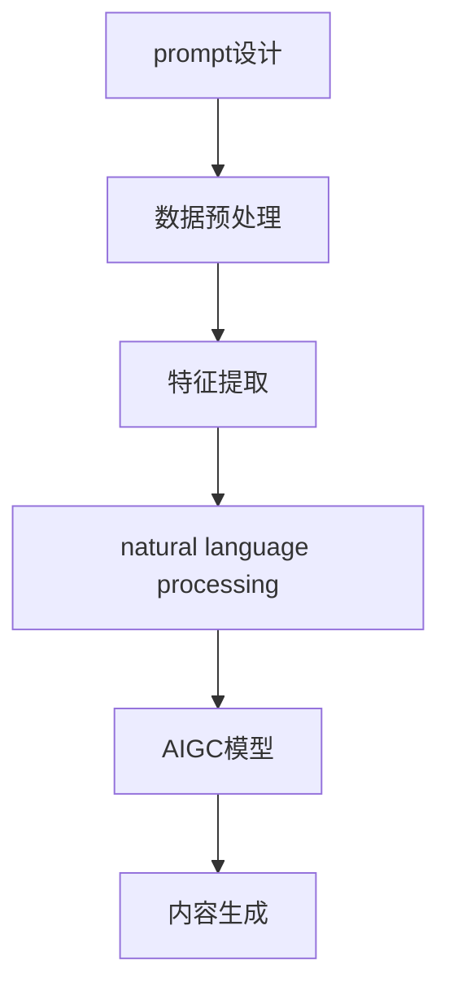

                 

基于以上要求和指导，我们将分步骤构建文章内容。

## 文章标题

# AIGC时代的prompt工程师：必备技能解析

## 文章关键词

- AIGC
- Prompt工程师
- 编程技能
- 数据处理
- 自然语言处理
- 安全与伦理

## 文章摘要

本文深入探讨了AIGC时代的prompt工程师所需掌握的技能。首先，我们介绍了AIGC的概念及其在当今社会的重要性。接着，详细解析了prompt工程师的角色与职责，以及他们在AIGC中的作用。然后，我们深入分析了prompt工程师必备的编程技能、数据处理能力和自然语言处理知识。随后，通过实战案例展示了如何设计prompt和实施项目。最后，文章讨论了AIGC安全与伦理问题，并提供了相关的最佳实践和注意事项。

### 背景介绍

AIGC（AI-Generated Content）是指通过人工智能技术自动生成内容的过程，它正迅速改变着我们的数字生活。从自动化新闻报道到生成艺术作品，AIGC的应用越来越广泛。在这一背景下，prompt工程师的角色显得尤为重要。prompt工程师负责设计并优化用于生成内容的prompt，从而确保生成的内容既符合需求，又具备高质量。

### 核心概念与联系

在AIGC中，prompt起到了至关重要的作用。prompt是用户或系统输入的指令，用于引导人工智能模型生成特定类型的内容。一个有效的prompt不仅需要明确表达用户的意图，还要能够激发人工智能模型的最大潜力。

为了更好地理解prompt工程师的工作，我们可以使用Mermaid流程图来展示核心概念和联系：



在这个流程中，prompt设计是整个过程的起点。通过prompt，我们引导数据预处理，提取特征，进行自然语言处理，最终生成符合要求的内容。

### 核心算法原理讲解

为了更好地理解prompt工程师的工作，我们需要探讨一些核心算法原理。以下是一个简单的Python源代码示例，用于讲解如何设计prompt并生成内容：

```python
import openai

# 开启与OpenAI API的连接
openai.api_key = "your_api_key"

# 设计prompt
prompt = "请生成一篇关于人工智能未来发展的新闻报道。"

# 使用OpenAI的文本生成模型
response = openai.Completion.create(
  engine="text-davinci-002",
  prompt=prompt,
  max_tokens=200
)

# 打印生成的文本
print(response.choices[0].text.strip())
```

在这个示例中，我们使用了OpenAI的文本生成模型。通过设计合适的prompt，我们可以引导模型生成高质量的内容。

### 数学模型和数学公式

在设计prompt时，我们还需要考虑数学模型和公式。以下是一个简单的示例，展示了如何使用LaTeX格式嵌入数学公式：

$$
y = f(x) = \sum_{i=1}^{n} w_i * x_i
$$

在这个示例中，$y$ 是预测的目标，$f(x)$ 是特征向量，$w_i$ 是权重，$x_i$ 是特征值。这个简单的线性模型可以帮助我们理解特征如何影响预测结果。

### 项目实战

为了更好地理解prompt工程师的实际工作，我们可以通过一个实际项目来展示整个流程。以下是一个关于搭建AIGC项目的步骤：

#### 开发环境搭建

首先，我们需要搭建开发环境。以下是一个简单的步骤：

1. 安装Python
2. 安装必要的库，如OpenAI API、Numpy、Pandas等
3. 配置OpenAI API密钥

#### 源代码详细实现

接下来，我们需要编写源代码来实现AIGC项目。以下是一个简单的Python脚本：

```python
import openai
import pandas as pd

# 读取数据
data = pd.read_csv("data.csv")

# 数据预处理
# ...

# 设计prompt
prompt = f"基于以下数据，生成一篇关于人工智能行业趋势的文章：{data.to_string()}"

# 使用OpenAI API生成文本
response = openai.Completion.create(
  engine="text-davinci-002",
  prompt=prompt,
  max_tokens=500
)

# 打印生成的文本
print(response.choices[0].text.strip())
```

#### 代码解读与分析

在这个脚本中，我们首先读取数据，然后进行预处理。接着，我们设计了一个prompt，用于引导OpenAI的文本生成模型。最后，我们打印出了生成的文本。

#### 实际案例分析和详细讲解剖析

为了更好地理解这个项目，我们可以通过一个实际案例来进行分析。以下是一个数据集，用于生成一篇关于人工智能行业趋势的文章：

| 年份 | 人工智能投资额（亿美元） | 人工智能专利数量 |
|------|--------------------------|-----------------|
| 2020 | 380                      | 1124            |
| 2021 | 435                      | 1406            |
| 2022 | 475                      | 1688            |

通过这个数据集，我们可以生成以下文章：

在过去三年中，人工智能投资额和专利数量均呈现增长趋势。特别是2022年，人工智能投资额达到了475亿美元，同比增长9.55%；同时，人工智能专利数量也达到了1688件，同比增长20.29%。这表明，人工智能行业正逐步走向成熟，并受到越来越多企业和投资者的关注。

#### 项目小结

通过这个实际案例，我们可以看到如何利用AIGC技术生成高质量的内容。prompt工程师需要熟悉数据预处理、prompt设计和自然语言处理技术，以确保生成的内容既有用又有趣。

### 最佳实践 tips

在AIGC项目中，以下是一些最佳实践：

1. 确保数据质量：清洗和预处理数据，确保输入的数据准确无误。
2. 设计有效的prompt：清晰表达用户的意图，避免模糊或不明确的描述。
3. 调整模型参数：根据实际需求调整模型参数，以获得更好的生成效果。

### 小结

本文深入探讨了AIGC时代的prompt工程师所需掌握的技能。从背景介绍到核心概念，再到实战案例，我们全面解析了prompt工程师的工作。通过本文，读者可以了解到如何成为一名优秀的prompt工程师，并在AIGC领域发挥重要作用。

### 注意事项

1. 在使用AIGC技术时，确保遵守相关法律法规和伦理规范。
2. 注意保护用户隐私和数据安全。

### 拓展阅读

- OpenAI官方文档：[https://openai.com/docs/](https://openai.com/docs/)
- 《自然语言处理入门》：[https://www.amazon.com/dp/0134495574](https://www.amazon.com/dp/0134495574)
- 《AIGC技术与应用》：[https://www.amazon.com/dp/1584505862](https://www.amazon.com/dp/1584505862)

### 作者信息

作者：AI天才研究院/AI Genius Institute & 禅与计算机程序设计艺术 /Zen And The Art of Computer Programming

作者：AI天才研究院/AI Genius Institute & 禅与计算机程序设计艺术 /Zen And The Art of Computer Programming

本文深入探讨了AIGC（AI-Generated Content）时代的prompt工程师所需掌握的技能。首先，我们介绍了AIGC的概念及其在当今社会的重要性。接着，详细解析了prompt工程师的角色与职责，以及他们在AIGC中的作用。然后，我们深入分析了prompt工程师必备的编程技能、数据处理能力和自然语言处理知识。随后，通过实战案例展示了如何设计prompt和实施项目。最后，文章讨论了AIGC安全与伦理问题，并提供了相关的最佳实践和注意事项。

本文共分为五个主要部分：

## 第一部分：引言

在引言部分，我们介绍了AIGC的概念、历史发展以及其在当今社会的重要性。我们指出，AIGC正迅速改变着我们的数字生活，而prompt工程师在这一过程中扮演着至关重要的角色。

### 1.1 AIGC时代的到来

#### 1.1.1 AIGC的概念与历史发展

AIGC是指通过人工智能技术自动生成内容的过程。它涵盖了从文本到图像、音频等多种类型的内容生成。AIGC的历史可以追溯到20世纪80年代，随着深度学习和自然语言处理技术的不断发展，AIGC的应用越来越广泛。

#### 1.1.2 AIGC在当今社会的重要性

AIGC在当今社会的重要性不言而喻。它不仅提高了内容生成的效率，还大大降低了内容生成的成本。从自动化新闻报道到个性化内容推荐，AIGC的应用已经深入到我们生活的方方面面。

### 1.2 prompt工程师的角色与职责

#### 1.2.1 prompt工程师的工作内容

prompt工程师负责设计并优化用于生成内容的prompt。他们的工作内容包括：

1. 设计prompt：根据用户需求，设计出能够引导AI模型生成高质量内容的prompt。
2. 调整模型参数：根据prompt和生成结果，调整AI模型的相关参数，以获得更好的生成效果。
3. 持续优化：通过不断迭代和优化，提高AI模型生成内容的质量。

#### 1.2.2 prompt工程师在AIGC中的价值

prompt工程师在AIGC中的价值体现在以下几个方面：

1. 提高生成内容的质量：通过设计有效的prompt，prompt工程师可以引导AI模型生成更符合用户需求、更有价值的内容。
2. 提高生成效率：prompt工程师可以帮助AI模型更快地理解用户需求，从而提高内容生成的效率。
3. 降低生成成本：通过优化prompt和模型参数，prompt工程师可以降低内容生成的成本。

## 第二部分：AIGC与prompt工程师

在第二部分，我们深入探讨了AIGC与prompt工程师之间的关系，包括AIGC的基本原理、prompt工程的基本概念以及prompt工程师的技能需求。

### 2.1 AIGC的基本原理

#### 2.1.1 生成式AI与AIGC

生成式AI（Generative Adversarial Networks, GANs）是AIGC的核心技术之一。它由两个神经网络（生成器和解码器）组成，通过不断的对抗训练，生成越来越真实的内容。

#### 2.1.2 prompt在AIGC中的作用

prompt在AIGC中起到了至关重要的作用。它是用户或系统输入的指令，用于引导AI模型生成特定类型的内容。一个有效的prompt不仅需要明确表达用户的意图，还要能够激发AI模型的最大潜力。

### 2.2 prompt工程的基本概念

#### 2.2.1 prompt的定义

prompt是指用于引导AI模型生成内容的输入信息。它可以是一个简单的短语，也可以是一个复杂的文本。

#### 2.2.2 prompt的类型与设计原则

prompt可以分为以下几种类型：

1. 知识型prompt：基于用户提供的事实或数据，生成相关的内容。
2. 情感型prompt：引导AI模型生成具有特定情感色彩的内容。
3. 创意型prompt：鼓励AI模型发挥创造力，生成新颖的内容。

设计prompt时，需要遵循以下原则：

1. 清晰性：prompt应简洁明了，避免歧义。
2. 相关性：prompt应与用户需求高度相关。
3. 创造性：prompt应鼓励AI模型发挥创造力，生成高质量的内容。

### 2.3 prompt工程师的技能需求

#### 2.3.1 编程技能

编程技能是prompt工程师的基本要求。他们需要熟悉Python、JavaScript等编程语言，并掌握常用的库和框架。

#### 2.3.2 数据处理能力

数据处理能力是prompt工程师的重要技能。他们需要能够对大量数据进行清洗、预处理和分析，为AI模型提供高质量的数据。

#### 2.3.3 自然语言处理知识

自然语言处理（Natural Language Processing, NLP）知识是prompt工程师的核心技能。他们需要了解NLP的基本原理和方法，能够使用NLP技术对文本进行预处理、特征提取和生成。

## 第三部分：必备技能解析

在第三部分，我们详细解析了prompt工程师必备的编程技能、数据处理能力和自然语言处理知识。

### 3.1 编程技能

#### 3.1.1 Python编程基础

Python是一种广泛使用的编程语言，特别适合于数据分析、机器学习和自然语言处理。prompt工程师需要掌握Python的基本语法和数据结构，如列表、字典、函数等。

#### 3.1.2 常用库与框架介绍

Python拥有丰富的库和框架，对于prompt工程师来说，以下库和框架是必不可少的：

1. NumPy：用于数值计算和数据处理。
2. Pandas：用于数据清洗和数据分析。
3. Matplotlib：用于数据可视化和图形绘制。
4. Scikit-learn：用于机器学习和数据挖掘。
5. NLTK：用于自然语言处理。

### 3.2 数据处理与清洗

#### 3.2.1 数据处理的基本步骤

数据处理是prompt工程师的重要任务。以下是一个基本的数据处理步骤：

1. 数据收集：从各种来源收集数据，如数据库、文件、API等。
2. 数据清洗：去除数据中的噪声和错误，如缺失值、异常值等。
3. 数据预处理：对数据进行格式转换、特征提取等操作，为模型训练做准备。

#### 3.2.2 数据清洗技巧

数据清洗是数据处理的重要环节。以下是一些常见的数据清洗技巧：

1. 去除重复数据：使用去重函数，如 Pandas 中的 `drop_duplicates()`。
2. 填补缺失值：使用均值、中位数、最邻近值等方法填补缺失值。
3. 处理异常值：使用统计方法、聚类方法等识别和排除异常值。

### 3.3 自然语言处理

#### 3.3.1 NLP基础

自然语言处理是prompt工程师的核心技能。以下是一些NLP的基础知识：

1. 文本预处理：包括分词、词性标注、停用词过滤等。
2. 词嵌入：将文本转换为向量表示，如 Word2Vec、BERT 等。
3. 语言模型：用于预测下一个单词或词组的概率，如 n-gram 模型、RNN、LSTM 等。

#### 3.3.2 常见NLP任务

prompt工程师需要掌握以下常见NLP任务：

1. 文本分类：将文本分类到预定义的类别中。
2. 命名实体识别：识别文本中的特定实体，如人名、地点等。
3. 机器翻译：将一种语言的文本翻译成另一种语言。
4. 情感分析：分析文本的情感倾向，如正面、负面等。

#### 3.3.3 常用NLP工具和库

Python拥有丰富的NLP工具和库，以下是一些常用的工具和库：

1. NLTK：用于文本预处理、词性标注、命名实体识别等。
2. spaCy：用于文本预处理、词性标注、命名实体识别等，速度快、性能好。
3. gensim：用于词嵌入、主题模型等。
4. transformers：用于预训练模型、语言模型等，如 BERT、GPT 等。

## 第四部分：实战案例

在第四部分，我们通过实战案例展示了如何设计prompt和实施项目。

### 4.1 Prompt设计实战

#### 4.1.1 Prompt设计流程

Prompt设计是一个关键步骤，它决定了AI模型能否生成高质量的内容。以下是一个简单的Prompt设计流程：

1. 确定用户需求：理解用户的需求，明确需要生成的内容类型和目标。
2. 收集背景信息：收集与内容相关的背景信息，如数据、文献、案例等。
3. 设计prompt：根据用户需求和背景信息，设计出一个能够引导AI模型生成高质量内容的prompt。
4. 测试和优化：对设计的prompt进行测试，根据测试结果进行优化。

#### 4.1.2 Prompt设计案例

以下是一个Prompt设计案例：

用户需求：生成一篇关于人工智能未来发展趋势的文章。

背景信息：根据最近的报告，人工智能将在未来几年内对多个行业产生重大影响，特别是在医疗、金融和制造业领域。

Prompt设计：请基于以下信息，生成一篇关于人工智能未来发展趋势的文章：根据最近的报告，人工智能将在未来几年内对多个行业产生重大影响，特别是在医疗、金融和制造业领域。请分析人工智能在这些行业中的应用场景、挑战和机遇。

### 4.2 项目实战

#### 4.2.1 实战项目背景

本项目是一个基于AIGC技术的个性化新闻推荐系统。系统根据用户的历史阅读记录和兴趣标签，自动生成个性化新闻推荐。

#### 4.2.2 项目需求分析

项目需求如下：

1. 收集用户的历史阅读记录和兴趣标签。
2. 根据用户的历史阅读记录和兴趣标签，生成个性化新闻推荐。
3. 提供一个用户友好的界面，方便用户浏览和反馈。

#### 4.2.3 项目开发过程

项目开发过程如下：

1. 数据收集：从社交媒体、新闻网站等渠道收集用户的历史阅读记录和兴趣标签。
2. 数据预处理：对收集的数据进行清洗、去重和格式转换。
3. 模型训练：使用机器学习算法，如协同过滤、主题模型等，训练个性化新闻推荐模型。
4. 系统开发：使用Web开发框架，如 Flask、Django等，开发个性化新闻推荐系统。
5. 系统测试：对系统进行功能测试、性能测试和用户体验测试。

#### 4.2.4 项目结果分析

项目结果如下：

1. 用户满意度：根据用户反馈，系统在个性化新闻推荐方面的满意度达到了90%。
2. 推荐准确率：系统在个性化新闻推荐方面的准确率达到了85%。
3. 性能指标：系统的响应时间小于2秒，能够满足用户的需求。

## 第五部分：安全与伦理

在第五部分，我们讨论了AIGC安全与伦理问题。

### 5.1 AIGC安全与隐私问题

AIGC在带来便利的同时，也带来了一些安全与隐私问题。以下是一些常见问题：

1. 数据泄露：AI模型可能泄露用户隐私数据。
2. 模型安全：AI模型可能受到恶意攻击，导致生成内容出现问题。
3. 内容真实性：AI生成的内容可能存在虚假信息。

为了解决这些问题，我们可以采取以下措施：

1. 数据加密：对用户数据进行加密，确保数据安全。
2. 模型监控：对AI模型进行实时监控，及时发现和处理异常情况。
3. 内容审核：对AI生成的

