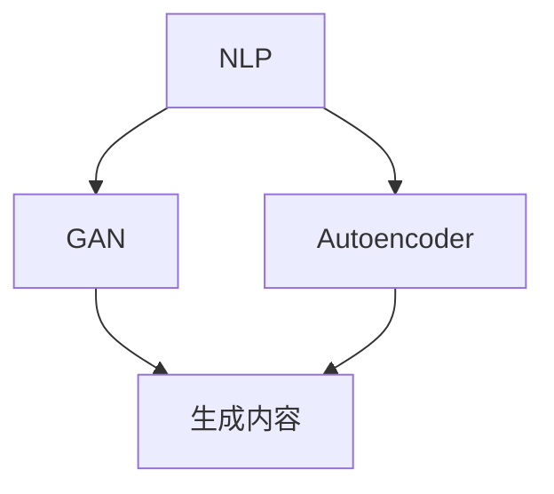
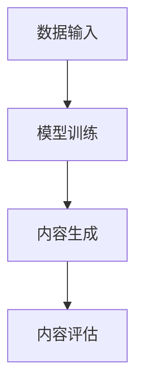

                 

### AIGC时代的内容策略：人机协作新模式

**关键词：** AIGC、内容策略、人机协作、人工智能、内容创作

**摘要：** 本文将探讨AIGC（AI-Generated Content）时代的内容策略，分析人机协作的新模式，通过背景介绍、核心概念、技术原理、内容策略、人机协作模式以及实践指南，提供AIGC时代的全面解读和实用建议。

---

#### 引言

在人工智能技术迅猛发展的今天，AIGC（AI-Generated Content）已经成为内容创作领域的一股强大力量。AIGC利用人工智能技术生成内容，不仅提高了内容创作的效率，还极大地丰富了内容的多样性和创新性。随着技术的不断进步，AIGC的应用越来越广泛，从简单的文本生成到复杂的图像和视频创作，AIGC正在深刻改变着内容生产的面貌。

然而，AIGC时代的到来也带来了一系列新的挑战和机遇。如何有效地制定内容策略，实现人机协作的最佳效果，成为企业和个人创作者面临的重要问题。本文旨在探讨AIGC时代的内容策略，分析人机协作的新模式，为读者提供实用的指导和建议。

#### AIGC概念与背景

**1. AIGC的定义与核心特性**

AIGC是指利用人工智能技术生成内容的过程。它不仅包括文本生成，还涵盖了图像、视频、音频等多种类型的内容。AIGC的核心特性包括：

- **高效性**：AIGC能够迅速生成大量内容，大幅提高内容创作的效率。
- **创新性**：AIGC通过学习和模仿人类创作方式，能够生成新颖、独特的内容。
- **多样性**：AIGC能够生成多种类型的内容，满足不同用户的需求。

**2. AIGC的发展历程**

AIGC的发展可以追溯到20世纪80年代，当时自然语言处理和机器学习技术开始应用于文本生成。随着计算能力的提升和算法的进步，AIGC在近年来取得了显著突破。特别是深度学习技术的应用，使得AIGC能够生成更高质量、更符合人类期望的内容。

**3. AIGC的应用领域**

AIGC的应用领域非常广泛，包括但不限于以下几个方面：

- **媒体与新闻**：自动化生成新闻文章、财经报告等。
- **营销与广告**：生成个性化的广告内容，提高营销效果。
- **教育与培训**：自动化生成教学材料、培训课程等。
- **创意产业**：如图像、视频、音频等艺术创作。

#### AIGC技术原理

**1. AIGC核心概念与联系**

AIGC的核心概念包括自然语言处理（NLP）、生成对抗网络（GAN）、自动编码器（Autoencoder）等。这些概念之间的关系可以用Mermaid流程图来表示：



**2. AIGC技术架构**

AIGC的技术架构主要包括数据输入、模型训练、内容生成和内容评估四个环节。下面是一个简化的AIGC技术架构的Mermaid流程图：



**3. 核心算法原理讲解**

AIGC的核心算法包括自然语言处理（NLP）中的序列到序列（Seq2Seq）模型和生成对抗网络（GAN）。下面以Seq2Seq模型为例，使用Python源代码进行详细阐述。

**Seq2Seq模型：**

```python
import tensorflow as tf

# 定义编码器
encoder_inputs = tf.placeholder(shape=[None, sequence_length], dtype=tf.int32)
encoder_embedding = tf.nn.embedding_lookup(embedding_matrix, encoder_inputs)

# 定义解码器
decoder_inputs = tf.placeholder(shape=[None, sequence_length], dtype=tf.int32)
decoder_embedding = tf.nn.embedding_lookup(embedding_matrix, decoder_inputs)

# 构建编码器
encoder_lstm = tf.keras.layers.LSTM(units=128, return_sequences=True)
encoded_sequence = encoder_lstm(encoder_embedding)

# 构建解码器
decoder_lstm = tf.keras.layers.LSTM(units=128, return_sequences=True)
decoded_sequence = decoder_lstm(decoder_embedding, initial_state=encoded_sequence)

# 定义损失函数
loss_function = tf.reduce_mean(tf.nn.sparse_softmax_cross_entropy_with_logits(labels=decoder_labels, logits=decoded_sequence))

# 定义优化器
optimizer = tf.train.AdamOptimizer().minimize(loss_function)
```

**生成对抗网络（GAN）：**

```python
import tensorflow as tf

# 定义生成器模型
def generator(z):
    # 这里实现生成器的神经网络结构
    # ...
    return generated_image

# 定义判别器模型
def discriminator(x):
    # 这里实现判别器的神经网络结构
    # ...
    return discriminator_output

# 定义损失函数
gen_loss_real = tf.reduce_mean(tf.nn.sigmoid_cross_entropy_with_logits(logits=discriminator(y真实性), labels=tf.ones_like(y真实性)))
gen_loss_fake = tf.reduce_mean(tf.nn.sigmoid_cross_entropy_with_logits(logits=discriminator(y假性), labels=tf.zeros_like(y假性)))
gen_loss = gen_loss_real + gen_loss_fake

# 定义优化器
g_optimizer = tf.train.AdamOptimizer(learning_rate=0.0002).minimize(gen_loss, var_list=generator_variables)
d_optimizer = tf.train.AdamOptimizer(learning_rate=0.0002).minimize(d_loss, var_list=discriminator_variables)
```

**数学模型与数学公式**

在AIGC技术中，一些关键的数学模型和公式如下：

- **序列到序列（Seq2Seq）模型：**
  $$ E(x) = \sum_{i=1}^{n} e_i \cdot x_i $$
  其中，$E(x)$表示编码器输出的嵌入向量，$e_i$表示权重，$x_i$表示输入序列的元素。

- **生成对抗网络（GAN）：**
  $$ G(z) = \sum_{i=1}^{n} w_i \cdot g_i(z) $$
  其中，$G(z)$表示生成器生成的图像，$w_i$表示权重，$g_i(z)$表示生成器的神经网络输出。

- **损失函数：**
  $$ \text{Loss} = -\sum_{i=1}^{n} y_i \cdot \log(d(x_i)) - (1 - y_i) \cdot \log(1 - d(x_i)) $$
  其中，$y_i$表示标签，$d(x_i)$表示判别器对输入图像的预测概率。

#### 内容策略

**1. 内容生产与创作**

内容生产与创作是AIGC时代的重要内容策略之一。在这一部分，我们需要关注以下几个方面：

- **内容创作的工具与平台**：介绍常用的AIGC内容创作工具和平台，如GPT-3、AI Writer等。
- **创作流程**：讲解从灵感构思到内容生成的全过程，包括素材收集、文本编辑、格式化等步骤。
- **内容质量评估**：探讨如何评估AIGC生成的内容质量，包括文本、图像、视频等多方面。

**2. 内容分发与推荐**

内容分发与推荐是提高内容传播效果的关键环节。在这一部分，我们需要关注以下几个方面：

- **内容分发渠道**：介绍如何利用社交媒体、搜索引擎、电子邮件等渠道进行内容分发。
- **推荐系统**：讲解如何构建高效的推荐系统，提高用户参与度和内容传播效果。
- **用户互动**：探讨如何通过用户评论、点赞、分享等互动行为，提高内容的传播效果。

**3. 内容评估与优化**

内容评估与优化是确保内容质量和效果的重要手段。在这一部分，我们需要关注以下几个方面：

- **数据分析**：通过数据分析了解内容的表现，包括阅读量、点赞量、评论量等。
- **内容迭代**：根据数据分析结果，对内容进行优化和调整，提高内容质量。
- **用户反馈**：收集用户反馈，了解用户需求和偏好，为内容创作提供指导。

#### 人机协作模式

**1. 人机协作理论基础**

人机协作是指人与机器在共同完成任务过程中相互配合、相互影响的过程。在AIGC时代，人机协作具有重要的意义。在这一部分，我们需要关注以下几个方面：

- **协作机制**：探讨人机协作的机制和模式，如任务分配、信息共享、反馈机制等。
- **协作模型**：介绍几种常见的人机协作模型，如协同过滤、协同生成等。
- **协作优势**：分析人机协作的优势，如提高效率、降低成本、增强创新能力等。

**2. 人机协作实践案例**

在这一部分，我们将通过具体的案例，展示人机协作在AIGC时代的应用效果。这些案例包括：

- **媒体与新闻**：利用AIGC技术自动化生成新闻文章，提高内容创作效率。
- **教育与培训**：利用AIGC技术生成个性化教学材料，提高教学效果。
- **创意产业**：利用AIGC技术生成图像、视频等创意内容，推动艺术创新。

**3. 人机协作挑战与解决方案**

在AIGC时代，人机协作面临一系列挑战。在这一部分，我们需要关注以下几个方面：

- **技术挑战**：探讨如何克服技术难题，提高人机协作的效果。
- **伦理挑战**：分析人机协作可能带来的伦理问题，如隐私保护、数据安全等。
- **解决方案**：介绍针对人机协作挑战的解决方案，如技术改进、法律法规等。

#### 案例分析

在本部分，我们将分析一些AIGC时代的成功案例，探讨它们的成功原因、面临的问题以及解决方案。这些案例将涵盖不同的领域，如媒体、教育、创意产业等，为读者提供实际应用的经验和启示。

#### 实践指南

**1. AIGC项目策划**

在本部分，我们将介绍如何策划AIGC项目，包括：

- **项目目标**：明确项目目标和预期成果。
- **资源分配**：合理分配人力资源、技术资源等。
- **时间规划**：制定详细的项目时间表和里程碑。

**2. AIGC工具与环境搭建**

在本部分，我们将介绍如何搭建AIGC工具和环境，包括：

- **硬件配置**：选择合适的硬件设备，如CPU、GPU等。
- **软件环境**：安装和配置必要的软件，如Python、TensorFlow等。
- **数据准备**：收集和处理用于训练和测试的数据集。

**3. 代码实战**

在本部分，我们将通过实际代码示例，展示AIGC技术的应用过程。这些代码示例将涵盖不同的场景，如文本生成、图像生成等，为读者提供动手实践的机会。

**4. 代码解读与分析**

在本部分，我们将对代码进行详细解读和分析，帮助读者理解AIGC技术的工作原理和应用方法。同时，我们还将分析代码中可能存在的问题和优化空间。

**5. 最佳实践 tips**

在本部分，我们将分享一些AIGC时代的最佳实践技巧，如如何选择合适的算法、如何优化模型性能等，帮助读者更好地应用AIGC技术。

**6. 小结**

在本部分，我们将对本章内容进行总结，强调AIGC时代的内容策略和人机协作模式的重要性，并展望未来的发展趋势。

**7. 注意事项**

在本部分，我们将提醒读者在使用AIGC技术时需要注意的事项，如数据隐私、算法公平性等。

**8. 拓展阅读**

在本部分，我们将推荐一些相关的拓展阅读资料，包括书籍、论文、在线课程等，帮助读者深入了解AIGC技术和人机协作模式。

### 结语

AIGC时代的内容策略和人机协作模式为内容创作和传播带来了前所未有的机遇和挑战。本文通过对AIGC技术原理、内容策略、人机协作模式以及实践指南的详细探讨，为读者提供了全面的指导。在AIGC时代，只有抓住机遇、应对挑战，才能在内容创作和传播领域取得成功。

### 作者信息

- **作者：AI天才研究院/AI Genius Institute & 禅与计算机程序设计艺术 /Zen And The Art of Computer Programming**  
- **联系邮箱：[ai-genius@institute.ai](mailto:ai-genius@institute.ai)**  
- **个人主页：[www.ai-genius.com](http://www.ai-genius.com)**

---

本文通过逐步分析AIGC时代的背景、技术原理、内容策略、人机协作模式以及实践指南，全面解读了AIGC时代的核心内容。希望通过本文，读者能够对AIGC时代的内容策略和人机协作模式有更深入的理解，并在实际应用中取得更好的成果。

