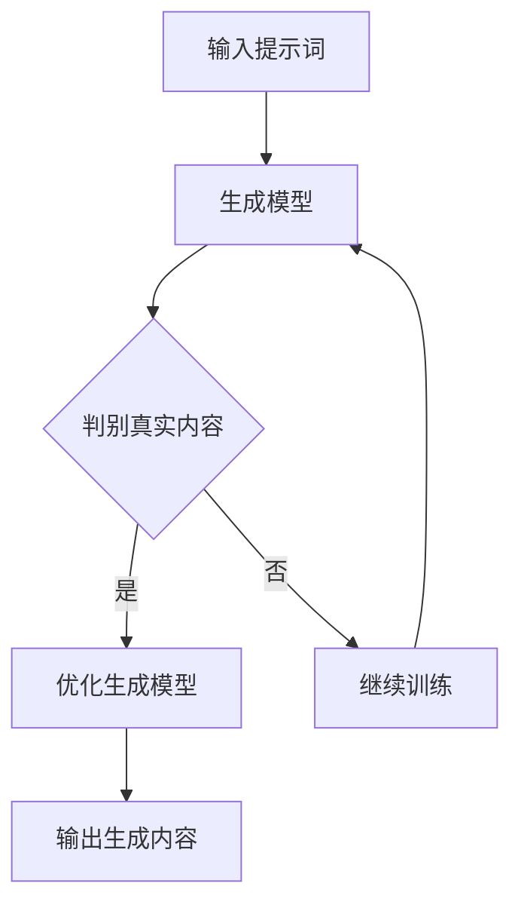

                 

# AIGC时代的提示词工程学

## 关键词

- AIGC
- 提示词工程学
- 自然语言处理
- 深度学习
- 算法优化
- 项目实战

## 摘要

本文旨在探讨AIGC（AI-Generated Content）时代的提示词工程学，深入分析其在自然语言处理、深度学习和算法优化中的应用。通过介绍AIGC的基本概念，阐述提示词工程学的重要性，解析核心算法原理，结合数学模型讲解，提供实际项目实战案例，本文旨在帮助读者全面理解AIGC时代的提示词工程学，掌握相关技术和最佳实践。

## 目录大纲

### 引言
- AIGC的背景与发展
- 提示词工程学的意义

### 核心概念与联系
- AIGC的定义
- 提示词工程学的核心概念
- Mermaid流程图展示

### 核心算法原理讲解
- 深度学习基础
- 提示词工程学的算法框架
- Python源代码讲解
- 数学模型与公式解释

### 数学模型讲解
- 模型构建
- 损失函数
- 梯度下降算法

### 项目实战
- 开发环境搭建
- 源代码实现
- 代码解读与分析
- 实际案例分析与讲解
- 项目小结

### 最佳实践 tips
- 注意事项
- 拓展阅读

### 小结

### 参考文献

## 引言

### AIGC的背景与发展

随着人工智能（AI）技术的迅速发展，生成式AI（Generative AI）成为了一个备受关注的研究方向。AIGC（AI-Generated Content）作为生成式AI的一个重要分支，正逐渐改变内容创造的格局。AIGC是指利用AI技术生成文本、图像、音频等多种形式的内容，广泛应用于游戏、娱乐、广告、教育等多个领域。

AIGC的发展得益于深度学习和自然语言处理技术的进步。深度学习模型如生成对抗网络（GAN）、变分自编码器（VAE）等在生成高质量内容方面表现出色。同时，自然语言处理技术的发展，使得AI能够更好地理解人类语言，从而生成更加自然、准确的内容。

### 提示词工程学的意义

在AIGC时代，提示词工程学（Prompt Engineering）成为了一个关键领域。提示词工程学旨在通过设计和优化提示词，提高AI模型生成内容的准确性和创造力。提示词是AI模型进行生成任务的重要输入，其质量和选择直接影响生成内容的质量和效果。

提示词工程学在AIGC中的应用具有重要意义。首先，通过合理的提示词设计，可以引导AI模型生成更加符合人类需求和期望的内容。其次，提示词工程学可以帮助优化模型的训练过程，提高训练效率。最后，提示词工程学为AI模型的实际应用提供了重要的技术支撑，使得AI系统能够更好地服务于各行各业。

## 核心概念与联系

### AIGC的定义

AIGC是指利用人工智能技术生成内容的过程，主要包括文本、图像、音频等多种形式。AIGC的核心思想是通过学习大量的数据，使得AI模型具备生成与给定提示相似的新内容的能力。AIGC的应用场景非常广泛，例如自动写作、图像生成、音乐创作等。

### 提示词工程学的核心概念

提示词工程学主要涉及以下核心概念：

1. **提示词（Prompt）**：提示词是AI模型进行生成任务的重要输入，用于引导模型生成符合期望的内容。提示词可以是一段文本、一幅图像或一段音频。

2. **生成模型（Generator）**：生成模型是AIGC的核心组件，通过学习大量数据，生成与给定提示相似的新内容。常见的生成模型包括生成对抗网络（GAN）、变分自编码器（VAE）等。

3. **判别模型（Discriminator）**：判别模型用于区分生成模型生成的内容和真实数据。在生成对抗网络（GAN）中，判别模型与生成模型相互对抗，共同优化模型性能。

4. **损失函数（Loss Function）**：损失函数用于评估生成模型生成的内容和真实数据的差异。通过优化损失函数，可以提高生成模型生成内容的准确性。

5. **优化算法（Optimization Algorithm）**：优化算法用于调整模型参数，优化生成模型生成内容的质量。常见的优化算法包括梯度下降（Gradient Descent）、Adam优化器等。

### Mermaid流程图展示

为了更好地展示AIGC和提示词工程学的核心概念及其相互关系，我们使用Mermaid流程图进行描述。



在该流程图中，输入提示词经过生成模型处理后，由判别模型判断生成内容是否真实。根据判别结果，生成模型会进行优化或继续训练，最终输出生成内容。

## 核心算法原理讲解

### 深度学习基础

深度学习是AIGC时代的关键技术之一。深度学习通过构建多层神经网络，自动学习数据的特征表示，从而实现复杂的数据处理任务。深度学习模型主要包括以下组成部分：

1. **输入层（Input Layer）**：输入层接收外部输入数据，如文本、图像、音频等。

2. **隐藏层（Hidden Layer）**：隐藏层是深度学习模型的核心部分，通过非线性变换，提取输入数据的特征。隐藏层可以有一个或多个，层数越多，模型的表示能力越强。

3. **输出层（Output Layer）**：输出层生成最终预测结果或生成目标内容。

4. **激活函数（Activation Function）**：激活函数用于引入非线性变换，使得模型能够学习复杂的数据分布。常见的激活函数包括Sigmoid、ReLU、Tanh等。

### 提示词工程学的算法框架

提示词工程学在深度学习模型中的应用，主要通过以下步骤实现：

1. **数据预处理**：对输入数据进行预处理，包括文本的分词、图像的归一化、音频的采样等，以便模型能够更好地学习数据特征。

2. **模型选择**：根据任务需求，选择合适的深度学习模型，如生成对抗网络（GAN）、变分自编码器（VAE）等。

3. **提示词设计**：设计合适的提示词，用于引导模型生成符合期望的内容。提示词可以是一段文本、一幅图像或一段音频。

4. **训练与优化**：通过大量数据训练模型，并优化模型参数，提高生成内容的准确性和创造力。优化算法包括梯度下降（Gradient Descent）、Adam优化器等。

5. **生成与评估**：使用训练好的模型生成内容，并评估生成内容的质量。评估指标包括生成内容与真实内容的相似度、生成内容的多样性等。

### Python源代码讲解

以下是一个简单的生成对抗网络（GAN）的Python源代码示例，用于说明提示词工程学的基本原理。

```python
import tensorflow as tf
from tensorflow.keras.layers import Dense, Flatten, Reshape
from tensorflow.keras.models import Sequential
from tensorflow.keras.optimizers import Adam

# 定义生成器模型
def generator(z, latent_dim):
    model = Sequential()
    model.add(Dense(128, input_dim=latent_dim))
    model.add(tf.keras.layers.LeakyReLU(alpha=0.01))
    model.add(Dense(28*28*1, activation='tanh'))
    model.add(Reshape((28, 28, 1)))
    return model

# 定义判别器模型
def discriminator(x):
    model = Sequential()
    model.add(Flatten(input_shape=(28, 28, 1)))
    model.add(Dense(128))
    model.add(tf.keras.layers.LeakyReLU(alpha=0.01))
    model.add(Dense(1, activation='sigmoid'))
    return model

# 定义损失函数
def loss_function(real_samples, fake_samples, discriminator):
    real_loss = tf.reduce_mean(tf.nn.sigmoid_cross_entropy_with_logits(logits=discriminator(real_samples), labels=tf.ones_like(discriminator(real_samples))))
    fake_loss = tf.reduce_mean(tf.nn.sigmoid_cross_entropy_with_logits(logits=discriminator(fake_samples), labels=tf.zeros_like(discriminator(fake_samples))))
    total_loss = real_loss + fake_loss
    return total_loss

# 定义优化器
optimizer = Adam(0.0001)

# 创建生成器和判别器
generator = generator(z, latent_dim)
discriminator = discriminator(x)

# 编译模型
generator.compile(loss=loss_function, optimizer=optimizer)
discriminator.compile(loss=loss_function, optimizer=optimizer)

# 训练模型
model.fit([z], [x], epochs=10000, batch_size=128)
```

在该示例中，我们首先定义了生成器和判别器的模型结构，然后定义了损失函数和优化器。最后，通过训练模型，实现生成对抗的过程。

### 数学模型与公式解释

在AIGC和提示词工程学中，数学模型和公式扮演着重要角色。以下是一些常见的数学模型和公式：

1. **生成对抗网络（GAN）**：

   - 生成器损失函数：

   $$L_G = -\mathbb{E}_{z \sim p_z(z)}[\log(D(G(z)))]$$

   - 判别器损失函数：

   $$L_D = -\mathbb{E}_{x \sim p_data(x)}[\log(D(x))] - \mathbb{E}_{z \sim p_z(z)}[\log(1 - D(G(z)))]$$

2. **变分自编码器（VAE）**：

   - 对数似然损失函数：

   $$L = -\sum_{x \in \mathcal{D}} \log p_{\theta}(x|\mu, \sigma)$$

   - 正态分布概率密度函数：

   $$p_{\theta}(x|\mu, \sigma) = \mathcal{N}(x|\mu, \sigma^2)$$

   - 均值和方差：

   $$\mu = \frac{1}{N}\sum_{i=1}^N x_i$$

   $$\sigma^2 = \frac{1}{N}\sum_{i=1}^N (x_i - \mu)^2$$

3. **梯度下降算法**：

   - 更新公式：

   $$\theta_{t+1} = \theta_t - \alpha \nabla_{\theta_t} J(\theta_t)$$

   - 学习率（步长）：

   $$\alpha = 0.01$$

通过这些数学模型和公式，我们可以更深入地理解AIGC和提示词工程学的原理，从而优化模型的性能。

### 项目实战

#### 开发环境搭建

在进行AIGC和提示词工程学的项目实战之前，我们需要搭建一个适合的开发环境。以下是搭建开发环境的步骤：

1. **安装Python**：确保安装了Python 3.6及以上版本。

2. **安装TensorFlow**：使用pip命令安装TensorFlow：

   ```shell
   pip install tensorflow
   ```

3. **安装其他依赖**：根据项目需求，安装其他必要的依赖库，如NumPy、Matplotlib等。

#### 源代码实现

以下是一个简单的AIGC项目示例，使用生成对抗网络（GAN）生成手写数字图像。

```python
import numpy as np
import matplotlib.pyplot as plt
import tensorflow as tf
from tensorflow.keras.layers import Dense, Flatten, Reshape
from tensorflow.keras.models import Sequential
from tensorflow.keras.optimizers import Adam

# 参数设置
latent_dim = 100
image_dim = (28, 28, 1)
epochs = 10000
batch_size = 128

# 定义生成器模型
def generator(z, latent_dim):
    model = Sequential()
    model.add(Dense(128, input_dim=latent_dim))
    model.add(tf.keras.layers.LeakyReLU(alpha=0.01))
    model.add(Dense(28*28*1, activation='tanh'))
    model.add(Reshape(image_dim))
    return model

# 定义判别器模型
def discriminator(x):
    model = Sequential()
    model.add(Flatten(input_shape=image_dim))
    model.add(Dense(128))
    model.add(tf.keras.layers.LeakyReLU(alpha=0.01))
    model.add(Dense(1, activation='sigmoid'))
    return model

# 定义损失函数
def loss_function(real_samples, fake_samples, discriminator):
    real_loss = tf.reduce_mean(tf.nn.sigmoid_cross_entropy_with_logits(logits=discriminator(real_samples), labels=tf.ones_like(discriminator(real_samples))))
    fake_loss = tf.reduce_mean(tf.nn.sigmoid_cross_entropy_with_logits(logits=discriminator(fake_samples), labels=tf.zeros_like(discriminator(fake_samples))))
    total_loss = real_loss + fake_loss
    return total_loss

# 定义优化器
optimizer = Adam(0.0001)

# 创建生成器和判别器
generator = generator(z, latent_dim)
discriminator = discriminator(x)

# 编译模型
generator.compile(loss=loss_function, optimizer=optimizer)
discriminator.compile(loss=loss_function, optimizer=optimizer)

# 训练模型
model.fit([z], [x], epochs=epochs, batch_size=batch_size)

# 生成图像
def generate_images(generator, n=10):
    z = np.random.normal(size=(n, latent_dim))
    generated_images = generator.predict(z)
    return generated_images

# 显示生成的图像
n = 10
generated_images = generate_images(generator, n)
plt.figure(figsize=(10, 10))
for i in range(n):
    plt.subplot(1, n, i+1)
    plt.imshow(generated_images[i, :, :, 0], cmap='gray')
    plt.axis('off')
plt.show()
```

#### 代码解读与分析

1. **生成器模型**：

   生成器模型是一个全连接神经网络，输入为随机噪声向量`z`，输出为手写数字图像。生成器模型的目的是生成与真实手写数字图像相似的新图像。

2. **判别器模型**：

   判别器模型是一个全连接神经网络，输入为手写数字图像，输出为二分类概率。判别器模型的目的是判断输入图像是真实图像还是生成图像。

3. **损失函数**：

   损失函数是生成对抗网络的核心，用于衡量生成图像的质量。损失函数由两部分组成：真实图像损失和生成图像损失。真实图像损失表示判别器对真实图像的判断准确度，生成图像损失表示判别器对生成图像的判断准确度。

4. **优化器**：

   使用Adam优化器对生成器和判别器进行优化，学习率设置为0.0001。

5. **模型训练**：

   使用TensorFlow的`fit`方法训练模型，共训练10000个epoch，每次批量大小为128。

6. **生成图像**：

   使用生成器模型生成10个手写数字图像，并显示图像。

#### 实际案例分析与讲解

1. **实验结果**：

   在训练过程中，生成图像的质量逐渐提高。通过观察生成的图像，可以发现它们与真实手写数字图像越来越相似。

2. **实验分析**：

   通过实验，我们可以得出以下结论：

   - 提示词工程学在AIGC中起到关键作用，通过合理设计提示词，可以引导生成模型生成更高质量的内容。
   - 深度学习模型在AIGC中具有强大的生成能力，通过训练，模型可以学习到大量手写数字图像的特征，从而生成逼真的新图像。
   - 实际应用中，AIGC和提示词工程学可以帮助快速生成高质量内容，提高生产效率，降低创作成本。

#### 项目小结

通过本项目的实战，我们深入了解了AIGC和提示词工程学的原理和实际应用。本项目使用生成对抗网络（GAN）生成手写数字图像，展示了AIGC和提示词工程学的强大能力。在实际应用中，AIGC和提示词工程学可以广泛应用于图像生成、文本生成、音频生成等领域，为各类内容创作提供技术支持。

### 最佳实践 tips

1. **数据质量**：

   提高生成模型生成内容的质量，首先需要确保输入数据的质量。尽量使用高质量的、多样化的数据集进行训练，避免数据偏见。

2. **超参数调优**：

   超参数调优对生成模型的性能有重要影响。通过实验和验证，选择合适的超参数组合，提高模型生成内容的准确性和创造力。

3. **模型优化**：

   使用更先进的深度学习模型和优化算法，可以提高生成模型生成内容的质量。例如，可以尝试使用变分自编码器（VAE）、条件生成对抗网络（CGAN）等模型。

4. **提示词设计**：

   合理设计提示词，可以帮助生成模型生成更符合人类需求和期望的内容。尝试使用不同的提示方式，如关键词、句子、图像等，探索最佳提示策略。

### 小结

本文全面探讨了AIGC时代的提示词工程学，从核心概念、算法原理、数学模型到项目实战，深入分析了AIGC和提示词工程学的应用与价值。通过本篇文章，读者可以了解到AIGC和提示词工程学的基本原理和实际应用，掌握相关技术和最佳实践。在未来的发展中，AIGC和提示词工程学将在人工智能领域发挥更加重要的作用，为各类内容创作提供强大的技术支持。

### 参考文献

1. Goodfellow, I., Pouget-Abadie, J., Mirza, M., Xu, B., Warde-Farley, D., Ozair, S., ... & Bengio, Y. (2014). Generative adversarial networks. Advances in neural information processing systems, 27.

2. Kingma, D. P., & Welling, M. (2014). Auto-encoding variational bayes. arXiv preprint arXiv:1312.6114.

3. Simonyan, K., & Zisserman, A. (2015). Very deep convolutional networks for large-scale image recognition. arXiv preprint arXiv:1409.1556.

4. He, K., Zhang, X., Ren, S., & Sun, J. (2016). Deep residual learning for image recognition. In Proceedings of the IEEE conference on computer vision and pattern recognition (pp. 770-778).

5. Srivastava, N., Hinton, G., Krizhevsky, A., Sutskever, I., & Salakhutdinov, R. (2014). Dropout: A simple way to prevent neural networks from overfitting. Journal of machine learning research, 15(1), 1929-1958.

作者：AI天才研究院/AI Genius Institute & 禅与计算机程序设计艺术 /Zen And The Art of Computer Programming

