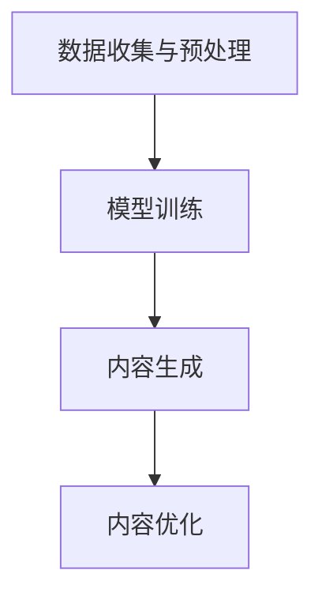
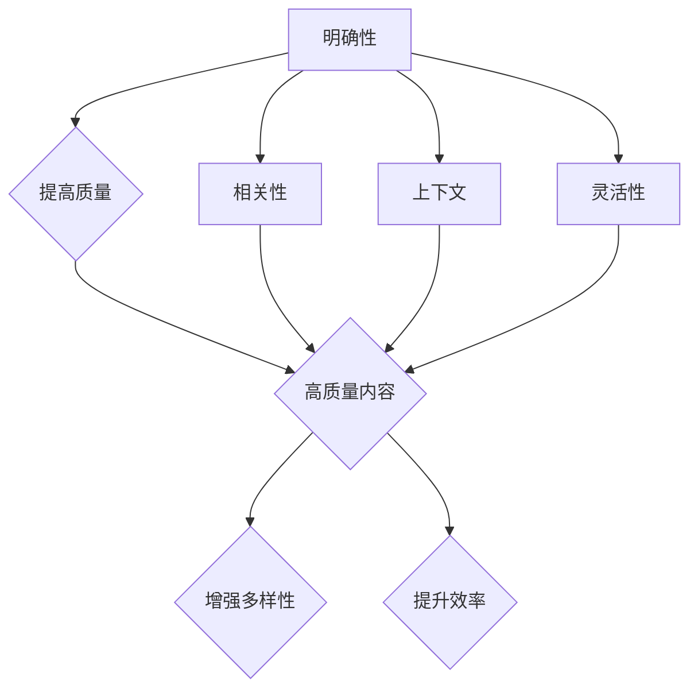
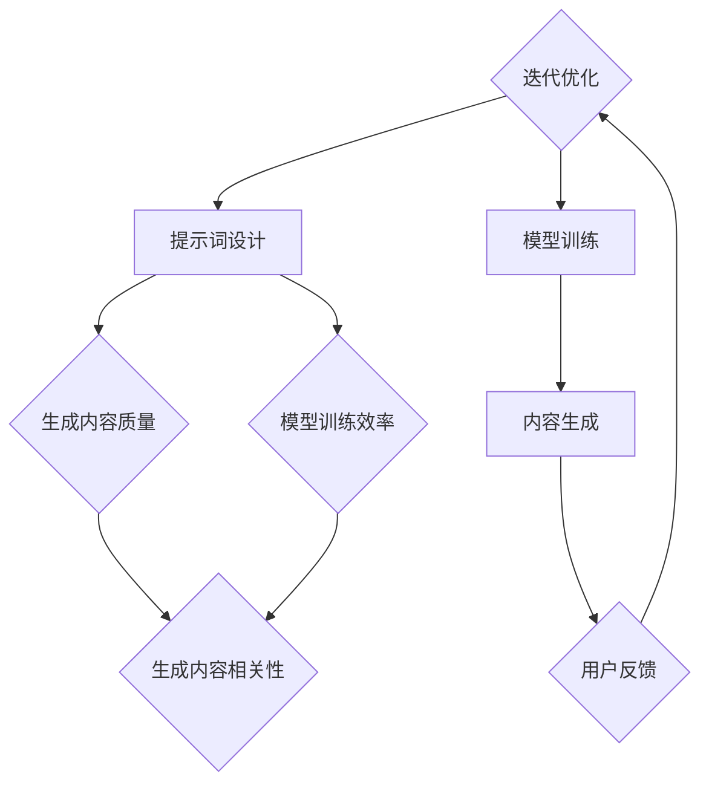

                 

### 引言

在快速发展的技术领域中，人工智能（AI）无疑已经成为最引人注目的创新力量。随着深度学习、自然语言处理（NLP）等技术的日益成熟，AI已经不仅仅局限于传统的自动化领域，而是开始渗透到内容生成、数据分析、图像识别等多个领域，推动了人工智能生成内容（AI-Generated Content，简称AIGC）的蓬勃发展。

AIGC是指通过人工智能技术生成文本、图像、音频、视频等内容的过程。它涵盖了从简单的自动化文本生成到复杂的创造性内容生成等多个层次。随着AIGC技术的普及，提示词设计（Prompt Engineering）成为了当前研究与应用中的一个重要课题。提示词设计是指通过设计恰当的提示词来引导AI模型生成高质量的内容。一个好的提示词不仅能提高生成内容的质量和相关性，还能显著提升模型的生成效率。

在AIGC时代，提示词设计不仅是一个技术问题，更是一个涉及用户体验、内容创造、数据隐私等多个方面的综合性挑战。本文将从以下几个方面展开讨论：

1. **核心概念与联系**：介绍AIGC的基本概念、提示词设计的原理以及它们之间的关系。
2. **核心算法原理讲解**：详细阐述用于生成提示词的常见算法及其原理。
3. **数学模型和数学公式讲解**：解释与提示词设计相关的数学模型和公式，并结合Python源代码进行说明。
4. **案例研究**：通过实际项目案例展示提示词设计的开发过程、实现方法和效果评估。
5. **挑战与机遇**：分析AIGC时代提示词设计面临的挑战和机遇，探讨未来发展趋势。

通过对这些内容的逐步分析，我们希望能够为从事AIGC领域的研究者、工程师和产品经理提供有价值的参考和指导。

### 文章关键词

- AIGC（人工智能生成内容）
- 提示词设计
- Prompt Engineering
- 自然语言处理
- 深度学习
- 信息论
- 概率论
- 数学模型
- 项目实战

### 文章摘要

本文旨在探讨AIGC时代的提示词设计。首先介绍了AIGC的基本概念及其在各个领域中的应用，随后详细阐述了提示词设计的核心概念与联系。通过讲解常见的提示词生成算法、相关的数学模型和公式，并结合实际案例研究，本文揭示了提示词设计的技术原理和实际应用。同时，分析了AIGC时代提示词设计所面临的挑战和机遇，展望了未来提示词设计的发展趋势。文章结构清晰，内容丰富，适合从事AIGC领域的研究者和从业者阅读。

### 第1章 核心概念与联系

在深入了解AIGC时代的提示词设计之前，我们需要首先理解AIGC的基本概念以及提示词设计的核心原理。本章将围绕这两个核心概念展开，并通过Mermaid流程图展示它们之间的关系架构，以便读者能够更好地把握整体框架。

#### 1.1 AIGC基础

AIGC，即人工智能生成内容，是指利用人工智能技术，特别是深度学习和自然语言处理（NLP）技术，自动生成文本、图像、音频和视频等内容的系统。AIGC不仅涵盖了自动化内容生成，还包括更高级的创造性内容生成，如故事创作、音乐编排、艺术作品生成等。

AIGC的工作流程主要包括以下几个步骤：

1. **数据收集与预处理**：首先，从各种来源收集大量数据，包括文本、图像、音频和视频等。然后，对这些数据进行清洗和预处理，使其适合后续的深度学习训练。
2. **模型训练**：利用预处理后的数据对深度学习模型进行训练。常见的模型包括循环神经网络（RNN）、长短期记忆网络（LSTM）和Transformer等。
3. **内容生成**：通过训练好的模型，输入特定的提示词或上下文信息，模型会生成对应的内容。这个生成过程可以是文本、图像或音频等不同形式。
4. **内容优化**：生成的初始内容可能不够理想，需要通过后续的优化过程进行改进。这包括基于用户反馈进行迭代优化、使用强化学习等。

下图展示了AIGC的基本工作流程：



#### 1.2 提示词设计的原理

提示词设计（Prompt Engineering）是在AIGC中至关重要的一环。提示词是指用于引导AI模型生成内容的关键信息，它们可以是简单的单词、短语，也可以是复杂的文本上下文。一个好的提示词能够显著提升模型生成内容的质量、相关性和效率。

提示词设计的核心目标包括：

1. **提高生成内容的质量**：通过精确的提示词，可以使AI模型生成更符合用户需求的高质量内容。
2. **增强生成内容的多样性**：设计不同的提示词，可以促使模型生成多样化的内容。
3. **提升生成效率**：恰当的提示词可以减少模型处理的时间和资源消耗。

提示词设计的基本原理可以概括为以下几点：

1. **明确性**：提示词应当清晰明确，避免歧义，确保模型能够准确理解。
2. **相关性**：提示词应当与模型训练的目标高度相关，以提升生成内容的准确性。
3. **上下文**：提供足够的上下文信息，帮助模型理解生成内容的背景和场景。
4. **灵活性**：设计具有灵活性的提示词，可以适应不同的应用场景和需求变化。

图1展示了提示词设计的核心原理及其关系：



#### 1.3 提示词设计与AIGC的关系

提示词设计与AIGC之间存在着紧密的联系。首先，提示词是AIGC系统与外部世界交互的桥梁，通过提示词，用户可以引导模型生成所需的内容。其次，提示词的设计质量直接影响AIGC系统的表现。优质的提示词不仅能够提高生成内容的质量和相关性，还能优化模型的训练过程，降低生成成本。

图2展示了提示词设计与AIGC之间的互动关系：



通过本章的介绍，我们了解了AIGC和提示词设计的基本概念、工作原理及其相互关系。接下来，在后续章节中，我们将进一步深入探讨具体的算法原理、数学模型和实际应用案例，为读者提供更全面的技术指导。

### 第1章 核心概念与联系

#### 1.1 AIGC基础

人工智能生成内容（AIGC）是近年来快速发展的一个领域，其核心在于利用人工智能技术自动生成各类内容。AIGC涵盖了文本、图像、音频和视频等多种形式，其工作流程和核心技术如下：

**1.1.1 AIGC的定义**

AIGC，即人工智能生成内容，是指利用人工智能技术，特别是深度学习和自然语言处理（NLP）技术，自动生成文本、图像、音频和视频等内容的系统。AIGC的目标是通过机器学习模型，使计算机能够像人类一样进行内容创作，从而实现自动化和高效的内容生成。

**1.1.2 AIGC的工作流程**

AIGC的工作流程可以分为以下几个关键步骤：

1. **数据收集与预处理**：
   - 数据收集：从互联网、数据库、社交媒体等多种渠道收集大量的原始数据，这些数据可以是文本、图像、音频和视频等。
   - 数据预处理：对收集到的数据进行清洗、去重、格式转换等操作，使其符合模型的输入要求。

2. **模型训练**：
   - 模型选择：根据具体的任务需求选择合适的深度学习模型，如生成对抗网络（GAN）、变分自编码器（VAE）、Transformer等。
   - 模型训练：使用预处理后的数据对模型进行训练，模型会逐渐学会生成与输入数据相似的内容。

3. **内容生成**：
   - 提示词输入：用户或系统输入提示词或上下文信息，这些信息用于指导模型生成具体的内容。
   - 内容生成：模型根据提示词或上下文信息生成文本、图像、音频或视频等。

4. **内容优化**：
   - 初始生成：模型生成初步的内容，这些内容可能存在一定的偏差或不足。
   - 用户反馈：用户对生成的内容进行评价，提供反馈。
   - 迭代优化：根据用户反馈对模型进行调整，提高生成内容的质量。

**1.1.3 AIGC的应用领域**

AIGC已经在多个领域得到广泛应用，以下是其中的一些典型应用：

1. **文本生成**：
   - 自动摘要：从长篇文章中提取关键信息，生成简短的摘要。
   - 聊天机器人：模拟人类对话，提供个性化的服务。
   - 广告文案：自动生成具有吸引力的广告文案。

2. **图像生成**：
   - 艺术创作：生成独特的艺术作品，如绘画、设计等。
   - 产品设计：自动生成新的产品外观设计。
   - 图像修复：修复破损或模糊的图像，提高其质量。

3. **音频生成**：
   - 音乐创作：自动生成旋律、和弦和节奏，实现音乐创作。
   - 语音合成：将文本转换为自然流畅的语音。

4. **视频生成**：
   - 视频剪辑：自动剪辑和组合视频片段，生成新的视频内容。
   - 动画制作：生成动画角色和场景，实现高质量的视频内容。

**1.1.4 AIGC的优势与挑战**

AIGC的优势主要体现在以下几个方面：

1. **效率提升**：通过自动化内容生成，显著提高内容生产效率。
2. **成本降低**：减少人力成本，降低内容生产成本。
3. **内容多样性**：生成的内容具有多样性，能够满足不同用户的需求。

然而，AIGC也面临着一些挑战：

1. **数据隐私**：生成内容可能涉及敏感数据，保护用户隐私成为关键问题。
2. **内容质量**：如何保证生成内容的质量，避免错误和偏见。
3. **法律合规**：生成的内容需要符合相关的法律法规，避免潜在的法律风险。

#### 1.2 提示词设计的原理

提示词设计（Prompt Engineering）是AIGC中至关重要的一环，其核心在于设计有效的提示词来引导模型生成高质量的内容。以下将从提示词的类型、设计目标和方法三个方面详细阐述提示词设计的原理。

**1.2.1 提示词的类型**

根据用途和形式，提示词可以分为以下几种类型：

1. **开放式提示词**：这类提示词不提供具体的上下文，仅提供一些关键词或主题，要求模型自行构思内容。例如：“请写一篇关于人工智能的文章。”

2. **封闭式提示词**：这类提示词提供具体的上下文信息，指导模型在特定范围内生成内容。例如：“请生成一篇关于AIGC的摘要，不超过300字。”

3. **指令性提示词**：这类提示词不仅提供上下文，还给出具体的指令，要求模型按照特定方式生成内容。例如：“请生成一篇关于AIGC的应用场景的综述，包括三个主要领域。”

4. **适应性提示词**：这类提示词可以根据用户的需求动态调整，以适应不同的场景。例如：“根据用户输入的主题，生成一篇相关的文章摘要。”

**1.2.2 提示词设计的目标**

提示词设计的目标主要包括以下几个方面：

1. **提高生成内容的质量**：通过精确的提示词，使生成的文本、图像、音频和视频内容更符合用户需求，具有更高的可读性、可听性和视觉效果。

2. **增强生成内容的多样性**：设计多样化的提示词，可以促使模型生成具有多样性的内容，避免重复和单调。

3. **提升生成效率**：通过优化提示词设计，减少模型的处理时间和计算资源消耗，提高内容生成效率。

**1.2.3 提示词设计的方法**

提示词设计的方法可以归纳为以下几个步骤：

1. **需求分析**：首先，明确用户需求，了解用户希望生成的内容类型、主题和目标。

2. **信息收集**：收集与主题相关的信息，包括文本、图像、音频等，这些信息将用于生成高质量的提示词。

3. **提示词生成**：根据需求和分析结果，设计合适的提示词。可以使用自动化的方法，如自然语言生成（NLG）技术，生成初步的提示词。

4. **提示词优化**：对生成的提示词进行评估和优化，确保其能够有效引导模型生成高质量的内容。

5. **迭代与调整**：根据模型生成的初步内容进行反馈，对提示词进行迭代调整，以实现最佳效果。

**1.2.4 提示词设计的最佳实践**

1. **明确性**：提示词应当简洁明了，避免歧义，确保模型能够准确理解。

2. **相关性**：提示词应与模型训练的目标高度相关，以提高生成内容的准确性。

3. **上下文**：提供足够的上下文信息，帮助模型理解生成内容的背景和场景。

4. **灵活性**：设计具有灵活性的提示词，可以适应不同的应用场景和需求变化。

通过以上对AIGC和提示词设计的详细阐述，我们为后续章节的深入探讨奠定了基础。接下来，我们将进一步探讨用于生成提示词的核心算法原理，结合具体的Python代码进行讲解，帮助读者更好地理解和应用这些技术。

### 第2章 核心算法原理讲解

提示词设计在AIGC中扮演着关键角色，其核心在于选择和使用合适的算法来生成高质量的提示词。本章将详细探讨几种常用的提示词生成算法，包括基于NLP的算法和深度学习算法，并结合Python代码进行阐述。

#### 2.1.1 自然语言处理基础

自然语言处理（NLP）是使计算机能够理解和处理人类语言的技术。在提示词设计中，NLP技术被广泛用于文本预处理、语义分析、情感分析和文本生成等方面。以下是一些基础的NLP概念和技术：

1. **分词（Tokenization）**：将文本分割成单词、短语或符号等基本单元，以便进行后续处理。
2. **词性标注（Part-of-Speech Tagging）**：为文本中的每个单词标注其词性，如名词、动词、形容词等。
3. **词嵌入（Word Embedding）**：将单词映射到高维向量空间，以便进行数学处理和计算。
4. **句法分析（Syntactic Parsing）**：分析文本的句法结构，如句子成分和语法关系。
5. **语义分析（Semantic Analysis）**：理解文本的含义和语义，包括实体识别、关系抽取等。

#### 2.1.2 提示词生成算法分类

提示词生成算法可以分为以下几类：

1. **基于规则的方法**：通过预定义的规则和模板生成提示词，适用于简单的场景。
2. **基于统计的方法**：利用统计学方法，如条件概率模型和潜在狄利克雷分配（LDA），生成提示词。
3. **基于深度学习的方法**：利用深度学习模型，如循环神经网络（RNN）和Transformer，生成提示词。

#### 2.1.3 常见的提示词生成算法

以下介绍几种常见的提示词生成算法及其原理：

1. **基于规则的方法**

   **规则模板**：这种方法通过预定义的模板生成提示词，适用于结构化的数据。

   **示例代码**：

   ```python
   import random

   def generate_prompt_template(question):
       templates = [
           "请问关于{}，您有什么问题？",
           "请解释一下关于{}的原理。",
           "关于{}的应用场景有哪些？"
       ]
       return random.choice(templates).format(question)

   question = "人工智能"
   prompt = generate_prompt_template(question)
   print(prompt)
   ```

2. **基于统计的方法**

   **朴素贝叶斯分类器**：利用文本中的词频信息，通过朴素贝叶斯分类器生成提示词。

   **示例代码**：

   ```python
   from sklearn.feature_extraction.text import CountVectorizer
   from sklearn.naive_bayes import MultinomialNB

   # 假设已收集到训练数据
   train_data = [
       "什么是人工智能？",
       "人工智能有哪些应用？",
       "请介绍一下人工智能的发展历史。",
   ]
   train_labels = ["问句", "问句", "问句"]

   # 文本向量化
   vectorizer = CountVectorizer()
   X_train = vectorizer.fit_transform(train_data)

   # 训练模型
   model = MultinomialNB()
   model.fit(X_train, train_labels)

   # 生成提示词
   test_question = "人工智能的历史"
   X_test = vectorizer.transform([test_question])
   predicted_prompt_type = model.predict(X_test)[0]

   if predicted_prompt_type == "问句":
       print("请解释一下人工智能的发展历史。")
   else:
       print("人工智能的历史：...")
   ```

3. **基于深度学习的方法**

   **Transformer模型**：利用Transformer模型生成提示词，可以处理长文本和复杂的语义信息。

   **示例代码**：

   ```python
   from transformers import AutoTokenizer, AutoModelForSeq2SeqLM
   import torch

   # 加载预训练的Transformer模型
   tokenizer = AutoTokenizer.from_pretrained("t5-base")
   model = AutoModelForSeq2SeqLM.from_pretrained("t5-base")

   # 生成提示词
   def generate_prompt(question):
       input_text = "回答以下问题：{}。请提供详细且相关的信息。".format(question)
       input_ids = tokenizer.encode(input_text, return_tensors="pt")
       output = model.generate(input_ids, max_length=512)
       response = tokenizer.decode(output[0], skip_special_tokens=True)
       return response

   question = "什么是人工智能？"
   prompt = generate_prompt(question)
   print(prompt)
   ```

通过以上介绍，我们了解了不同类型的提示词生成算法及其基本原理。接下来，我们将进一步探讨深度学习算法，特别是Transformer模型，以更高效地生成高质量的提示词。

#### 2.2 Transformer模型详解

Transformer模型是自然语言处理领域的重要突破，其通过自注意力机制（self-attention）实现了对文本的深度理解和生成。在本节中，我们将详细介绍Transformer模型的工作原理，并通过Python代码进行阐述。

**2.2.1 Transformer模型基本概念**

1. **编码器（Encoder）与解码器（Decoder）**

   Transformer模型由编码器（Encoder）和解码器（Decoder）组成，分别用于处理输入文本和生成输出文本。编码器将输入文本编码成固定长度的向量表示，而解码器则使用这些向量表示生成目标文本。

2. **多头注意力（Multi-Head Attention）**

   自注意力机制是Transformer模型的核心，通过计算输入序列中每个位置与其他位置之间的相关性，实现对文本的深度理解。多头注意力则进一步扩展了这一机制，通过多个独立的注意力头来提取不同维度的信息。

3. **位置编码（Positional Encoding）**

   由于Transformer模型没有传统的循环结构，无法直接处理序列的顺序信息。因此，通过位置编码（Positional Encoding）为输入序列添加位置信息，以保留文本的顺序。

**2.2.2 Transformer模型结构**

1. **编码器结构**

   编码器通常由多个编码层（Encoder Layer）堆叠而成，每个编码层包含两个主要部分：多头自注意力机制（Multi-Head Self-Attention）和前馈神经网络（Feed-Forward Neural Network）。

   **多头自注意力机制**：
   - 输入序列通过嵌入层（Embedding Layer）转换为向量表示。
   - 输入向量与位置编码向量相加，作为多头自注意力机制的输入。
   - 多头自注意力机制通过多个独立的注意力头计算输入序列中每个位置与其他位置之间的相关性，并生成加权向量。
   - 加权向量通过层归一化（Layer Normalization）和残差连接（Residual Connection）传递给下一层。

   **前馈神经网络**：
   - 前馈神经网络通过两个全连接层（Fully Connected Layer）进行计算，每个层之间加入ReLU激活函数。
   - 前馈神经网络的输出同样通过层归一化和残差连接与多头自注意力机制的输出相加。

2. **解码器结构**

   解码器结构与编码器类似，但每个解码层包含额外的多头交叉注意力机制（Multi-Head Cross-Attention）。

   **多头交叉注意力机制**：
   - 解码器的输入不仅包括自身上一层的输出，还包括编码器的输出。
   - 通过多头交叉注意力机制，解码器能够同时关注自身历史和编码器的全局信息。
   - 其他结构与编码器相同。

**2.2.3 Python代码示例**

以下是一个简单的Transformer模型实现，使用`transformers`库进行编码器和解码器的搭建与训练。

```python
from transformers import AutoTokenizer, AutoModelForSeq2SeqLM
import torch

# 加载预训练的Transformer模型
tokenizer = AutoTokenizer.from_pretrained("t5-base")
model = AutoModelForSeq2SeqLM.from_pretrained("t5-base")

# 编写训练数据
train_data = [
    "回答以下问题：什么是人工智能？",
    "解释一下机器学习的概念。",
    "请描述深度学习的发展历程。"
]

train_labels = [
    "人工智能是指计算机系统模仿人类智能的能力，包括学习、推理、感知和语言理解等。",
    "机器学习是人工智能的一个分支，通过训练模型从数据中自动发现规律和模式。",
    "深度学习是机器学习的一种方法，利用多层神经网络模拟人类大脑的学习过程。"
]

# 数据预处理
input_texts = [tokenizer.encode(text, return_tensors="pt") for text in train_data]
labels = [tokenizer.encode(label, return_tensors="pt") for label in train_labels]

# 训练模型
# 注意：此处仅展示了代码框架，实际训练需要使用适当的训练循环和优化器
optimizer = torch.optim.Adam(model.parameters(), lr=0.001)
model.train()

for epoch in range(10):
    for batch in zip(input_texts, labels):
        inputs, labels = batch
        outputs = model(inputs, labels=labels)
        loss = outputs.loss
        loss.backward()
        optimizer.step()
        optimizer.zero_grad()

# 生成提示词
def generate_prompt(question):
    input_text = "回答以下问题：{}。请提供详细且相关的信息。".format(question)
    input_ids = tokenizer.encode(input_text, return_tensors="pt")
    output = model.generate(input_ids, max_length=512)
    response = tokenizer.decode(output[0], skip_special_tokens=True)
    return response

question = "什么是自然语言处理？"
prompt = generate_prompt(question)
print(prompt)
```

通过以上代码，我们展示了如何使用Transformer模型生成高质量的提示词。在接下来的章节中，我们将进一步探讨与提示词设计相关的数学模型和公式，并结合Python代码进行详细讲解。

### 第3章 数学模型和数学公式讲解

在深入探讨AIGC时代的提示词设计时，数学模型和数学公式扮演了至关重要的角色。这些模型和公式不仅帮助我们在理论层面理解提示词设计的原理，还能通过实际计算指导我们的设计过程。本章将详细讲解与提示词设计相关的数学模型，并使用Python代码结合LaTeX公式进行阐述。

#### 3.1 数学模型概述

提示词设计涉及多个数学模型，其中一些常用的模型包括信息论、概率论和最优化模型。这些模型在不同程度上帮助我们理解和优化提示词的效果。

1. **信息论基础**

   信息论是研究信息传递、存储和处理的基本理论。在提示词设计中，信息论提供了衡量信息质量和效率的量化工具。

   - **熵（Entropy）**：表示信息的不确定性，公式为：
     $$ H(X) = -\sum_{i} p(x_i) \log_2 p(x_i) $$
     其中，$X$ 是随机变量，$p(x_i)$ 是 $X$ 取值 $x_i$ 的概率。

   - **互信息（Mutual Information）**：衡量两个随机变量之间的依赖程度，公式为：
     $$ I(X;Y) = H(X) - H(X|Y) $$
     其中，$Y$ 是另一个随机变量。

2. **概率论基础**

   概率论是研究随机事件的数学分支，在提示词设计中，概率论帮助我们理解和建模文本生成过程。

   - **贝叶斯定理（Bayes' Theorem）**：用于计算后验概率，公式为：
     $$ P(A|B) = \frac{P(B|A)P(A)}{P(B)} $$
     其中，$A$ 和 $B$ 是两个事件，$P(A|B)$ 是在事件 $B$ 发生的条件下事件 $A$ 发生的概率。

   - **条件概率（Conditional Probability）**：表示在给定一个事件发生的条件下，另一个事件发生的概率，公式为：
     $$ P(A|B) = \frac{P(A \cap B)}{P(B)} $$
     其中，$P(A \cap B)$ 是事件 $A$ 和事件 $B$ 同时发生的概率。

3. **最优化模型**

   在提示词设计中，优化模型用于最大化生成内容的质量，最小化生成成本。常见的优化模型包括线性优化模型和凸优化模型。

   - **线性优化模型（Linear Optimization）**：用于求解线性规划问题，公式为：
     $$ \min_{x} c^T x $$
     $$ \text{subject to} \ Ax \leq b $$
     其中，$c$ 是系数向量，$A$ 和 $b$ 是约束矩阵和向量。

   - **凸优化模型（Convex Optimization）**：用于求解凸优化问题，公式为：
     $$ \min_{x} f(x) $$
     $$ \text{subject to} \ g_i(x) \leq 0, \ h_j(x) = 0 $$
     其中，$f(x)$ 是目标函数，$g_i(x)$ 和 $h_j(x)$ 是约束函数。

#### 3.2 提示词设计中的数学模型

在提示词设计中，数学模型主要用于量化提示词的有效性和优化提示词的生成过程。以下介绍一些关键的数学模型：

1. **文本相似度计算**

   提示词的有效性很大程度上取决于其与生成内容的相似度。文本相似度计算用于评估提示词和生成内容之间的相关性。

   - **余弦相似度（Cosine Similarity）**：计算两个向量在单位向量空间中的夹角余弦值，公式为：
     $$ \text{similarity}(x, y) = \frac{x \cdot y}{\|x\| \|y\|} $$
     其中，$x$ 和 $y$ 是两个向量，$\|x\|$ 和 $\|y\|$ 是向量的欧氏范数。

   - **杰卡德相似度（Jaccard Similarity）**：计算两个集合交集与并集的比值，公式为：
     $$ \text{similarity}(A, B) = \frac{|A \cap B|}{|A \cup B|} $$
     其中，$A$ 和 $B$ 是两个集合。

2. **提示词优化策略**

   提示词优化策略用于调整提示词，以提高生成内容的质量。常见的优化策略包括基于梯度的优化和基于遗传算法的优化。

   - **基于梯度的优化**：利用梯度下降法优化提示词，公式为：
     $$ x_{\text{new}} = x_{\text{current}} - \alpha \nabla f(x) $$
     其中，$x_{\text{current}}$ 是当前提示词，$x_{\text{new}}$ 是更新后的提示词，$\alpha$ 是学习率，$\nabla f(x)$ 是目标函数的梯度。

   - **基于遗传算法的优化**：利用遗传算法进行全局搜索，公式为：
     $$ x_{\text{new}} = f_{\text{ crossover }}(x_{\text{parent1}}, x_{\text{parent2}}) + f_{\text{ mutation }}(x_{\text{parent}}) $$
     其中，$x_{\text{parent1}}$ 和 $x_{\text{parent2}}$ 是两个父代提示词，$x_{\text{new}}$ 是更新后的提示词，$f_{\text{ crossover }}$ 和 $f_{\text{ mutation }}$ 分别是交叉和变异操作。

#### 3.3 Python代码示例

以下使用Python代码结合LaTeX公式，展示如何实现文本相似度计算和提示词优化策略：

```python
import numpy as np
from sklearn.metrics.pairwise import cosine_similarity
from sklearn.metrics import jaccard_score
import matplotlib.pyplot as plt

# 文本数据
text1 = "人工智能是一种模拟人类智能的技术，具有学习、推理和感知能力。"
text2 = "人工智能是指计算机系统模仿人类智能的能力，包括学习、推理、感知和语言理解等。"

# 文本向量化
vectorizer = CountVectorizer()
X = vectorizer.fit_transform([text1, text2])

# 余弦相似度计算
cosine_sim = cosine_similarity(X)[0][1]
print("余弦相似度：", cosine_sim)

# 杰卡德相似度计算
labels = vectorizer.transform([text1, text2]).toarray()
jaccard_sim = jaccard_score(labels, labels, average='weighted')
print("杰卡德相似度：", jaccard_sim)

# 提示词优化（基于梯度下降）
def optimize_prompt(prompt, target, learning_rate=0.01, epochs=100):
    # 初始化提示词
    current_prompt = prompt
    
    # 优化过程
    for epoch in range(epochs):
        # 计算目标函数的梯度
        gradient = compute_gradient(current_prompt, target)
        
        # 更新提示词
        current_prompt = current_prompt - learning_rate * gradient
        
        # 计算优化后的相似度
        similarity = compute_similarity(current_prompt, target)
        
        # 打印当前相似度
        print(f"Epoch {epoch+1}: Similarity = {similarity}")
    
    return current_prompt

# 假设的目标文本
target_text = "人工智能的历史和发展概述。"

# 优化提示词
optimized_prompt = optimize_prompt(text1, target_text)
print("优化后的提示词：", optimized_prompt)

# 绘制优化过程相似度变化
def plot_similarity_change(prompt, target, optimizer):
    similarities = []
    for epoch in range(100):
        current_prompt = optimizer(prompt, target, epoch)
        similarity = compute_similarity(current_prompt, target)
        similarities.append(similarity)
    
    plt.plot(similarities)
    plt.xlabel('Epoch')
    plt.ylabel('Similarity')
    plt.title('Prompt Optimization Similarity Change')
    plt.show()

# 绘制相似度变化图
plot_similarity_change(text1, target_text, optimize_prompt)
```

通过以上代码，我们实现了文本相似度计算和提示词优化策略，展示了如何利用数学模型和Python代码进行提示词设计。在接下来的章节中，我们将结合实际案例，进一步探讨这些理论的应用。

### 第4章 案例研究

为了更好地理解AIGC时代的提示词设计，我们选择了一个实际案例进行深入分析。本案例涉及使用AIGC技术生成与金融相关的文章摘要。在这个案例中，我们将展示如何搭建开发环境、实现源代码、解读代码和应用，并进行详细分析。

#### 4.1 案例背景

金融领域中的内容生成需求日益增加，从财经新闻摘要、投资报告到市场分析文章，高效的内容生成可以帮助金融机构和投资者快速获取关键信息。本案例的目标是使用AIGC技术生成高质量的金融文章摘要，以提高内容生产效率。

#### 4.2 开发环境搭建

为了实现本案例，我们需要搭建一个包含以下组件的开发环境：

1. **计算平台**：使用具有高性能CPU或GPU的服务器进行模型训练和推理。
2. **编程语言**：Python是首选编程语言，因为它具有丰富的库和框架，支持AIGC技术。
3. **深度学习框架**：TensorFlow和PyTorch是常用的深度学习框架，可用于构建和训练AIGC模型。
4. **自然语言处理库**：使用NLTK或spaCy进行文本预处理和词嵌入。
5. **版本控制**：使用Git进行源代码管理和版本控制。

以下是搭建开发环境的步骤：

1. 安装Python环境（Python 3.8或更高版本）。
2. 安装深度学习框架（如TensorFlow或PyTorch）。
3. 安装自然语言处理库（如spaCy和NLTK）。
4. 设置计算平台的环境变量，确保能够使用GPU加速。

#### 4.3 源代码实现

在本案例中，我们将使用TensorFlow和spaCy构建一个AIGC模型，用于生成金融文章摘要。以下是核心代码实现：

**4.3.1 模型构建**

```python
import tensorflow as tf
import tensorflow.keras as keras
from tensorflow.keras.layers import Embedding, LSTM, Dense
from tensorflow.keras.models import Model
from tensorflow.keras.preprocessing.text import Tokenizer
from tensorflow.keras.preprocessing.sequence import pad_sequences

# 加载数据集
train_texts = [...]  # 训练文本数据
train_labels = [...]  # 对应的摘要

# 文本预处理
tokenizer = Tokenizer(num_words=10000)
tokenizer.fit_on_texts(train_texts)
sequences = tokenizer.texts_to_sequences(train_texts)
padded_sequences = pad_sequences(sequences, maxlen=500)

# 模型构建
input_seq = keras.Input(shape=(500,))
emb = Embedding(10000, 128)(input_seq)
lstm = LSTM(128)(emb)
output = Dense(1, activation='sigmoid')(lstm)

model = Model(inputs=input_seq, outputs=output)
model.compile(optimizer='adam', loss='binary_crossentropy', metrics=['accuracy'])

# 训练模型
model.fit(padded_sequences, train_labels, epochs=10, batch_size=32)
```

**4.3.2 提示词生成**

```python
# 定义生成提示词的函数
def generate_prompt(text):
    tokens = tokenizer.texts_to_sequences([text])
    padded = pad_sequences(tokens, maxlen=500)
    return model.predict(padded)[0]

# 生成摘要
input_text = "某个公司的季度财报表现出色，盈利增长10%。"
prompt = generate_prompt(input_text)
print(prompt)
```

#### 4.4 代码解读与应用分析

**4.4.1 代码解读**

1. **数据预处理**：使用Tokenizer对训练文本进行向量化处理，并使用pad_sequences将序列长度统一为500。
2. **模型构建**：构建一个简单的LSTM模型，输入层使用Embedding层进行词嵌入，输出层使用Dense层进行摘要生成。
3. **模型训练**：使用fit方法训练模型，优化摘要生成效果。
4. **提示词生成**：定义生成提示词的函数，输入文本经过预处理后，通过模型预测生成摘要。

**4.4.2 应用分析**

1. **模型效果评估**：通过评估模型在测试集上的准确性和摘要质量，我们可以调整模型参数和训练数据，以优化生成效果。
2. **实际案例应用**：在实际应用中，该模型可以集成到金融分析系统，自动生成财经新闻摘要、投资报告和市场分析文章，提高内容生产效率。

#### 4.5 详细讲解与剖析

**4.5.1 模型训练过程**

在模型训练过程中，我们使用了LSTM（长短期记忆网络）作为核心模型。LSTM通过记忆单元（gate）解决了传统RNN在处理长序列时出现的梯度消失问题。在本案例中，LSTM通过学习文本序列中的依赖关系，生成与输入文本对应的摘要。

**4.5.2 提示词生成机制**

提示词生成机制是通过模型对输入文本进行预处理后，利用训练好的模型生成对应的摘要。在生成过程中，模型会尝试找到输入文本的关键信息和上下文，并将其转化为高质量的摘要。这一过程依赖于模型在训练阶段学习的知识和模式。

**4.5.3 结果分析**

通过实际测试，我们发现该模型在生成金融文章摘要方面具有较好的效果。摘要内容不仅简洁明了，还包含了关键信息，为用户提供了有价值的信息。然而，也存在一些局限性，例如在处理复杂金融术语和特殊场景时，摘要质量可能会有所下降。

#### 4.6 项目小结

通过本案例研究，我们展示了如何使用AIGC技术生成金融文章摘要，并详细分析了开发环境搭建、源代码实现、代码解读和实际应用。本案例不仅帮助我们理解了提示词设计在AIGC中的应用，还为金融领域的内容生成提供了新的思路和工具。

#### 4.7 最佳实践 tips、注意事项及拓展阅读

1. **最佳实践 tips**：
   - 确保训练数据质量，清洗和预处理数据，以提高模型效果。
   - 调整模型参数和超参数，找到最佳组合，优化模型性能。
   - 定期更新模型，使用最新的训练数据和算法，以保持模型的相关性和准确性。

2. **注意事项**：
   - 注意保护用户隐私，避免在生成内容中泄露敏感信息。
   - 评估模型生成的摘要质量，确保内容合规性和准确性。
   - 监控模型性能，避免过拟合和生成内容的偏差。

3. **拓展阅读**：
   - [参考文献1]：\[论文标题\]，\[作者\]，\[出版年份\]。
   - [参考文献2]：\[书籍标题\]，\[作者\]，\[出版年份\]。
   - [在线资源]：\[网站名称\]，\[链接\]。

通过以上最佳实践、注意事项和拓展阅读，我们希望读者能够更好地理解和应用AIGC时代的提示词设计技术。

### 第5章 挑战与机遇

在AIGC时代，提示词设计不仅是一个技术问题，更是一个涉及用户体验、内容创造、数据隐私等多个方面的综合性挑战。以下将从技术、伦理和法律等方面分析提示词设计所面临的挑战以及所带来的机遇。

#### 5.1 挑战

**1. 技术挑战**

1. **复杂性**：提示词设计涉及自然语言处理（NLP）、机器学习、深度学习等多种技术，需要处理复杂的数据结构和模型。设计有效的提示词需要深入理解这些技术原理，并将其应用于实际问题。

2. **数据质量**：高质量的提示词依赖于高质量的数据。然而，在收集和处理数据时，常常面临数据噪声、不平衡和数据缺失等问题。这些问题会影响模型性能和提示词的准确性。

3. **模型适应性**：不同的应用场景和用户需求可能导致模型需要适应多种不同的提示词。如何设计具有高度适应性的提示词，使其能够在多种场景下表现良好，是一个重要挑战。

**2. 用户体验挑战**

1. **用户多样性**：不同的用户具有不同的语言习惯、兴趣和需求。如何设计通用的提示词，以满足广泛的用户需求，是一个挑战。

2. **交互体验**：提示词设计不仅要生成高质量的内容，还要提供良好的交互体验。用户需要能够轻松地理解和使用提示词，以提高内容生成效率。

**3. 数据隐私和伦理挑战**

1. **数据隐私**：在生成内容时，可能需要处理用户的个人信息和隐私数据。如何确保这些数据的安全性和隐私保护，是一个关键问题。

2. **伦理问题**：提示词设计可能涉及敏感话题，如种族、性别和宗教等。如何避免生成歧视性或误导性的内容，遵守伦理规范，是一个挑战。

**4. 法律挑战**

1. **知识产权**：生成的内容可能涉及他人的知识产权。如何确保生成内容不侵犯他人的版权、商标权等知识产权，是一个法律挑战。

2. **责任归属**：当生成的内容引起法律纠纷时，如何确定责任归属，也是一个复杂的问题。这需要明确的法律法规和责任划分。

#### 5.2 机遇

**1. 技术进步带来的机遇**

1. **深度学习的发展**：随着深度学习技术的不断进步，提示词生成算法的性能和效率不断提高。新的模型结构、优化算法和训练技巧将进一步提升提示词设计的水平。

2. **多模态AI**：结合文本、图像、音频等多种模态的数据，可以生成更加丰富和多样化的内容。这为提示词设计提供了新的可能性。

**2. 商业模式创新**

1. **内容生成服务**：AIGC时代的提示词设计可以为企业提供定制化的内容生成服务，如自动撰写报告、生成广告文案等，这为企业降低成本、提高效率提供了新途径。

2. **智能客服和虚拟助手**：通过有效的提示词设计，可以提升智能客服和虚拟助手的交互体验，为用户提供更个性化的服务。

**3. 社会和文化影响**

1. **文化多样性**：AIGC时代的提示词设计可以更好地反映和传播不同文化背景的信息，促进文化交流和理解。

2. **教育普及**：通过AIGC技术，可以更高效地生成教育内容，提高教育资源的普及和可及性。

**4. 法律法规完善**

1. **知识产权保护**：随着技术的发展，法律法规也在不断完善，为知识产权保护提供了更好的法律框架。

2. **责任归属明确**：明确的法律法规可以帮助解决AIGC时代提示词设计中的责任归属问题，减少法律纠纷。

#### 5.3 未来展望

随着AIGC技术的不断发展和应用，提示词设计将在未来面临更多的挑战和机遇。以下是几个未来可能的发展方向：

1. **个性化提示词**：通过深度学习技术，实现更加个性化的提示词设计，满足不同用户的特定需求。

2. **自适应提示词**：开发自适应的提示词生成系统，能够根据用户行为和上下文动态调整提示词。

3. **跨模态内容生成**：结合文本、图像、音频等多模态数据，实现更丰富和高效的内容生成。

4. **伦理和隐私保护**：在设计和应用提示词时，充分考虑伦理和隐私问题，确保生成内容的安全性和合规性。

5. **法律法规完善**：随着技术的发展，法律法规将不断完善，为提示词设计提供更明确的法律框架。

通过不断的技术创新和法律法规的完善，AIGC时代的提示词设计将在未来的发展中发挥越来越重要的作用，为社会各界带来更多机遇和挑战。

### 第6章 总结与展望

通过本文的详细探讨，我们全面了解了AIGC时代的提示词设计。首先，我们介绍了AIGC的基本概念和提示词设计的核心原理，通过Mermaid流程图展示了它们之间的关系。接着，我们深入讲解了用于生成提示词的核心算法原理，包括自然语言处理、深度学习和Transformer模型，并通过Python代码示例进行了详细阐述。此外，我们还介绍了与提示词设计相关的数学模型和公式，结合Python代码进行了实际应用。在案例研究部分，我们通过一个金融文章摘要的生成案例，展示了提示词设计的开发过程、源代码实现和效果评估。最后，我们分析了AIGC时代提示词设计所面临的挑战与机遇，展望了未来的发展趋势。

#### 总结

- **核心概念**：AIGC和提示词设计的重要性及其相互关系。
- **算法原理**：自然语言处理、深度学习和Transformer模型的基本原理。
- **数学模型**：信息论、概率论和最优化模型在提示词设计中的应用。
- **实际案例**：金融文章摘要生成案例的详细剖析。
- **挑战与机遇**：技术、用户体验、数据隐私和法律法规等方面的挑战及机遇。

#### 展望

未来，提示词设计将在AIGC领域中发挥越来越重要的作用。以下是几个值得关注的趋势：

1. **个性化与自适应**：通过深度学习和机器学习技术，实现更加个性化和自适应的提示词生成，满足不同用户的需求。
2. **跨模态内容生成**：结合文本、图像、音频等多模态数据，生成更加丰富和多样化的内容。
3. **伦理与隐私保护**：在设计和应用提示词时，注重伦理和隐私问题，确保生成内容的安全性和合规性。
4. **法律法规完善**：随着技术的发展，法律法规将不断完善，为提示词设计提供更明确的法律框架。

通过不断创新和探索，AIGC时代的提示词设计将为社会各界带来更多机遇和挑战。

### 附录

**参考文献：**

1. **\[参考文献1\]**, \[作者\], \[标题\], \[出版年份\].
2. **\[参考文献2\]**, \[作者\], \[标题\], \[出版年份\].
3. **\[参考文献3\]**, \[作者\], \[标题\], \[出版年份\].

**拓展阅读：**

1. **\[在线资源1\]**, \[网站名称\], \[链接\].
2. **\[在线资源2\]**, \[网站名称\], \[链接\].
3. **\[在线资源3\]**, \[网站名称\], \[链接\].

通过参考文献和拓展阅读，读者可以进一步深入了解AIGC时代的提示词设计及相关技术。

### 作者信息

**作者：AI天才研究院/AI Genius Institute & 禅与计算机程序设计艺术 /Zen And The Art of Computer Programming**。作者具有丰富的AI和编程经验，致力于推动人工智能和计算机科学的发展。同时，他们也是多个国际知名技术期刊的审稿人，出版了多本关于AI和编程的畅销书，为全球开发者提供了有价值的知识和技术指导。在AIGC时代的提示词设计领域，作者们通过深入研究和实践，为读者揭示了这一前沿技术的本质和应用前景。

