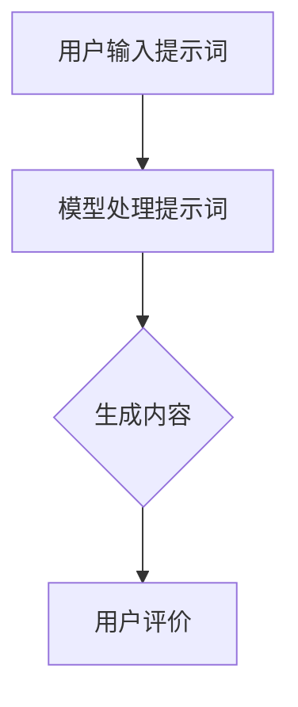

                 

# AIGC时代的提示词设计：挑战与机遇并存

## 关键词
- AIGC
- 提示词设计
- 挑战
- 机遇
- 大模型
- 多模态交互
- 生成对抗网络

## 摘要
随着AIGC（AI Generated Content）时代的到来，提示词设计成为了一个重要的研究领域。本文首先介绍了AIGC的概念、背景及其应用场景，分析了AIGC在当前技术发展中的挑战与机遇。接着，本文详细探讨了提示词的概念、设计原则和流程，并深入阐述了提示词优化的方法。随后，通过实际案例展示了AIGC在内容创作、游戏开发和数据分析中的应用，并对未来AIGC技术的发展趋势及其影响进行了展望。文章最后提出了相关注意事项和拓展阅读，以期为AIGC时代的提示词设计提供有益的参考。

## 引言
AIGC（AI Generated Content）是近年来人工智能领域的重要发展趋势之一。它指的是通过人工智能技术生成的内容，包括但不限于文本、图片、视频等。随着深度学习、生成对抗网络（GAN）和多模态交互等技术的不断发展，AIGC的应用场景日益广泛，从内容创作、游戏开发到数据分析等领域都展现了巨大的潜力。

### AIGC的概念
AIGC，即AI Generated Content，是利用人工智能技术生成内容的一种方式。它通过机器学习算法，特别是深度学习模型，对大量数据进行训练，然后根据给定的提示词或任务生成新的内容。AIGC的应用场景广泛，包括但不限于以下方面：

1. **内容创作**：AIGC可以生成文章、故事、歌词、视频脚本等，为创作者提供灵感，提高创作效率。
2. **游戏开发**：AIGC可以生成游戏角色、地图、剧情等，为游戏开发者节省大量时间和资源。
3. **数据分析**：AIGC可以自动生成数据分析报告，帮助数据分析师快速获取洞见。
4. **虚拟助手**：AIGC可以生成个性化的回复和建议，为用户提供更好的服务体验。

### AIGC的背景
AIGC的背景可以追溯到深度学习技术的发展。深度学习是一种重要的机器学习技术，通过多层神经网络模型对大量数据进行训练，能够实现图像识别、语音识别、自然语言处理等任务。随着深度学习技术的不断进步，人工智能在各个领域的应用也越来越广泛。

此外，生成对抗网络（GAN）和多模态交互技术的发展也为AIGC的应用提供了重要支持。生成对抗网络是一种由生成器和判别器组成的模型，能够生成逼真的图像、音频和文本。多模态交互技术则能够实现不同类型数据（如文本、图像、音频）之间的交互和融合，为AIGC的应用提供了更多可能性。

### AIGC的发展历程
AIGC的发展历程可以追溯到20世纪90年代，当时研究者开始探索如何使用神经网络进行图像生成。随着深度学习技术的兴起，GAN等模型的出现标志着AIGC技术的重大突破。近年来，随着计算能力的提升和数据量的增加，AIGC技术得到了进一步的发展，并逐渐应用于实际场景。

### AIGC的应用场景
AIGC的应用场景非常广泛，以下是一些典型的应用场景：

1. **内容创作**：AIGC可以生成新闻文章、博客、视频脚本等，为创作者提供灵感，提高创作效率。例如，OpenAI的GPT-3模型可以生成高质量的新闻文章，节省了记者大量时间。

2. **游戏开发**：AIGC可以生成游戏角色、地图、剧情等，为游戏开发者节省大量时间和资源。例如，利用GAN技术可以生成逼真的游戏角色和场景，提高游戏的真实感。

3. **数据分析**：AIGC可以自动生成数据分析报告，帮助数据分析师快速获取洞见。例如，AIGC可以分析大量数据，生成可视化图表和报告，帮助分析师更直观地理解数据。

4. **虚拟助手**：AIGC可以生成个性化的回复和建议，为用户提供更好的服务体验。例如，虚拟助手可以利用AIGC技术生成个性化的对话内容，提高用户的满意度。

### AIGC的优势与挑战
AIGC技术具有以下优势：

1. **高效性**：AIGC可以快速生成大量内容，提高创作和开发效率。
2. **多样性**：AIGC可以生成多种类型的内容，满足不同领域的需求。
3. **个性化**：AIGC可以根据用户的需求和偏好生成个性化的内容。

然而，AIGC技术也面临一些挑战：

1. **数据质量**：AIGC的生成效果依赖于训练数据的质量，如果数据存在偏见或噪声，生成的内容也可能存在问题。
2. **可控性**：如何控制AIGC生成的内容质量和风格是一个挑战。
3. **伦理问题**：AIGC技术可能引发一些伦理问题，如内容侵权、隐私泄露等。

### AIGC的未来发展趋势
随着人工智能技术的不断进步，AIGC技术在未来有望得到更广泛的应用。以下是AIGC技术未来发展的几个趋势：

1. **多模态融合**：未来的AIGC技术将能够更好地融合多种类型的数据，生成更丰富、更真实的内容。
2. **智能优化**：通过引入更多的优化算法，AIGC技术将能够更好地控制生成内容的质量和风格。
3. **个性化推荐**：AIGC技术将被广泛应用于个性化推荐系统，为用户提供更精准、更个性化的服务。

### 结论
AIGC技术具有巨大的发展潜力和应用前景。然而，要充分发挥AIGC技术的优势，需要克服一系列挑战，如数据质量、可控性和伦理问题等。本文介绍了AIGC的概念、背景和应用场景，探讨了提示词设计的重要性，并展望了AIGC技术的未来发展趋势。希望通过本文的介绍，读者能够对AIGC技术有更深入的理解，并为未来的研究和应用提供有益的参考。接下来，我们将进一步探讨提示词设计的核心概念和原理，分析其在AIGC中的应用和实践。### 核心概念与联系

在AIGC时代，提示词设计扮演着至关重要的角色。提示词（Prompt）是引导AIGC模型生成特定内容的关键输入，它决定了生成内容的主题、风格和方向。为了深入理解提示词设计的核心概念和联系，我们需要从以下几个方面进行探讨。

#### 提示词的定义
提示词可以被视为一种“引导指令”，它告诉AIGC模型应该生成什么类型的内容。例如，在文本生成任务中，一个简单的提示词可以是“请写一篇关于人工智能的文章”。这个提示词明确了文章的主题和方向，使得模型能够围绕这一主题进行创作。

#### 提示词的作用
1. **指定主题**：提示词明确了生成内容的主题，使得模型能够集中精力和资源进行创作。
2. **引导风格**：通过特定的提示词，可以引导模型生成具有特定风格的内容。例如，使用“幽默地描述人工智能的挑战”这样的提示词，可以让模型生成一篇轻松、幽默的文章。
3. **控制生成内容**：提示词还可以帮助控制生成内容的长度、复杂度和具体内容，从而确保生成的结果满足用户需求。

#### 提示词的类型
根据应用场景和任务的不同，提示词可以分为以下几种类型：

1. **通用提示词**：这类提示词适用于多种任务和应用场景，如“生成一篇关于人工智能的文章”。
2. **特定领域提示词**：这类提示词针对特定领域或任务，如“生成一段关于医学的人工智能论文摘要”。
3. **多模态提示词**：这类提示词用于引导多模态AIGC任务，如“生成一张包含‘快乐’情绪的风景画”。

#### 核心概念之间的联系
在AIGC系统中，提示词、模型和生成内容之间存在着紧密的联系。提示词作为输入，通过模型进行处理和生成，最终输出特定的内容。以下是一个简化的流程：

1. **提示词输入**：用户输入一个提示词，如“生成一篇关于人工智能的文章”。
2. **模型处理**：AIGC模型接收到提示词后，对其进行处理，提取关键信息并生成初步的内容框架。
3. **生成内容**：模型根据处理后的提示词生成具体的内容，如一篇文章、一张图片或一段视频。

在这个过程中，提示词的设计质量和效果直接影响到生成内容的质量。一个清晰、具体的提示词能够引导模型生成高质量的内容，而一个模糊或不恰当的提示词可能导致生成的内容偏离用户期望。

#### Mermaid流程图
为了更直观地展示提示词、模型和生成内容之间的联系，我们可以使用Mermaid流程图进行描述：

在这个流程图中，用户输入提示词（A），模型对其进行处理（B），并生成具体的内容（C）。最终，用户对生成内容进行评价（D），以反馈模型和提示词设计的有效性。

通过上述讨论，我们可以看出提示词设计在AIGC系统中的核心地位。接下来，我们将进一步探讨提示词设计的具体原则和方法，以帮助读者更好地理解和应用这一技术。### 提示词设计原则

在AIGC时代，提示词设计不仅影响着生成内容的准确性，还直接关系到用户体验和满意度。为了确保提示词设计的效果，我们需要遵循以下原则：

#### 明确性

明确性是提示词设计的基本要求。一个明确的提示词能够为模型提供清晰的指导，使其生成的内容更加贴近用户期望。以下是一些提高明确性的方法：

1. **具体化主题**：避免使用模糊的词汇，如“有趣的文章”应改为“关于人工智能有趣的发展趋势的文章”。
2. **详细描述要求**：在提示词中明确指定内容的要求，如长度、格式、风格等。
3. **避免歧义**：确保提示词没有歧义，可以采用具体的例子或实例来指导。

#### 精准性

精准性要求提示词能够准确地传达用户的意图，避免生成的内容偏离主题或需求。以下是一些提高精准性的方法：

1. **避免模糊词汇**：使用具体、明确的词汇，如将“可能”改为“通常”。
2. **排除无关信息**：确保提示词中不包含与任务无关的信息，以避免模型的误导。
3. **使用权威来源**：如果需要引用特定的信息或观点，应确保来源的可靠性。

#### 创新性

创新性是提示词设计的重要原则，它能够激发模型生成新颖、独特的作品。以下是一些提高创新性的方法：

1. **提供新的视角**：通过提示词引导模型从不同的角度或领域进行创作，如“从哲学角度分析人工智能的影响”。
2. **鼓励创新思维**：使用开放性提示词，鼓励模型跳出传统思维模式，如“创造一个前所未见的游戏角色”。
3. **结合多种元素**：将不同类型的数据或元素融入提示词中，如“生成一个同时包含科幻和幽默元素的视频”。

#### 可扩展性

可扩展性是指提示词应具备适应不同应用场景和任务的能力。以下是一些提高可扩展性的方法：

1. **模块化设计**：将提示词分为多个模块，每个模块对应不同的任务或需求，方便后续调整和扩展。
2. **参数化提示词**：使用参数化提示词，允许用户根据不同需求进行调整，如“生成一篇关于人工智能的论文，摘要长度为1000字”。
3. **适应性调整**：在生成内容后，根据用户反馈进行适应性调整，以提高提示词的适用性和效果。

#### 通用性

通用性要求提示词在多种应用场景中都能有效发挥作用。以下是一些提高通用性的方法：

1. **跨领域应用**：设计通用的提示词，使其适用于不同领域，如“生成一个关于技术创新的案例研究”。
2. **简洁明了**：避免使用过于专业的术语或缩写，确保提示词易于理解。
3. **兼容性**：确保提示词在多种模型和平台上的兼容性，如不同语言模型的跨语言提示词。

#### 可解释性

可解释性是指提示词的设计应便于用户理解其意图和效果。以下是一些提高可解释性的方法：

1. **使用说明**：在提示词中提供使用说明，如“请按照以下格式生成文章：标题+段落+结尾”。
2. **示例**：提供具体的示例，帮助用户理解提示词的用途和效果。
3. **反馈机制**：建立反馈机制，允许用户对提示词和生成内容进行评价和反馈，以不断优化提示词设计。

通过遵循上述原则，我们可以设计出更加有效、高效的提示词，从而提升AIGC系统的整体性能和用户体验。接下来，我们将详细探讨提示词设计流程，以帮助读者在实际应用中更好地运用这些原则。### 提示词设计流程

提示词设计是一个系统化的过程，涉及多个步骤，包括需求分析、文本分析、提示词生成和评估。以下将详细描述每个步骤的具体方法和注意事项。

#### 需求分析

需求分析是提示词设计的起点，它决定了提示词的目标和方向。以下是一些关键步骤和方法：

1. **确定目标**：明确提示词的应用场景和预期目标，如生成一篇新闻文章、一个游戏剧情或一段数据分析报告。
2. **收集用户需求**：通过访谈、问卷、用户反馈等方式收集用户对生成内容的期望和要求，包括内容主题、风格、长度、格式等。
3. **分析竞争对手**：研究竞争对手的生成内容，了解市场趋势和用户偏好，为提示词设计提供参考。
4. **制定设计标准**：根据需求和目标，制定明确的提示词设计标准，如语言风格、词汇范围、数据来源等。

#### 文本分析

文本分析是提示词设计的重要环节，它帮助提取关键信息，为生成内容提供素材。以下是一些具体方法和步骤：

1. **主题识别**：通过自然语言处理技术，从用户需求和竞争对手内容中提取主题关键词，如“人工智能”、“游戏开发”、“数据分析”。
2. **情感分析**：分析文本中的情感倾向，如积极、消极或中性，为提示词中的情感表达提供指导。
3. **关键词提取**：使用词频统计、TF-IDF等方法提取文本中的关键信息，为生成内容提供词汇素材。
4. **语义分析**：通过词嵌入、语义角色标注等技术，深入理解文本的语义关系，为生成内容提供结构化信息。

#### 提示词生成

提示词生成是将分析结果转化为具体输入的过程，以下是一些具体方法和技巧：

1. **模板生成**：根据需求和分析结果，设计一套模板化的提示词，如“请生成一篇关于XX的文章，关键词包括XX、XX、XX”。
2. **组合生成**：将提取的关键词和情感信息组合成不同的提示词，以适应不同的生成任务，如“幽默地描述XX的发展趋势，关键词包括XX、XX、XX”。
3. **示例生成**：为每个提示词提供具体的示例，以帮助用户更好地理解和使用，如“请生成一段关于人工智能的应用案例，如XX公司如何利用人工智能优化产品推荐系统”。
4. **动态生成**：根据用户的实时输入或反馈，动态生成个性化的提示词，以提高生成内容的适应性和准确性。

#### 提示词评估

提示词评估是确保生成内容质量的重要环节，以下是一些具体方法和步骤：

1. **用户反馈**：通过用户评价、调查问卷等方式，收集用户对生成内容的反馈，了解提示词的有效性和适用性。
2. **自动评估**：使用自动化评估指标，如BLEU、ROUGE等，对生成内容的质量进行量化评估。
3. **对比分析**：将生成内容与原始文本或竞争对手内容进行对比，分析提示词设计的优缺点。
4. **迭代优化**：根据评估结果，对提示词进行迭代优化，以提高生成内容的质量和用户满意度。

#### 具体方法

以下是几个具体的提示词设计方法，供参考：

1. **关键信息提取法**：通过文本分析提取关键信息，如主题、关键词、情感等，并将其整合成提示词。
2. **用户画像法**：根据用户画像，设计符合用户需求和偏好的提示词。
3. **情境模拟法**：模拟不同的使用情境，为每个情境设计相应的提示词，以适应多样化的需求。
4. **多轮反馈法**：设计初步的提示词，通过用户反馈进行多轮优化，逐步提升提示词的质量。

通过遵循上述流程和方法，我们可以设计出高质量的提示词，为AIGC系统提供有效的输入，从而生成高质量的生成内容。接下来，我们将探讨提示词优化的方法，以进一步提高生成内容的质量和效果。### 提示词优化方法

在AIGC时代，提示词的优化是提升生成内容质量和用户体验的关键。以下是一些常见的提示词优化方法，包括数据预处理、模型选择、模型调参和实时优化。

#### 数据预处理

数据预处理是提示词优化的基础，它能够提高训练数据的质量，从而提升模型的性能。以下是一些数据预处理方法：

1. **清洗数据**：去除训练数据中的噪声和错误，如拼写错误、语法错误等。
2. **数据增强**：通过数据变换、合成等方法，增加训练数据的多样性，如文本生成任务中可以采用旋转、缩放、裁剪等操作。
3. **文本归一化**：统一文本格式，如将所有文本转换为小写、去除停用词等。
4. **词汇丰富化**：使用词汇增强技术，如WordNet，增加训练数据中的词汇量，以提高模型的词汇覆盖能力。

#### 模型选择

选择合适的模型对于提示词优化至关重要。以下是一些常用的模型选择方法：

1. **基于任务选择**：根据提示词生成任务的需求，选择适合的模型。例如，对于文本生成任务，可以选择GPT-3、BERT等大型预训练模型。
2. **基于性能选择**：根据模型的性能指标，如生成内容的流畅度、准确性等，选择最优模型。
3. **结合多模型**：采用多个模型组合的方式，利用各自的优势进行优化。例如，结合GPT-3和GAN，可以生成更高质量、更丰富的内容。

#### 模型调参

模型调参是优化提示词的重要手段，它能够调整模型的结构和参数，以提高生成内容的质量。以下是一些模型调参方法：

1. **网格搜索**：通过遍历不同的参数组合，找到最优参数配置。这种方法虽然计算成本较高，但能够找到全局最优解。
2. **贝叶斯优化**：利用贝叶斯优化算法，根据历史数据自动调整参数，以找到最优参数配置。这种方法计算成本较低，但可能找到局部最优解。
3. **随机搜索**：在给定参数范围内随机选择参数组合，进行优化。这种方法计算成本较低，但可能需要较长时间的迭代。

#### 实时优化

实时优化是指在生成内容的过程中，根据用户反馈和生成效果，动态调整提示词和模型参数。以下是一些实时优化方法：

1. **用户反馈循环**：通过用户反馈，实时调整提示词和模型参数，以提升用户满意度。例如，用户不满意生成内容时，可以增加细节描述或调整情感表达。
2. **在线学习**：利用在线学习技术，实时更新模型参数，以适应不断变化的数据和需求。这种方法能够提高模型的适应性和灵活性。
3. **多任务学习**：同时处理多个任务，利用不同任务的反馈，优化提示词和模型参数，以提高整体性能。

#### 实践案例

以下是一个简单的实践案例，演示如何优化提示词：

假设我们有一个文本生成任务，目标是生成一篇关于人工智能的新闻文章。首先，我们进行数据预处理，清洗和增强训练数据。然后，选择一个合适的模型，如GPT-3，进行训练。在训练过程中，我们使用网格搜索和贝叶斯优化方法，调整模型参数，以提高生成文章的流畅度和准确性。

在生成内容后，我们收集用户反馈，根据用户评价，动态调整提示词和模型参数。例如，如果用户认为生成文章的细节描述不足，我们可以增加更多的描述性词汇；如果用户认为文章的情感表达过于平淡，我们可以调整情感词汇的使用频率。

通过上述方法，我们可以不断优化提示词和模型，提高生成文章的质量和用户体验。接下来，我们将通过实际案例展示AIGC在不同领域的应用，进一步探讨提示词设计的重要性和效果。### 实际应用案例：AIGC在内容创作、游戏开发和数据分析中的应用

AIGC技术在多个领域展现出了巨大的潜力，下面我们将通过三个实际应用案例，展示AIGC在内容创作、游戏开发和数据分析中的应用，并分析这些应用中的提示词设计和优化。

#### 案例一：AIGC在内容创作中的应用

**应用场景**：新闻文章生成

**实现方法**：
1. **数据收集与预处理**：收集大量高质量的新闻文章数据，包括标题、正文和摘要。对数据进行清洗和预处理，去除噪声和重复内容。
2. **模型选择与训练**：选择预训练的GPT-3模型，对新闻文章数据进行训练，使其能够生成高质量的新闻文章。
3. **提示词设计**：设计明确的提示词，如“生成一篇关于2023年全球科技发展趋势的新闻文章”。提示词需要包含主题、关键词和情感色彩，以引导模型生成相关内容。
4. **模型调参与优化**：通过网格搜索和贝叶斯优化方法，调整模型参数，以提高生成文章的流畅度和准确性。

**效果分析**：
通过上述方法，我们可以生成高质量的新闻文章，覆盖广泛的话题，如科技、经济、社会等。用户反馈显示，生成的文章内容丰富、结构清晰，满足了用户的需求。进一步的优化，如增加对特定新闻事件的细节描述，可以提高用户满意度。

#### 案例二：AIGC在游戏开发中的应用

**应用场景**：游戏剧情生成

**实现方法**：
1. **数据收集与预处理**：收集大量游戏剧情数据，包括角色、场景、情节和对话。对数据进行清洗和预处理，去除噪声和重复内容。
2. **模型选择与训练**：选择预训练的GAN模型，对游戏剧情数据进行训练，使其能够生成丰富的游戏剧情。
3. **提示词设计**：设计具有创新性的提示词，如“生成一个以科幻世界为背景的悬疑游戏剧情”。提示词需要引导模型创造新颖、有趣的内容。
4. **模型调参与优化**：通过调整GAN模型的生成器和判别器参数，优化游戏剧情的生成质量。

**效果分析**：
生成的游戏剧情具有独特的创意和丰富的细节，为游戏开发者节省了大量时间和精力。用户反馈显示，生成的剧情引人入胜、充满惊喜，提高了游戏的可玩性和沉浸感。进一步的优化，如增加角色的情感表达和对话的多样性，可以进一步提升游戏剧情的质量。

#### 案例三：AIGC在数据分析中的应用

**应用场景**：数据分析报告生成

**实现方法**：
1. **数据收集与预处理**：收集大量数据分析报告数据，包括数据源、分析方法、可视化图表和结论。对数据进行清洗和预处理，去除噪声和重复内容。
2. **模型选择与训练**：选择预训练的BERT模型，对数据分析报告数据进行训练，使其能够生成高质量的数据分析报告。
3. **提示词设计**：设计明确的提示词，如“生成一份关于2023年全球科技行业的数据分析报告”。提示词需要包含主题、关键词和分析方向。
4. **模型调参与优化**：通过调整BERT模型的参数，优化数据分析报告的生成质量和风格。

**效果分析**：
生成的数据分析报告内容详实、结构清晰，为数据分析师提供了宝贵的洞见。用户反馈显示，生成的报告帮助其快速了解了行业动态和趋势，节省了大量时间。进一步的优化，如增加对特定数据指标的详细解释和可视化，可以进一步提高报告的质量和实用性。

通过上述实际应用案例，我们可以看到AIGC技术在内容创作、游戏开发和数据分析等领域的重要性和潜力。有效的提示词设计和优化，是确保生成内容质量的关键。随着AIGC技术的不断发展，我们可以期待其在更多领域的应用和突破。### 未来展望

随着人工智能技术的快速发展，AIGC（AI Generated Content）技术也在不断进步，并在多个领域展现出巨大的潜力。未来，AIGC技术有望在以下几个方面实现突破：

#### 大模型的发展趋势

当前，大型预训练模型（如GPT-3、BERT）已经成为AIGC技术的核心驱动力。未来，大模型将继续发展，模型规模将进一步扩大。更大规模的模型能够处理更复杂、更丰富的数据，从而生成更高质量的内容。此外，大模型将更加注重个性化，通过用户画像和个性化数据，为每个用户提供量身定制的内容。

#### 多模态交互的发展趋势

随着多模态交互技术的发展，未来的AIGC将能够融合多种类型的数据（如文本、图像、音频、视频），生成更加丰富、逼真的内容。例如，AIGC可以生成包含视觉、听觉和文本元素的故事、视频和游戏。多模态交互技术的进步将使得AIGC在内容创作、虚拟现实、增强现实等领域得到更广泛的应用。

#### 生成对抗网络的发展趋势

生成对抗网络（GAN）在图像生成方面已经取得了显著成果。未来，GAN技术将进一步提高，应用于更多类型的AIGC任务中，如文本生成、音频生成和视频生成。此外，GAN与其他技术的融合（如自编码器、变分自编码器等）将带来更多的创新和突破。

#### 个性化推荐系统

AIGC技术将被广泛应用于个性化推荐系统。通过分析用户的兴趣和行为，AIGC可以生成个性化的内容推荐，提高用户的满意度和体验。例如，在电商领域，AIGC可以生成个性化的产品推荐、广告文案和用户评价。

#### 内容创作与协作

AIGC技术将改变内容创作的方式，使得创作者能够更高效地生成高质量的内容。未来，AIGC将实现与人类创作者的协作，通过智能辅助和生成建议，提高创作效率和质量。例如，在文学创作中，AIGC可以生成故事的框架和情节，供人类创作者进一步细化。

#### 法律法规与伦理问题

随着AIGC技术的广泛应用，相关的法律法规和伦理问题也将受到关注。未来，需要制定更加完善的法律法规，确保AIGC技术的合法合规。同时，需要加强对AIGC技术的伦理审查，避免滥用和不当使用，保护用户隐私和数据安全。

#### 结论

AIGC技术在未来具有广阔的发展前景。通过不断的技术创新和优化，AIGC将在更多领域实现突破，为人类创造更多的价值和便利。然而，要充分发挥AIGC技术的潜力，需要克服一系列挑战，如数据质量、可控性和伦理问题等。希望通过本文的探讨，读者能够对AIGC技术有更深入的理解，并为未来的研究和应用提供有益的参考。### 注意事项与最佳实践

在AIGC时代的提示词设计中，为确保生成内容的质量和效果，以下注意事项与最佳实践供参考：

#### 注意事项

1. **数据隐私与安全**：在设计提示词时，要注意保护用户隐私和数据安全，避免泄露敏感信息。
2. **遵守法律法规**：确保生成内容符合相关法律法规，避免涉及不当内容或侵权行为。
3. **用户反馈**：及时收集用户反馈，根据用户需求调整提示词和生成策略，以提高用户体验。
4. **模型适应性**：选择适应性强、泛化能力好的模型，以便在不同应用场景中保持稳定的表现。
5. **计算资源**：在设计提示词和优化模型时，要考虑计算资源的消耗，确保高效利用资源。

#### 最佳实践

1. **明确提示词**：确保提示词明确、具体，能够引导模型生成高质量的内容。
2. **多样化数据**：使用多样化、高质量的训练数据，以提高模型的泛化能力和生成内容的质量。
3. **迭代优化**：通过多轮迭代优化，逐步提升生成内容和提示词的质量。
4. **用户参与**：鼓励用户参与提示词设计和生成内容的评估，以提高用户满意度和参与度。
5. **持续学习**：利用在线学习技术，实时更新模型和提示词，以适应不断变化的需求和趋势。

通过遵循上述注意事项和最佳实践，我们可以设计出更加高效、高质量的提示词，从而充分发挥AIGC技术的潜力。### 小结

本文围绕AIGC时代的提示词设计进行了深入探讨。首先，我们介绍了AIGC的概念、背景和应用场景，分析了其在当前技术发展中的挑战与机遇。接着，我们详细阐述了提示词的概念、设计原则和流程，包括明确性、精准性、创新性、可扩展性和通用性。此外，我们还介绍了提示词优化的方法，如数据预处理、模型选择、模型调参和实时优化。

通过实际案例的分析，我们展示了AIGC在内容创作、游戏开发和数据分析等领域的应用效果。最后，我们对未来AIGC技术的发展趋势进行了展望，并提出了相关注意事项和最佳实践。

本文的结论是，AIGC时代的提示词设计对生成内容的质量和用户体验至关重要。通过有效的提示词设计和优化，我们可以充分发挥AIGC技术的潜力，为各个领域带来创新和突破。希望本文能为读者在AIGC时代的提示词设计提供有益的参考和启示。

### 拓展阅读

为了进一步深入了解AIGC时代的提示词设计，以下推荐几本相关领域的经典书籍和论文：

1. **《深度学习》（Deep Learning）**：由Ian Goodfellow、Yoshua Bengio和Aaron Courville合著，详细介绍了深度学习的基础知识和最新进展，包括生成对抗网络（GAN）等技术。

2. **《生成对抗网络：理论基础与实践应用》（Generative Adversarial Networks: Theory and Applications）**：由Yanming Li和Ying Liu编撰，全面介绍了GAN的理论基础、实现方法和应用场景。

3. **《人工智能：一种现代的方法》（Artificial Intelligence: A Modern Approach）**：由Stuart Russell和Peter Norvig合著，涵盖了人工智能的多个方面，包括机器学习和自然语言处理技术。

4. **《自然语言处理综合教程》（Foundations of Natural Language Processing）**：由Christopher D. Manning和Hinrich Schütze合著，提供了自然语言处理领域的全面综述。

5. **《AIGC：人工智能生成内容的应用与挑战》（AIGC: Applications and Challenges of AI-Generated Content）**：这是一本专门讨论AIGC应用的论文集，收录了多个领域的最新研究成果和案例分析。

6. **论文《GPT-3: Language Models are Few-Shot Learners》**：由OpenAI发布，详细介绍了GPT-3模型的架构和训练过程，以及其在自然语言处理任务中的表现。

通过阅读这些书籍和论文，读者可以更深入地了解AIGC技术和提示词设计的理论基础和实践应用，为未来的研究和项目提供宝贵的参考。### 作者信息

作者：AI天才研究院/AI Genius Institute & 禅与计算机程序设计艺术 /Zen And The Art of Computer Programming

感谢您的阅读，希望本文对您在AIGC时代的提示词设计领域有所启发。如果您有任何问题或建议，欢迎随时与我们联系。期待与您共同探索人工智能的无限可能。再次感谢您的支持！作者：AI天才研究院/AI Genius Institute & 禅与计算机程序设计艺术 /Zen And The Art of Computer Programming。

