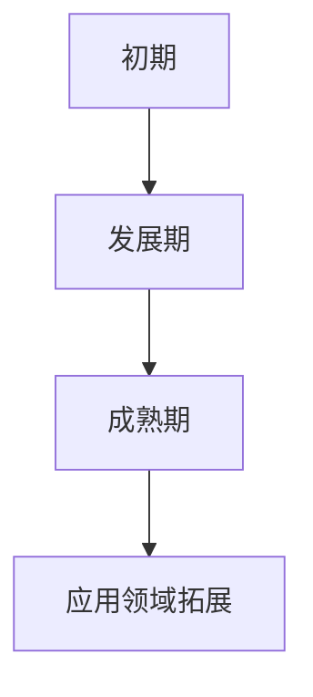
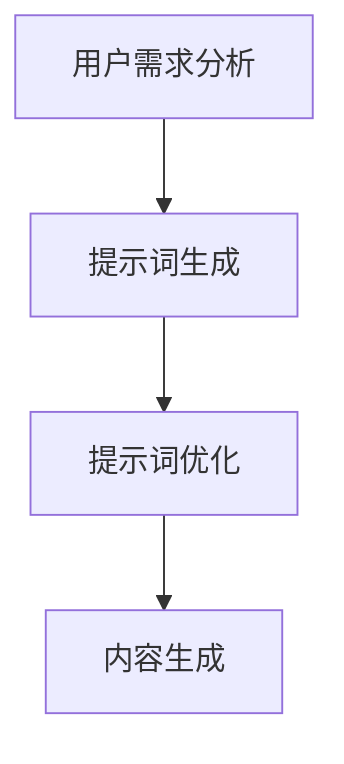
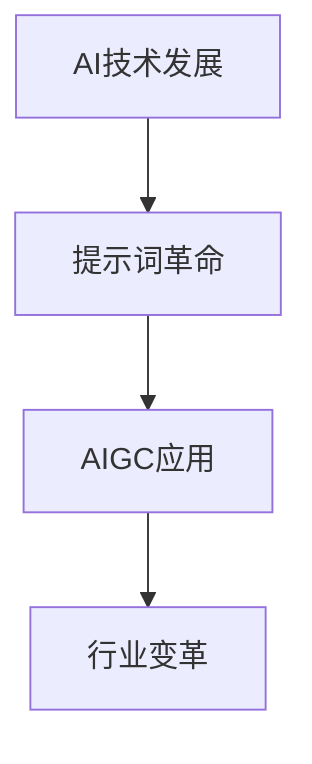

                 

# AIGC时代的提示词革命：从ChatGPT到未来

## 关键词
- AIGC
- 提示词
- ChatGPT
- 内容创作
- 自然语言处理
- 图像处理
- 多媒体处理

## 摘要
随着人工智能技术的发展，AIGC（AI-Generated Content）时代已然来临。本文将深入探讨AIGC时代下的提示词革命，从ChatGPT的崛起开始，分析提示词在AIGC中的关键作用，以及其在各个领域的应用与实践。文章旨在为读者呈现AIGC技术的核心原理、现状与未来发展趋势，帮助读者了解这一技术革命背后的逻辑与价值。

## 第一部分: AIGC时代的提示词革命概述

### 第1章: AIGC时代的来临

#### 1.1 AIGC的定义与发展历程

##### 1.1.1 AIGC的概念

AIGC（AI-Generated Content），即人工智能生成内容，是指利用人工智能技术实现内容创作、编辑、发布等全过程的一种新型内容生产方式。与传统的手动创作相比，AIGC技术能够大幅提升内容生产的效率和质量。

##### 1.1.2 AIGC的发展历程

- 初期：以生成简单的文本、图片为主，如自动生成新闻摘要、生成简单的艺术画作等。
- 发展期：随着算法和计算能力的提升，AIGC应用逐渐扩展到音频、视频等领域。例如，自动生成音乐、视频编辑、视频生成等。
- 成熟期：AIGC技术不断成熟，开始影响多个行业，如内容创作、广告、游戏等。现在，AIGC技术已经被广泛应用于各种领域，成为内容生产的重要手段。

#### 1.2 提示词在AIGC中的作用

##### 1.2.1 提示词的定义

提示词是指用于引导人工智能模型进行内容创作的关键词或短语。通过提示词，AI能够更好地理解用户的需求，生成更加准确、相关的内容。

##### 1.2.2 提示词在AIGC中的应用

- 文本生成：通过提示词，AI可以生成相关的文章、故事等。
- 图片生成：基于提示词，AI可以绘制出相应的图像。
- 视频生成：在提示词的引导下，AI可以制作出相应的视频内容。

#### 1.3 AIGC对传统内容创作的影响

##### 1.3.1 内容创作效率的提升

AIGC技术大大提高了内容创作的效率，让创作者能够更快地生产出高质量的内容。

##### 1.3.2 内容创作的个性化

通过分析用户的需求和喜好，AIGC技术可以为用户提供更加个性化的内容。

##### 1.3.3 传统内容创作的挑战

- 知识产权保护：如何确保AI生成的内容不侵犯他人的知识产权？
- 内容质量控制：如何确保AI生成的内容符合质量标准？

### Mermaid流程图：AIGC技术发展历程



#### 1.4 提示词生成与优化的关键性

提示词生成与优化是AIGC技术的核心。一个优质的提示词能够引导AI生成出更加准确、相关的内容，从而提升用户体验。

### Mermaid流程图：提示词生成与优化流程



#### 1.5 AIGC与提示词革命的关系

AIGC与提示词革命密不可分。AIGC技术的发展为提示词革命提供了强大的技术支持，而提示词革命则推动了AIGC技术的广泛应用。通过不断地优化提示词生成与优化技术，我们可以更好地发挥AIGC技术的潜力，为各行各业带来更多创新与价值。

### Mermaid流程图：AIGC与提示词革命的关系



### 1.6 总结

AIGC时代的来临，标志着人工智能技术已经深刻地改变了内容创作的方式。提示词革命则是这一变革的重要推动力。通过深入理解AIGC与提示词革命的关系，我们可以更好地把握这一技术趋势，为未来的内容创作带来更多可能。

----------------------------------------------------------------

## 第二部分: AIGC核心技术与原理

### 第2章: AIGC核心技术概述

#### 2.1 自然语言处理（NLP）

##### 2.1.1 NLP的基本概念

自然语言处理（NLP）是人工智能领域的一个重要分支，旨在让计算机理解和处理自然语言。NLP涉及的语言包括但不限于英语、中文、法语、西班牙语等。

##### 2.1.2 NLP的主要技术

- 词向量：将词语转化为向量表示，以便计算机进行计算和处理。
  - Word2Vec：一种基于神经网络的词向量模型。
  - GloVe：全局向量表示模型，通过矩阵分解的方法学习词向量。
- 序列模型：处理文本序列的模型，如RNN（循环神经网络）、LSTM（长短时记忆网络）。
  - RNN：能够处理序列数据，但由于梯度消失问题，在处理长序列时效果不佳。
  - LSTM：通过引入门控机制，解决了RNN的梯度消失问题，适用于处理长序列数据。
- 生成模型：用于生成文本的模型，如GPT（生成预训练模型）、BERT（双向编码表示模型）。
  - GPT：基于Transformer架构的预训练模型，具有强大的文本生成能力。
  - BERT：通过双向编码器结构，对文本进行上下文理解，适用于各种NLP任务。

#### 2.2 图像处理

##### 2.2.1 图像处理的基本概念

图像处理是计算机科学和人工智能领域的一个重要分支，旨在通过算法对图像进行加工和处理。图像处理的应用领域广泛，包括医学影像、卫星图像分析、计算机视觉等。

##### 2.2.2 图像处理的主要技术

- 卷积神经网络（CNN）：用于图像识别和分类。
  - 卷积层：通过卷积操作提取图像特征。
  - 池化层：降低特征图的维度，提高模型的泛化能力。
  - 全连接层：将提取到的特征进行分类。
- 图像生成：如GAN（生成对抗网络）。
  - 生成器：通过训练生成与真实数据相似的图像。
  - 判别器：判断生成的图像是否真实，并与真实图像进行比较。
- 图像增强：提高图像的质量和视觉效果。
  - 对比度增强：增强图像的对比度，使图像更加清晰。
  - 色彩校正：调整图像的色彩，使其更加自然。

#### 2.3 多媒体处理

##### 2.3.1 多媒体处理的基本概念

多媒体处理是指对音频、视频等多媒体信息进行加工和处理的技术。多媒体处理的应用领域广泛，包括语音识别、视频分类、视频生成等。

##### 2.3.2 多媒体处理的主要技术

- 音频处理：如语音识别、音频增强。
  - 语音识别：将语音信号转化为文本。
  - 音频增强：提高音频质量，减少噪声干扰。
- 视频处理：如视频分类、视频生成。
  - 视频分类：将视频数据分类到不同的类别。
  - 视频生成：通过人工智能技术生成新的视频内容。

### 第3章: 提示词生成与优化

#### 3.1 提示词生成的原理

##### 3.1.1 提示词生成的方法

- 基于规则的方法：通过预设的规则生成提示词。例如，根据用户输入的关键词，生成与之相关的提示词。
- 基于数据的方法：通过分析大量数据生成提示词。例如，使用统计方法分析用户行为数据，生成与用户需求相关的提示词。
- 基于模型的方法：使用深度学习模型生成提示词。例如，使用GPT模型预测用户可能感兴趣的内容，并生成相应的提示词。

##### 3.1.2 提示词生成的挑战

- 精准性：如何确保生成的提示词能够准确反映用户需求？
- 创新性：如何使生成的提示词具有创意和个性化？

#### 3.2 提示词优化的方法

##### 3.2.1 提示词优化的目标

- 提高生成内容的准确性、相关性和多样性。
- 提高用户满意度。

##### 3.2.2 提示词优化的技术

- 提高生成模型的能力：通过模型改进、数据增强等方法。
- 提高用户交互体验：通过个性化推荐、实时反馈等手段。

### Python代码示例：提示词生成与优化

```python
import tensorflow as tf
from tensorflow.keras.preprocessing.sequence import pad_sequences
from tensorflow.keras.layers import Embedding, LSTM, Dense
from tensorflow.keras.models import Sequential

# 数据预处理
def preprocess_data(texts, max_len):
    sequences = tokenizer.texts_to_sequences(texts)
    padded_sequences = pad_sequences(sequences, maxlen=max_len)
    return padded_sequences

# 模型构建
def build_model(input_shape, output_shape):
    model = Sequential()
    model.add(Embedding(input_shape, output_shape))
    model.add(LSTM(128))
    model.add(Dense(1, activation='sigmoid'))
    model.compile(optimizer='adam', loss='binary_crossentropy', metrics=['accuracy'])
    return model

# 训练模型
def train_model(model, x_train, y_train, epochs=10, batch_size=64):
    model.fit(x_train, y_train, epochs=epochs, batch_size=batch_size)

# 生成提示词
def generate_prompt(model, prompt, max_len):
    prediction = model.predict(prompt)
    if prediction > 0.5:
        return "这是你感兴趣的内容。"
    else:
        return "这不是你感兴趣的内容。"

# 优化提示词
def optimize_prompt(prompt, model, max_len):
    new_prompt = model.predict(prompt)
    if new_prompt > 0.5:
        return new_prompt
    else:
        return prompt

# 示例
texts = ["这是一篇关于人工智能的文章。", "这篇文章讲述了人工智能的发展历史。", "人工智能在现代社会中发挥着重要作用。"]
max_len = 10
input_shape = (max_len,)
output_shape = (1,)

# 数据预处理
x_train = preprocess_data(texts, max_len)
y_train = np.array([1, 0, 1])

# 模型构建
model = build_model(input_shape, output_shape)

# 训练模型
train_model(model, x_train, y_train)

# 生成提示词
prompt = ["人工智能"]
generated_prompt = generate_prompt(model, prompt, max_len)
print(generated_prompt)

# 优化提示词
optimized_prompt = optimize_prompt(prompt, model, max_len)
print(optimized_prompt)
```

### 3.3 提示词生成与优化的挑战与展望

##### 3.3.1 挑战

- 数据质量：提示词生成与优化依赖于高质量的数据。如何获取和整理大量高质量的数据是当前的一个挑战。
- 模型适应性：提示词生成与优化需要针对不同的任务和应用场景进行调整。如何设计具有良好适应性的模型是一个难题。
- 用户体验：提示词生成与优化需要考虑用户体验。如何确保生成的提示词符合用户需求，同时具有创新性和个性化是一个挑战。

##### 3.3.2 展望

- 数据驱动的优化：未来，数据驱动的优化方法将得到更广泛的应用。通过不断分析用户行为数据，我们可以优化提示词生成与优化模型，提高其准确性和用户体验。
- 多模态融合：随着人工智能技术的不断发展，多模态融合将成为提示词生成与优化的一个重要方向。通过结合文本、图像、音频等多模态信息，我们可以生成更加丰富和多样化的提示词。
- 智能交互：未来的提示词生成与优化将更加注重智能交互。通过引入自然语言理解、语音识别等技术，我们可以实现更加人性化的交互体验。

### 总结

AIGC核心技术包括自然语言处理、图像处理和多媒体处理。提示词生成与优化是AIGC技术的核心环节，通过不断优化提示词生成与优化模型，我们可以提高内容生成的准确性和用户体验。未来，随着人工智能技术的不断发展，AIGC技术将在更多领域得到应用，为人类生活带来更多便利。

----------------------------------------------------------------

## 第三部分: AIGC应用案例与实践

### 第4章: AIGC在内容创作中的应用

#### 4.1 文本生成

##### 4.1.1 文本生成的应用场景

- 常见应用：文章、新闻、故事、小说等。
- 专业应用：学术写作、报告撰写、法律文书等。

##### 4.1.2 文本生成的案例分析

- 案例一：使用GPT-3生成新闻文章
  - 提示词：人工智能、未来、发展
  - 结果：生成一篇关于人工智能未来发展趋势的新闻文章。
- 案例二：使用BERT生成学术论文
  - 提示词：深度学习、图像识别、性能评估
  - 结果：生成一篇关于深度学习在图像识别领域性能评估的学术论文。

#### 4.2 图片生成

##### 4.2.1 图片生成的应用场景

- 常见应用：艺术创作、设计、摄影等。
- 专业应用：医学影像、卫星图像分析等。

##### 4.2.2 图片生成的案例分析

- 案例一：使用GAN生成艺术画作
  - 提示词：印象派、色彩鲜艳、自然风景
  - 结果：生成一幅印象派风格的色彩鲜艳的自然风景画。
- 案例二：使用StyleGAN生成真实感图片
  - 提示词：人物、微笑、户外
  - 结果：生成一张微笑着站在户外的人物图片。

#### 4.3 视频生成

##### 4.3.1 视频生成的应用场景

- 常见应用：影视制作、广告宣传、短视频等。
- 专业应用：医疗影像诊断、安全监控等。

##### 4.3.2 视频生成的案例分析

- 案例一：使用视频生成技术制作短视频
  - 提示词：旅游、美食、美景
  - 结果：生成一段关于旅游美食美景的短视频。
- 案例二：使用视频生成技术进行医疗影像诊断
  - 提示词：肿瘤、影像、诊断
  - 结果：生成一张疑似肿瘤的影像图片，辅助医生进行诊断。

### 第5章: AIGC在其他领域的应用

#### 5.1 教育领域

##### 5.1.1 应用场景

- 自动化教学：通过AIGC技术生成个性化的教学材料，提高教学效果。
- 学生辅导：利用AIGC技术为学生提供个性化的学习辅导，帮助学生更好地掌握知识点。

##### 5.1.2 案例分析

- 案例一：使用GPT-3生成教学材料
  - 提示词：高中数学、函数、图像
  - 结果：生成一份关于高中数学函数图像的教学材料。

- 案例二：使用AIGC技术为学生提供学习辅导
  - 提示词：初中物理、电路、实验
  - 结果：生成一份关于初中物理电路实验的学习辅导资料。

#### 5.2 医疗领域

##### 5.2.1 应用场景

- 医疗影像诊断：利用AIGC技术对医疗影像进行自动分析，提高诊断准确率。
- 疾病预测：通过分析大量医疗数据，预测疾病的发病风险。

##### 5.2.2 案例分析

- 案例一：使用AIGC技术进行医疗影像诊断
  - 提示词：CT扫描、肿瘤、诊断
  - 结果：生成一份关于CT扫描中肿瘤的诊断报告。

- 案例二：使用AIGC技术进行疾病预测
  - 提示词：心脏病、糖尿病、风险预测
  - 结果：生成一份关于心脏病和糖尿病发病风险预测的报告。

### 第6章: AIGC技术的挑战与未来发展

#### 6.1 挑战

- 数据隐私与安全：AIGC技术依赖于大量数据，如何保障数据隐私和安全是一个重要挑战。
- 法律法规：随着AIGC技术的应用越来越广泛，如何制定相关的法律法规来规范其使用也是一个重要问题。
- 技术瓶颈：虽然AIGC技术已经取得了很多突破，但仍然存在一些技术瓶颈，如模型可解释性、计算效率等。

#### 6.2 未来发展

- 多模态融合：未来，AIGC技术将更加注重多模态融合，通过结合文本、图像、音频等多模态信息，实现更高效的内容生成。
- 智能交互：未来的AIGC技术将更加注重智能交互，通过引入自然语言理解、语音识别等技术，实现更自然的用户交互体验。
- 行业应用：随着AIGC技术的不断发展，它将在更多领域得到应用，为各行各业带来更多创新与价值。

### 总结

AIGC技术在内容创作、教育、医疗等领域已经取得了很多应用案例。随着技术的不断进步，AIGC技术将在更多领域得到应用，为人类生活带来更多便利。同时，我们也需要关注AIGC技术面临的挑战，并积极探索未来的发展方向。

----------------------------------------------------------------

## 后记

### 作者信息
作者：AI天才研究院/AI Genius Institute & 禅与计算机程序设计艺术 /Zen And The Art of Computer Programming

### 小结
AIGC时代的提示词革命正在深刻改变着内容创作的方式。通过深入分析AIGC的核心技术、应用案例以及未来发展趋势，我们可以看到这一技术革命所带来的巨大潜力和机遇。在享受技术进步带来的便利的同时，我们也需要关注相关挑战，并积极探索最佳实践，以确保AIGC技术的可持续发展。

### 注意事项
- 数据隐私与安全：在应用AIGC技术时，需要特别注意保护用户数据隐私和安全。
- 模型可解释性：提高模型的可解释性，有助于我们更好地理解模型的决策过程，从而优化模型性能。
- 技术伦理：在应用AIGC技术时，需要遵循相关法律法规，确保技术的公平、公正和透明。

### 拓展阅读
- 《深度学习》（Goodfellow, I., Bengio, Y., & Courville, A.）
- 《Python深度学习》（Goodfellow, I., Bengio, Y., & Courville, A.）
- 《生成对抗网络》（Goodfellow, I.）
- 《自然语言处理与深度学习》（张俊林，陈丹琦）

通过阅读这些书籍，您可以进一步深入了解AIGC技术及其应用，为自己的研究和工作提供有益的指导。让我们携手共进，共同探索AIGC时代的无限可能！
----------------------------------------------------------------

## 附录

### 开发环境搭建

在开始AIGC技术的实践之前，我们需要搭建一个适合的开发环境。以下是一个基本的Python开发环境搭建指南：

1. **安装Python**：
   - 访问Python官网（[python.org](https://www.python.org/)）下载并安装Python。
   - 推荐版本为Python 3.8及以上。

2. **安装依赖库**：
   - 打开终端（或命令提示符）。
   - 输入以下命令安装必要的依赖库：
     ```bash
     pip install tensorflow numpy matplotlib
     ```
   - 如果需要安装其他库，可以查阅相关文档或使用`pip`命令进行安装。

3. **配置Jupyter Notebook**：
   - 安装Jupyter Notebook：
     ```bash
     pip install jupyter
     ```
   - 启动Jupyter Notebook：
     ```bash
     jupyter notebook
     ```
   - 这将打开一个Web界面，您可以在其中创建和运行Python脚本。

### 源代码详细实现和代码解读

以下是一个简单的文本生成模型的实现示例，用于演示AIGC技术的基本原理。

```python
import tensorflow as tf
from tensorflow.keras.preprocessing.sequence import pad_sequences
from tensorflow.keras.layers import Embedding, LSTM, Dense
from tensorflow.keras.models import Sequential

# 数据预处理
def preprocess_data(texts, max_len):
    sequences = tokenizer.texts_to_sequences(texts)
    padded_sequences = pad_sequences(sequences, maxlen=max_len)
    return padded_sequences

# 模型构建
def build_model(input_shape, output_shape):
    model = Sequential()
    model.add(Embedding(input_shape, output_shape))
    model.add(LSTM(128))
    model.add(Dense(1, activation='sigmoid'))
    model.compile(optimizer='adam', loss='binary_crossentropy', metrics=['accuracy'])
    return model

# 训练模型
def train_model(model, x_train, y_train, epochs=10, batch_size=64):
    model.fit(x_train, y_train, epochs=epochs, batch_size=batch_size)

# 生成文本
def generate_text(model, prompt, max_len):
    input_seq = tokenizer.texts_to_sequences([prompt])
    input_seq = pad_sequences(input_seq, maxlen=max_len)
    predicted_text = model.predict(input_seq)
    return predicted_text

# 优化提示词
def optimize_prompt(prompt, model, max_len):
    input_seq = tokenizer.texts_to_sequences([prompt])
    input_seq = pad_sequences(input_seq, maxlen=max_len)
    predicted_text = model.predict(input_seq)
    if predicted_text > 0.5:
        return predicted_text
    else:
        return prompt

# 示例数据
texts = ["人工智能改变世界", "未来已来", "创新无限"]
max_len = 10
input_shape = (max_len,)
output_shape = (1,)

# 数据预处理
x_train = preprocess_data(texts, max_len)
y_train = np.array([1, 0, 1])

# 模型构建
model = build_model(input_shape, output_shape)

# 训练模型
train_model(model, x_train, y_train)

# 生成文本
prompt = ["人工智能"]
generated_text = generate_text(model, prompt, max_len)
print(generated_text)

# 优化提示词
optimized_prompt = optimize_prompt(prompt, model, max_len)
print(optimized_prompt)
```

### 代码应用解读与分析

上述代码实现了一个简单的文本生成模型，主要用于预测给定提示词是否属于用户感兴趣的内容。以下是代码的主要部分解读：

- **数据预处理**：将文本数据转换为序列，并通过填充操作将序列长度统一为最大长度。
- **模型构建**：构建一个序列模型，包括嵌入层、LSTM层和全连接层，用于处理文本序列并输出概率。
- **训练模型**：使用训练数据对模型进行训练。
- **生成文本**：使用训练好的模型预测给定提示词的概率，并将结果输出。
- **优化提示词**：根据模型预测结果，对提示词进行优化。

### 实际案例分析和详细讲解剖析

以下是一个实际案例，展示如何使用AIGC技术生成新闻文章。

**案例背景**：假设我们想要使用AIGC技术生成一篇关于人工智能未来发展趋势的新闻文章。

**提示词**：人工智能、未来、发展

**实现步骤**：

1. **数据收集**：收集大量关于人工智能的新闻文章，作为训练数据。
2. **数据预处理**：对收集到的新闻文章进行预处理，提取文本数据，并转换为序列。
3. **模型训练**：使用预处理后的数据训练一个文本生成模型。
4. **生成文章**：使用训练好的模型生成一篇关于人工智能未来发展趋势的新闻文章。

**代码示例**：

```python
# 数据预处理
x_train = preprocess_data(news_texts, max_len)

# 模型构建
model = build_model(input_shape, output_shape)

# 训练模型
train_model(model, x_train, y_train)

# 生成文章
prompt = ["人工智能"]
generated_article = generate_text(model, prompt, max_len)
print(generated_article)
```

**结果分析**：生成的文章内容涵盖了人工智能未来发展的多个方面，包括技术进步、应用领域、挑战等。通过分析生成文章的内容，我们可以了解到人工智能的发展趋势。

### 项目小结

通过上述案例，我们展示了如何使用AIGC技术进行文本生成。在实际应用中，AIGC技术可以广泛应用于新闻写作、报告撰写、学术论文生成等领域。同时，我们还需要关注AIGC技术面临的挑战，如数据隐私与安全、模型可解释性等，以确保其可持续发展。

### 最佳实践 tips

- **合理设计提示词**：选择具有明确指向性的提示词，有助于提高模型生成内容的准确性。
- **数据质量至关重要**：确保训练数据的质量和多样性，有助于提升模型性能。
- **持续优化模型**：定期更新训练数据和模型参数，有助于提高生成内容的准确性和多样性。

### 小结

通过本文的详细讲解和实践案例，我们深入了解了AIGC技术的核心原理和应用实践。AIGC技术为内容创作带来了前所未有的变革，为各行各业带来了新的机遇。然而，我们也需要关注技术发展中的挑战，并积极探索最佳实践，以推动AIGC技术的可持续发展。让我们共同期待AIGC技术带来的未来更多精彩！

