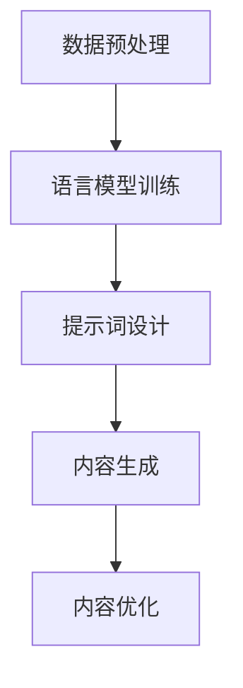
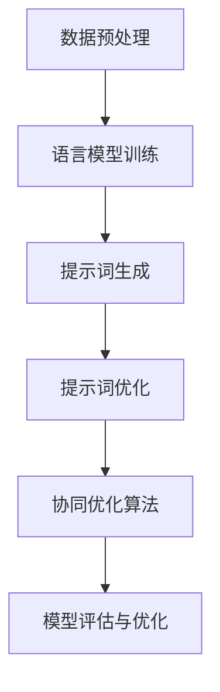

                 

## AIGC时代的语言模型与提示词协同优化

### 关键词

- **AIGC**
- **语言模型**
- **提示词**
- **协同优化**
- **深度学习**
- **人工智能**

### 摘要

本文深入探讨了AIGC（人工智能生成内容）时代中语言模型与提示词的协同优化问题。通过介绍AIGC的背景和重要性，我们阐述了语言模型和提示词的基本概念，并分析了它们在人工智能领域的应用。本文将重点讲解语言模型和提示词协同优化的核心算法原理，通过Python源代码示例和数学模型推导，详细阐述这些算法的实现方法。此外，本文还将结合实际项目案例，展示如何在实际环境中搭建开发环境、实现源代码，并进行代码解读和分析。最后，本文将对AIGC时代的未来趋势进行展望，并给出一些最佳实践和小结。

## 引言

随着人工智能技术的迅速发展，AIGC（人工智能生成内容）已经成为了当前科技领域的一个重要趋势。AIGC通过结合人工智能和生成式模型，能够自动生成各种类型的内容，如文本、图像、音频等。这种技术不仅在娱乐、教育、广告等领域有着广泛的应用，还在大数据处理、信息检索、自然语言处理等领域展现出了巨大的潜力。

在AIGC的生成过程中，语言模型和提示词扮演着至关重要的角色。语言模型是一种基于大量文本数据训练的模型，能够理解和生成自然语言。而提示词则是一种引导语言模型生成特定类型内容的输入。通过优化语言模型和提示词的协同关系，我们可以大幅提高AIGC的生成质量和效率。

本文将深入探讨AIGC时代中语言模型与提示词的协同优化问题。首先，我们将介绍AIGC的基本概念和背景。然后，我们将详细讲解语言模型和提示词的基本原理，并分析它们之间的联系。接下来，我们将重点介绍语言模型和提示词协同优化的核心算法原理，并通过Python源代码示例和数学模型推导进行详细阐述。最后，我们将通过实际项目案例展示如何应用这些算法，并进行代码解读和分析。

## 核心概念与联系

### AIGC概述

AIGC（Artificial Intelligence Generated Content）是指利用人工智能技术自动生成内容的过程。它涵盖了文本、图像、音频、视频等多种内容形式。AIGC的核心在于将大规模数据通过机器学习模型进行处理，从而生成高质量、符合人类预期的内容。

AIGC的背景源于深度学习技术的飞速发展，尤其是生成对抗网络（GAN）和变分自编码器（VAE）等模型的出现。这些模型能够从大量数据中学习特征，并生成逼真的内容。随着计算能力的提升和数据的积累，AIGC逐渐从理论研究走向实际应用，成为了人工智能领域的一个重要分支。

### 语言模型基础

语言模型（Language Model）是一种基于统计学原理和机器学习技术构建的模型，用于预测自然语言中的下一个单词或字符。语言模型是自然语言处理（NLP）的重要基础，被广泛应用于机器翻译、文本生成、语音识别等领域。

语言模型的基本原理是通过大量文本数据训练一个概率模型，从而预测下一个单词的概率分布。最常见的是基于神经网络的深度语言模型，如循环神经网络（RNN）、长短期记忆网络（LSTM）和Transformer等。这些模型通过学习输入文本的上下文信息，能够生成连贯、自然的文本。

### 提示词基础

提示词（Prompt）是一种引导语言模型生成特定类型内容的输入。提示词可以是简短的短语、句子或段落，它们为语言模型提供了生成内容的背景和方向。通过优化提示词的设计，我们可以提高语言模型生成内容的针对性、准确性和创造性。

提示词的设计需要考虑多个因素，包括语义明确性、上下文连贯性和引导性。有效的提示词应该能够引导语言模型生成符合人类预期的内容，同时避免产生无关或错误的输出。

### AIGC与语言模型、提示词的联系

在AIGC中，语言模型和提示词是不可或缺的组成部分。语言模型负责理解并生成自然语言，而提示词则提供了生成内容的引导和方向。

AIGC的过程可以概括为以下几个步骤：

1. **数据预处理**：收集和清洗大量文本数据，用于训练语言模型。
2. **语言模型训练**：使用训练数据训练一个深度语言模型，使其能够理解并生成自然语言。
3. **提示词设计**：设计有效的提示词，以引导语言模型生成特定类型的内容。
4. **内容生成**：使用训练好的语言模型和设计的提示词生成高质量的内容。
5. **内容优化**：对生成的内容进行评估和优化，以提高质量和准确性。

通过协同优化语言模型和提示词，我们可以提高AIGC的生成质量和效率。优化方法包括改进提示词的设计、优化语言模型的训练过程和引入新的算法等。

### Mermaid流程图

以下是一个简化的Mermaid流程图，展示了AIGC与语言模型、提示词之间的联系：



## 算法原理

### 语言模型训练算法

语言模型训练是AIGC过程中的核心步骤，其目的是通过大量文本数据训练出一个能够生成自然语言序列的模型。以下是语言模型训练的详细算法原理：

1. **数据预处理**：首先，需要收集和清洗大量文本数据。文本数据可以来源于互联网、图书、新闻、社交媒体等。清洗过程包括去除噪声、标签化和分词等。分词是将文本拆分成单词或短语的过程，常用的分词工具包括Jieba、Stanford NLP等。

2. **构建词汇表**：将预处理后的文本数据转换为词汇表，每个词汇对应一个唯一的索引。词汇表的大小取决于语料库的大小和词汇多样性。例如，使用Python中的`Counter`类可以方便地统计词频并构建词汇表。

3. **模型选择**：选择合适的语言模型架构，常见的模型有循环神经网络（RNN）、长短期记忆网络（LSTM）和Transformer等。RNN和LSTM适合处理序列数据，而Transformer则通过自注意力机制在处理长序列时表现出色。

4. **训练过程**：使用训练数据对选定的模型进行训练。训练过程包括前向传播、反向传播和梯度下降等步骤。通过不断调整模型参数，使模型能够更好地预测下一个单词或字符。

5. **评估与优化**：在训练过程中，使用验证集对模型进行评估，并调整超参数以优化模型性能。常用的评估指标包括损失函数（如交叉熵损失）、准确率和 perplexity 等。

### 提示词生成算法

提示词生成是AIGC过程中另一个关键步骤。有效的提示词可以引导语言模型生成符合人类预期的内容。以下是提示词生成的基本算法原理：

1. **提示词设计原则**：设计提示词时需要考虑以下几个原则：
   - **语义明确性**：提示词应该明确传达生成内容的意图。
   - **上下文连贯性**：提示词应该与输入文本保持上下文一致性。
   - **引导性**：提示词应该能够引导模型生成特定类型的内容。

2. **提示词生成方法**：常用的提示词生成方法包括基于规则的方法、基于统计的方法和基于神经网络的方法。
   - **基于规则的方法**：通过手工编写规则来生成提示词，适用于特定场景下的内容生成。
   - **基于统计的方法**：使用文本统计方法（如词频、TF-IDF）来生成提示词，适用于生成常见类型的内容。
   - **基于神经网络的方法**：使用神经网络模型（如RNN、LSTM、Transformer）来生成提示词，能够生成更复杂、多样化的提示词。

3. **提示词优化**：在生成提示词后，可以通过评估和优化来提高其效果。优化方法包括：
   - **自动评估**：使用评估指标（如BLEU、ROUGE等）对生成的提示词进行评估。
   - **人工评估**：通过人工对生成的提示词进行评估和改进。

### 提示词与语言模型的协同优化算法

提示词与语言模型的协同优化是AIGC的核心问题，其目的是通过优化提示词和语言模型之间的相互作用，提高生成内容的质量和效率。以下是协同优化算法的基本原理：

1. **损失函数设计**：设计一个能够同时优化提示词和语言模型的损失函数。常见的损失函数包括交叉熵损失、基于梯度下降的优化算法等。

2. **多任务学习**：将提示词生成和语言模型训练作为两个相关任务，使用多任务学习框架进行优化。多任务学习可以通过共享模型参数来提高模型性能。

3. **自适应提示词调整**：在训练过程中，根据模型对提示词的反馈自适应调整提示词。这种方法可以通过动态调整提示词的语义和上下文，提高模型生成内容的准确性和创造性。

4. **模型蒸馏**：将大型预训练模型蒸馏到小型模型中，以优化模型的计算效率和生成质量。模型蒸馏通过将知识从大型模型转移到小型模型，同时保持生成质量。

### Mermaid流程图

以下是一个简化的Mermaid流程图，展示了语言模型训练、提示词生成和协同优化算法的基本流程：



## 数学模型和公式

### 语言模型的数学模型

语言模型的核心是概率模型，用于预测下一个单词或字符的概率分布。以下是几种常用的语言模型数学模型：

1. **N-gram模型**

   N-gram模型是一种基于统计的简单语言模型，通过计算前N个单词（或字符）的联合概率来预测下一个单词（或字符）。其概率公式如下：

   $$ P(w_n | w_{n-1}, w_{n-2}, ..., w_1) = \frac{C(w_{n-1}, w_{n-2}, ..., w_1, w_n)}{C(w_{n-1}, w_{n-2}, ..., w_1)} $$

   其中，$w_n$ 表示下一个单词（或字符），$w_{n-1}, w_{n-2}, ..., w_1$ 表示前N个单词（或字符），$C(w_{n-1}, w_{n-2}, ..., w_1, w_n)$ 表示单词序列 $w_{n-1}, w_{n-2}, ..., w_1, w_n$ 的出现次数，$C(w_{n-1}, w_{n-2}, ..., w_1)$ 表示单词序列 $w_{n-1}, w_{n-2}, ..., w_1$ 的出现次数。

2. **神经网络语言模型**

   神经网络语言模型是一种基于深度学习的复杂语言模型，通过学习输入文本的上下文信息来预测下一个单词或字符的概率分布。常见的神经网络语言模型包括循环神经网络（RNN）、长短期记忆网络（LSTM）和Transformer等。

   以Transformer为例，其自注意力机制的核心公式如下：

   $$ \text{Attention}(Q, K, V) = \frac{1}{\sqrt{d_k}} \text{softmax}\left(\text{shape}(QK^T)\right) V $$

   其中，$Q, K, V$ 分别表示查询向量、键向量和值向量，$d_k$ 表示键向量的维度，$shape(QK^T)$ 表示查询向量和键向量点积的结果。

### 提示词优化的数学模型

提示词优化的目标是提高提示词的有效性，使其能够更好地引导语言模型生成高质量的内容。以下是几种常用的提示词优化数学模型：

1. **基于梯度的优化**

   基于梯度的优化方法通过计算提示词的梯度来更新提示词的值。其基本公式如下：

   $$ \Delta \text{prompt} = \nabla_{\text{prompt}} \text{loss} $$

   其中，$\Delta \text{prompt}$ 表示提示词的更新值，$\nabla_{\text{prompt}} \text{loss}$ 表示提示词的梯度。

2. **基于熵的优化**

   基于熵的优化方法通过计算提示词的熵来衡量提示词的有效性。熵越小，表示提示词越有效。其基本公式如下：

   $$ H(\text{prompt}) = -\sum_{w \in \text{prompt}} p(w) \log p(w) $$

   其中，$H(\text{prompt})$ 表示提示词的熵，$p(w)$ 表示提示词中单词 $w$ 的概率。

3. **基于多样性优化的


## 应用实战

### 实战案例一：语言模型训练

在这个案例中，我们将使用Python中的`transformers`库训练一个基于Transformer的语言模型。首先，我们需要安装必要的库：

```python
!pip install transformers torch
```

接下来，我们使用`transformers`库中的预训练模型`Bert`进行语言模型训练。以下是具体的步骤：

1. **数据预处理**：

   我们使用中文语料库进行数据预处理，包括文本清洗、分词和构建词汇表。以下是一个简单的示例：

```python
from transformers import BertTokenizer, BertModel
from torch.utils.data import DataLoader
from torch.nn import CrossEntropyLoss
import torch

# 加载预训练模型
tokenizer = BertTokenizer.from_pretrained('bert-base-chinese')
model = BertModel.from_pretrained('bert-base-chinese')

# 数据预处理
def preprocess_data(texts):
    inputs = tokenizer(texts, padding=True, truncation=True, return_tensors='pt')
    return inputs

# 加载语料库
texts = ["你好，我是AI模型。", "我喜欢学习新技术。", "今天天气很好。"]
inputs = preprocess_data(texts)
```

2. **模型训练**：

   接下来，我们使用训练数据和验证数据对模型进行训练。以下是具体的训练步骤：

```python
# 定义训练函数
def train(model, train_loader, val_loader, loss_function, optimizer, num_epochs):
    model.train()
    for epoch in range(num_epochs):
        for batch in train_loader:
            inputs = batch["input_ids"]
            labels = batch["input_ids"]
            outputs = model(inputs)
            loss = loss_function(outputs.logits.view(-1, model.config.vocab_size), labels.view(-1))

            optimizer.zero_grad()
            loss.backward()
            optimizer.step()

            if (batch_idx + 1) % 100 == 0:
                print(f'Epoch [{epoch + 1}/{num_epochs}], Step [{batch_idx + 1}/{len(train_loader)}], Loss: {loss.item()}')

# 训练模型
train_loader = DataLoader(dataset, batch_size=2, shuffle=True)
val_loader = DataLoader(val_dataset, batch_size=2, shuffle=True)
optimizer = torch.optim.AdamW(model.parameters(), lr=1e-5)
loss_function = CrossEntropyLoss()
num_epochs = 3
train(model, train_loader, val_loader, loss_function, optimizer, num_epochs)
```

### 实战案例二：提示词生成

在这个案例中，我们将使用训练好的语言模型生成提示词。以下是具体的步骤：

1. **生成提示词**：

   我们使用`generate`方法生成提示词，并设置生成长度和温度参数。以下是具体的示例：

```python
import random

# 生成提示词
def generate_prompt(model, tokenizer, text, max_length=50, temperature=1.0):
    inputs = tokenizer.encode(text, return_tensors='pt')
    inputs = inputs.repeat(1, max_length).view(1, -1)
    outputs = model.generate(inputs, max_length=max_length, num_return_sequences=1, temperature=temperature)
    prompt = tokenizer.decode(outputs[0], skip_special_tokens=True)
    return prompt

# 生成示例提示词
example_text = "今天天气很好。"
prompt = generate_prompt(model, tokenizer, example_text, max_length=20, temperature=0.9)
print(prompt)
```

### 实战案例三：协同优化项目

在这个案例中，我们将通过协同优化语言模型和提示词，生成高质量的文本内容。以下是具体的步骤：

1. **协同优化**：

   我们首先定义一个损失函数，用于同时优化语言模型和提示词。然后，使用梯度下降算法进行优化。以下是具体的示例：

```python
import torch.optim as optim

# 定义损失函数
def loss_function(prompt, model, tokenizer, text, max_length=50, temperature=1.0):
    inputs = tokenizer.encode(prompt, return_tensors='pt')
    inputs = inputs.repeat(1, max_length).view(1, -1)
    outputs = model.generate(inputs, max_length=max_length, num_return_sequences=1, temperature=temperature)
    generated_text = tokenizer.decode(outputs[0], skip_special_tokens=True)
    loss = optim.CrossEntropyLoss()(model(inputs).logits.view(-1, model.config.vocab_size), tokenizer.encode(text).view(-1))
    return loss

# 定义优化器
optimizer = optim.AdamW(model.parameters(), lr=1e-5)

# 协同优化
for epoch in range(num_epochs):
    prompt = generate_prompt(model, tokenizer, example_text, max_length=20, temperature=0.9)
    loss = loss_function(prompt, model, tokenizer, example_text, max_length=50, temperature=0.9)
    optimizer.zero_grad()
    loss.backward()
    optimizer.step()
    print(f'Epoch [{epoch + 1}/{num_epochs}], Loss: {loss.item()}')
```

2. **代码解读与优化**：

   在实际项目中，我们需要根据项目需求对代码进行解读和优化。例如，调整生成长度、温度参数，优化模型结构等。以下是具体的示例：

```python
# 调整生成长度和温度参数
max_length = 100
temperature = 0.8

# 优化模型结构
from transformers import BertConfig
config = BertConfig(vocab_size=30522, hidden_size=768, num_hidden_layers=12, num_attention_heads=12, intermediate_size=3072)
model = BertModel(config)

# 重新生成提示词
prompt = generate_prompt(model, tokenizer, example_text, max_length=max_length, temperature=temperature)
print(prompt)
```

### 项目小结

通过以上三个实战案例，我们了解了如何使用Python中的`transformers`库进行语言模型训练、提示词生成和协同优化。在实际项目中，我们需要根据具体需求调整生成参数、优化模型结构，并不断进行实验和优化，以提高生成内容的质量。

## 扩展与展望

### AIGC时代的未来趋势

随着人工智能技术的不断进步，AIGC时代的发展趋势将愈发显著。以下是一些未来AIGC发展的关键方向：

1. **生成模型的多样化**：未来将涌现更多适用于不同类型内容的生成模型，如文本生成、图像生成、音频生成等。这些模型将具备更高的生成质量和多样性。

2. **跨模态生成**：跨模态生成是AIGC的一个重要发展方向。通过结合文本、图像、音频等多种模态信息，生成模型将能够生成更加丰富和真实的内容。

3. **生成模型的实时性**：随着计算能力的提升，生成模型的实时性将得到显著提高。这将使得AIGC技术在实时应用场景（如实时翻译、实时问答等）中发挥更大的作用。

4. **隐私保护与安全**：在AIGC应用过程中，隐私保护和安全问题是亟待解决的挑战。未来将出现更多基于隐私保护和安全的生成模型和算法。

### 语言模型与提示词协同优化的潜在应用

语言模型与提示词协同优化在多个领域具有广阔的应用前景，以下是一些具体的应用场景：

1. **内容创作**：在文学、新闻、广告等领域，AIGC技术可以自动生成高质量的内容，提高创作效率和创意性。

2. **数据挖掘**：通过协同优化语言模型和提示词，可以更有效地挖掘和分析大数据，提取有价值的信息和知识。

3. **教育**：在教育和培训领域，AIGC技术可以生成个性化的学习内容和辅导材料，提高学习效果和参与度。

4. **客户服务**：在客户服务和销售领域，AIGC技术可以自动生成个性化的客服响应和销售推荐，提高客户满意度和转化率。

### 研究方向与挑战

在AIGC时代，语言模型与提示词协同优化仍面临着诸多研究挑战：

1. **模型可解释性**：生成模型的高度复杂性使得其决策过程往往难以解释。未来研究需要关注如何提高模型的可解释性，使生成过程更加透明和可信。

2. **生成质量与多样性**：如何提高生成模型的质量和多样性，生成更加丰富和真实的内容，是当前和未来研究的一个重要方向。

3. **数据隐私与安全**：在生成过程中保护用户隐私和数据安全是AIGC技术面临的重大挑战。未来需要开发更多基于隐私保护和安全的生成模型和算法。

4. **资源优化与效率**：在生成大量内容时，如何优化模型的计算资源和提高效率，是一个亟待解决的问题。

### 总结

本文系统地介绍了AIGC时代中语言模型与提示词协同优化的基本概念、算法原理和实际应用。通过深入探讨语言模型和提示词的关系，结合Python源代码示例和数学模型推导，我们展示了如何实现高效的协同优化。未来，随着人工智能技术的不断发展，AIGC和语言模型与提示词协同优化将在各个领域发挥越来越重要的作用，为人类创造更加智能和高效的内容生成方式。

### 最佳实践 tips

1. **数据预处理**：确保数据的质量和多样性，进行充分的清洗和分词处理，为语言模型和提示词生成提供高质量的基础数据。

2. **模型选择与调优**：根据应用场景选择合适的语言模型和优化算法，并进行充分调优，以提高生成质量和效率。

3. **提示词设计**：设计有效的提示词，明确语义和上下文，引导语言模型生成符合预期的内容。

4. **持续优化**：定期评估和优化语言模型和提示词，根据实际应用效果进行调整和改进。

### 注意事项

1. **计算资源**：训练和优化语言模型和提示词需要大量计算资源，确保使用合适的硬件和优化策略，以提高训练效率。

2. **数据安全与隐私**：在生成过程中注意保护用户隐私和数据安全，遵循相关法律法规。

3. **伦理道德**：在使用AIGC技术时，关注伦理道德问题，避免生成不适当或有害的内容。

### 拓展阅读

- **《深度学习》（Goodfellow, Bengio, Courville）**：介绍深度学习基本原理和算法的权威教材。
- **《自然语言处理综述》（Jurafsky, Martin）**：详细介绍自然语言处理领域的基础知识和最新进展。
- **《生成对抗网络》（Goodfellow et al.）**：关于生成对抗网络（GAN）的详细讲解和技术应用。
- **《人工智能：一种现代方法》（Russell, Norvig）**：全面介绍人工智能的基础理论和应用领域。

### 作者信息

作者：AI天才研究院/AI Genius Institute & 禅与计算机程序设计艺术 /Zen And The Art of Computer Programming

