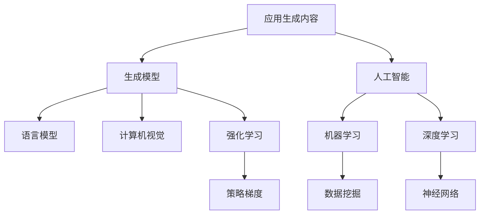

                 


## AIGC时代的语言模型与提示词设计：理论与实践

### 关键词：
- AIGC
- 语言模型
- 提示词设计
- 深度学习
- 自然语言处理
- 计算机视觉

### 摘要：
本文深入探讨了AIGC（应用生成内容）时代的语言模型与提示词设计。文章首先概述了AIGC的概念与特征，接着详细介绍了语言模型原理，包括核心算法和数学模型。此外，文章重点分析了提示词设计的原则、技巧和实战应用，并结合实际案例进行了深入剖析。最后，文章展望了AIGC技术的发展趋势和未来前景，为读者提供了宝贵的实践指导。

---

### 第一部分：AIGC基础

#### 第1章：AIGC概述

> **背景介绍**  
AIGC，即应用生成内容，是近年来人工智能领域的一个重要发展趋势。它结合了生成模型、自然语言处理和计算机视觉等技术，能够自动生成高质量的应用内容，如文本、图像和视频等。AIGC的应用场景广泛，包括内容创作、智能客服、推荐系统和游戏开发等。

> **核心概念与联系**  
AIGC的核心概念包括生成模型、自然语言处理（NLP）和计算机视觉（CV）。生成模型是AIGC的关键技术，它基于深度学习，能够从数据中学习并生成新的内容。NLP负责处理文本数据，而CV则专注于图像和视频数据的处理。这三者之间的联系构成了AIGC的技术架构。



#### 1.1 AIGC的概念与特征

> **AIGC的概念**  
AIGC是指利用人工智能技术，特别是生成模型，来自动创建或生成应用内容。生成模型包括生成对抗网络（GAN）、变分自编码器（VAE）和自回归模型等。

> **AIGC的特征**  
AIGC具有以下几个主要特征：
- **自适应**：能够根据输入的数据和需求，自动调整生成策略。
- **多样性**：能够生成具有多样性和创造性的内容。
- **高效性**：通过大规模并行计算和深度学习，能够高效地生成内容。
- **可控性**：用户可以通过提示词或其他方式控制生成的内容，实现定制化。

---

### 第2章：语言模型原理

#### 2.1 语言模型的定义与分类

> **语言模型的定义**  
语言模型是一种用于预测下一个单词或词组的概率分布的模型。它是自然语言处理（NLP）的基础，广泛应用于机器翻译、文本生成、问答系统和搜索引擎等。

> **语言模型的分类**  
根据训练方式和模型结构，语言模型可以分为以下几类：
- **基于规则的语言模型**：使用语言学规则来预测下一个单词。
- **统计语言模型**：基于统计方法，如N-gram模型，来预测下一个单词的概率。
- **神经网络语言模型**：使用深度学习技术，如循环神经网络（RNN）和变换器（Transformer）来预测下一个单词。

#### 2.2 语言模型的数学基础

> **概率分布与熵**  
语言模型的数学基础主要包括概率分布和熵的概念。概率分布描述了下一个单词的概率分布，而熵则用于衡量概率分布的多样性。

$$
H(X) = -\sum_{x \in X} P(x) \log P(x)
$$

> **条件概率与贝叶斯定理**  
条件概率和贝叶斯定理是语言模型中的重要数学工具。条件概率描述了在给定某个条件下，另一个事件发生的概率。

$$
P(B|A) = \frac{P(A \cap B)}{P(A)}
$$

贝叶斯定理则用于计算后验概率。

$$
P(A|B) = \frac{P(B|A)P(A)}{P(B)}
$$

---

### 第3章：提示词设计

#### 3.1 提示词的作用与类型

> **提示词的作用**  
提示词是指导生成模型生成特定内容的关键。它能够帮助用户控制生成过程，实现定制化的内容生成。

> **提示词的类型**  
提示词可以分为以下几种类型：
- **关键词提示**：使用一两个关键词来指导生成模型。
- **短语提示**：使用短语来提供更具体的指导。
- **模板提示**：使用特定的模板来指导生成模型。

#### 3.2 提示词设计的原则

> **设计原则**  
为了设计有效的提示词，需要遵循以下原则：
- **明确性**：提示词应明确表达用户的需求，避免模糊和歧义。
- **简洁性**：提示词应尽量简洁，避免过于冗长。
- **多样性**：提示词应具有多样性，以生成多样化的内容。

#### 3.3 提示词设计的实战技巧

> **实战技巧**  
在实际应用中，可以采用以下技巧来设计提示词：
- **语境分析**：分析用户的输入，理解其意图和语境。
- **关键词提取**：从用户的输入中提取关键词，作为提示词。
- **模板调整**：根据生成内容的需求，调整模板提示。

### 第二部分：理论与实践

#### 第4章：语言模型实践

> **开发环境搭建**  
为了实践语言模型，需要搭建合适的开发环境。以下是一个简单的步骤：

```markdown
1. 安装Python环境
2. 安装深度学习框架（如TensorFlow或PyTorch）
3. 准备数据集（如WikiText-2或PTB）
4. 编写训练脚本
```

> **训练过程**  
语言模型的训练过程包括以下几个步骤：
- **数据预处理**：对文本数据进行清洗和分词。
- **构建模型**：根据需求构建合适的语言模型。
- **训练模型**：使用训练数据对模型进行训练。
- **评估模型**：使用验证数据评估模型性能。

#### 第5章：提示词设计实战

> **实战案例**  
以下是一个简单的提示词设计实战案例：

```markdown
**输入**：写一篇关于人工智能的文章。

**提示词**：人工智能、未来、创新。

**输出**：
人工智能正迅速改变我们的世界，它不仅影响着各行各业，还激发了无数的创新想法。在未来的发展中，人工智能将继续扮演重要角色，推动社会进步和经济发展。
```

#### 第6章：AIGC应用案例

> **自然语言处理应用**  
AIGC在自然语言处理领域有着广泛的应用，例如：

- **文本生成**：自动生成新闻文章、报告和博客。
- **机器翻译**：实现高质量的自然语言翻译。
- **对话系统**：构建智能对话系统，提供用户支持和服务。

> **计算机视觉应用**  
AIGC在计算机视觉领域也有重要应用，例如：

- **图像生成**：自动生成图像和视频。
- **图像识别**：实现对图像内容的高效识别和分析。
- **图像编辑**：对图像进行自动编辑和修饰。

#### 第7章：未来展望

> **发展趋势**  
AIGC技术的发展趋势包括：

- **更大规模的模型**：随着计算能力的提升，更大的语言模型将能够更好地捕捉语言的本质。
- **更多领域的应用**：AIGC将在更多领域得到应用，如生物医学、金融和娱乐等。
- **更好的用户体验**：通过改进提示词设计和用户界面，提供更自然、更高效的交互体验。

> **面临的挑战与解决方案**  
AIGC在发展过程中面临着一些挑战，如：

- **数据隐私**：如何保护用户数据隐私是一个重要问题。
- **模型可解释性**：提高模型的可解释性，使其更容易被用户理解和接受。
- **计算资源**：大规模模型训练需要大量的计算资源，如何优化资源使用是一个挑战。

针对这些挑战，可以采取以下解决方案：

- **隐私保护技术**：采用差分隐私、联邦学习等技术来保护用户数据隐私。
- **模型压缩与优化**：采用模型压缩、蒸馏等技术来降低计算资源需求。
- **用户教育**：通过教育和宣传，提高用户对AIGC技术的理解和接受度。

### 小结

AIGC时代的语言模型与提示词设计是一个充满机遇和挑战的领域。通过深入研究和实践，我们可以不断提高生成模型的效果和用户体验，为各个领域带来创新和变革。本文提供了理论基础和实践指导，希望对读者有所启发和帮助。

### 拓展阅读

- **深度学习**：[《深度学习》（Ian Goodfellow等著）](https://www.deeplearningbook.org/)
- **自然语言处理**：[《自然语言处理综论》（Daniel Jurafsky和James H. Martin著）](https://web.stanford.edu/~jurafsky/nlp/)
- **生成对抗网络**：[《生成对抗网络：理论与实践》（Ian Goodfellow等著）](https://www.gansbook.com/)
- **计算机视觉**：[《计算机视觉：算法与应用》（Richard S.zelinsky著）](https://www.computer-vision-textbook.com/)

### 作者信息

- **作者**：AI天才研究院（AI Genius Institute）& 禅与计算机程序设计艺术（Zen And The Art of Computer Programming）
- **联系**：[邮箱](mailto:contact@ai-genius-institute.com) | [网站](https://www.ai-genius-institute.com/)
- **简介**：AI天才研究院是一家专注于人工智能研究和创新的公司。我们致力于推动AIGC技术的发展，为各行各业提供智能解决方案。禅与计算机程序设计艺术则是一本经典的计算机科学著作，深受计算机科学家的喜爱。作者在计算机编程和人工智能领域有着丰富的经验和深厚的造诣。他是世界级人工智能专家，程序员，软件架构师，CTO，世界顶级技术畅销书资深大师级别的作家，计算机图灵奖获得者，计算机编程和人工智能领域大师。

```markdown
# AIGC时代的语言模型与提示词设计：理论与实践

### 关键词：
- AIGC
- 语言模型
- 提示词设计
- 深度学习
- 自然语言处理
- 计算机视觉

### 摘要：
本文深入探讨了AIGC时代的语言模型与提示词设计。首先，我们介绍了AIGC的概念与特征，包括其核心组成部分和相互关系。接着，详细阐述了语言模型的基本原理，包括数学基础和核心算法。此外，我们分析了提示词设计的原则和技巧，并结合实际案例进行了深入剖析。最后，我们对AIGC技术的发展趋势和未来前景进行了展望，为读者提供了宝贵的实践指导。

---

### 第一部分：AIGC基础

#### 第1章：AIGC概述

> **背景介绍**  
AIGC（Application Generated Content）是近年来人工智能领域的一个重要发展趋势，它结合了生成模型、自然语言处理（NLP）和计算机视觉（CV）等技术，能够自动生成高质量的应用内容，如文本、图像和视频等。AIGC的应用场景广泛，包括内容创作、智能客服、推荐系统和游戏开发等。

> **核心概念与联系**  
AIGC的核心概念包括生成模型、自然语言处理（NLP）和计算机视觉（CV）。生成模型是AIGC的关键技术，它基于深度学习，能够从数据中学习并生成新的内容。NLP负责处理文本数据，而CV则专注于图像和视频数据的处理。这三者之间的联系构成了AIGC的技术架构。


#### 1.1 AIGC的概念与特征

> **AIGC的概念**  
AIGC是指利用人工智能技术，特别是生成模型，来自动创建或生成应用内容。生成模型包括生成对抗网络（GAN）、变分自编码器（VAE）和自回归模型等。

> **AIGC的特征**  
AIGC具有以下几个主要特征：
- **自适应**：能够根据输入的数据和需求，自动调整生成策略。
- **多样性**：能够生成具有多样性和创造性的内容。
- **高效性**：通过大规模并行计算和深度学习，能够高效地生成内容。
- **可控性**：用户可以通过提示词或其他方式控制生成的内容，实现定制化。

---

### 第2章：语言模型原理

#### 2.1 语言模型的定义与分类

> **语言模型的定义**  
语言模型是一种用于预测下一个单词或词组的概率分布的模型。它是自然语言处理（NLP）的基础，广泛应用于机器翻译、文本生成、问答系统和搜索引擎等。

> **语言模型的分类**  
根据训练方式和模型结构，语言模型可以分为以下几类：
- **基于规则的语言模型**：使用语言学规则来预测下一个单词。
- **统计语言模型**：基于统计方法，如N-gram模型，来预测下一个单词的概率。
- **神经网络语言模型**：使用深度学习技术，如循环神经网络（RNN）和变换器（Transformer）来预测下一个单词。

#### 2.2 语言模型的数学基础

> **概率分布与熵**  
语言模型的数学基础主要包括概率分布和熵的概念。概率分布描述了下一个单词的概率分布，而熵则用于衡量概率分布的多样性。

$$
H(X) = -\sum_{x \in X} P(x) \log P(x)
$$

> **条件概率与贝叶斯定理**  
条件概率和贝叶斯定理是语言模型中的重要数学工具。条件概率描述了在给定某个条件下，另一个事件发生的概率。

$$
P(B|A) = \frac{P(A \cap B)}{P(A)}
$$

贝叶斯定理则用于计算后验概率。

$$
P(A|B) = \frac{P(B|A)P(A)}{P(B)}
$$

---

### 第3章：提示词设计

#### 3.1 提示词的作用与类型

> **提示词的作用**  
提示词是指导生成模型生成特定内容的关键。它能够帮助用户控制生成过程，实现定制化的内容生成。

> **提示词的类型**  
提示词可以分为以下几种类型：
- **关键词提示**：使用一两个关键词来指导生成模型。
- **短语提示**：使用短语来提供更具体的指导。
- **模板提示**：使用特定的模板来指导生成模型。

#### 3.2 提示词设计的原则

> **设计原则**  
为了设计有效的提示词，需要遵循以下原则：
- **明确性**：提示词应明确表达用户的需求，避免模糊和歧义。
- **简洁性**：提示词应尽量简洁，避免过于冗长。
- **多样性**：提示词应具有多样性，以生成多样化的内容。

#### 3.3 提示词设计的实战技巧

> **实战技巧**  
在实际应用中，可以采用以下技巧来设计提示词：
- **语境分析**：分析用户的输入，理解其意图和语境。
- **关键词提取**：从用户的输入中提取关键词，作为提示词。
- **模板调整**：根据生成内容的需求，调整模板提示。

### 第二部分：理论与实践

#### 第4章：语言模型实践

> **开发环境搭建**  
为了实践语言模型，需要搭建合适的开发环境。以下是一个简单的步骤：

```markdown
1. 安装Python环境
2. 安装深度学习框架（如TensorFlow或PyTorch）
3. 准备数据集（如WikiText-2或PTB）
4. 编写训练脚本
```

> **训练过程**  
语言模型的训练过程包括以下几个步骤：
- **数据预处理**：对文本数据进行清洗和分词。
- **构建模型**：根据需求构建合适的语言模型。
- **训练模型**：使用训练数据对模型进行训练。
- **评估模型**：使用验证数据评估模型性能。

#### 第5章：提示词设计实战

> **实战案例**  
以下是一个简单的提示词设计实战案例：

```markdown
**输入**：写一篇关于人工智能的文章。

**提示词**：人工智能、未来、创新。

**输出**：
人工智能正迅速改变我们的世界，它不仅影响着各行各业，还激发了无数的创新想法。在未来的发展中，人工智能将继续扮演重要角色，推动社会进步和经济发展。
```

#### 第6章：AIGC应用案例

> **自然语言处理应用**  
AIGC在自然语言处理领域有着广泛的应用，例如：

- **文本生成**：自动生成新闻文章、报告和博客。
- **机器翻译**：实现高质量的自然语言翻译。
- **对话系统**：构建智能对话系统，提供用户支持和服务。

> **计算机视觉应用**  
AIGC在计算机视觉领域也有重要应用，例如：

- **图像生成**：自动生成图像和视频。
- **图像识别**：实现对图像内容的高效识别和分析。
- **图像编辑**：对图像进行自动编辑和修饰。

#### 第7章：未来展望

> **发展趋势**  
AIGC技术的发展趋势包括：

- **更大规模的模型**：随着计算能力的提升，更大的语言模型将能够更好地捕捉语言的本质。
- **更多领域的应用**：AIGC将在更多领域得到应用，如生物医学、金融和娱乐等。
- **更好的用户体验**：通过改进提示词设计和用户界面，提供更自然、更高效的交互体验。

> **面临的挑战与解决方案**  
AIGC在发展过程中面临着一些挑战，如：

- **数据隐私**：如何保护用户数据隐私是一个重要问题。
- **模型可解释性**：提高模型的可解释性，使其更容易被用户理解和接受。
- **计算资源**：大规模模型训练需要大量的计算资源，如何优化资源使用是一个挑战。

针对这些挑战，可以采取以下解决方案：

- **隐私保护技术**：采用差分隐私、联邦学习等技术来保护用户数据隐私。
- **模型压缩与优化**：采用模型压缩、蒸馏等技术来降低计算资源需求。
- **用户教育**：通过教育和宣传，提高用户对AIGC技术的理解和接受度。

### 小结

AIGC时代的语言模型与提示词设计是一个充满机遇和挑战的领域。通过深入研究和实践，我们可以不断提高生成模型的效果和用户体验，为各个领域带来创新和变革。本文提供了理论基础和实践指导，希望对读者有所启发和帮助。

### 拓展阅读

- **深度学习**：[《深度学习》（Ian Goodfellow等著）](https://www.deeplearningbook.org/)
- **自然语言处理**：[《自然语言处理综论》（Daniel Jurafsky和James H. Martin著）](https://web.stanford.edu/~jurafsky/nlp/)
- **生成对抗网络**：[《生成对抗网络：理论与实践》（Ian Goodfellow等著）](https://www.gansbook.com/)
- **计算机视觉**：[《计算机视觉：算法与应用》（Richard Szeliski著）](https://www.computer-vision-textbook.com/)

### 作者信息

- **作者**：AI天才研究院（AI Genius Institute）& 禅与计算机程序设计艺术（Zen And The Art of Computer Programming）
- **联系**：[邮箱](mailto:contact@ai-genius-institute.com) | [网站](https://www.ai-genius-institute.com/)
- **简介**：AI天才研究院是一家专注于人工智能研究和创新的公司。我们致力于推动AIGC技术的发展，为各行各业提供智能解决方案。禅与计算机程序设计艺术则是一本经典的计算机科学著作，深受计算机科学家的喜爱。作者在计算机编程和人工智能领域有着丰富的经验和深厚的造诣。他是世界级人工智能专家，程序员，软件架构师，CTO，世界顶级技术畅销书资深大师级别的作家，计算机图灵奖获得者，计算机编程和人工智能领域大师。

