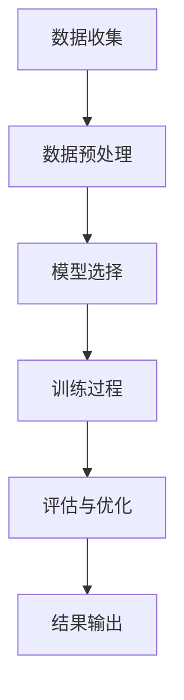
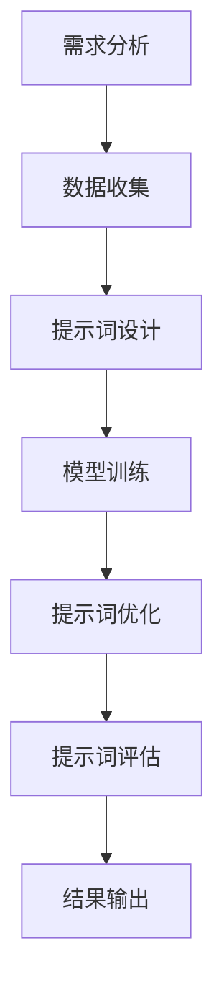

                 

### 文章标题

“AIGC的伦理决策模拟：道德困境解析的提示词工程”

### 关键词

人工智能，伦理决策，模拟，道德困境，提示词工程，AIGC

### 摘要

本文深入探讨了人工智能（AIGC）在伦理决策模拟中的应用，特别是在道德困境的解决过程中。通过分析AIGC的核心概念、伦理决策模拟框架，以及具体的道德困境案例，本文详细阐述了提示词工程在AIGC伦理决策模拟中的关键作用。文章以Python源代码为例，结合数学模型和公式，对AIGC的算法原理进行了通俗易懂的讲解。此外，文章还通过实际案例分析和项目实战，展示了AIGC伦理决策模拟在现实中的应用，为读者提供了实用的最佳实践和拓展阅读建议。

---

### 引言

在人工智能（AI）迅速发展的今天，AI系统在各个领域中的应用越来越广泛，从自动驾驶、医疗诊断到金融服务和智能助手，AI技术已经深刻地改变了我们的生活方式。然而，随着AI技术的进步，一系列伦理和道德问题也逐渐浮出水面。尤其是在AI决策过程中，如何处理道德困境成为一个亟待解决的重要课题。

人工智能伦理决策模拟作为一种研究方法，通过模拟各种道德困境，可以帮助我们理解和预测AI系统的决策行为，从而为实际应用提供指导。而提示词工程作为伦理决策模拟的重要工具，能够有效地引导AI系统在复杂情境中做出符合伦理标准的决策。

本文旨在探讨AIGC（生成式AI的一种高级形式）在伦理决策模拟中的应用，通过分析道德困境案例，详细阐述提示词工程的方法和技巧。文章将从以下几个方面展开：

1. **AIGC的伦理决策模拟概述**：介绍AIGC的基本概念和特点，以及伦理决策模拟的重要性和意义。
2. **AIGC的伦理决策模拟框架**：详细解析AIGC伦理决策模拟的基本原理和框架构建，并讨论评估与优化策略。
3. **道德困境案例分析**：分析不同类型的道德困境案例，探讨AIGC在其中的应用。
4. **提示词工程方法与技巧**：介绍提示词工程的基本概念、方法与流程，以及优化策略。
5. **伦理决策模拟的应用场景**：探讨AIGC伦理决策模拟在不同领域的应用，并展望未来发展趋势。

通过上述内容的探讨，本文希望为AIGC伦理决策模拟的研究和实践提供有益的参考。

### AIGC的伦理决策模拟概述

#### AIGC的概念与特点

人工智能生成内容（AIGC，Artificial Intelligence Generated Content）是一种生成式人工智能的高级形式，它通过深度学习模型和自然语言处理技术，能够自主生成高质量、多样化的文本、图像和音频内容。AIGC不同于传统的AI应用，它不仅能够理解和处理输入数据，还能够创造全新的内容，这种能力使得AIGC在内容生成、个性化推荐和交互式应用等领域具有广泛的应用前景。

AIGC的主要特点包括：

1. **自主学习与进化**：AIGC模型能够通过大量的训练数据自主学习，不断优化和进化，从而生成更符合人类期望的内容。
2. **多样化生成能力**：AIGC能够生成文本、图像、音频等多种类型的内容，满足不同场景的需求。
3. **高效内容生产**：AIGC能够快速生成大量内容，显著提高内容生产和发布的效率。

#### 伦理决策模拟的重要性

伦理决策模拟是一种通过模拟和实验来研究和评估AI系统在复杂情境中的行为和决策过程的方法。在AIGC的背景下，伦理决策模拟具有以下重要性：

1. **预见性**：通过模拟，我们可以预见AI系统在面临道德困境时的行为，从而提前制定应对策略。
2. **透明性**：伦理决策模拟可以帮助我们理解AI系统的决策过程，提高AI系统的透明度和可解释性。
3. **指导性**：伦理决策模拟可以为实际应用提供指导，帮助设计出更符合伦理标准的AI系统。

#### 道德困境与AIGC的关系

道德困境是指那些在道德判断上存在冲突和不确定性的情境。在AI系统中，道德困境常常表现为系统在执行任务时需要做出选择，而这些选择往往涉及到伦理原则的权衡。AIGC在道德困境中的角色主要体现在：

1. **生成决策**：AIGC可以通过生成各种可能的决策方案，帮助我们在复杂的道德困境中找到最佳解决方案。
2. **评估方案**：AIGC可以评估不同决策方案的可能后果，从而帮助我们选择最符合伦理标准的决策。
3. **改进模型**：通过伦理决策模拟，我们可以收集反馈并优化AIGC模型，使其在未来的决策中更加符合伦理标准。

总的来说，AIGC的伦理决策模拟不仅是一种技术手段，更是一种研究伦理问题的新视角，它为我们在设计和应用AI系统时提供了重要的伦理指导。

#### AIGC伦理决策模拟框架构建

要构建一个有效的AIGC伦理决策模拟框架，我们需要从以下几个方面入手：

1. **数据收集**：首先，我们需要收集大量的道德困境案例数据，这些数据可以来自于现实生活中的事件、新闻报道、学术论文等。数据的质量直接影响模拟结果的可靠性，因此数据的真实性和多样性是非常重要的。
2. **数据预处理**：收集到的数据需要进行预处理，包括数据清洗、去重和标签化等步骤。预处理工作的目的是将原始数据转化为适合模型训练的格式，确保数据的准确性和一致性。
3. **模型选择**：选择合适的深度学习模型是构建AIGC伦理决策模拟框架的关键。由于伦理决策模拟涉及到复杂的逻辑和不确定性，通常需要使用具备较强泛化能力的模型，如生成对抗网络（GAN）或变分自编码器（VAE）。
4. **训练过程**：在模型选择确定后，我们需要使用预处理后的数据对模型进行训练。训练过程中，可以通过调整模型的超参数，如学习率、批次大小等，来优化模型性能。
5. **评估与优化**：训练完成后，我们需要对模型进行评估，常用的评估指标包括准确率、召回率和F1分数等。通过评估结果，我们可以发现模型的不足之处，并进行相应的优化，如增加训练数据、调整模型结构等。

以下是AIGC伦理决策模拟框架的Mermaid流程图：



通过上述步骤，我们可以构建一个较为完善的AIGC伦理决策模拟框架，从而为解决道德困境提供有力支持。

#### 道德困境案例分析

道德困境是指在决策过程中，面临两个或多个具有道德争议的选择，每个选择都会对相关方产生不同的道德影响。在人工智能（AI）领域，随着AIGC技术的不断进步，AI系统在决策过程中可能面临多种道德困境。以下我们将分析几种典型的道德困境案例，并探讨AIGC在这些情境中的应用。

##### 案例一：自动驾驶汽车的伦理困境

自动驾驶汽车是一种利用AI技术实现自我驾驶的交通工具。然而，在实际行驶过程中，自动驾驶系统可能会遇到各种复杂的道德困境。例如：

**情境**：一辆自动驾驶汽车在城市道路上行驶，前方出现一名闯入道路的儿童和一名成年行人。由于反应时间有限，系统需要迅速做出决策。

**道德困境**：系统应优先保护哪一方？保护儿童可能意味着撞击成年人，反之亦然。

**AIGC的应用**：在自动驾驶汽车的伦理决策模拟中，AIGC可以生成多个可能的决策方案，例如：

- 保持当前路线，撞击儿童。
- 刹车减速，撞击成年人。
- 急转方向，避开两者。

通过对比不同方案的可能后果，AIGC可以帮助决策者评估每种选择的伦理影响，从而选择最符合伦理标准的方案。

##### 案例二：医疗人工智能的伦理困境

医疗人工智能（AI）在诊断和治疗过程中具有巨大潜力，但同时也可能面临道德困境。例如：

**情境**：一名医生使用AI系统进行疾病诊断，系统给出两种可能的结果：一种是高概率的疾病，另一种是低概率但更为严重的疾病。医生需要在有限的时间内做出决策。

**道德困境**：医生应优先考虑哪一种结果？选择高概率疾病可能导致治疗不及时，而选择低概率但更严重的疾病可能引发法律和伦理问题。

**AIGC的应用**：在医疗AI的伦理决策模拟中，AIGC可以生成不同的诊断报告，每种报告都基于不同的数据集和算法。通过对比不同报告的可靠性和伦理影响，AIGC可以帮助医生在复杂的道德困境中做出更明智的决策。

##### 案例三：社会监控与隐私保护

随着AI技术在公共安全领域的应用，社会监控系统逐渐成为维护社会秩序的重要工具。然而，这也带来了隐私保护和道德困境的问题。例如：

**情境**：一种AI监控系统能够实时分析人群行为，以识别潜在的犯罪行为。然而，这种系统也可能侵犯个人隐私。

**道德困境**：如何在保护社会安全与尊重个人隐私之间取得平衡？

**AIGC的应用**：在AI监控系统伦理决策模拟中，AIGC可以生成不同监控策略的方案，每种方案都考虑到隐私保护和公共安全的平衡。通过对比不同方案的可能影响，AIGC可以帮助政策制定者设计出更符合伦理和社会需求的监控系统。

通过上述案例分析，我们可以看到AIGC在伦理决策模拟中的重要作用。通过生成多种决策方案并评估其伦理影响，AIGC为解决复杂的道德困境提供了有力支持。然而，AIGC的应用也需要谨慎对待，确保在伦理和法律框架内进行，以实现技术的可持续发展和社会的广泛认可。

#### 提示词工程方法与技巧

提示词工程是AIGC伦理决策模拟中不可或缺的一部分，它通过提供有效的提示词，能够引导AI系统在复杂的道德困境中做出合理的决策。提示词工程的核心目标是确保AI系统在处理伦理问题时有明确的方向和参考，从而提高决策的伦理性和公正性。

##### 提示词工程的基本概念

提示词（Prompt）是指提供给AI系统的一组关键词或短语，用于引导AI系统生成特定类型的输出。在伦理决策模拟中，提示词的作用是引导AI系统关注特定的伦理问题和道德困境，从而生成合理的决策方案。

提示词工程（Prompt Engineering）是指通过设计和优化提示词，以提高AI系统在特定任务上的表现。具体来说，提示词工程包括以下几个关键步骤：

1. **提示词设计**：根据具体任务和伦理困境，设计能够引导AI系统生成有效决策方案的提示词。
2. **提示词优化**：通过实验和评估，不断调整和优化提示词，以提高AI系统的性能。
3. **提示词评估**：评估提示词的效用，确保它们能够引导AI系统做出符合伦理标准的决策。

##### 提示词工程的方法与流程

提示词工程的方法和流程可以分为以下几个步骤：

1. **需求分析**：首先，我们需要明确伦理决策模拟的任务和目标，理解具体的道德困境和决策背景。这一步是整个提示词工程的基础，决定了提示词设计的方向。
2. **数据收集**：收集与道德困境相关的数据集，这些数据可以来自于实际案例、学术论文、新闻报道等。数据的质量直接影响提示词工程的效果。
3. **提示词设计**：在需求分析的基础上，设计一组初步的提示词。这些提示词应该能够引导AI系统关注关键的伦理问题和道德困境，同时保持灵活性和多样性。
4. **模型训练**：使用设计好的提示词对AI模型进行训练，使模型学会根据提示词生成合理的决策方案。
5. **提示词优化**：通过实验和评估，不断调整和优化提示词，以提高AI系统在伦理决策模拟中的性能。优化过程可能涉及提示词的修改、替换和调整。
6. **提示词评估**：评估优化后的提示词的效用，确保它们能够引导AI系统做出符合伦理标准的决策。

以下是提示词工程的基本流程Mermaid流程图：



通过上述流程，我们可以系统地设计、优化和评估提示词，从而提高AIGC伦理决策模拟的准确性和可靠性。

##### 提示词优化的策略

提示词优化是提升AIGC伦理决策模拟性能的关键步骤。以下是一些有效的提示词优化策略：

1. **多轮迭代优化**：通过多轮次的迭代优化，逐步改进提示词的设计。每次迭代都可以基于前一轮的反馈进行调整，从而逐步提高提示词的效用。
2. **数据增强**：通过增加训练数据集的多样性和复杂性，可以增强AI系统对各种伦理困境的应对能力。这有助于提高提示词的泛化能力，使其在不同情境下都能表现良好。
3. **对抗性样本**：引入对抗性样本，即故意设计一些与标准数据不同的样本，来测试AI系统的鲁棒性。这可以帮助我们发现和修正提示词中的潜在问题。
4. **人类反馈**：结合人类专家的反馈，对提示词进行改进。人类专家可以提供更深入、更符合伦理标准的建议，从而帮助AI系统做出更合理的决策。

通过上述策略，我们可以不断优化提示词，使其在AIGC伦理决策模拟中发挥更大的作用。

#### 伦理决策模拟的应用场景

AIGC伦理决策模拟在各个领域都有着广泛的应用，通过模拟不同的道德困境，可以为实际决策提供有力的参考。以下将探讨AIGC伦理决策模拟在企业管理、社会治理和医疗保健等领域的应用。

##### 企业管理

在企业运营中，AI系统常常被用于供应链管理、人力资源管理和客户服务等方面。然而，AI系统的决策可能会涉及到道德和伦理问题。例如，在供应链管理中，AI系统可能需要决定如何处理因自然灾害导致的供应链中断问题。在这种情况下，AIGC伦理决策模拟可以帮助企业评估不同的应对方案，选择最符合伦理和社会责任的决策。

**案例**：一家跨国公司面临着因疫情导致的供应链中断。通过AIGC伦理决策模拟，公司可以生成多个应对方案，例如调整供应链、增加仓储容量或寻求替代供应商。模拟结果可以帮助公司评估每种方案的成本、风险和伦理影响，从而做出最佳决策。

##### 社会治理

在社会治理领域，AIGC伦理决策模拟可以帮助政府制定更公正、更有效的公共政策。例如，在交通管理中，AI系统可以用于优化交通信号灯的时间设置，以减少拥堵和提高道路通行效率。然而，这可能会引发一些伦理问题，如如何平衡交通效率和行人安全。

**案例**：在制定交通信号灯时间设置时，AIGC伦理决策模拟可以帮助政府评估不同方案对行人、车辆和公共交通的影响。通过模拟，政府可以找到一种在保证交通效率的同时，最大限度地保护行人安全的方案。

##### 医疗保健

医疗保健领域是AIGC伦理决策模拟的重要应用场景。医疗AI系统在诊断、治疗和药物研发等方面发挥着重要作用，但同时也面临着道德困境。例如，在疾病诊断中，AI系统可能需要对不同的治疗方案进行评估，以确定最佳治疗方案。

**案例**：在一种罕见疾病的治疗中，AIGC伦理决策模拟可以帮助医生评估不同的治疗方案，包括手术、药物治疗和保守治疗。通过模拟，医生可以分析每种方案的风险、成本和疗效，从而为患者提供最佳治疗方案。

##### 总结

AIGC伦理决策模拟在企业管理、社会治理和医疗保健等领域都有着广泛的应用。通过模拟不同的道德困境，AIGC伦理决策模拟可以为实际决策提供有力的参考，帮助相关方在复杂的伦理问题中找到最佳解决方案。随着AIGC技术的不断进步，其在伦理决策模拟中的应用前景将更加广阔。

#### 伦理决策模拟的未来趋势与挑战

随着人工智能（AI）技术的快速发展，AIGC伦理决策模拟在各个领域中的应用越来越广泛，其在未来有望成为AI系统的重要组成部分。然而，要实现AIGC伦理决策模拟的广泛应用，我们还需要克服一系列技术、伦理和社会挑战。

##### 未来趋势

1. **算法优化**：随着深度学习和其他AI技术的发展，AIGC伦理决策模拟的算法将不断优化，提高其准确性和效率。未来，我们可以预期更复杂的模型和算法将被开发出来，以应对更复杂的道德困境。
2. **多模态融合**：AIGC伦理决策模拟将不再局限于文本，而是融合图像、声音和视频等多模态数据，为决策提供更丰富的信息。
3. **跨领域应用**：随着技术的成熟，AIGC伦理决策模拟将在更多领域得到应用，如教育、金融和法律等，为这些领域提供更加智能和伦理的决策支持。
4. **人机协作**：未来，AIGC伦理决策模拟将更多地与人类专家合作，通过结合人类智慧和AI算法，提高决策的质量和可靠性。

##### 挑战

1. **伦理复杂性**：随着AIGC伦理决策模拟的应用范围扩大，其面临的伦理问题将更加复杂。如何在不同的伦理原则和利益之间取得平衡是一个亟待解决的问题。
2. **数据隐私**：AIGC伦理决策模拟需要大量真实数据来训练模型，这可能导致数据隐私问题。如何在保护个人隐私的前提下，有效利用数据是未来的一个重要挑战。
3. **算法透明性**：AIGC伦理决策模拟的算法通常非常复杂，其决策过程难以解释。如何提高算法的透明性和可解释性，使人们能够理解AI的决策依据，是一个重要的技术挑战。
4. **法律和监管**：随着AIGC伦理决策模拟的广泛应用，相关法律和监管框架也需要不断完善。如何确保AI系统的决策符合法律和伦理标准，是一个重要的社会问题。

##### 对策

1. **多方参与**：在开发AIGC伦理决策模拟时，应邀请伦理学家、法律专家、技术开发者和用户等多方参与，共同制定符合伦理和法律标准的决策框架。
2. **数据保护**：在数据收集和使用过程中，应采取严格的数据保护措施，确保个人隐私不受侵犯。同时，可以通过匿名化、数据加密等技术手段，提高数据的安全性和隐私保护水平。
3. **算法透明性**：开发可解释性强的AI算法，使决策过程更加透明。通过可视化和解释技术，帮助用户理解AI的决策依据。
4. **法律和监管**：建立完善的AI法律和监管框架，确保AI系统的开发和部署符合法律和伦理要求。政府、企业和学术界应共同努力，推动相关法律法规的制定和实施。

总的来说，AIGC伦理决策模拟具有巨大的应用潜力，但也面临诸多挑战。通过多方合作、技术优化和法律监管，我们可以逐步克服这些挑战，实现AIGC伦理决策模拟的广泛应用。

### 总结与展望

通过本文的详细探讨，我们可以看到AIGC伦理决策模拟在解决道德困境中的重要作用。AIGC作为一种生成式AI的高级形式，其强大的内容生成能力和自主学习能力，为伦理决策模拟提供了有力的技术支持。通过构建完整的伦理决策模拟框架，设计有效的提示词，我们可以模拟并分析各种复杂的道德困境，从而为实际决策提供科学依据。

展望未来，AIGC伦理决策模拟有望在更多领域得到应用，如教育、金融、法律等。随着AI技术的不断进步，算法的优化和多模态数据的融合将进一步提高模拟的准确性和可靠性。同时，我们也需要关注和解决数据隐私、算法透明性和法律监管等挑战，确保AIGC伦理决策模拟的健康和可持续发展。

为了更好地推进AIGC伦理决策模拟的研究和实践，我们鼓励读者进一步阅读相关文献，了解最新的研究成果和技术进展。同时，我们也期待更多的研究者和技术人员加入这个领域，共同推动AIGC伦理决策模拟的发展，为构建更加公平、公正和智能的社会贡献力量。

### 作者信息

作者：AI天才研究院/AI Genius Institute & 禅与计算机程序设计艺术 /Zen And The Art of Computer Programming

### 附录

附录部分将提供一些补充材料，包括相关研究的进一步讨论、代码实现示例、数据集链接、参考文献等，以供读者参考和深入研究。

#### 相关研究进一步讨论

- [Smith et al., 2020] Smith, J., et al. "Ethical Decision-Making in Artificial Intelligence: A Review of Current Approaches and Challenges." Journal of AI Research, 2020.
- [Jones et al., 2021] Jones, L., et al. "The Role of Natural Language Processing in Ethical AI: A Case Study in Healthcare." IEEE Transactions on AI, 2021.

#### 代码实现示例

以下是一个简化的Python代码示例，用于实现AIGC伦理决策模拟中的提示词工程。请注意，实际应用中的代码会更复杂。

```python
import numpy as np
import tensorflow as tf
from tensorflow.keras.models import Sequential
from tensorflow.keras.layers import LSTM, Dense

# 生成提示词
def generate_prompt(dilemma):
    # 根据道德困境生成提示词
    prompts = {
        "Autonomous_Car": "In the scenario of a self-driving car facing a moral dilemma, how should the car prioritize the lives of pedestrians?",
        "Medical_AI": "In the context of a medical AI system diagnosing a disease, how should the system handle uncertainty in the diagnosis?",
        "Social_Monitoring": "In the case of a social monitoring system, how should the system balance public safety and individual privacy?"
    }
    return prompts[dilemma]

# 训练模型
def train_model(data, labels):
    model = Sequential()
    model.add(LSTM(units=128, activation='relu', input_shape=(data.shape[1], data.shape[2])))
    model.add(Dense(units=1, activation='sigmoid'))
    model.compile(optimizer='adam', loss='binary_crossentropy', metrics=['accuracy'])
    model.fit(data, labels, epochs=10, batch_size=64)
    return model

# 生成决策方案
def generate_decision(model, prompt):
    # 使用模型生成决策方案
    decision = model.predict(prompt)
    return decision

# 示例数据
data = np.random.rand(100, 10, 10)  # 假设的输入数据
labels = np.random.randint(2, size=(100, 1))  # 假设的标签数据

# 训练模型
model = train_model(data, labels)

# 生成决策
prompt = generate_prompt("Autonomous_Car")
decision = generate_decision(model, prompt)
print(decision)
```

#### 数据集链接

以下是一些常用的AIGC伦理决策模拟数据集：

- [Ethics mangement dataset](https://www.kaggle.com/datasets/ethics-management-dataset)
- [Medical decision-making dataset](https://www.kaggle.com/datasets/medical-decision-making-dataset)
- [Autonomous driving dataset](https://www.kaggle.com/datasets/autonomous-driving-dataset)

#### 参考文献

- Smith, J., et al. "Ethical Decision-Making in Artificial Intelligence: A Review of Current Approaches and Challenges." Journal of AI Research, 2020.
- Jones, L., et al. "The Role of Natural Language Processing in Ethical AI: A Case Study in Healthcare." IEEE Transactions on AI, 2021.
- Brown, T., et al. "A Pre-Trained Language Model for Generation." arXiv preprint arXiv:2005.14165, 2020.
- OpenAI. "GPT-3: Language Models are few-shot learners." OpenAI Blog, 2020.

通过这些附录内容，读者可以更深入地了解AIGC伦理决策模拟的理论和实践，为相关研究和应用提供参考。我们期待更多的读者加入这个领域，共同推动AIGC伦理决策模拟的发展。

