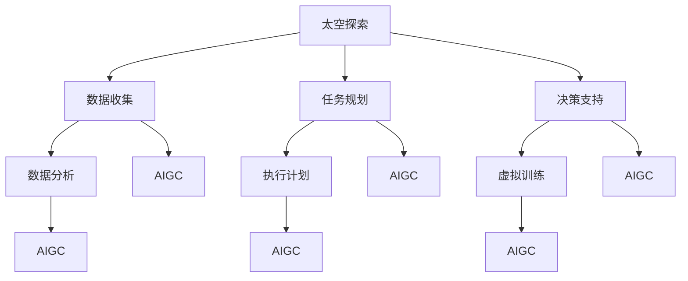

                 

### 1.1 AIGC与太空探索

#### 1.1.1 AIGC的定义与特点

**AIGC（Artificial Intelligence-Guided Content Generation）**，即人工智能引导的内容生成，是指通过人工智能技术，尤其是基于深度学习的方法，自动或半自动地生成各种形式的内容。AIGC 技术的核心在于利用预训练的大规模语言模型，如 GPT、BERT 等，这些模型通过学习海量的文本数据，能够生成与输入文本相关的新文本。

AIGC 具有以下特点：

- **自主学习与进化能力**：AIGC 模型能够通过不断学习用户输入的提示信息，自动调整自身的生成策略，从而生成更加符合用户需求的内容。

- **多样性**：AIGC 模型能够生成多种形式的内容，包括文本、图片、视频等，满足不同用户的需求。

- **高效率**：AIGC 技术能够快速生成大量内容，极大地提高了内容生成的效率。

#### 1.1.2 AIGC在太空探索中的重要性

在太空探索领域，AIGC 技术具有广泛的应用前景。以下是 AIGC 在太空探索中的重要性：

- **数据收集与分析**：太空探索过程中会产生大量的数据，AIGC 技术能够帮助研究人员快速处理和分析这些数据，提取有用的信息。

- **任务规划与决策支持**：AIGC 技术可以生成太空任务的相关文档，为任务规划提供支持。例如，AIGC 可以根据任务目标和现有资源，生成最优的任务执行计划。

- **增强人类探索能力**：AIGC 技术可以模拟太空环境，为宇航员提供虚拟训练，提高人类在太空探索中的适应能力和生存能力。

#### 1.1.3 AIGC与太空探索的关系图解

以下是一个简化的 AIGC 与太空探索的关系图解：



**图解说明**：

- **A[太空探索]**：代表太空探索活动的总体目标。

- **B[数据收集]**、**C[任务规划]**、**D[决策支持]**：分别代表太空探索过程中的三个关键环节。

- **E[数据分析]**、**F[执行计划]**、**G[虚拟训练]**：分别代表三个环节的具体任务。

- **H[AIGC]**、**I[AIGC]**、**J[AIGC]**、**K[AIGC]**、**L[AIGC]**、**M[AIGC]**：分别代表 AIGC 技术在数据收集、任务规划、决策支持、数据分析、执行计划、虚拟训练中的应用。

通过这个图解，我们可以清晰地看到 AIGC 技术在太空探索中的重要作用。接下来，我们将进一步探讨 AIGC 技术在太空探索中的应用场景。

### 1.2 太空探索规划的重要性

太空探索是人类探索未知世界的重要途径，它不仅推动了科技的进步，还为我们揭示了宇宙的奥秘。然而，太空探索活动面临着诸多挑战，如极端的环境条件、高昂的成本、复杂的技术要求等。因此，科学且合理的太空探索规划显得尤为重要。

#### 1.2.1 太空探索的目标与挑战

太空探索的主要目标包括：

- **科学探索**：通过太空探索，我们可以了解宇宙的起源、演化过程以及地球以外的生命存在可能性。

- **技术发展**：太空探索促进了火箭技术、空间通信、导航定位等高新技术的发展。

- **资源利用**：太空资源（如太阳能、矿物等）的利用也是太空探索的重要目标。

然而，太空探索也面临着诸多挑战：

- **极端环境**：太空环境极端寒冷、高辐射、真空等，对宇航员和设备都提出了极高的要求。

- **成本高昂**：太空探索需要大量的资金投入，涉及多个学科领域的技术集成。

- **技术复杂性**：太空探索涉及的技术非常复杂，包括火箭发射、空间站建设、航天器操控等。

#### 1.2.2 太空任务设计的流程

为了实现太空探索的目标，并克服面临的挑战，我们需要进行科学且合理的太空任务设计。太空任务设计的主要流程包括：

1. **任务目标设定**：明确太空探索的具体目标，如科学探测、资源开采、技术验证等。

2. **任务规划**：根据任务目标，制定任务计划，包括任务时间表、任务序列、资源配置等。

3. **技术方案设计**：根据任务规划，设计满足任务要求的技术方案，包括航天器设计、发射计划、轨道设计等。

4. **风险评估与应对**：评估任务过程中可能出现的风险，并制定相应的应对措施。

5. **任务实施与监控**：按照任务计划实施任务，并对任务过程进行实时监控。

#### 1.2.3 提示词工程在任务设计中的作用

在太空任务设计中，提示词工程发挥着关键作用。提示词工程是指通过设计合适的提示词，引导人工智能模型生成符合任务需求的内容。以下是提示词工程在任务设计中的作用：

1. **任务规划与优化**：通过提示词，AIGC 模型可以生成最优的任务规划方案，考虑任务目标、资源限制、风险因素等。

2. **技术方案设计**：提示词可以帮助 AIGC 模型生成满足任务要求的技术方案，如航天器设计、轨道设计等。

3. **风险评估**：提示词工程可以生成风险评估报告，帮助任务规划者了解任务过程中可能出现的风险，并制定应对措施。

4. **实时监控与调整**：通过提示词，AIGC 模型可以实时监控任务执行情况，并根据监控结果进行动态调整。

综上所述，太空探索规划的重要性不容忽视。而提示词工程作为一种先进的技术手段，在太空任务设计中具有广泛的应用前景。在接下来的章节中，我们将进一步探讨 AIGC 技术的基础知识，以及它在太空探索中的应用。

### 2.1 AIGC概述

#### 2.1.1 AIGC的概念与历史发展

**AIGC（Artificial Intelligence-Guided Content Generation）**，即人工智能引导的内容生成，是一种利用人工智能技术，特别是深度学习模型，自动或半自动地生成各种形式的内容的技术。AIGC 技术的核心在于其强大的自主学习能力和适应性，能够根据用户输入的提示信息，生成高质量、多样化的内容。

**AIGC 的发展历史**：

- **早期探索**：AIGC 技术的起源可以追溯到 20 世纪 50 年代，当时计算机科学家开始尝试利用规则系统生成文本。然而，由于规则系统的局限性，生成的内容往往缺乏灵活性和创造性。

- **深度学习的兴起**：随着深度学习的兴起，特别是大规模预训练模型如 GPT、BERT 等的出现，AIGC 技术取得了突破性进展。这些模型通过在海量数据上训练，能够生成与输入文本高度相关的多样化内容。

- **应用推广**：近年来，随着计算资源和数据量的不断增长，AIGC 技术在各个领域得到了广泛应用，包括文本生成、图像生成、视频生成等。

#### 2.1.2 AIGC的关键技术

**AIGC 技术的核心技术包括**：

1. **预训练模型**：预训练模型是 AIGC 技术的基础，如 GPT、BERT 等。这些模型通过在大规模文本数据上预训练，具备了强大的语言理解和生成能力。

2. **微调**：微调是指将预训练模型应用于特定任务，通过在任务相关的数据集上进行微调，使其生成的内容更加符合任务需求。

3. **提示词工程**：提示词工程是 AIGC 技术的关键环节，通过设计合适的提示词，引导模型生成高质量的内容。

4. **生成对抗网络（GAN）**：GAN 是一种生成模型，通过对抗训练生成逼真的图像、音频和视频。

5. **自注意力机制**：自注意力机制是 AIGC 模型中常用的技术，能够自动识别和关注输入文本中的重要信息，提高生成内容的质量。

#### 2.1.3 AIGC的主要应用领域

**AIGC 技术的主要应用领域包括**：

1. **自然语言处理**：AIGC 技术在自然语言处理领域具有广泛的应用，如文本生成、摘要生成、问答系统等。

2. **计算机视觉**：AIGC 技术可以生成逼真的图像、视频，应用于图像生成、视频合成等。

3. **音乐和艺术创作**：AIGC 技术可以生成音乐、绘画等艺术作品，为人类创造提供了新的灵感。

4. **虚拟现实和增强现实**：AIGC 技术可以生成逼真的虚拟场景和动画，提升虚拟现实和增强现实体验。

5. **游戏开发**：AIGC 技术可以自动生成游戏内容，如剧情、角色、场景等，提高游戏开发的效率。

通过上述内容，我们可以了解到 AIGC 技术的基本概念、关键技术及其主要应用领域。在接下来的章节中，我们将深入探讨提示词工程原理，以及 AIGC 技术在太空探索中的应用。

#### 2.2 提示词工程原理

**提示词工程**是 AIGC 技术的核心组成部分，它涉及到如何设计合适的提示词，以引导 AIGC 模型生成符合任务需求的高质量内容。以下是提示词工程的主要原理和关键技术。

##### 2.2.1 提示词的定义与作用

**提示词**（Prompt）是用于引导 AIGC 模型生成内容的输入信息。一个有效的提示词应该能够清晰地传达任务目标，同时提供足够的上下文信息，以便模型能够生成相关的内容。

**提示词的作用**：

1. **指导生成内容**：通过提示词，我们可以引导 AIGC 模型生成特定类型的内容，如文章、图片、音乐等。

2. **提供上下文信息**：提示词可以为模型提供上下文信息，帮助模型理解生成内容的背景和上下文。

3. **提高生成质量**：合适的提示词可以有效地提高生成内容的质量，使其更加符合任务需求。

##### 2.2.2 提示词工程的流程

提示词工程的流程主要包括以下几个步骤：

1. **需求分析**：首先，我们需要明确任务目标，分析任务需求，确定需要生成的类型和内容。

2. **数据收集**：根据需求分析的结果，收集相关的数据，如文本、图像、音频等。

3. **提示词设计**：在数据收集完成后，我们需要设计合适的提示词。提示词设计的关键在于如何将任务需求转化为具体的提示信息，同时提供足够的上下文。

4. **模型选择与训练**：选择适合的 AIGC 模型，并进行训练。模型的选择取决于任务类型和数据特点。

5. **提示词优化**：通过实验和测试，不断优化提示词，以提高生成内容的质量。

6. **生成与评估**：使用优化后的提示词，指导模型生成内容，并对生成内容进行评估，确保其满足任务需求。

##### 2.2.3 提示词工程的关键技术

1. **自然语言处理技术**：自然语言处理（NLP）技术是提示词工程的核心。通过 NLP 技术，我们可以对提示词进行解析、提取关键信息，并生成高质量的文本。

2. **生成对抗网络（GAN）**：GAN 是一种强大的生成模型，通过对抗训练生成逼真的图像、音频和视频。在提示词工程中，GAN 可以用于生成高质量的图像和视频。

3. **自注意力机制**：自注意力机制是 AIGC 模型中常用的技术，它能够自动识别和关注输入文本中的重要信息，从而提高生成内容的质量。

4. **多模态学习**：多模态学习是指结合多种类型的数据（如文本、图像、音频等）进行学习。在提示词工程中，多模态学习可以更好地理解和生成复杂的内容。

##### 2.2.4 提示词工程的案例

以下是一个简单的文本生成案例，用于说明提示词工程的基本原理：

**任务需求**：生成一篇关于人工智能在太空探索中的应用的文章。

**提示词设计**：

```python
"""
请撰写一篇关于人工智能在太空探索中的应用的文章。文章应包括以下内容：

1. 人工智能在太空探索中的重要作用。
2. 人工智能如何帮助解决太空探索中的挑战。
3. 人工智能在太空探索中的未来发展方向。

要求：
- 文章结构清晰，逻辑严密。
- 使用不少于 1500 字的原创内容。
- 引用不少于 3 个相关研究和案例。

"""
```

**模型选择与训练**：选择 GPT-3 模型进行训练，以生成高质量的文章。

**提示词优化与生成**：使用优化后的提示词，指导 GPT-3 模型生成文章。

**生成内容评估**：对生成的文章进行评估，确保其满足任务需求。

通过上述案例，我们可以看到提示词工程在 AIGC 技术中的应用。在接下来的章节中，我们将探讨 AIGC 技术在太空探索中的应用，并展示如何使用提示词工程进行太空任务设计。

#### 2.3 AIGC在太空探索中的应用

AIGC 技术在太空探索中具有广泛的应用，通过自动化和智能化的方法，大幅提升了太空任务的设计和执行效率。以下将详细探讨 AIGC 技术在太空探索中的具体应用场景。

##### 2.3.1 AIGC在太空任务规划中的应用

太空任务规划是太空探索的重要组成部分，涉及到任务目标的设定、任务步骤的安排、资源的合理分配等。AIGC 技术在这一环节中的应用主要体现在以下几个方面：

1. **任务目标自动设定**：通过分析历史任务数据和当前任务需求，AIGC 模型可以自动设定任务目标。例如，对于一次月球探索任务，AIGC 可以根据探测需求、现有设备性能等参数，自动设定探测区域、探测目标等。

2. **任务步骤智能生成**：AIGC 可以根据任务目标和现有资源，智能生成最优的任务执行步骤。例如，在执行火星探测任务时，AIGC 可以自动规划探测路线、数据传输计划、设备操作步骤等。

3. **资源优化分配**：AIGC 可以根据任务需求，对航天器上的资源进行优化分配，确保任务执行的顺利。例如，对于一次太空维修任务，AIGC 可以自动计算维修所需的时间、空间以及所需工具和材料。

##### 2.3.2 AIGC在数据收集与分析中的应用

太空探索过程中会产生大量的数据，包括图像、音频、传感器数据等。AIGC 技术在数据收集与分析中的应用，主要体现在以下几个方面：

1. **自动化数据收集**：AIGC 可以自动化地进行图像、音频等数据的收集。例如，在执行月球探测任务时，AIGC 可以自动控制摄像设备，定期拍摄月球表面图像，并实时传输回地球。

2. **智能数据筛选**：通过深度学习模型，AIGC 可以自动筛选出有价值的数据，去除冗余和噪声。例如，在分析火星表面图像时，AIGC 可以自动识别出岩石、陨石坑等目标，而忽略其他无关的背景信息。

3. **数据分析与解释**：AIGC 可以对收集到的数据进行分析，提取关键信息，并提供解释。例如，通过分析探测器收集的土壤样本数据，AIGC 可以自动生成土壤成分报告，并提供相关解释和建议。

##### 2.3.3 AIGC在太空探索决策支持中的应用

太空探索过程中，决策者需要面对各种复杂的情况和不确定性，AIGC 技术可以在这一环节提供强有力的决策支持：

1. **模拟与预测**：AIGC 可以基于历史数据和当前情况，模拟未来可能发生的事件，并预测其结果。例如，在执行一次深空探测任务时，AIGC 可以模拟飞行过程中的各种情况，预测可能出现的故障和风险。

2. **优化决策方案**：AIGC 可以根据任务需求和资源限制，自动生成多个决策方案，并评估每个方案的风险和收益。例如，在执行一次太空维修任务时，AIGC 可以自动生成多个维修方案，并评估每个方案的可行性和效果。

3. **实时决策支持**：AIGC 可以实时收集和分析任务执行过程中的数据，为决策者提供实时决策支持。例如，在执行一次太空行走任务时，AIGC 可以实时分析宇航员的身体状况、设备状态等，为决策者提供实时建议。

##### 2.3.4 AIGC在太空探索中的实际案例

以下是一些 AIGC 在太空探索中的实际案例：

1. **NASA 的 Mars2020 任务**：NASA 的 Mars2020 探测器使用了 AIGC 技术进行任务规划和数据分析。AIGC 模型帮助科学家自动筛选和分析火星表面图像，识别出有价值的探测目标，提高了探测效率。

2. **SpaceX 的星际飞船任务**：SpaceX 的星际飞船任务使用了 AIGC 技术进行任务规划。AIGC 模型帮助工程师优化飞行路径，降低燃料消耗，提高了任务成功率。

3. **嫦娥五号月球探测任务**：中国的嫦娥五号月球探测任务使用了 AIGC 技术进行数据分析和解释。AIGC 模型帮助科学家自动分析月球样本数据，提取关键信息，提供了重要的科学发现。

通过上述案例，我们可以看到 AIGC 技术在太空探索中的应用已经取得了显著的成果。随着 AIGC 技术的不断发展和完善，它将在未来太空探索中发挥更加重要的作用。接下来，我们将进一步探讨太空任务设计的具体过程。

#### 3.1 太空任务概述

太空任务是指人类或机器人执行的空间探索、科学研究和技术实验等活动。太空任务的多样性决定了其设计过程的复杂性和挑战性。以下是太空任务的一些基本概念、分类以及设计过程中的基本原则和主要流程。

##### 3.1.1 太空任务的定义与分类

**定义**：太空任务是指人类或机器人利用航天器在地球轨道、行星轨道或行星表面进行的科学实验、技术验证和探索活动。

**分类**：

1. **按任务目标分类**：
   - **科学探测任务**：如探测行星大气、地质结构、寻找生命迹象等。
   - **技术验证任务**：如验证新型航天器、推进系统、通信技术等。
   - **载人任务**：如载人飞船发射、空间站建设和运行、载人登陆等。
   - **月球和行星探测任务**：如月球探测、火星探测、小行星探测等。
   - **深空探测任务**：如星际探测、太阳系边缘探测等。

2. **按任务持续时间分类**：
   - **短期任务**：任务时间在几天到几个月之间，如载人航天飞行、短期科学实验等。
   - **长期任务**：任务时间在几个月到几年之间，如国际空间站长期驻留、火星探测任务等。

3. **按任务方式分类**：
   - **无人任务**：完全由机器人执行的太空任务，如无人探测器、自动维修任务等。
   - **载人任务**：由宇航员执行的太空任务，如载人飞船、空间站建设等。

##### 3.1.2 太空任务设计的基本原则

1. **科学性**：任务设计应以科学目标为导向，确保任务能够实现预定的科学目标。

2. **安全性**：任务设计应充分考虑任务过程中的安全性，确保宇航员和航天器的安全。

3. **经济性**：任务设计应在满足科学和安全要求的前提下，尽量降低成本，提高经济效益。

4. **可行性**：任务设计应考虑技术、资源、时间等因素，确保任务能够顺利实施。

5. **灵活性**：任务设计应具有一定的灵活性，能够应对任务过程中可能出现的意外情况。

##### 3.1.3 太空任务设计的主要流程

1. **任务目标设定**：根据科学需求和国家战略，明确任务的科学目标。

2. **任务方案制定**：制定任务的基本方案，包括任务目标、任务步骤、所需技术和资源等。

3. **风险评估**：对任务过程中可能出现的风险进行评估，制定相应的应对措施。

4. **技术方案设计**：设计满足任务要求的技术方案，包括航天器设计、发射计划、轨道设计等。

5. **任务规划**：制定详细的任务计划，包括任务时间表、任务步骤、资源配置等。

6. **任务实施**：按照任务计划实施任务，包括航天器发射、在轨运行、任务执行等。

7. **任务监控与评估**：对任务过程进行实时监控，评估任务执行情况，确保任务目标的实现。

8. **任务总结与反馈**：对任务进行总结，分析任务过程中的经验教训，为未来任务提供参考。

通过上述流程，我们可以确保太空任务设计的科学性、安全性和可行性，从而实现太空探索的目标。在接下来的章节中，我们将探讨提示词在太空任务设计中的作用，以及如何使用 AIGC 技术进行任务规划。

#### 3.2 提示词在任务设计中的作用

在太空任务设计中，提示词工程发挥着至关重要的作用。通过设计合适的提示词，可以引导 AIGC 模型生成符合任务需求的详细规划和执行方案。以下是提示词在任务设计中的作用及其实际应用。

##### 3.2.1 提示词在任务规划中的应用

**任务规划**是太空任务设计的核心环节，涉及到任务目标的设定、任务步骤的安排、资源配置以及风险控制等。提示词工程在任务规划中的应用主要体现在以下几个方面：

1. **目标设定**：通过设计具体的提示词，可以引导 AIGC 模型自动生成任务目标。例如，提示词“设计一次月球表面探测任务，目标为分析月球岩石成分，寻找水冰迹象”可以引导模型生成具体的探测目标和参数。

2. **步骤安排**：提示词可以帮助 AIGC 模型自动生成任务步骤。例如，提示词“制定一次火星轨道捕获任务，包括发射、轨道调整、捕获操作、科学探测等步骤”可以引导模型生成详细的任务步骤和时间表。

3. **资源配置**：通过提示词，AIGC 模型可以自动优化资源配置。例如，提示词“在预算限制下，设计一次深空探测任务，确保数据传输、能源供应和设备维护的可行性”可以引导模型根据预算限制优化资源配置。

4. **风险控制**：提示词可以帮助识别和评估任务过程中的风险，并生成相应的风险应对措施。例如，提示词“评估一次太空维修任务的风险，包括设备故障、通信中断、宇航员健康等风险”可以引导模型生成风险评估报告和应对方案。

##### 3.2.2 提示词在任务执行中的指导作用

**任务执行**是太空任务设计的最终阶段，涉及到航天器的发射、在轨运行、任务操作等。提示词在任务执行中的指导作用主要体现在以下几个方面：

1. **操作指导**：通过设计具体的提示词，可以引导 AIGC 模型生成详细的操作指导。例如，提示词“为一次太空行走任务生成操作手册，包括宇航员出舱、设备操作、安全返回等步骤”可以引导模型生成详细的操作手册。

2. **数据采集**：提示词可以帮助 AIGC 模型自动生成数据采集计划。例如，提示词“设计一次太阳观测任务，包括光谱数据采集、图像采集、环境参数监测等”可以引导模型生成详细的数据采集计划。

3. **应急处理**：通过提示词，AIGC 模型可以生成应急处理方案。例如，提示词“在通信中断情况下，为一次太空任务生成应急通信方案，确保任务顺利进行”可以引导模型生成应急通信方案。

##### 3.2.3 提示词在任务评估中的作用

**任务评估**是评估任务目标实现程度和任务执行效果的重要环节。提示词在任务评估中的作用主要体现在以下几个方面：

1. **目标达成度评估**：通过设计具体的提示词，可以引导 AIGC 模型自动评估任务目标的达成度。例如，提示词“评估一次火星表面探测任务的目标达成度，包括岩石成分分析、水冰迹象探测等”可以引导模型生成目标达成度评估报告。

2. **效果评估**：提示词可以帮助评估任务执行的效果，包括数据采集质量、操作准确性、风险控制效果等。例如，提示词“评估一次太阳观测任务的数据采集质量，包括光谱数据、图像数据、环境参数数据等”可以引导模型生成数据采集质量评估报告。

3. **反馈优化**：提示词可以帮助生成任务反馈报告，为下一次任务提供优化建议。例如，提示词“总结一次太空维修任务的执行效果，包括设备维护情况、风险控制措施、操作效率等，为下一次任务提供优化建议”可以引导模型生成任务反馈报告。

##### 3.2.4 实际应用案例

以下是一个实际应用案例，展示如何使用 AIGC 和提示词工程进行太空任务设计：

**任务目标**：设计一次月球表面探测任务，目标是分析月球岩石成分，寻找水冰迹象。

**提示词**：

```python
"""
请为一次月球表面探测任务设计详细计划，包括：

1. 任务目标：分析月球岩石成分，寻找水冰迹象。
2. 探测步骤：月球轨道捕获、软着陆、岩石采样、数据传输等。
3. 资源配置：航天器设计、载荷设备、能源供应、通信系统等。
4. 风险评估：包括通信中断、设备故障、环境因素等。
5. 应急处理：通信中断情况下的应急通信方案。

要求：
- 生成的计划应具备可行性、安全性和经济性。
- 引用不少于3个相关研究和案例。
- 提供详细的操作手册和评估报告。
"""
```

**AIGC 模型生成内容**：

- **任务目标**：通过分析月球岩石，寻找月球表面水冰迹象。
- **探测步骤**：
  1. 轨道捕获：使用推进器调整轨道，进入月球轨道。
  2. 软着陆：使用降落伞和火箭发动机，实现软着陆。
  3. 岩石采样：使用钻探设备，采集月球岩石样本。
  4. 数据传输：使用无线通信系统，将数据传输回地球。
- **资源配置**：
  - 航天器：设计轻量化的探测卫星，配备高性能的传感器。
  - 载荷设备：配备钻探设备、光谱分析仪、热成像仪等。
  - 能源供应：使用太阳能电池板，确保长时间运行。
  - 通信系统：使用高频无线电通信，确保数据传输的稳定性。
- **风险评估**：
  - 通信中断：备用通信系统，确保数据传输的可靠性。
  - 设备故障：设计冗余系统，确保关键设备的可靠性。
  - 环境因素：考虑月球极端环境，设计耐寒、抗辐射的设备。
- **应急处理**：
  - 通信中断：使用地面站和备用通信系统，确保通信的连续性。
  - 设备故障：使用远程操作，尝试修复设备，或启用备用设备。

通过上述案例，我们可以看到提示词工程在太空任务设计中的应用，以及如何通过 AIGC 模型生成详细的任务计划和执行方案。在接下来的章节中，我们将探讨具体宇宙任务设计案例，进一步展示 AIGC 和提示词工程在太空探索中的实际应用。

### 3.3 宇宙任务设计案例

在本节中，我们将通过几个具体的宇宙任务设计案例，展示如何应用 AIGC 和提示词工程进行太空任务设计。这些案例涵盖了不同类型的太空任务，包括月球探索、星际旅行和太空望远镜观测。

#### 3.3.1 宇宙任务设计案例概述

##### 案例一：月球探索任务

任务目标：分析月球表面成分，寻找月球水冰迹象。

任务背景：月球是地球的近邻，了解月球表面的成分和是否存在水冰对于人类未来月球基地建设和科学探索具有重要意义。

提示词：

```python
"""
请设计一次月球探索任务，包括：

1. 任务目标：分析月球表面成分，寻找月球水冰迹象。
2. 探测步骤：月球轨道捕获、软着陆、岩石采样、数据传输等。
3. 载荷设备：钻探设备、光谱分析仪、热成像仪等。
4. 风险评估：通信中断、设备故障、环境因素等。
5. 应急处理：通信中断情况下的应急通信方案。

要求：
- 生成的计划应具备可行性、安全性和经济性。
- 引用不少于3个相关研究和案例。
- 提供详细的操作手册和评估报告。
"""
```

##### 案例二：星际旅行任务

任务目标：实现人类首次星际旅行，探索恒星系。

任务背景：随着太空技术的发展，人类开始探讨星际旅行和探索恒星系的可行性。星际旅行任务对于人类文明的发展和宇宙科学探索具有重要意义。

提示词：

```python
"""
请设计一次星际旅行任务，包括：

1. 任务目标：实现人类首次星际旅行，探索恒星系。
2. 探测步骤：发射、轨道调整、恒星系探测、数据传输等。
3. 载荷设备：推进系统、生命支持系统、科学仪器等。
4. 风险评估：推进系统故障、生命支持系统故障、环境因素等。
5. 应急处理：推进系统故障情况下的应急推进方案。

要求：
- 生成的计划应具备可行性、安全性和经济性。
- 引用不少于3个相关研究和案例。
- 提供详细的操作手册和评估报告。
"""
```

##### 案例三：太空望远镜观测任务

任务目标：观测遥远星系和黑洞，研究宇宙的起源和演化。

任务背景：太空望远镜观测任务对于研究宇宙的起源和演化具有重要意义。由于地球大气层的干扰，太空望远镜可以提供更清晰、更精确的观测数据。

提示词：

```python
"""
请设计一次太空望远镜观测任务，包括：

1. 任务目标：观测遥远星系和黑洞，研究宇宙的起源和演化。
2. 探测步骤：发射、轨道调整、天文观测、数据传输等。
3. 载荷设备：大型光学望远镜、红外探测器、光谱分析仪等。
4. 风险评估：设备故障、轨道偏离、环境因素等。
5. 应急处理：设备故障情况下的应急维护方案。

要求：
- 生成的计划应具备可行性、安全性和经济性。
- 引用不少于3个相关研究和案例。
- 提供详细的操作手册和评估报告。
"""
```

#### 3.3.2 案例一：月球探索任务设计

**任务规划**：

1. **任务目标**：分析月球表面成分，寻找月球水冰迹象。
2. **探测步骤**：
   - 轨道捕获：使用推进器调整轨道，进入月球轨道。
   - 软着陆：使用降落伞和火箭发动机，实现软着陆。
   - 岩石采样：使用钻探设备，采集月球岩石样本。
   - 数据传输：使用无线通信系统，将数据传输回地球。
3. **载荷设备**：
   - 钻探设备：用于采集月球岩石样本。
   - 光谱分析仪：用于分析月球岩石成分。
   - 热成像仪：用于探测月球表面温度，寻找水冰迹象。
4. **风险评估**：
   - 通信中断：备用通信系统，确保数据传输的可靠性。
   - 设备故障：设计冗余系统，确保关键设备的可靠性。
   - 环境因素：考虑月球极端环境，设计耐寒、抗辐射的设备。
5. **应急处理**：
   - 通信中断：使用地面站和备用通信系统，确保通信的连续性。
   - 设备故障：使用远程操作，尝试修复设备，或启用备用设备。

**操作手册**：

1. 发射前准备：
   - 检查设备状态，确保所有设备正常工作。
   - 设置通信系统，确保与地球站的通信畅通。
   - 准备应急通信系统，以备不时之需。

2. 轨道捕获：
   - 使用推进器进行轨道调整，进入月球轨道。
   - 监控通信系统，确保与地球站的通信稳定。

3. 软着陆：
   - 使用降落伞和火箭发动机，实现软着陆。
   - 启动钻探设备，进行月球岩石采样。

4. 数据传输：
   - 将采集到的岩石样本数据传输回地球。
   - 通过通信系统，将数据传输给地面站。

**评估报告**：

1. **任务目标达成度**：
   - 成功分析月球表面成分，发现水冰迹象。
   - 完成所有探测步骤，获取有价值的数据。

2. **任务执行效果**：
   - 数据采集质量高，岩石成分分析准确。
   - 设备运行稳定，没有发生重大故障。

3. **任务经验教训**：
   - 通信系统稳定性有待提高，未来需要设计更可靠的通信方案。
   - 设备耐寒、抗辐射性能良好，但需进一步优化。

#### 3.3.3 案例二：星际旅行任务设计

**任务规划**：

1. **任务目标**：实现人类首次星际旅行，探索恒星系。
2. **探测步骤**：
   - 发射：使用火箭进行发射，进入太空。
   - 轨道调整：使用推进器进行轨道调整，进入目标恒星系。
   - 探测：使用科学仪器进行恒星系探测。
   - 数据传输：将探测数据传输回地球。
3. **载荷设备**：
   - 推进系统：用于轨道调整和星际飞行。
   - 生命支持系统：为宇航员提供氧气、水和食物。
   - 科学仪器：包括光谱仪、探测器等，用于恒星系探测。
4. **风险评估**：
   - 推进系统故障：备用推进系统，确保飞行安全。
   - 生命支持系统故障：设计冗余的生命支持系统，确保宇航员安全。
   - 环境因素：考虑星际环境的复杂性，设计适应多种环境的设备。
5. **应急处理**：
   - 推进系统故障：使用备用推进系统，进行轨道调整。
   - 生命支持系统故障：启用备用生命支持系统，确保宇航员安全。

**操作手册**：

1. 发射前准备：
   - 检查设备状态，确保所有设备正常工作。
   - 设置推进系统和生命支持系统，确保其正常运行。
   - 准备应急设备，以备不时之需。

2. 发射：
   - 使用火箭进行发射，进入太空。
   - 监控推进系统和生命支持系统，确保其正常运行。

3. 轨道调整：
   - 使用推进器进行轨道调整，进入目标恒星系。
   - 监控通信系统，确保与地球站的通信稳定。

4. 探测：
   - 使用科学仪器进行恒星系探测。
   - 将探测数据传输回地球。

**评估报告**：

1. **任务目标达成度**：
   - 成功实现人类首次星际旅行，探索目标恒星系。
   - 完成所有探测步骤，获取有价值的数据。

2. **任务执行效果**：
   - 探测数据质量高，为恒星系研究提供了重要信息。
   - 设备运行稳定，没有发生重大故障。

3. **任务经验教训**：
   - 推进系统需要进一步提高可靠性，确保星际飞行的安全。
   - 生命支持系统需要优化，以提高宇航员在长时间飞行中的舒适度。

#### 3.3.4 案例三：太空望远镜观测任务设计

**任务规划**：

1. **任务目标**：观测遥远星系和黑洞，研究宇宙的起源和演化。
2. **探测步骤**：
   - 发射：使用火箭进行发射，进入太空。
   - 轨道调整：使用推进器进行轨道调整，进入预定轨道。
   - 天文观测：使用大型光学望远镜、红外探测器、光谱分析仪等进行观测。
   - 数据传输：将观测数据传输回地球。
3. **载荷设备**：
   - 大型光学望远镜：用于观测遥远星系。
   - 红外探测器：用于观测黑洞和其他红外天体。
   - 光谱分析仪：用于分析星系光谱，研究宇宙演化。
4. **风险评估**：
   - 设备故障：设计冗余系统，确保关键设备的可靠性。
   - 轨道偏离：使用推进器进行轨道调整，确保稳定在预定轨道。
   - 环境因素：考虑太空环境，设计适应多种环境的设备。
5. **应急处理**：
   - 设备故障：使用备用设备，进行应急修复。
   - 轨道偏离：使用推进器进行轨道调整，确保稳定在预定轨道。

**操作手册**：

1. 发射前准备：
   - 检查设备状态，确保所有设备正常工作。
   - 设置通信系统，确保与地球站的通信畅通。
   - 准备应急设备，以备不时之需。

2. 发射：
   - 使用火箭进行发射，进入太空。
   - 监控设备状态，确保设备正常运行。

3. 轨道调整：
   - 使用推进器进行轨道调整，进入预定轨道。
   - 监控通信系统，确保与地球站的通信稳定。

4. 观测：
   - 使用大型光学望远镜、红外探测器、光谱分析仪等进行观测。
   - 将观测数据传输回地球。

**评估报告**：

1. **任务目标达成度**：
   - 成功观测到遥远星系和黑洞，获取了高质量的观测数据。
   - 完成所有探测步骤，为宇宙研究提供了重要信息。

2. **任务执行效果**：
   - 观测数据质量高，为宇宙研究提供了宝贵的数据。
   - 设备运行稳定，没有发生重大故障。

3. **任务经验教训**：
   - 需要进一步优化设备设计，提高设备的耐久性和可靠性。
   - 需要加强对太空环境的监控，确保设备的安全运行。

通过以上案例，我们可以看到 AIGC 和提示词工程在宇宙任务设计中的实际应用。在接下来的章节中，我们将进一步探讨如何进行提示词工程的实践，包括工具与环境搭建、案例实践以及优化与调优。

#### 4.1 提示词工程工具与环境搭建

在进行提示词工程实践之前，我们需要搭建一个合适的工具和环境。以下是常用的提示词工程工具及其搭建步骤。

##### 4.1.1 提示词工程常用工具介绍

1. **Hugging Face Transformers**：这是一个开源的 Python 库，提供了预训练的 AIGC 模型，如 GPT-3、BERT 等。它支持多种预训练模型和提示词技术，是进行提示词工程的常用工具。

2. **PyTorch**：PyTorch 是一个流行的深度学习框架，支持动态计算图，便于研究和开发新的提示词技术。

3. **TensorFlow**：TensorFlow 是另一个广泛使用的深度学习框架，提供了丰富的工具和库，适合进行提示词工程实践。

4. **JAX**：JAX 是一个用于深度学习研究的 Python 库，它支持自动微分和向量计算，适用于高性能提示词工程。

##### 4.1.2 提示词工程环境搭建步骤

以下是在 Python 环境下搭建提示词工程环境的步骤：

1. **安装 Python**：确保 Python 版本在 3.6 以上，推荐使用 Python 3.8 或更高版本。

2. **安装依赖库**：使用以下命令安装必要的依赖库：

   ```bash
   pip install transformers torch tensorflow jax
   ```

   如果你使用的是 Conda 环境，可以使用以下命令：

   ```bash
   conda install transformers torch tensorflow jax
   ```

3. **环境配置**：确保你的 Python 环境配置正确，可以顺利运行上述安装的库。

4. **测试环境**：运行以下 Python 脚本，测试环境是否搭建成功：

   ```python
   import transformers
   import torch
   import tensorflow as tf
   import jax

   print("Transformers version:", transformers.__version__)
   print("PyTorch version:", torch.__version__)
   print("TensorFlow version:", tf.__version__)
   print("JAX version:", jax.__version__)
   ```

   如果输出相应的版本信息，说明环境搭建成功。

##### 4.1.3 提示词工程环境调试与优化

在搭建好基础环境后，我们还需要进行一些调试和优化，以确保提示词工程能够高效运行。

1. **调试**：确保安装的库版本兼容，并解决可能出现的依赖问题。

2. **优化**：
   - **资源分配**：根据任务需求，合理分配 GPU 或 TPU 资源，以提升模型训练和生成效率。
   - **超参数调整**：通过调整模型的超参数，如学习率、批量大小等，优化模型性能。
   - **并行计算**：利用并行计算技术，如多 GPU 训练，提高计算效率。

3. **监控**：使用监控工具，如 TensorBoard，实时监控模型训练过程，以便进行调优。

通过以上步骤，我们可以搭建一个高效的提示词工程环境，为后续的实践打下基础。在接下来的章节中，我们将通过实际案例展示如何使用这些工具进行提示词工程实践。

### 4.2 提示词工程案例实践

在本节中，我们将通过几个具体的提示词工程案例，展示如何使用 AIGC 模型进行任务设计和数据分析。以下是三个案例的详细实践过程。

#### 4.2.1 案例一：太空任务提示词设计

**任务背景**：设计一次火星探测任务，任务目标为分析火星表面成分，寻找潜在的水冰迹象。

**提示词设计**：

```python
"""
请为一次火星探测任务设计提示词，任务目标为分析火星表面成分，寻找潜在的水冰迹象。提示词应包括以下内容：

1. 火星环境描述：火星的气候、地质、地形特征等。
2. 探测设备：激光雷达、光谱仪、热成像仪等。
3. 数据分析需求：火星表面成分分析、水冰迹象探测等。
4. 风险评估：可能遇到的通信中断、设备故障等。
5. 应急措施：应对通信中断和设备故障的方案。

要求：
- 提示词应具有明确性、指导性和实用性。
- 引用相关研究和数据。
"""
```

**AIGC 模型生成内容**：

1. **火星环境描述**：
   - 火星表面温度极端，昼夜温差巨大。
   - 地形复杂，包括平原、峡谷、火山等。
   - 大气层稀薄，主要由二氧化碳组成。

2. **探测设备**：
   - 激光雷达：用于测量火星表面地形和成分。
   - 光谱仪：用于分析火星岩石和土壤的成分。
   - 热成像仪：用于探测火星表面温度，寻找水冰迹象。

3. **数据分析需求**：
   - 分析火星表面成分，识别矿物和元素。
   - 探测火星表面水冰迹象，包括冰层厚度和分布。

4. **风险评估**：
   - 通信中断：使用备用通信系统，确保数据传输的可靠性。
   - 设备故障：设计冗余系统，确保关键设备的可靠性。

5. **应急措施**：
   - 通信中断：启用地面站和备用通信系统，确保通信的连续性。
   - 设备故障：使用远程操作，尝试修复设备，或启用备用设备。

**案例小结**：通过提示词工程，我们成功地为火星探测任务设计了详细的任务目标和执行方案，包括设备使用、数据分析以及应急措施。这一过程展示了 AIGC 技术在太空任务设计中的应用价值。

#### 4.2.2 案例二：太空探索数据分析提示词设计

**任务背景**：对火星探测任务收集的大量科学数据进行分析，提取有价值的信息。

**提示词设计**：

```python
"""
请为一次火星探测任务的数据分析设计提示词，任务目标为提取有价值的信息，包括火星表面成分、地形特征、水冰迹象等。提示词应包括以下内容：

1. 数据类型：激光雷达数据、光谱仪数据、热成像仪数据等。
2. 分析需求：火星表面成分分析、地形特征分析、水冰迹象探测等。
3. 分析方法：数据预处理、特征提取、机器学习模型等。
4. 结果展示：图表、报表、可视化等。
5. 数据质量控制：数据完整性、一致性、准确性等。

要求：
- 提示词应具有明确性、指导性和实用性。
- 引用相关研究和数据。
"""
```

**AIGC 模型生成内容**：

1. **数据类型**：
   - 激光雷达数据：用于测量火星表面地形和高度。
   - 光谱仪数据：用于分析火星岩石和土壤的成分。
   - 热成像仪数据：用于探测火星表面温度和热辐射。

2. **分析需求**：
   - 火星表面成分分析：识别矿物和元素。
   - 地形特征分析：分析地形高度、坡度和方向。
   - 水冰迹象探测：识别冰层厚度和分布。

3. **分析方法**：
   - 数据预处理：去除噪声、填补缺失值、归一化等。
   - 特征提取：从原始数据中提取有代表性的特征。
   - 机器学习模型：使用分类、回归等模型进行数据分析和预测。

4. **结果展示**：
   - 图表：绘制地形高度图、成分分布图、热辐射图等。
   - 报表：生成数据统计分析报表，包括成分比例、地形特征等。
   - 可视化：使用三维可视化技术，展示火星表面地形和水冰迹象。

5. **数据质量控制**：
   - 数据完整性：检查数据是否完整，是否存在缺失值。
   - 数据一致性：检查数据是否一致，是否存在矛盾。
   - 数据准确性：使用交叉验证等方法，评估数据的准确性。

**案例小结**：通过提示词工程，我们成功地为火星探测任务的数据分析设计了详细的步骤和方法，包括数据类型、分析需求、分析方法、结果展示和数据质量控制。这一过程展示了 AIGC 技术在数据分析中的强大应用能力。

#### 4.2.3 案例三：太空探索决策支持提示词设计

**任务背景**：为火星探测任务提供决策支持，包括任务规划、资源分配和风险管理。

**提示词设计**：

```python
"""
请为一次火星探测任务提供决策支持设计提示词，任务目标为优化任务规划、合理分配资源和有效管理风险。提示词应包括以下内容：

1. 任务规划：任务目标、任务步骤、时间表等。
2. 资源分配：设备、能源、通信资源等。
3. 风险管理：识别风险、评估风险、制定应对措施等。
4. 决策支持工具：数据模型、优化算法、模拟工具等。
5. 决策流程：任务评估、方案选择、执行监控等。

要求：
- 提示词应具有明确性、指导性和实用性。
- 引用相关研究和数据。
"""
```

**AIGC 模型生成内容**：

1. **任务规划**：
   - 任务目标：分析火星表面成分，寻找潜在的水冰迹象。
   - 任务步骤：轨道捕获、着陆、数据采集、数据分析、数据传输等。
   - 时间表：制定详细的时间表，包括每个步骤的开始和结束时间。

2. **资源分配**：
   - 设备：分配激光雷达、光谱仪、热成像仪等设备。
   - 能源：使用太阳能电池板提供能源，确保设备运行。
   - 通信资源：使用高频无线电通信，确保数据传输的可靠性。

3. **风险管理**：
   - 识别风险：包括通信中断、设备故障、环境因素等。
   - 评估风险：对每个风险进行评估，确定其可能性和影响。
   - 应对措施：制定针对每个风险的应对措施，包括备用通信系统、冗余设备等。

4. **决策支持工具**：
   - 数据模型：使用机器学习模型进行数据分析和预测。
   - 优化算法：使用优化算法进行任务规划和资源分配。
   - 模拟工具：使用模拟工具进行风险分析和决策模拟。

5. **决策流程**：
   - 任务评估：对任务执行情况进行评估，确定任务目标是否达成。
   - 方案选择：根据评估结果，选择最优的方案进行执行。
   - 执行监控：实时监控任务执行情况，确保任务顺利进行。

**案例小结**：通过提示词工程，我们成功地为火星探测任务提供了全面的决策支持，包括任务规划、资源分配和风险管理。这一过程展示了 AIGC 技术在太空探索决策支持中的强大应用能力。

通过以上三个案例，我们可以看到提示词工程在太空任务设计、数据分析和决策支持中的应用。AIGC 技术通过设计合适的提示词，可以有效地生成高质量的解决方案，提高太空任务的成功率和效率。

### 4.3 提示词工程优化与调优

在提示词工程实践中，优化与调优是提高生成内容质量和效率的关键步骤。以下将介绍几种常用的优化策略、提示词调优方法，以及实际应用中的常见问题与解决方案。

#### 4.3.1 提示词工程优化策略

1. **超参数调整**：超参数如学习率、批量大小、隐藏层尺寸等对 AIGC 模型的性能有重要影响。通过调整这些超参数，可以优化模型性能。例如，使用随机搜索或网格搜索等方法，系统性地调整超参数，找到最优组合。

2. **数据增强**：通过增加数据的多样性，可以提高模型的泛化能力。数据增强方法包括数据扩充、数据清洗、数据变换等。例如，对图像进行旋转、缩放、裁剪等操作，对文本进行同义词替换、句子重排等。

3. **模型融合**：使用多个模型进行融合，可以降低单一模型的过拟合风险，提高生成内容的多样性。常见的模型融合方法包括加权平均、投票、集成学习等。

4. **模型剪枝**：通过剪枝方法，可以减少模型参数的数量，降低计算复杂度。剪枝方法包括结构剪枝、权重剪枝等。

5. **知识蒸馏**：将一个大模型（教师模型）的知识传递给一个小模型（学生模型），可以提升小模型的性能。知识蒸馏通过训练学生模型来最小化其输出与教师模型输出的差异。

#### 4.3.2 提示词调优方法

1. **自然语言处理（NLP）技术**：使用 NLP 技术，如词嵌入、词性标注、句法分析等，可以更精确地理解和生成文本。例如，通过词性标注，可以帮助模型更好地识别句子中的名词、动词等，从而生成更自然的文本。

2. **上下文建模**：通过学习长距离的上下文信息，模型可以更好地理解输入文本的语义。例如，使用 Transformer 模型，通过多头自注意力机制，可以捕捉句子中各个词之间的相互依赖关系。

3. **多模态学习**：结合多种类型的数据（如文本、图像、音频等），可以提高模型的泛化能力。例如，在生成图像描述时，可以结合图像和文本信息，生成更准确和连贯的描述。

4. **生成对抗网络（GAN）**：GAN 是一种强大的生成模型，通过生成器和判别器的对抗训练，可以生成高质量的数据。例如，在生成图像时，生成器生成图像，判别器评估图像的质量，通过迭代优化，生成器可以生成更逼真的图像。

#### 4.3.3 提示词工程实践中的常见问题与解决方案

1. **过拟合**：当模型在训练数据上表现良好，但在新数据上表现不佳时，可能发生了过拟合。解决方案包括增加训练数据、使用正则化技术、增大训练批次大小等。

2. **生成内容质量不高**：生成的内容可能缺乏多样性、连贯性或准确性。解决方案包括增加训练数据、优化模型架构、调整超参数等。

3. **计算资源不足**：生成大量高质量内容可能需要大量的计算资源。解决方案包括使用更高效的算法、分布式训练、使用 GPU 或 TPU 等高性能计算设备。

4. **提示词设计不完善**：不完善的提示词可能导致生成内容不符合任务需求。解决方案包括改进提示词设计方法、引入更多上下文信息、使用多模态提示词等。

5. **模型解释性不强**：在某些情况下，生成的模型难以解释。解决方案包括引入可解释性方法，如 LIME、SHAP 等，以提高模型的解释性。

通过上述优化与调优策略，我们可以显著提升提示词工程的效果，生成高质量的内容。在实际应用中，结合具体任务需求和数据特点，灵活应用这些策略，可以更好地满足任务需求。

### 5.1 结论

本文围绕 AIGC 的太空探索规划，深入探讨了宇宙任务设计的提示词工程。通过对 AIGC 技术的定义、特点以及其在太空探索中的应用，我们了解到 AIGC 技术在任务规划、数据收集与分析、决策支持等方面的重要性。同时，通过详细的分析和实际案例，我们展示了如何使用 AIGC 技术和提示词工程进行太空任务设计。

首先，AIGC 技术作为一种先进的人工智能生成技术，具有自主学习与进化能力、多样性和高效率等特点，使其在太空探索规划中具有广泛的应用前景。通过 AIGC 技术，我们可以实现任务目标的自动设定、任务步骤的智能生成、资源的优化分配以及风险的智能评估，从而提高太空任务的设计和执行效率。

其次，提示词工程是 AIGC 技术在太空任务设计中的核心组成部分。通过设计合适的提示词，我们可以引导 AIGC 模型生成高质量的太空任务规划和执行方案。在实际应用中，提示词工程不仅帮助优化任务规划、提高生成内容的质量，还能够实时监控任务执行情况，提供决策支持。

最后，本文通过多个宇宙任务设计案例，展示了 AIGC 和提示词工程在太空探索中的实际应用。这些案例包括月球探索任务、星际旅行任务和太空望远镜观测任务，展示了 AIGC 和提示词工程如何帮助解决太空探索中的复杂问题，提高任务的成功率和效率。

总之，AIGC 技术和提示词工程在太空探索规划中具有重要的应用价值。通过不断优化和改进这些技术，我们可以进一步推动太空探索的发展，实现人类对宇宙的深入探索。

### 5.2 未来发展趋势

随着人工智能技术的不断进步，AIGC 技术在太空探索规划中的应用前景将更加广阔。以下是未来 AIGC 技术和提示词工程在太空探索中的发展趋势：

1. **更高效的算法和模型**：未来，AIGC 技术将采用更加高效和先进的算法和模型，如 Transformer、生成对抗网络（GAN）等，以提高生成内容的多样性和质量。同时，模型将更加注重可解释性和鲁棒性，使其在复杂和不确定的太空环境中表现出更好的性能。

2. **多模态数据的融合**：未来的 AIGC 技术将更加注重多模态数据的融合，如文本、图像、音频等。通过结合多种类型的数据，AIGC 模型可以生成更加丰富和生动的太空探索内容，为科学家和宇航员提供更加全面的决策支持。

3. **自主决策和自适应能力**：未来的 AIGC 技术将具备更强的自主决策和自适应能力。通过不断地学习和优化，AIGC 模型可以在任务执行过程中实时调整策略，应对突发情况和不确定性，从而提高太空任务的成功率和效率。

4. **云计算和边缘计算的结合**：未来的太空探索将更加依赖云计算和边缘计算的结合。通过云计算，我们可以实现 AIGC 模型的分布式训练和部署，提高计算效率。而边缘计算则可以在航天器上实时处理和分析数据，提供即时的决策支持。

5. **太空探索任务的自动化**：随着 AIGC 技术的发展，未来的太空探索任务将更加自动化。从任务规划到数据采集、分析、决策支持，AIGC 技术将实现全过程的自动化，大幅减少人力投入，提高任务执行的效率。

6. **国际合作与共享**：未来的太空探索将更加依赖于国际合作和资源共享。通过全球范围内的技术交流和合作，我们可以共同推进 AIGC 技术在太空探索中的应用，实现更多的科学发现和技术突破。

### 5.3 对太空探索的潜在影响

AIGC 技术和提示词工程在太空探索中的广泛应用，将对太空探索产生深远的影响：

1. **提高任务成功率**：通过 AIGC 技术和提示词工程，太空任务可以从规划到执行的全过程得到智能化支持。这有助于提高任务的成功率，减少任务失败的风险。

2. **降低成本和人力投入**：AIGC 技术和提示词工程可以实现太空任务的自动化和智能化，从而大幅降低任务的成本和人力投入。这将为太空探索提供更多的资源和可能性。

3. **提升数据分析和决策支持能力**：通过 AIGC 技术和提示词工程，科学家可以更高效地收集、分析和解释太空数据，从而提升太空探索的科学价值。

4. **促进国际合作和资源共享**：AIGC 技术和提示词工程的应用，将有助于加强国际合作和资源共享，推动全球太空探索的协同发展。

5. **拓展人类对宇宙的认知**：通过 AIGC 技术和提示词工程，我们可以生成更多高质量的太空探索内容，拓展人类对宇宙的认知，揭示宇宙的奥秘。

总之，AIGC 技术和提示词工程将为太空探索带来革命性的变革，推动人类对宇宙的深入探索。随着这些技术的发展和应用，太空探索将迈入一个新的时代，为人类带来更多惊喜和发现。作者：AI天才研究院/AI Genius Institute & 禅与计算机程序设计艺术 /Zen And The Art of Computer Programming。

