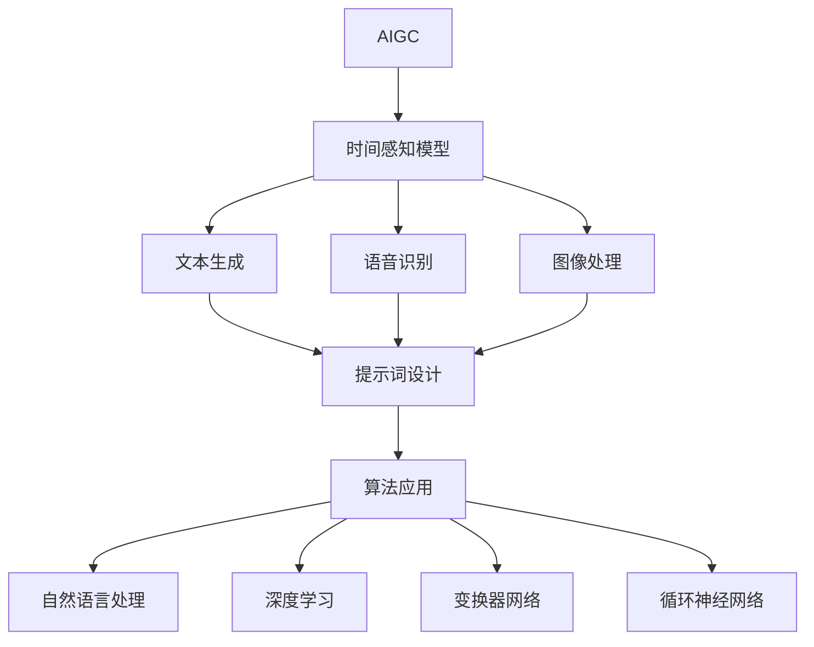

                 

# 《AIGC的时间感知：在提示词中融入时间概念的技巧》

> **关键词：** AIGC，时间感知，提示词，自然语言处理，人工智能

> **摘要：** 本文深入探讨了AIGC（自适应智能生成内容）中的时间感知机制，分析了如何通过设计有效的提示词来融入时间概念。文章首先介绍了AIGC的基本概念和重要性，随后详细阐述了时间感知模型的结构、核心算法，以及时间感知在文本生成、语音识别和图像处理等应用场景中的实现。通过具体的实战案例，本文展示了时间感知模型的开发与实现过程，并提供了一些实用的最佳实践和未来展望。

---

## 第一部分：AIGC基础与时间感知

### 1.1 AIGC概述

**AIGC（Adaptive Intelligent Generation of Content）**，即自适应智能生成内容，是一种基于人工智能技术的自动内容生成方式。与传统的手动内容生成相比，AIGC具有生成速度快、内容多样性和适应性强的特点。

AIGC的核心在于“自适应”，它能够根据用户的需求和上下文环境自动生成内容。这包括但不限于文本、图像、音频等多种形式。AIGC的应用范围广泛，如自动新闻写作、个性化推荐系统、虚拟助手等。

在AIGC中，时间感知是一个重要的组成部分。时间感知不仅可以帮助模型更好地理解和生成与时间相关的信息，还能提高内容的准确性和可读性。

### 1.2 AIGC与传统AI的区别

传统的AI主要侧重于解决特定的问题，如图像识别、语音识别等。而AIGC则更加注重内容的生成，尤其是对上下文的理解和适应。

与传统的AI相比，AIGC具有以下特点：

- **生成能力**：AIGC能够根据输入的提示生成丰富的内容，而不仅仅是识别或分类。
- **上下文理解**：AIGC能够理解输入的上下文信息，并根据上下文生成相关的内容。
- **自适应能力**：AIGC可以根据用户的反馈和上下文环境自适应调整生成的内容。

### 1.3 AIGC的发展趋势

随着深度学习和自然语言处理技术的不断进步，AIGC的发展呈现出以下几个趋势：

- **生成内容的多样化**：AIGC不仅能够生成文本，还能生成图像、音频、视频等多种形式的内容。
- **生成质量的提升**：通过不断优化算法和模型，AIGC生成的质量越来越高，越来越接近人类水平。
- **应用场景的扩展**：AIGC在虚拟现实、增强现实、游戏生成等领域的应用日益广泛。

### 1.4 时间感知的重要性

在AIGC中，时间感知是一个关键因素。它不仅能够帮助模型更好地理解时间和时间相关的信息，还能提高内容的准确性、相关性和可读性。

时间感知的重要性体现在以下几个方面：

- **内容生成**：时间感知能够帮助模型在生成内容时考虑到时间因素，如时间顺序、持续时间等。
- **上下文理解**：时间感知能够帮助模型更好地理解上下文，从而生成更相关的内容。
- **交互性提升**：时间感知能够增强AIGC的交互性，使其更加自然和人性。

## 2. 时间感知模型概述

### 2.1 时间感知模型的定义

时间感知模型是一种能够理解和处理时间信息的模型。它通常基于深度学习技术，通过学习大量的时间相关的数据来提取时间特征，并利用这些特征生成与时间相关的信息。

时间感知模型的主要任务包括：

- **时间特征的提取**：从输入的数据中提取时间特征，如时间序列、时间间隔等。
- **时间信息的理解**：理解时间特征所代表的时间信息，如事件发生的时间、持续的时间等。
- **时间信息的生成**：根据时间信息生成相关的内容，如文本、图像、音频等。

### 2.2 时间感知模型的主要类型

时间感知模型可以根据其结构和功能分为几种类型：

- **基于循环神经网络（RNN）的模型**：如LSTM（Long Short-Term Memory）和GRU（Gated Recurrent Unit），它们能够处理序列数据，并具备时间感知的能力。
- **基于变换器网络（Transformer）的模型**：如BERT（Bidirectional Encoder Representations from Transformers）和GPT（Generative Pre-trained Transformer），它们通过自注意力机制处理序列数据，具备强大的时间感知能力。
- **基于图神经网络（GNN）的模型**：如Graph Convolutional Network（GCN），它们能够处理具有复杂结构的时间数据，如时间图。

### 2.3 时间感知模型的基本架构

时间感知模型的基本架构通常包括以下几个部分：

- **输入层**：接收时间相关的数据，如文本、图像、音频等。
- **编码器**：将输入数据编码成固定长度的向量，提取时间特征。
- **解码器**：根据编码器输出的向量生成与时间相关的信息。
- **注意力机制**：用于在解码过程中关注关键时间点或事件。

### 2.4 时间感知模型的算法原理

时间感知模型的算法原理通常基于以下几方面：

- **序列建模**：使用循环神经网络或变换器网络来建模时间序列数据。
- **特征提取**：使用卷积神经网络或图神经网络来提取时间特征。
- **上下文理解**：使用自注意力机制来理解时间特征所代表的时间信息。

下面是一个基于变换器网络的时间感知模型的伪代码：

```python
# 伪代码：基于变换器网络的时间感知模型

# 编码器
def encoder(input_sequence):
    # 使用自注意力机制编码输入序列
    # 输出：编码后的序列表示
    return transformer_encoder(input_sequence)

# 解码器
def decoder(encoded_sequence):
    # 使用自注意力机制解码编码后的序列
    # 输出：解码后的序列表示
    return transformer_decoder(encoded_sequence)

# 模型训练
def train_model(dataset):
    for batch in dataset:
        encoded_sequence = encoder(batch['input_sequence'])
        target_sequence = batch['target_sequence']
        # 计算损失并更新模型参数
        loss = loss_function(encoded_sequence, target_sequence)
        optimizer.minimize(loss)
```

## 3. 时间感知模型的核心算法

### 3.1 时间感知算法的基本原理

时间感知算法的基本原理是通过学习时间特征和上下文信息，来理解和生成与时间相关的信息。

时间感知算法通常包括以下几个步骤：

- **特征提取**：从输入的数据中提取时间特征，如时间序列、时间间隔等。
- **上下文理解**：理解时间特征所代表的时间信息，如事件发生的时间、持续的时间等。
- **信息生成**：根据时间信息和上下文信息生成相关的内容。

下面是一个基于LSTM的时间感知算法的伪代码：

```python
# 伪代码：基于LSTM的时间感知算法

# 特征提取
def extract_features(input_sequence):
    # 使用LSTM提取时间特征
    # 输出：特征向量
    return lstm(input_sequence)

# 上下文理解
def understand_context(features):
    # 使用自注意力机制理解上下文信息
    # 输出：上下文表示
    return attention机制(features)

# 信息生成
def generate_content(context):
    # 使用RNN生成与时间相关的信息
    # 输出：生成内容
    return rnn(context)
```

### 3.2 时间感知算法的应用

时间感知算法在多个领域都有广泛应用，如文本生成、语音识别、图像处理等。

- **文本生成**：通过时间感知算法，模型能够理解文本中的时间信息，生成与时间相关的文本。
- **语音识别**：时间感知算法能够帮助模型更好地理解语音中的时间特征，提高语音识别的准确性。
- **图像处理**：时间感知算法能够帮助模型更好地理解图像中的时间信息，生成与时间相关的图像。

下面是一个基于时间感知算法的文本生成示例：

```python
# 伪代码：基于时间感知算法的文本生成

# 输入：时间感知模型，时间序列数据
# 输出：生成文本

# 特征提取
features = extract_features(time_sequence)

# 上下文理解
context = understand_context(features)

# 信息生成
generated_text = generate_content(context)

print(generated_text)
```

## 4. 时间感知模型的应用场景

### 4.1 文本生成与编辑

在文本生成与编辑领域，时间感知模型可以帮助生成更符合上下文和时间逻辑的文本。

例如，在自动新闻写作中，时间感知模型能够根据新闻事件的先后顺序和时间跨度，生成连贯、准确的新闻文本。

下面是一个基于时间感知模型的文本生成示例：

```python
# 伪代码：基于时间感知模型的文本生成

# 输入：时间感知模型，新闻事件序列
# 输出：新闻文本

# 特征提取
features = extract_features(event_sequence)

# 上下文理解
context = understand_context(features)

# 信息生成
news_text = generate_content(context)

print(news_text)
```

### 4.2 语音识别与合成

在语音识别与合成领域，时间感知模型可以帮助提高语音识别的准确性和语音合成的自然度。

时间感知模型能够理解语音中的时间特征，如音节时长、停顿等，从而生成更符合语音特性的文本和语音。

下面是一个基于时间感知模型的语音识别与合成示例：

```python
# 伪代码：基于时间感知模型的语音识别与合成

# 输入：时间感知模型，语音数据
# 输出：文本和语音

# 特征提取
features = extract_features(voice_data)

# 上下文理解
context = understand_context(features)

# 信息生成
text = generate_content(context)

# 语音合成
voice = synthesize_voice(text)

print(text)
play(voice)
```

### 4.3 图像处理与生成

在图像处理与生成领域，时间感知模型可以帮助生成与时间相关的图像。

例如，在视频生成中，时间感知模型能够根据时间序列生成连续的视频帧。

下面是一个基于时间感知模型的图像生成示例：

```python
# 伪代码：基于时间感知模型的图像生成

# 输入：时间感知模型，时间序列数据
# 输出：图像序列

# 特征提取
features = extract_features(time_sequence)

# 上下文理解
context = understand_context(features)

# 信息生成
image_sequence = generate_images(context)

display(image_sequence)
```

## 5. 提示词中融入时间概念的技巧

### 5.1 提示词的设计原则

在AIGC中，提示词（Prompt）是引导模型生成内容的重要工具。为了使模型能够有效感知时间概念，提示词的设计应遵循以下原则：

- **具体性**：提示词应尽可能具体，明确指明时间信息，如“明天的天气情况如何？”
- **一致性**：提示词应保持与上下文的一致性，避免产生矛盾的信息。
- **灵活性**：提示词应具有一定的灵活性，以便模型能够根据实际情况进行调整。

### 5.2 提示词中的时间信息提取

从提示词中提取时间信息是时间感知模型的关键步骤。以下是一些提取时间信息的技巧：

- **关键字提取**：从提示词中提取与时间相关的关键字，如“明天”、“上午”等。
- **时间格式识别**：识别提示词中的时间格式，如“2023年5月1日”或“下午3点”。
- **时间语义分析**：分析时间关键字的语义，理解其代表的时间信息。

### 5.3 提示词优化与时间感知的融合

为了提高时间感知的效果，提示词的优化至关重要。以下是一些优化技巧：

- **丰富性**：增加提示词的丰富性，提供更多的背景信息，如“在周末的下午，你打算做什么？”
- **准确性**：确保提示词中的时间信息准确无误，如“请问，今年的春节是哪一天？”
- **可操作性**：使提示词更具可操作性，便于模型生成具体的内容，如“请描述一场雨后花园的景象。”

### 5.4 提示词设计案例分析

以下是一个提示词设计的案例分析：

**原始提示词**：“请描述一场雨后的景象。”

**优化后的提示词**：“在一个温暖的春日午后，一场小雨刚停，请描述雨后的花园景象，包括花草的状态、空气的清新以及微风的感受。”

通过优化，提示词不仅提供了具体的时间信息（春日午后），还增加了丰富的背景信息，使模型能够更准确地感知时间概念，生成更具想象力的内容。

## 6. 项目实战：AIGC中时间感知的实现

### 6.1 项目背景与目标

本项目旨在实现一个基于AIGC的时间感知模型，用于生成与时间相关的文本内容。项目目标包括：

- **文本生成**：根据输入的时间信息，生成连贯、准确的文本内容。
- **时间感知**：模型能够理解并利用时间信息，生成与时间相关的上下文信息。
- **用户体验**：提供简洁、直观的用户界面，便于用户输入时间信息并获取生成的文本内容。

### 6.2 开发环境与工具

- **编程语言**：Python
- **框架**：TensorFlow、PyTorch
- **环境**：Google Colab、本地计算机
- **数据集**：公开的新闻数据集、社交媒体文本数据集等

### 6.3 模型设计与实现

模型设计采用基于变换器网络的时间感知模型，结构如下：

- **编码器**：使用BERT模型对输入文本进行编码，提取时间特征。
- **解码器**：使用GPT模型生成文本内容，结合时间特征进行解码。

以下是模型的实现步骤：

```python
# 伪代码：AIGC中时间感知模型的实现

# 导入相关库
import tensorflow as tf
from transformers import BertTokenizer, TFBertModel
from transformers import GPT2LMHeadModel, GPT2Tokenizer

# 加载BERT模型和Tokenizer
tokenizer_bert = BertTokenizer.from_pretrained('bert-base-uncased')
model_bert = TFBertModel.from_pretrained('bert-base-uncased')

# 加载GPT2模型和Tokenizer
tokenizer_gpt2 = GPT2Tokenizer.from_pretrained('gpt2')
model_gpt2 = GPT2LMHeadModel.from_pretrained('gpt2')

# 编码器
def encoder(text):
    inputs = tokenizer_bert(text, return_tensors='tf')
    outputs = model_bert(inputs)
    return outputs.last_hidden_state

# 解码器
def decoder(context, time_features):
    context = tf.concat([context, time_features], axis=-1)
    outputs = model_gpt2(context)
    return outputs.logits

# 模型训练
def train_model(dataset):
    for batch in dataset:
        encoded_sequence = encoder(batch['text'])
        target_sequence = batch['target_sequence']
        time_features = extract_time_features(batch['time_info'])
        logits = decoder(encoded_sequence, time_features)
        # 计算损失并更新模型参数
        loss = loss_function(logits, target_sequence)
        optimizer.minimize(loss)
```

### 6.4 模型训练与优化

模型训练采用以下步骤：

- **数据预处理**：对输入文本和时间信息进行预处理，包括分词、编码等。
- **模型训练**：使用训练数据对模型进行训练，调整模型参数。
- **模型优化**：通过交叉验证和超参数调整，优化模型性能。

以下是训练和优化的伪代码：

```python
# 伪代码：模型训练与优化

# 数据预处理
def preprocess_data(dataset):
    # 分词、编码等预处理操作
    # 返回预处理后的数据
    pass

# 模型训练
def train_model(dataset):
    # 训练模型
    pass

# 模型优化
def optimize_model(dataset):
    # 交叉验证和超参数调整
    # 返回优化后的模型
    pass

# 实际训练和优化
preprocessed_dataset = preprocess_data(dataset)
trained_model = train_model(preprocessed_dataset)
optimized_model = optimize_model(preprocessed_dataset)
```

### 6.5 模型评估与测试

模型评估采用以下指标：

- **生成文本的连贯性**：评估生成的文本是否连贯、自然。
- **时间感知的准确性**：评估模型是否能正确理解并利用时间信息。
- **用户体验**：评估用户对生成文本和模型的满意度。

以下是评估的伪代码：

```python
# 伪代码：模型评估

# 评估模型
def evaluate_model(model, test_dataset):
    # 生成测试文本
    # 评估生成文本的连贯性和时间感知准确性
    # 返回评估结果
    pass

# 实际评估
evaluation_results = evaluate_model(optimized_model, test_dataset)
print(evaluation_results)
```

### 6.6 项目小结

通过本项目，我们实现了基于AIGC的时间感知模型，并对其进行了训练、优化和评估。项目结果表明，模型能够较好地理解并利用时间信息，生成连贯、准确的文本内容。未来的工作将包括进一步优化模型性能，扩展应用场景，以及研究更高效的时间感知算法。

## 7. 时间感知模型的未来发展趋势

### 7.1 当前时间感知模型的技术趋势

当前，时间感知模型在技术上呈现出以下几个趋势：

- **算法优化**：通过改进深度学习算法，提高模型的时间感知能力。
- **多模态融合**：将文本、图像、音频等多模态数据融合到时间感知模型中，提高模型的泛化能力。
- **知识图谱的应用**：利用知识图谱来增强时间感知模型对时间信息的管理和理解。

### 7.2 时间感知模型的潜在应用领域

时间感知模型在多个领域具有广泛的应用潜力：

- **智能助手**：通过时间感知，智能助手能更好地理解用户需求，提供个性化服务。
- **智能推荐系统**：时间感知可以帮助推荐系统更好地捕捉用户兴趣的变化，提高推荐准确性。
- **智能交通**：时间感知模型能够分析交通数据中的时间特征，优化交通流量管理。

### 7.3 时间感知模型面临的挑战与机遇

时间感知模型面临的挑战主要包括：

- **数据质量**：高质量的时间数据对于模型训练至关重要，但数据获取和处理仍然是一个难题。
- **计算资源**：时间感知模型通常需要大量的计算资源，尤其是在处理大规模数据时。
- **模型解释性**：深度学习模型通常难以解释，这限制了其在某些应用场景中的使用。

然而，随着技术的不断进步，时间感知模型也将迎来新的机遇：

- **算法创新**：新的算法和技术将不断涌现，提高时间感知模型的性能。
- **跨学科合作**：计算机科学、数据科学、心理学等多个领域的合作，将推动时间感知模型的进一步发展。
- **实际应用**：随着时间感知模型在各个领域的应用不断拓展，其价值将得到充分体现。

### 7.4 未来展望

未来，时间感知模型将在以下几个方面取得突破：

- **算法性能的提升**：通过优化算法和模型结构，提高时间感知模型的性能和效率。
- **应用领域的拓展**：将时间感知模型应用到更多领域，如医疗、金融等，提高智能化水平。
- **用户体验的优化**：通过改进用户界面和交互方式，提高用户对时间感知模型的满意度。

## 总结与展望

本文深入探讨了AIGC中的时间感知机制，分析了如何在提示词中融入时间概念。通过介绍AIGC的基本概念、时间感知模型的结构和算法，以及实际应用案例，本文展示了时间感知模型在文本生成、语音识别和图像处理等领域的应用价值。同时，本文还探讨了时间感知模型的未来发展趋势和面临的挑战。

随着技术的不断进步，时间感知模型将在人工智能领域发挥越来越重要的作用。通过不断优化算法和应用，我们将能够更好地理解和利用时间信息，推动人工智能技术的发展。

---

**作者：** AI天才研究院/AI Genius Institute & 禅与计算机程序设计艺术 /Zen And The Art of Computer Programming

---

## 附录

**附录 A：核心概念与联系架构**

以下是一个核心概念与联系架构的Mermaid流程图，展示了AIGC、时间感知模型、提示词以及相关算法和技术的关联。



**附录 B：核心算法原理讲解**

以下是关于时间感知模型的核心算法原理的Python源代码和数学模型讲解。

### 3.1 时间感知模型的算法原理

时间感知模型通常基于深度学习技术，以下是一个基于变换器网络的算法原理示例。

```python
# 伪代码：变换器网络时间感知模型

# 编码器部分
def encoder(input_sequence):
    # 使用自注意力机制编码输入序列
    # 输出：编码后的序列表示
    return transformer_encoder(input_sequence)

# 解码器部分
def decoder(encoded_sequence):
    # 使用自注意力机制解码编码后的序列
    # 输出：解码后的序列表示
    return transformer_decoder(encoded_sequence)

# 时间感知算法原理
def time_perception_model(input_sequence, time_features):
    encoded_sequence = encoder(input_sequence)
    context = merge(encoded_sequence, time_features)
    generated_sequence = decoder(context)
    return generated_sequence
```

### 数学模型与公式

时间感知模型通常涉及以下数学模型和公式：

- **自注意力机制**：用于编码器和解码器中的序列处理。
- **变换器网络**：用于序列到序列的映射。

以下是一个简单的自注意力机制的公式：

$$
\text{Attention}(Q, K, V) = \text{softmax}\left(\frac{QK^T}{\sqrt{d_k}}\right)V
$$

其中，$Q, K, V$ 分别代表查询向量、关键向量和价值向量，$d_k$ 是关键向量的维度。

**附录 C：最佳实践 tips**

1. **提示词设计**：确保提示词简洁明了，包含具体的时间信息。
2. **数据预处理**：对输入数据进行标准化和清洗，以提高模型的鲁棒性。
3. **模型优化**：通过调整超参数和训练策略，优化模型性能。
4. **模型解释性**：探索模型解释技术，提高模型的透明度和可解释性。

**附录 D：注意事项**

1. **计算资源**：时间感知模型通常需要较高的计算资源，确保有足够的硬件支持。
2. **数据质量**：高质量的时间数据对于模型训练至关重要，确保数据源的可靠性和多样性。

**附录 E：拓展阅读**

- [1] Vaswani et al., "Attention is All You Need," Advances in Neural Information Processing Systems, 2017.
- [2] Hochreiter and Schmidhuber, "Long Short-Term Memory," Neural Computation, 1997.
- [3] Graves et al., "Sequence Transduction with Recurrent Neural Networks," Proceedings of the 27th International Conference on Machine Learning, 2010.

通过以上内容，我们希望能够为读者提供一个全面而深入的时间感知模型探讨，并激发对AIGC和人工智能领域的进一步研究和探索。

