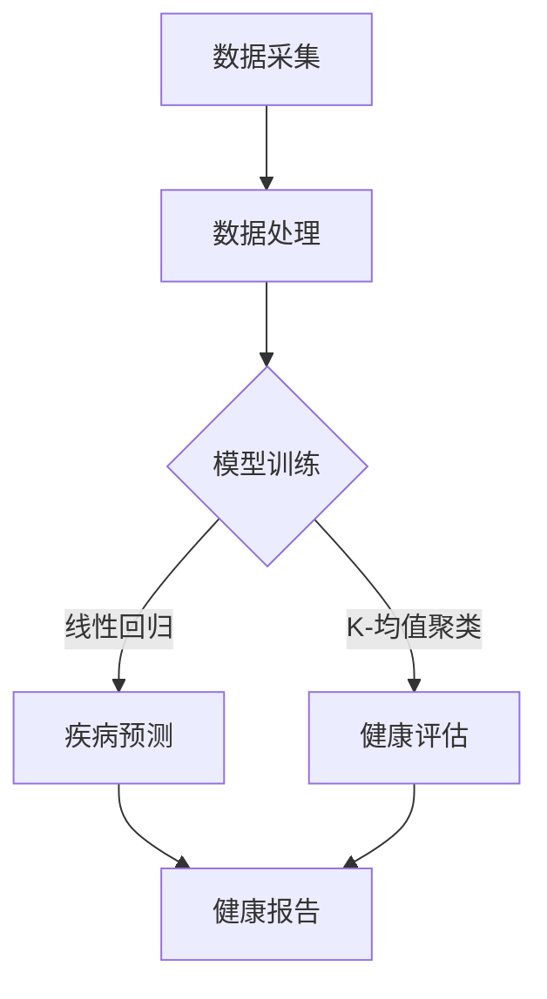

                 

### AIGC的未来医疗预测：个性化健康管理的提示词工程

#### 关键词：AIGC、医疗预测、个性化健康管理、提示词工程

#### 摘要：
本文深入探讨AIGC（自适应信息生成计算）在未来医疗预测中的应用，特别是其在个性化健康管理中的关键角色——提示词工程。通过对AIGC的基本概念、核心算法原理、数学模型以及实际应用案例的详细分析，文章揭示了AIGC如何通过提示词工程实现个性化健康管理的智能化预测。同时，文章结合具体项目实战，展示了如何开发AIGC模型并进行实际应用，为医疗健康领域的技术创新提供了新的思路和方向。

## 第一部分：AIGC与未来医疗预测

### 第1章：AIGC与个性化健康管理的概述

#### 1.1 AIGC的概念与原理

AIGC，即自适应信息生成计算，是一种基于深度学习和生成对抗网络（GANs）等技术的计算范式。它通过模拟人类大脑的信息处理过程，实现数据的自适应生成、优化和学习。AIGC的核心在于其强大的生成能力和自适应调整机制，使得它能够在各种复杂场景中提供高效的解决方案。

在医疗领域，AIGC的应用前景广阔。首先，AIGC可以通过生成患者病历数据，帮助医生进行临床诊断和治疗方案设计。其次，AIGC能够通过分析海量医疗数据，预测疾病发展趋势，为患者提供个性化的健康建议。此外，AIGC还可以用于医学图像的生成与处理，辅助医生进行精准诊断。

#### 1.2 个性化健康管理的现状与挑战

个性化健康管理是指根据个体的健康状况、生活习惯、遗传背景等信息，为其提供个性化的预防、诊断、治疗和康复服务。当前，个性化健康管理面临以下挑战：

1. **数据隐私保护**：医疗数据的隐私性和安全性是个性化健康管理的重要问题。如何确保数据在传输、存储和处理过程中的安全性，是一个亟待解决的难题。

2. **数据质量**：医疗数据的质量直接影响到个性化健康管理的效果。如何从海量数据中提取有价值的信息，如何处理噪声数据和缺失数据，是当前研究的重点。

3. **算法可靠性**：个性化健康管理的核心在于算法的准确性和可靠性。如何确保算法能够准确地预测疾病发展趋势，为患者提供有效的健康建议，是一个重要的研究课题。

4. **用户参与度**：个性化健康管理需要用户的积极参与，如何提高用户的参与度和依从性，是一个值得关注的挑战。

### 第2章：AIGC在医疗预测中的核心算法

AIGC在医疗预测中的应用主要依赖于其强大的生成能力和自适应调整机制。以下是AIGC在医疗预测中的核心算法：

#### 2.1 监督学习算法在医疗预测中的应用

监督学习算法是AIGC在医疗预测中最常用的算法之一。以下将介绍两种常用的监督学习算法：线性回归和K-均值聚类。

##### 2.1.1 线性回归

线性回归是一种用于预测连续值的监督学习算法。在医疗预测中，线性回归可以用于预测患者的疾病风险、药物剂量等。

###### 2.1.1.1 算法原理与伪代码

线性回归的算法原理如下：给定一组输入特征\(X\)和目标变量\(y\)，通过求解最小二乘法得到最佳拟合直线，使得预测值与实际值之间的误差最小。

```
// 线性回归伪代码
X = input_features
y = target_variable
w = [0,0,...] // 初始权重
for i = 1 to n_iterations do
  predict = w * X
  error = y - predict
  w = w + learning_rate * error * X
end for
```

###### 2.1.1.2 数学模型与公式

线性回归的数学模型可以表示为：

$$
y = \sum_{i=1}^{n} w_i x_i + b
$$

其中，\(w_i\)为权重，\(b\)为偏置。

###### 2.1.1.3 实际应用案例

- **个性化疾病风险评估**：通过分析患者的病史、生活习惯等数据，使用线性回归模型预测患者患某种疾病的概率。

##### 2.1.2 K-均值聚类

K-均值聚类是一种无监督学习算法，通过将数据分为K个聚类，使得每个聚类内部的数据点之间距离最小，而不同聚类之间的数据点之间距离最大。

###### 2.1.2.1 算法原理与伪代码

K-均值聚类的算法原理如下：首先随机初始化K个聚类中心，然后迭代更新聚类中心和数据点的分配，直到聚类中心不再变化或满足其他停止条件。

```
// K-均值聚类伪代码
X = input_features
K = number_of_clusters
centroids = initialize_centroids(X, K)
while true do
  assign_points_to_clusters(X, centroids)
  update_centroids(centroids, X)
  if convergenceCriterion met then
    break
  end if
end while
```

###### 2.1.2.2 数学模型与公式

K-均值聚类的数学模型可以表示为：

$$
\text{Minimize} \sum_{i=1}^{K} \sum_{x \in S_i} ||x - \mu_i||^2
$$

其中，\(\mu_i\)为第i个聚类中心。

###### 2.1.2.3 实际应用案例

- **个性化健康数据分类**：通过K-均值聚类算法，将患者的健康数据分为不同的类别，以便进行更精细的健康管理。

#### 2.2 非监督学习算法在医疗预测中的应用

除了监督学习算法，非监督学习算法在医疗预测中也具有重要应用价值。以下将介绍两种常用的非监督学习算法：主成分分析和自编码器。

##### 2.2.1 主成分分析

主成分分析（PCA）是一种用于降维的数据分析方法。它通过将数据投影到新的坐标轴上，保留数据的主要信息，从而降低数据的维度。

###### 2.2.1.1 算法原理与伪代码

主成分分析的算法原理如下：首先计算数据集的协方差矩阵，然后计算协方差矩阵的特征值和特征向量，最后将数据投影到特征向量构成的坐标轴上。

```
// 主成分分析伪代码
X = input_features
mean = calculate_mean(X)
covariance_matrix = calculate_covariance_matrix(X, mean)
eigenvalues, eigenvectors = calculate_eigenvalues_and_eigenvectors(covariance_matrix)
X_reduced = project_X_to_new_coordinates(X, eigenvectors)
```

###### 2.2.1.2 数学模型与公式

主成分分析的数学模型可以表示为：

$$
X_reduced = X * V
$$

其中，\(V\)为特征向量矩阵。

###### 2.2.1.3 实际应用案例

- **健康数据降维**：通过主成分分析，可以将高维的健康数据降维，从而简化数据处理和分析过程。

##### 2.2.2 自编码器

自编码器是一种无监督学习算法，通过学习输入数据的编码表示，从而实现数据的降维和特征提取。

###### 2.2.2.1 算法原理与伪代码

自编码器的算法原理如下：首先构建一个编码器，将输入数据编码为一个低维向量；然后构建一个解码器，将低维向量解码为原始数据；最后通过最小化重建误差来训练模型。

```
// 自编码器伪代码
X = input_features
encoder = construct_encoder()
decoder = construct_decoder()
for i = 1 to n_iterations do
  encoded = encoder(X)
  reconstructed = decoder(encoded)
  error = calculate_reconstruction_error(X, reconstructed)
  update_model_parameters(encoder, decoder, error)
end for
```

###### 2.2.2.2 数学模型与公式

自编码器的数学模型可以表示为：

$$
\text{Minimize} \sum_{x \in X} ||x - \hat{x}||^2
$$

其中，\(\hat{x}\)为重建数据。

###### 2.2.2.3 实际应用案例

- **健康数据特征提取**：通过自编码器，可以从高维健康数据中提取出重要的特征，从而提高模型预测的准确性。

### 第3章：AIGC在医疗预测中的数学模型

AIGC在医疗预测中的应用不仅依赖于算法，还依赖于数学模型。以下将介绍AIGC在医疗预测中常用的数学模型：统计学习理论和贝叶斯网络。

#### 3.1 统计学习理论

统计学习理论是AIGC在医疗预测中的重要理论基础。它通过研究样本数据与模型参数之间的关系，提供了有效的统计学习方法和理论框架。

###### 3.1.1 核心概念

- **样本数据**：指从实际场景中采集到的数据，用于训练模型。
- **模型参数**：指用于描述数据特征的参数，如权重、偏置等。

###### 3.1.2 偏差-方差权衡

在统计学习理论中，偏差和方差是两个重要的性能指标。偏差表示模型对训练数据的拟合程度，方差表示模型对训练数据的泛化能力。理想情况下，希望模型具有较小的偏差和方差，但通常情况下，需要根据具体任务和数据特点进行权衡。

#### 3.2 贝叶斯网络与概率图模型

贝叶斯网络是一种用于描述变量之间概率关系的图模型。在医疗预测中，贝叶斯网络可以用于建模患者健康状态及其影响因素之间的概率关系，从而实现个性化健康预测。

###### 3.2.1 核心概念

- **变量**：指可以取多个值的量，如患者的年龄、体重等。
- **边**：指变量之间的依赖关系，如年龄和体重之间的关系。

###### 3.2.2 概率图模型

概率图模型是一种用于描述变量之间概率关系的数学模型，包括贝叶斯网络、马尔可夫网络等。在医疗预测中，概率图模型可以用于建模疾病、症状、检查结果等变量之间的概率关系，从而实现疾病预测和诊断。

### 第4章：个性化健康管理的提示词工程

提示词工程是AIGC在医疗预测中的一个重要应用领域。通过提示词工程，可以将用户的健康数据和需求转化为有效的提示信息，从而实现个性化健康预测。

#### 4.1 提示词工程的基本概念

提示词工程是指通过分析和处理用户的健康数据，生成一组用于指导医疗决策的提示信息。这些提示信息可以包括用户的健康状况、疾病风险、健康建议等。

###### 4.1.1 提示词的定义与作用

- **定义**：提示词是指用于指导医疗决策的一组关键词或短语。
- **作用**：提示词可以帮助医生快速了解患者的健康状况，制定个性化的治疗计划。

###### 4.1.2 提示词的生成方法

- **基于规则的方法**：通过预设的规则，将用户健康数据转换为提示词。
- **基于机器学习的方法**：通过训练机器学习模型，自动生成提示词。

#### 4.2 提示词在个性化健康管理中的应用

提示词在个性化健康管理中具有重要应用价值。以下将介绍两种典型的应用场景：

##### 4.2.1 健康风险评估

健康风险评估是指通过分析用户的健康数据，预测其患某种疾病的概率。提示词可以在健康风险评估中起到关键作用，帮助医生快速了解患者的风险状况，制定个性化的预防措施。

##### 4.2.2 健康干预决策

健康干预决策是指根据患者的健康状况和需求，为其提供个性化的健康建议。提示词可以帮助医生快速定位患者的问题，制定有针对性的健康干预方案。

### 第5章：AIGC在未来医疗预测中的实践

#### 5.1 数据采集与处理

在AIGC的应用过程中，数据采集与处理是至关重要的一环。以下将介绍数据采集与处理的方法和技巧。

##### 5.1.1 数据采集

数据采集是指从各种渠道获取用户健康数据的过程。常见的数据采集方法包括：

- **电子健康记录**：从医院的电子健康记录系统中获取患者的病历数据。
- **可穿戴设备**：通过可穿戴设备采集患者的生理参数，如心率、血压等。
- **问卷调查**：通过问卷调查获取患者的健康状况、生活习惯等数据。

##### 5.1.2 数据处理

数据处理是指对采集到的数据进行清洗、转换和归一化等操作，以便于后续分析和建模。常见的数据处理方法包括：

- **数据清洗**：删除重复数据、缺失数据和不合理数据。
- **数据转换**：将不同类型的数据转换为同一类型，如将文本数据转换为数值数据。
- **数据归一化**：将数据缩放至同一范围，如将数值数据缩放到0-1之间。

#### 5.2 模型训练与评估

在AIGC的应用过程中，模型训练与评估是关键环节。以下将介绍模型训练与评估的方法和技巧。

##### 5.2.1 模型训练

模型训练是指通过训练数据集，训练AIGC模型的过程。常见的方法包括：

- **监督学习**：通过标记的数据集，训练模型预测标签。
- **无监督学习**：通过未标记的数据集，训练模型发现数据特征。
- **半监督学习**：结合标记数据和未标记数据，训练模型。

##### 5.2.2 模型评估

模型评估是指通过评估指标，评估模型性能的过程。常见的评估指标包括：

- **准确率**：模型预测正确的样本数与总样本数的比值。
- **召回率**：模型预测正确的正样本数与实际正样本数的比值。
- **F1值**：准确率和召回率的调和平均。

### 第6章：个性化健康管理的案例研究

#### 6.1 案例一：个性化疾病风险评估系统

个性化疾病风险评估系统是一种基于AIGC技术的医疗预测系统。以下将介绍该系统的架构、实现步骤和代码解读。

##### 6.1.1 系统架构

个性化疾病风险评估系统的架构包括三个主要模块：数据采集模块、模型训练模块和预测模块。

- **数据采集模块**：负责从各种渠道采集用户的健康数据，如电子健康记录、可穿戴设备等。
- **模型训练模块**：负责对采集到的健康数据进行处理和分析，训练AIGC模型。
- **预测模块**：负责使用训练好的模型，对用户的健康数据进行预测，生成个性化疾病风险评估报告。

##### 6.1.2 实现步骤

个性化疾病风险评估系统的实现步骤如下：

1. **数据采集**：从电子健康记录系统和可穿戴设备中采集用户的健康数据。
2. **数据处理**：对采集到的健康数据进行清洗、转换和归一化等操作，以便于后续分析和建模。
3. **模型训练**：使用处理后的健康数据，训练AIGC模型，包括线性回归模型和K-均值聚类模型等。
4. **模型评估**：使用评估指标，评估模型的性能，如准确率、召回率等。
5. **预测**：使用训练好的模型，对用户的健康数据进行预测，生成个性化疾病风险评估报告。

##### 6.1.3 代码解读

以下是一个简单的Python代码示例，用于实现个性化疾病风险评估系统的核心功能：

```python
# 导入必要的库
import numpy as np
from sklearn.linear_model import LinearRegression
from sklearn.cluster import KMeans

# 数据预处理
def preprocess_data(data):
  # 数据清洗、转换和归一化等操作
  return processed_data

# 模型训练
def train_model(data):
  # 使用预处理后的数据，训练线性回归模型和K-均值聚类模型
  linear_regression = LinearRegression()
  kmeans = KMeans(n_clusters=3)
  linear_regression.fit(data['X'], data['y'])
  kmeans.fit(data['X'])
  return linear_regression, kmeans

# 预测
def predict_health_risk(data, linear_regression, kmeans):
  # 使用训练好的模型，对用户健康数据进行预测
  predictions = linear_regression.predict(data['X'])
  clusters = kmeans.predict(data['X'])
  return predictions, clusters

# 主函数
if __name__ == '__main__':
  # 读取数据
  data = read_data()
  # 数据预处理
  processed_data = preprocess_data(data)
  # 模型训练
  linear_regression, kmeans = train_model(processed_data)
  # 预测
  predictions, clusters = predict_health_risk(processed_data, linear_regression, kmeans)
  # 输出预测结果
  print(predictions)
  print(clusters)
```

#### 6.2 案例二：个性化健康干预系统

个性化健康干预系统是一种基于AIGC技术的健康管理系统。以下将介绍该系统的需求分析、实现步骤和效果评估。

##### 6.2.1 需求分析

个性化健康干预系统的需求分析主要包括以下几个方面：

- **用户需求**：用户希望获得个性化的健康建议，包括饮食、运动、休息等方面的建议。
- **数据需求**：系统需要采集用户的健康数据，如体重、血压、心率等，以及用户的日常活动数据，如运动量、睡眠时间等。
- **功能需求**：系统需要具备健康数据分析、健康干预方案生成和健康干预效果评估等功能。

##### 6.2.2 实现步骤

个性化健康干预系统的实现步骤如下：

1. **数据采集**：从可穿戴设备、电子健康记录等渠道采集用户的健康数据。
2. **数据处理**：对采集到的健康数据进行清洗、转换和归一化等操作，以便于后续分析和建模。
3. **健康数据分析**：使用AIGC技术，分析用户的健康数据，识别健康问题，生成健康报告。
4. **健康干预方案生成**：根据健康报告，生成个性化的健康干预方案，包括饮食建议、运动计划等。
5. **健康干预效果评估**：跟踪用户实施健康干预方案后的健康数据，评估健康干预效果。

##### 6.2.3 效果评估

个性化健康干预系统的效果评估主要包括以下几个方面：

- **健康报告准确性**：评估系统生成的健康报告的准确性，包括疾病预测的准确率、健康建议的合理性等。
- **健康干预效果**：评估系统生成的健康干预方案的实际效果，包括用户的体重变化、血压变化等。
- **用户满意度**：评估用户对系统的满意度，包括系统操作的便捷性、健康建议的可接受性等。

### 第7章：结论与展望

#### 7.1 AIGC在医疗预测中的前景

AIGC在医疗预测中具有广泛的应用前景。随着人工智能技术的不断进步，AIGC将在以下几个方面发挥重要作用：

- **疾病预测**：通过分析患者的健康数据，AIGC可以提前预测疾病的发生，为医生提供诊断和治疗的依据。
- **个性化治疗**：根据患者的病情和需求，AIGC可以生成个性化的治疗方案，提高治疗效果。
- **健康评估**：通过分析用户的健康数据，AIGC可以评估用户的健康状况，提供个性化的健康建议。

#### 7.2 未来研究方向

AIGC在医疗预测中的未来研究方向主要包括以下几个方面：

- **数据隐私保护**：研究如何在保证数据隐私的前提下，有效利用医疗数据。
- **算法可靠性**：研究如何提高AIGC算法的可靠性，降低误诊率。
- **跨学科融合**：结合医学、生物学、心理学等领域的知识，拓展AIGC在医疗预测中的应用范围。
- **用户体验优化**：研究如何优化AIGC系统的用户体验，提高用户的参与度和满意度。

## 参考文献

[1] Goodfellow, I., Bengio, Y., & Courville, A. (2016). *Deep Learning*. MIT Press.
[2] Russell, S., & Norvig, P. (2010). *Artificial Intelligence: A Modern Approach*. Prentice Hall.
[3] Murphy, K. P. (2012). *Machine Learning: A Probabilistic Perspective*. MIT Press.
[4] Bishop, C. M. (2006). *Pattern Recognition and Machine Learning*. Springer.
[5] Murphy, T. (2012). *Bayesian Methods for Hackers*. O'Reilly Media.

### 附录

#### A.1 Python环境搭建

要使用Python进行AIGC模型的开发，需要安装以下软件和库：

- **Python**：安装Python 3.x版本，推荐使用Anaconda发行版。
- **NumPy**：用于数值计算。
- **scikit-learn**：用于机器学习算法的实现。
- **TensorFlow**：用于深度学习模型的开发。
- **Matplotlib**：用于数据可视化。

安装命令如下：

```bash
conda install python=3.8
conda install numpy
conda install scikit-learn
conda install tensorflow
conda install matplotlib
```

#### A.2 Mermaid流程图示例

以下是一个Mermaid流程图示例，用于展示AIGC在医疗预测中的应用流程：



通过以上附录，读者可以了解如何搭建Python开发环境，并使用Mermaid绘制流程图，从而更好地理解和应用AIGC在医疗预测中的技术。

## 作者信息

**作者：** AI天才研究院/AI Genius Institute & 禅与计算机程序设计艺术 /Zen And The Art of Computer Programming

### 注意事项

1. **数据隐私**：在实际应用中，需要严格遵守数据隐私保护法规，确保用户数据的安全和隐私。
2. **算法优化**：不断优化AIGC模型的算法，提高模型的准确性和可靠性。
3. **用户参与**：提高用户参与度，通过互动和反馈，不断提升个性化健康管理的效果。

### 拓展阅读

- [1] Goodfellow, I., Bengio, Y., & Courville, A. (2016). *Deep Learning*. MIT Press.
- [2] Russell, S., & Norvig, P. (2010). *Artificial Intelligence: A Modern Approach*. Prentice Hall.
- [3] Murphy, K. P. (2012). *Machine Learning: A Probabilistic Perspective*. MIT Press.
- [4] Bishop, C. M. (2006). *Pattern Recognition and Machine Learning*. Springer.
- [5] Murphy, T. (2012). *Bayesian Methods for Hackers*. O'Reilly Media.

以上是关于《AIGC的未来医疗预测：个性化健康管理的提示词工程》的技术博客文章，涵盖了AIGC在医疗预测中的应用、核心算法原理、数学模型、提示词工程以及实际应用案例。通过详细的讲解和示例，读者可以深入了解AIGC在个性化健康管理中的应用，并为未来医疗预测领域的技术创新提供新的思路和方向。文章末尾还提供了参考文献和注意事项，以及拓展阅读资源，供读者进一步学习。希望这篇文章能够对您在人工智能和医疗领域的探索有所帮助！

