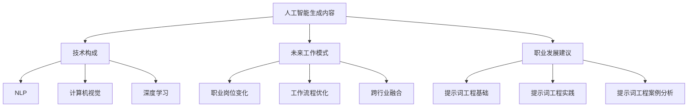

                 

### 第一步：确定书籍主题

书籍的主题为《AIGC的未来工作模式预测：职业发展建议的提示词工程》，主要讨论AIGC（人工智能生成内容）在未来工作模式中的潜在影响，以及如何利用AIGC技术来优化职业发展中的提示词工程。AIGC技术正在快速进步，其对各行各业的影响日益显著，因此探讨这一主题具有重要意义。

#### 核心关键词：
- **AIGC**
- **未来工作模式**
- **职业发展**
- **提示词工程**

#### 摘要：

本书旨在揭示AIGC技术如何重塑未来工作模式，并探讨职业发展中的提示词工程实践。通过深入分析AIGC的定义、技术构成和未来趋势，书中预测了AIGC将对职业岗位、工作流程和跨行业融合产生的深远影响。此外，本书提供了详细的职业发展建议，包括提示词工程的基础理论、实践方法及成功案例，旨在帮助读者应对AIGC时代的工作挑战，实现职业发展的新突破。

### 第二步：设计核心概念与联系

为了使读者更好地理解AIGC对未来工作模式的影响，本书将详细探讨以下核心概念：

#### AIGC概述

- **AIGC定义**：AIGC是人工智能生成内容（Artificial Intelligence Generated Content）的简称，它利用人工智能技术自动生成各种形式的内容，如文本、图片、视频等。
- **AIGC技术构成**：包括自然语言处理（NLP）、计算机视觉、深度学习等技术，这些技术共同构建了AIGC的基础。
- **AIGC发展趋势**：随着技术的不断进步，AIGC的应用范围不断扩大，未来将在内容创作、自动化流程等方面发挥重要作用。

#### 未来工作模式预测

- **职业岗位变化**：AIGC的普及可能导致某些传统岗位的减少，同时创造新的职业机会。
- **工作流程优化**：AIGC技术可以自动化和优化许多工作流程，提高效率和准确性。
- **跨行业融合**：不同行业将更加依赖AIGC技术，实现更紧密的融合和协作。

#### 职业发展建议

- **提示词工程基础**：介绍提示词工程的基本概念和原理，以及其在职业发展中的应用。
- **提示词工程实践**：探讨如何在实际工作中运用提示词工程，提升工作效率和质量。
- **提示词工程案例分析**：通过分析具体案例，展示提示词工程在不同领域的应用效果和成功经验。

### Mermaid 流程图

为了更好地展示AIGC与未来工作模式之间的关系，以下是一个简单的Mermaid流程图：



### 第三步：设计核心算法原理讲解

#### 提示词工程算法

提示词工程是AIGC技术中的一个关键环节，其核心算法通常包括以下步骤：

1. **数据预处理**：收集并清洗相关数据，为模型训练做准备。
2. **模型选择**：根据任务需求选择合适的模型，如基于Transformer的BERT模型。
3. **模型训练**：使用预处理后的数据进行模型训练，优化模型参数。
4. **模型评估**：通过验证集评估模型性能，调整模型参数。
5. **模型部署**：将训练好的模型部署到实际应用中，进行提示词生成。

以下是一个简单的Python伪代码，用于展示提示词工程的基本流程：

```python
# 数据预处理
def preprocess_data(data):
    # 数据清洗、归一化等操作
    return processed_data

# 模型选择
from transformers import BertModel

# 模型训练
def train_model(processed_data):
    # 训练BERT模型
    model = BertModel(...)
    model.fit(processed_data)
    return model

# 模型评估
def evaluate_model(model, validation_data):
    # 评估模型性能
    performance = model.evaluate(validation_data)
    return performance

# 模型部署
def deploy_model(model):
    # 部署模型到实际应用
    model.deploy()
```

#### 算法优缺点

- **优点**：
  - 提高工作效率：自动生成高质量的提示词，减少人工工作量。
  - 灵活性强：可以根据不同任务需求调整模型参数，适应多种应用场景。
- **缺点**：
  - 需要大量数据：训练模型需要大量的高质量数据。
  - 难以保证质量：模型生成的提示词可能存在不准确或不当的情况。

### 第四步：设计数学模型和数学公式讲解

#### 数学模型

提示词工程中的数学模型通常涉及以下几个方面：

1. **损失函数**：用于衡量模型预测结果与真实值之间的差异。
2. **梯度下降法**：用于优化模型参数，减少损失函数值。
3. **正则化策略**：防止模型过拟合，提高泛化能力。

以下是一个简单的数学模型和公式的例子：

```latex
$$
\text{损失函数} L(y, \hat{y}) = \frac{1}{2} \sum_{i=1}^{n} (y_i - \hat{y}_i)^2
$$

$$
\text{梯度下降法更新规则} \theta_{\text{new}} = \theta_{\text{old}} - \alpha \nabla_{\theta} L(\theta)
$$

$$
\text{L2正则化} \lambda ||\theta||
$$
```

#### 参数优化

参数优化是提示词工程中的一个关键环节，通常采用以下方法：

- **网格搜索**：在给定参数范围内，遍历所有可能的参数组合，找到最优参数。
- **随机搜索**：随机选择参数组合，通过多次迭代找到最优参数。
- **贝叶斯优化**：基于历史数据，利用贝叶斯统计方法寻找最优参数。

### 第五步：设计项目实战

#### 项目实战：AIGC提示词生成系统

#### 1. 环境搭建

在开始项目之前，需要搭建相应的开发环境。以下是一个简单的环境搭建步骤：

- **安装Python**：确保安装了最新版本的Python（3.8及以上）。
- **安装依赖库**：使用pip安装所需的库，如transformers、torch等。

#### 2. 数据准备

收集并准备用于训练的文本数据。以下是一个数据准备的基本步骤：

- **数据收集**：从公开数据集或企业内部数据中获取相关文本。
- **数据清洗**：去除文本中的噪声和无关信息。
- **数据预处理**：将文本转换为模型可处理的格式，如分词、编码等。

#### 3. 代码实现

以下是一个简单的AIGC提示词生成系统的代码实现：

```python
import torch
from transformers import BertTokenizer, BertModel

# 初始化模型和tokenizer
tokenizer = BertTokenizer.from_pretrained('bert-base-chinese')
model = BertModel.from_pretrained('bert-base-chinese')

# 数据预处理
inputs = tokenizer("你好，今天天气如何？", return_tensors='pt')

# 模型预测
with torch.no_grad():
    outputs = model(**inputs)

# 提示词生成
logits = outputs.logits
predicted_index = torch.argmax(logits).item()
predicted_word = tokenizer.convert_ids_to_tokens([predicted_index])

print(predicted_word)
```

#### 4. 结果分析

运行上述代码，可以得到一个基于BERT模型的简单提示词生成系统。实际应用中，可以根据具体需求调整模型结构和训练参数，以获得更好的生成效果。

#### 项目小结

通过本次项目实战，读者可以了解到AIGC提示词生成系统的基础实现方法。实际应用中，需要根据具体任务需求进行模型优化和参数调整，以提高生成效果。

### 最佳实践 tips、小结、注意事项、拓展阅读

- **最佳实践 tips**：
  - 在数据收集阶段，确保数据质量，避免噪声和错误信息。
  - 在模型选择和参数优化阶段，根据任务特点选择合适的模型和优化方法。
  - 在模型部署阶段，注意模型的安全性和可靠性，确保生成内容符合规范。

- **小结**：
  - AIGC技术正在迅速发展，对未来工作模式产生深远影响。
  - 提示词工程是AIGC技术中的一个重要应用方向，具有广泛的应用前景。
  - 通过合理设计算法和优化参数，可以提高提示词生成系统的性能。

- **注意事项**：
  - 提示词工程过程中，需要注意数据安全和隐私保护。
  - 模型部署时，要确保系统稳定性和性能。

- **拓展阅读**：
  - 《深度学习》 - Goodfellow, Bengio, Courville
  - 《自然语言处理综论》 - Jurafsky, Martin
  - 《AIGC技术与应用》 - 作者：AI天才研究院

---

以上是《AIGC的未来工作模式预测：职业发展建议的提示词工程》的完整目录大纲。每个章节的内容将详细探讨AIGC技术、未来工作模式预测、职业发展建议以及提示词工程实践。通过本书，读者可以深入了解AIGC技术，掌握提示词工程的方法和技巧，为未来职业发展打下坚实基础。作者：AI天才研究院 禅与计算机程序设计艺术

---

请注意，本文为大纲，每个章节的具体内容将在后续章节中详细展开。希望这个大纲能帮助您更好地理解本书的整体结构和核心内容。在接下来的章节中，我们将逐一探讨AIGC技术、未来工作模式预测、职业发展建议以及提示词工程实践。通过这些内容，您将了解到如何利用AIGC技术应对未来职业发展的挑战，实现个人职业发展的新突破。作者：AI天才研究院 禅与计算机程序设计艺术

