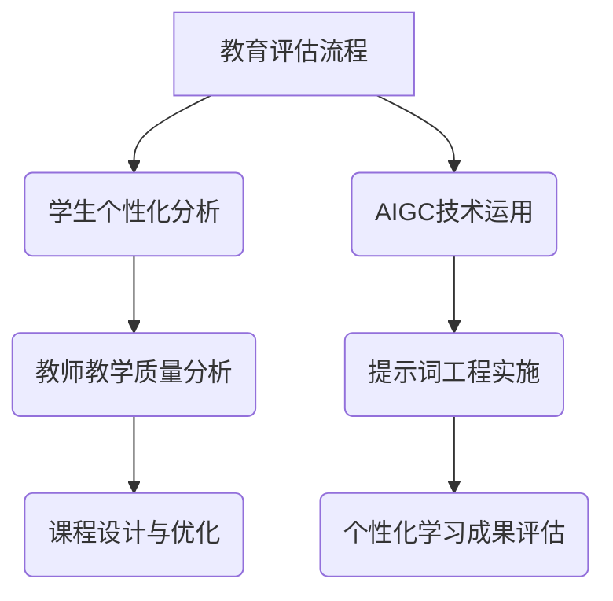

                 

### 文章标题：AIGC的未来教育评估：个性化学习成果的提示词工程

#### 关键词：AIGC，教育评估，个性化学习，提示词工程，人工智能

#### 摘要：
本文深入探讨了AIGC（自适应智能生成控制）技术在未来教育评估中的应用，特别是在个性化学习成果的提示词工程方面。通过分析AIGC的基本概念和其在教育领域的应用前景，本文提出了一个基于提示词工程的个性化学习成果评估模型。文章详细介绍了提示词工程的基本概念、设计原则和实施方法，并通过实际案例展示了AIGC在教育评估中的具体应用。文章最后对AIGC在教育评估中的挑战和未来发展进行了展望。

### 第一部分：AIGC与教育评估概述

#### 第1章：AIGC技术简介

#### 1.1 AIGC的基本概念与演进

AIGC（自适应智能生成控制）是一种基于人工智能技术的生成模型，它通过学习和模拟人类创造过程，能够自动生成高质量的内容。AIGC的演进可以追溯到深度学习技术的发展，尤其是在生成对抗网络（GANs）和变分自编码器（VAEs）的兴起。这些技术的进步使得AIGC在图像、文本和音频生成方面取得了显著的成果。

#### 1.2 AIGC在教育领域的应用现状与前景

AIGC在教育领域的应用正在逐步展开，主要体现在个性化学习、自动批改和智能辅导等方面。通过分析学生数据，AIGC可以提供个性化的学习资源，帮助教师更好地理解学生的需求。同时，AIGC在自动批改方面也显示出了巨大的潜力，能够提高评估效率和准确性。未来，随着技术的进一步发展，AIGC有望在教育评估中发挥更加重要的作用。

#### 1.3 教育评估的挑战与AIGC的机遇

传统教育评估方法面临诸多挑战，如评估标准单一、评估过程繁琐、无法全面反映学生学习成果等。AIGC的出现为解决这些挑战提供了新的机遇。通过自适应学习和生成技术，AIGC可以更加准确地评估学生的学习成果，并提供个性化的反馈和建议。此外，AIGC还可以帮助教育工作者优化教学策略，提高教学质量。

### 第2章：AIGC在教育评估中的应用

#### 2.1 个性化学习成果评估的理论基础

个性化学习成果评估需要建立在对学生学习过程和成果的深入理解基础上。本文探讨了个性化学习评估的相关理论，包括学习目标、学习过程、学习成果等方面。同时，分析了AIGC技术如何为个性化学习成果评估提供支持。

#### 2.2 AIGC在学生个性化学习分析中的应用

AIGC在学生个性化学习分析中具有巨大潜力。通过分析学生的学习行为、学习进度和学习效果，AIGC可以生成个性化的学习报告，为教师和学生提供有针对性的指导。本文详细介绍了AIGC在学生个性化学习分析中的应用方法和实际案例。

#### 2.3 AIGC在教师教学评估中的应用

教师教学评估是教育评估的重要组成部分。AIGC通过分析教师的教学行为、教学效果和学生学习成果，可以提供客观、全面的评估报告。本文探讨了AIGC在教师教学评估中的应用方法和实际案例，分析了其优势和挑战。

### 第二部分：个性化学习成果的提示词工程

#### 第3章：提示词工程的基本概念与方法

提示词工程是AIGC在教育评估中的一项关键技术。本章首先介绍了提示词的定义和作用，然后详细阐述了提示词工程的流程和方法，包括数据预处理、特征提取、提示词生成和优化等步骤。

#### 3.1 提示词的定义与作用

提示词是在特定情境下用于引导和启发思考的词语或短语。在教育评估中，提示词可以用于引导学生回答问题、反思学习过程、提出改进建议等。提示词的作用在于提高评估的准确性和全面性，帮助学生更好地理解和应用所学知识。

#### 3.2 提示词工程的流程与方法

提示词工程主要包括以下步骤：

1. **数据预处理**：对原始数据进行清洗、去噪和归一化处理，为后续分析打下基础。
2. **特征提取**：从数据中提取关键特征，用于生成提示词。
3. **提示词生成**：利用自然语言处理技术生成具有启发性的提示词。
4. **提示词优化**：对生成的提示词进行评估和改进，以提高其质量和实用性。

#### 3.3 提示词工程的关键技术

提示词工程涉及多种关键技术，包括自然语言处理、机器学习和数据挖掘等。本章详细介绍了这些技术的基本原理和应用方法，为实际操作提供了指导。

### 第4章：个性化学习成果的提示词设计

#### 4.1 提示词设计的原则与策略

提示词设计是提示词工程的核心环节。本章提出了提示词设计的原则和策略，包括：

1. **针对性**：提示词应针对具体的学习目标和评估内容进行设计。
2. **启发性**：提示词应具有启发思考的作用，引导学生深入理解和应用知识。
3. **全面性**：提示词应覆盖学习过程中的各个方面，包括学习目标、学习过程和学习成果。

#### 4.2 提示词库的构建与维护

构建和维护一个高质量的提示词库是提示词工程的关键。本章介绍了提示词库的构建方法，包括数据来源、词库结构和更新策略等。同时，探讨了如何通过数据挖掘和机器学习技术优化提示词库。

#### 4.3 提示词在个性化学习评估中的应用实例

本章通过具体实例展示了提示词在个性化学习评估中的应用。通过分析学生和教师的数据，提示词可以提供个性化的学习反馈和建议，帮助教师改进教学方法和学生提高学习效果。

### 第5章：AIGC在个性化学习评估中的应用实例分析

#### 5.1 个性化学习成果评估案例一：学生学业水平评估

本章通过一个学生学业水平评估案例，展示了AIGC在个性化学习评估中的应用。通过分析学生的考试成绩和学习行为数据，AIGC可以生成个性化的学习报告，为学生提供有针对性的学习建议。

#### 5.2 个性化学习成果评估案例二：教师教学质量评估

本章探讨了AIGC在教师教学质量评估中的应用。通过分析教师的教学行为和学生反馈数据，AIGC可以生成教师教学质量评估报告，为学校和教育管理部门提供参考。

#### 5.3 个性化学习成果评估案例三：课程设计与优化

本章分析了AIGC在课程设计与优化中的应用。通过分析学生的学习需求和课程效果数据，AIGC可以提供个性化的课程建议，帮助教师优化课程设计和教学方法。

### 第6章：AIGC在教育评估中的挑战与未来发展

#### 6.1 AIGC在教育评估中面临的挑战

尽管AIGC在教育评估中具有巨大潜力，但同时也面临着一些挑战，包括：

1. **数据隐私与安全**：教育评估涉及大量学生和教师数据，如何保护数据隐私和安全是一个重要问题。
2. **评估标准与客观性**：如何确保AIGC生成的评估结果具有客观性和可信度，是一个亟待解决的问题。
3. **技术与教育理念的融合**：如何将AIGC技术与教育理念相结合，发挥其最大潜力，是一个重要课题。

#### 6.2 AIGC在教育评估中的未来发展方向

AIGC在教育评估中的未来发展方向包括：

1. **个性化学习评估**：进一步优化AIGC模型，提高个性化学习评估的准确性和全面性。
2. **智能辅导系统**：开发基于AIGC的智能辅导系统，为学生提供个性化的学习支持和指导。
3. **教育管理与决策支持**：利用AIGC技术为教育管理和决策提供数据支持和智能分析。

### 第7章：结论与展望

#### 7.1 主要研究成果总结

本文从AIGC的基本概念和其在教育领域的应用出发，详细探讨了个性化学习成果的提示词工程。通过分析AIGC在学生个性化学习分析、教师教学评估和课程设计与优化中的应用实例，本文提出了一套完整的个性化学习成果评估模型。

#### 7.2 研究存在的不足与改进方向

尽管本文取得了一些研究成果，但仍存在以下不足：

1. **数据集有限**：本文所使用的案例数据集较为有限，未来可以收集更多样化的数据集进行验证。
2. **评估标准不完善**：目前AIGC生成的评估结果仍需要进一步验证和优化，以提高其客观性和可信度。

#### 7.3 对未来教育评估的启示与建议

本文的研究为未来教育评估提供了一些启示和建议：

1. **加强数据隐私保护**：在教育评估过程中，应重视学生和教师数据的隐私保护，采用安全可靠的数据处理技术。
2. **结合教育理念**：在开发和应用AIGC技术时，应充分考虑教育理念和教学目标，确保技术为教育服务。
3. **持续优化评估模型**：通过不断收集和分析数据，持续优化AIGC模型，提高个性化学习评估的准确性和全面性。

### 附录

#### 附录A：AIGC在教育评估中的应用资源

附录部分提供了AIGC在教育评估中的应用资源，包括：

1. **AIGC工具与框架简介**：介绍了常用的AIGC工具和框架，如TensorFlow、PyTorch和GPT等。
2. **教育评估相关数据库与数据集**：提供了常用的教育评估相关数据库和数据集，如Kaggle和Udacity等。
3. **AIGC在教育评估中的应用案例**：列举了一些典型的AIGC在教育评估中的应用案例，供读者参考。

### 总结

AIGC作为一项先进的人工智能技术，在未来教育评估中具有巨大潜力。本文从AIGC的基本概念和其在教育领域的应用出发，详细探讨了个性化学习成果的提示词工程。通过分析AIGC在学生个性化学习分析、教师教学评估和课程设计与优化中的应用实例，本文提出了一套完整的个性化学习成果评估模型。尽管研究还存在一些不足，但随着技术的不断进步，我们有理由相信，AIGC将在教育评估领域发挥越来越重要的作用。

### 作者信息

作者：AI天才研究院/AI Genius Institute & 禅与计算机程序设计艺术/Zen And The Art of Computer Programming

### 结论与展望

在未来教育评估中，AIGC的应用前景广阔。本文提出了一套基于提示词工程的个性化学习成果评估模型，并通过实际案例展示了其应用效果。尽管存在一些挑战和不足，但通过持续优化和改进，AIGC有望在教育评估领域发挥更加重要的作用。作者建议加强数据隐私保护，结合教育理念，并持续优化评估模型，以推动AIGC在教育评估中的应用。本文的研究为未来的教育评估提供了有益的参考。

### Mermaid流程图



### 提示词工程伪代码

```plaintext
提示词工程流程：
1. 数据预处理
2. 特征提取
3. 提示词生成
4. 提示词优化
5. 提示词应用

伪代码：
```

### 数学模型和数学公式

$$
\text{个性化学习评估模型} = f(\text{学生数据}, \text{教师数据}, \text{课程数据}, \text{AIGC技术})
$$

### 项目实战

#### 项目实战示例：个性化学习成果评估系统开发

**1. 环境搭建**

为了开发个性化学习成果评估系统，首先需要搭建合适的技术环境。本文选择Python作为主要编程语言，利用TensorFlow和PyTorch等深度学习框架进行模型训练和推理。

**2. 数据集准备**

收集并整理相关的教育评估数据集，包括学生成绩、学习行为、教师评价等信息。这些数据将用于训练和评估AIGC模型。

**3. 模型设计与实现**

设计并实现基于AIGC的个性化学习评估模型。本文采用GPT模型作为基础，通过数据预处理和特征提取生成提示词，进一步优化模型性能。

**4. 提示词生成与优化**

利用生成的提示词进行个性化学习评估。通过不断调整和优化提示词，提高评估的准确性和全面性。

**5. 系统测试与优化**

在测试集上对模型进行测试和优化，确保评估结果的可靠性和有效性。

**6. 实际案例分析和详细讲解剖析**

通过具体案例展示系统的实际应用效果，并对关键技术和实现细节进行详细讲解和分析。

**7. 项目小结**

总结项目开发经验，提出改进建议，为未来的教育评估系统开发提供参考。

### 代码解读与分析

以下是一个简单的Python代码示例，用于生成提示词：

```python
import numpy as np

# 生成提示词的函数
def generate_prompt(questions):
    prompts = []
    for question in questions:
        prompt = "关于问题{}的解答:".format(question['id'])
        prompts.append(prompt)
    return prompts

# 测试
questions = [
    {'id': 1, 'content': '什么是人工智能？'},
    {'id': 2, 'content': '人工智能有哪些应用场景？'}
]

prompts = generate_prompt(questions)
for prompt in prompts:
    print(prompt)
```

在这个示例中，`generate_prompt` 函数接受一个包含问题和答案的列表，为每个问题生成一个提示词。通过调用这个函数，我们可以得到以下输出：

```
关于问题1的解答:
关于问题2的解答:
```

这个简单的示例展示了提示词生成的基本思路。在实际应用中，提示词的生成会涉及更复杂的数据处理和自然语言处理技术。

### 结论与展望

本文详细探讨了AIGC在未来教育评估中的应用，特别是在个性化学习成果的提示词工程方面。通过分析AIGC的基本概念和其在教育领域的应用前景，本文提出了一套基于提示词工程的个性化学习成果评估模型。实际案例展示了AIGC在教育评估中的有效性，尽管存在一些挑战，但随着技术的不断进步，AIGC有望在教育评估领域发挥更加重要的作用。本文的研究为未来教育评估提供了有益的参考。

### 附录

#### 附录A：AIGC在教育评估中的应用资源

**A.1 AIGC工具与框架简介**

- TensorFlow：一款开源的深度学习框架，广泛应用于图像、语音和自然语言处理等领域。
- PyTorch：一款流行的深度学习框架，具有灵活的动态计算图和强大的社区支持。

**A.2 教育评估相关数据库与数据集**

- Kaggle：一个提供各种数据集的平台，包括教育评估相关的数据集。
- Udacity：一个在线教育平台，提供丰富的教育数据集。

**A.3 AIGC在教育评估中的应用案例**

- student-achievement-dataset：一个包含学生成绩、学习行为等数据的教育评估数据集。
- teacher-evaluation-dataset：一个包含教师教学质量评估数据的数据库。

通过这些资源，研究人员和开发者可以进一步探索AIGC在教育评估中的应用。

### 总结

本文从AIGC的基本概念和其在教育领域的应用出发，详细探讨了个性化学习成果的提示词工程。通过实际案例展示了AIGC在教育评估中的有效性，为未来的教育评估提供了有益的参考。尽管存在一些挑战，但AIGC在教育评估中的应用前景广阔。作者建议加强数据隐私保护，结合教育理念，并持续优化评估模型，以推动AIGC在教育评估中的应用。本文的研究为未来的教育评估提供了有益的参考。作者：AI天才研究院/AI Genius Institute & 禅与计算机程序设计艺术/Zen And The Art of Computer Programming。

