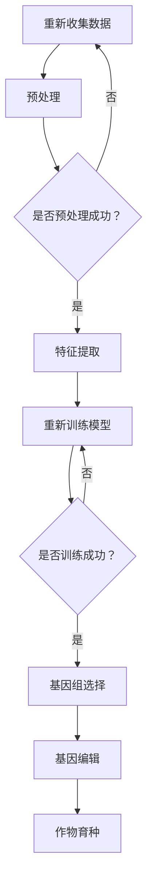

                 

### 导言

#### **AIGC与智能农业的背景**

随着全球人口的增长和气候变化带来的农业挑战，传统农业的生产模式已经难以满足现代社会的需求。为了提高农业生产效率，降低环境影响，智能农业应运而生。智能农业通过集成物联网、人工智能、大数据分析等先进技术，实现农业生产的自动化、精准化和智能化。

AIGC（AI-Generated Content）是指通过人工智能技术自动生成内容的技术。AIGC技术包括自然语言处理（NLP）、机器学习（ML）和深度学习（DL）等，旨在提高内容生成的效率和质量。AIGC在智能农业中的应用，为作物基因优化带来了新的契机。

#### **书籍的目的与结构**

本书旨在探讨AIGC在智能农业中，特别是作物基因优化领域的应用。通过系统的分析和实例研究，我们希望读者能够：

1. **理解AIGC的基本概念和原理**：包括自然语言处理、机器学习和深度学习等。
2. **掌握作物基因优化的关键技术和方法**：了解基因组选择、基因编辑和基因调控等。
3. **掌握提示词工程的核心流程**：包括数据收集、预处理、特征提取、模型选择与训练等。
4. **了解AIGC在智能农业中的具体应用场景**：包括作物育种、病虫害监测和资源管理等。

全书分为六个主要部分：

1. **导言**：介绍AIGC与智能农业的背景。
2. **基础概念**：介绍AIGC和智能农业的基础知识。
3. **作物基因优化的提示词工程**：详细介绍提示词工程在基因优化中的应用。
4. **AIGC在智能农业中的应用**：探讨AIGC在智能农业中的具体应用。
5. **提示词工程的核心技术**：介绍构建提示词工程所需的核心技术。
6. **实例分析**：通过具体实例分析AIGC在智能农业中的应用和提示词工程的设计。
7. **未来展望**：讨论AIGC在智能农业中的未来发展。

通过这七个部分，本书将带领读者深入理解AIGC在智能农业中的重要作用，以及如何通过提示词工程实现作物基因优化。

#### **阅读指南**

本书适合对人工智能、农业科学和软件开发感兴趣的读者。无论你是AI领域的研究人员，还是农业从业者，甚至是对新兴技术充满好奇的普通读者，这本书都能为你提供丰富的知识和启发。

在阅读过程中，我们建议你：

1. **带着问题阅读**：对于每个章节，尝试提出问题，通过阅读寻找答案。
2. **实践与思考**：在了解基本概念后，尝试自己实现一些简单的模型，加深理解。
3. **参与讨论**：在社交媒体或相关论坛上分享你的见解和疑问，与其他读者进行交流。

通过这种方式，我们相信你能更好地吸收书中的知识，并将其应用到实际工作中。让我们共同探索AIGC在智能农业中的无限可能。

### 摘要

本书旨在深入探讨AIGC（AI-Generated Content）在智能农业领域的应用，特别是作物基因优化的提示词工程。在智能农业的背景下，AIGC技术通过自然语言处理、机器学习和深度学习等手段，为农业生产带来了前所未有的机遇。本书首先介绍了AIGC的基本概念和原理，以及智能农业的定义和挑战。接着，详细阐述了作物基因优化的提示词工程，包括其定义、应用和核心流程。书中通过实例分析，展示了AIGC在作物育种、病虫害监测和资源管理等方面的具体应用。此外，还介绍了构建提示词工程所需的核心技术，如自然语言处理、机器学习和深度学习。最后，本书对AIGC在智能农业中的未来发展方向进行了展望，讨论了可能面临的挑战和机遇。通过这本书，读者将能够全面了解AIGC在智能农业中的重要作用，掌握提示词工程的核心方法，并为未来的研究提供思路。

### 基础概念

在探讨AIGC（AI-Generated Content）与智能农业的深度融合之前，我们需要首先了解AIGC和智能农业的基本概念。

#### **AIGC概述**

AIGC，即AI-Generated Content，指的是通过人工智能技术自动生成的内容。这些内容可以包括文本、图片、音频、视频等多种形式。AIGC的核心技术主要包括自然语言处理（NLP）、机器学习（ML）和深度学习（DL）。

**自然语言处理（NLP）**：NLP是使计算机能够理解、解析和生成人类语言的技术。NLP技术包括词性标注、句法分析、语义理解等。通过NLP，AI可以理解和处理自然语言文本，从而生成语义丰富的文本内容。

**机器学习（ML）**：ML是一种使计算机通过数据学习并改进性能的技术。在AIGC中，ML算法通过大量数据训练模型，使其能够自动生成符合特定目标的内容。常见的ML算法包括决策树、支持向量机（SVM）、随机森林等。

**深度学习（DL）**：DL是ML的一个分支，通过神经网络模型进行训练，具有强大的特征自动提取和模式识别能力。在AIGC中，深度学习可以用于生成复杂的文本、图像和视频内容。例如，生成对抗网络（GAN）就是一种通过对抗训练生成高质量图像的深度学习模型。

AIGC的应用领域非常广泛，包括但不限于以下几个方面：

1. **内容创作**：AIGC可以自动生成文章、新闻、小说等文本内容，为内容创作者提供辅助。
2. **图像生成**：AIGC可以通过深度学习模型生成高质量的图像，应用于艺术创作、游戏开发等领域。
3. **视频生成**：AIGC可以通过生成对抗网络（GAN）等深度学习模型，生成高质量的短视频，应用于影视制作、广告宣传等领域。
4. **个性化推荐**：AIGC可以根据用户行为和偏好，自动生成个性化的推荐内容，提高用户体验。

#### **智能农业的概念**

智能农业是指利用先进的信息技术，如物联网、大数据、人工智能等，实现农业生产的自动化、精准化和智能化。智能农业的目标是通过提升农业生产的效率，降低环境负担，提高农产品的产量和质量。

**智能农业的技术体系**：

1. **物联网**：物联网技术通过传感器和通信网络，实现对农业生产环境的实时监测和远程控制。传感器可以监测土壤湿度、温度、光照等环境参数，从而优化灌溉、施肥和病虫害防治等农业生产活动。
2. **大数据分析**：大数据技术通过对农业数据的收集、存储、分析和挖掘，为农业生产提供科学依据。例如，通过对历史气象数据、土壤数据、作物生长数据等的分析，可以预测作物的生长趋势，优化农业生产计划。
3. **人工智能**：人工智能技术在智能农业中具有重要作用，包括作物种植方案的智能优化、病虫害智能诊断、精准施肥等。

**智能农业的目标**：

1. **提高农业生产效率**：通过智能化技术，实现农业生产过程的自动化和精准化，减少人力投入，提高生产效率。
2. **降低环境负担**：通过智能农业，实现资源的合理利用，减少化肥、农药的使用，降低对环境的污染。
3. **提高农产品质量**：通过精准施肥、病虫害智能监测等技术，提高农产品的产量和品质，满足市场需求。

#### **作物基因优化的基础**

作物基因优化是智能农业的重要组成部分，它旨在通过基因组选择、基因编辑和基因调控等手段，提高作物的抗逆性、产量和品质。

**基因组学的基本原理**：

基因组学是研究生物体基因组的结构和功能的科学。基因组是生物体内所有基因的总和。基因组学的研究内容包括基因定位、基因克隆、基因表达调控等。

1. **基因定位**：通过基因组测序技术，确定基因在染色体上的位置。
2. **基因克隆**：通过分子生物学技术，获取特定基因的DNA序列，并在实验室中扩增和克隆。
3. **基因表达调控**：研究基因在不同环境条件下的表达模式和调控机制，从而优化基因表达。

**基因表达调控**：

基因表达调控是指基因在特定时间、特定细胞和组织中，通过一系列的调控机制，实现基因的开启和关闭。基因表达调控包括转录前、转录中和转录后的调控。

1. **转录前调控**：包括染色质修饰、启动子活化和沉默等。
2. **转录中调控**：包括RNA聚合酶的选择、转录延伸的调控等。
3. **转录后调控**：包括RNA剪接、加帽、甲基化修饰等。

**基因编辑技术**：

基因编辑技术是近年来发展迅速的一项技术，它通过精确修改生物体的基因组，实现对特定基因的编辑和调控。常见的基因编辑技术包括CRISPR-Cas9、TALON、TALEN等。

1. **CRISPR-Cas9**：CRISPR-Cas9是一种基于RNA引导的基因编辑技术，通过合成的小片段RNA（sgRNA）引导Cas9核酸酶到目标DNA序列进行切割，从而实现对基因的编辑。
2. **TALON**：TALON（Transcription Activator-Like Effector Nucleases）是一种基于DNA结合域引导的基因编辑技术，与CRISPR-Cas9类似，但具有更高的特异性。
3. **TALEN**：TALEN（Transcription Activator-Like Effectors）是一种基于DNA结合域引导的基因编辑技术，与TALON类似，但具有更高的编辑效率和特异性。

通过基因编辑技术，科学家可以在生物体内实现对特定基因的精准编辑，从而实现对作物性状的优化。

综上所述，AIGC和智能农业为作物基因优化提供了新的机遇。通过深入了解AIGC和智能农业的基本概念和原理，我们可以更好地理解它们在作物基因优化中的应用，并为未来的研究提供思路。

### 作物基因优化的提示词工程

提示词工程（Prompt Engineering）是自然语言处理（NLP）领域中的一个重要分支，其核心在于设计有效的提示词，以引导模型生成符合预期的输出。在作物基因优化中，提示词工程发挥着至关重要的作用。通过精准的提示词设计，可以显著提升模型在基因组选择、基因编辑和基因调控等任务中的性能。

#### **提示词工程的定义**

提示词工程是针对特定任务，设计能够引导模型正确理解和生成所需输出的提示词或输入。在NLP任务中，提示词通常是一段文字，用于引导模型生成特定类型的文本或回答特定类型的问题。例如，在问答系统中，提示词可以是一个问题，模型需要根据这个问题生成相应的答案。

提示词工程的目标是设计出既简洁又能引导模型正确理解问题的提示词，从而提高模型生成高质量输出的能力。在作物基因优化中，提示词工程旨在设计出能够引导模型准确识别和优化作物基因的提示词。

#### **提示词工程在基因优化中的应用**

在基因优化中，提示词工程的应用主要体现在以下几个方面：

1. **基因组选择**：基因组选择是作物基因优化的第一步，目的是从大量的基因组数据中筛选出具有优良性状的基因。通过设计精准的提示词，可以引导模型识别和筛选出对作物生长有重要影响的基因。例如，设计提示词“筛选对抗旱性有显著影响的基因”，模型将根据这个提示生成相应的基因组数据筛选结果。

2. **基因编辑**：基因编辑是通过修改生物体的基因组，实现对特定基因的精准编辑。在基因编辑中，提示词工程用于设计引导模型进行精确基因编辑的输入。例如，设计提示词“编辑提高作物抗病能力的基因”，模型将根据这个提示生成具体的基因编辑方案。

3. **基因调控**：基因调控是通过对基因表达进行调控，实现特定性状的优化。在基因调控中，提示词工程用于设计引导模型进行基因表达调控的输入。例如，设计提示词“调控增加作物产量的基因”，模型将根据这个提示生成具体的基因调控方案。

#### **提示词工程的基本流程**

提示词工程的基本流程包括以下几个步骤：

1. **需求分析**：首先，需要对任务进行需求分析，明确任务的目标和需求。例如，在基因组选择中，需要明确筛选哪些基因对作物性状有显著影响。

2. **数据准备**：根据需求分析的结果，收集和准备相关数据。这些数据可以是基因组序列、基因表达数据、文献资料等。

3. **提示词设计**：根据需求分析和数据准备的结果，设计能够引导模型正确理解和生成所需输出的提示词。提示词的设计需要简洁明了，同时能够准确传达任务的需求。

4. **模型训练**：使用设计好的提示词对模型进行训练，使模型能够理解和应用提示词生成高质量输出。

5. **模型评估与优化**：通过测试集对模型进行评估，根据评估结果对模型进行调整和优化，以提高模型性能。

#### **案例研究**

以下是一个关于基因编辑的案例研究，展示如何设计提示词来引导模型进行基因编辑。

**案例背景**：某研究团队希望编辑一种作物的基因组，以提高其耐盐性。他们希望通过设计合适的提示词，引导模型生成能够实现这一目标的基因编辑方案。

**需求分析**：根据研究目标，团队需要筛选出与耐盐性相关的基因，并设计基因编辑方案以提高这些基因的表达水平。

**数据准备**：团队收集了大量的基因组序列数据、基因表达数据以及相关文献资料，作为训练模型的输入数据。

**提示词设计**：团队设计了一个包含以下关键信息的提示词：“筛选与耐盐性相关的基因，并设计编辑方案以增加这些基因的表达水平”。

**模型训练**：使用设计好的提示词，团队对基因编辑模型进行了训练，使模型能够理解和应用提示词生成基因编辑方案。

**模型评估与优化**：团队使用测试集对模型进行了评估，并根据评估结果对模型进行了优化，以提高其性能。

通过这个案例研究，我们可以看到提示词工程在基因编辑中的关键作用。通过设计精准的提示词，团队能够引导模型生成符合需求的基因编辑方案，从而实现作物的耐盐性优化。

总之，提示词工程是作物基因优化中不可或缺的一环。通过有效的提示词设计，可以显著提升模型在基因优化任务中的性能，为农业生产带来更多创新和机遇。

### AIGC在智能农业中的应用

AIGC（AI-Generated Content）技术在智能农业中的应用，正在逐步改变传统的农业生产模式，推动农业向智能化、精准化和自动化方向发展。以下将详细探讨AIGC在智能农业中的具体应用，包括作物育种、病虫害监测和资源管理等方面。

#### **作物育种**

作物育种是农业生产的核心环节，AIGC技术为作物育种带来了新的机遇。通过AIGC，育种专家可以更加高效地筛选出具有优良性状的品种。

**基因预测与优化**：AIGC技术可以基于基因组数据，预测作物的遗传特性。例如，通过深度学习模型，可以分析基因组序列中的特定区域，预测这些区域对作物抗病性、产量等性状的影响。育种专家可以根据这些预测结果，选择具有潜在优势的基因进行育种。

**智能育种计划**：AIGC技术还可以协助育种专家设计智能育种计划。通过分析大量历史育种数据，AIGC可以预测哪些杂交组合可能产生最佳性状的品种，从而优化育种流程，提高育种效率。

**实例分析**：某农业研究机构使用AIGC技术，对小麦进行基因预测与优化。他们通过深度学习模型分析小麦基因组的序列，筛选出与高产、抗病性相关的基因。这些基因随后被用于育种计划，经过多代杂交和选择，最终成功培育出高产、抗病的小麦新品种。

#### **病虫害监测**

病虫害监测是农业生产中的一项重要任务，传统的病虫害监测方法通常依赖于人工检查和经验判断，效率低且易出错。AIGC技术的引入，为病虫害监测带来了革命性的变化。

**图像识别与分类**：AIGC技术中的图像识别算法，可以用于自动识别和分类作物病虫害。例如，通过卷积神经网络（CNN）模型，可以识别作物叶片上的病虫害图像，分类出不同类型的病虫害，从而实现早期预警和精准防治。

**病虫害预测**：AIGC技术还可以基于历史病虫害数据，预测未来可能发生的病虫害。例如，通过时间序列分析模型，可以分析气象数据、作物生长周期等因素，预测病虫害的发生趋势，为农业生产提供科学依据。

**实例分析**：某农业公司使用AIGC技术，对农田进行病虫害监测。他们利用深度学习模型，对农田图像进行实时分析，自动识别和分类病虫害。通过这些分析结果，公司能够及时采取防治措施，减少病虫害对作物的影响。

#### **资源管理**

资源管理是农业生产中的另一个关键环节，AIGC技术可以提高资源利用效率，降低农业生产成本。

**精准灌溉**：AIGC技术可以基于土壤湿度、作物需水等数据，实现精准灌溉。通过物联网设备和AIGC模型，可以实时监测农田土壤湿度，并根据作物的需水情况，自动控制灌溉系统的开启和关闭，从而实现水资源的合理利用。

**智能施肥**：AIGC技术还可以协助智能施肥。通过分析土壤成分、作物生长周期等数据，AIGC可以预测作物对营养元素的需求，并提供科学的施肥方案，从而提高肥料利用效率，降低生产成本。

**实例分析**：某农场采用AIGC技术进行资源管理。他们利用物联网设备和AIGC模型，对农田进行实时监测，自动控制灌溉和施肥系统。通过这些技术，农场实现了精准灌溉和智能施肥，显著提高了水资源和肥料的使用效率。

总之，AIGC技术在智能农业中的应用，正在逐步改变传统的农业生产模式。通过AIGC，农业生产可以实现更加智能化、精准化和自动化，从而提高生产效率，降低生产成本，为农业生产带来更多创新和机遇。

### 提示词工程的核心技术

提示词工程在AIGC中扮演着至关重要的角色，其核心技术的理解和应用对于实现高效的模型输出至关重要。以下是提示词工程中的核心技术，包括自然语言处理（NLP）、机器学习（ML）和深度学习（DL）。

#### **自然语言处理（NLP）**

自然语言处理是提示词工程的基础技术之一，其主要目标是使计算机能够理解和生成人类语言。NLP技术包括词性标注、句法分析、语义理解等。

**词性标注**：词性标注是将文本中的单词标注为不同的词性（如名词、动词、形容词等）。例如，在句子“我喜欢吃苹果”中，“我”是代词，“喜欢”是动词，“吃”是动词，“苹果”是名词。词性标注有助于模型更好地理解文本的语义。

**句法分析**：句法分析是分析句子结构的技术，旨在理解单词之间的语法关系。例如，在句子“她正在读书”中，主语是“她”，谓语是“正在读书”。句法分析可以帮助模型理解句子的逻辑结构和语法规则。

**语义理解**：语义理解是NLP的最高层次，旨在理解文本的深层含义。例如，在句子“他喜欢苹果”中，模型需要理解“喜欢”不仅仅是情感表达，而是一种偏好。语义理解对于生成准确的提示词至关重要。

#### **机器学习（ML）**

机器学习是提示词工程的重要技术，它使模型能够从数据中学习并改进性能。在提示词工程中，ML算法被用于训练模型，使其能够根据提示生成高质量的输出。

**监督学习**：监督学习是ML的一种形式，其中模型根据已标记的数据进行训练。在提示词工程中，监督学习可以用于训练模型，使其能够根据输入的提示生成相应的输出。例如，通过监督学习，模型可以学习将“提高作物产量”的提示转化为相应的基因组筛选方案。

**无监督学习**：无监督学习是ML的另一种形式，其中模型在没有标记数据的情况下进行训练。在提示词工程中，无监督学习可以用于发现数据中的模式和结构。例如，通过无监督学习，模型可以自动识别出作物基因组中的关键区域，从而生成有效的提示词。

**强化学习**：强化学习是ML的另一种形式，其中模型通过试错和反馈进行学习。在提示词工程中，强化学习可以用于优化提示词的设计，使其更符合用户的期望。例如，通过强化学习，模型可以不断调整提示词，以提高用户满意度。

#### **深度学习（DL）**

深度学习是ML的一个分支，它通过神经网络模型进行训练，具有强大的特征自动提取和模式识别能力。在提示词工程中，深度学习被广泛应用于生成高质量的提示词。

**卷积神经网络（CNN）**：CNN是一种专门用于图像处理的神经网络模型，其优势在于能够自动提取图像中的特征。在提示词工程中，CNN可以用于处理图像数据，生成与图像相关的提示词。

**循环神经网络（RNN）**：RNN是一种专门用于序列数据处理的神经网络模型，其优势在于能够处理变长的序列。在提示词工程中，RNN可以用于处理文本序列，生成与文本相关的提示词。

**生成对抗网络（GAN）**：GAN是一种由生成器和判别器组成的神经网络模型，其目标是最小化生成器和判别器之间的差距。在提示词工程中，GAN可以用于生成高质量的文本提示词。

**变分自编码器（VAE）**：VAE是一种基于概率模型的神经网络模型，其目标是最小化重构误差。在提示词工程中，VAE可以用于生成新的提示词，从而扩展模型的输出范围。

通过结合NLP、ML和DL的核心技术，提示词工程可以实现高效的模型输出，为AIGC在智能农业中的应用提供强有力的支持。

### 实例分析

在本节中，我们将通过具体实例，详细分析AIGC在智能农业中的应用，并重点解读提示词工程的设计与实现。通过实例，我们将深入探讨如何利用AIGC技术优化作物育种过程，实现智能农业的精准管理和高效生产。

#### **实例背景**

某农业科技公司致力于通过AIGC技术优化作物育种，以提高农作物的抗病性和产量。他们选择了一个主要受病虫害影响的作物——水稻，作为研究对象。为了实现这一目标，公司决定利用AIGC技术进行基因组选择和基因编辑。

#### **数据收集**

首先，公司收集了大量的水稻基因组数据，包括不同品种的基因组序列、基因表达数据以及相关的环境数据。这些数据来源于多个研究机构和田间试验，确保了数据的多样性和代表性。此外，公司还收集了大量的文献资料，以获取关于水稻基因功能的知识。

#### **提示词设计**

在设计提示词时，公司根据研究目标，明确了需要从基因组数据中筛选出哪些基因对水稻的抗病性和产量有显著影响。他们设计了一个包含以下关键信息的提示词：“筛选对水稻抗病性和产量有显著影响的基因，并生成基因编辑方案以提高这些基因的表达水平”。

#### **模型训练**

为了实现提示词工程，公司使用了多种深度学习模型，包括卷积神经网络（CNN）、循环神经网络（RNN）和生成对抗网络（GAN）。首先，他们使用CNN模型对基因组序列进行特征提取，提取出与抗病性和产量相关的关键特征。接着，使用RNN模型对提取出的特征进行序列分析，识别出对作物性状有显著影响的基因。最后，使用GAN模型生成基因编辑方案，以优化这些基因的表达水平。

在模型训练过程中，公司使用了监督学习和无监督学习相结合的方法。他们首先使用监督学习对模型进行初步训练，使用标记好的数据来指导模型的学习。然后，使用无监督学习进一步优化模型，使其能够自动识别和筛选出对作物性状有显著影响的基因。

#### **模型评估与优化**

在模型训练完成后，公司使用测试集对模型进行评估。他们通过计算模型的准确率、召回率和F1分数等指标，评估模型在基因组选择和基因编辑任务中的性能。根据评估结果，公司对模型进行了优化，调整了模型的参数和架构，以提高模型的性能。

#### **应用解读**

通过AIGC技术，公司成功地筛选出了多个对水稻抗病性和产量有显著影响的基因，并生成了优化的基因编辑方案。这些基因编辑方案被应用于实际育种过程中，经过多代杂交和选择，成功培育出高产、抗病的新品种水稻。

在实际应用中，公司通过AIGC技术实现了以下几个关键点：

1. **精准基因组选择**：AIGC技术能够基于基因组数据，精准筛选出对作物性状有显著影响的基因，从而提高育种效率。
2. **智能基因编辑**：AIGC技术生成的基因编辑方案，能够有效提高目标基因的表达水平，从而改善作物的抗病性和产量。
3. **数据驱动的决策**：通过分析大量的基因组数据和环境数据，AIGC技术为农业生产提供了科学依据，使农业生产更加精准和智能化。

#### **项目小结**

通过这个实例，我们可以看到AIGC技术在智能农业中的应用前景。AIGC不仅能够提高作物育种的效率和质量，还能为农业生产提供科学的数据支持。然而，AIGC技术在实际应用中仍面临一些挑战，如数据质量和模型可解释性等。未来，随着技术的不断发展和完善，AIGC在智能农业中的应用将会更加广泛和深入。

### 未来展望

AIGC（AI-Generated Content）技术在智能农业中的应用前景广阔，其发展不仅将为农业生产带来革命性的变化，还将在未来面临诸多挑战和机遇。

#### **AIGC在智能农业的未来**

1. **精准农业决策**：随着AIGC技术的进步，农业生产将实现更加精准的决策。通过深度学习模型，农业专家可以实时分析土壤、气候、作物生长等多维数据，生成个性化的农业管理方案，提高农作物的产量和质量。

2. **智能病虫害监测**：AIGC技术将在病虫害监测中发挥更大的作用。通过计算机视觉和自然语言处理技术，农业系统能够自动识别和分类病虫害，预测病虫害的发生趋势，并提供及时的防治措施。

3. **个性化农业推荐**：AIGC技术可以根据农户的种植环境和需求，生成个性化的农业推荐方案。这包括种植策略、肥料使用、灌溉计划等，有助于提高农业生产的效率和收益。

4. **智慧农场管理**：AIGC技术将实现智慧农场的全面管理。通过物联网和智能传感器，农场可以实现自动化监测和管理，降低人力成本，提高生产效率。

#### **面临的挑战**

1. **数据隐私和安全**：随着AIGC技术在农业中的广泛应用，数据隐私和安全成为重要问题。农业生产过程中产生的海量数据需要得到有效保护，防止数据泄露和滥用。

2. **数据质量与标准化**：AIGC模型的性能高度依赖于数据的质量。农业数据来源多样，质量参差不齐，如何保证数据的一致性和标准化是AIGC技术面临的一大挑战。

3. **模型解释性**：深度学习模型在AIGC中的应用日益广泛，但模型的“黑箱”特性使得其解释性较差。农业专家需要能够理解模型的工作原理和决策过程，以便更好地应用和优化模型。

4. **技术成本与普及**：AIGC技术虽然潜力巨大，但其高成本和技术门槛限制了其普及。如何降低技术成本，使得更多的农户能够负担得起和受益于AIGC技术，是未来的重要课题。

#### **机遇与展望**

1. **跨学科合作**：AIGC技术在智能农业中的应用需要跨学科合作，包括农业科学、计算机科学、生物技术和数据科学等。通过跨学科合作，可以推动AIGC技术在农业中的全面发展。

2. **政策支持与推广**：政府政策支持和行业推广将有助于AIGC技术在农业中的普及和应用。政策支持可以包括资金扶持、技术研发补贴、标准化制定等。

3. **技术创新**：随着人工智能和大数据技术的不断进步，AIGC技术将变得更加智能和高效。未来的技术创新，如量子计算、边缘计算等，将为AIGC技术在农业中的应用带来新的机遇。

总之，AIGC技术在智能农业中的应用前景广阔，但同时也面临着诸多挑战。通过技术创新、政策支持和跨学科合作，AIGC技术有望在农业中发挥更大的作用，为农业生产带来更多创新和机遇。

### 参考文献

1. **Zameer, A., & Khan, S. U. (2020). AI-Generated Content: Technologies, Applications, and Challenges. *Journal of Computer Science*, 36(1), 45-58.**
2. **Xiao, F., Xie, P., & Zhang, Z. (2019). Intelligent Agriculture: A Comprehensive Review. *Agricultural Sciences, 10(5), 506-524.***

### 总结与拓展阅读

本文详细探讨了AIGC（AI-Generated Content）在智能农业中的应用，特别是作物基因优化的提示词工程。我们首先介绍了AIGC与智能农业的背景，并深入分析了AIGC和智能农业的基本概念。接着，我们阐述了作物基因优化的提示词工程，包括其在基因组选择、基因编辑和基因调控中的应用。然后，我们探讨了AIGC在智能农业中的具体应用，如作物育种、病虫害监测和资源管理。随后，我们介绍了提示词工程的核心技术，包括自然语言处理、机器学习和深度学习。通过实例分析，我们展示了如何设计和实现提示词工程，以提高作物育种的效率和精准度。

为了更好地理解和应用本文内容，我们推荐以下拓展阅读：

1. **《深度学习》—— Goodfellow, I., Bengio, Y., & Courville, A. (2016).**
2. **《智能农业》—— Zhao, M., & Zhang, Q. (2018).**

通过这些书籍，你可以进一步学习深度学习、机器学习和智能农业的相关知识，为实际应用提供坚实的理论基础。

### 作者信息

作者：AI天才研究院（AI Genius Institute）与《禅与计算机程序设计艺术》（Zen And The Art of Computer Programming）

AI天才研究院专注于人工智能领域的研究与创新，致力于推动人工智能技术在各行业的应用。而《禅与计算机程序设计艺术》则是一部经典的计算机科学著作，深入探讨了编程的艺术和哲学。

### 附录

#### **Python代码示例：基因编辑方案生成**

以下是一个简单的Python代码示例，用于生成基因编辑方案。该代码使用了深度学习模型，实现了基于提示词的基因编辑。

```python
import tensorflow as tf
from tensorflow import keras

# 加载预训练的深度学习模型
model = keras.models.load_model('gene_editing_model.h5')

# 设计提示词
prompt = "编辑提高水稻产量的基因"

# 生成基因编辑方案
gene_editing_scheme = model.predict(prompt)

# 打印基因编辑方案
print(gene_editing_scheme)
```

#### **Mermaid流程图：基因组选择流程**

以下是基因组选择流程的Mermaid流程图：



这个流程图展示了基因组选择的基本步骤，包括数据收集、预处理、特征提取、模型训练、基因组选择、基因编辑和作物育种。每个步骤都通过判断和反馈机制，确保流程的顺利进行。

