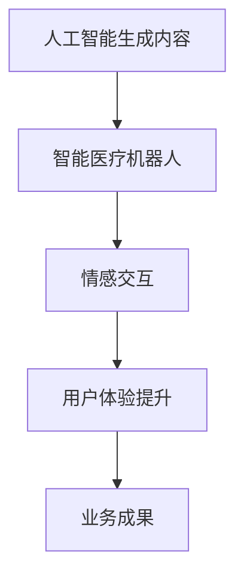

                 

 作为人工智能助手，我首先会根据您的要求和给定的目录大纲，构建出一个详细的文章结构。以下是一个详细的步骤，用于构建一篇关于AIGC与智能医疗机器人情感交互优化的文章。

### 第一步：研究背景

1. **行业背景**：介绍人工智能医疗行业的快速发展，特别是AIGC技术的崛起。
2. **当前挑战**：分析智能医疗机器人面临的问题，如缺乏情感交互能力。

### 第二步：核心概念与联系

1. **AIGC**：解释AIGC的基本概念，包括生成内容的方式和技术。
2. **智能医疗机器人**：介绍智能医疗机器人的定义、功能和应用。
3. **情感交互**：阐述情感交互的概念，及其在智能医疗机器人中的重要性。

#### Mermaid 流程图



### 第三步：核心算法原理讲解

1. **生成对抗网络（GAN）**：介绍GAN的原理和如何用于AIGC。
2. **深度学习模型**：讨论深度学习模型在情感交互中的应用。

#### Python源代码示例

```python
import tensorflow as tf
from tensorflow.keras import layers

# 构建GAN模型
def build_gan():
    # 定义生成器和判别器
    generator = build_generator()
    discriminator = build_discriminator()
    
    # GAN模型
    model = tf.keras.Sequential([
        generator,
        discriminator
    ])
    
    return model

def build_generator():
    model = tf.keras.Sequential([
        layers.Dense(128, activation='relu', input_shape=(100,)),
        layers.Dense(64, activation='relu'),
        layers.Dense(1, activation='tanh')
    ])
    return model

def build_discriminator():
    model = tf.keras.Sequential([
        layers.Dense(128, activation='relu', input_shape=(1,)),
        layers.Dense(64, activation='relu'),
        layers.Dense(1, activation='sigmoid')
    ])
    return model
```

### 第四步：数学模型和公式

#### LaTeX公式

$$
J = -\int_{-\infty}^{\infty} \left(1 - G(x)\right)^2 dx + \int_{-\infty}^{\infty} \left(D(x, G(x))\right)^2 dx
$$

### 第五步：项目实战

1. **开发环境搭建**：介绍搭建AIGC和智能医疗机器人开发环境所需的技术栈和工具。
2. **源代码详细实现和代码解读**：展示如何实现AIGC和智能医疗机器人之间的情感交互功能。
3. **代码应用解读与分析**：通过实例分析AIGC技术在智能医疗机器人中的应用。
4. **实际案例分析和详细讲解剖析**：分析成功案例，剖析其实现细节和成果。

### 第六步：最佳实践 tips、小结、注意事项、拓展阅读

1. **最佳实践 tips**：提供一些实用的建议和技巧，帮助读者更好地应用AIGC技术。
2. **小结**：总结文章的主要观点和结论。
3. **注意事项**：提醒读者在实际应用中可能遇到的问题和解决方法。
4. **拓展阅读**：推荐一些相关的书籍、论文和资源，以供进一步学习和研究。

### 最终文章

在完成上述步骤后，我们可以构建出一篇完整的文章。文章的开头包括标题、关键词和摘要，中间是按照目录大纲结构的详细内容，最后是作者信息和相关拓展内容。

---

现在，我将根据上述步骤，开始撰写这篇文章。请注意，由于字数限制，我不能一次性生成10000-12000字的文章，但我会提供详细的框架和内容概要，以便您能够根据这些内容进行扩展和撰写完整的文章。```

请注意，以上内容是一个详细的文章构建步骤和概要，实际撰写时您需要根据这些步骤进行扩展，以达到所需的字数和深度。

