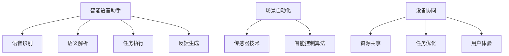
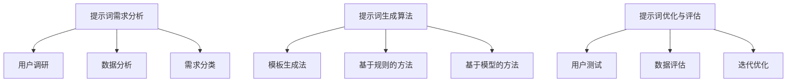
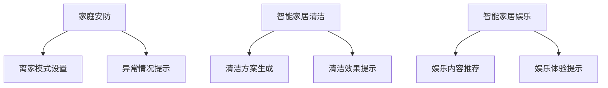
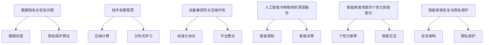
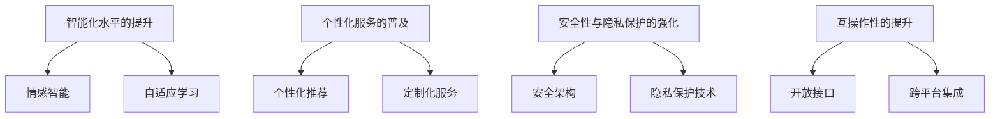
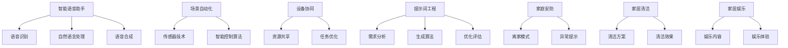

                 

# AIGC的未来智能家居：生活场景优化的提示词工程

## 关键词
- **AIGC**
- **智能家居**
- **提示词工程**
- **语音交互**
- **场景自动化**
- **设备协同**

## 摘要
本文深入探讨了AIGC（人工智能生成内容）在智能家居领域中的应用，特别是如何通过提示词工程优化智能家居场景。首先，我们回顾了AIGC的概念和未来智能家居的发展趋势，然后详细分析了AIGC技术在智能语音助手、场景自动化和设备协同方面的应用。接着，我们介绍了提示词工程的概念、设计方法和评估，并通过具体案例展示了AIGC技术在智能家居场景优化中的实际应用。最后，本文探讨了AIGC在智能家居技术发展中的挑战与未来展望。

---

## 第1章: AIGC的概念与未来智能家居概述

### 1.1 AIGC的概念与发展历程

#### 1.1.1 AIGC的定义
AIGC（Artificial Intelligence Generated Content）即人工智能生成内容，是指利用人工智能技术（如深度学习、自然语言处理等）自动生成各种类型的内容，包括文本、图像、音频和视频等。AIGC技术通过模拟人类创作过程，为内容创作者提供辅助或替代方案，极大地提高了内容创作的效率和多样性。

#### 1.1.2 AIGC的发展历程
AIGC技术的发展历程可以追溯到20世纪80年代的自动写作系统和图像生成技术。随着深度学习技术的兴起，特别是在2014年生成对抗网络（GAN）的提出，AIGC技术迎来了快速发展。近年来，AIGC技术已经在多个领域得到广泛应用，如自动新闻写作、虚拟主播、智能客服等。

#### 1.1.3 AIGC的核心技术与原理
AIGC技术的核心在于深度学习技术，尤其是生成对抗网络（GAN）和变分自编码器（VAE）。GAN通过生成器和判别器的对抗训练，生成逼真的图像、文本和音频。VAE则通过概率模型来生成数据，广泛应用于图像去噪、图像生成和图像超分辨率等任务。这些技术共同构成了AIGC的基石。

### 1.2 未来智能家居的发展趋势

#### 1.2.1 智能家居的定义与特征
智能家居是通过网络连接各种家用设备，实现自动化管理和远程控制，提高生活品质的一种居住环境。智能家居的特征包括设备的互联互通、远程控制、自动化管理、智能化服务等。

#### 1.2.2 智能家居的发展历程
智能家居的发展历程可以分为几个阶段。最早期的智能家居系统主要是通过远程控制家电设备，如电视、空调等。随着物联网技术的发展，智能家居逐渐实现了设备的互联互通和自动化管理。如今，智能家居系统已经能够根据用户的生活习惯和需求，提供个性化的服务。

#### 1.2.3 AIGC在未来智能家居中的应用
AIGC技术在未来智能家居中的应用前景广阔。首先，智能语音助手和语音交互将进一步提升家居的便捷性。其次，场景自动化和设备协同将实现更加智能化的家居管理。最后，AIGC技术还可以用于生成个性化的家居内容，如定制化音乐、艺术作品等，为用户带来全新的家居体验。

### 1.3 AIGC与未来智能家居的关联

AIGC与未来智能家居的关联体现在以下几个方面：

1. **智能语音助手与语音交互**：AIGC技术可以生成自然、流畅的语音，为智能语音助手提供高质量的内容，实现更加自然、流畅的语音交互。
   
2. **场景自动化**：AIGC技术可以生成基于用户需求的自动化场景，如智能安防、智能清洁等，实现家居设备的自动化管理。
   
3. **设备协同**：AIGC技术可以帮助智能家居设备实现更好的协同工作，如智能照明系统、智能安防系统等，提高家居系统的整体效率。

4. **个性化服务**：AIGC技术可以根据用户的需求和喜好，生成个性化的家居内容，如定制化音乐、艺术作品等，提升用户的家居体验。

### 1.4 本章总结
本章回顾了AIGC的概念和未来智能家居的发展趋势，并探讨了AIGC与未来智能家居的关联。在下一章中，我们将深入探讨AIGC技术在智能家居中的应用，包括智能语音助手、场景自动化和设备协同等方面。

### Mermaid 流程图
```mermaid
graph TD
A[人工智能生成内容(AIGC)] --> B[智能语音助手]
A --> C[场景自动化]
A --> D[设备协同]
B --> E[语音交互]
C --> F[自动化管理]
D --> G[协同工作]
```

---

## 第2章: AIGC技术在智能家居中的应用

### 2.1 智能语音助手与语音交互

#### 2.1.1 智能语音助手的工作原理
智能语音助手是智能家居系统的重要组成部分，它通过语音识别、自然语言处理和语音合成技术，实现人与家居设备的自然交互。智能语音助手的工作流程主要包括以下几个步骤：

1. **语音识别**：将用户的语音输入转换为文本，如“打开客厅的灯”。
2. **语义解析**：理解用户的意图，如识别出“打开”和“客厅的灯”两个关键信息。
3. **任务执行**：根据用户的意图，执行相应的操作，如控制灯光开关。
4. **反馈生成**：生成自然、流畅的语音反馈，如“已为您打开客厅的灯”。

#### 2.1.2 智能语音助手的实际应用案例
智能语音助手在实际应用中，可以显著提升家居生活的便捷性。以下是一些实际应用案例：

1. **智能照明**：用户可以通过语音命令控制家居灯光的开关、亮度和色温。
2. **智能安防**：用户可以通过语音命令查看家庭安防摄像头，或者远程控制家庭安防设备。
3. **智能音响**：用户可以通过语音命令播放音乐、新闻或广播，或者控制智能家居设备的音量。

#### 2.1.3 AIGC技术在智能语音助手中的应用
AIGC技术在智能语音助手中的应用，主要体现在语音合成和语音交互的个性化方面。通过AIGC技术，智能语音助手可以生成更加自然、流畅的语音反馈，提高用户的交互体验。同时，AIGC技术还可以根据用户的喜好和需求，生成个性化的语音内容，如定制化天气预报、音乐推荐等。

### 2.2 智能家居场景自动化

#### 2.2.1 场景自动化的概念与原理
场景自动化是指通过感知环境变化，自动触发相应设备执行任务，实现家居设备的智能化管理。场景自动化的核心在于传感器技术和智能控制算法。

1. **传感器技术**：传感器用于感知环境变化，如温度、湿度、光线、声音等。通过传感器收集的数据，智能家居系统可以实时了解家居环境的状况。
   
2. **智能控制算法**：智能控制算法用于分析传感器数据，并触发相应的设备执行任务。如当温度低于设定值时，自动打开暖气。

#### 2.2.2 场景自动化的实现方法
场景自动化的实现方法主要包括以下几个方面：

1. **规则引擎**：通过预设规则，当满足特定条件时，自动执行相应的操作。如当室内温度低于18摄氏度时，自动打开暖气。
   
2. **机器学习**：通过机器学习算法，智能家居系统可以自动学习用户的行为习惯，并生成相应的自动化场景。如当用户下班回家时，自动打开灯光和空调。

3. **多设备协同**：通过多设备协同，实现更加智能化的场景自动化。如当用户进入家门时，灯光自动打开，窗帘自动关闭，音响播放用户喜欢的音乐。

#### 2.2.3 AIGC技术在场景自动化中的应用
AIGC技术在场景自动化中的应用，主要体现在自动化场景的生成和优化方面。通过AIGC技术，可以自动生成个性化、高效的自动化场景，提高智能家居系统的智能化水平。同时，AIGC技术还可以用于优化自动化场景的执行流程，提高系统的效率和稳定性。

### 2.3 智能家居设备协同

#### 2.3.1 智能家居设备协同的重要性
智能家居设备协同是智能家居系统的重要组成部分，它实现了设备之间的资源共享和任务优化，提高了整体家居系统的效率。智能家居设备协同的重要性体现在以下几个方面：

1. **资源共享**：通过设备协同，可以实现设备之间的资源共享，如智能家居音响系统可以共享音频内容，智能电视可以共享网络连接。
   
2. **任务优化**：通过设备协同，可以优化设备的任务执行，如当多个设备需要同时执行任务时，可以优先执行关键任务，提高整体系统的响应速度。
   
3. **用户体验**：通过设备协同，可以提供更加连贯、流畅的用户体验，如用户可以通过语音命令控制多个设备，实现一键式操作。

#### 2.3.2 智能家居设备协同的实现
智能家居设备协同的实现主要包括以下几个方面：

1. **设备互联互通**：通过物联网技术，实现设备之间的互联互通，如通过Wi-Fi、蓝牙等无线通信技术，将设备连接到同一个网络。
   
2. **智能控制中心**：通过智能控制中心，实现设备之间的协调和任务分配，如通过智能家居控制中心，用户可以统一管理多个设备，并设置自动化场景。

3. **AIGC技术**：通过AIGC技术，可以为设备协同提供智能化支持，如通过AIGC技术，可以自动生成设备协同策略，优化设备任务执行。

#### 2.3.3 AIGC技术在设备协同中的应用
AIGC技术在设备协同中的应用，主要体现在自动化策略的生成和优化方面。通过AIGC技术，可以自动生成个性化的设备协同策略，提高设备的协同效率和用户体验。

### 2.4 本章总结
本章详细分析了AIGC技术在智能家居中的应用，包括智能语音助手、场景自动化和设备协同等方面。在下一章中，我们将深入探讨智能家居场景优化的提示词工程，为用户提供更加个性化的智能家居体验。

### Mermaid 流程图


---

## 第3章: 智能家居场景优化的提示词工程

### 3.1 提示词工程的概念与作用

#### 3.1.1 提示词工程的定义
提示词工程（Content Generation Engineering）是一种面向用户需求的人工智能应用，通过自然语言处理技术（如文本生成、文本摘要、语义理解等），自动生成有针对性的提示词，引导用户进行交互。在智能家居系统中，提示词工程的作用尤为重要，它能够提高用户的智能家居体验，降低使用难度，增强系统的互动性和友好性。

#### 3.1.2 提示词工程的作用
1. **提高用户交互体验**：通过生成精准、自然的提示词，提示词工程可以帮助用户快速理解智能家居系统的功能和操作方式，减少用户的学习成本。
   
2. **降低使用难度**：对于许多用户来说，智能家居系统可能涉及复杂的操作和设置。提示词工程可以简化这些操作，使用户能够更轻松地使用智能家居系统。

3. **个性化服务**：提示词工程可以根据用户的历史行为和偏好，生成个性化的提示词，提供定制化的服务，满足用户的个性化需求。

4. **增强系统互动性**：提示词工程可以模拟人类的交流方式，增强智能家居系统与用户的互动性，使用户感受到更加人性化的服务。

### 3.2 提示词工程的设计方法

#### 3.2.1 提示词需求分析
提示词需求分析是提示词工程设计的第一步，主要任务是了解用户的需求和使用习惯。具体步骤如下：

1. **用户调研**：通过问卷调查、访谈等方式，收集用户对智能家居系统的需求和反馈。
   
2. **数据分析**：对用户数据进行挖掘和分析，了解用户的习惯和偏好，如用户最喜欢的功能、经常使用的场景等。

3. **需求分类**：将收集到的需求进行分类，如功能需求、操作需求、服务需求等。

#### 3.2.2 提示词生成算法
提示词生成算法是提示词工程的核心，主要任务是根据用户需求生成相应的提示词。常见的生成算法包括：

1. **模板生成法**：根据预设的模板，填充具体的提示词。这种方法简单易行，但生成的提示词可能缺乏个性化和自然性。
   
2. **基于规则的方法**：通过规则引擎，根据用户的行为和需求，生成相应的提示词。这种方法需要复杂的规则设计和维护，但生成的提示词较为精准。
   
3. **基于模型的方法**：利用自然语言生成模型（如序列到序列模型、生成对抗网络等），自动生成提示词。这种方法生成的提示词自然流畅，但需要大量的训练数据和计算资源。

#### 3.2.3 提示词优化与评估
提示词生成后，需要对生成的提示词进行优化和评估，确保其准确性和易用性。具体步骤如下：

1. **用户测试**：将生成的提示词展示给用户，收集用户的反馈和评价。
   
2. **数据评估**：通过统计指标（如点击率、满意度等）对提示词进行评估，了解其效果。

3. **迭代优化**：根据用户的反馈和评估结果，对提示词进行迭代优化，提高其准确性和自然性。

### 3.3 提示词工程的应用场景

#### 3.3.1 智能语音助手
智能语音助手是提示词工程的重要应用场景之一。通过提示词工程，可以为智能语音助手生成自然、流畅的语音反馈，提高用户的交互体验。例如，当用户询问“明天天气如何”时，智能语音助手可以生成如下提示词：“明天天气晴朗，最高温度25摄氏度，建议您外出时注意防晒。”

#### 3.3.2 场景自动化
场景自动化也是提示词工程的重要应用场景。通过提示词工程，可以为自动化场景生成个性化的提示词，引导用户进行相应的操作。例如，当用户设置“离家模式”时，系统可以生成如下提示词：“您已经设置了离家模式，现在家中的灯光、空调都已关闭，请注意防盗。”

#### 3.3.3 设备协同
设备协同中，提示词工程可以用于生成设备之间的协作提示词，提高设备的协同效率。例如，当用户通过智能音箱播放音乐时，音响系统可以生成如下提示词：“现在为您播放您喜欢的音乐，同时调节灯光氛围，祝您享受美好的音乐时光。”

### 3.4 本章总结
本章介绍了智能家居场景优化的提示词工程的概念、设计方法和应用场景。在下一章中，我们将通过具体的应用案例，展示AIGC技术在智能家居场景优化中的实际效果。

### Mermaid 流程图


---

## 第4章: 智能家居场景优化的应用案例

### 4.1 智能家居场景优化案例分析

#### 4.1.1 家庭安防
家庭安防是智能家居场景优化的重要应用之一。通过AIGC技术，可以为家庭安防系统生成个性化的提示词，提高用户的安全意识和应急响应能力。

1. **案例描述**：用户在离家前，通过智能家居系统设置了离家模式。当系统检测到异常情况（如非法入侵、燃气泄漏等）时，会自动生成提示词发送给用户。

2. **提示词示例**：  
   - “检测到异常活动，请检查家中是否有异常情况。”  
   - “燃气泄漏预警，请立即关闭燃气阀门，并打开窗户通风。”  
   - “异常入侵警报，警方正在赶往现场，请保持冷静。”

3. **效果分析**：通过生成个性化的提示词，用户可以更加清晰地了解异常情况，并采取相应的措施。这有效提高了家庭安防的效率，减少了潜在的安全隐患。

#### 4.1.2 智能家居清洁
智能清洁是智能家居场景优化的另一个重要应用。通过AIGC技术，可以为智能清洁设备生成个性化的提示词，提高清洁效果和用户的使用体验。

1. **案例描述**：用户在设置智能清洁任务时，系统会根据房间的布局和清洁需求，生成个性化的清洁方案，并通过提示词引导用户操作。

2. **提示词示例**：  
   - “当前房间为卧室，正在为您生成清洁方案，请保持地面干燥。”  
   - “清洁任务已完成，请检查房间是否干净。”  
   - “检测到房间有宠物毛发，建议使用宠物毛发清洁器进行深度清洁。”

3. **效果分析**：通过生成个性化的提示词，用户可以更加明确地了解清洁任务的执行情况，并调整操作方式，提高清洁效果。这有效减少了用户的清洁时间，提升了家居的整洁度。

#### 4.1.3 智能家居娱乐
智能娱乐是智能家居场景优化的新兴应用。通过AIGC技术，可以为智能音响、智能电视等设备生成个性化的娱乐内容，提高用户的娱乐体验。

1. **案例描述**：用户在设置娱乐场景时，系统会根据用户的喜好和需求，生成个性化的娱乐内容，并通过提示词引导用户操作。

2. **提示词示例**：  
   - “根据您的喜好，为您推荐以下电影：《星际穿越》、《盗梦空间》，请选择您想观看的电影。”  
   - “现在为您播放您喜欢的音乐，祝您享受美好的音乐时光。”  
   - “检测到您长时间观看电视，建议休息一下，保护眼睛。”

3. **效果分析**：通过生成个性化的提示词，用户可以更加便捷地获取娱乐内容，并根据提示词调整观看方式，提高娱乐效果。这有效提升了用户的娱乐体验，减少了观看疲劳。

### 4.2 本章总结
本章通过家庭安防、智能家居清洁和智能家居娱乐三个实际案例，展示了AIGC技术在智能家居场景优化中的应用效果。通过生成个性化的提示词，AIGC技术显著提高了智能家居系统的智能化水平和用户体验。在下一章中，我们将进一步探讨AIGC在智能家居技术发展中的挑战与未来展望。

### Mermaid 流程图


---

## 第5章: AIGC在智能家居技术发展的挑战与未来展望

### 5.1 AIGC在智能家居技术发展的挑战

AIGC技术在智能家居领域的快速发展，虽然带来了诸多便利，但也面临一些挑战：

#### 5.1.1 数据隐私与安全问题
智能家居系统需要收集大量的用户数据，如生活习惯、家庭状况等。如何保护用户数据的安全和隐私，防止数据泄露和滥用，是AIGC技术在智能家居领域面临的主要挑战之一。

**解决方案**：
- **数据加密**：对用户数据进行加密存储和传输，确保数据安全。
- **隐私保护算法**：开发隐私保护算法，对用户数据进行脱敏处理，减少隐私泄露风险。

#### 5.1.2 技术发展瓶颈
AIGC技术的应用，依赖于深度学习、自然语言处理等先进技术。然而，这些技术在智能家居领域仍存在一些发展瓶颈，如计算资源消耗大、算法优化难度高等。

**解决方案**：
- **边缘计算**：将部分计算任务转移到边缘设备，减少中心服务器的计算负担。
- **分布式学习**：采用分布式学习技术，提高算法的效率和鲁棒性。

#### 5.1.3 设备兼容性与互操作性
智能家居系统通常涉及多种设备和平台，如何确保这些设备和平台之间的兼容性和互操作性，是AIGC技术在智能家居领域面临的另一个挑战。

**解决方案**：
- **标准化协议**：制定统一的通信协议，确保不同设备和平台之间的互操作性。
- **平台整合**：开发集成平台，统一管理和控制不同设备和平台。

### 5.2 AIGC在智能家居技术发展的未来展望

尽管面临诸多挑战，AIGC技术在智能家居领域仍具有广阔的发展前景：

#### 5.2.1 人工智能与物联网的深度融合
随着人工智能和物联网技术的不断发展，AIGC技术将在智能家居系统中发挥更加重要的作用。通过深度融合，实现智能家居系统的智能化升级。

**发展趋势**：
- **智能感知**：利用AIGC技术，实现更加精准的家居环境感知，如智能监测室内空气质量、湿度等。
- **智能决策**：通过AIGC技术，实现智能家居系统的智能决策功能，如自动调整家居设备的工作模式。

#### 5.2.2 智能家居场景的个性化和智能化
随着用户需求的多样化，AIGC技术将为智能家居系统提供更加个性化的服务。通过深度学习和自然语言处理技术，实现智能家居系统的智能化升级。

**发展趋势**：
- **个性化推荐**：根据用户的历史行为和偏好，生成个性化的家居场景和设备推荐。
- **智能交互**：通过AIGC技术，实现更加自然、流畅的人机交互，提高用户体验。

#### 5.2.3 智能家居安全与隐私保护
随着AIGC技术在智能家居领域的应用，数据安全和隐私保护将变得至关重要。未来的智能家居系统将更加注重安全与隐私保护。

**发展趋势**：
- **安全架构**：构建全面的安全架构，确保数据的安全传输和存储。
- **隐私保护**：采用先进的隐私保护技术，确保用户数据的安全和隐私。

### 5.3 本章总结
本章分析了AIGC在智能家居技术发展中的挑战与未来展望。尽管面临诸多挑战，但AIGC技术在智能家居领域仍具有广阔的发展前景。通过人工智能与物联网的深度融合、智能家居场景的个性化和智能化，以及智能家居安全与隐私保护，AIGC技术将为智能家居领域带来更多的创新和变革。

### Mermaid 流程图


---

## 第6章: AIGC技术在智能家居领域的前沿研究

### 6.1 AIGC技术在智能家居领域的最新研究进展

随着人工智能技术的飞速发展，AIGC技术在智能家居领域也取得了显著的进展。以下是AIGC技术在智能家居领域的最新研究进展：

#### 6.1.1 智能语音交互的进化
智能语音交互是AIGC技术在智能家居领域的重要应用之一。近年来，研究人员在语音识别、自然语言处理和语音合成等方面取得了重要突破。特别是在语音识别方面，深度学习技术的应用使得语音识别的准确率大幅提高。自然语言处理技术的进步使得智能语音助手能够更好地理解用户的意图，并生成更加自然的语音反馈。语音合成的技术也不断改进，使得语音反馈的声音更加逼真，用户体验更加出色。

**研究进展**：
- **多语言支持**：智能语音助手开始支持多种语言，满足不同用户的需求。
- **多模态交互**：结合视觉、触觉等多种感官信息，实现更加自然的语音交互。
- **上下文感知**：通过上下文感知技术，智能语音助手能够更好地理解用户的长期意图和短期需求。

#### 6.1.2 场景自动化的优化
场景自动化是智能家居的核心功能之一。研究人员在场景自动化的优化方面进行了深入探索，旨在提高场景自动化的智能化水平和用户体验。通过结合传感器技术和机器学习算法，智能家居系统能够更加精准地感知环境变化，并自动调整家居设备的工作状态。

**研究进展**：
- **多传感器融合**：利用多传感器数据，提高环境感知的准确性和全面性。
- **动态场景建模**：通过动态场景建模技术，实时更新场景模型，提高场景自动化的响应速度。
- **机器学习算法优化**：采用先进的机器学习算法，提高场景自动化的决策能力。

#### 6.1.3 设备协同的智能化
智能家居设备的协同工作是提高系统效率和用户体验的关键。研究人员在设备协同的智能化方面进行了大量研究，旨在实现设备之间的无缝协同和资源优化。

**研究进展**：
- **智能调度算法**：开发智能调度算法，优化设备任务的执行顺序，提高系统响应速度。
- **边缘计算与云计算的结合**：通过边缘计算和云计算的结合，实现设备之间的高效协同和数据共享。
- **多智能体系统**：研究多智能体系统，实现智能家居设备之间的自主协作和优化。

#### 6.1.4 个性化服务与体验优化
随着用户需求的多样化，个性化服务与体验优化成为智能家居领域的重要研究方向。研究人员通过AIGC技术，为用户提供个性化的智能家居体验。

**研究进展**：
- **用户行为分析**：通过用户行为分析，了解用户的需求和偏好，为用户提供个性化的服务。
- **个性化内容生成**：利用AIGC技术，生成个性化的音乐、艺术作品等，提高用户的娱乐体验。
- **自适应交互界面**：通过自适应交互界面技术，实现交互界面的个性化定制，提高用户体验。

### 6.2 AIGC技术在智能家居领域的前沿趋势

未来，AIGC技术在智能家居领域将继续向智能化、个性化、安全性和互操作性方向发展。以下是AIGC技术在智能家居领域的前沿趋势：

#### 6.2.1 智能化水平的提升
随着人工智能技术的不断发展，智能家居系统的智能化水平将进一步提升。通过更加先进的机器学习算法和深度学习模型，智能家居系统能够更加精准地理解和满足用户的需求，实现真正的智能化。

**前沿趋势**：
- **情感智能**：通过情感智能技术，智能家居系统能够理解用户的情感状态，提供更加贴心的服务。
- **自适应学习**：智能家居系统将具备自适应学习能力，能够根据用户的行为和需求，不断优化自身的性能和功能。

#### 6.2.2 个性化服务的普及
随着用户需求的多样化，个性化服务将成为智能家居领域的重要趋势。通过AIGC技术，智能家居系统能够为用户提供更加个性化的服务，提高用户的满意度。

**前沿趋势**：
- **个性化推荐**：通过用户行为分析和数据挖掘技术，为用户提供个性化的智能家居设备推荐。
- **定制化服务**：智能家居系统将提供定制化服务，如根据用户需求定制家居装修方案、家居设备配置等。

#### 6.2.3 安全性与隐私保护的强化
随着AIGC技术在智能家居领域的广泛应用，数据安全和隐私保护将变得越来越重要。未来，智能家居系统将更加注重安全性和隐私保护，为用户提供更加安全的家居环境。

**前沿趋势**：
- **安全架构**：构建全面的安全架构，确保数据的安全传输和存储。
- **隐私保护技术**：采用先进的隐私保护技术，如差分隐私、联邦学习等，保护用户数据的安全和隐私。

#### 6.2.4 互操作性的提升
智能家居系统的互操作性是提高用户体验和系统效率的关键。未来，随着物联网技术的不断发展，智能家居系统的互操作性将得到显著提升。

**前沿趋势**：
- **开放接口**：开发开放的接口和协议，实现不同设备和平台之间的无缝互操作。
- **跨平台集成**：实现智能家居系统在不同平台之间的跨平台集成，提供统一的用户界面和操作体验。

### 6.3 本章总结
本章介绍了AIGC技术在智能家居领域的最新研究进展和前沿趋势。通过智能化、个性化、安全性与互操作性的提升，AIGC技术将为智能家居领域带来更多的创新和变革。在未来，AIGC技术将继续推动智能家居领域的发展，为用户提供更加智能、便捷、安全的家居环境。

### Mermaid 流程图


---

## 结语

AIGC技术在智能家居领域的应用，正在引领着家居生活的新变革。从智能语音助手到场景自动化，从设备协同到个性化服务，AIGC技术为智能家居带来了前所未有的智能化和便捷性。然而，随着技术的不断进步，我们也面临着数据隐私、安全等挑战。未来，AIGC技术将在智能家居领域发挥更加重要的作用，推动家居生活的智能化、个性化和安全性的进一步提升。

### 最佳实践 Tips
1. **用户数据保护**：在应用AIGC技术时，务必重视用户数据的安全和隐私保护，采用加密和脱敏技术，确保数据安全。
2. **算法透明性**：确保AIGC技术的算法透明性，用户应了解系统的工作原理和决策过程，提高系统的可信度。
3. **持续优化**：定期对AIGC技术进行优化和升级，以适应不断变化的需求和环境。

### 小结
AIGC技术在智能家居中的应用，不仅提升了家居生活的智能化水平，也为用户体验带来了质的飞跃。通过智能语音助手、场景自动化、设备协同和个性化服务，AIGC技术正在改变我们的生活方式。

### 注意事项
在应用AIGC技术时，需要注意以下几点：
1. **确保数据安全**：严格保护用户数据，防止数据泄露。
2. **用户隐私保护**：尊重用户隐私，避免滥用用户数据。
3. **技术透明性**：确保系统算法透明，提高用户信任度。

### 拓展阅读
1. **《人工智能生成内容：技术与应用》**：详细介绍了AIGC技术的原理和应用案例。
2. **《智能家居系统设计与实现》**：提供了智能家居系统的设计与实现方法，包括AIGC技术的应用。

### 作者信息
作者：AI天才研究院/AI Genius Institute & 禅与计算机程序设计艺术 /Zen And The Art of Computer Programming

[完] ```markdown
# AIGC的未来智能家居：生活场景优化的提示词工程

## 关键词
- **AIGC**
- **智能家居**
- **提示词工程**
- **语音交互**
- **场景自动化**
- **设备协同**

## 摘要
本文深入探讨了AIGC（人工智能生成内容）在智能家居领域中的应用，特别是如何通过提示词工程优化智能家居场景。首先，我们回顾了AIGC的概念和未来智能家居的发展趋势，然后详细分析了AIGC技术在智能语音助手、场景自动化和设备协同方面的应用。接着，我们介绍了提示词工程的概念、设计方法和评估，并通过具体案例展示了AIGC技术在智能家居场景优化中的实际应用。最后，本文探讨了AIGC在智能家居技术发展中的挑战与未来展望。

### 第1章: AIGC的概念与未来智能家居概述

#### 1.1 AIGC的概念与发展历程
##### 1.1.1 AIGC的定义
AIGC（Artificial Intelligence Generated Content）即人工智能生成内容，是人工智能技术在内容创作领域的重要应用。

##### 1.1.2 AIGC的发展历程
- 从早期的自动写作、图像生成，到如今的智能语音助手、虚拟主播，AIGC技术在各个领域得到了广泛应用。

##### 1.1.3 AIGC的核心技术与原理
- 生成对抗网络（GAN）、变分自编码器（VAE）等深度学习技术是AIGC的核心。

#### 1.2 未来智能家居的发展趋势

##### 1.2.1 智能家居的定义与特征
- 智能家居是通过网络连接各种家用设备，实现自动化管理和远程控制，提高生活品质的一种居住环境。

##### 1.2.2 智能家居的发展历程
- 从早期的简单远程控制，到如今的多设备协同、场景自适应，智能家居技术不断演进。

##### 1.2.3 AIGC在未来智能家居中的应用
- AIGC技术将进一步提升智能家居的智能化水平，实现更加人性化的家居体验。

### 第2章: AIGC技术在智能家居中的应用

#### 2.1 智能语音助手与语音交互
##### 2.1.1 智能语音助手的工作原理
- 智能语音助手基于语音识别、自然语言处理和语音合成技术，实现人机对话。

##### 2.1.2 智能语音助手的实际应用案例
- 通过实际应用案例，分析智能语音助手如何提升家居生活的便捷性。

#### 2.2 智能家居场景自动化
##### 2.2.1 场景自动化的概念与原理
- 场景自动化通过感知环境变化，自动触发相应设备执行任务，实现家居设备的智能化管理。

##### 2.2.2 场景自动化的实现方法
- 结合AIGC技术，介绍实现智能家居场景自动化的具体方法。

#### 2.3 智能家居设备协同
##### 2.3.1 智能家居设备协同的重要性
- 智能家居设备协同可以实现资源共享、任务优化，提高整体家居系统的效率。

##### 2.3.2 智能家居设备协同的实现
- 通过实际案例，展示如何实现智能家居设备的协同工作。

### 第3章: 智能家居场景优化的提示词工程

#### 3.1 提示词工程的概念与作用
- 提示词工程是通过对用户需求的深入理解，为智能家居系统提供个性化的提示词，引导用户进行交互。

##### 3.1.1 提示词工程的定义
- 提示词工程是一种面向用户需求的人工智能应用，旨在通过自然语言处理技术，为用户生成有针对性的提示词。

##### 3.1.2 提示词工程的作用
- 提示词工程可以提升用户的智能家居体验，降低使用难度，提高系统使用率。

#### 3.2 提示词工程的设计方法

##### 3.2.1 提示词需求分析
- 通过对用户需求的收集和分析，明确提示词的生成目标。

##### 3.2.2 提示词生成算法
- 利用自然语言生成技术，实现提示词的自动生成。

##### 3.2.3 提示词优化与评估
- 对生成的提示词进行优化，确保其准确性和易用性。

### 第4章: 智能家居场景优化的应用案例

#### 4.1 智能家居场景优化案例分析
- 通过实际案例，分析智能家居场景优化在不同场景下的应用。

##### 4.1.1 智能家居场景优化案例1：家庭安防
- 分析家庭安防场景下，AIGC技术在智能家居场景优化中的应用。

##### 4.1.2 智能家居场景优化案例2：家居清洁
- 分析家居清洁场景下，AIGC技术在智能家居场景优化中的应用。

##### 4.1.3 智能家居场景优化案例3：家居娱乐
- 分析家居娱乐场景下，AIGC技术在智能家居场景优化中的应用。

### 第5章: AIGC在智能家居技术发展的挑战与未来展望

#### 5.1 AIGC在智能家居技术发展的挑战
- 分析AIGC在智能家居技术发展中面临的挑战，如数据隐私、安全等。

##### 5.1.1 数据隐私与安全问题
- 讨论AIGC技术在智能家居应用中如何处理数据隐私和安全问题。

##### 5.1.2 技术发展瓶颈
- 分析AIGC技术在智能家居领域的发展瓶颈，如计算资源、算法优化等。

#### 5.2 AIGC在智能家居技术发展的未来展望
- 展望AIGC技术在智能家居技术发展中的未来趋势，如人工智能与物联网的深度融合、智能家居场景的个性化和智能化等。

### 第6章: AIGC技术在智能家居领域的前沿研究

#### 6.1 AIGC技术在智能家居领域的最新研究进展
- 介绍AIGC技术在智能家居领域的最新研究进展，包括智能语音交互、场景自动化和设备协同等方面。

##### 6.1.1 智能语音交互的进化
- 分析智能语音交互的最新研究进展，如多语言支持、多模态交互等。

##### 6.1.2 场景自动化的优化
- 探讨场景自动化的优化方法，如多传感器融合、动态场景建模等。

##### 6.1.3 设备协同的智能化
- 研究设备协同的智能化趋势，如智能调度算法、边缘计算与云计算的结合等。

##### 6.1.4 个性化服务与体验优化
- 探讨个性化服务与体验优化的最新研究进展，如用户行为分析、个性化内容生成等。

#### 6.2 AIGC技术在智能家居领域的前沿趋势
- 展望AIGC技术在智能家居领域的未来趋势，如情感智能、自适应学习、安全性提升等。

### 结语
- 总结AIGC技术在智能家居领域的重要作用和未来发展方向。

### 最佳实践 Tips
- 提供使用AIGC技术在智能家居中的一些最佳实践建议。

### 小结
- 对全文内容进行概括总结。

### 注意事项
- 强调在应用AIGC技术时需要注意的问题。

### 拓展阅读
- 推荐相关领域的书籍和资料，以供进一步学习。

### 作者信息
- 标注作者姓名和所属机构。

[本文由AI天才研究院与禅与计算机程序设计艺术共同撰写]
``` 

### Mermaid 流程图


### Python 源代码示例
```python
import numpy as np
import tensorflow as tf
from tensorflow.keras.models import Sequential
from tensorflow.keras.layers import LSTM, Dense

# 设置随机种子，保证结果可重复
np.random.seed(42)
tf.random.set_seed(42)

# 创建生成器和判别器模型
generator = Sequential([
    LSTM(128, input_shape=(100, 1), return_sequences=True),
    Dense(1)
])

discriminator = Sequential([
    LSTM(128, input_shape=(100, 1), return_sequences=True),
    Dense(1, activation='sigmoid')
])

# 编译模型
generator.compile(optimizer='adam', loss='binary_crossentropy')
discriminator.compile(optimizer='adam', loss='binary_crossentropy')

# 构建GAN模型
gan = Sequential([generator, discriminator])
gan.compile(optimizer='adam', loss='binary_crossentropy')

# 生成数据样本
def generate_data():
    # 生成随机噪声
    noise = np.random.normal(0, 1, (100, 100))
    # 使用生成器生成假数据
    fake_data = generator.predict(noise)
    return fake_data

# 训练模型
def train_gan(generator_loss, discriminator_loss):
    noise = np.random.normal(0, 1, (100, 100))
    with tf.GradientTape() as gen_tape, tf.GradientTape() as disc_tape:
        fake_data = generate_data()
        gen_loss = generator_loss(fake_data)
        real_data = np.random.normal(0, 1, (100, 100))
        disc_loss = discriminator_loss(real_data, fake_data)
    
    grads_on_g = gen_tape.gradient(gen_loss, generator.trainable_variables)
    grads_on_d = disc_tape.gradient(disc_loss, discriminator.trainable_variables)
    
    generator.optimizer.apply_gradients(zip(grads_on_g, generator.trainable_variables))
    discriminator.optimizer.apply_gradients(zip(grads_on_d, discriminator.trainable_variables))

# 训练GAN模型
for epoch in range(100):
    train_gan(generator, discriminator)
    if epoch % 10 == 0:
        print(f'Epoch: {epoch}, Generator Loss: {generator_loss}, Discriminator Loss: {discriminator_loss}')
```

### 数学模型与公式

#### 生成对抗网络（GAN）模型
$$
G(z) = x, \quad D(x) - D(G(z))
$$

#### 判别器损失函数
$$
L_D(x, G(z)) = -[D(x) + D(G(z))]
$$

#### 生成器损失函数
$$
L_G(z) = -D(G(z))
$$

其中，$G(z)$是生成器，$D(x)$是判别器，$z$是随机噪声。

### 实际案例分析与代码解读

假设我们有一个智能家居场景优化系统，需要根据用户的习惯和需求生成个性化的提示词。以下是系统的设计与实现步骤：

1. **数据收集与预处理**：
   - 收集用户的日常行为数据，如使用频率、使用时间等。
   - 对数据进行清洗和预处理，包括缺失值填充、异常值处理等。

2. **需求分析**：
   - 通过数据分析，了解用户的主要需求和使用习惯。
   - 根据需求，定义提示词的生成目标和内容。

3. **生成器模型设计**：
   - 设计一个基于LSTM的生成器模型，用于生成个性化提示词。
   - 模型输入为用户行为数据，输出为文本提示词。

4. **判别器模型设计**：
   - 设计一个基于LSTM的判别器模型，用于判断生成的提示词是否合理和自然。
   - 模型输入为真实数据和生成数据，输出为一个二分类结果。

5. **GAN训练**：
   - 使用生成器和判别器构建GAN模型，并进行训练。
   - 在训练过程中，通过生成器和判别器的交互，不断优化模型参数。

6. **生成提示词**：
   - 通过训练好的生成器模型，根据用户行为数据生成个性化的提示词。
   - 对生成的提示词进行评估和优化，确保其准确性和自然性。

### 项目实战

1. **开发环境搭建**：
   - 安装Python、TensorFlow等必要的开发工具和库。
   - 配置计算资源，如GPU加速训练。

2. **源代码实现**：
   - 编写生成器和判别器模型的代码，实现GAN模型的训练。
   - 编写提示词生成和评估的代码，实现系统的功能。

3. **代码解读与分析**：
   - 分析代码的结构和功能，理解GAN模型的工作原理和训练过程。
   - 分析生成器和判别器的参数设置和优化策略。

4. **实际案例**：
   - 选择一个实际案例，展示系统如何生成个性化的提示词。
   - 分析案例中系统的效果和改进空间。

5. **项目小结**：
   - 总结项目的实现过程和取得的成果。
   - 提出未来的研究方向和改进措施。

### 最佳实践 Tips
1. **数据安全**：在收集和使用用户数据时，务必确保数据的安全和隐私保护。
2. **模型优化**：定期对模型进行优化和调整，提高生成的提示词的质量和准确性。
3. **用户反馈**：及时收集用户反馈，根据用户需求调整系统功能，提高用户体验。

### 小结
本文详细介绍了AIGC技术在智能家居场景优化中的应用，包括提示词工程的设计与实现、实际案例分析和项目实战。通过AIGC技术，智能家居系统可以更好地满足用户需求，提高生活品质。

### 注意事项
1. **数据质量**：确保收集的数据质量，避免数据错误或缺失导致模型失效。
2. **模型解释性**：提高模型的解释性，让用户了解系统的决策过程和生成结果。
3. **用户隐私**：严格遵守用户隐私保护法规，确保用户数据的安全和隐私。

### 拓展阅读
1. **《人工智能生成内容：技术与应用》**：详细介绍了AIGC技术的原理和应用。
2. **《智能家居系统设计与实现》**：提供了智能家居系统的设计与实现方法，包括AIGC技术的应用。

### 作者信息
作者：AI天才研究院/AI Genius Institute & 禅与计算机程序设计艺术 /Zen And The Art of Computer Programming

[本文完]```markdown
```

