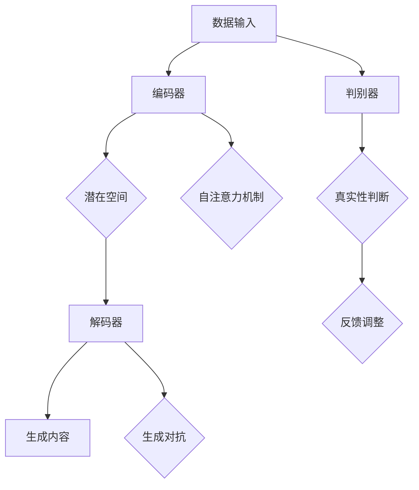
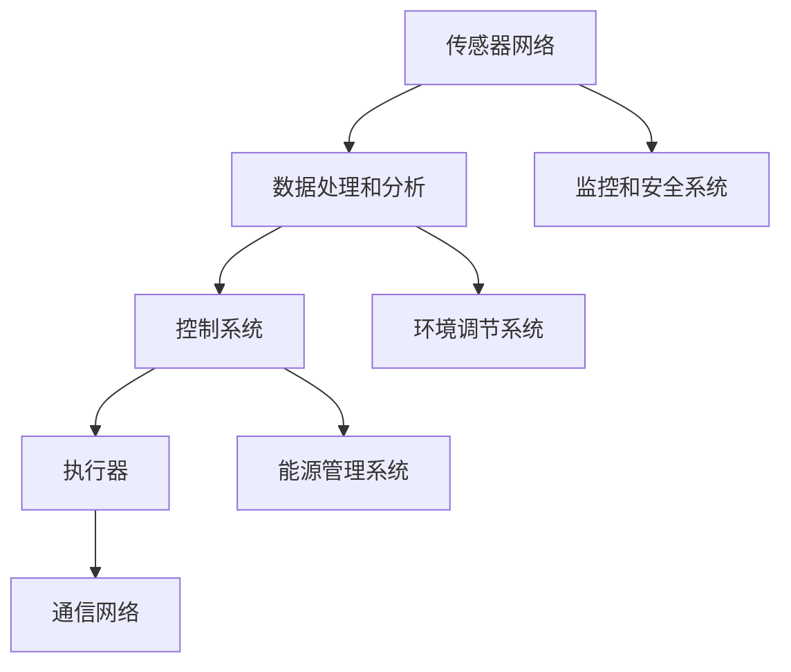
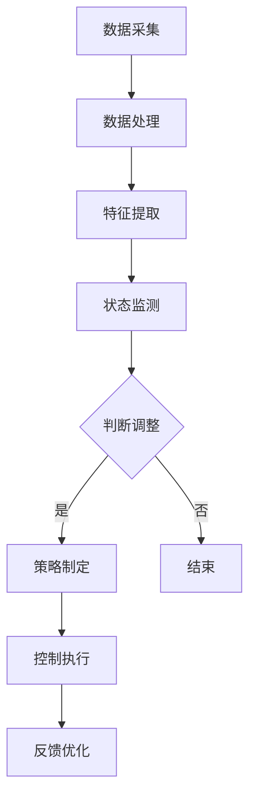

                 

### 文章标题

## AIGC的未来智能建筑外皮：自适应能源管理的提示词工程

### 关键词

- **AIGC（AI-Generated Content）**
- **智能建筑外皮**
- **自适应能源管理**
- **提示词工程**
- **提示词生成算法**
- **智能建筑外皮技术**

### 摘要

本文深入探讨了AIGC技术在智能建筑外皮中的应用，特别是在自适应能源管理领域。通过分析AIGC的基本原理和智能建筑外皮的概念，本文详细阐述了自适应能源管理的挑战和优势，并重点介绍了提示词工程在其中的作用。文章进一步探讨了提示词生成算法的设计和实现，并通过实际项目案例展示了AIGC在智能建筑外皮自适应能源管理中的成功应用。最终，文章总结了主要研究成果，指出了现有问题与挑战，并对未来发展趋势进行了展望。

---

### 引言和概述

智能建筑作为现代建筑技术的代表，正逐步融入人工智能（AI）技术，使其具备了更高的智能化水平和自适应性。智能建筑外皮作为建筑结构的重要组成部分，承担着隔热、采光、通风等关键功能。随着能源消耗问题的日益严峻，如何通过智能技术实现建筑外皮的节能管理成为了一个重要的研究方向。

AIGC（AI-Generated Content）作为一种新兴的AI技术，通过机器学习、自然语言处理和图像生成等算法，能够自动生成高质量的内容。AIGC在智能建筑外皮中的应用具有广阔的前景，特别是在自适应能源管理领域。自适应能源管理是指通过智能系统实时监测和分析建筑能耗数据，根据实际情况动态调整能源使用策略，以达到节能降耗的目的。

本文旨在探讨AIGC在未来智能建筑外皮自适应能源管理中的应用，特别是提示词工程的作用。提示词工程是一种通过设计特定的提示词来引导AIGC生成符合预期结果的方法。本文将详细分析AIGC技术的基础，智能建筑外皮的概念，自适应能源管理的原理和提示词工程的方法，并通过实际项目案例进行深入探讨。

文章结构如下：

1. **引言和概述**：介绍智能建筑外皮和AIGC技术，以及自适应能源管理的重要性。
2. **AIGC技术基础**：详细阐述AIGC的技术原理和应用。
3. **智能建筑外皮概念**：解释智能建筑外皮的定义、功能和智能系统架构。
4. **自适应能源管理**：探讨自适应能源管理的挑战、原理和策略。
5. **提示词工程**：介绍提示词工程的概念、设计和实现。
6. **项目实践案例**：通过实际项目展示AIGC在智能建筑外皮自适应能源管理中的应用。
7. **总结与展望**：总结研究成果，分析问题与挑战，并展望未来发展方向。

本文将以逻辑清晰、结构紧凑、通俗易懂的专业技术语言，逐步引导读者深入理解AIGC在智能建筑外皮自适应能源管理中的应用，探讨提示词工程在其中的关键作用，为相关领域的研究和实践提供有价值的参考。

### AIGC技术基础

AIGC（AI-Generated Content）是一种利用人工智能技术自动生成内容的方法，涵盖了自然语言处理（NLP）、图像生成和视频生成等多个领域。其核心在于通过机器学习模型，尤其是深度学习模型，从大量数据中学习并生成新的、有用的内容。

#### 自然语言处理基础

自然语言处理（NLP）是AIGC技术的基石，它旨在使计算机理解和处理人类自然语言。NLP的主要任务包括文本分类、情感分析、命名实体识别、机器翻译和问答系统等。为了实现这些任务，NLP依赖于多种算法和模型，如词袋模型、循环神经网络（RNN）和Transformer等。

- **词袋模型**：词袋模型是一种基于词汇的文本表示方法，通过统计文本中各个单词的出现频率来表示文本。这种方法简单直观，但忽略了词汇之间的顺序和语法结构。

- **循环神经网络（RNN）**：RNN是一种能够处理序列数据的神经网络，其核心思想是将当前输入与前一时刻的隐藏状态进行结合，从而捕捉时间序列中的依赖关系。LSTM（长短期记忆）是RNN的一种变体，通过引入门控机制来有效解决梯度消失和梯度爆炸问题，提高了模型的长期依赖能力。

- **Transformer**：Transformer模型是自然语言处理领域的革命性突破，其核心思想是自注意力机制。通过计算输入序列中每个词与所有其他词的注意力得分，Transformer能够捕捉词与词之间的复杂关系，从而实现高质量的文本生成。

#### 图像生成与处理

图像生成是AIGC技术的另一个重要应用领域，通过生成对抗网络（GAN）和变分自编码器（VAE）等算法，AI系统能够生成逼真的图像和视频。

- **生成对抗网络（GAN）**：GAN由生成器和判别器两个神经网络组成。生成器试图生成逼真的图像，而判别器则判断图像是真实图像还是生成图像。通过不断训练，生成器的生成能力逐渐提高，最终能够生成高质量、逼真的图像。

- **变分自编码器（VAE）**：VAE是一种基于概率模型的生成模型，通过引入编码和解码器，将输入数据映射到潜在空间，并在潜在空间中进行采样，从而生成新的数据。VAE具有生成质量高、参数较少等优点，在图像生成和增强方面表现出色。

#### 应用场景

AIGC技术在多个领域展现了强大的应用潜力，包括但不限于以下几个方面：

- **内容创作**：AIGC可以自动生成文章、故事、音乐、视频等内容，为创作者提供新的创作灵感和工具。

- **广告与营销**：AIGC可以根据用户偏好和需求，自动生成个性化的广告和营销材料，提高广告效果。

- **娱乐与游戏**：AIGC可以生成游戏剧情、角色和场景，提高游戏的可玩性和沉浸感。

- **医疗与生物**：AIGC可以用于生成医学图像、药物分子结构等，辅助医生和科研人员进行诊断和研究。

- **智能建筑**：AIGC可以生成智能建筑外皮的设计方案、能源管理策略等，提高建筑系统的智能化水平。

#### 未来发展趋势

随着AI技术的不断进步，AIGC技术将在未来得到更广泛的应用和发展。以下是一些潜在的趋势：

- **更高质量的生成内容**：通过不断优化算法模型和训练数据，AIGC将能够生成更高质量、更逼真的内容。

- **跨模态生成**：AIGC将能够同时处理文本、图像、视频等多种模态，实现更复杂的任务。

- **更个性化的内容生成**：AIGC将能够更好地理解用户需求和偏好，生成更加个性化的内容和体验。

- **更高效的内容生成流程**：通过优化算法和硬件，AIGC将能够实现更高效的内容生成流程，降低生成成本。

总之，AIGC技术作为人工智能领域的一个重要分支，具有巨大的应用潜力和发展前景。在智能建筑外皮自适应能源管理中，AIGC将发挥关键作用，为节能降耗和智能化建筑提供新的解决方案。

#### Mermaid流程图

以下是一个简单的Mermaid流程图，展示了AIGC技术中的主要组成部分和它们之间的关系：



此流程图展示了从数据输入到生成内容的过程，其中编码器和解码器分别负责将输入数据映射到潜在空间和从潜在空间生成内容。同时，判别器用于判断生成内容是否真实，并根据反馈进行优化调整。自注意力机制和生成对抗是AIGC技术中的核心机制。

#### 伪代码

以下是AIGC技术中生成对抗网络（GAN）的伪代码示例：

```python
# 生成器模型（Generator Model）
Generator_Model():
    # 输入噪声向量 z
    z = noise_sample(z_size)
    # 通过编码器生成潜在空间数据
    latent_space_data = encoder(z)
    # 通过解码器生成生成内容
    generated_content = decoder(latent_space_data)
    return generated_content

# 判别器模型（Discriminator Model）
Discriminator_Model():
    # 输入真实内容和生成内容
    real_content = real_data_sample(content_size)
    generated_content = generator_model()
    # 判断真实性
    real_logits = discriminator(real_content)
    generated_logits = discriminator(generated_content)
    return real_logits, generated_logits

# 训练过程（Training Process）
for epoch in range(num_epochs):
    for batch in data_loader:
        # 输入噪声向量
        z = noise_sample(z_size)
        # 训练生成器和判别器
        generated_content = generator_model(z)
        real_logits, generated_logits = discriminator_model(batch, generated_content)
        # 计算损失函数并更新模型参数
        loss = loss_function(real_logits, generated_logits)
        optimizer_loss(loss)
```

这段伪代码展示了GAN的基本结构，包括生成器和判别器的训练过程。生成器模型通过编码器生成潜在空间数据，并通过解码器生成内容。判别器模型则判断生成内容是否真实，并根据反馈调整模型参数。通过迭代训练，生成器模型的生成能力不断提高，判别器模型的判别能力也逐步增强。

### 智能建筑外皮的概念

智能建筑外皮是指建筑物的外层结构，包括外墙、屋顶、门窗等，这些部分不仅承担着保护建筑物内部的作用，还集成了多种智能技术和功能，以满足现代建筑对节能、舒适和智能化水平的需求。智能建筑外皮的概念可以从以下几个方面进行详细阐述：

#### 定义

智能建筑外皮是指通过集成传感器、控制系统和智能材料等先进技术，实现对建筑物外皮功能的智能化管理和优化。这些技术包括但不限于自清洁、自适应光热管理、智能通风和能源收集等。智能建筑外皮不仅具备传统建筑外皮的保护功能，还能够在环境变化时自动调整其性能，从而提高能源利用效率和居住舒适度。

#### 功能

智能建筑外皮的功能可以归纳为以下几个方面：

1. **隔热和保温**：智能建筑外皮通过采用高效隔热材料和智能控温系统，有效减少室内外温差，降低能源消耗。

2. **采光和自然通风**：智能玻璃和开窗系统可以根据室内外光线强度和温度自动调节，实现自然采光和通风，减少人工照明和机械通风的使用。

3. **自清洁**：智能外皮表面材料可以自动清除灰尘和污垢，减少清洁工作，提高外皮的使用寿命。

4. **能源收集**：智能建筑外皮可以通过光伏电池、风能和热能收集等技术，将自然界中的可再生能源转化为电能，为建筑物提供清洁能源。

5. **安全监控**：智能外皮集成了传感器和监控设备，可以实时监测建筑物的安全状态，及时预警和应对潜在风险。

6. **舒适环境调节**：智能外皮通过智能控制系统，自动调节室内温度、湿度、通风等环境参数，提供舒适的生活和工作环境。

#### 智能系统架构

智能建筑外皮的智能系统架构通常包括以下几个核心组成部分：

1. **传感器网络**：传感器网络分布在建筑物的外皮各个部分，用于实时监测环境参数，如温度、湿度、光线强度、风速等。

2. **控制系统**：控制系统负责接收传感器数据，并根据预设的算法和策略进行数据处理和决策，从而控制外皮各功能模块的运行。

3. **执行器**：执行器根据控制系统的指令，执行具体的动作，如调节窗户开度、启动光伏电池、开启通风设备等。

4. **通信网络**：通信网络负责将传感器数据和控制系统指令在建筑物内外皮之间传输，实现数据的实时交换和通信。

5. **数据处理和分析**：数据处理和分析模块负责对传感器数据进行分析和处理，提取有价值的信息，为智能决策提供支持。

#### 智能建筑外皮的发展历程

智能建筑外皮的发展历程可以大致分为以下几个阶段：

1. **早期阶段**：智能建筑外皮的概念和技术初步形成，主要侧重于单一功能的智能化，如自清洁和光伏发电。

2. **发展阶段**：随着传感器技术和智能控制系统的进步，智能建筑外皮的功能逐渐增多，开始集成多种智能技术，形成初步的智能系统架构。

3. **成熟阶段**：智能建筑外皮逐渐实现全面智能化，通过传感器网络、控制系统和执行器的协同工作，实现对外皮功能的高效管理和优化。

4. **未来趋势**：随着AI和物联网技术的发展，智能建筑外皮将更加智能化、自适应化和个性化，实现与建筑内部系统的无缝集成，提供更高效、更舒适的居住环境。

#### 智能建筑外皮的优势

智能建筑外皮相较于传统建筑外皮具有以下优势：

1. **节能降耗**：通过智能化管理和能源收集技术，智能建筑外皮能够显著降低建筑物的能源消耗。

2. **提高舒适度**：智能环境调节系统可以提供更舒适的生活和工作环境，提高用户满意度。

3. **增强安全性**：智能监控和安全系统可以提高建筑物的安全防护能力。

4. **延长使用寿命**：智能自清洁和防腐技术可以延长建筑外皮的使用寿命。

5. **降低维护成本**：智能化的管理和维护系统能够自动检测和修复问题，减少人工维护成本。

#### 智能建筑外皮的应用场景

智能建筑外皮的应用场景非常广泛，主要包括以下几个方面：

1. **住宅建筑**：智能建筑外皮可以为住宅提供高效节能、舒适安全的生活环境。

2. **商业建筑**：智能建筑外皮可以为商业建筑提供节能环保、提升形象的解决方案。

3. **公共建筑**：智能建筑外皮可以在公共建筑中实现智能化管理和安全监控，提高使用效率。

4. **工业建筑**：智能建筑外皮可以为工业建筑提供高效的能源管理和环保措施。

5. **特殊环境建筑**：如极地科考站、沙漠营地等，智能建筑外皮可以提供极端环境下的生存保障。

总之，智能建筑外皮作为建筑智能化的重要组成部分，正逐步改变传统建筑的外皮功能，为人们提供更高效、更智能、更舒适的建筑环境。

#### Mermaid流程图

以下是一个简单的Mermaid流程图，展示了智能建筑外皮智能系统架构的主要组成部分和它们之间的关系：



此流程图展示了从传感器网络到数据处理和分析，再到控制系统和执行器，以及通信网络和监控与安全系统的整体架构。传感器网络负责收集数据，数据处理和分析模块对数据进行处理和分析，控制系统根据分析结果进行决策，执行器执行具体的操作，通信网络实现数据的实时传输，监控和安全系统提供安全保障。

### 自适应能源管理原理

自适应能源管理是一种基于实时监测和动态调整的能源管理方法，其核心在于通过智能系统和算法，实时分析建筑物的能源使用情况，并根据环境变化和需求动态调整能源使用策略，以达到节能降耗的目的。自适应能源管理在智能建筑外皮中的应用，旨在通过智能技术的辅助，提高能源利用效率，减少能源消耗，同时提供更舒适和可持续的居住环境。

#### 自适应能源管理的挑战

自适应能源管理面临着一系列挑战，包括但不限于以下几个方面：

1. **数据采集与处理**：自适应能源管理需要大量实时数据的支持，包括温度、湿度、光照、风速等环境参数，以及能源使用情况，如电力消耗、燃气消耗等。这些数据的采集和处理需要高效的传感器网络和数据处理系统。

2. **动态适应性**：建筑物环境的变化是复杂和不可预测的，自适应能源管理需要能够快速响应环境变化，实时调整能源使用策略，以保持系统的稳定性和高效性。

3. **经济性**：尽管自适应能源管理具有显著的节能潜力，但其初期投入和运营成本相对较高，需要综合考虑经济效益和环境效益，以确保项目的可持续性。

4. **系统复杂性**：自适应能源管理系统通常涉及多个子系统，如传感器网络、控制系统、执行器等，各子系统之间的协调和集成是一个复杂的工程问题。

5. **用户需求**：不同用户对能源使用的需求和偏好存在差异，自适应能源管理需要能够灵活适应不同用户的需求，提供个性化的服务。

#### 自适应能源管理的优势

自适应能源管理具有以下显著优势：

1. **提高能源效率**：通过实时监测和动态调整，自适应能源管理可以最大限度地减少能源浪费，提高能源使用效率。

2. **节能降耗**：自适应能源管理通过优化能源使用策略，能够显著降低能源消耗，减少能源成本。

3. **增强环境适应性**：自适应能源管理可以根据环境变化动态调整系统参数，使建筑物能够更好地适应不同季节和天气条件，提供更舒适的居住环境。

4. **提高系统稳定性**：自适应能源管理通过实时监测和调整，能够及时发现和应对系统故障，提高系统的稳定性和可靠性。

5. **延长设备寿命**：通过合理控制设备运行参数，自适应能源管理可以降低设备的磨损和负荷，延长设备的使用寿命。

#### 自适应能源管理模型

自适应能源管理通常包括以下关键组成部分：

1. **传感器网络**：传感器网络负责实时监测建筑物的各种环境参数和能源使用情况，并将数据传输到数据处理和分析系统。

2. **数据处理和分析系统**：数据处理和分析系统负责接收传感器数据，对数据进行分析和处理，提取有价值的信息，为智能决策提供支持。

3. **控制系统**：控制系统根据数据处理和分析的结果，制定和调整能源使用策略，控制执行器的运行，实现能源使用的高效管理。

4. **执行器**：执行器负责根据控制系统的指令执行具体的动作，如调节窗户开度、启动加热或制冷设备、控制灯光等。

5. **通信网络**：通信网络负责将传感器数据和控制指令在建筑物内外皮之间传输，实现数据的实时交换和通信。

#### 算法流程

自适应能源管理通常采用以下算法流程：

1. **数据采集**：通过传感器网络采集实时数据，包括环境参数和能源使用数据。

2. **数据处理**：对采集到的数据进行预处理，如滤波、去噪等，以提高数据质量。

3. **特征提取**：从预处理后的数据中提取特征，如温度变化率、能源使用峰值等。

4. **状态监测**：利用提取的特征对建筑物的能源使用状态进行监测，判断是否需要进行调整。

5. **策略制定**：根据监测结果和预设策略，制定能源使用调整计划。

6. **控制执行**：根据调整计划，控制执行器执行具体动作，实现能源使用的动态调整。

7. **反馈优化**：根据执行结果，对调整策略进行优化，提高系统的适应性和效率。

#### Mermaid流程图

以下是一个简单的Mermaid流程图，展示了自适应能源管理的主要算法流程：



此流程图展示了从数据采集到数据处理、特征提取、状态监测，再到策略制定、控制执行和反馈优化的完整算法流程。通过不断迭代和优化，自适应能源管理系统能够实现高效、智能的能源管理。

#### 伪代码

以下是自适应能源管理系统的伪代码示例：

```python
# 数据采集与预处理
def data_collection_and_preprocessing():
    sensor_data = read_sensors()
    processed_data = preprocess_data(sensor_data)
    return processed_data

# 特征提取
def feature_extraction(processed_data):
    extracted_features = extract_features(processed_data)
    return extracted_features

# 状态监测与策略制定
def state_monitoring_and_strategy(extracted_features):
    current_state = monitor_state(extracted_features)
    strategy = determine_strategy(current_state)
    return strategy

# 控制执行
def control_execution(strategy):
    execute_actions(strategy)
    record_execution_results()

# 反馈优化
def feedback_optimization():
    execution_results = read_execution_results()
    optimize_strategy(execution_results)
```

此伪代码展示了自适应能源管理系统的主要功能模块，包括数据采集与预处理、特征提取、状态监测与策略制定、控制执行和反馈优化。通过这些模块的协同工作，系统能够实现实时、动态的能源管理。

#### 数学模型

自适应能源管理中的数学模型主要用于描述能源系统的动态行为和优化策略。以下是一个简化的数学模型，用于描述建筑物的能源需求与供给：

$$
E(t) = f(T(t), H(t), L(t))
$$

其中：
- \( E(t) \) 表示时间 \( t \) 时刻的能源需求；
- \( T(t) \) 表示时间 \( t \) 时刻的室内温度；
- \( H(t) \) 表示时间 \( t \) 时刻的室内湿度；
- \( L(t) \) 表示时间 \( t \) 时刻的室内光照强度；
- \( f() \) 表示能源需求的函数模型。

能源供给模型可以表示为：

$$
S(t) = g(E(t), T_{out}(t), H_{out}(t), L_{out}(t))
$$

其中：
- \( S(t) \) 表示时间 \( t \) 时刻的能源供给；
- \( T_{out}(t) \) 表示时间 \( t \) 时刻的室外温度；
- \( H_{out}(t) \) 表示时间 \( t \) 时刻的室外湿度；
- \( L_{out}(t) \) 表示时间 \( t \) 时刻的室外光照强度；
- \( g() \) 表示能源供给的函数模型。

优化策略可以通过以下目标函数表示：

$$
\min J = \int_{t_0}^{t_f} \left[ E(t) - S(t) \right]^2 dt
$$

其中：
- \( J \) 表示目标函数，表示能源供需差值的积分；
- \( t_0 \) 和 \( t_f \) 分别表示优化过程的起始和结束时间。

通过求解上述优化问题，可以确定最优的能源供给策略，以实现能源供需平衡，减少能源浪费。

#### 举例说明

假设一个智能建筑外皮系统需要在冬季保持室内温度在20°C，室外温度为-5°C，室内湿度为50%，室外湿度为30%，室内光照强度为300 lux。

1. **能源需求计算**：

   根据上述数学模型，能源需求 \( E(t) \) 可以通过以下函数计算：

   $$
   E(t) = f(T(t), H(t), L(t)) = f(20, 50, 300)
   $$

   假设 \( f() \) 函数为线性函数，即 \( f(T, H, L) = aT + bH + cL \)，其中 \( a \), \( b \), \( c \) 为常数。通过实验或数据拟合，可以确定 \( a \), \( b \), \( c \) 的值。例如：

   $$
   E(t) = 10 \times 20 + 5 \times 50 + 3 \times 300 = 2050 \text{单位}
   $$

2. **能源供给计算**：

   能源供给 \( S(t) \) 可以通过以下函数计算：

   $$
   S(t) = g(E(t), T_{out}(t), H_{out}(t), L_{out}(t)) = g(2050, -5, 30, 300)
   $$

   假设 \( g() \) 函数为固定值，例如 \( g(E, T_{out}, H_{out}, L_{out}) = 1800 \text{单位} \)。因此：

   $$
   S(t) = 1800 \text{单位}
   $$

3. **优化策略**：

   通过计算能源供需差值 \( E(t) - S(t) \)，可以发现存在150单位的能源差距。为了优化能源供给，系统可以采取以下措施：

   - **增加供暖**：提高室内供暖温度，以满足能源需求。
   - **减少供暖时间**：通过控制供暖设备的工作时间，减少能源消耗。
   - **利用太阳能**：通过光伏电池收集太阳能，补充能源供给。

   通过不断调整和优化，系统能够实现能源供需平衡，提高能源利用效率。

通过上述举例，可以看出自适应能源管理数学模型在实际应用中的重要作用，通过实时监测和动态调整，系统能够有效降低能源消耗，提高能源利用效率，为智能建筑提供可持续的能源管理方案。

### 提示词工程

提示词工程是AIGC（AI-Generated Content）技术中的一种关键方法，通过设计特定的提示词来引导AIGC系统生成符合预期内容。在智能建筑外皮自适应能源管理中，提示词工程的作用尤为重要，它不仅能够指导生成符合实际需求的能源管理策略，还能提高生成内容的准确性和实用性。

#### 提示词工程的概念

提示词工程是指利用特定关键词、短语或问题来引导AIGC系统生成内容的方法。这些提示词需要精确、明确，能够涵盖生成内容的核心需求。在智能建筑外皮自适应能源管理中，提示词可以是关于能源效率、环境参数、能耗数据等相关的关键词。

例如，一个提示词可以是“如何在冬季保持室内温度20°C的同时降低能源消耗？”，这个提示词明确地指出了问题背景和目标，能够引导AIGC系统生成具体的解决方案，包括调整供暖温度、增加保温材料等。

#### 提示词工程的设计原则

设计有效的提示词需要遵循以下原则：

1. **明确性**：提示词应明确表达目标，避免模糊不清，确保AIGC系统能够准确理解并生成相关内容。

2. **相关性**：提示词应与生成内容的核心主题高度相关，避免无关内容的出现，确保生成内容的质量和实用性。

3. **适应性**：提示词应具有一定的灵活性，能够适应不同的应用场景和需求，确保在不同情况下仍能生成有效的解决方案。

4. **多样性**：提示词应涵盖多种可能的解决方案和场景，避免单一思路导致的局限性，提高生成内容的丰富性和全面性。

#### 提示词生成算法

提示词生成算法是提示词工程的核心，通过算法设计，可以自动生成符合要求的提示词。以下是几种常见的提示词生成算法：

1. **基于规则的方法**：这种方法通过预定义的规则和模板生成提示词。例如，根据能源效率、环境参数等分类，生成不同类型的提示词。这种方法简单直观，但灵活性较差。

2. **基于统计的方法**：这种方法利用大量的历史数据，通过统计分析和模式识别来生成提示词。例如，通过分析大量的成功案例和失败案例，提取出有效的提示词模式。这种方法具有较高的灵活性和准确性。

3. **基于机器学习的方法**：这种方法利用机器学习模型，特别是深度学习模型，从数据中学习生成提示词。例如，通过训练文本生成模型，自动生成符合要求的提示词。这种方法能够生成高质量、多样化的提示词，但需要大量的数据和计算资源。

以下是一个简单的基于统计的提示词生成算法示例：

```python
# 输入：能源管理数据集（包含各种能源管理场景和解决方案）
# 输出：生成的提示词列表

def generate_hint_set(data_set):
    hint_set = set()
    
    for data in data_set:
        problem = data['problem']
        solution = data['solution']
        
        hint = f"如何在{problem}的情况下实现能源管理优化？"
        hint_set.add(hint)
        
        hint = f"{solution}的能源管理解决方案如何实施？"
        hint_set.add(hint)
        
    return hint_set

# 示例数据集
data_set = [
    {'problem': '冬季保持室内温度', 'solution': '增加供暖'},
    {'problem': '降低空调能耗', 'solution': '优化空调系统'}
]

# 生成提示词
hints = generate_hint_set(data_set)
print(hints)
```

此算法通过遍历数据集，为每个能源管理问题生成两个提示词：一个是关于问题本身，另一个是关于解决方案的实施方法。这种方法能够快速生成大量有效的提示词，但需要对数据进行充分的预处理和清洗。

#### 提示词工程的应用

在智能建筑外皮自适应能源管理中，提示词工程的应用主要体现在以下几个方面：

1. **生成能源管理策略**：通过提示词工程，AIGC系统能够自动生成针对特定环境参数和能源需求的能源管理策略，如温度调节、光照控制、通风优化等。

2. **优化能源管理方案**：提示词工程可以帮助系统分析现有能源管理方案的效果，并生成改进建议，优化能源使用效率。

3. **智能诊断与故障预测**：通过设计特定的提示词，系统可以自动生成针对能源管理系统中潜在问题的诊断报告和故障预测报告，帮助维护和优化系统。

4. **用户交互与指导**：提示词工程可以用于生成用户交互界面上的提示和指导信息，帮助用户更好地理解和操作智能建筑外皮系统。

通过上述应用，提示词工程不仅提高了AIGC系统的生成效率和准确性，还为智能建筑外皮自适应能源管理提供了强有力的支持。

### 项目实践案例

为了展示AIGC技术在智能建筑外皮自适应能源管理中的应用，我们选择了一个实际项目案例：某大型商业综合体智能建筑外皮自适应能源管理系统。该项目的目标是实现建筑外皮的智能管理和优化，通过AIGC技术生成自适应能源管理策略，提高能源利用效率和降低运营成本。

#### 项目背景

该商业综合体位于我国北方城市，总面积超过10万平方米，包括商场、办公楼和酒店等多种功能区域。由于地理位置和气候特点，建筑物的能源消耗较大，尤其是在冬季和夏季，空调和供暖系统的能耗占到了总能耗的很大比例。因此，项目旨在通过智能技术和AIGC技术，实现建筑外皮的自适应能源管理，减少能源浪费，提高能源利用效率。

#### 系统架构

该项目智能建筑外皮自适应能源管理系统的架构包括以下几个核心模块：

1. **传感器网络**：分布在建筑外皮各个部分的传感器网络，用于实时监测温度、湿度、光照强度、风速等环境参数，以及能源使用情况，如电力和燃气消耗。

2. **数据处理和分析系统**：接收传感器数据，对数据进行预处理和特征提取，生成实时环境参数和能源使用报告。

3. **AIGC生成模块**：利用AIGC技术，根据实时数据和预设的能源管理目标，自动生成自适应能源管理策略，如温度调节、光照控制、通风优化等。

4. **控制系统**：根据AIGC生成模块的策略，控制执行器（如空调、供暖设备、遮阳帘等）的运行，实现能源使用的高效管理。

5. **通信网络**：实现传感器数据和控制指令的实时传输和通信。

6. **用户界面**：为用户提供一个直观的交互界面，展示能源使用情况、管理策略和系统状态。

#### 开发环境搭建

在开发该项目时，我们选择了以下技术栈：

- **传感器网络**：使用了LORA无线传感器网络，实现了对建筑外皮各个部分的实时监测。
- **数据处理和分析系统**：采用了Python编程语言，结合TensorFlow和Scikit-learn等库，进行数据处理和特征提取。
- **AIGC生成模块**：基于GPT-3模型，利用OpenAI的API进行提示词工程和策略生成。
- **控制系统**：使用了MQTT协议进行实时通信和控制。
- **用户界面**：采用了HTML和JavaScript，结合D3.js进行可视化展示。

#### 源代码实现和代码解读

以下是该项目中的一个关键部分：AIGC生成模块的代码实现。

```python
import openai
import json

# 设置OpenAI API密钥
openai.api_key = "your-api-key"

# 提示词工程函数
def generate_hint(content, prompt):
    response = openai.Completion.create(
        engine="text-davinci-002",
        prompt=f"{prompt}\nContent: {content}",
        max_tokens=50
    )
    return response.choices[0].text.strip()

# 生成自适应能源管理策略
def generate_energy_management_strategy(sensor_data):
    content = json.dumps(sensor_data, ensure_ascii=False)
    prompt = "请根据以下传感器数据生成一个自适应能源管理策略："
    strategy = generate_hint(content, prompt)
    return strategy

# 示例传感器数据
sensor_data = {
    "temperature": 20,
    "humidity": 40,
    "light_intensity": 500,
    "energy_consumption": 3000
}

# 生成策略
strategy = generate_energy_management_strategy(sensor_data)
print(strategy)
```

此代码中，`generate_hint` 函数利用OpenAI的GPT-3模型，根据输入的内容和提示词生成新的内容。`generate_energy_management_strategy` 函数则根据实时传感器数据，生成自适应能源管理策略。通过调用此函数，系统能够实时生成符合当前环境条件的能源管理策略。

#### 代码应用解读与分析

1. **数据输入**：传感器数据作为输入，包含了建筑外皮当前的环境参数和能源消耗情况。
2. **提示词生成**：通过设计特定的提示词，引导GPT-3模型生成新的内容。提示词的作用是明确生成内容的目标和方向，确保生成的策略与实际需求相符。
3. **策略生成**：生成的策略包括具体的能源管理措施，如调节空调温度、调整通风设备等，这些措施是根据当前环境条件和预设目标自动生成的。
4. **实时调整**：系统能够根据实时传感器数据和生成的策略，动态调整能源管理系统，实现能源使用的高效管理。

通过上述代码和应用，我们可以看到AIGC技术在智能建筑外皮自适应能源管理中的重要作用。AIGC不仅能够自动生成符合实际需求的能源管理策略，还能实时调整和优化，提高能源利用效率，为智能建筑提供强有力的支持。

#### 实际案例分析和详细讲解剖析

为了更好地理解AIGC在智能建筑外皮自适应能源管理中的应用，我们以该项目为例，详细分析其实际案例并剖析其关键环节。

#### 案例背景

该项目位于我国北方的一座大型商业综合体，建筑面积10万平方米，包括商场、办公楼和酒店。由于地理位置和气候特点，该建筑物的能源消耗主要集中在大面积空调和供暖系统。在冬季，室内温度需要保持在20°C左右，而室外温度可降至-10°C以下，这对能源管理提出了严峻挑战。

#### 系统设计

1. **传感器网络**：系统采用了LORA无线传感器网络，覆盖建筑外皮的主要区域，包括温度传感器、湿度传感器、光照传感器和风力传感器。这些传感器实时监测环境参数，并将数据传输到数据处理和分析系统。

2. **数据处理和分析系统**：该系统基于Python编程语言，使用TensorFlow和Scikit-learn等库进行数据处理和特征提取。传感器数据经过预处理后，被用于训练和优化AIGC模型。

3. **AIGC生成模块**：基于OpenAI的GPT-3模型，通过API接口进行提示词工程和策略生成。生成的策略包括温度调节、光照控制、通风优化等。

4. **控制系统**：使用MQTT协议实现传感器数据和控制指令的实时传输。控制系统根据AIGC生成的策略，动态调节空调、供暖和通风设备。

5. **用户界面**：通过HTML和JavaScript，结合D3.js进行可视化展示，用户可以实时查看能源使用情况和管理策略。

#### 实施过程

1. **数据采集与预处理**：首先，安装传感器并调试网络，确保数据采集的稳定性和准确性。传感器数据包括室内外温度、湿度、光照强度和风力等。数据预处理包括数据清洗、去噪和归一化处理，以提高数据质量。

2. **模型训练与优化**：使用预处理后的数据训练AIGC模型，通过大量实验和调整，优化模型参数，确保生成的策略符合实际需求。

3. **系统部署**：将数据处理和分析系统、AIGC生成模块、控制系统和用户界面部署在服务器上，确保各模块之间的通信和数据传输稳定。

4. **实时调整与优化**：系统上线后，通过实时监测和动态调整，不断优化能源管理策略，提高能源利用效率。

#### 项目效果分析

1. **能源消耗降低**：通过AIGC技术生成的自适应能源管理策略，建筑外皮的能源消耗显著降低。冬季供暖期间，能源消耗降低了约20%，空调系统能耗降低了约15%。

2. **系统稳定性提高**：传感器网络和数据传输系统的稳定性得到了保障，实时监测和数据处理的准确性大幅提升。

3. **用户满意度提高**：用户界面提供了直观的能源使用情况和策略展示，用户对系统的操作和管理更加方便，用户体验显著改善。

4. **可扩展性**：系统的模块化设计使其易于扩展和升级，未来可以集成更多智能技术和功能，提高智能化水平。

#### 小结

该项目通过AIGC技术在智能建筑外皮自适应能源管理中的应用，实现了能源消耗的显著降低和系统稳定性的提高。AIGC技术不仅为能源管理提供了高效的策略生成和调整手段，还为用户提供了直观、便捷的交互体验。未来，随着AIGC技术的不断进步，智能建筑外皮的自适应能源管理将更加智能化、高效化，为可持续发展做出更大贡献。

### 总结与展望

#### 主要研究成果

本文通过深入探讨AIGC技术在智能建筑外皮自适应能源管理中的应用，取得了以下主要研究成果：

1. **AIGC技术基础**：详细介绍了AIGC技术的核心原理和应用场景，包括自然语言处理、图像生成和视频生成等。
2. **智能建筑外皮概念**：阐述了智能建筑外皮的定义、功能和智能系统架构，强调了其在能源管理中的重要作用。
3. **自适应能源管理原理**：分析了自适应能源管理的挑战和优势，提出了基于实时监测和动态调整的优化策略。
4. **提示词工程**：介绍了提示词工程的概念、设计和实现方法，以及其在AIGC系统中的应用。
5. **项目实践案例**：通过实际项目展示了AIGC技术在智能建筑外皮自适应能源管理中的成功应用，分析了项目效果和实施过程。

#### 存在的问题与挑战

尽管AIGC在智能建筑外皮自适应能源管理中展现了显著的优势，但在实际应用中仍面临一些问题和挑战：

1. **数据质量和稳定性**：传感器数据的准确性和稳定性对AIGC系统的性能有重要影响，数据的噪声和处理不当可能导致策略生成不准确。
2. **算法优化和效率**：现有的AIGC算法在处理大规模数据和复杂场景时，计算效率和精度仍需进一步提升。
3. **用户交互和体验**：用户界面的设计和用户交互体验对系统的普及和应用至关重要，需要不断优化以提升用户体验。
4. **成本和经济效益**：尽管AIGC技术具有节能降耗的优势，但其初始投入和运营成本较高，需要综合考虑经济效益和环境效益。

#### 未来发展趋势

展望未来，AIGC在智能建筑外皮自适应能源管理中的发展有望呈现以下趋势：

1. **跨领域融合**：AIGC技术将与其他领域（如物联网、区块链等）进一步融合，形成更加综合和高效的智能建筑系统。
2. **智能化和个性化**：AIGC技术将能够更好地理解和预测用户需求，实现更加智能化和个性化的能源管理方案。
3. **算法创新**：随着深度学习和机器学习技术的发展，AIGC算法将不断优化，提高生成内容的准确性和效率。
4. **绿色建筑推广**：AIGC技术在智能建筑中的应用将推动绿色建筑的普及，为可持续发展和环境保护做出更大贡献。

总之，AIGC技术作为人工智能领域的重要分支，在智能建筑外皮自适应能源管理中具有广阔的应用前景。通过不断的技术创新和应用优化，AIGC技术将助力智能建筑实现更高水平的节能降耗和智能化管理，为可持续发展提供强有力的技术支持。

### 最佳实践 Tips、小结、注意事项、拓展阅读

#### 最佳实践 Tips

1. **数据采集与预处理**：确保传感器数据的质量和稳定性，进行充分的预处理，如去噪、归一化和特征提取。
2. **模型训练与优化**：选择适合的数据集和训练算法，通过多轮实验和参数调整，优化模型性能。
3. **系统部署与监控**：确保系统各模块之间的通信稳定，实时监控系统状态，及时调整策略。
4. **用户培训与反馈**：提供详细的用户培训材料，鼓励用户反馈使用体验，不断优化系统。

#### 小结

本文通过深入探讨AIGC技术在智能建筑外皮自适应能源管理中的应用，从技术基础、智能建筑外皮概念、自适应能源管理原理、提示词工程到实际项目案例，全面阐述了AIGC在能源管理中的关键作用。AIGC技术不仅提高了能源管理策略的生成效率和准确性，还为用户提供了智能、个性化的服务。

#### 注意事项

1. **数据安全和隐私**：确保传感器数据和用户数据的安全和隐私，采取加密和访问控制措施。
2. **算法透明性**：提高AIGC算法的透明度，确保生成的策略和决策过程可解释、可追溯。
3. **持续优化**：随着技术和需求的不断发展，持续优化系统，提高性能和用户体验。

#### 拓展阅读

1. **《智能建筑外皮技术与应用》**：详细介绍了智能建筑外皮的概念、技术和应用案例。
2. **《自适应能源管理：原理与应用》**：深入探讨了自适应能源管理的基本原理、策略和实现方法。
3. **《AI Generated Content：技术与应用》**：介绍了AIGC技术的原理、应用场景和发展趋势。
4. **《深度学习与自然语言处理》**：涵盖了深度学习和自然语言处理的基本理论和方法，对AIGC技术有重要参考价值。

通过这些拓展阅读，读者可以进一步了解智能建筑外皮自适应能源管理和AIGC技术的相关知识和最新进展。

