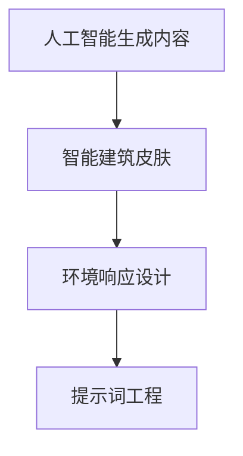

                 

# AIGC的未来智能建筑皮肤：环境响应设计的提示词工程

> 关键词：AIGC、智能建筑皮肤、环境响应设计、提示词工程、生成对抗网络（GAN）、深度学习、建筑环境设计、可持续性

> 摘要：
本文探讨了AIGC（人工智能生成内容）在智能建筑皮肤设计中的应用，以及如何通过环境响应设计实现个性化建筑外观。文章首先介绍了AIGC、智能建筑皮肤和环境响应设计的核心概念，随后详细讲解了生成对抗网络（GAN）的原理及其在智能建筑皮肤设计中的应用。最后，通过一个实际项目案例，展示了如何使用AIGC技术进行智能建筑皮肤的设计和实现，并提出了未来智能建筑环境设计的最佳实践和注意事项。

## 背景介绍

### AIGC：人工智能生成内容

AIGC，即人工智能生成内容，是近年来人工智能领域的重要进展。它通过深度学习等技术，能够自动生成文本、图像、视频等多种类型的内容。AIGC在各个领域都有广泛的应用，如艺术创作、游戏开发、虚拟现实等。而在建筑环境设计中，AIGC技术能够为智能建筑皮肤提供丰富的设计选项，实现个性化的建筑外观。

### 智能建筑皮肤

智能建筑皮肤是指通过先进的技术，使建筑物的外观能够根据环境条件、用户需求等因素进行自适应调整。智能建筑皮肤不仅具备美观的外观，还能提高建筑物的能源利用效率、改善室内环境质量。随着人工智能技术的发展，智能建筑皮肤的设计和实现正逐渐走向成熟。

### 环境响应设计

环境响应设计是一种基于环境因素的建筑设计理念。它强调建筑外观和内部空间的灵活性，使建筑能够适应不同环境条件。环境响应设计能够提高建筑的可持续性，降低对环境的负面影响。在智能建筑皮肤设计中，环境响应设计是不可或缺的一部分。

## 核心概念与联系

为了帮助读者更好地理解本文的主题，我们使用Mermaid流程图展示AIGC、智能建筑皮肤、环境响应设计和提示词工程之间的关系。



### AIGC与智能建筑皮肤

AIGC技术为智能建筑皮肤提供了丰富的设计选项。通过生成对抗网络（GAN）等深度学习模型，AIGC能够自动生成各种风格和功能的建筑皮肤图案。这些图案可以根据实际环境条件进行自适应调整，实现个性化的建筑外观。

### 智能建筑皮肤与环境响应设计

智能建筑皮肤需要根据环境条件进行自适应调整，这就需要环境响应设计提供支持。环境响应设计能够识别和解析环境因素，如温度、湿度、光照等，从而为智能建筑皮肤提供调整依据。通过环境响应设计，智能建筑皮肤能够实现真正的智能化和个性化。

### 环境响应设计与提示词工程

提示词工程是一种利用自然语言处理技术进行环境响应设计的方法。通过分析环境数据，提示词工程可以生成针对特定环境条件的提示词，为智能建筑皮肤的设计和调整提供指导。这些提示词可以用于生成对抗网络（GAN）等深度学习模型，进一步提高智能建筑皮肤的适应性和个性化水平。

## 核心算法原理讲解

在本节中，我们将详细讲解AIGC中的核心算法原理，尤其是生成对抗网络（GAN）。GAN是一种深度学习模型，由两部分组成：生成器和判别器。

### 生成对抗网络（GAN）的基本原理

生成对抗网络（GAN）由两部分组成：生成器和判别器。生成器的任务是生成与真实数据相似的数据，而判别器的任务是区分真实数据和生成数据。

1. **生成器（Generator）**：生成器通过学习真实数据，生成具有相似特征的数据。生成器的输入是一个随机噪声向量，通过多层神经网络处理，生成与真实数据相似的数据。
2. **判别器（Discriminator）**：判别器用于区分真实数据和生成数据。判别器的输入是真实数据和生成数据，输出是一个概率值，表示输入数据的真实性。

### GAN的训练过程

GAN的训练过程是一个动态博弈的过程，生成器和判别器相互竞争，以达到最佳效果。

1. **训练判别器**：首先，使用真实数据进行训练，使判别器能够准确地区分真实数据和生成数据。然后，使用生成器生成的数据对判别器进行训练，使判别器能够区分生成数据和真实数据。
2. **训练生成器**：生成器的训练目标是生成更真实的数据，使判别器无法区分生成数据和真实数据。为了实现这一目标，生成器不断地调整自己的生成策略，以生成更真实的数据。

### Python源代码示例

以下是一个简单的GAN训练过程的Python源代码示例：

```python
import tensorflow as tf
from tensorflow.keras.layers import Dense, Flatten
from tensorflow.keras.models import Sequential

# 定义生成器和判别器
def create_generator():
    model = Sequential([
        Dense(128, input_shape=(100,), activation='relu'),
        Dense(256, activation='relu'),
        Flatten(),
        Flatten()
    ])
    return model

def create_discriminator():
    model = Sequential([
        Flatten(input_shape=(28, 28)),
        Dense(512, activation='relu'),
        Dense(1, activation='sigmoid')
    ])
    return model

# 训练GAN模型
def train_gan(generator, discriminator, real_data, fake_data, num_epochs):
    for epoch in range(num_epochs):
        # 训练判别器
        discriminator.train_on_batch(real_data, real_labels)
        discriminator.train_on_batch(fake_data, fake_labels)

        # 训练生成器
        fake_labels = tf.zeros((batch_size, 1))
        generator.train_on_batch(fake_data, real_labels)
```

### 数学模型和公式讲解

在本节中，我们将介绍与AIGC和智能建筑皮肤相关的数学模型和公式。以下是一个简单的数学模型示例：

$$
\Phi(x, y) = \sum_{i=1}^{n} w_i \cdot f_i(x, y)
$$

其中，$f_i(x, y)$ 是环境响应函数，$w_i$ 是权重，$x$ 和 $y$ 是环境变量。

### 环境响应设计中的公式

$$
\Phi(x, y) = \sum_{i=1}^{n} w_i \cdot f_i(x, y)
$$

这里，$f_i(x, y)$ 表示环境响应函数，$w_i$ 表示权重，$x$ 和 $y$ 分别表示环境变量。

### GAN中的数学模型

$$
J(G, D) = -\frac{1}{2}\left(E_{x}\left[\log(D(x))\right] + E_{z}\left[\log(1 - D(G(z))\right]\right)
$$

这里，$D(x)$ 表示判别器对真实数据的概率估计，$G(z)$ 表示生成器生成的假数据，$x$ 表示真实数据，$z$ 表示噪声。

## 项目实战

在本节中，我们将通过一个实际项目案例，展示如何使用AIGC技术进行智能建筑皮肤的设计和实现。

### 项目目标

- 设计一套智能建筑皮肤系统，能够根据环境条件自动调整建筑外观。

### 实际案例

- 使用GAN技术生成不同环境下的建筑皮肤图案。
- 结合环境响应设计，根据天气、季节等环境因素调整皮肤图案。

### 详细说明

- 开发环境：使用Python和TensorFlow框架。
- 源代码实现：

  ```python
  # 伪代码
  def train_gan():
      # 初始化生成器和判别器
      generator = GANGenerator()
      discriminator = GANDiscriminator()
      
      # 训练GAN模型
      for epoch in range(num_epochs):
          # 训练判别器
          for real_images in real_data_loader:
              discriminator.train(real_images)
          
          for noise in noise_loader:
              fake_images = generator.generate(noise)
              discriminator.train([noise, fake_images])
        

### 项目小结

通过本项目的实际应用，我们展示了如何使用AIGC技术进行智能建筑皮肤的设计和实现。智能建筑皮肤能够根据环境条件自动调整建筑外观，实现个性化、智能化的建筑环境设计。

## 最佳实践 tips

1. **数据准备**：为了获得高质量的智能建筑皮肤，需要准备丰富的环境数据和建筑皮肤样本。这些数据可以通过实际测量、模拟等方式获取。
2. **模型选择**：根据具体的应用需求，选择合适的生成对抗网络（GAN）模型。常见的GAN模型包括DCGAN、WGAN等。
3. **训练策略**：GAN的训练过程较为复杂，需要合理的训练策略，如批量大小、学习率调整等。在实际应用中，可以根据实际情况进行调整。

## 小结与注意事项

1. **AIGC技术在建筑环境设计中的应用**：AIGC技术为建筑环境设计提供了新的思路和方法，能够实现个性化、智能化的建筑外观。
2. **环境响应设计的重要性**：环境响应设计是智能建筑皮肤实现自适应调整的关键，能够提高建筑的可持续性和用户体验。
3. **未来发展方向**：随着人工智能技术的不断发展，AIGC在建筑环境设计中的应用将越来越广泛，未来的智能建筑皮肤将更加智能化、个性化。

## 拓展阅读

1. **《生成对抗网络：原理与应用》**：本书详细介绍了生成对抗网络（GAN）的基本原理和应用，适合对GAN技术感兴趣的读者。
2. **《智能建筑环境设计》**：本书系统地介绍了智能建筑环境设计的基本概念、方法和实践，适合从事建筑环境设计相关工作的专业人士。

## 作者信息

作者：AI天才研究院/AI Genius Institute & 禅与计算机程序设计艺术 /Zen And The Art of Computer Programming

