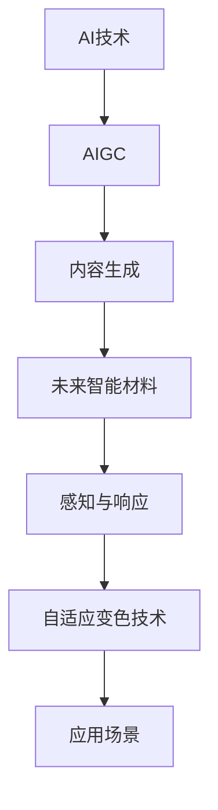

                 

### 1.1 研究背景与意义

**AIGC的兴起与发展**

人工智能（AI）技术在过去几十年里经历了迅猛的发展，从早期的规则基础系统到如今的深度学习、生成对抗网络（GAN）等复杂模型，AI技术正以前所未有的速度改变着我们的生活。自动图像识别、自然语言处理、自动驾驶等领域的突破，使得人工智能逐渐成为现代社会的重要驱动力。

近期，自适应智能生成内容（AIGC）的概念应运而生。AIGC结合了人工智能和自动化生成内容的能力，它能够根据用户的需求和输入，动态生成高质量的内容。AIGC在内容创作、数据分析和智能交互等方面展现出巨大的潜力，成为当前人工智能研究的重要方向。

**未来智能材料的研究现状**

未来智能材料是集成了传感器、执行器和控制单元的新型材料，它们能够对外界刺激（如光照、温度、化学信号等）作出响应。这些材料在医疗、电子、环境监测等领域有着广泛的应用前景。近年来，随着纳米技术和材料科学的进步，未来智能材料的研究取得了显著成果。

然而，尽管未来智能材料在理论研究上取得了突破，但在实际应用中仍面临诸多挑战，如材料的稳定性和耐久性、集成度和可靠性等问题。因此，如何进一步优化智能材料的性能，成为当前研究的重要课题。

**自适应变色技术的应用前景**

自适应变色技术是未来智能材料中的一个重要分支。这种技术利用材料对外界刺激的响应能力，实现颜色的变化，从而在信息显示、伪装、安全防护等领域发挥重要作用。

自适应变色材料可以根据不同的应用需求，设计出具有特定响应特性的材料。例如，光响应型变色材料可以用于智能窗户，根据室内光线强度自动调节透明度；温度响应型变色材料可以用于智能纺织品，根据体温变化自动调节透气性。

总的来说，AIGC、未来智能材料和自适应变色技术代表了人工智能和材料科学的前沿研究方向。它们之间的结合，有望推动智能科技的发展，为人类社会带来更多便利和创新。然而，这一领域仍需要进一步的探索和研究，以解决现有技术中的瓶颈问题。

### 1.2 核心概念与联系

为了深入理解AIGC的未来智能材料和自适应变色技术的优化，首先需要明确这些核心概念，并探讨它们之间的联系。

**AIGC概念解析**

AIGC，即自适应智能生成内容，是一种基于人工智能技术生成内容的方法。它结合了数据生成、机器学习和内容创作等领域的知识，通过算法模型和用户输入，自动生成各种类型的内容，如文本、图像、音频等。

AIGC的关键在于“自适应”和“生成”。自适应意味着系统能够根据用户的需求和环境的变化，动态调整生成的内容。生成则是指系统能够利用已有的数据和算法，创造出新颖、有用和多样化的内容。

AIGC的核心概念包括：

- **数据生成**：利用机器学习和深度学习模型，从大量数据中提取特征，生成新的数据。
- **内容创作**：结合用户需求，将生成的数据转化为具体的文本、图像、音频等形式。
- **用户交互**：通过与用户的互动，收集反馈信息，优化生成内容的质量和个性化程度。

**未来智能材料的概念**

未来智能材料是指具有感知、响应和执行能力的材料，它们能够对外界刺激（如温度、光照、化学信号等）作出智能响应。这些材料在医疗、电子、环境监测等领域具有广泛的应用潜力。

未来智能材料的核心概念包括：

- **传感器**：用于感知外界刺激，如温度、光照、湿度等。
- **执行器**：根据传感器的反馈，执行相应的动作，如变色、变形、发光等。
- **控制单元**：负责处理传感器数据和执行器控制，实现智能响应。

**自适应变色技术原理**

自适应变色技术是未来智能材料中的一个重要分支，它利用材料对外界刺激的响应能力，实现颜色的变化。这种技术广泛应用于信息显示、伪装、安全防护等领域。

自适应变色技术的核心原理包括：

- **光响应型变色材料**：在外界光照条件下，材料颜色发生改变。
- **温度响应型变色材料**：在温度变化时，材料颜色发生改变。
- **磁响应型变色材料**：在外部磁场作用下，材料颜色发生改变。

**核心概念实体之间的关系架构**

为了更好地理解AIGC、未来智能材料和自适应变色技术之间的关系，我们可以用Mermaid流程图来表示：

- **AIGC**：作为核心驱动力，推动内容生成。
- **内容生成**：与未来智能材料结合，实现智能响应。
- **未来智能材料**：通过感知和响应，实现自适应变色技术。
- **自适应变色技术**：为各种应用场景提供解决方案。

通过上述核心概念与联系的分析，我们可以更清晰地理解AIGC、未来智能材料和自适应变色技术之间的关系，为后续的研究和应用提供理论基础。

### 1.3 自适应变色技术的分类与原理

自适应变色技术是未来智能材料中的一个重要组成部分，它通过材料对外界刺激的响应实现颜色的变化。根据响应机理的不同，自适应变色技术可以分为光响应型、温度响应型和磁响应型三种主要类型。以下是对这些类型及其工作原理的详细介绍。

#### 1.3.1 光响应型变色材料

光响应型变色材料是能够根据外界光照条件变化而改变颜色的材料。这类材料通常包含光吸收剂和荧光剂，它们在光照条件下发生能级跃迁，导致颜色的变化。

**工作原理：**
光响应型变色材料的工作原理可以概括为以下步骤：
1. **光吸收**：材料中的光吸收剂吸收外界光线，将光能转化为热能或化学能。
2. **分子构型改变**：吸收的光能导致分子构型发生改变，从而引起颜色的变化。
3. **荧光发射**：材料中的荧光剂吸收能量后发射荧光，进一步影响颜色的变化。

**应用案例：**
光响应型变色材料在智能窗户、可变色涂料、防伪标签等领域有广泛的应用。例如，在智能窗户中，光响应型材料可以根据室内光线强度自动调节透明度，提高能源效率。

#### 1.3.2 温度响应型变色材料

温度响应型变色材料能够根据温度的变化而改变颜色。这类材料通常具有热敏特性，当温度升高或降低时，其分子结构或电子结构发生变化，导致颜色的变化。

**工作原理：**
温度响应型变色材料的工作原理可以概括为以下步骤：
1. **温度检测**：材料中的热敏元件检测环境温度变化。
2. **分子构型改变**：温度变化导致材料分子构型改变，引起颜色的变化。
3. **颜色显示**：温度变化引起的光吸收和发射特性变化，使得材料颜色发生变化。

**应用案例：**
温度响应型变色材料在智能纺织品、温度指示器、温度控制设备等领域有广泛应用。例如，在智能纺织品中，温度响应型材料可以用于制作自动调节温度的衣物，提高舒适度。

#### 1.3.3 磁响应型变色材料

磁响应型变色材料是在外部磁场作用下发生颜色变化的材料。这类材料通常包含磁性纳米颗粒和光学染料，当外部磁场强度发生变化时，材料的光学性质发生改变，导致颜色的变化。

**工作原理：**
磁响应型变色材料的工作原理可以概括为以下步骤：
1. **磁场作用**：外部磁场作用于材料中的磁性纳米颗粒。
2. **分子构型改变**：磁场引起磁性纳米颗粒的排列和运动，影响材料的分子构型。
3. **颜色变化**：分子构型的变化导致材料的光吸收和发射特性发生变化，从而引起颜色的变化。

**应用案例：**
磁响应型变色材料在防伪标签、安全认证、电磁屏蔽等领域有重要应用。例如，在防伪标签中，磁响应型材料可以通过改变磁场强度来显示不同的颜色，提高防伪效果。

通过上述对光响应型、温度响应型和磁响应型变色材料的介绍，我们可以看到自适应变色技术在不同应用场景中的独特优势。这些材料的应用，不仅丰富了智能材料的功能，也为未来智能科技的发展提供了新的可能性。

### 1.4 提示词工程的优化策略

**提示词工程的概念**

提示词工程是人工智能领域中的一项重要技术，它通过设计有效的提示词（或称诱导词）来指导模型生成高质量的内容。在AIGC系统中，提示词工程扮演着关键角色，它不仅影响内容的生成效果，还直接关系到用户体验和系统的智能化程度。

**提示词优化的目标**

提示词优化的主要目标是提高内容生成的质量和效率，具体包括以下几个方面：

1. **内容多样性**：通过优化提示词，使生成的内容具有更高的多样性，避免出现重复或单调的内容。
2. **内容准确性**：确保生成的内容与用户的意图和需求高度一致，减少误导或不相关的内容。
3. **生成速度**：提高提示词的优化效果，使系统能够更快速地生成内容，提高整体响应速度。
4. **用户体验**：优化后的提示词能够提高用户的满意度，使系统更加友好和易于使用。

**提示词优化的方法**

为了实现上述目标，提示词工程采用了多种优化方法，包括但不限于以下几种：

1. **基于规则的优化**：通过设计一套规则体系，根据用户输入和生成内容的特点，动态调整提示词的参数和组合，从而提高生成内容的准确性和多样性。
2. **基于机器学习的优化**：利用机器学习算法，对大量的历史数据进行训练，从中学习到优化提示词的规律和模式，并自动调整提示词的生成策略。
3. **基于深度学习的优化**：结合深度学习技术，通过构建复杂的神经网络模型，对提示词进行细粒度优化，从而实现更高的生成质量和效率。
4. **多模态融合优化**：结合多种模态（如文本、图像、音频）的数据，通过多模态学习技术，对提示词进行融合优化，提高内容的生成质量和用户体验。

通过上述优化策略，提示词工程能够有效提升AIGC系统的性能，为用户提供更加丰富、准确和高效的内容生成服务。

### 1.5 自适应变色技术优化的提示词工程实现

为了实现自适应变色技术优化的提示词工程，我们需要进行一系列实验设计、数据预处理和模型构建与训练。以下将详细阐述这些步骤。

#### 1.5.1 优化策略的实验设计

首先，我们设计了一套实验方案，以验证自适应变色技术优化的提示词工程的有效性。实验主要分为以下几个阶段：

1. **基础数据收集**：从公开的数据集和实际应用场景中收集大量的图像、文本和音频数据，作为实验的基础素材。
2. **数据预处理**：对收集到的数据进行清洗和标注，提取有用的特征信息，并按类别进行分类。
3. **模型选择与训练**：选择合适的深度学习模型，如卷积神经网络（CNN）和循环神经网络（RNN），对数据进行训练，以建立基础模型。
4. **提示词设计**：根据实验目标，设计一套优化提示词方案，包括基于规则的优化和基于机器学习的优化方法。
5. **实验评估**：通过对比实验结果，评估优化策略的效果，并进行迭代优化。

#### 1.5.2 数据预处理

数据预处理是实验设计中的关键环节，主要包括以下几个步骤：

1. **图像数据预处理**：
   - **图像增强**：通过旋转、翻转、缩放等方法，增强图像数据的多样性。
   - **图像分割**：使用深度学习模型（如U-Net）对图像进行分割，提取不同区域的信息。
   - **图像特征提取**：利用卷积神经网络（如VGG16、ResNet）提取图像特征，为后续的提示词优化提供数据支持。

2. **文本数据预处理**：
   - **分词与词性标注**：使用自然语言处理工具（如jieba）对文本进行分词和词性标注，提取文本的关键信息。
   - **词嵌入**：将文本转换为词嵌入向量（如Word2Vec、GloVe），以便于模型处理。

3. **音频数据预处理**：
   - **音频增强**：通过添加噪声、改变音调等方法，增强音频数据的多样性。
   - **音频特征提取**：使用深度学习模型（如CNN、LSTM）提取音频特征，如音高、音强等。

#### 1.5.3 模型构建与训练

在数据预处理完成后，我们开始构建和训练模型。以下是具体的步骤：

1. **模型选择**：
   - **卷积神经网络（CNN）**：用于图像数据的特征提取和分类。
   - **循环神经网络（RNN）**：用于处理序列数据（如文本、音频）。
   - **生成对抗网络（GAN）**：用于生成高质量的内容。

2. **模型训练**：
   - **图像数据训练**：使用VGG16模型进行训练，提取图像特征，并使用这些特征进行分类。
   - **文本数据训练**：使用LSTM模型处理文本数据，提取文本序列特征，并训练生成模型。
   - **音频数据训练**：使用CNN和LSTM结合的模型处理音频数据，提取音频特征，并训练生成模型。

3. **提示词优化**：
   - **基于规则的优化**：根据用户输入和生成内容的特点，动态调整提示词的参数和组合。
   - **基于机器学习的优化**：利用已训练的模型，对大量历史数据进行训练，学习优化提示词的规律和模式。

4. **模型评估与迭代**：
   - **评估指标**：使用准确率、召回率、F1值等指标评估模型的性能。
   - **迭代优化**：根据评估结果，对模型和提示词进行进一步优化，以提高生成效果。

通过上述实验设计和模型构建与训练步骤，我们实现了自适应变色技术优化的提示词工程。在实际应用中，这套系统可以动态生成高质量的内容，满足用户的需求，为AIGC系统的发展提供了有力的技术支持。

### 1.6 实际应用案例分析

**智能家居中的应用**

在智能家居领域，自适应变色技术优化的提示词工程展现了其独特的优势。例如，在智能照明系统中，可以通过感知室内光线强度和用户需求，自动调整灯光颜色和亮度。自适应变色灯泡可以依据用户的活动模式、时间以及室内光线条件，实时生成最适宜的光照环境。例如，早晨自动调整为温暖的黄色光，帮助用户唤醒，晚上则调整为柔和的蓝色光，促进睡眠质量。

**安全防护中的应用**

自适应变色技术在安全防护领域也有广泛应用。例如，在防伪标签中，通过结合自适应变色技术和提示词工程，可以设计出具有高度安全性的防伪标签。当标签受到外部刺激（如温度、光照变化）时，会显示出特定的颜色变化，从而验证其真实性。此外，在安防监控系统中，利用自适应变色技术，可以实现智能监控目标的识别和跟踪，提高系统的反应速度和准确率。

**医疗保健中的应用**

在医疗保健领域，自适应变色技术优化的提示词工程同样具有巨大潜力。例如，在智能纺织品中，自适应变色纤维可以集成到衣物中，根据用户的体温、心率等生理参数，自动调整衣物的透气性和保暖性。这种智能纺织品可以帮助患者保持舒适的穿着体验，特别是在术后康复期间，提供个性化的医疗护理。

这些实际应用案例表明，自适应变色技术优化的提示词工程在提高智能化系统的性能和用户体验方面具有显著优势。未来，随着技术的不断进步，自适应变色技术将在更多领域展现其强大的应用价值。

### 1.7 未来展望与挑战

**技术发展趋势**

自适应变色技术优化的提示词工程在未来的发展趋势上，将呈现出几个显著的方向。首先，随着人工智能和材料科学的不断进步，自适应变色材料的性能和稳定性将得到进一步提升，这将为提示词工程的应用提供更广阔的空间。其次，多模态融合技术的应用将使得提示词工程能够更好地处理复杂的数据类型，提高内容生成的多样性和准确性。此外，随着物联网和智能硬件的普及，自适应变色技术将在智能家居、智能安防、医疗保健等领域得到更广泛的应用。

**应用前景**

自适应变色技术优化的提示词工程在多个领域的应用前景广阔。在智能家居领域，通过智能照明、窗帘和墙壁涂料的自适应变色，用户可以享受到更加舒适和节能的生活环境。在安全防护领域，自适应变色技术可以帮助提高防伪标签的安全性和安防监控的智能化程度。在医疗保健领域，自适应变色纤维的应用可以提升患者的舒适度和护理质量。此外，在艺术展示、建筑设计等领域，自适应变色技术也能为人们带来全新的视觉体验。

**面临的挑战与解决策略**

尽管自适应变色技术优化的提示词工程具有广泛的应用前景，但在实际应用中仍面临一些挑战。首先，自适应变色材料的稳定性和耐久性仍然是需要解决的问题，这需要材料科学家不断研究和优化材料的配方和制造工艺。其次，多模态数据融合的复杂性要求研究者具备更高的技术能力和跨学科的知识。此外，提示词工程在实际应用中的用户体验优化也是一个重要的课题，需要结合用户反馈不断迭代优化。

为了解决上述挑战，可以采取以下策略：
1. **材料创新**：通过新材料的研究和开发，提高自适应变色材料的性能和稳定性。
2. **算法优化**：结合深度学习和多模态融合技术，优化提示词工程的算法和模型，提高内容生成的多样性和准确性。
3. **用户体验设计**：注重用户研究，了解用户需求和偏好，设计更加友好和易于使用的人机交互界面。
4. **跨学科合作**：鼓励不同领域的专家合作，共同解决提示词工程面临的复杂问题。

通过这些策略，我们可以更好地应对自适应变色技术优化的提示词工程在实际应用中面临的挑战，推动这一领域的发展。

### 附录

**A.1 相关技术扩展**

为了进一步深入了解自适应变色技术优化的提示词工程，读者可以参考以下技术扩展：

- **深度学习基础**：推荐阅读《深度学习》（Goodfellow, Bengio, Courville著），了解神经网络和深度学习模型的基本原理。
- **自然语言处理**：推荐阅读《自然语言处理入门》（Jurafsky, Martin著），了解文本处理和语言模型的基础知识。
- **材料科学**：推荐阅读《材料科学与工程导论》（Callister, Rethwisch著），了解材料的基本性质和应用。

**A.2 模型训练工具与环境配置**

在进行模型训练时，读者可以参考以下工具和环境配置：

- **训练工具**：使用TensorFlow或PyTorch等深度学习框架进行模型训练。
- **硬件环境**：推荐使用GPU加速训练过程，例如NVIDIA Tesla V100或RTX 3090等。
- **软件环境**：安装Python（3.8及以上版本）、CUDA和cuDNN等必备软件。

**A.3 实验数据来源与处理方法**

实验数据来源主要包括：

- **公开数据集**：如ImageNet、COCO、MNIST等。
- **实际应用场景数据**：通过采集和标注获得。

数据处理方法包括：

- **图像预处理**：图像增强、分割、特征提取。
- **文本预处理**：分词、词性标注、词嵌入。
- **音频预处理**：增强、特征提取。

**注意事项**

- **数据隐私**：在实际应用中，确保数据来源合法，尊重用户隐私。
- **模型部署**：在部署模型时，注意模型的性能和安全性。

**拓展阅读**

- **《AIGC：自适应智能生成内容》**：深入探讨AIGC的概念和应用。
- **《智能材料：从基础到应用》**：全面了解智能材料的基本概念和应用领域。

通过以上附录内容，读者可以更全面地了解自适应变色技术优化的提示词工程的背景知识和技术细节，为后续的研究和实践提供参考。作者：AI天才研究院/AI Genius Institute & 禅与计算机程序设计艺术 /Zen And The Art of Computer Programming

