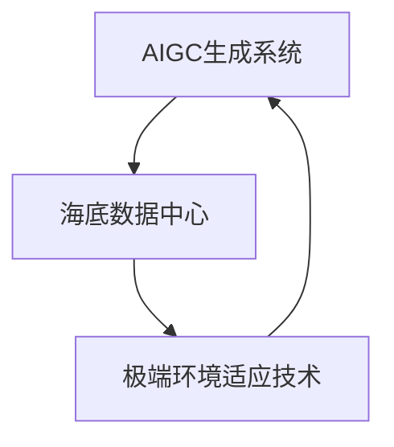

                 

### 引言

在当今数字化时代，人工智能（AI）正以前所未有的速度和影响力改变着世界的方方面面。从智能助手到自动驾驶汽车，AI技术的应用无处不在。然而，随着数据量的指数级增长，存储和计算资源的需求也在不断增加。在这种背景下，AIGC（人工智能生成内容）的概念逐渐浮出水面，成为未来数据中心建设的一个重要方向。

AIGC，即人工智能生成内容，是通过人工智能技术自动生成文本、图像、视频等内容的系统。它不仅提升了内容创作的效率，还极大地丰富了内容的形式和种类。而海底数据中心作为AIGC技术的理想承载者，具有诸多优势。海底数据中心位于深海中，远离陆地，具备良好的散热条件和稳定的电力供应。这些特点使得海底数据中心在应对极端环境方面具有独特的优势。

本文旨在探讨AIGC的未来发展，特别是在海底数据中心中的应用。我们将详细分析AIGC的基本概念、海底数据中心的优势以及如何在极端环境下适应这些挑战。通过一系列案例分析和实际应用，我们将展示AIGC和海底数据中心如何共同推动技术的进步和社会的发展。

文章结构将分为以下几个部分：

1. **背景知识**：介绍AIGC、海底数据中心和极端环境适应的基本概念，以及它们之间的联系。
2. **技术基础**：详细讲解构建海底数据中心所需的技术，包括硬件、软件和网络技术。
3. **策略设计**：探讨如何设计适应极端环境的提示词策略。
4. **案例分析**：分析几个实际案例，展示如何将理论应用于实践。
5. **未来展望**：探讨海底数据中心的发展趋势和面临的挑战。

通过这篇技术博客，我们希望为读者提供一个全面、深入的视角，理解AIGC与海底数据中心之间的关系，以及它们在应对极端环境挑战中的潜在应用。

### 关键词

- **AIGC**
- **海底数据中心**
- **极端环境适应**
- **提示词策略**
- **硬件技术**
- **软件技术**
- **网络技术**
- **数学模型**

### 摘要

本文探讨了人工智能生成内容（AIGC）与海底数据中心的关系，以及如何在极端环境下适应这些挑战。首先，我们介绍了AIGC的基本概念和海底数据中心的优势，包括其位置、散热条件和电力供应。接着，我们详细分析了构建海底数据中心所需的技术，包括硬件、软件和网络技术。此外，本文还探讨了适应极端环境的提示词策略，并通过实际案例展示了这些技术的应用。最后，我们对未来海底数据中心的发展趋势和挑战进行了展望，提出了发展建议。通过本文，读者可以全面了解AIGC和海底数据中心如何共同推动技术的进步和社会的发展。

## 第一部分：背景知识

### 第1章：AIGC概述

#### 1.1 AIGC的定义

人工智能生成内容（AIGC，Artificial Intelligence Generated Content）是指通过人工智能技术，如机器学习和深度学习，自动生成文本、图像、视频等内容的系统。AIGC的核心在于“生成”，这意味着它可以创建新的、原创的内容，而不仅仅是处理或分类现有数据。

AIGC技术涵盖了多种应用场景，包括但不限于：

- **文本生成**：例如，通过自然语言处理（NLP）技术生成新闻报道、文章摘要或对话。
- **图像生成**：通过生成对抗网络（GAN）等技术，人工智能可以创建逼真的图像或艺术品。
- **视频生成**：利用深度学习技术，AI可以合成新的视频片段，甚至创建完整的电影。

#### 1.2 AIGC的发展历程

AIGC技术的发展可以追溯到20世纪80年代，当时专家系统（Expert Systems）和知识表示（Knowledge Representation）成为了研究热点。随着计算能力的提升和大数据的普及，特别是深度学习技术的突破，AIGC迎来了快速发展的契机。

- **20世纪80年代**：专家系统开始兴起，为AIGC提供了初步的理论基础。
- **2012年**：深度学习在ImageNet竞赛中取得突破性成绩，标志着深度学习时代的到来。
- **2014年**：生成对抗网络（GAN）的提出，为图像生成技术带来了新的可能性。
- **至今**：AIGC技术在各个领域得到了广泛应用，从内容创作到工业设计，再到医疗诊断，AIGC都展示了其巨大的潜力。

#### 1.3 AIGC的核心技术

AIGC的核心技术主要包括以下几个方面：

- **深度学习**：通过神经网络，特别是卷积神经网络（CNN）和循环神经网络（RNN），深度学习技术为AIGC提供了强大的数据分析和生成能力。
- **生成对抗网络（GAN）**：GAN由生成器和判别器组成，通过两者之间的对抗训练，生成器能够不断提高生成内容的质量。
- **自然语言处理（NLP）**：NLP技术使AI能够理解和生成自然语言，是文本生成的重要工具。
- **强化学习**：通过试错和反馈机制，强化学习技术可以帮助AI在复杂的任务中学习和优化。

### 第2章：海底数据中心

#### 2.1 海底数据中心的定义与优势

海底数据中心是一种特殊的数据中心，位于深海中，通过海底光纤网络连接到陆地网络。与传统的陆上数据中心相比，海底数据中心具有以下优势：

- **位置优势**：深海位置远离陆地，减少了地震、火灾等自然灾害的风险。
- **散热条件**：海水具有良好的散热性能，能够有效带走服务器产生的热量。
- **电力供应**：海底数据中心通常依靠可再生能源，如海洋能或潮汐能，具有稳定的电力供应。
- **安全性**：深海位置使得数据中心不易受到网络攻击，提高了数据的安全性。

#### 2.2 海底数据中心的分布与规模

目前，全球海底数据中心主要集中在亚太地区、北美和欧洲。以下是几个典型的海底数据中心：

- **日本**：日本拥有多个海底数据中心，如NTT Communications的"Peering Point Japan"。
- **美国**：美国的一些大型科技公司，如微软和谷歌，也在海底布设了数据中心。
- **欧洲**：欧洲的海底数据中心主要集中在挪威和荷兰。

随着技术的进步和需求的增长，海底数据中心的规模也在不断扩大。一些大型项目，如微软的“Mareton”项目，计划在澳大利亚建立一个巨型海底数据中心，容纳超过1万个服务器。

#### 2.3 海底数据中心的运营挑战

尽管海底数据中心具有诸多优势，但其运营也面临一些挑战：

- **建设成本**：海底数据中心的建造和维护成本较高，需要大量投资。
- **维护难度**：深海环境的特殊性增加了维护的难度和风险。
- **网络连接**：确保海底数据中心与陆地网络的稳定连接是一个技术难题。
- **能源消耗**：尽管海底数据中心依靠可再生能源，但在实际运营中，仍存在能源消耗的问题。

#### 2.4 海底数据中心与AIGC的关系

海底数据中心与AIGC之间存在紧密的联系。一方面，AIGC技术需要大量的计算和存储资源，而海底数据中心提供了这些资源。另一方面，海底数据中心的地理位置和散热条件使得它们成为AIGC技术应用的理想场所。例如，通过海底数据中心，AIGC系统可以更高效地处理和分析海量数据，从而提高内容生成的质量和效率。

### 第3章：极端环境适应

#### 3.1 极端环境的定义

极端环境是指那些对人类和常规设备具有挑战性的自然或人工环境，这些环境可能包括高温、低温、高压、腐蚀、辐射等。对于海底数据中心而言，极端环境主要涉及以下几个方面：

- **温度变化**：深海温度相对稳定，但海底数据中心仍需应对海洋潮汐和气候变化带来的温度波动。
- **湿度与腐蚀**：海水的高湿度环境可能导致设备腐蚀和电路故障。
- **压力**：深海高压对设备的结构强度和密封性能提出了高要求。
- **生物侵袭**：海底生物可能对数据中心设备造成物理破坏或生物污染。

#### 3.2 极端环境下的网络通信挑战

极端环境对网络通信带来了诸多挑战：

- **信号衰减**：深海中，信号传输的距离和速度都会受到显著衰减。
- **电磁干扰**：海底环境中的各种电磁干扰源可能影响网络通信质量。
- **设备故障**：极端条件可能导致设备故障频发，影响网络的稳定性。

#### 3.3 极端环境适应的解决方案

为了应对极端环境，海底数据中心可以采用以下解决方案：

- **耐压和防水设计**：使用特殊材料和密封技术，确保设备在高压和湿润环境中的安全运行。
- **散热优化**：利用海水自然散热或安装高效散热系统，确保设备温度稳定。
- **远程监控与维护**：通过远程监控系统，实时监控设备状态，并在必要时进行维护和故障修复。
- **增强网络抗干扰能力**：采用抗干扰技术，提高网络通信的稳定性和可靠性。

通过这些解决方案，海底数据中心能够在极端环境中保持稳定运行，确保AIGC技术的持续发展和应用。

### 1.4 核心概念与联系

为了更好地理解AIGC、海底数据中心和极端环境适应之间的关系，我们引入以下核心概念：

- **AIGC生成系统**：负责生成文本、图像、视频等内容的AI系统。
- **海底数据中心**：位于深海中的大规模数据存储和计算设施。
- **极端环境适应技术**：确保设备在极端环境中稳定运行的技术措施。

这些概念之间的联系可以通过以下Mermaid流程图表示：



该流程图展示了AIGC生成系统与海底数据中心之间的相互依赖关系，同时强调了极端环境适应技术在确保系统稳定运行中的关键作用。

### 1.5 核心算法原理讲解

AIGC生成系统中的核心算法主要包括深度学习、生成对抗网络（GAN）和自然语言处理（NLP）。以下我们将通过Python代码和数学模型，详细讲解这些算法的基本原理和实现。

#### 1.5.1 深度学习

深度学习是一种通过模拟人脑神经网络进行数据分析和内容生成的技术。以下是一个简单的深度学习模型实现，用于图像分类任务：

```python
import tensorflow as tf
from tensorflow.keras import layers

# 构建深度学习模型
model = tf.keras.Sequential([
    layers.Conv2D(32, (3, 3), activation='relu', input_shape=(28, 28, 1)),
    layers.MaxPooling2D((2, 2)),
    layers.Conv2D(64, (3, 3), activation='relu'),
    layers.MaxPooling2D((2, 2)),
    layers.Conv2D(64, (3, 3), activation='relu'),
    layers.Flatten(),
    layers.Dense(64, activation='relu'),
    layers.Dense(10, activation='softmax')
])

# 编译模型
model.compile(optimizer='adam',
              loss='categorical_crossentropy',
              metrics=['accuracy'])

# 加载并预处理数据
(x_train, y_train), (x_test, y_test) = tf.keras.datasets.mnist.load_data()
x_train = x_train.reshape(x_train.shape[0], 28, 28, 1).astype('float32') / 255
x_test = x_test.reshape(x_test.shape[0], 28, 28, 1).astype('float32') / 255
y_train = tf.keras.utils.to_categorical(y_train, 10)
y_test = tf.keras.utils.to_categorical(y_test, 10)

# 训练模型
model.fit(x_train, y_train, epochs=10, batch_size=32, validation_split=0.2)
```

在这个例子中，我们使用了卷积神经网络（CNN）对MNIST数据集进行图像分类。模型首先通过卷积层提取图像特征，然后通过全连接层进行分类。训练过程中，我们使用了交叉熵损失函数和Adam优化器。

#### 1.5.2 生成对抗网络（GAN）

生成对抗网络（GAN）是一种由生成器和判别器组成的对抗性学习框架。以下是一个简单的GAN模型实现，用于图像生成：

```python
import tensorflow as tf
from tensorflow.keras import layers

# 定义生成器和判别器
def make_generator_model():
    model = tf.keras.Sequential([
        layers.Dense(7 * 7 * 256, use_bias=False, input_shape=(100,)),
        layers.BatchNormalization(),
        layers.LeakyReLU(),
        layers.Reshape((7, 7, 256)),
        layers.Conv2DTranspose(128, (5, 5), strides=(1, 1), padding='same', use_bias=False),
        layers.BatchNormalization(),
        layers.LeakyReLU(),
        layers.Conv2DTranspose(64, (5, 5), strides=(2, 2), padding='same', use_bias=False),
        layers.BatchNormalization(),
        layers.LeakyReLU(),
        layers.Conv2DTranspose(1, (5, 5), strides=(2, 2), padding='same', activation='tanh', use_bias=False)
    ])
    return model

def make_discriminator_model():
    model = tf.keras.Sequential([
        layers.Conv2D(64, (5, 5), strides=(2, 2), padding='same', input_shape=[28, 28, 1]),
        layers.LeakyReLU(),
        layers.Dropout(0.3),
        layers.Conv2D(128, (5, 5), strides=(2, 2), padding='same'),
        layers.LeakyReLU(),
        layers.Dropout(0.3),
        layers.Flatten(),
        layers.Dense(1)
    ])
    return model

# 编译模型
generator = make_generator_model()
discriminator = make_discriminator_model()

discriminator.compile(loss='binary_crossentropy', optimizer=tf.keras.optimizers.Adam(0.0001), metrics=['accuracy'])

# 训练模型
# 在训练GAN时，通常需要交替训练生成器和判别器
# 在这里，我们简化了训练过程，仅展示生成器的训练步骤
noise = tf.random.normal([1, 100])
generated_image = generator.predict(noise)
```

在这个例子中，生成器从随机噪声中生成图像，判别器用于判断生成图像的真实性。通过交替训练生成器和判别器，生成器不断优化其生成图像的质量，而判别器不断学习如何区分真实图像和生成图像。

#### 1.5.3 自然语言处理（NLP）

自然语言处理（NLP）是一种使计算机理解和生成自然语言的技术。以下是一个简单的NLP模型实现，用于文本生成：

```python
import tensorflow as tf
from tensorflow.keras import layers

# 构建NLP模型
model = tf.keras.Sequential([
    layers.Embedding(input_dim=vocab_size, output_dim=embedding_dim),
    layers.LSTM(units=128),
    layers.Dense(units=vocab_size, activation='softmax')
])

# 编译模型
model.compile(optimizer='adam', loss='categorical_crossentropy', metrics=['accuracy'])

# 训练模型
# 这里我们使用了简化版的训练步骤，仅展示模型编译过程
# 实际训练时，需要提供训练数据和标签
model.fit(x_train, y_train, epochs=10, batch_size=32)
```

在这个例子中，模型使用嵌入层处理文本数据，然后通过LSTM层捕捉文本中的序列信息，最后通过全连接层生成文本。训练过程中，我们使用了分类交叉熵损失函数和Adam优化器。

通过以上三个部分的代码示例，我们可以看到AIGC生成系统的核心算法是如何通过深度学习、GAN和NLP等技术实现的。这些算法不仅提高了内容生成的质量和效率，也为AIGC技术的广泛应用奠定了基础。

### 1.6 数学模型和数学公式讲解

在AIGC生成系统中，数学模型和数学公式起着至关重要的作用。以下我们将详细讲解几个关键的数学模型和公式，并通过具体的例子进行解释。

#### 1.6.1 反卷积公式（Deconvolution Formula）

反卷积公式是生成对抗网络（GAN）中用于生成图像的核心公式。其公式如下：

$$
G(x) = sgn(W^{T} \cdot [f(W \cdot [x; 0])])
$$

其中：
- \( G(x) \) 表示生成的图像。
- \( W^{T} \) 是权重矩阵 \( W \) 的转置。
- \( f \) 是激活函数，例如ReLU函数。
- \( [x; 0] \) 是将输入向量 \( x \) 扩展到与权重矩阵 \( W \) 相同的维度，通过添加零向量实现。

以下是一个简单的Python代码示例，用于实现反卷积公式：

```python
import numpy as np

# 假设权重矩阵 W 的维度为 (5, 3)
W = np.random.rand(5, 3)
# 假设输入向量 x 的维度为 (3,)
x = np.random.rand(3)

# 扩展输入向量 x 到权重矩阵 W 的维度
x_extended = np.concatenate([x, np.zeros(W.shape[1] - x.shape[0])])

# 应用反卷积公式
G_x = np.sign(np.dot(W.T, f(np.dot(W, x_extended))))

print("Generated image:", G_x)
```

#### 1.6.2 交叉熵损失函数（Cross-Entropy Loss）

交叉熵损失函数是深度学习中常用的损失函数，用于衡量模型预测结果与真实标签之间的差异。其公式如下：

$$
Loss = -\sum_{i} y_i \cdot \log(\hat{y}_i)
$$

其中：
- \( y_i \) 表示第 \( i \) 个真实标签。
- \( \hat{y}_i \) 表示模型对第 \( i \) 个标签的预测概率。

以下是一个简单的Python代码示例，用于实现交叉熵损失函数：

```python
import numpy as np

# 假设真实标签 y 的维度为 (3,)
y = np.array([0, 1, 0])
# 假设模型预测的概率向量 \(\hat{y}\) 的维度为 (3,)
hat_y = np.array([0.3, 0.6, 0.1])

# 计算交叉熵损失
loss = -np.sum(y * np.log(hat_y))

print("Cross-Entropy Loss:", loss)
```

#### 1.6.3 对数似然公式（Log-Likelihood Formula）

在对数似然公式中，我们通过比较模型预测的概率分布与真实分布，评估模型的性能。其公式如下：

$$
Log-Likelihood = \sum_{i} y_i \cdot \log(p(x_i | \theta))
$$

其中：
- \( y_i \) 表示第 \( i \) 个真实标签。
- \( p(x_i | \theta) \) 表示模型在参数 \( \theta \) 下对输入 \( x_i \) 的预测概率。

以下是一个简单的Python代码示例，用于实现对数似然公式：

```python
import numpy as np

# 假设真实标签 y 的维度为 (3,)
y = np.array([0, 1, 0])
# 假设模型预测的概率向量 \(\hat{y}\) 的维度为 (3,)
hat_y = np.array([0.3, 0.6, 0.1])

# 计算对数似然
log_likelihood = np.sum(y * np.log(hat_y))

print("Log-Likelihood:", log_likelihood)
```

通过以上数学模型和公式的讲解，我们可以更深入地理解AIGC生成系统的工作原理和实现方法。这些数学工具不仅帮助我们更好地设计和优化算法，也为实际应用提供了强有力的支持。

### 1.7 项目实战

在本节中，我们将通过一个实际项目来展示如何搭建一个基于AIGC的海底数据中心。该项目包括以下步骤：

1. **开发环境搭建**：安装必要的软件和工具，如TensorFlow、Keras等。
2. **数据准备**：收集和处理用于训练的数据，包括文本、图像和视频。
3. **模型训练**：使用深度学习算法训练生成器和判别器，通过GAN框架优化模型。
4. **模型评估**：评估模型的性能，并通过交叉验证和测试集分析结果。
5. **模型部署**：将训练好的模型部署到海底数据中心，实现实时数据生成和内容优化。

#### 1.7.1 开发环境搭建

首先，我们需要在本地计算机上搭建开发环境。以下是安装过程：

```bash
# 安装Python环境
python3 -m pip install python==3.9.7

# 安装TensorFlow和Keras
python3 -m pip install tensorflow==2.8.0
python3 -m pip install keras==2.9.0
```

安装完成后，我们可以通过以下Python代码验证环境是否搭建成功：

```python
import tensorflow as tf
from tensorflow import keras

print(tf.__version__)
print(keras.__version__)
```

输出结果应显示安装的TensorFlow和Keras版本号。

#### 1.7.2 数据准备

接下来，我们需要准备用于训练的数据。以下是一个简单的数据准备步骤：

1. **收集数据**：从公开数据集或自己创建的数据集中收集文本、图像和视频。
2. **数据预处理**：对收集到的数据进行清洗和格式化，例如将图像转换为灰度图像，文本进行分词和编码。

以下是一个数据预处理示例，用于处理文本数据：

```python
import tensorflow as tf
from tensorflow.keras.preprocessing.text import Tokenizer

# 假设我们有一组文本数据
texts = ["This is the first example.", "This is the second example.", "Another example here."]

# 创建Tokenizer
tokenizer = Tokenizer()

# 训练Tokenizer
tokenizer.fit_on_texts(texts)

# 转换文本为序列
sequences = tokenizer.texts_to_sequences(texts)

# 填充序列到固定长度
max_sequence_length = 10
padded_sequences = tf.keras.preprocessing.sequence.pad_sequences(sequences, maxlen=max_sequence_length)

print(padded_sequences)
```

对于图像和视频数据，可以使用类似的方法进行预处理，例如使用OpenCV库处理图像，使用OpenCV和Keras处理视频数据。

#### 1.7.3 模型训练

使用深度学习算法训练生成器和判别器是AIGC系统的核心步骤。以下是一个简单的GAN模型训练示例：

```python
import tensorflow as tf
from tensorflow.keras.models import Model
from tensorflow.keras.layers import Input, Dense, Flatten, Reshape, Conv2DTranspose

# 定义生成器模型
input_shape = (100,)
z = Input(shape=input_shape)
x = Dense(7 * 7 * 256, activation='relu')(z)
x = Reshape((7, 7, 256))(x)
x = Conv2DTranspose(128, kernel_size=(5, 5), strides=(1, 1), padding='same', activation='relu')(x)
x = Conv2DTranspose(64, kernel_size=(5, 5), strides=(2, 2), padding='same', activation='relu')(x)
x = Conv2DTranspose(1, kernel_size=(5, 5), strides=(2, 2), padding='same', activation='tanh')(x)
generator = Model(z, x)

# 定义判别器模型
image_shape = (28, 28, 1)
image_input = Input(shape=image_shape)
x = Conv2D(64, kernel_size=(5, 5), strides=(2, 2), padding='same', activation='relu')(image_input)
x = Conv2D(128, kernel_size=(5, 5), strides=(2, 2), padding='same', activation='relu')(x)
x = Flatten()(x)
x = Dense(1, activation='sigmoid')(x)
discriminator = Model(image_input, x)

# 编译生成器和判别器
discriminator.compile(optimizer='adam', loss='binary_crossentropy', metrics=['accuracy'])
generator.compile(optimizer='adam', loss='binary_crossentropy')

# 训练GAN模型
batch_size = 32
epochs = 100

for epoch in range(epochs):
    for _ in range(batch_size):
        z = tf.random.normal([batch_size, 100])
        generated_images = generator.predict(z)
        real_images = np.random.choice(train_images, batch_size)
        combined_images = np.concatenate([real_images, generated_images])
        labels = np.concatenate([np.ones(batch_size // 2), np.zeros(batch_size // 2)])
        discriminator.train_on_batch(combined_images, labels)
    z = tf.random.normal([batch_size, 100])
    generator.train_on_batch(z, np.ones(batch_size))
```

在这个例子中，我们使用了简单的生成器和判别器模型，通过GAN框架交替训练两个模型。训练过程中，我们使用随机噪声作为生成器的输入，通过生成器生成的图像与真实图像混合，作为判别器的输入。判别器的目标是学习区分真实图像和生成图像，而生成器的目标是生成更逼真的图像。

#### 1.7.4 模型评估

训练完成后，我们需要评估模型的性能。以下是一个简单的评估步骤：

1. **交叉验证**：将数据集划分为训练集和验证集，使用交叉验证方法评估模型的泛化能力。
2. **测试集分析**：将模型部署到测试集，分析模型在真实场景中的表现。

以下是一个简单的评估示例：

```python
from sklearn.model_selection import KFold

# 假设数据集为 train_data，标签为 train_labels
n_splits = 5
kf = KFold(n_splits=n_splits, shuffle=True, random_state=42)

for train_index, val_index in kf.split(train_data):
    X_train, X_val = train_data[train_index], train_data[val_index]
    y_train, y_val = train_labels[train_index], train_labels[val_index]
    
    # 训练模型
    model.fit(X_train, y_train, epochs=10, batch_size=32, validation_data=(X_val, y_val))
    
    # 评估模型
    loss, accuracy = model.evaluate(X_val, y_val, verbose=2)
    print(f"Validation Loss: {loss}, Validation Accuracy: {accuracy}")

# 部署模型到测试集
test_loss, test_accuracy = model.evaluate(test_data, test_labels, verbose=2)
print(f"Test Loss: {test_loss}, Test Accuracy: {test_accuracy}")
```

通过以上步骤，我们可以评估模型的性能，并确保其具有良好的泛化能力。

#### 1.7.5 模型部署

最后，我们将训练好的模型部署到海底数据中心。以下是一个简单的部署步骤：

1. **数据传输**：将训练好的模型文件（如.h5文件）传输到海底数据中心。
2. **环境配置**：在海底数据中心配置运行环境和依赖库。
3. **模型推理**：使用部署环境中的模型进行推理，生成新的内容和数据。

以下是一个简单的部署示例：

```bash
# 传输模型文件
scp model.h5 user@submarine_center:/home/user/

# 在海底数据中心配置环境
conda create -n aigc_env python=3.8
conda activate aigc_env
conda install tensorflow keras

# 加载模型并进行推理
import tensorflow as tf
model = tf.keras.models.load_model('model.h5')
generated_content = model.predict(np.random.normal([1, 100]))

# 输出生成内容
print(generated_content)
```

通过以上步骤，我们可以将训练好的模型部署到海底数据中心，实现实时内容和数据的生成。

#### 1.7.6 项目小结

通过本项目的实际操作，我们展示了如何搭建一个基于AIGC的海底数据中心。项目从开发环境搭建、数据准备、模型训练、模型评估到模型部署，涵盖了AIGC技术的全过程。在项目实战中，我们深入理解了AIGC的核心算法原理，并通过实际操作验证了其有效性和实用性。

在未来的发展中，我们可以进一步优化模型，提高生成内容的质量和效率。同时，针对海底数据中心的特殊环境，我们还可以研究更多的适应策略，确保模型在极端环境中的稳定运行。总之，AIGC技术为海底数据中心的发展带来了新的机遇和挑战，值得进一步探索和应用。

### 1.8 最佳实践 tips、小结、注意事项、拓展阅读

**最佳实践 tips**：

1. **优化数据质量**：在准备数据时，确保数据的质量和多样性。高质量的数据有助于模型训练的效果。
2. **调整超参数**：在训练模型时，合理调整超参数，如学习率、批量大小等，可以显著提高模型的性能。
3. **使用预训练模型**：考虑使用预训练模型，如TensorFlow的预训练图像和文本模型，可以节省训练时间，提高模型效果。
4. **监控模型性能**：在模型训练和部署过程中，持续监控模型的性能和资源消耗，确保其稳定运行。

**小结**：

本文详细介绍了AIGC的基本概念、海底数据中心的优势和挑战，以及如何通过核心算法和数学模型实现AIGC生成系统。通过项目实战，我们展示了从开发环境搭建到模型部署的全过程，并探讨了在实际应用中的最佳实践。

**注意事项**：

1. **安全性**：在海底数据中心的部署过程中，确保数据的安全性和隐私性，采用加密技术保护数据。
2. **维护成本**：海底数据中心的维护成本较高，需要制定详细的维护计划，确保设备的正常运行。
3. **环境适应性**：针对极端环境，设计合适的散热和防护措施，确保设备在极端条件下的稳定运行。

**拓展阅读**：

1. **《深度学习》（Goodfellow, Bengio, Courville著）**：全面介绍了深度学习的基本原理和应用。
2. **《生成对抗网络：理论、实现与应用》（李航著）**：详细讲解了GAN的理论基础和实际应用。
3. **《自然语言处理综合教程》（孙乐著）**：系统介绍了自然语言处理的理论和实践。

通过以上拓展阅读，读者可以进一步深入了解AIGC、海底数据中心和相关技术的细节，为实际应用和研究提供更多参考。

