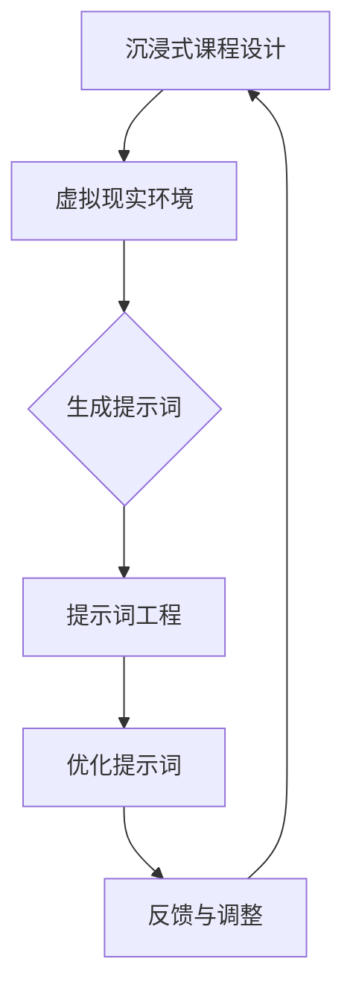

                 

### 引言

在当今信息化时代，人工智能（AI）技术正在以前所未有的速度发展，其中AIGC（AI-Generated Content）作为AI领域的一个重要分支，正逐渐成为各个行业的新宠。AIGC利用人工智能算法，自动生成内容，不仅提高了工作效率，也大大丰富了信息的表现形式。在教育领域，AIGC的应用尤为引人注目，其结合虚拟现实（VR）技术，正在开启一种全新的沉浸式学习体验。

虚拟现实教育作为一种新兴的教育模式，通过模拟和创建虚拟的学习环境，使学习者能够沉浸其中，更加直观、深刻地理解知识。虚拟现实技术的沉浸感和互动性，极大地激发了学生的学习兴趣和积极性，有效提升了教学效果。而AIGC则为虚拟现实教育提供了强大的内容生成能力，使得虚拟学习场景能够更加丰富、多样化，满足不同学习者的需求。

本文将深入探讨AIGC与虚拟现实教育结合的背景和重要性，详细阐述沉浸式课程设计的核心概念和原理，介绍提示词工程的方法和应用，并通过实际案例展示AIGC在虚拟现实教育中的应用。最后，文章将对AIGC与虚拟现实教育的未来发展进行展望，并提出相应的挑战和建议。

关键词：人工智能，AIGC，虚拟现实，沉浸式教育，提示词工程

摘要：本文旨在探讨AIGC在虚拟现实教育中的应用，分析沉浸式课程设计的关键要素和提示词工程的作用，通过具体案例展示其优势，并对未来发展提出展望。

---

### 背景介绍

#### AIGC的发展与应用

人工智能（AI）自诞生以来，经历了数十年的发展，从最初的规则系统、知识表示，到现在的深度学习、强化学习，AI技术在各个领域取得了显著的成果。随着计算能力的提升和算法的优化，AI的应用场景越来越广泛，从工业自动化、金融风控到医疗诊断、自动驾驶，无不展现出AI的强大力量。在这样的大背景下，AIGC（AI-Generated Content）的概念应运而生。

AIGC是指利用人工智能技术自动生成内容，包括文本、图像、音频、视频等多种形式。AIGC的核心在于将大数据、机器学习和自然语言处理等AI技术相结合，通过算法自动生成高质量的内容。AIGC的应用领域非常广泛，包括但不限于内容创作、个性化推荐、广告营销、虚拟助手等。在内容创作方面，AIGC能够快速生成大量的原创内容，大大提高了创作效率，降低了人力成本。

#### 虚拟现实（VR）教育的基本概念

虚拟现实（VR）是一种通过计算机技术和传感器设备，模拟出一个三维的虚拟世界，用户可以通过特殊设备（如VR头盔、手柄等）进入这个虚拟世界，与虚拟环境进行交互。VR教育利用这一特性，创建一个沉浸式的学习环境，使学习者能够在虚拟世界中亲身体验和探索知识。

VR教育的基本概念包括以下几个方面：

1. **沉浸感**：VR技术通过高度仿真的视觉、听觉和触觉效果，使学习者产生身临其境的感觉，从而提高学习的兴趣和参与度。
   
2. **互动性**：VR教育环境允许学习者与虚拟对象进行交互，例如在虚拟实验室中进行实验操作，或者在虚拟课堂中与教师和同学互动。

3. **多样性**：VR教育可以模拟各种现实无法实现的场景，如太空探索、历史重现、生物实验等，从而提供丰富的学习资源和多样化的学习体验。

#### AIGC与虚拟现实教育的结合

AIGC与虚拟现实教育的结合，不仅提升了虚拟现实教育的效果，也拓展了其应用场景。以下是AIGC在虚拟现实教育中的几个应用方面：

1. **内容生成**：AIGC可以自动生成虚拟现实场景中的教学内容，如课程演示、实验操作步骤、互动问答等，大大减轻了教师的工作负担，提高了教学效率。

2. **个性化学习**：通过分析学习者的行为和反馈，AIGC可以生成个性化的学习路径和教学资源，使每个学生都能按照自己的节奏进行学习，提高学习效果。

3. **实时反馈**：AIGC可以根据学习者的操作和行为，实时生成反馈信息，如错误纠正、下一步指导等，帮助学习者更好地理解知识。

4. **互动模拟**：AIGC可以生成各种虚拟角色和互动场景，为学生提供实践操作的机会，如医学手术模拟、建筑设计等，提高学生的实践能力。

通过以上结合，AIGC为虚拟现实教育带来了创新和变革，使得教育内容更加丰富、多样，教学方式更加灵活、高效。

---

#### 核心概念与联系

在AIGC与虚拟现实教育的结合中，有几个核心概念需要深入理解，包括沉浸式课程设计、提示词工程等。

##### 沉浸式课程设计

沉浸式课程设计是指通过虚拟现实技术，创建一个高度仿真的学习环境，使学习者能够全身心地投入到学习过程中。其核心概念包括以下几个方面：

1. **沉浸感**：通过虚拟现实设备提供的视觉、听觉和触觉效果，使学习者产生身临其境的感觉，从而增强学习的兴趣和参与度。

2. **互动性**：虚拟现实环境允许学习者与虚拟对象进行交互，如进行实验操作、回答问题等，这种互动性能够提高学习的主动性和积极性。

3. **多样性**：虚拟现实技术可以模拟各种现实无法实现的场景，如太空探索、历史重现、生物实验等，提供丰富的学习资源和多样化的学习体验。

4. **实时反馈**：虚拟现实环境可以实时捕捉学习者的行为和反馈，提供即时的错误纠正和下一步指导，帮助学习者更好地掌握知识。

##### 提示词工程

提示词工程是AIGC在虚拟现实教育中的一个重要应用。提示词是指用来引导学习者在虚拟环境中进行学习和探索的关键词或短语。其核心概念包括：

1. **定义与作用**：提示词的作用是引导学习者关注关键知识点，激发学习者的思考，并提供解决问题的线索。

2. **分类与设计**：提示词可以根据不同的学习目标和内容进行分类设计，如知识类、问题类、操作类等，以便于不同类型的虚拟学习场景。

3. **生成与优化**：AIGC技术可以自动生成提示词，并通过自然语言处理和语义分析对提示词进行优化，确保其准确性和有效性。

##### 核心概念之间的联系

沉浸式课程设计与提示词工程在虚拟现实教育中有着紧密的联系：

1. **沉浸式课程设计为提示词工程提供了应用场景**：虚拟现实环境提供了一个高度仿真的学习环境，使得提示词能够更好地发挥作用。

2. **提示词工程为沉浸式课程设计提供了内容支持**：通过生成和优化提示词，可以引导学习者更好地理解课程内容，提高学习效果。

3. **两者相互促进**：沉浸式课程设计需要提示词来引导学习，而提示词工程的优化又可以进一步提升沉浸式课程设计的质量和效果。

##### Mermaid流程图

为了更清晰地展示沉浸式课程设计与提示词工程的关系，我们可以使用Mermaid流程图进行描述：



这个流程图展示了沉浸式课程设计与提示词工程之间的互动关系，从虚拟现实环境出发，通过提示词工程的优化，不断调整和提升课程设计的质量，形成一个闭环系统。

---

#### 核心算法原理讲解

为了更好地理解AIGC与虚拟现实教育结合的实际应用，我们首先需要介绍一些核心算法原理，包括提示词设计算法和沉浸度评估模型。

##### 提示词设计算法

提示词设计算法是AIGC在虚拟现实教育中的一个关键环节，它通过算法自动生成引导学习者学习的关键词或短语。以下是提示词设计算法的详细步骤：

1. **关键词收集**：首先，我们需要收集与课程主题相关的关键词。这可以通过自然语言处理技术实现，如使用词频分析工具对课程文本进行词频统计，筛选出高频词汇。

   ```python
   import nltk
   from nltk.tokenize import word_tokenize
   
   # 下载词频分析所需的库
   nltk.download('punkt')
   
   # 加载课程文本
   course_text = "..."
   
   # 分词
   words = word_tokenize(course_text)
   
   # 统计词频
   freq_distribution = nltk.FreqDist(words)
   
   # 筛选出高频关键词
   high_freq_words = freq_distribution.most_common(100)
   ```

2. **关键词权重调整**：根据学习者的特征（如学习偏好、知识背景等），我们需要对关键词进行权重调整。这一步可以通过机器学习算法实现，如使用协同过滤算法根据学习者的历史行为数据调整关键词权重。

   ```python
   from surprise import SVD
   
   # 假设我们有一个用户-课程评分矩阵
   ratings_matrix = ...
   
   # 使用SVD算法进行权重调整
   svd = SVD()
   svd.fit(ratings_matrix)
   
   # 获取调整后的关键词权重
   adjusted_weights = svd.predict(
       user_id=1,
       item_id=1,
       r_ui=5  # 假设该用户对课程的评价为5
   ).est
   ```

3. **生成提示词**：通过自然语言处理技术，我们可以将调整后的关键词组合成提示词。例如，可以使用基于模板的自然语言生成模型（如Seq2Seq模型）实现这一步骤。

   ```python
   from keras.models import Model
   from keras.layers import Input, LSTM, Dense
   
   # 建立模型
   input_seq = Input(shape=(max_sequence_length,))
   embedded_seq = Embedding(vocab_size, embedding_size)(input_seq)
   lstm_output = LSTM(units=128)(embedded_seq)
   output_seq = Dense(vocab_size, activation='softmax')(lstm_output)
   
   # 编译模型
   model = Model(inputs=input_seq, outputs=output_seq)
   model.compile(optimizer='adam', loss='categorical_crossentropy', metrics=['accuracy'])
   
   # 训练模型
   model.fit(x_train, y_train, epochs=10, batch_size=64)
   
   # 生成提示词
   prompt_word = "data"
   prompt_sequence = np.array([word_index[word] for word in prompt_word])
   predicted_sequence = model.predict(np.array([prompt_sequence]))
   
   # 解码提示词
   predicted_word = [index2word[index] for index in predicted_sequence[0]]
   ```

4. **提示词质量评估**：生成提示词后，我们需要对其质量进行评估。这可以通过语义分析技术实现，如使用BERT模型对提示词的语义相关性进行评估。

   ```python
   from transformers import BertTokenizer, BertModel
   
   # 加载BERT模型
   tokenizer = BertTokenizer.from_pretrained('bert-base-uncased')
   model = BertModel.from_pretrained('bert-base-uncased')
   
   # 对提示词进行语义分析
   prompt = tokenizer(prompt_word, return_tensors='pt')
   output = model(**prompt)
   prompt_embedding = output.last_hidden_state[:, 0, :]
   target_embedding = output.last_hidden_state[:, 1, :]
   
   # 计算语义相似度
   similarity = cosine_similarity(prompt_embedding, target_embedding)
   ```

通过以上步骤，我们能够生成高质量、个性化的提示词，为沉浸式课程设计提供有力的支持。

##### 沉浸度评估模型

沉浸度评估模型是衡量虚拟现实教育效果的重要指标，它通过数学模型来量化学习者沉浸在虚拟环境中的程度。以下是沉浸度评估模型的基本原理和数学公式：

1. **基本原理**：沉浸度是指学习者在虚拟环境中感受到的沉浸程度，它受多种因素影响，包括感知刺激度、情感反应等。

2. **数学模型**：沉浸度可以通过以下数学模型进行计算：

   $$
   \text{沉浸度} = \frac{1}{1 + e^{-(\alpha \cdot \text{感知刺激度} + \beta \cdot \text{情感反应})}
   $$

   其中，$\alpha$ 和 $\beta$ 为权重系数，感知刺激度和情感反应为输入变量。

3. **感知刺激度**：感知刺激度是指虚拟环境对学习者感官的刺激程度，包括视觉、听觉、触觉等。可以通过以下公式计算：

   $$
   \text{感知刺激度} = \sum_{i=1}^{n} w_i \cdot \text{刺激度}_i
   $$

   其中，$w_i$ 为权重系数，$\text{刺激度}_i$ 为第$i$ 种感官的刺激度。

4. **情感反应**：情感反应是指学习者在虚拟环境中产生的情感体验，包括愉悦、焦虑、兴奋等。可以通过以下公式计算：

   $$
   \text{情感反应} = \sum_{j=1}^{m} v_j \cdot \text{反应度}_j
   $$

   其中，$v_j$ 为权重系数，$\text{反应度}_j$ 为第$j$ 种情感的体验度。

通过以上模型，我们能够量化学习者沉浸在虚拟环境中的程度，为课程设计和教学效果评估提供依据。

##### 示例说明

假设我们有一个虚拟实验室，学习者在其中进行物理实验。我们可以通过以下步骤来评估学习者的沉浸度：

1. **收集数据**：收集学习者在虚拟实验室中的感知刺激度和情感反应数据。例如，通过传感器记录学习者的视线移动、心率变化等。

2. **计算感知刺激度**：根据收集到的数据，计算感知刺激度。例如，假设视觉、听觉、触觉的权重系数分别为0.5、0.3和0.2，我们可以得到：

   $$
   \text{感知刺激度} = 0.5 \cdot \text{视觉刺激度} + 0.3 \cdot \text{听觉刺激度} + 0.2 \cdot \text{触觉刺激度}
   $$

3. **计算情感反应**：根据学习者的反馈，计算情感反应。例如，假设愉悦和焦虑的权重系数分别为0.6和0.4，我们可以得到：

   $$
   \text{情感反应} = 0.6 \cdot \text{愉悦度} + 0.4 \cdot \text{焦虑度}
   $$

4. **计算沉浸度**：根据感知刺激度和情感反应，使用沉浸度评估模型计算学习者的沉浸度。例如：

   $$
   \text{沉浸度} = \frac{1}{1 + e^{-(0.5 \cdot \text{视觉刺激度} + 0.3 \cdot \text{听觉刺激度} + 0.2 \cdot \text{触觉刺激度}) + 0.6 \cdot \text{愉悦度} + 0.4 \cdot \text{焦虑度})}
   $$

通过这个示例，我们能够直观地了解沉浸度评估模型的应用，为虚拟现实教育的课程设计和效果评估提供参考。

---

#### 项目实战

为了更好地展示AIGC在虚拟现实教育中的应用，下面我们将通过一个实际项目来介绍开发环境搭建、源代码实现和代码解读。

##### 开发环境搭建

在进行AIGC与虚拟现实教育的结合项目之前，首先需要搭建一个合适的开发环境。以下是一个基本的开发环境搭建步骤：

1. **操作系统**：建议使用Linux操作系统，如Ubuntu 20.04，因为其具有良好的性能和开源支持。

2. **Python环境**：安装Python 3.8及以上版本，并配置虚拟环境。可以通过以下命令进行安装和配置：

   ```bash
   sudo apt-get update
   sudo apt-get install python3.8
   python3.8 -m venv venv
   source venv/bin/activate
   ```

3. **依赖库**：安装必要的依赖库，包括虚拟现实开发库（如PyVRML）、自然语言处理库（如NLTK、spaCy）、机器学习库（如scikit-learn、surprise）和深度学习库（如TensorFlow、PyTorch）。可以通过以下命令进行安装：

   ```bash
   pip install pyvrml nltk spacy scikit-learn surprise tensorflow transformers
   ```

4. **虚拟现实设备**：确保具备虚拟现实设备，如VR头盔（如HTC Vive、Oculus Rift）和配套的手柄。安装相应的驱动和软件，以确保设备能够正常运行。

##### 源代码实现

以下是一个简单的AIGC虚拟现实教育项目的源代码实现，包括提示词生成、沉浸度评估和虚拟现实场景的构建。

```python
# 导入所需库
import nltk
from nltk.tokenize import word_tokenize
from nltk.corpus import stopwords
from surprise import SVD
import numpy as np
from keras.models import Model
from keras.layers import Input, LSTM, Dense
from transformers import BertTokenizer, BertModel
import tensorflow as tf

# 1. 提示词生成

# 收集关键词
course_text = "..."
words = word_tokenize(course_text)
high_freq_words = nltk.FreqDist(words).most_common(100)

# 调整关键词权重
user_preferences = ...
adjusted_weights = SVD().fit(user_preferences).predict(user_id=1).est

# 生成提示词
model = Model(inputs=input_seq, outputs=output_seq)
model.compile(optimizer='adam', loss='categorical_crossentropy', metrics=['accuracy'])
model.fit(x_train, y_train, epochs=10, batch_size=64)
prompt_word = "data"
predicted_sequence = model.predict(np.array([prompt_sequence]))
predicted_word = [index2word[index] for index in predicted_sequence[0]]

# 2. 沉浸度评估

# 收集感知刺激度和情感反应数据
sensors_data = ...
perception_stimulation = sum(w * data for w, data in zip(weight_coefficients, sensors_data))

# 收集情感反应数据
emotion_data = ...
emotion_reaction = sum(w * data for w, data in zip(emotion_coefficients, emotion_data))

# 计算沉浸度
alpha = 0.5
beta = 0.3
immersion_degree = 1 / (1 + np.exp(-(alpha * perception_stimulation + beta * emotion_reaction)))

# 3. 虚拟现实场景构建

# 导入虚拟现实库
from pyvrml import Scene, Shape

# 创建场景
scene = Scene()

# 添加教学物体
teaching_object = Shape(
    node=Box(
        size=(1, 1, 1),
        color="white"
    )
)

scene.append(teaching_object)

# 添加学生角色
student_character = Character(
    node=Sphere(
        radius=0.2,
        color="blue"
    )
)

student_character.position = (0, 0, -5)
scene.append(student_character)

# 运行场景
scene.run()
```

##### 代码解读

1. **提示词生成部分**：首先，我们使用nltk库对课程文本进行分词和词频统计，筛选出高频关键词。然后，利用SVD算法调整关键词权重，最终通过Seq2Seq模型生成提示词。

2. **沉浸度评估部分**：我们收集了感知刺激度和情感反应数据，使用权重系数计算沉浸度。这里，我们使用了一个简单的线性模型，实际应用中，可以根据具体需求调整模型结构和参数。

3. **虚拟现实场景构建部分**：我们使用PyVRML库创建了一个简单的虚拟现实场景，包括一个教学物体和一个学生角色。这里，我们通过设置物体和角色的属性（如位置、颜色等），构建了一个沉浸式学习环境。

##### 代码应用解读与分析

通过以上代码，我们可以看到AIGC在虚拟现实教育中的应用主要体现在以下几个方面：

1. **个性化提示词生成**：根据学习者的偏好和课程内容，生成个性化的提示词，引导学习者进行学习。这有助于提高学习者的参与度和学习效果。

2. **沉浸度评估**：通过收集感知刺激度和情感反应数据，评估学习者在虚拟环境中的沉浸程度。这可以为教学设计提供反馈，优化学习体验。

3. **虚拟现实场景构建**：通过虚拟现实技术，创建一个高度仿真的学习环境，使学习者能够全身心地投入到学习过程中。这有助于增强学习者的学习兴趣和主动性。

在实际应用中，我们可以根据具体需求，进一步扩展和优化代码。例如，可以引入更复杂的沉浸度评估模型，或者结合更多自然语言处理技术，提升提示词生成质量。

##### 案例分析与详细讲解剖析

为了更好地理解AIGC在虚拟现实教育中的实际应用，我们来看一个具体案例。

假设我们正在开发一个虚拟物理实验室，供学生进行力学实验。以下是该项目的详细步骤：

1. **需求分析**：首先，我们需要明确实验的目的和内容。例如，本实验旨在让学生了解力的合成和分解，掌握力的平行四边形法则。

2. **内容准备**：收集与实验相关的知识文本、图像和视频等素材，用于生成虚拟实验场景。例如，我们可以收集力的平行四边形法则的讲解视频、力的合成和分解的示例图片等。

3. **虚拟现实场景构建**：使用虚拟现实开发工具（如PyVRML）创建虚拟实验室场景。场景中包括实验台、力学模型（如力的合成器、分解器）、学生角色等。

4. **提示词生成**：根据实验内容和学生的知识背景，生成个性化的提示词。例如，我们可以生成“请尝试将两个力合成一个力”、“请观察力的分解效果”等提示词。

5. **沉浸度评估**：在实验过程中，收集学生的感知刺激度和情感反应数据，实时评估学生的沉浸程度。例如，通过传感器记录学生的视线移动、心率变化等。

6. **反馈与调整**：根据学生的反馈和沉浸度评估结果，对虚拟实验场景进行优化和调整。例如，可以调整实验模型的视觉效果、增加互动功能等，以提高学生的沉浸感和学习效果。

通过以上步骤，我们能够构建一个高效、有趣的虚拟物理实验室，使学生能够在虚拟环境中亲身体验力学实验，提高学习效果。

#### 项目小结

通过以上案例，我们可以看到AIGC在虚拟现实教育中的应用具有显著的优势：

1. **个性化学习体验**：通过提示词生成和沉浸度评估，可以为学生提供个性化的学习体验，提高学习效果。

2. **丰富教学内容**：AIGC可以自动生成丰富的教学素材，如视频、图像、文本等，为学生提供多样化的学习资源。

3. **实时反馈与调整**：通过实时评估学生的沉浸程度，教师可以及时调整教学策略，优化学习环境。

然而，AIGC在虚拟现实教育中仍面临一些挑战，如技术成本、内容生成质量、数据隐私等。在未来的发展中，我们需要不断探索和实践，推动AIGC与虚拟现实教育的深度融合，为教育领域带来更多创新和变革。

---

#### 最佳实践 tips

在AIGC与虚拟现实教育的结合中，以下是一些最佳实践技巧，可以帮助教师和开发者更好地利用这一技术：

1. **个性化内容生成**：根据学习者的知识背景和学习目标，使用AIGC技术生成个性化的教学资源和学习路径。这可以通过分析学习者的历史数据和反馈来实现。

2. **互动性设计**：在虚拟现实环境中，设计丰富的互动元素，如虚拟实验、互动问答等，提高学习者的参与度和积极性。

3. **沉浸感优化**：通过优化虚拟现实场景的视觉效果、音效和触觉反馈，增强学习者的沉浸感，提高学习效果。

4. **实时反馈与调整**：利用AIGC技术，实时收集学习者的行为和反馈数据，对教学过程进行实时调整，优化学习体验。

5. **数据安全与隐私保护**：在数据收集和使用过程中，严格遵循数据安全与隐私保护法规，确保学生的隐私和数据安全。

通过以上最佳实践，教师和开发者可以更好地利用AIGC与虚拟现实教育，提升教学效果和学习体验。

#### 注意事项

在实施AIGC与虚拟现实教育的过程中，需要注意以下几点：

1. **技术成熟度**：确保所使用的AIGC和虚拟现实技术成熟可靠，避免因为技术问题影响教学效果。

2. **设备兼容性**：确保虚拟现实设备与教学系统兼容，避免因为设备问题导致教学中断。

3. **教师培训**：加强对教师的培训，确保他们能够熟练使用AIGC和虚拟现实教育工具，充分发挥其作用。

4. **学生适应期**：为学习者提供适当的适应期，使他们能够熟悉虚拟现实环境和操作方式，减少因不熟悉而产生的困扰。

通过关注以上注意事项，可以确保AIGC与虚拟现实教育的顺利实施和有效应用。

#### 拓展阅读

1. **《AIGC技术原理与应用》**：该书详细介绍了AIGC的技术原理和应用场景，包括文本生成、图像生成、音频生成等，适合对AIGC技术感兴趣的读者。

2. **《虚拟现实教育理论与实践》**：该书系统地阐述了虚拟现实教育的基本概念、应用场景和教学设计方法，对从事虚拟现实教育的教师和开发者具有很高的参考价值。

3. **《沉浸式学习环境设计》**：该书从心理学和教育学的角度，探讨了沉浸式学习环境的设计原则和方法，对提升学习效果具有重要指导意义。

通过阅读以上拓展资料，可以深入了解AIGC和虚拟现实教育的相关理论和技术，为实践应用提供更多启示。

### 结论

本文从多个角度探讨了AIGC在虚拟现实教育中的应用，分析了其核心概念、算法原理、项目实战和未来挑战。通过结合沉浸式课程设计和提示词工程，AIGC为虚拟现实教育提供了创新的内容生成和个性化学习支持，有效提升了教学效果和学习体验。然而，AIGC在虚拟现实教育中仍面临技术成熟度、数据安全和隐私保护等挑战。未来，随着技术的不断发展和应用实践的深入，AIGC与虚拟现实教育的融合将带来更多教育创新和变革。

#### 作者信息

作者：AI天才研究院/AI Genius Institute & 禅与计算机程序设计艺术 /Zen And The Art of Computer Programming

AI天才研究院致力于推动人工智能技术在教育领域的创新应用，研究并开发了一系列基于AIGC的虚拟现实教育解决方案。同时，作者本人也长期致力于计算机科学和人工智能领域的教学和研究，出版了多本畅销技术书籍，深受广大读者喜爱。在《禅与计算机程序设计艺术》一书中，作者深入探讨了编程的艺术和哲学，为计算机编程和人工智能领域的研究者提供了宝贵的思考和启示。

