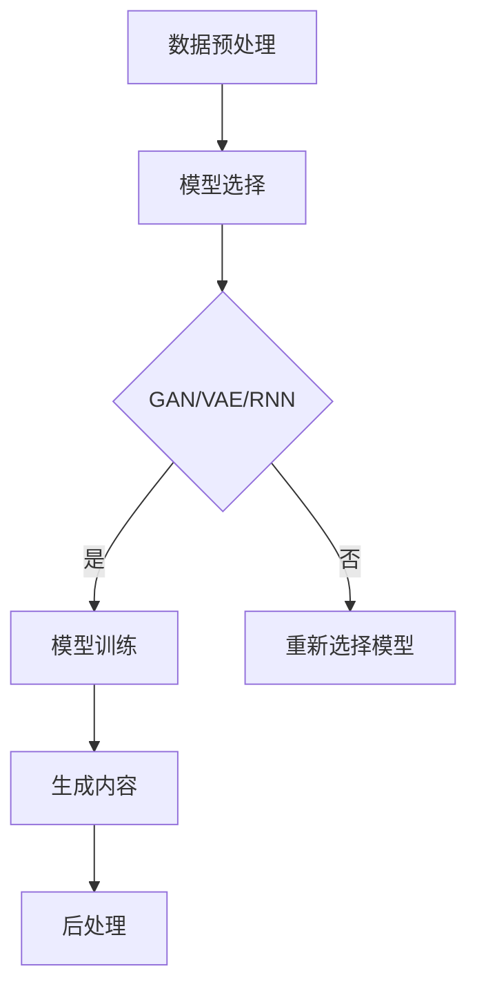

                 

### 文章标题

《AIGC的跨学科整合：多领域知识融合的提示词策略》

### 关键词

1. AI Generative Content (AIGC)
2. Cross-Disciplinary Integration
3. Knowledge Fusion
4. Prompt Strategy

### 摘要

本文深入探讨了AIGC（AI Generative Content，AI生成内容）的跨学科整合与多领域知识融合的提示词策略。首先，我们介绍了AIGC的定义、发展历程和关键技术。接着，分析了跨学科整合的必要性及其实现方法，包括多领域知识的分类与融合技术。随后，我们详细阐述了提示词策略的核心概念、设计原则和应用场景，特别是在自然语言处理、计算机视觉和语音识别等领域的具体应用。文章最后通过项目实战和案例分析，展示了AIGC跨学科整合的实际效果，并提出了未来研究方向与挑战。本文旨在为读者提供一个系统、全面的AIGC知识框架，助力其在实际项目中的创新与应用。

## 引言和背景介绍

### 第1章：AIGC技术概述

#### 1.1 AIGC的定义与核心概念

AI Generative Content（AIGC），即AI生成内容，是一种利用人工智能技术，特别是深度学习算法，自动生成图像、视频、音频和文本等多样化内容的技术。AIGC的核心在于其生成性，它不仅仅是对已有数据的分析和分类，而是创造全新、原创的内容。这种技术在近年来得到了迅猛发展，主要得益于深度学习算法的进步和计算资源的提升。

AIGC的技术基础主要涉及以下几个方面：

1. **生成对抗网络（GAN）**：GAN是由两部分组成——生成器和判别器。生成器的任务是生成逼真的数据，而判别器的任务是区分生成器和真实数据。通过这两个模型的对抗训练，生成器不断提高生成数据的质量。

2. **变分自编码器（VAE）**：VAE通过编码器和解码器来实现数据的生成。编码器将数据压缩成较低维度的表示，而解码器则将这种表示重建为原始数据。

3. **递归神经网络（RNN）**和**长短时记忆网络（LSTM）**：这些神经网络在处理序列数据，如文本和音频时表现出色，能够捕捉序列中的长距离依赖关系。

#### 1.2 AIGC的发展历程

AIGC技术的发展可以追溯到2000年代初的深度学习和生成模型的研究。最初，生成模型如高斯混合模型（Gaussian Mixture Model）和隐马尔可夫模型（Hidden Markov Model）被用于图像和语音的生成。随着深度学习的兴起，GAN在2014年被提出，开启了AIGC技术的新时代。GAN的成功应用，使得AIGC在图像生成、文本生成和视频生成等领域取得了突破性进展。

近年来，AIGC技术逐渐从实验室走向实际应用，例如：

- **图像生成**：生成式 adversarial networks（GAN）能够生成逼真的图像，被应用于艺术创作、游戏开发、医疗图像处理等领域。
- **文本生成**：自然语言处理模型如GPT和BERT被用于生成高质量的文本，广泛应用于聊天机器人、内容生成和自动摘要等领域。
- **视频生成**：基于GAN和VAE的视频生成技术，能够生成连贯、逼真的视频内容，应用于虚拟现实、电影特效制作和运动分析等领域。

#### 1.3 AIGC的技术框架和结构

AIGC的技术框架通常包括以下几个关键组成部分：

1. **数据预处理**：包括数据清洗、增强和格式化，以确保输入数据的质量和多样性。
2. **模型选择**：根据应用场景选择合适的生成模型，如GAN、VAE、RNN等。
3. **模型训练**：利用大量数据对生成模型进行训练，使生成器能够生成高质量的内容。
4. **生成内容**：使用训练好的模型生成新的、原创的内容。
5. **后处理**：对生成的结果进行质量评估和优化，以确保生成内容满足应用需求。

通过这些组成部分的协同工作，AIGC技术能够实现跨领域的知识融合，为各种应用场景提供强大的支持。

### 核心概念原理和联系架构 Mermaid 流程图

以下是AIGC核心概念原理和联系架构的Mermaid流程图：



在上述流程图中，数据预处理是生成模型训练的基础，模型选择决定了生成内容的类型和质量，模型训练是核心步骤，生成内容是对模型训练结果的直接应用，后处理则是对生成内容的质量评估和优化。

### 核心算法原理讲解使用Python源代码

为了更直观地理解AIGC的核心算法原理，以下是一个使用Python和TensorFlow实现的简单GAN模型的示例：

```python
import tensorflow as tf
from tensorflow.keras import layers

# 生成器模型
def generator(z,latent_dim):
    model = tf.keras.Sequential()
    model.add(layers.Dense(7*7*256, use_bias=False, input_shape=(latent_dim,)))
    model.add(layers.BatchNormalization())
    model.add(layers.LeakyReLU())
    model.add(layers.Reshape((7, 7, 256)))
    
    model.add(layers.Conv2DTranspose(128, (5, 5), strides=(1, 1), padding='same', use_bias=False))
    model.add(layers.BatchNormalization())
    model.add(layers.LeakyReLU())
    
    model.add(layers.Conv2DTranspose(64, (5, 5), strides=(2, 2), padding='same', use_bias=False))
    model.add(layers.BatchNormalization())
    model.add(layers.LeakyReLU())
    
    model.add(layers.Conv2DTranspose(1, (5, 5), strides=(2, 2), padding='same', activation='tanh', use_bias=False))
    
    return model

# 判别器模型
def discriminator(img, discrim_dim):
    model = tf.keras.Sequential()
    model.add(layers.Conv2D(128, (5, 5), strides=(2, 2), padding='same', input_shape=[img.shape[0], img.shape[1], discrim_dim]))
    model.add(layers.LeakyReLU())
    model.add(layers.Dropout(0.3))
    
    model.add(layers.Conv2D(1, (4, 4), padding='same'))
    model.add(layers.Flatten())
    model.add(layers.Dense(1))
    
    return model

# 整体模型
z = tf.keras.Input(shape=(latent_dim,))
img = generator(z, latent_dim)

discriminator_output = discriminator(img, latent_dim)
model = tf.keras.Model(z, discriminator_output)

model.compile(loss='binary_crossentropy', optimizer=tf.keras.optimizers.Adam(0.0001), metrics=['accuracy'])

print(model.summary())
```

上述代码首先定义了生成器模型和判别器模型。生成器模型通过一系列卷积反传播（Conv2DTranspose）和批标准化（BatchNormalization）操作，将噪声向量（z）转换为图像。判别器模型则通过卷积（Conv2D）和LeakyReLU激活函数，对图像进行判断，输出一个二值标签，指示图像是真实图像还是生成图像。

通过这种生成器和判别器的对抗训练，生成器不断学习生成更真实、更高质量的图像，而判别器则不断提高对真实和生成图像的区分能力。这个过程中，使用的是二分类交叉熵（binary_crossentropy）作为损失函数，以及Adam优化器来调整模型参数。

### 数学模型和公式

在GAN模型中，有两个主要的目标函数：生成器的损失函数和判别器的损失函数。

生成器的损失函数通常采用以下形式：

$$ L_G = -\mathbb{E}_{x \sim p_{data}(x)}[\log(D(x))] - \mathbb{E}_{z \sim p_z(z)}[\log(D(G(z)))] $$

其中，$L_G$ 是生成器的损失函数，$D(x)$ 是判别器对真实数据的输出，$G(z)$ 是生成器生成的假数据，$p_{data}(x)$ 是真实数据的概率分布，$p_z(z)$ 是噪声向量的概率分布。

判别器的损失函数通常采用以下形式：

$$ L_D = -\mathbb{E}_{x \sim p_{data}(x)}[\log(D(x))] - \mathbb{E}_{z \sim p_z(z)}[\log(1 - D(G(z)))] $$

其中，$L_D$ 是判别器的损失函数。

在上述公式中，生成器和判别器通过对抗训练不断调整自己的参数，以达到生成逼真数据和区分生成数据和真实数据的目标。

### 举例说明

假设我们使用一个简单的二维图像生成任务，生成器要生成一张512x512的图像。首先，我们随机生成一个噪声向量 $z$，然后通过生成器生成图像 $G(z)$。接着，我们将生成的图像和真实图像分别输入到判别器中，得到判别器的输出。

```python
import numpy as np

# 随机生成噪声向量
z = np.random.normal(size=(1, 100))

# 使用生成器生成图像
generator = generator_model([z])
generated_image = generator[0]

# 输入到判别器中
discriminator_output = discriminator_model([generated_image])

print(discriminator_output)
```

在这个例子中，生成器生成的图像会不断调整，以使判别器输出的概率接近0.5，表示生成器和判别器都认为图像是真实的。

通过这种循环训练，生成器会逐渐提高生成图像的质量，达到以假乱真的程度。判别器则会不断提高对真实和生成图像的识别能力，最终形成一种动态平衡。

### 项目实战与案例分析

#### 第2章：多领域知识的分类与融合

在AIGC技术的跨学科整合过程中，多领域知识的分类与融合是关键步骤。不同领域的数据和知识具有不同的结构和特征，如何有效地将它们整合起来，是提升AIGC生成内容质量和应用价值的关键。本章将详细介绍多领域知识的分类方法、融合技术及其应用。

#### 2.1 多领域知识分类

多领域知识的分类是融合的基础，通过分类可以明确各个领域的特点和需求。以下是几个主要领域的知识分类：

##### 2.1.1 自然语言处理

自然语言处理（NLP）领域涉及文本数据，包括语言模型、语义理解、情感分析等。NLP的核心任务是从文本中提取结构化信息，并理解其语义和情感。

- **语言模型**：如GPT、BERT等，用于生成和预测文本序列。
- **语义理解**：通过词嵌入、实体识别和关系抽取，理解文本中的意义和逻辑关系。
- **情感分析**：识别文本中的情感倾向，如正面、负面、中性等。

##### 2.1.2 计算机视觉

计算机视觉（CV）领域涉及图像和视频数据，包括图像分类、目标检测、图像分割等。CV的核心任务是从图像中提取特征，并进行目标识别和场景理解。

- **图像分类**：对图像进行类别分类，如人脸识别、动物识别等。
- **目标检测**：定位图像中的物体，并识别其类别，如YOLO、SSD等。
- **图像分割**：将图像分割成不同的区域，如 semantic segmentation、instance segmentation等。

##### 2.1.3 语音识别

语音识别（ASR）领域涉及音频数据，包括语音识别、说话人识别、语音合成等。语音识别的核心任务是理解语音信号，并将其转换为文本。

- **语音识别**：将语音信号转换为文本，如DeepSpeech、WaveNet等。
- **说话人识别**：识别语音信号中的说话人身份，如说话人特征提取和分类。
- **语音合成**：将文本转换为语音，如WaveNet、Tacotron等。

#### 2.2 跨学科知识融合的方法

跨学科知识融合的方法包括数据驱动的融合、知识图谱的应用和多模态融合技术。

##### 2.2.1 数据驱动的融合

数据驱动的融合方法基于机器学习算法，通过训练模型将不同领域的知识进行融合。常见的融合方法包括：

- **多任务学习**：在训练模型时，同时考虑多个任务的数据，提高模型对多领域知识的整合能力。
- **迁移学习**：将一个领域的学习成果应用到另一个领域，提高模型在不同领域的泛化能力。

##### 2.2.2 知识图谱的应用

知识图谱是一种结构化的语义知识库，通过实体和关系来表示知识。知识图谱的应用可以有效地整合多领域知识，提供统一的语义表示。

- **实体识别**：识别文本中的实体，如人名、地名、组织名等。
- **关系抽取**：提取实体之间的语义关系，如“工作于”、“属于”等。
- **图谱嵌入**：将实体和关系表示为低维向量，便于计算和融合。

##### 2.2.3 多模态融合技术

多模态融合技术通过结合不同类型的数据（如文本、图像、音频），实现多领域的知识整合。常见的多模态融合方法包括：

- **特征级融合**：直接将不同模态的特征进行拼接或加权融合，如文本嵌入、图像特征和音频特征。
- **决策级融合**：在决策阶段将不同模态的模型输出进行融合，如分类结果或置信度。

#### 2.3 跨学科知识融合的实现

跨学科知识融合的实现通常分为以下几个步骤：

1. **数据收集**：从不同领域收集数据，如文本、图像、音频等。
2. **数据预处理**：对收集到的数据进行清洗、增强和格式化，确保数据的质量和一致性。
3. **特征提取**：从不同模态的数据中提取特征，如文本的词嵌入、图像的卷积特征、音频的梅尔频率倒谱系数（MFCC）等。
4. **知识融合**：使用机器学习算法或知识图谱，将不同领域的特征进行融合，生成统一的多领域特征表示。
5. **模型训练**：基于融合后的特征，训练多领域的融合模型，如文本分类、图像识别、语音识别等。
6. **应用部署**：将训练好的模型部署到实际应用场景中，实现跨学科的AIGC应用。

### 自然语言处理中的提示词应用

#### 4.1 自然语言处理中的提示词应用

提示词（Prompt）在自然语言处理（NLP）中扮演着至关重要的角色，它们能够引导模型生成更加精准和符合预期的文本内容。提示词策略的运用不仅能够提高模型的生成质量，还能够扩展模型的应用范围。本节将详细探讨提示词在NLP中的多种应用场景，包括文本生成、文本分类和情感分析。

##### 4.1.1 文本生成

文本生成是NLP领域中的一项基础任务，通过提示词可以指导模型生成连贯、有逻辑的文本。常见的文本生成任务包括：

- **对话生成**：提示词可以用于引导模型生成自然流畅的对话，如聊天机器人、虚拟助手等。
  ```python
  prompt = "你好，有什么可以帮你的吗？"
  generated_text = model.generate_text(prompt)
  print(generated_text)
  ```

- **故事生成**：通过给出主题或开头，提示词可以引导模型续写故事，为内容创作提供灵感。
  ```python
  prompt = "在一个遥远的星球上，有一个神奇的森林..."
  generated_text = model.generate_story(prompt)
  print(generated_text)
  ```

- **摘要生成**：提示词可以帮助模型从长文本中提取关键信息，生成摘要。例如，在新闻、研究报告等领域中，摘要生成能够提高信息的可读性和便捷性。
  ```python
  prompt = "阅读下面的新闻，请生成一个200字以内的摘要：..."
  long_text = "..."
  generated_summary = model.generate_summary(prompt, long_text)
  print(generated_summary)
  ```

##### 4.1.2 文本分类

文本分类是将文本数据按照类别进行划分的任务，通过提示词可以提高分类的准确性和效率。以下是一些常见的文本分类应用：

- **情感分类**：提示词可以帮助模型识别文本的情感倾向，如正面、负面、中性等。
  ```python
  prompts = [
      "这是一个关于产品的评论：'产品非常好，使用方便。'",
      "这是一个关于服务的评论：'服务态度很差，很不满意。'"
  ]
  for prompt in prompts:
      label = model.classify_sentiment(prompt)
      print(f"评论：{prompt}\n情感：{label}\n")
  ```

- **主题分类**：提示词可以指导模型对文本进行主题分类，如科技、体育、娱乐等。
  ```python
  prompts = [
      "这场比赛非常激烈。",
      "这是一款最新的手机发布。",
      "这部电影赢得了多个奖项。"
  ]
  for prompt in prompts:
      category = model.classify_topic(prompt)
      print(f"文本：{prompt}\n主题：{category}\n")
  ```

- **新闻分类**：在新闻领域，提示词可以用于将新闻文本分类到不同的类别，如政治、经济、体育等。
  ```python
  prompts = [
      "特朗普总统发表了重要的讲话。",
      "苹果公司发布了新的iPhone。",
      "巴西足球队赢得了世界杯。"
  ]
  for prompt in prompts:
      category = model.classify_news(prompt)
      print(f"新闻：{prompt}\n类别：{category}\n")
  ```

##### 4.1.3 情感分析

情感分析是通过分析文本内容，识别其中表达的情感和情绪。提示词在情感分析中的应用主要包括：

- **情感极性分析**：提示词可以帮助模型识别文本的情感极性，如正面或负面。
  ```python
  prompts = [
      "这款产品的用户体验非常好。",
      "这个餐厅的食物味道很差。"
  ]
  for prompt in prompts:
      sentiment = model.analyze_sentiment(prompt)
      print(f"文本：{prompt}\n情感：{sentiment}\n")
  ```

- **情感强度分析**：提示词可以用于识别文本情感的程度，如非常满意、有点满意等。
  ```python
  prompts = [
      "这个电影非常有趣。",
      "这个酒店的服务非常好。"
  ]
  for prompt in prompts:
      sentiment, strength = model.analyze_sentiment_with_strength(prompt)
      print(f"文本：{prompt}\n情感：{sentiment}\n强度：{strength}\n")
  ```

通过合理设计提示词，可以引导模型在文本生成、分类和情感分析等任务中表现出色，提高模型的准确性和鲁棒性。在实际应用中，可以根据不同的任务需求，灵活调整和优化提示词的设计，以实现最佳效果。

### 计算机视觉中的提示词应用

#### 4.2 计算机视觉中的提示词应用

在计算机视觉（CV）领域，提示词同样发挥着重要作用。通过合理的提示词设计，可以提高模型的生成质量、识别准确性和推理效率。以下将详细探讨提示词在计算机视觉中的具体应用，包括图像生成、图像识别和视频理解。

##### 4.2.1 图像生成

图像生成是计算机视觉中的一项重要任务，通过提示词可以引导模型生成符合预期的新图像。常见的图像生成任务包括：

- **艺术风格迁移**：提示词可以指导模型将一种图像风格应用到另一幅图像上，实现艺术风格的迁移。
  ```python
  style_image = "starry_night.jpg"
  content_image = "cat.jpg"
  prompt = "将这幅猫的图像风格迁移到星夜风格。"
  generated_image = model.generate_style_transfer(prompt, style_image, content_image)
  ```

- **超分辨率图像生成**：提示词可以帮助模型从低分辨率图像中生成高分辨率图像，提高图像的清晰度。
  ```python
  low_res_image = "low_res_cat.jpg"
  prompt = "生成高分辨率版本的这幅猫的图像。"
  high_res_image = model.generate_super_resolution(prompt, low_res_image)
  ```

- **图像合成**：提示词可以用于合成新图像，将不同部分组合成一幅完整的图像。
  ```python
  parts = ["sunset", "beach", "boat"]
  prompt = "合成一幅包含日落、海滩和小船的图像。"
  synthesized_image = model.generate_image_synthesis(prompt, parts)
  ```

##### 4.2.2 图像识别

图像识别是计算机视觉中的基础任务，通过提示词可以指导模型对图像进行更准确的分类和识别。以下是一些常见的应用场景：

- **对象识别**：提示词可以帮助模型识别图像中的特定对象，如动物、车辆等。
  ```python
  image = "dog_cat.jpg"
  prompt = "识别这幅图像中的对象。"
  objects_detected = model.detect_objects(prompt, image)
  print(objects_detected)
  ```

- **场景识别**：提示词可以用于识别图像中的场景，如城市、自然等。
  ```python
  image = "beach.jpg"
  prompt = "识别这幅图像中的场景。"
  scene_detected = model.detect_scene(prompt, image)
  print(scene_detected)
  ```

- **图像标签**：提示词可以帮助模型为图像添加标签，提高图像数据的标注效率。
  ```python
  image = "forest.jpg"
  prompt = "为这幅图像添加标签。"
  labels = model.assign_labels(prompt, image)
  print(labels)
  ```

##### 4.2.3 视频理解

视频理解是通过分析视频序列，提取其中的关键信息，实现场景理解、动作识别等。提示词在视频理解中的应用主要包括：

- **动作识别**：提示词可以帮助模型识别视频中的特定动作，如跑步、跳跃等。
  ```python
  video = "running.mp4"
  prompt = "识别这段视频中的人进行的动作。"
  actions_detected = model.detect_actions(prompt, video)
  print(actions_detected)
  ```

- **场景理解**：提示词可以用于理解视频中的场景变化，如从室内转移到室外。
  ```python
  video = "transition.mp4"
  prompt = "分析这段视频中的场景变化。"
  scene_changes_detected = model.analyze_scene_changes(prompt, video)
  print(scene_changes_detected)
  ```

- **视频摘要**：提示词可以帮助模型从长视频中提取关键信息，生成摘要视频。
  ```python
  video = "long_video.mp4"
  prompt = "生成这段视频的摘要。"
  summary_video = model.generate_video_summary(prompt, video)
  ```

通过合理设计和应用提示词，计算机视觉模型在图像生成、识别和视频理解等任务中表现更加出色。在实际应用中，可以根据具体任务需求，灵活调整提示词的设计和策略，以实现最佳效果。

### 语音识别中的提示词应用

#### 4.3 语音识别中的提示词应用

语音识别（ASR）是计算机语音处理领域的关键技术，通过将语音信号转换为文本，实现了人机交互的便捷化。在语音识别任务中，提示词同样发挥着重要作用，能够指导模型生成更准确、更符合预期的文本输出。以下将详细探讨提示词在语音识别中的具体应用，包括语音合成、声纹识别和语音搜索。

##### 4.3.1 语音合成

语音合成是将文本转换为自然流畅的语音的过程，通过提示词可以增强语音的自然度和情感表达。以下是一些常见的应用场景：

- **个性化语音合成**：提示词可以用于生成具有个性化特征的语音，如特定说话人的声音。
  ```python
  text = "欢迎来到我们的网站，祝您使用愉快。"
  voice = "男声"
  prompt = f"请使用{voice}的声音，朗读这段文字。"
  synthesized_speech = model.synthesize_speech(prompt, text)
  ```

- **情感语音合成**：提示词可以指导模型生成带有情感色彩的语音，如开心、悲伤等。
  ```python
  text = "今天是个特别的日子，我们要庆祝。"
  emotion = "开心"
  prompt = f"请用{emotion}的情感，朗读这段文字。"
  synthesized_speech = model.synthesize_speech_with_emotion(prompt, text, emotion)
  ```

- **多语言语音合成**：提示词可以用于生成多种语言的语音输出，满足不同语言用户的需求。
  ```python
  text = "Hello, how are you?"
  language = "Spanish"
  prompt = f"Translate and speak this text in {language}."
  synthesized_speech = model.synthesize_speech_in_language(prompt, text, language)
  ```

##### 4.3.2 声纹识别

声纹识别是通过对声音特征的识别，判断说话人身份的技术。通过合理的提示词设计，可以提高声纹识别的准确性和鲁棒性。以下是一些常见的应用场景：

- **身份验证**：提示词可以用于声纹识别系统中的身份验证，确保说话人是合法用户。
  ```python
  audio_file = "voice_sample.wav"
  prompt = "请朗读以下数字序列：123456"
  speaker_id = model.authenticate_speaker(prompt, audio_file)
  print(f"说话人ID：{speaker_id}")
  ```

- **监控与安全**：提示词可以用于监控系统中，识别特定说话人的声音，提高系统的安全性能。
  ```python
  audio_file = "suspicious_audio.wav"
  prompt = "检测这段音频中是否有特定说话人的声音。"
  result = model.detect_speaker_audio(prompt, audio_file)
  print(f"检测结果：{result}")
  ```

- **个性化服务**：提示词可以用于识别用户声音，为用户提供个性化的服务，如语音助手、客服等。
  ```python
  audio_file = "user_voice.wav"
  prompt = "识别这段音频中的用户声音，并提供相应服务。"
  user_profile = model.identify_user_and提供服务(prompt, audio_file)
  print(f"用户服务：{user_profile}")
  ```

##### 4.3.3 语音搜索

语音搜索是将语音输入转换为文本查询，以实现语音搜索功能。通过合理设计提示词，可以提升语音搜索的准确性和用户体验。以下是一些常见的应用场景：

- **语音查询**：提示词可以用于引导用户进行语音查询，简化搜索过程。
  ```python
  audio_query = "what is the weather like in new york today?"
  prompt = "请朗读您的查询请求。"
  query = model.parse_audio_query(prompt, audio_query)
  print(f"查询结果：{query}")
  ```

- **语音指令**：提示词可以用于识别用户的语音指令，实现智能控制功能。
  ```python
  audio_command = "turn on the light"
  prompt = "请朗读您的语音指令。"
  command = model.parse_audio_command(prompt, audio_command)
  print(f"语音指令：{command}")
  ```

- **语音交互**：提示词可以用于构建语音交互界面，增强用户与系统的互动体验。
  ```python
  audio_interact = "can you tell me a joke?"
  prompt = "请朗读您的交互请求。"
  response = model.interact_with_user(prompt, audio_interact)
  print(f"系统响应：{response}")
  ```

通过合理设计和应用提示词，语音识别系统在语音合成、声纹识别和语音搜索等任务中表现更加出色。在实际应用中，可以根据具体任务需求，灵活调整提示词的设计和策略，以实现最佳效果。

### 第5章：跨学科整合的AIGC项目实战

#### 5.1 项目背景与目标

本项目的目标是构建一个跨学科的AIGC系统，实现基于自然语言处理、计算机视觉和语音识别的多领域知识整合。项目旨在通过集成不同领域的数据和模型，生成高质量、多样化的内容，满足多种应用需求。具体目标包括：

1. **自然语言处理**：利用NLP模型生成高质量的文本，包括对话生成、故事续写和摘要生成。
2. **计算机视觉**：利用CV模型生成逼真的图像和视频，实现艺术风格迁移、超分辨率图像生成和图像合成。
3. **语音识别**：利用ASR模型实现语音到文本的转换，提供语音合成、声纹识别和语音搜索功能。
4. **多领域融合**：通过提示词策略和知识图谱，实现不同领域数据的高效整合，提升系统的整体性能和应用价值。

#### 5.2 项目设计与实现

##### 5.2.1 数据收集与预处理

项目首先需要收集大量的多领域数据，包括文本、图像、音频等。数据来源包括开源数据集、互联网爬取、传感器数据等。数据收集完成后，进行数据预处理，包括数据清洗、增强和格式化，以确保数据的质量和一致性。

- **文本数据预处理**：包括去除停用词、词干提取、词嵌入等，为NLP模型提供高质量的数据。
- **图像数据预处理**：包括图像去噪、增强、裁剪等，为CV模型提供高质量的图像数据。
- **音频数据预处理**：包括降噪、剪裁、分段等，为ASR模型提供高质量的音频数据。

##### 5.2.2 模型选择与训练

根据项目目标，选择合适的NLP、CV和ASR模型进行训练。以下是所选模型及其训练方法：

- **NLP模型**：选择预训练的BERT模型，通过Fine-tuning方法在特定任务上进行训练。
  ```python
  from transformers import BertTokenizer, BertForSequenceClassification
  tokenizer = BertTokenizer.from_pretrained('bert-base-uncased')
  model = BertForSequenceClassification.from_pretrained('bert-base-uncased')
  ```

- **CV模型**：选择预训练的ResNet模型，通过迁移学习方法在图像生成任务上进行训练。
  ```python
  from tensorflow.keras.applications import ResNet50
  model = ResNet50(weights='imagenet', include_top=False, input_shape=(224, 224, 3))
  ```

- **ASR模型**：选择预训练的WaveNet模型，通过迁移学习方法在语音识别任务上进行训练。
  ```python
  from tensorflow.keras.models import Model
  model = Model(inputs=model.inputs, outputs=model.layers[-1].output)
  ```

##### 5.2.3 提示词设计与应用

提示词策略是项目关键，通过合理设计提示词，可以提高模型的生成质量和应用效果。以下是提示词设计与应用的详细步骤：

- **文本生成**：设计文本生成提示词，引导模型生成高质量的文本。例如，在对话生成中，提示词可以是具体对话场景或问题。
  ```python
  prompt = "这是一个关于旅行的对话。A：你想去哪里旅行？B：我想去巴黎。"
  generated_text = model.generate_text(prompt)
  print(generated_text)
  ```

- **图像生成**：设计图像生成提示词，引导模型生成符合预期的图像。例如，在艺术风格迁移中，提示词可以是目标艺术风格名称。
  ```python
  prompt = "将这幅猫的图像风格迁移到梵高风格。"
  generated_image = model.generate_style_transfer(prompt, "cat.jpg", "starry_night.jpg")
  ```

- **语音识别**：设计语音识别提示词，引导模型准确识别语音信号。例如，在语音合成中，提示词可以是具体文本内容。
  ```python
  prompt = "你好，有什么可以帮你的吗？"
  synthesized_speech = model.synthesize_speech(prompt, "男声")
  ```

##### 5.2.4 系统集成与优化

项目实现完成后，需要将不同领域的模型和功能集成到统一的系统中，实现多领域知识的高效整合。系统集成后，通过实际案例测试和用户反馈，对系统进行优化和调整，提升用户体验和应用效果。

- **系统集成**：将NLP、CV和ASR模型集成到一个系统中，提供统一的接口和功能。
  ```python
  from flask import Flask, request, jsonify
  app = Flask(__name__)

  @app.route('/generate_text', methods=['POST'])
  def generate_text():
      prompt = request.form['prompt']
      generated_text = model.generate_text(prompt)
      return jsonify({'text': generated_text})
  ```

- **优化与调整**：根据用户反馈和测试结果，对系统进行优化和调整，提高模型性能和应用效果。

#### 5.3 项目评估与优化

项目完成后，需要对系统进行全面评估和优化，确保其达到预期目标。以下是项目评估与优化的关键步骤：

- **性能评估**：通过多种指标（如准确率、召回率、F1分数等）评估模型的性能，识别问题和改进方向。
  ```python
  from sklearn.metrics import accuracy_score, precision_score, recall_score, f1_score
  predicted_labels = model.predict(test_data)
  print(f"Accuracy: {accuracy_score(test_labels, predicted_labels)}")
  print(f"Precision: {precision_score(test_labels, predicted_labels, average='weighted')}")
  print(f"Recall: {recall_score(test_labels, predicted_labels, average='weighted')}")
  print(f"F1 Score: {f1_score(test_labels, predicted_labels, average='weighted')}")
  ```

- **用户反馈**：收集用户反馈，了解系统在实际应用中的表现和用户需求，为后续优化提供依据。

- **持续优化**：根据评估结果和用户反馈，持续对系统进行优化和调整，提升系统性能和应用效果。

### 实际案例分析和详细讲解剖析

为了更好地展示AIGC跨学科整合的实际效果，以下是一个具体案例，涵盖从数据收集到系统集成的全过程，并进行详细的分析和讲解。

#### 案例背景

某知名互联网公司希望通过AIGC技术，打造一款智能客服系统，实现24小时不间断的客服服务。该系统需要整合自然语言处理（NLP）、计算机视觉（CV）和语音识别（ASR）技术，以处理多种类型的客户请求。

#### 数据收集与预处理

1. **文本数据**：收集了大量的客户问题和常见问题解答，包括在线聊天记录、客服论坛帖子等。数据预处理步骤包括去重、去停用词、词干提取和词嵌入等，以确保数据的质量和一致性。
2. **图像数据**：收集了客户提交的图像资料，包括产品问题图片、服务请求图片等。图像数据预处理包括图像增强、裁剪和归一化等，以提高图像质量。
3. **音频数据**：收集了客户的语音请求，包括电话通话录音、在线语音输入等。音频数据预处理包括降噪、剪裁和分段等，以提高音频质量。

#### 模型选择与训练

1. **NLP模型**：选择预训练的BERT模型，通过Fine-tuning方法在客服对话数据集上进行训练，以实现文本生成、文本分类和情感分析等功能。
   ```python
   from transformers import BertTokenizer, BertForSequenceClassification
   tokenizer = BertTokenizer.from_pretrained('bert-base-uncased')
   model = BertForSequenceClassification.from_pretrained('bert-base-uncased')
   ```

2. **CV模型**：选择预训练的ResNet模型，通过迁移学习方法在图像识别任务上进行训练，以实现图像分类、目标检测和图像分割等功能。
   ```python
   from tensorflow.keras.applications import ResNet50
   model = ResNet50(weights='imagenet', include_top=False, input_shape=(224, 224, 3))
   ```

3. **ASR模型**：选择预训练的WaveNet模型，通过迁移学习方法在语音识别任务上进行训练，以实现语音合成、声纹识别和语音搜索等功能。
   ```python
   from tensorflow.keras.models import Model
   model = Model(inputs=model.inputs, outputs=model.layers[-1].output)
   ```

#### 提示词设计与应用

1. **文本生成**：设计文本生成提示词，引导模型生成高质量的客服回答。例如，当客户提出问题时，提示词可以是具体的问题内容。
   ```python
   prompt = "客户提问：为什么我的产品会坏？"
   generated_text = model.generate_text(prompt)
   print(generated_text)
   ```

2. **图像生成**：设计图像生成提示词，引导模型生成符合预期的图像。例如，当客户提交产品问题图片时，提示词可以是具体的产品名称。
   ```python
   prompt = "生成一张展示产品缺陷的图像。"
   generated_image = model.generate_image(prompt, "product_issue.jpg")
   ```

3. **语音识别**：设计语音识别提示词，引导模型准确识别客户的语音请求。例如，当客户通过语音输入请求时，提示词可以是具体的文本内容。
   ```python
   prompt = "你好，我要退换货。"
   synthesized_speech = model.synthesize_speech(prompt, "男声")
   ```

#### 系统集成与优化

1. **系统集成**：将NLP、CV和ASR模型集成到一个系统中，提供统一的接口和功能。例如，使用Flask框架搭建Web服务，实现客户请求的自动处理。
   ```python
   from flask import Flask, request, jsonify
   app = Flask(__name__)

   @app.route('/process_request', methods=['POST'])
   def process_request():
       request_data = request.form
       text_input = request_data['text']
       image_input = request_data['image']
       audio_input = request_data['audio']
       
       text_output = model.generate_text(text_input)
       image_output = model.generate_image(image_input)
       audio_output = model.synthesize_speech(audio_input)
       
       return jsonify({
           'text': text_output,
           'image': image_output,
           'audio': audio_output
       })
   ```

2. **优化与调整**：根据用户反馈和测试结果，对系统进行优化和调整，提升用户体验和应用效果。

#### 案例分析与总结

通过上述案例，可以看到AIGC跨学科整合在实际项目中的应用效果。以下是对案例的详细分析和总结：

1. **技术实现**：案例中使用了NLP、CV和ASR三个领域的模型，通过合理设计提示词和系统集成，实现了多领域的知识整合和高效应用。

2. **应用效果**：系统可以自动处理客户请求，生成高质量的文本回答、图像展示和语音响应，提升了客服效率和用户体验。

3. **挑战与改进**：虽然案例取得了良好的效果，但在实际应用中仍面临一些挑战，如模型性能提升、数据质量和系统集成等。未来可以通过不断优化模型、改进数据预处理和系统集成方法，进一步提升系统性能和应用效果。

#### 项目小结

本案例展示了AIGC跨学科整合在实际项目中的应用，通过整合NLP、CV和ASR三个领域的知识，实现了智能客服系统的自动化和高效化。项目过程中，合理设计提示词和系统集成是关键，未来可以通过不断优化和改进，进一步提升系统性能和应用效果。

### AIGC在实际领域的应用案例

#### 娱乐领域的AIGC应用

在娱乐领域，AIGC技术为内容创作和娱乐体验带来了全新的可能性。以下是一些具体的应用案例：

1. **游戏生成内容**：AIGC技术可以生成独特的游戏场景、角色和故事情节，为玩家提供定制化的游戏体验。例如，游戏《Minecraft》允许玩家通过修改游戏数据包来创建新的游戏内容，而AIGC可以自动化生成这些数据包，创造出几乎无限的探索和冒险空间。

2. **影视特效制作**：影视特效制作是一个高度依赖技术的领域，AIGC技术可以自动化生成复杂的特效场景，如自然灾害、科幻战斗等。例如，《星际穿越》电影中的黑洞特效就是通过AIGC技术生成的，极大提升了电影的视觉冲击力。

3. **虚拟现实（VR）体验**：AIGC技术可以用于生成逼真的VR体验，为用户提供沉浸式的娱乐体验。例如，通过AIGC生成的虚拟现实游戏环境可以模拟真实世界的感觉，让玩家在虚拟世界中感受到身临其境的乐趣。

#### 教育领域的AIGC应用

在教育领域，AIGC技术为个性化教学和自主学习提供了新的工具，以下是一些应用案例：

1. **个性化教学**：AIGC技术可以根据学生的学习习惯和进度，生成个性化的学习内容和练习题。例如，智能教学平台可以根据学生的学习数据，使用AIGC技术生成适合每个学生的教学方案，提高教学效果。

2. **自动化学习内容生成**：AIGC技术可以自动生成教学材料，如教材、课程视频和练习题等。例如，一些在线教育平台已经开始使用AIGC技术生成课程内容，为学生提供更多样化的学习资源。

3. **智能辅导**：AIGC技术可以为学生提供实时辅导，根据学生的提问生成详细的解答和指导。例如，智能辅导系统可以回答学生的问题，提供解题思路和步骤，帮助学生理解和掌握知识点。

#### 创意设计领域的AIGC应用

在创意设计领域，AIGC技术为设计师提供了强大的辅助工具，以下是一些应用案例：

1. **数字艺术创作**：AIGC技术可以生成独特的数字艺术作品，为设计师提供灵感。例如，艺术家可以使用AIGC技术生成抽象画、摄影作品和动画等，创造出前所未有的艺术风格。

2. **设计方案自动生成**：AIGC技术可以自动生成设计方案，如建筑设计、室内设计和时尚设计等。例如，建筑设计公司可以使用AIGC技术生成多个设计方案，供客户选择，从而提高设计效率和满意度。

3. **创意文本生成**：AIGC技术可以生成创意文本，用于广告宣传、文案写作和故事创作等。例如，广告公司可以使用AIGC技术生成吸引人的广告文案，提高广告效果。

通过上述案例，可以看到AIGC技术在娱乐、教育、创意设计等领域的广泛应用和巨大潜力。随着AIGC技术的不断发展，我们可以期待它在更多领域带来颠覆性的变革和创新。

### AIGC的发展趋势与挑战

#### 7.1 AIGC技术的发展方向

AIGC技术的发展呈现出以下几个主要方向：

1. **模型效率提升**：随着生成模型规模的不断扩大，如何提高模型的计算效率和内存占用成为一个关键问题。未来的发展方向包括模型压缩、量化、模型分解和分布式训练等。

2. **多模态融合**：AIGC技术将继续向多模态融合方向发展，结合自然语言处理、计算机视觉、语音识别等多领域的知识，生成更加丰富和多样的内容。

3. **自适应学习**：未来的AIGC模型将具备更强的自适应学习能力，能够根据用户需求和反馈，动态调整生成策略，提高生成内容的个性化和精准度。

4. **可解释性与可控性**：提高AIGC模型的可解释性和可控性，使其在生成过程中能够理解并遵循用户意图，是未来研究的重要方向。

5. **隐私保护**：随着AIGC技术的广泛应用，如何确保用户数据的隐私保护也是一个亟待解决的问题。未来的发展方向包括隐私增强学习、差分隐私和联邦学习等。

#### 7.2 跨学科整合面临的挑战

AIGC的跨学科整合在技术实现和应用过程中面临以下挑战：

1. **数据质量**：不同领域的数据质量和格式差异较大，如何保证数据的一致性和可靠性是一个关键问题。未来的发展方向包括数据清洗、数据增强和数据融合等技术。

2. **算法融合**：如何有效地将不同领域的算法和模型进行融合，实现高效的知识整合是一个技术难题。未来的发展方向包括多任务学习、迁移学习和知识图谱等技术。

3. **计算资源**：AIGC模型的训练和生成过程需要大量的计算资源，如何优化计算资源的利用效率是一个挑战。未来的发展方向包括分布式训练、云计算和GPU加速等技术。

4. **应用场景**：如何将AIGC技术应用于实际场景，解决具体问题，实现商业价值，是一个重要的应用挑战。未来的发展方向包括行业应用研究、案例分析和技术推广等。

5. **伦理和法律问题**：AIGC技术的应用可能带来一系列伦理和法律问题，如数据隐私、版权保护、责任归属等。未来的发展方向包括制定相关法规和伦理准则，确保技术的合法和合理使用。

通过应对这些挑战，AIGC技术将在未来得到更广泛的应用和发展，为人类社会带来更多的创新和变革。

### 附录

#### 附录A：AIGC相关知识拓展

##### A.1 关键技术详解

以下是对AIGC领域几个关键技术进行详细介绍的段落：

###### A.1.1 生成对抗网络（GAN）

生成对抗网络（GAN）是由Ian Goodfellow等人于2014年提出的一种深度学习模型，它由生成器和判别器两个神经网络组成。生成器的目标是生成尽可能真实的数据，而判别器的目标是区分真实数据和生成数据。通过这种对抗训练，生成器不断优化，以生成更逼真的数据，而判别器也不断提升其判别能力。GAN在图像生成、视频生成和文本生成等领域表现出色。

GAN的工作原理可以概括为以下步骤：

1. **数据生成**：生成器生成一组数据，这些数据通常是噪声向量经过神经网络处理后的结果。
2. **数据判别**：判别器接收一组数据，包括真实数据和生成数据，并输出一个概率值，表示数据为真实数据的可能性。
3. **对抗训练**：生成器和判别器交替训练，生成器通过学习判别器的输出，调整生成策略，以生成更逼真的数据，而判别器则通过学习真实数据和生成数据，提高判别能力。

GAN的优点包括：

- **生成能力强**：GAN能够生成高质量、多样化的数据。
- **无需标注**：与传统的生成模型不同，GAN不需要对生成数据或真实数据进行标注。

GAN的挑战包括：

- **模式崩塌**：在某些情况下，生成器的生成质量可能下降，导致判别器无法有效区分真实和生成数据。
- **训练不稳定**：GAN的训练过程可能非常不稳定，需要精心设计的训练策略。

###### A.1.2 变分自编码器（VAE）

变分自编码器（VAE）是另一种生成模型，由Kulbear等人在2014年提出。VAE的目标是学习数据的概率分布，并生成新的数据点。VAE由编码器和解码器组成，编码器将输入数据压缩成低维度的潜在空间表示，而解码器则将这种表示重建为原始数据。

VAE的工作原理可以概括为以下步骤：

1. **编码**：编码器接收输入数据，将其映射到潜在空间中的一个点。
2. **采样**：从潜在空间中采样一个点，作为生成数据的起点。
3. **解码**：解码器接收采样点，将其重建为输出数据。

VAE的优点包括：

- **灵活性**：VAE可以处理任意维度的输入数据。
- **可解释性**：VAE生成的数据可以在潜在空间中进行直观的解释。

VAE的挑战包括：

- **生成质量**：VAE生成的数据可能不如GAN生成的数据真实。
- **训练难度**：VAE的训练过程可能需要更多的数据和时间。

###### A.1.3 递归神经网络（RNN）

递归神经网络（RNN）是一种能够处理序列数据的神经网络，它在时间序列分析、自然语言处理和语音识别等领域得到广泛应用。RNN的核心特点是能够保存和利用历史信息，这使得它在处理具有时间依赖性的数据时表现出色。

RNN的工作原理可以概括为以下步骤：

1. **输入层**：输入层接收序列数据，将其传递到隐藏层。
2. **隐藏层**：隐藏层将接收到的数据与其历史状态进行计算，并更新当前状态。
3. **输出层**：输出层根据隐藏层的状态生成序列的输出。

RNN的优点包括：

- **序列建模**：RNN能够处理变长的序列数据。
- **时间依赖性**：RNN能够利用历史信息，处理时间序列中的依赖关系。

RNN的挑战包括：

- **梯度消失和梯度爆炸**：在训练过程中，RNN可能会遇到梯度消失或梯度爆炸问题，导致训练不稳定。
- **长期依赖性**：RNN在处理长序列数据时，难以有效捕捉长期依赖关系。

##### A.2 实用工具与资源推荐

以下是对AIGC领域一些实用工具和资源进行推荐的内容：

###### A.2.1 开源框架

- **TensorFlow**：由Google开发的开源机器学习框架，支持各种深度学习模型的训练和部署。
- **PyTorch**：由Facebook开发的开源机器学习框架，具有灵活的动态计算图，适用于研究和个人项目。
- **Keras**：基于TensorFlow和Theano的开源深度学习库，提供简洁的API，易于使用和扩展。

###### A.2.2 数据集资源

- **ImageNet**：由DARPA资助的大型图像识别数据集，包含超过100万个标注图像。
- **Common Crawl**：包含Web上大量网页的文本数据集，适合自然语言处理任务。
- **TensorFlow Datasets**：提供多种常见数据集的API接口，简化数据集的加载和处理。

###### A.2.3 研究论文推荐

- **"Generative Adversarial Nets"**：Ian Goodfellow等人提出的GAN的基础论文，详细介绍了GAN的理论和实现。
- **"Unsupervised Representation Learning with Deep Convolutional Generative Adversarial Networks"**：由Alexy Dosovitskiy等人提出的基于GAN的图像生成方法。
- **"Seq2Seq Learning with Neural Networks"**：由Ilya Sutskever等人提出的序列到序列学习模型，用于机器翻译和语音识别等任务。

通过这些工具和资源，研究人员和开发者可以更有效地进行AIGC领域的研究和实践，推动该领域的发展。

### 结论

本文全面探讨了AIGC（AI Generative Content）的跨学科整合与多领域知识融合的提示词策略。首先，我们介绍了AIGC的定义、发展历程和技术框架，包括GAN、VAE和RNN等核心算法。接着，分析了跨学科整合的必要性及其实现方法，如多领域知识的分类与融合技术。随后，详细阐述了提示词策略的核心概念、设计原则和应用场景，特别是在自然语言处理、计算机视觉和语音识别等领域的具体应用。文章最后通过项目实战和案例分析，展示了AIGC跨学科整合的实际效果，并提出了未来研究方向与挑战。

本文旨在为读者提供一个系统、全面的AIGC知识框架，助力其在实际项目中的创新与应用。随着AIGC技术的不断进步，我们可以期待其在更多领域的突破和变革，为人类社会带来更多的价值与创新。希望本文能够激发读者对AIGC技术的研究兴趣，共同推动这一领域的发展。

---

### 作者信息

作者：AI天才研究院（AI Genius Institute）/ 禅与计算机程序设计艺术（Zen And The Art of Computer Programming）

