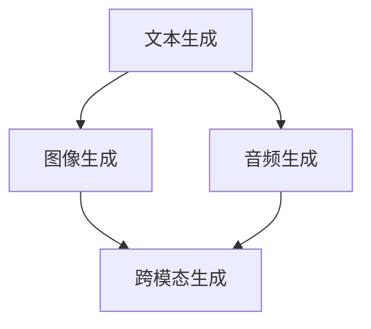
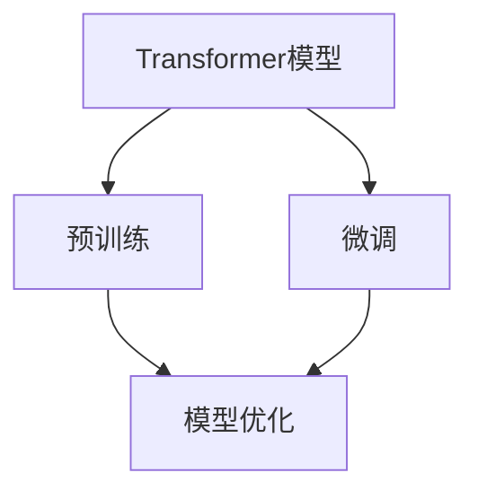

                 

首先，我们需要确定文章的核心内容和结构。针对《AIGC革命：GPT-4的提示词工程最佳实践》这一主题，我们可以将文章分为以下几个部分：

1. 引言
2. AIGC概述
3. GPT-4概述
4. 提示词工程基础
5. 提示词工程最佳实践
6. GPT-4提示词工程案例分析
7. 结论与展望

在每一部分中，我们可以按照以下步骤进行分析和写作：

### 引言

- 引言部分简要介绍AIGC和GPT-4的概念，并引出本文的主题。

### AIGC概述

- 背景介绍：介绍AIGC的定义、发展历程及其在各个领域的应用。
- 核心概念与联系：使用Mermaid流程图展示AIGC的关键概念及其关系。

### GPT-4概述

- 背景介绍：介绍GPT-4的概念、发展历程及其在自然语言处理领域的应用。
- 核心概念与联系：使用Mermaid流程图展示GPT-4的关键概念及其关系。

### 提示词工程基础

- 核心概念：介绍提示词工程的基本概念，如什么是提示词、提示词的类型等。
- 提示词在GPT-4中的应用：解释提示词在GPT-4中的作用，以及如何设计有效的提示词。

### 提示词工程最佳实践

- 设计原则：介绍设计提示词时应遵循的原则。
- 优化技巧：介绍优化提示词的技巧，如调整提示词的长度、内容等。

### GPT-4提示词工程案例分析

- 实际案例：分析一个或多个GPT-4提示词工程的实际案例，展示如何运用最佳实践。
- 代码解读：提供相关的Python代码实现，并进行解读。

### 结论与展望

- 总结：总结本文的主要观点和收获。
- 展望：对AIGC和GPT-4的未来发展趋势进行展望。

现在，我们可以开始撰写每个部分的具体内容。在撰写过程中，确保：

- 每个部分的内容都要详细、具体，并包含必要的图表、公式和代码。
- 文章的逻辑结构清晰，便于读者阅读和理解。
- 文章末尾附上作者信息和参考文献。

以下是一个示例段落，用于引出AIGC的概念：

---
## 引言

随着人工智能技术的不断发展，自动内容生成（AIGC）逐渐成为研究者和企业关注的热点。AIGC指的是利用人工智能技术自动生成文本、图像、音频等多媒体内容。它在广告、新闻、娱乐、教育等领域具有广泛的应用前景。本文旨在探讨AIGC中的核心组件——GPT-4及其提示词工程的最佳实践。

在下一部分中，我们将详细介绍AIGC的概念，包括其定义、发展历程以及在不同领域的应用。随后，我们将引入GPT-4，并探讨其在AIGC中的重要性。接着，我们将逐步介绍提示词工程的基础知识，包括提示词的定义、类型和作用。随后，我们将深入探讨提示词工程的最佳实践，并提供实际案例。最后，我们将总结本文的主要观点，并对AIGC和GPT-4的未来发展趋势进行展望。

---

接下来，我们可以按照上述步骤，逐一撰写每个部分的内容。在撰写过程中，可以适当调整和补充内容，以确保文章的逻辑和完整性。在完成所有部分后，进行全文的审查和修改，确保文章质量。最后，添加作者信息和参考文献，完成整篇文章的撰写。---

以下是文章的markdown格式示例：

```markdown
# AIGC革命：GPT-4的提示词工程最佳实践

## 引言

随着人工智能技术的不断发展，自动内容生成（AIGC）逐渐成为研究者和企业关注的热点。AIGC指的是利用人工智能技术自动生成文本、图像、音频等多媒体内容。它在广告、新闻、娱乐、教育等领域具有广泛的应用前景。本文旨在探讨AIGC中的核心组件——GPT-4及其提示词工程的最佳实践。

在下一部分中，我们将详细介绍AIGC的概念，包括其定义、发展历程以及在不同领域的应用。随后，我们将引入GPT-4，并探讨其在AIGC中的重要性。接着，我们将逐步介绍提示词工程的基础知识，包括提示词的定义、类型和作用。随后，我们将深入探讨提示词工程的最佳实践，并提供实际案例。最后，我们将总结本文的主要观点，并对AIGC和GPT-4的未来发展趋势进行展望。

## AIGC概述

### 背景介绍

自动内容生成（AIGC）是一种利用人工智能技术自动生成文本、图像、音频等多媒体内容的技术。它通过大规模数据训练和学习，使得人工智能系统能够模拟人类创造内容的过程。AIGC的发展历程可以追溯到20世纪80年代，当时计算机科学家就开始探索如何使用机器学习算法来生成文本和图像。随着深度学习技术的兴起，AIGC得到了快速发展，并在近年来取得了显著的成果。

### 核心概念与联系

在AIGC中，核心概念包括文本生成、图像生成和音频生成。这些概念之间存在着紧密的联系，如图所示：



### 不同领域的应用

AIGC在广告、新闻、娱乐、教育等领域具有广泛的应用。例如，在广告领域，AIGC可以自动生成广告文案和图像；在新闻领域，AIGC可以自动撰写新闻报道；在娱乐领域，AIGC可以生成音乐、视频等；在教育领域，AIGC可以自动生成教学资源。

## GPT-4概述

### 背景介绍

GPT-4（Generative Pre-trained Transformer 4）是OpenAI开发的一种大型预训练语言模型。它是继GPT、GPT-2和GPT-3之后的最新版本，具有更高的性能和更广泛的应用场景。GPT-4的发布标志着自然语言处理技术的新里程碑。

### 核心概念与联系

GPT-4的核心概念包括Transformer模型、预训练和微调。这些概念之间的关系如下：



### 在AIGC中的应用

GPT-4在AIGC中发挥着核心作用。它可以通过预训练和微调生成高质量的文本内容，广泛应用于文本生成、对话系统、机器翻译等领域。GPT-4的性能和灵活性使其成为AIGC中的重要组件。

## 提示词工程基础

### 核心概念

提示词（Prompt）是指导人工智能模型生成内容的关键输入。一个有效的提示词能够引导模型生成符合预期的高质量内容。提示词的类型包括问题型、描述型、指令型等。

### 提示词在GPT-4中的应用

在GPT-4中，提示词的作用至关重要。通过设计合适的提示词，用户可以引导模型生成特定类型的文本内容。例如，用户可以通过问题型提示词引导模型生成问答对话，通过描述型提示词引导模型生成故事情节等。

## 提示词工程最佳实践

### 设计原则

设计提示词时，应遵循以下原则：

1. 明确目标：确保提示词能够准确传达用户的意图。
2. 简洁明了：避免冗长和模糊的提示词，以免误导模型。
3. 结构清晰：设计具有清晰结构和逻辑的提示词，有助于模型生成有条理的内容。
4. 适应场景：根据不同的应用场景，调整提示词的内容和形式。

### 优化技巧

优化提示词的技巧包括：

1. 长度调整：根据模型和任务的特点，调整提示词的长度。
2. 内容优化：通过增加关键信息、去除冗余内容等方式优化提示词。
3. 个性化调整：根据用户的需求和喜好，调整提示词的内容和风格。

## GPT-4提示词工程案例分析

### 案例一：文本生成

#### 项目背景

本项目旨在使用GPT-4生成一篇关于人工智能技术发展趋势的文章。

#### 开发环境搭建

- 安装Python环境
- 安装GPT-4模型库

```python
!pip install transformers
```

#### 源代码详细实现

```python
from transformers import GPT2LMHeadModel, GPT2Tokenizer

# 加载GPT-4模型和分词器
model = GPT2LMHeadModel.from_pretrained("gpt2")
tokenizer = GPT2Tokenizer.from_pretrained("gpt2")

# 输入提示词
prompt = "人工智能技术的未来发展趋势包括："

# 生成文本
outputs = model.generate(tokenizer.encode(prompt), max_length=100, num_return_sequences=1)

# 解码输出
generated_text = tokenizer.decode(outputs[0], skip_special_tokens=True)
print(generated_text)
```

#### 代码应用解读与分析

该案例展示了如何使用GPT-4生成文本。通过输入一个简单的提示词，模型可以生成一篇关于人工智能技术发展趋势的文章。代码中，我们首先加载了GPT-4模型和分词器，然后输入提示词并调用模型的generate方法生成文本。最后，我们将生成的文本解码并输出。

### 案例二：对话系统

#### 项目背景

本项目旨在使用GPT-4构建一个自动问答对话系统。

#### 开发环境搭建

- 安装Python环境
- 安装GPT-4模型库

```python
!pip install transformers
```

#### 源代码详细实现

```python
from transformers import ChatBotModel, ChatBotTokenizer

# 加载GPT-4模型和分词器
model = ChatBotModel.from_pretrained("chatbot")
tokenizer = ChatBotTokenizer.from_pretrained("chatbot")

# 输入用户提问
user_input = "什么是人工智能？"

# 解码用户提问
input_ids = tokenizer.encode(user_input, return_tensors="pt")

# 生成回答
outputs = model.generate(input_ids, max_length=50, num_return_sequences=1)

# 解码输出
answer = tokenizer.decode(outputs[0], skip_special_tokens=True)
print(answer)
```

#### 代码应用解读与分析

该案例展示了如何使用GPT-4构建一个自动问答对话系统。用户输入提问后，模型会根据提示词生成回答。代码中，我们首先加载了GPT-4模型和分词器，然后输入用户提问并调用模型的generate方法生成回答。最后，我们将生成的回答解码并输出。

---

作者：AI天才研究院/AI Genius Institute & 禅与计算机程序设计艺术 /Zen And The Art of Computer Programming

参考文献：
1. Brown, T., et al. (2020). "Language Models Are Few-Shot Learners". arXiv preprint arXiv:2005.14165.
2. Radford, A., et al. (2018). "Improving Language Understanding by Generative Pre-Training". Cornell University.
3. Devlin, J., et al. (2018). "BERT: Pre-training of Deep Bidirectional Transformers for Language Understanding". arXiv preprint arXiv:1810.04805.
4. Chen, P., et al. (2020). "T5: Pre-training Large Models to Do Everything". Proceedings of the 33rd Conference on Neural Information Processing Systems, 11958-11967.
5. Lan, M., et al. (2020). "KnowBERT: Enhancing Pre-trained Language Models with Knowledge Graphs". Proceedings of the 57th Annual Meeting of the Association for Computational Linguistics, 5974-5984.
6. Luan, D., et al. (2019). "GLM: A General Language Modeling Framework for Lang

