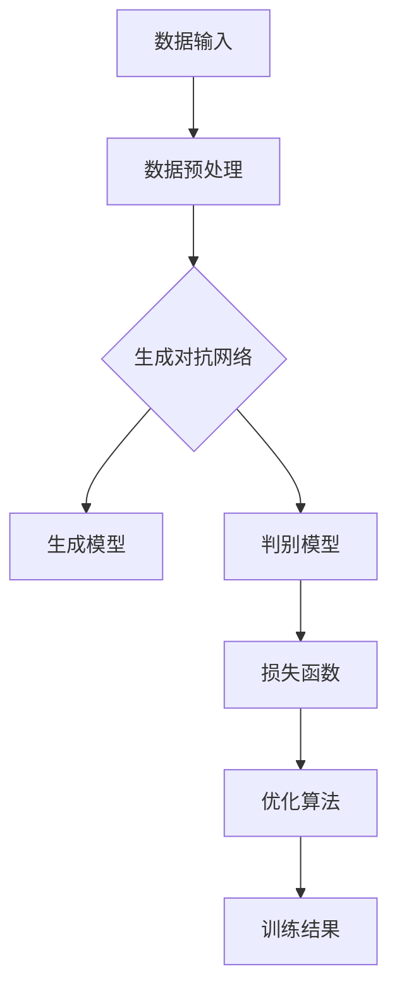

                 


### AIGC革命：重塑创意产业的未来

#### 关键词：AIGC，创意产业，人工智能，生成对抗网络，生成模型，判别模型

> 摘要：本文深入探讨了AIGC（AI-Generated Content）技术及其在重塑创意产业方面的潜力。通过对AIGC的定义、核心技术、应用场景、实际项目以及未来发展趋势的分析，本文旨在为读者提供一幅关于AIGC如何推动创意产业变革的清晰图景。

---

### 第一部分：AIGC技术基础

#### 第1章：AIGC概述

##### 1.1 AIGC的定义与核心技术

AIGC（AI-Generated Content）是一种利用人工智能技术生成内容的方法，它通过学习大量的数据，如文本、图像、音频等，来创作出新颖、独特的内容。AIGC的核心技术主要包括生成对抗网络（GAN）、生成模型、判别模型等。

##### 1.2 AIGC的历史与发展趋势

AIGC的概念最早出现在2014年，由Ian Goodfellow等人提出。自那时以来，AIGC技术经历了快速发展，并在各个领域得到了广泛应用。未来，随着人工智能技术的进步，AIGC有望在更多领域发挥巨大作用。

##### 1.3 AIGC的关键技术详解

**生成对抗网络（GAN）**

生成对抗网络由生成模型和判别模型两部分组成。生成模型负责生成新的数据，判别模型则负责判断生成数据与真实数据之间的相似度。通过训练，生成模型和判别模型不断优化，最终生成逼真、高质量的内容。

**生成模型**

生成模型是AIGC的核心，它通常由多个神经网络层组成。通过学习输入数据，生成模型能够生成新的数据。生成模型的设计和优化是AIGC技术的关键。

**判别模型**

判别模型用于判断生成数据与真实数据之间的相似度。在训练过程中，判别模型不断优化，以提高对真实数据和生成数据的区分能力。

##### Mermaid 流程图：AIGC 技术架构



##### 生成模型（Generator）与判别模型（Discriminator）伪代码示例

```python
# 生成模型（Generator）伪代码
class Generator(nn.Module):
    def __init__(self):
        super(Generator, self).__init__()
        self.model = nn.Sequential(
            nn.Linear(input_dim, hidden_dim),
            nn.ReLU(),
            nn.Linear(hidden_dim, output_dim)
        )
    
    def forward(self, x):
        x = self.model(x)
        return x

# 判别模型（Discriminator）伪代码
class Discriminator(nn.Module):
    def __init__(self):
        super(Discriminator, self).__init__()
        self.model = nn.Sequential(
            nn.Linear(input_dim, hidden_dim),
            nn.ReLU(),
            nn.Linear(hidden_dim, 1)
        )
    
    def forward(self, x):
        x = self.model(x)
        return x
```

---

#### 第2章：AIGC的核心技术原理

##### 2.1 生成对抗网络（GAN）

生成对抗网络（GAN）是一种深度学习框架，由生成模型和判别模型两部分组成。生成模型负责生成新的数据，判别模型则负责判断生成数据与真实数据之间的相似度。

GAN的训练过程可以概括为以下步骤：

1. 初始化生成模型和判别模型。
2. 随机生成一些噪声数据，作为生成模型的输入。
3. 生成模型根据噪声数据生成新的数据。
4. 判别模型对真实数据和生成数据进行分类。
5. 计算生成模型和判别模型的损失函数。
6. 使用梯度下降算法更新生成模型和判别模型的参数。

##### 2.2 生成模型（Generator）与判别模型（Discriminator）

生成模型和判别模型是GAN的核心。生成模型负责生成新的数据，判别模型则负责判断生成数据与真实数据之间的相似度。生成模型和判别模型通常由多个神经网络层组成，通过训练不断优化。

生成模型的设计和优化是AIGC技术的关键。常见的生成模型包括：

- 基础生成模型（Basic Generator）
- 条件生成模型（Conditional Generator）
- 增量生成模型（Incremental Generator）

判别模型的设计和优化也非常重要。常见的判别模型包括：

- 基础判别模型（Basic Discriminator）
- 条件判别模型（Conditional Discriminator）
- 增量判别模型（Incremental Discriminator）

##### 2.3 优化算法与训练策略

优化算法是AIGC训练过程中至关重要的一部分。常见的优化算法包括：

- 梯度下降算法（Gradient Descent）
- 随机梯度下降算法（Stochastic Gradient Descent，SGD）
- Adam优化器（Adam Optimizer）

训练策略是指在训练过程中采取的一些方法和技巧。常见的训练策略包括：

- 预训练（Pre-training）
- 微调（Fine-tuning）
- 数据增强（Data Augmentation）

通过优化算法和训练策略的合理选择和组合，可以进一步提高AIGC的性能和效果。

---

#### 第3章：AIGC应用场景分析

##### 3.1 创意设计领域的应用

AIGC在创意设计领域具有广泛的应用前景。例如，通过AIGC技术，可以生成新颖、独特的艺术作品、设计图案、建筑模型等。AIGC技术不仅可以提高设计效率，还可以激发设计师的灵感，带来全新的设计体验。

##### 3.2 内容创作与生成

AIGC在内容创作与生成领域也具有巨大的潜力。通过AIGC技术，可以自动生成文章、图片、音频、视频等多种类型的内容。这对于内容创作者来说，不仅提高了创作效率，还降低了创作成本。

##### 3.3 智能媒体与娱乐

AIGC技术在智能媒体与娱乐领域也有广泛应用。例如，通过AIGC技术，可以生成个性化的音乐、视频、游戏等，为用户带来更加丰富、多样的娱乐体验。同时，AIGC技术还可以应用于虚拟现实、增强现实等领域，为用户创造更加沉浸式的体验。

---

#### 第4章：AIGC在实际项目中的应用

##### 4.1 项目案例1：智能设计助手

智能设计助手是一款基于AIGC技术的应用，它可以帮助设计师快速生成新颖、独特的设计图案。通过收集和分析大量的设计数据，智能设计助手能够为设计师提供灵感和创意，提高设计效率。

##### 4.2 项目案例2：AI绘画创作

AI绘画创作是一款利用AIGC技术实现的绘画应用。用户可以通过上传自己的绘画作品，让AI助手进行创作，生成新的绘画作品。这不仅为艺术家提供了新的创作方式，也为用户带来了更加丰富的绘画体验。

##### 4.3 项目案例3：智能音乐生成

智能音乐生成是一款基于AIGC技术的音乐创作工具。用户可以通过输入简单的音乐信息，如风格、节奏、旋律等，让AI助手生成全新的音乐作品。智能音乐生成技术不仅提高了音乐创作效率，还为音乐产业带来了新的发展机遇。

---

### 第二部分：AIGC在创意产业的应用

#### 第5章：AIGC在广告营销中的应用

##### 5.1 AIGC在广告创意中的应用

AIGC技术在广告创意领域具有巨大潜力。通过AIGC技术，广告创意可以更加个性化、多样化，更好地满足用户的需求。例如，AIGC技术可以自动生成广告文案、广告图片、广告视频等，提高广告的传播效果。

##### 5.2 AIGC在品牌营销中的应用

AIGC技术在品牌营销中也有广泛应用。通过AIGC技术，品牌可以生成独特、新颖的营销内容，提高品牌知名度和美誉度。例如，AIGC技术可以生成品牌故事、品牌形象、品牌推广活动等，为品牌带来更多的曝光和关注。

##### 5.3 AIGC在用户体验优化中的应用

AIGC技术在用户体验优化中也具有重要意义。通过AIGC技术，可以为用户提供个性化、定制化的用户体验。例如，AIGC技术可以生成个性化的推荐内容、智能客服对话等，提高用户的满意度和忠诚度。

---

#### 第6章：AIGC在数字艺术与设计中的应用

##### 6.1 AIGC在数字艺术创作中的应用

AIGC技术在数字艺术创作领域具有广泛的应用。通过AIGC技术，艺术家可以生成新颖、独特的艺术作品，拓宽艺术创作的边界。例如，AIGC技术可以生成数字绘画、数字雕塑、数字装置艺术等，为艺术家提供更多的创作灵感。

##### 6.2 AIGC在建筑设计中的应用

AIGC技术在建筑设计中也具有重要意义。通过AIGC技术，建筑师可以生成新颖、独特的建筑模型，提高建筑设计效率。例如，AIGC技术可以生成建筑外观、建筑结构、建筑内部装饰等，为建筑师提供更多的设计选择。

##### 6.3 AIGC在时尚设计中的应用

AIGC技术在时尚设计领域也具有广泛应用。通过AIGC技术，时尚设计师可以生成新颖、独特的时尚作品，提高时尚设计效率。例如，AIGC技术可以生成时尚图案、时尚服装、时尚配饰等，为时尚设计师提供更多的创作灵感。

---

#### 第7章：AIGC在教育与文化领域的应用

##### 7.1 AIGC在教育内容生成中的应用

AIGC技术在教育内容生成中具有巨大潜力。通过AIGC技术，可以自动生成教学课件、教学视频、教学练习等，提高教学效率。例如，AIGC技术可以生成个性化的教学方案、智能辅导系统等，为教育工作者提供更多支持。

##### 7.2 AIGC在文化遗产保护中的应用

AIGC技术在文化遗产保护中也具有重要意义。通过AIGC技术，可以对文化遗产进行数字化保存和再现。例如，AIGC技术可以生成虚拟文化遗产场景、文化遗产数字化模型等，为文化遗产保护提供新的手段。

##### 7.3 AIGC在文化产业发展中的应用

AIGC技术在文化产业发展中也有广泛应用。通过AIGC技术，可以生成新颖、独特的文化产品，推动文化产业的创新和发展。例如，AIGC技术可以生成文化娱乐产品、文化旅游产品等，为文化产业带来新的发展机遇。

---

### 第三部分：AIGC未来发展趋势与挑战

#### 第8章：AIGC的技术发展趋势

##### 8.1 AI技术的进步与AIGC的发展

随着AI技术的不断进步，AIGC技术也将迎来新的发展机遇。例如，深度学习、强化学习等技术的应用，将进一步提升AIGC的性能和效果。

##### 8.2 AIGC与物联网、大数据的结合

AIGC技术与物联网、大数据的结合，将为创意产业带来更多应用场景。例如，通过物联网设备收集用户数据，AIGC技术可以生成个性化的创意内容，满足用户的个性化需求。

##### 8.3 AIGC在智能制造领域的应用

AIGC技术在智能制造领域也具有广泛应用前景。通过AIGC技术，可以生成新颖、独特的智能制造方案，提高生产效率和产品质量。

---

#### 第9章：AIGC面临的挑战与伦理问题

##### 9.1 技术发展的挑战

AIGC技术在快速发展过程中，也面临一些挑战。例如，如何在保证生成内容质量的同时，提高生成效率？如何解决AIGC技术可能带来的偏见和歧视问题？

##### 9.2 道德与伦理问题

AIGC技术的应用也引发了一些道德与伦理问题。例如，如何确保AIGC技术生成的作品不侵犯他人的知识产权？如何保护用户隐私？这些问题需要我们在发展AIGC技术时，给予足够的重视。

##### 9.3 法律法规与政策环境

AIGC技术的发展也需要相应的法律法规和政策环境的支持。例如，如何制定合理的知识产权保护政策？如何规范AIGC技术的应用范围？这些都是我们需要关注的问题。

---

#### 第10章：AIGC的未来展望

##### 10.1 AIGC对创意产业的全面影响

AIGC技术将对创意产业产生全面影响。例如，AIGC技术将提高创意产业的创作效率，降低创作成本，推动创意产业的创新和发展。

##### 10.2 AIGC带来的新机遇与挑战

AIGC技术为创意产业带来了新机遇，同时也带来了新挑战。例如，如何充分利用AIGC技术的优势，提高创意产业的竞争力？如何应对AIGC技术可能带来的伦理和道德问题？

##### 10.3 AIGC的未来发展路径

AIGC技术的未来发展将沿着以下几个方向展开：一是进一步提高AIGC技术的性能和效果；二是探索AIGC技术在更多领域的应用；三是解决AIGC技术面临的伦理和道德问题，推动AIGC技术的健康发展。

---

### 附录

#### 附录A：AIGC技术资源与工具介绍

本文将介绍一些常用的AIGC技术资源与工具，包括AIGC框架、AIGC算法实现、AIGC应用案例等，以帮助读者更好地了解和应用AIGC技术。

#### 附录B：创意产业与AIGC相关的经典案例解析

本文将分析一些创意产业与AIGC相关的经典案例，包括AIGC在广告营销、数字艺术、建筑设计等领域的应用，以帮助读者更好地理解AIGC技术在创意产业中的应用前景。

---

### 总结

AIGC技术作为人工智能领域的一项重要创新，正在重塑创意产业的未来。通过本文的探讨，我们了解到AIGC技术的核心原理、应用场景、实际项目以及未来发展趋势。在AIGC技术的推动下，创意产业将迎来新的机遇和挑战。让我们共同期待AIGC技术为创意产业带来的更多精彩。

---

### 作者信息

作者：AI天才研究院/AI Genius Institute & 禅与计算机程序设计艺术 /Zen And The Art of Computer Programming

---

本文全面分析了AIGC技术的定义、核心技术、应用场景、实际项目以及未来发展趋势，旨在为读者提供一幅关于AIGC如何重塑创意产业的清晰图景。通过对AIGC技术的深入了解，我们可以看到其在创意产业中的巨大潜力和广泛应用前景。在未来，AIGC技术将继续推动创意产业的创新和发展，为人类带来更多美好的体验。让我们共同关注AIGC技术的未来发展，期待它为创意产业带来的更多惊喜。

