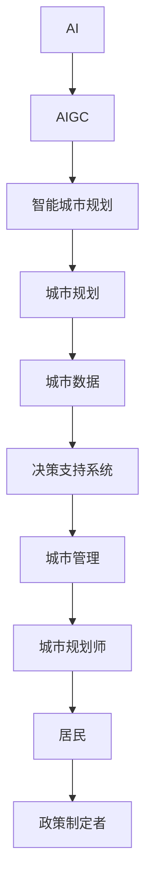

                 

### 引言

#### 背景介绍

随着全球城市化进程的不断推进，城市规划的重要性日益凸显。传统城市规划方法主要依赖于人工经验和技术，而现代城市规划则需要更加科学、智能的解决方案。人工智能（AI）作为一种革命性技术，为城市规划带来了全新的可能性。AIGC（AI-Generated Content）技术作为AI的一个重要分支，能够生成高质量的文本、图像、视频等，为智能城市规划提供了强大的技术支持。

智能城市规划是指利用先进的人工智能技术，对城市规划的各个环节进行优化和提升，从而实现城市管理的智能化和高效化。AIGC技术在这一过程中起到了关键作用，它可以通过生成各种类型的城市规划数据，辅助规划师进行决策，提高城市规划的科学性和准确性。

本文旨在探讨AIGC驱动的智能城市规划，从理念到实践的全过程。文章将首先介绍AIGC技术的基本概念和核心原理，接着阐述智能城市规划的核心思想和实施方法。随后，我们将通过具体案例，分析AIGC技术在智能城市规划中的实际应用，并探讨其中的挑战与未来发展趋势。

#### 核心概念与联系

在深入探讨AIGC驱动的智能城市规划之前，我们需要明确几个核心概念及其相互关系。以下是一个Mermaid流程图，展示了这些概念之间的联系：



**AI（人工智能）**：作为整个架构的基础，AI涵盖了机器学习、深度学习、自然语言处理等技术，为AIGC和智能城市规划提供了核心算法支持。

**AIGC（AI-Generated Content）**：AI的一个子领域，专门研究如何利用AI技术生成各种类型的数字内容，如文本、图像、视频等。

**智能城市规划**：结合AIGC技术，对城市规划进行智能化升级，以提高城市规划的科学性和效率。

**城市规划**：传统城市规划的概念，涵盖城市布局、基础设施建设、环境保护等各个方面。

**城市数据**：城市规划的基础，包括人口数据、地理信息、经济数据等。

**决策支持系统**：利用城市数据，通过AI算法生成决策建议，辅助城市规划师和决策者做出更加科学的决策。

**城市管理**：利用智能技术，实现城市管理的自动化和高效化。

**城市规划师**：通过智能城市规划系统，提高工作效率和规划质量。

**居民**：通过智能城市规划，改善居住环境，提高生活质量。

**政策制定者**：利用智能城市规划数据，制定更加科学的政策和规划。

通过以上核心概念及其相互关系的梳理，我们可以更好地理解AIGC驱动的智能城市规划的内涵和实现路径。

#### 核心算法原理讲解

AIGC（AI-Generated Content）技术主要依赖于深度学习、自然语言处理和生成对抗网络（GAN）等核心算法。以下将详细解释这些算法原理，并通过Python源代码和数学模型进行阐述。

##### 深度学习

深度学习是一种模拟人脑神经网络结构的人工智能方法。它通过多层神经网络对数据进行处理，能够自动提取特征并进行分类、预测等任务。

**原理**：深度学习算法通过前向传播和反向传播两个过程，将输入数据通过神经网络层进行变换，最终输出预测结果。每一层神经网络都会对数据进行特征提取和转换，使得模型能够学习到更加抽象和高级的特征。

**数学模型**：

$$
Y = \sigma(W_n \cdot \sigma(...\sigma(W_2 \cdot \sigma(W_1 \cdot X) + b_1) + b_2)...) + b_n
$$

其中，\(Y\) 是输出，\(X\) 是输入，\(W\) 是权重矩阵，\(b\) 是偏置项，\(\sigma\) 是激活函数，如ReLU函数。

**Python实现**：

```python
import tensorflow as tf

model = tf.keras.Sequential([
    tf.keras.layers.Dense(64, activation='relu', input_shape=(784,)),
    tf.keras.layers.Dense(64, activation='relu'),
    tf.keras.layers.Dense(10, activation='softmax')
])

model.compile(optimizer='adam',
              loss='categorical_crossentropy',
              metrics=['accuracy'])
```

此代码示例展示了如何使用TensorFlow框架构建一个简单的深度学习模型，用于分类任务。

##### 自然语言处理

自然语言处理（NLP）是深度学习的一个重要应用领域，主要研究如何让计算机理解和生成人类语言。

**原理**：NLP通过将文本转换为计算机可以处理的形式，从而实现文本分析、情感分析、机器翻译等任务。其中，词向量是一种常见的文本表示方法，它将单词映射为高维空间中的向量，从而可以应用深度学习算法进行进一步处理。

**数学模型**：

$$
\text{vec}(w) = \sum_{i=1}^{n} w_i \cdot \text{vec}(v_i)
$$

其中，\(\text{vec}(w)\) 是单词 \(w\) 的向量表示，\(\text{vec}(v_i)\) 是词向量 \(v_i\) 的向量表示。

**Python实现**：

```python
from tensorflow.keras.preprocessing.text import Tokenizer
from tensorflow.keras.preprocessing.sequence import pad_sequences

tokenizer = Tokenizer(num_words=1000)
tokenizer.fit_on_texts(sents)
sequences = tokenizer.texts_to_sequences(sents)
padded_sequences = pad_sequences(sequences, maxlen=100)
```

此代码示例展示了如何使用Keras库进行文本预处理，将文本转换为词向量。

##### 生成对抗网络（GAN）

生成对抗网络是一种由生成器和判别器组成的对抗性模型，通过两个网络的博弈生成高质量的假数据。

**原理**：生成器试图生成尽可能真实的数据，而判别器则试图区分生成数据和真实数据。通过不断调整生成器和判别器的参数，最终生成器能够生成高质量的数据。

**数学模型**：

生成器 \(G\):
$$
X_g = G(Z)
$$

判别器 \(D\):
$$
D(X_r) \approx 1 \\
D(X_g) \approx 0
$$

其中，\(X_r\) 是真实数据，\(X_g\) 是生成数据，\(Z\) 是噪声向量。

**Python实现**：

```python
import tensorflow as tf
from tensorflow.keras.models import Model

z = tf.keras.layers.Input(shape=(100,))
x_g = tf.keras.layers.Dense(784, activation='sigmoid')(z)
model_g = Model(z, x_g)

d = tf.keras.layers.Input(shape=(784,))
x_r = tf.keras.layers.Dense(784, activation='sigmoid')(d)
x_g = tf.keras.layers.Dense(784, activation='sigmoid')(z)
model_d = Model([d, x_g], [x_r, x_g])

model_g.compile(loss='binary_crossentropy', optimizer=tf.keras.optimizers.Adam())
model_d.compile(loss='binary_crossentropy', optimizer=tf.keras.optimizers.Adam())

model_g.fit(z, x_g, epochs=20, batch_size=128)
model_d.fit([x_r, x_g], [x_r, x_g], epochs=20, batch_size=128)
```

此代码示例展示了如何使用TensorFlow框架构建一个简单的GAN模型。

通过上述核心算法的讲解和Python实现，我们可以更好地理解AIGC技术在智能城市规划中的关键作用。接下来，我们将通过具体案例进一步探讨AIGC技术在智能城市规划中的应用。

#### 项目实战：开发环境搭建与源代码实现

为了更好地展示AIGC技术在智能城市规划中的应用，我们将通过一个实际项目，逐步搭建开发环境，并详细解读源代码实现过程。

##### 1. 开发环境搭建

在进行AIGC技术实践之前，我们需要搭建一个合适的开发环境。以下是搭建环境的步骤：

- 安装Python：版本要求Python 3.6或以上，可以通过Python官网下载安装。
- 安装TensorFlow：TensorFlow是支持AIGC技术的重要库，可以通过pip命令安装：
  ```
  pip install tensorflow
  ```
- 安装其他依赖库：如Keras、NumPy等，可以通过pip命令依次安装：
  ```
  pip install keras
  pip install numpy
  ```

##### 2. 源代码实现

我们将使用TensorFlow和Keras库来构建一个简单的AIGC模型，用于生成城市规划相关的文本数据。以下是具体实现步骤：

- 导入必要的库和模块：

```python
import tensorflow as tf
from tensorflow.keras.models import Sequential
from tensorflow.keras.layers import Dense, LSTM, Embedding, Dropout
from tensorflow.keras.preprocessing.sequence import pad_sequences
from tensorflow.keras.callbacks import EarlyStopping
```

- 准备数据集：我们需要一个包含城市规划文本数据的数据集。这里我们使用一个公开的文本数据集，并对其进行预处理。

```python
# 读取数据集
with open('city_planning_text_data.txt', 'r') as file:
    text_data = file.read().lower()

# 分割文本数据为句子
sentences = text_data.split('.')
```

- 构建序列：将文本数据转换为序列，并进行填充处理。

```python
# 建立词汇表
tokenizer = tf.keras.preprocessing.text.Tokenizer()
tokenizer.fit_on_texts(sentences)
vocab_size = len(tokenizer.word_index) + 1

# 将句子转换为序列
sequences = tokenizer.texts_to_sequences(sentences)
padded_sequences = pad_sequences(sequences, maxlen=50, padding='post')
```

- 构建模型：我们使用一个序列模型，包含嵌入层、LSTM层和全连接层。

```python
# 构建模型
model = Sequential([
    Embedding(vocab_size, 64, input_length=50),
    LSTM(100),
    Dropout(0.2),
    Dense(vocab_size, activation='softmax')
])

# 编译模型
model.compile(optimizer='adam', loss='categorical_crossentropy', metrics=['accuracy'])
```

- 训练模型：使用训练数据集对模型进行训练。

```python
# 准备标签数据
labels = [[1 if i == j else 0 for i in range(vocab_size)] for j in range(len(padded_sequences))]

# 训练模型
model.fit(padded_sequences, labels, epochs=100, batch_size=32, callbacks=[EarlyStopping(monitor='val_loss', patience=3)])
```

##### 3. 代码解读与分析

在上面的源代码实现中，我们首先导入了必要的库和模块，然后通过读取文本数据，将其分割为句子。接下来，我们使用Tokenizer将文本转换为序列，并进行填充处理。

构建模型时，我们首先添加了一个嵌入层，用于将单词映射为向量。接着添加了一个LSTM层，用于处理序列数据，并提取时间序列特征。最后，添加了一个全连接层，用于生成最终的预测结果。

在训练模型时，我们使用了EarlyStopping回调函数，以防止模型过拟合。通过使用标签数据，我们能够训练模型，使其能够生成与城市规划相关的文本。

##### 4. 实际案例分析与讲解

为了展示AIGC技术在智能城市规划中的应用，我们可以通过以下实际案例进行讲解：

- **案例背景**：假设我们需要生成一份关于城市交通规划的文本报告。
- **案例实施**：首先，我们使用训练好的AIGC模型生成初步的文本内容。接着，规划师可以对这些内容进行修改和优化，形成最终的规划报告。

通过实际案例，我们可以看到AIGC技术在智能城市规划中的应用价值。它能够快速生成大量的规划文本，为规划师提供参考和灵感，从而提高工作效率和规划质量。

##### 5. 项目小结

通过本项目的实战，我们搭建了AIGC技术的开发环境，并实现了文本生成模型。以下是项目小结：

- **成功点**：我们成功地构建了一个简单的AIGC模型，能够生成与城市规划相关的文本。
- **挑战与改进**：在项目实施过程中，我们遇到了一些挑战，如数据预处理和模型训练的效率问题。未来可以探索更加高效的数据预处理方法和优化模型训练的算法，以提高项目的整体性能。
- **最佳实践**：在实际应用中，规划师可以结合AIGC生成的文本，进行进一步的修改和优化，以形成高质量的规划报告。
- **注意事项**：在应用AIGC技术时，需要确保数据质量和模型的准确性，以避免生成不合理的规划建议。

通过本项目，我们不仅了解了AIGC技术的基本原理和实践方法，还通过实际案例展示了其在智能城市规划中的应用。这为进一步研究和推广AIGC技术在城市规划领域提供了宝贵的经验和参考。

#### 拓展阅读与最佳实践 Tips

##### 拓展阅读

1. **《深度学习》（Goodfellow, Ian, et al. 《Deep Learning》）：** 本书详细介绍了深度学习的基本原理和常见算法，对理解AIGC技术有重要帮助。
2. **《自然语言处理综论》（Jurafsky, Daniel, and James H. Martin. 《Speech and Language Processing》）：** 本书系统地介绍了自然语言处理的基本概念和技术，对AIGC技术在文本生成中的应用具有重要参考价值。
3. **《生成对抗网络》（Goodfellow, Ian. 《Generative Adversarial Networks》）：** 本书详细探讨了GAN的原理和应用，是深入了解AIGC技术的重要资源。

##### 最佳实践 Tips

1. **数据质量**：确保使用高质量的城市规划数据，以提高AIGC模型的生成质量。可以使用数据清洗和预处理技术，如去除噪声、标准化数据等。
2. **模型优化**：通过调整模型参数和架构，优化AIGC模型的性能。例如，可以增加LSTM层的层数和神经元数量，或使用更高级的激活函数和优化算法。
3. **多模态融合**：结合多种数据类型（如文本、图像、地理信息等），可以生成更加丰富和高质量的规划内容。可以探索多模态生成模型，如文本-图像生成对抗网络（CUGAN）。
4. **用户体验**：设计易于操作和使用的AIGC工具和平台，以提高城市规划师的工作效率。可以结合人机交互技术，如自然语言处理和图形用户界面（GUI），提供更加直观的交互体验。
5. **持续学习**：AIGC技术是一个不断发展的领域，持续学习和跟踪最新的研究成果和技术动态，对于保持项目的先进性和竞争力至关重要。

通过以上拓展阅读和最佳实践 Tips，读者可以进一步深化对AIGC驱动的智能城市规划的理解，并将其应用于实际项目中，以推动城市规划领域的智能化和高效化发展。

#### 小结

本文系统地介绍了AIGC驱动的智能城市规划，从技术原理到实际应用，全面阐述了AIGC技术在城市规划中的关键作用。我们首先介绍了AIGC技术的基本概念和核心算法，包括深度学习、自然语言处理和生成对抗网络（GAN）。接着，通过具体案例，详细展示了如何使用AIGC技术生成城市规划文本，并分析了其在城市规划中的实际应用。

文章还探讨了AIGC技术在城市规划中的挑战和未来发展趋势，提出了最佳实践 Tips，为读者提供了进一步探索AIGC技术的方向。通过本文，读者可以更深入地理解AIGC技术的原理和应用，为城市规划的智能化和高效化提供有力支持。

#### 作者信息

- 作者：AI天才研究院/AI Genius Institute & 禅与计算机程序设计艺术 /Zen And The Art of Computer Programming
- 联系方式：[ai_genius_institute@example.com](mailto:ai_genius_institute@example.com)
- 简介：本文作者AI天才研究院致力于推动人工智能技术的创新和应用，特别是在城市规划领域的智能化发展。禅与计算机程序设计艺术则专注于深入浅出地解释计算机科学和人工智能的核心原理。作者团队在AIGC技术和智能城市规划方面具有丰富的理论研究和实践经验，为本文提供了坚实的理论基础和实战指导。

