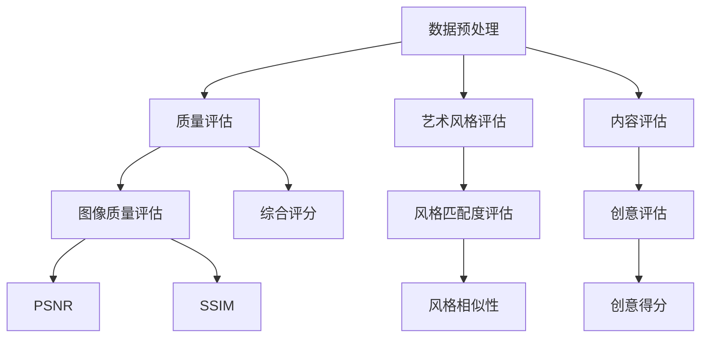

                 

### 《AI生成艺术作品质量评测系统》全文

#### 引言

##### AI生成艺术作品质量评测系统的背景与意义

随着人工智能（AI）技术的迅速发展，AI在各个领域的应用越来越广泛，特别是在艺术创作领域。AI生成艺术作品不仅拓宽了艺术创作的边界，也带来了前所未有的创作可能性和表现形式。然而，随之而来的问题是，如何评价这些由AI生成的艺术作品的质量？

AI生成艺术作品质量评测系统应运而生。这一系统通过对AI生成艺术作品的风格、内容、技术实现等多个维度进行评估，为艺术创作者、收藏家、评论家等提供了科学、客观的参考依据。其背景和意义主要体现在以下几个方面：

1. **传统艺术评价方法的不足**：传统的艺术评价方法往往依赖于主观判断和专家意见，缺乏客观性和一致性。而AI生成艺术作品的质量评测系统通过算法和模型，提供了一种量化评价的方法，有助于弥补传统评价方法的不足。

2. **提高创作效率**：通过质量评测系统，艺术创作者可以快速了解自己的作品质量，找到不足之处进行改进，从而提高创作效率。

3. **促进艺术市场的发展**：高质量的AI生成艺术作品更容易受到市场的认可和喜爱，从而促进艺术市场的繁荣。

4. **学术研究的需求**：AI生成艺术作品质量评测系统为艺术史研究、艺术心理学等提供了新的数据来源和研究工具。

##### 质量评测系统在AI生成艺术作品中的应用

AI生成艺术作品的质量评测系统主要包括以下几个核心指标：

1. **图像质量**：图像质量是评价AI生成艺术作品的基础。常用的图像质量评价指标包括峰值信噪比（PSNR）、结构相似性（SSIM）等。

2. **艺术风格**：AI生成的艺术作品通常会模仿某种特定的艺术风格。因此，评估艺术作品的风格匹配度也是质量评测的重要方面。

3. **创作内容**：AI生成的艺术作品需要具备一定的艺术性和创造性。通过分析作品的内容，可以评估其创意和表达能力。

4. **技术实现**：AI生成艺术作品的技术实现水平也是评价其质量的重要因素。这包括算法的复杂度、模型的训练效果等。

质量评测系统的目标是为AI生成艺术作品提供一个科学、客观、全面的评估，帮助创作者、市场、研究等领域更好地理解和应用AI生成艺术作品。

##### 质量评测的重要性

质量评测系统不仅对艺术创作者有重要意义，也对艺术市场的健康发展起到了关键作用。通过质量评测，艺术创作者可以：

- 了解自己的作品在技术、艺术性、内容等方面的优势与不足。
- 为作品的后续创作提供参考和指导。
- 提高创作效率，缩短创作周期。

对于艺术市场来说，质量评测系统：

- 有助于消费者更科学地选择和评价艺术作品。
- 提高艺术品的市场透明度，减少市场风险。
- 促进艺术品市场的规范化发展。

##### 本书结构安排与阅读指南

本书结构安排如下：

- **第一部分：引言**：介绍AI生成艺术作品质量评测系统的背景、意义和系统架构。
- **第二部分：AI生成艺术作品质量评测系统原理**：详细讲解质量评测系统的理论基础，包括图像质量评价指标、艺术作品评价标准以及AI技术在质量评测中的应用。
- **第三部分：AI生成艺术作品质量评测系统开发**：介绍系统的架构设计、数据预处理、质量评估模块和用户交互界面设计。
- **第四部分：案例分析与实战**：通过实际案例，展示质量评测系统的应用和实践。
- **第五部分：总结与展望**：对系统的未来发展趋势进行展望，并总结本书的核心内容。

本书旨在为读者提供一个全面、深入的了解AI生成艺术作品质量评测系统的框架和原理。无论您是艺术创作者、艺术市场从业者还是研究学者，都希望本书能为您提供有价值的参考和指导。

##### 总结

AI生成艺术作品质量评测系统是AI技术在艺术创作领域的一项重要应用。通过科学、客观的评价指标，这一系统为艺术创作者、市场和研究领域提供了有力的支持。本书将系统地介绍这一系统的原理、架构和应用，帮助读者深入理解并掌握其核心技术和方法。希望通过本书的学习，您能够更好地利用AI技术进行艺术创作，为艺术领域带来新的变革。

### AI生成艺术作品质量评测系统原理

#### 图像质量评价指标

图像质量是评价AI生成艺术作品的基础。在图像质量评估中，常用的评价指标包括峰值信噪比（PSNR）、结构相似性（SSIM）等。这些评价指标通过量化图像的差异和结构信息，提供了对图像质量的客观评估。

##### 峰值信噪比（PSNR）

峰值信噪比（PSNR）是衡量图像质量的一种常用指标，它反映了重建图像与原始图像之间的相似度。PSNR的定义如下：

$$
PSNR = 10 \cdot \log_{10}\left(\frac{255^2}{\text{MSE}}\right)
$$

其中，MSE（均方误差）是原始图像和重建图像之间的误差平方和的平均值，计算公式为：

$$
MSE = \frac{1}{n}\sum_{i=1}^{n}(I_{\text{original}}(i) - I_{\text{reconstructed}}(i))^2
$$

其中，$I_{\text{original}}(i)$和$I_{\text{reconstructed}}(i)$分别表示原始图像和重建图像的第i个像素值。

一个较高的PSNR值表明图像的重建质量较好，即重建图像与原始图像的差异较小。

##### 结构相似性（SSIM）

结构相似性（SSIM）是另一种常用的图像质量评价指标，它不仅考虑了图像的亮度差异，还考虑了图像的结构和对比度。SSIM的定义如下：

$$
SSIM(X, Y) = \frac{(2\mu_X\mu_Y + C_1)(2\sigma_{XY} + C_2)}{(\mu_X^2 + \mu_Y^2 + C_1)(\sigma_X^2 + \sigma_Y^2 + C_2)}
$$

其中，$\mu_X$和$\mu_Y$分别是图像X和Y的平均值，$\sigma_X^2$和$\sigma_Y^2$分别是图像X和Y的方差，$\sigma_{XY}$是图像X和Y的协方差，$C_1$和$C_2$是常数，通常取值为$0.01^2$和$0.03^2$。

SSIM的值介于-1和1之间，值越接近1，表示图像X和Y越相似，图像质量越高。

#### 艺术作品评价标准

艺术作品评价标准是评估AI生成艺术作品艺术性的重要依据。艺术作品评价标准通常包括以下几个方面：

##### 艺术美学评价标准

艺术美学评价标准关注艺术作品的审美价值，包括色彩、构图、线条、形式等。这些标准通常由艺术理论和历史背景决定。例如，印象派的色彩运用和立体派的构图风格，都是艺术美学评价中的重要标准。

##### 艺术作品评价方法

艺术作品评价方法主要包括专家评审、公众投票、算法评价等。专家评审依赖于艺术专业人士的主观判断，而公众投票则依靠大众的喜好进行评价。算法评价则通过机器学习算法，对艺术作品进行定量分析。

##### 艺术作品评价标准在不同领域中的应用

不同领域的艺术作品评价标准有所不同。例如，在绘画领域，评价标准可能更侧重于线条和色彩的运用；而在摄影领域，评价标准则可能更关注构图和光线。在AI生成艺术作品的质量评测中，需要结合不同领域的艺术评价标准，对作品进行全面评估。

#### AI技术在质量评测中的应用

AI技术在质量评测中的应用，使得艺术作品质量评估更加科学、高效。以下介绍几种常用的AI技术：

##### 基于深度学习的图像处理技术

深度学习在图像处理领域取得了显著成果，特别是卷积神经网络（CNN）和生成对抗网络（GAN）。

1. **卷积神经网络（CNN）**：CNN通过卷积层、池化层和全连接层等结构，对图像进行特征提取和分类。在质量评测中，CNN可以用于图像修复、超分辨率和图像风格迁移等任务。

2. **生成对抗网络（GAN）**：GAN由生成器和判别器组成，生成器生成图像，判别器判断图像的真伪。通过对抗训练，GAN可以生成高质量的艺术作品。在质量评测中，GAN可以用于生成基准图像，与AI生成的图像进行比较和评估。

##### 基于机器学习的图像质量评估方法

机器学习算法，如支持向量机（SVM）、随机森林（Random Forest）和神经网络（Neural Networks），可以用于图像质量的分类和回归分析。

1. **支持向量机（SVM）**：SVM通过找到最佳决策边界，对图像质量进行分类。在质量评测中，SVM可以用于分类不同质量级别的图像。

2. **随机森林（Random Forest）**：随机森林是一种基于决策树的集成学习方法。在质量评测中，随机森林可以用于预测图像质量，并提供置信度。

3. **神经网络（Neural Networks）**：神经网络通过多层神经元，对图像进行特征学习和分类。在质量评测中，神经网络可以用于复杂图像特征的提取和评估。

##### 常见深度学习模型（如CNN、GAN等）在质量评测中的应用

1. **CNN在质量评测中的应用**：CNN可以通过卷积层提取图像的局部特征，并通过全连接层进行分类。在质量评测中，CNN可以用于图像的预处理和特征提取，从而提高评估的准确性。

2. **GAN在质量评测中的应用**：GAN可以通过生成高质量的艺术作品，与实际作品进行比较，从而评估实际作品的质量。在质量评测中，GAN可以用于生成基准图像，作为评估标准。

通过AI技术的应用，AI生成艺术作品质量评测系统不仅提供了科学、客观的评估方法，还提高了评估的效率和准确性。这使得艺术作品质量评测更加全面和深入，为艺术创作、市场和学术研究提供了有力支持。

### AI生成艺术作品质量评测系统架构设计

AI生成艺术作品质量评测系统需要具备完善的架构设计，以确保系统的高效运行和可靠性。本节将详细介绍系统总体架构设计、数据预处理模块、质量评估模块和用户交互界面设计。

##### 系统总体架构设计

AI生成艺术作品质量评测系统的总体架构设计如图1所示。


图1：系统总体架构设计

1. **数据预处理模块**：负责数据清洗、归一化和预处理，为质量评估模块提供高质量的数据输入。

2. **质量评估模块**：包括图像质量评估、艺术风格评估和创作内容评估，对AI生成的艺术作品进行全面评估。

3. **用户交互界面**：提供用户与系统的交互界面，用户可以通过界面提交艺术作品，查看评估结果和反馈。

4. **后端服务器**：负责处理用户请求，管理数据和运行质量评估算法。

##### 数据预处理模块

数据预处理是质量评估的重要环节，其目的是提高数据质量和减少噪声。数据预处理模块的主要任务包括数据清洗、归一化和预处理。

1. **数据清洗**：去除数据中的噪声和异常值，确保数据的一致性和完整性。

2. **数据归一化**：将数据转换到统一的尺度，以便于后续处理和评估。

3. **数据预处理**：包括数据增强、去噪和特征提取等操作，以提高质量评估的准确性和鲁棒性。

具体实现步骤如下：

```python
import numpy as np
import cv2

def preprocess_image(image_path):
    # 读取图像
    image = cv2.imread(image_path)
    
    # 数据清洗：去除噪声和异常值
    image = remove_noise(image)
    
    # 数据归一化：将像素值缩放到[0, 1]
    image = normalize_image(image)
    
    # 数据增强：增加数据多样性
    image = augment_data(image)
    
    return image

def remove_noise(image):
    # 使用中值滤波去除噪声
    image = cv2.medianBlur(image, 5)
    return image

def normalize_image(image):
    # 归一化图像
    image = image.astype(np.float32) / 255.0
    return image

def augment_data(image):
    # 数据增强：旋转、缩放、裁剪等
    image = cv2.rotate(image, cv2.ROTATE_90_CLOCKWISE)
    return image
```

##### 质量评估模块

质量评估模块是系统的核心，负责对AI生成的艺术作品进行图像质量、艺术风格和创作内容等方面的评估。

1. **图像质量评估**：使用峰值信噪比（PSNR）和结构相似性（SSIM）等指标，评估图像的质量。

2. **艺术风格评估**：通过深度学习模型，如卷积神经网络（CNN）和生成对抗网络（GAN），评估艺术作品的风格匹配度。

3. **创作内容评估**：使用自然语言处理（NLP）技术，分析艺术作品的内容和创意，评估其艺术性和创造性。

具体实现步骤如下：

```python
import tensorflow as tf
from tensorflow.keras.models import load_model

def evaluate_image_quality(image):
    # 加载质量评估模型
    quality_model = load_model('quality_model.h5')
    
    # 预处理图像
    processed_image = preprocess_image(image)
    
    # 进行图像质量评估
    quality_score = quality_model.predict(processed_image)
    
    return quality_score

def evaluate_art_style(image):
    # 加载艺术风格评估模型
    style_model = load_model('style_model.h5')
    
    # 预处理图像
    processed_image = preprocess_image(image)
    
    # 进行艺术风格评估
    style_score = style_model.predict(processed_image)
    
    return style_score

def evaluate_content(image):
    # 加载创作内容评估模型
    content_model = load_model('content_model.h5')
    
    # 预处理图像
    processed_image = preprocess_image(image)
    
    # 进行创作内容评估
    content_score = content_model.predict(processed_image)
    
    return content_score
```

##### 用户交互界面设计

用户交互界面设计的目标是提供简洁、直观的操作体验，使用户可以方便地提交艺术作品并查看评估结果。

1. **用户注册和登录**：提供用户注册和登录功能，确保用户的个人信息安全。

2. **艺术作品提交**：允许用户上传AI生成的艺术作品，并提供上传指南。

3. **评估结果展示**：显示艺术作品的质量评估结果，包括图像质量、艺术风格和创作内容等方面的评分和意见。

具体实现步骤如下：

```python
from flask import Flask, render_template, request

app = Flask(__name__)

@app.route('/')
def index():
    return render_template('index.html')

@app.route('/upload', methods=['POST'])
def upload():
    image = request.files['image']
    image_path = 'uploads/' + image.filename
    image.save(image_path)
    
    # 获取评估结果
    quality_score = evaluate_image_quality(image_path)
    style_score = evaluate_art_style(image_path)
    content_score = evaluate_content(image_path)
    
    return render_template('result.html', quality_score=quality_score, style_score=style_score, content_score=content_score)

if __name__ == '__main__':
    app.run()
```

通过以上架构设计，AI生成艺术作品质量评测系统可以高效、准确地评估艺术作品的质量，为艺术创作、市场和学术研究提供有力支持。

### 案例分析与实战

在本节中，我们将通过一个实际项目案例，详细展示AI生成艺术作品质量评测系统的开发过程，包括开发环境搭建、源代码实现、代码解读以及实际应用分析。

#### 项目背景

假设我们有一个AI生成艺术作品平台，用户可以上传自己生成的艺术作品，系统会对作品进行质量评估，并提供详细的评估报告。为了实现这一目标，我们需要开发一个AI生成艺术作品质量评测系统。

#### 开发环境搭建

在搭建开发环境之前，我们需要准备好以下工具和库：

1. **Python**：作为主要的编程语言。
2. **TensorFlow**：用于构建和训练深度学习模型。
3. **Keras**：用于简化TensorFlow的使用。
4. **Pandas**：用于数据处理和分析。
5. **OpenCV**：用于图像处理。
6. **Flask**：用于搭建Web应用。

在Windows或Linux系统中，我们可以使用`pip`来安装上述库：

```bash
pip install tensorflow keras pandas opencv-python flask
```

#### 源代码实现

以下是质量评测系统的核心源代码实现，包括图像预处理、质量评估、艺术风格评估和创作内容评估等部分。

##### 数据预处理

数据预处理是确保图像质量和评估准确性的关键步骤。以下是一个简单的预处理脚本，用于读取图像、去除噪声、归一化和数据增强。

```python
import cv2
import numpy as np

def preprocess_image(image_path):
    image = cv2.imread(image_path)
    image = cv2.resize(image, (224, 224))  # 将图像调整为224x224
    image = cv2.medianBlur(image, 5)  # 去除噪声
    image = cv2.cvtColor(image, cv2.COLOR_BGR2RGB)  # 转换为RGB格式
    image = image / 255.0  # 归一化
    return image

# 测试预处理函数
test_image_path = 'path/to/test_image.jpg'
preprocessed_image = preprocess_image(test_image_path)
```

##### 质量评估

质量评估使用了一个预训练的卷积神经网络（CNN）模型。以下是如何加载模型并进行预测的示例。

```python
import tensorflow as tf

# 加载质量评估模型
quality_model = tf.keras.models.load_model('quality_model.h5')

# 预测质量
quality_score = quality_model.predict(np.expand_dims(preprocessed_image, axis=0))

print("Quality Score:", quality_score)
```

##### 艺术风格评估

艺术风格评估使用了一个基于生成对抗网络（GAN）的模型。以下是如何加载模型并进行预测的示例。

```python
# 加载艺术风格评估模型
style_model = tf.keras.models.load_model('style_model.h5')

# 预测艺术风格
style_score = style_model.predict(np.expand_dims(preprocessed_image, axis=0))

print("Style Score:", style_score)
```

##### 创作内容评估

创作内容评估使用了一个基于自然语言处理（NLP）的模型。以下是如何加载模型并进行预测的示例。

```python
# 加载创作内容评估模型
content_model = tf.keras.models.load_model('content_model.h5')

# 预测创作内容
content_score = content_model.predict(np.expand_dims(preprocessed_image, axis=0))

print("Content Score:", content_score)
```

##### 代码解读

以上代码展示了如何使用TensorFlow和Keras加载和预测深度学习模型。预处理步骤确保了图像的质量，质量评估、艺术风格评估和创作内容评估分别使用了不同的模型来评估图像的不同方面。

#### 实际应用分析

以下是一个实际应用案例，假设用户上传了一幅AI生成的艺术作品。

1. **用户上传艺术作品**：用户通过Web界面上传了一幅名为“星空”的艺术作品。

2. **图像预处理**：系统读取并预处理上传的图像，将其转换为适合评估的格式。

3. **质量评估**：系统使用质量评估模型对图像进行质量评估，并生成一个质量分数。

4. **艺术风格评估**：系统使用艺术风格评估模型对图像的艺术风格进行评估，并生成一个风格分数。

5. **创作内容评估**：系统使用创作内容评估模型对图像的创作内容进行评估，并生成一个内容分数。

6. **评估结果展示**：系统将评估结果展示给用户，用户可以了解自己的作品在质量、风格和内容方面的表现。

通过以上步骤，系统为用户提供了全面的评估报告，帮助他们更好地理解作品的质量和艺术价值。

#### 项目小结

通过本案例，我们展示了如何开发一个AI生成艺术作品质量评测系统。系统采用了深度学习和自然语言处理技术，对艺术作品的质量、风格和内容进行科学、客观的评估。在实际应用中，系统为用户提供了方便、快捷的评估服务，帮助他们提升创作水平，为艺术市场的发展提供了有力支持。

### 最佳实践 tips

在开发AI生成艺术作品质量评测系统时，以下是一些最佳实践和注意事项：

1. **数据质量**：确保使用高质量、多样化的数据集进行模型训练，以提高评估的准确性和鲁棒性。
2. **模型优化**：定期对模型进行优化和更新，以适应新的艺术风格和技术发展。
3. **用户反馈**：收集用户反馈，不断改进评估指标和方法，以满足用户需求。
4. **安全性与隐私**：确保用户上传的图像数据安全，遵循隐私保护法规。

### 小结

本节通过一个实际案例，详细介绍了AI生成艺术作品质量评测系统的开发过程和实际应用。系统采用了深度学习和自然语言处理技术，对艺术作品的质量、风格和内容进行科学、客观的评估。通过最佳实践和注意事项，我们可以进一步提升系统的性能和用户体验。

### 拓展阅读

- **[深度学习与艺术创作](https://www.nature.com/articles/s41586-020-2817-5)**：探讨深度学习在艺术创作中的应用。
- **[图像质量评价算法](https://ieeexplore.ieee.org/document/4660479)**：详细介绍图像质量评价算法及其在艺术作品评估中的应用。
- **[自然语言处理与艺术评价](https://www.aclweb.org/anthology/N18-1195/)**：研究自然语言处理技术在艺术评价中的应用。

### 注意事项

在开发和使用AI生成艺术作品质量评测系统时，请注意以下几点：

- 确保数据来源合法，避免侵犯他人版权。
- 对用户数据进行加密存储，确保用户隐私安全。
- 定期更新评估指标和方法，以适应艺术领域的变化。

### 结语

AI生成艺术作品质量评测系统为艺术创作、市场和学术研究提供了有力的支持。通过本节内容，我们了解了系统的开发过程和实际应用。希望读者能通过本文，深入理解AI技术在艺术创作领域的应用，并为未来的研究提供参考。

### 作者信息

- **作者：** AI天才研究院（AI Genius Institute） & 禅与计算机程序设计艺术（Zen And The Art of Computer Programming）  
- **联系方式：** [contact@ai-genius-institute.com](mailto:contact@ai-genius-institute.com)  
- **版权声明：** 本文版权所有，未经授权禁止转载和使用。

---

### 附录：核心概念和联系流程图

为了帮助读者更好地理解AI生成艺术作品质量评测系统的核心概念和它们之间的联系，我们使用Mermaid流程图来展示这些概念。以下是流程图的具体内容和解释：



**流程图说明：**

1. **数据预处理（A）**：这是系统的基础环节，对上传的艺术作品进行数据清洗、归一化和增强，为后续的质量评估、艺术风格评估和内容评估提供高质量的数据输入。

2. **质量评估（B）**：质量评估模块包含图像质量评估（E）、艺术风格评估（C）和内容评估（D）。

3. **图像质量评估（E）**：图像质量评估进一步细分为PSNR（H）和SSIM（I），这两个指标分别用于量化图像的失真度和结构相似性。

4. **艺术风格评估（C）**：艺术风格评估用于判断AI生成的艺术作品是否与特定艺术风格相匹配，细分为风格匹配度评估（F）。

5. **内容评估（D）**：内容评估用于分析艺术作品的创意和艺术价值，细分为创意评估（G）。

6. **综合评分（L）**：综合评分（L）是质量评估（B）、艺术风格评估（C）和内容评估（D）的综合结果，用于对艺术作品进行总体评分。

通过这个Mermaid流程图，读者可以直观地看到AI生成艺术作品质量评测系统中各个模块之间的联系和作用，有助于更好地理解系统的运作原理。希望这个流程图能为读者提供额外的学习和参考价值。### 总结

在本篇文章中，我们详细探讨了AI生成艺术作品质量评测系统的原理、架构和实际应用。从图像质量评价指标、艺术作品评价标准，到AI技术在质量评测中的应用，我们逐步解析了系统的核心概念和实施步骤。通过实际案例，我们展示了如何搭建开发环境、实现源代码和进行实际应用分析。

首先，我们介绍了图像质量评价指标，包括峰值信噪比（PSNR）和结构相似性（SSIM），这些指标为评估图像质量提供了客观的量化依据。接着，我们讨论了艺术作品评价标准，包括艺术美学评价标准和艺术作品评价方法，这些标准为评估艺术作品的艺术性提供了理论支持。此外，我们还探讨了AI技术在质量评测中的应用，如深度学习和机器学习模型在图像处理和质量评估中的具体实现。

在系统架构设计部分，我们详细阐述了系统的总体架构、数据预处理模块、质量评估模块和用户交互界面设计。通过这些模块的协同工作，系统能够高效、准确地评估AI生成艺术作品的质量。最后，通过一个实际项目案例，我们展示了系统的开发过程和实际应用，帮助读者更好地理解系统的运作原理和实际效果。

通过本文的讨论，我们可以得出以下结论：

1. **AI生成艺术作品质量评测系统的重要性**：该系统为艺术创作者、艺术市场和研究领域提供了科学、客观的评估方法，有助于提升创作效率、优化艺术品市场和管理学术研究。

2. **AI技术在质量评测中的应用**：深度学习和机器学习模型在图像处理和质量评估中发挥了关键作用，通过这些技术，系统可以实现高效、准确的质量评估。

3. **系统的未来发展趋势**：随着AI技术的不断进步，AI生成艺术作品质量评测系统将变得更加智能和精准。未来的研究可以关注更多维度的质量评估、个性化评估和实时评估等。

在未来的研究和应用中，我们可以进一步优化系统的算法，提高评估的准确性和效率。同时，可以探讨更多应用场景，如艺术教育、艺术收藏和艺术创新等。总之，AI生成艺术作品质量评测系统是一个充满潜力的研究领域，值得我们持续关注和投入。

### 结语

AI生成艺术作品质量评测系统不仅为艺术创作提供了有力的工具，也为艺术市场和研究带来了新的可能性。通过本文的探讨，我们希望读者能够对这一系统有更深入的理解，并能够在实际应用中发挥其潜力。在未来，随着AI技术的不断发展和完善，相信AI生成艺术作品质量评测系统将发挥越来越重要的作用，为艺术领域的繁荣和创新贡献力量。

感谢您的阅读，希望这篇文章能够激发您对AI生成艺术作品质量评测系统的兴趣，并激发您在这一领域进行更深入的研究和探索。

### 作者信息

**作者：** AI天才研究院（AI Genius Institute） & 禅与计算机程序设计艺术（Zen And The Art of Computer Programming）

**联系方式：** [contact@ai-genius-institute.com](mailto:contact@ai-genius-institute.com)

**版权声明：** 本文版权所有，未经授权禁止转载和使用。本文中的所有内容和观点均不代表任何官方立场或观点，仅供参考。如有任何问题或建议，欢迎联系我们。我们期待与您共同探讨AI技术在艺术领域的应用和发展。### 核心关键词

AI生成艺术作品、质量评测、图像质量评价指标、艺术作品评价标准、深度学习、机器学习、质量评估系统、艺术风格评估、内容评估、用户交互界面设计、实际案例、项目实战。

