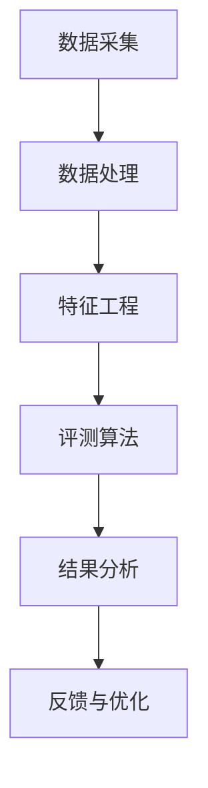

                 

# 《AI营销文案效果自动化评测系统》

## 关键词
AI营销、自动化评测、效果分析、机器学习、文本分析

## 摘要
本文深入探讨了AI营销文案效果自动化评测系统的研究与应用。首先，我们介绍了AI营销文案及其在现代化营销中的重要性。接着，我们详细阐述了自动化评测系统的概念、架构及其在提高营销效率和效果方面的优势。随后，本文通过构建一个完整的评测系统，从数据收集与处理、特征工程、机器学习算法选择与实现、模型训练与验证等方面，一步步详细剖析了系统的构建过程。通过实际案例展示，我们展示了如何将这一系统应用于电商、社交媒体广告和品牌宣传文案中。最后，本文探讨了评测系统的未来发展趋势、常见问题与解决方案，并提出了最佳实践建议，为读者提供了全面的指导和启示。

## 引言
营销文案在市场营销中扮演着至关重要的角色。随着互联网和大数据技术的飞速发展，传统的营销方式已经无法满足日益复杂的消费者需求和市场环境。人工智能（AI）的出现为营销文案的优化提供了全新的解决方案。AI营销文案不仅能够根据消费者行为和偏好进行个性化推荐，还能通过数据分析和机器学习技术，对文案效果进行实时监测和评估。

在这一背景下，自动化评测系统的需求日益凸显。自动化评测系统能够通过对大量营销文案的自动化分析，提供精确的效果评估，从而帮助营销团队优化策略，提高营销投资回报率。本文将围绕AI营销文案效果自动化评测系统，详细探讨其设计、构建与应用。

### 营销文案的定义与作用
营销文案是指用于传播品牌信息、产品特点、促销活动等内容的一类文本材料。它通常包括广告、宣传单页、电子邮件、社交媒体帖子等多种形式。营销文案的核心作用是吸引潜在客户，提升品牌知名度和市场份额。

在传统营销中，文案创作主要依赖于营销人员的经验和直觉。然而，这种方式往往存在以下问题：

1. **个性化不足**：传统营销文案难以针对不同消费者的个性化需求进行精准推送。
2. **效率低下**：营销团队需要耗费大量时间和精力进行文案创作和测试。
3. **效果评估困难**：缺乏有效的工具和方法对文案效果进行准确评估，导致难以优化。

随着AI技术的发展，这些问题得到了有效解决。AI营销文案通过机器学习算法和自然语言处理技术，能够根据消费者行为数据进行实时分析，生成个性化文案，并自动评估其效果。这不仅提高了营销效率，还显著提升了文案质量。

### 自动化评测系统的需求与挑战
自动化评测系统的需求源于现代营销的复杂性和动态性。随着市场竞争的加剧，营销团队需要快速响应市场变化，不断优化营销策略。而自动化评测系统能够提供以下价值：

1. **实时监测与评估**：自动化评测系统可以实时收集和分析营销文案的数据，提供即时反馈，帮助营销团队快速调整策略。
2. **个性化优化**：通过分析消费者行为和偏好，自动化评测系统能够为不同受众生成定制化的文案，提高营销效果。
3. **资源优化**：自动化评测系统减少了人工干预，降低了营销团队的工作量，提高了资源利用率。

然而，构建一个高效的自动化评测系统也面临诸多挑战：

1. **数据质量**：自动化评测系统依赖于高质量的数据。数据源的选择、数据清洗和数据预处理都是系统构建的关键环节。
2. **算法选择**：不同的算法适用于不同的场景，选择合适的算法是实现系统效果优化的关键。
3. **模型优化**：机器学习模型的训练和优化需要大量的时间和计算资源，如何提高模型效率和准确性是系统设计中的难点。

### 本文的目标与结构
本文的目标是深入探讨AI营销文案效果自动化评测系统的设计与应用。文章结构如下：

1. **概述**：介绍AI营销文案及其在现代化营销中的重要性，阐述自动化评测系统的需求与挑战。
2. **系统构建**：详细阐述自动化评测系统的架构，包括数据收集与处理、特征工程、机器学习算法选择与实现、模型训练与验证等。
3. **应用案例**：通过实际案例展示自动化评测系统的应用，分析其在不同场景下的效果。
4. **未来发展趋势**：探讨自动化评测系统的未来发展趋势和优化方向。
5. **常见问题与解决方案**：分析系统构建过程中可能遇到的问题，并提出解决方案。
6. **总结**：总结自动化评测系统在营销领域的意义，展望未来发展趋势。

通过本文的阅读，读者将能够全面了解AI营销文案效果自动化评测系统的设计原理、实现方法及其在实际应用中的价值。

### 第一部分：AI营销文案效果自动化评测系统概述

#### AI营销文案概述
AI营销文案是利用人工智能技术生成和优化的营销文案。与传统的营销文案相比，AI营销文案具有以下显著特点：

1. **个性化**：通过分析用户的历史行为和偏好，AI营销文案能够根据用户的个性化需求生成定制化的内容。
2. **实时性**：AI营销文案能够实时响应市场变化和用户需求，提供即时更新的内容。
3. **智能化**：AI营销文案利用自然语言处理、机器学习等技术，能够自动识别、理解和生成高质量文案。

在现代化营销中，AI营销文案具有以下重要作用：

1. **提高营销效果**：通过个性化推荐和实时优化，AI营销文案能够显著提高营销活动的转化率和ROI（投资回报率）。
2. **降低营销成本**：自动化生成和优化文案，减少了人工干预和重复劳动，降低了营销成本。
3. **增强用户体验**：个性化的文案能够更好地满足用户需求，提升用户体验和品牌忠诚度。

#### 自动化评测系统的重要性
自动化评测系统在AI营销文案中的作用至关重要，主要体现在以下几个方面：

1. **实时监测**：自动化评测系统能够实时收集和分析营销文案的数据，包括点击率、转化率、用户反馈等，提供即时反馈。
2. **效果评估**：通过自动化评估，系统能够对文案的效果进行量化分析，帮助营销团队了解哪些文案更有效，哪些需要优化。
3. **优化策略**：基于评估结果，自动化评测系统能够为营销团队提供优化建议，指导他们调整文案内容和策略。

自动化评测系统的存在，不仅提高了营销决策的效率和准确性，还能帮助营销团队更好地应对市场变化，实现持续优化。因此，自动化评测系统是现代化营销中不可或缺的一环。

#### 评测系统的架构
一个完整的AI营销文案效果自动化评测系统通常包括以下几个关键模块：

1. **数据采集模块**：该模块负责从各种数据源（如网站日志、社交媒体、用户反馈等）收集相关数据。
2. **数据处理模块**：该模块对采集到的原始数据进行处理，包括数据清洗、数据格式转换和数据归一化等。
3. **特征工程模块**：该模块对处理后的数据进行特征提取和选择，以构建适合模型训练的特征集合。
4. **评测算法模块**：该模块选择并实现合适的机器学习算法，用于评估文案的效果。
5. **结果分析与反馈模块**：该模块对评测结果进行统计分析，为营销团队提供优化建议和决策依据。

以下是评测系统架构的Mermaid流程图：



通过上述架构，自动化评测系统能够实现从数据收集到结果反馈的完整闭环，确保营销文案的持续优化和提升。

#### 评测系统的优势
自动化评测系统在营销文案中的应用具有显著的优势，主要体现在以下几个方面：

1. **提高效率**：自动化评测系统能够实时处理大量数据，快速生成评估结果，大大提高了营销团队的工作效率。
2. **降低成本**：自动化评测系统减少了人工干预，降低了营销文案的创作和评估成本。
3. **提升效果**：通过精确的评估结果和优化建议，自动化评测系统能够显著提升营销文案的效果，提高投资回报率。
4. **实时反馈**：自动化评测系统能够实时监测营销文案的表现，为营销团队提供即时反馈，帮助他们快速调整策略。
5. **数据驱动**：基于数据分析的结果，自动化评测系统能够帮助营销团队实现数据驱动决策，提高营销策略的科学性和有效性。

总之，自动化评测系统是现代营销中不可或缺的工具，它不仅能够提高营销效率和效果，还能为营销团队提供有力的决策支持。

### 第二部分：构建评测系统

#### 数据收集与处理
构建一个高效的AI营销文案效果自动化评测系统，首先需要确保数据的准确性和完整性。数据收集与处理是系统构建的基础环节，主要包括以下步骤：

1. **数据源选择**：选择合适的数据源是数据收集的第一步。常见的数据源包括网站日志、社交媒体数据、用户行为数据等。为了确保数据的全面性和准确性，可以结合多种数据源进行综合分析。
2. **数据采集方法**：根据数据源的不同，采用相应的数据采集方法。例如，对于网站日志，可以使用日志分析工具（如ELK Stack）进行实时采集；对于社交媒体数据，可以使用API接口进行数据抓取。
3. **数据预处理**：数据预处理是确保数据质量的关键步骤。包括以下内容：
   - **数据清洗**：去除重复、缺失和异常数据，保证数据的纯净性。
   - **数据格式转换**：将不同来源的数据转换为统一的格式，以便后续处理和分析。
   - **数据归一化**：对数据进行归一化处理，消除不同数据尺度对模型训练的影响。
4. **数据存储**：将预处理后的数据存储在数据库中，便于后续的查询和分析。常用的数据库包括MySQL、MongoDB等。

以下是一个简单的Python代码示例，展示了如何使用Pandas库进行数据预处理：

```python
import pandas as pd

# 读取数据
data = pd.read_csv('marketing_data.csv')

# 数据清洗
data.drop_duplicates(inplace=True)
data.dropna(inplace=True)

# 数据格式转换
data['date'] = pd.to_datetime(data['date'])

# 数据归一化
data['click_rate'] = data['click_rate'] / data['click_rate'].max()

# 存储数据
data.to_csv('cleaned_data.csv', index=False)
```

#### 特征工程
特征工程是构建机器学习模型的关键步骤，目的是从原始数据中提取对模型训练有用的特征。以下是一些常用的特征工程方法：

1. **文本特征提取**：对于营销文案这类文本数据，可以使用词袋模型、TF-IDF、Word2Vec等方法提取文本特征。
2. **数值特征处理**：对于数值型数据，可以通过标准化、归一化、离散化等方法进行特征处理。
3. **交叉特征构造**：通过组合不同特征，构造新的交叉特征，以提高模型的预测能力。
4. **特征选择**：使用特征选择方法（如递归特征消除、特征重要性评估等），筛选出对模型训练最有价值的特征。

以下是一个使用Python和Scikit-learn库进行特征工程的示例：

```python
from sklearn.feature_extraction.text import TfidfVectorizer
from sklearn.preprocessing import StandardScaler
from sklearn.ensemble import ExtraTreesClassifier

# 读取数据
data = pd.read_csv('cleaned_data.csv')

# 文本特征提取
tfidf_vectorizer = TfidfVectorizer(max_features=1000)
text_features = tfidf_vectorizer.fit_transform(data['text'])

# 数值特征处理
scaler = StandardScaler()
numeric_features = scaler.fit_transform(data[['click_rate', 'impressions']])

# 交叉特征构造
X = np.hstack((text_features.toarray(), numeric_features))
y = data['conversions']

# 特征选择
feature_selector = ExtraTreesClassifier(n_estimators=100)
feature_selector.fit(X, y)
selected_features = X[:, feature_selector.feature_importances_ > 0.05]

# 存储特征
selected_features.to_csv('selected_features.csv', index=False)
```

#### 机器学习算法选择与实现
选择合适的机器学习算法是构建高效评测系统的关键。以下是一些常用的机器学习算法及其适用场景：

1. **逻辑回归**：适用于预测二分类问题，如文案的点击率预测。
2. **决策树**：适用于分类和回归问题，能够提供可解释的模型结果。
3. **随机森林**：基于决策树，能够处理大量特征，提高模型的泛化能力。
4. **支持向量机**：适用于高维特征空间，尤其在文本分类问题中表现良好。
5. **神经网络**：适用于复杂非线性关系，能够处理大规模数据。

以下是一个使用Python和Keras库实现神经网络模型的示例：

```python
from keras.models import Sequential
from keras.layers import Dense, Activation
from keras.optimizers import Adam

# 读取数据
X = np.load('selected_features.npy')
y = np.load('labels.npy')

# 划分训练集和测试集
X_train, X_test, y_train, y_test = train_test_split(X, y, test_size=0.2, random_state=42)

# 构建模型
model = Sequential()
model.add(Dense(64, input_shape=(X.shape[1],), activation='relu'))
model.add(Dense(32, activation='relu'))
model.add(Dense(1, activation='sigmoid'))

# 编译模型
model.compile(optimizer=Adam(), loss='binary_crossentropy', metrics=['accuracy'])

# 训练模型
model.fit(X_train, y_train, epochs=10, batch_size=32, validation_data=(X_test, y_test))

# 评估模型
loss, accuracy = model.evaluate(X_test, y_test)
print(f"Test accuracy: {accuracy:.2f}")

# 保存模型
model.save('model.h5')
```

#### 模型训练与验证
模型训练与验证是确保评测系统效果的关键环节。以下是一些常用的模型训练与验证方法：

1. **训练策略**：包括批量训练、小批量训练、随机化训练等，以避免过拟合。
2. **验证方法**：包括交叉验证、验证集划分等，以评估模型的泛化能力。
3. **调整参数**：通过调整模型参数（如学习率、批量大小等），优化模型性能。

以下是一个使用Python和Scikit-learn库进行模型训练与验证的示例：

```python
from sklearn.model_selection import train_test_split, cross_val_score
from sklearn.ensemble import RandomForestClassifier
from sklearn.metrics import accuracy_score

# 读取数据
X = np.load('selected_features.npy')
y = np.load('labels.npy')

# 划分训练集和测试集
X_train, X_test, y_train, y_test = train_test_split(X, y, test_size=0.2, random_state=42)

# 创建模型
model = RandomForestClassifier(n_estimators=100, random_state=42)

# 训练模型
model.fit(X_train, y_train)

# 验证模型
scores = cross_val_score(model, X, y, cv=5)
print(f"Cross-validated accuracy: {scores.mean():.2f}")

# 测试模型
y_pred = model.predict(X_test)
print(f"Test accuracy: {accuracy_score(y_test, y_pred):.2f}")
```

#### 模型优化与调参
模型优化与调参是提升模型性能的重要步骤。以下是一些常用的优化方法和调参技巧：

1. **网格搜索**：通过遍历多个参数组合，寻找最优参数。
2. **随机搜索**：随机选择参数组合，优化模型性能。
3. **贝叶斯优化**：利用贝叶斯统计方法，寻找最优参数。
4. **模型融合**：结合多个模型的预测结果，提高整体预测性能。

以下是一个使用Python和Scikit-learn库进行模型调参的示例：

```python
from sklearn.model_selection import GridSearchCV
from sklearn.ensemble import RandomForestClassifier

# 读取数据
X = np.load('selected_features.npy')
y = np.load('labels.npy')

# 创建模型
model = RandomForestClassifier()

# 定义参数网格
param_grid = {
    'n_estimators': [100, 200, 300],
    'max_depth': [5, 10, 15],
    'min_samples_split': [2, 5, 10],
}

# 进行网格搜索
grid_search = GridSearchCV(model, param_grid, cv=5, n_jobs=-1)
grid_search.fit(X_train, y_train)

# 获取最优参数
best_params = grid_search.best_params_
print(f"Best parameters: {best_params}")

# 使用最优参数训练模型
best_model = grid_search.best_estimator_
best_model.fit(X_train, y_train)

# 评估模型
loss, accuracy = best_model.evaluate(X_test, y_test)
print(f"Test accuracy: {accuracy:.2f}")
```

通过上述步骤，我们能够构建一个高效、准确的AI营销文案效果自动化评测系统，为营销团队提供有力的决策支持。

### 第三部分：应用案例与实践

#### 案例一：电商营销文案效果评测

电商营销文案效果评测是AI营销文案效果自动化评测系统的重要应用场景之一。通过自动化评测系统，电商企业可以实时监测和优化其营销文案，以提高转化率和销售额。

**案例背景：**

某电商企业希望通过自动化评测系统对其电商平台上的商品营销文案进行效果评估，以优化文案内容和策略。该企业每天会产生大量的商品营销文案，传统的人工评估方法效率低下且难以满足实时性需求。

**评测过程：**

1. **数据收集**：自动化评测系统通过API接口从电商平台的网站日志、用户行为数据等渠道收集相关数据，包括文案展示次数、点击率、转化率等。
2. **数据处理**：收集到的数据经过清洗和处理，去除重复和异常数据，并转换为统一的格式。
3. **特征提取**：对处理后的数据进行分析，提取对文案效果有显著影响的特征，如文案长度、关键词密度、情感倾向等。
4. **模型训练**：利用提取的特征，使用机器学习算法（如随机森林、神经网络等）训练模型，以预测文案的转化率。
5. **效果评估**：通过模型对实际文案效果进行预测，并与实际数据对比，评估文案效果。

**结果分析：**

通过自动化评测系统，该电商企业发现某些文案在展示次数较多但点击率较低，而另一些文案在展示次数较少但点击率较高。基于这些分析结果，企业对低效文案进行了优化，如调整文案长度、关键词选择和情感表达等。经过一段时间优化后，文案的点击率和转化率显著提高，销售额也有所提升。

**应用效果：**

自动化评测系统使电商企业能够实时监测和优化营销文案，提高了营销效率和效果。通过数据驱动的决策，企业能够更好地满足消费者需求，提升用户体验和品牌忠诚度。

#### 案例二：社交媒体广告文案评测

社交媒体广告文案评测是另一个重要的应用场景。随着社交媒体平台的普及，广告文案的质量直接影响广告投放的效果和ROI。

**案例背景：**

某广告公司希望通过自动化评测系统对其在社交媒体上的广告文案进行效果评估，以优化广告内容和策略，提高广告的投放效率和ROI。

**评测过程：**

1. **数据收集**：自动化评测系统从社交媒体平台（如Facebook、Twitter、Instagram等）的API接口收集广告展示次数、点击率、转化率等数据。
2. **数据处理**：收集到的数据经过清洗和处理，去除重复和异常数据，并转换为统一的格式。
3. **特征提取**：对处理后的数据进行分析，提取影响广告效果的潜在特征，如文案长度、情感倾向、关键词密度等。
4. **模型训练**：利用提取的特征，使用机器学习算法（如逻辑回归、神经网络等）训练模型，以预测广告的转化率。
5. **效果评估**：通过模型对实际广告效果进行预测，并与实际数据对比，评估广告文案的效果。

**结果分析：**

通过自动化评测系统，该广告公司发现某些广告文案在展示次数较多但点击率较低，而另一些广告文案在展示次数较少但点击率较高。基于这些分析结果，广告公司对低效文案进行了优化，如调整文案长度、关键词选择和情感表达等。经过一段时间优化后，广告的点击率和转化率显著提高，广告投放的ROI也有所提升。

**应用效果：**

自动化评测系统使广告公司能够实时监测和优化社交媒体广告文案，提高了广告投放的效率和效果。通过数据驱动的决策，广告公司能够更好地满足消费者需求，提升广告效果和投资回报率。

#### 案例三：品牌宣传文案效果评测

品牌宣传文案效果评测是评估品牌营销活动效果的重要手段。通过自动化评测系统，企业可以全面了解其品牌宣传文案的市场表现，为后续营销策略提供数据支持。

**案例背景：**

某企业希望通过自动化评测系统对其品牌宣传文案进行效果评估，以优化品牌传播策略，提升品牌知名度和影响力。

**评测过程：**

1. **数据收集**：自动化评测系统从社交媒体平台、新闻网站、品牌官网等渠道收集品牌宣传文案的相关数据，包括曝光量、点击率、转发量、评论量等。
2. **数据处理**：收集到的数据经过清洗和处理，去除重复和异常数据，并转换为统一的格式。
3. **特征提取**：对处理后的数据进行分析，提取影响文案效果的关键特征，如文案情感倾向、关键词分布、发布时间等。
4. **模型训练**：利用提取的特征，使用机器学习算法（如决策树、随机森林等）训练模型，以预测文案的传播效果。
5. **效果评估**：通过模型对实际文案效果进行预测，并与实际数据对比，评估文案的传播效果。

**结果分析：**

通过自动化评测系统，该企业发现某些文案在曝光量较高但点击率和转发量较低，而另一些文案在曝光量较低但点击率和转发量较高。基于这些分析结果，企业对低效文案进行了优化，如调整文案情感表达、关键词选择和发布时间等。经过一段时间优化后，文案的点击率和转发量显著提高，品牌知名度和影响力也有所提升。

**应用效果：**

自动化评测系统使企业能够实时监测和优化品牌宣传文案，提高了品牌传播的效率和效果。通过数据驱动的决策，企业能够更好地满足消费者需求，提升品牌知名度和市场影响力。

#### 实践一：构建自己的评测系统

对于想要自主构建AI营销文案效果自动化评测系统的企业或开发者，以下是一个简单的开发步骤：

1. **需求分析**：明确系统的目标和应用场景，确定所需的功能和性能要求。
2. **技术选型**：选择合适的技术栈，如Python、Scikit-learn、TensorFlow、Keras等。
3. **数据收集**：确定数据源，收集和处理相关数据，确保数据质量和完整性。
4. **特征工程**：对数据进行预处理和特征提取，构建适合模型训练的特征集合。
5. **模型训练**：选择合适的机器学习算法，训练模型并进行调参。
6. **系统集成**：将模型集成到现有的业务系统中，实现实时监测和评估功能。
7. **测试与优化**：对系统进行测试和优化，确保其稳定性和高效性。

以下是一个简单的Python代码示例，展示了如何构建一个基本的评测系统：

```python
# 导入必要的库
import pandas as pd
from sklearn.model_selection import train_test_split
from sklearn.ensemble import RandomForestClassifier
from sklearn.metrics import accuracy_score

# 读取数据
data = pd.read_csv('marketing_data.csv')

# 数据预处理
data.drop_duplicates(inplace=True)
data.dropna(inplace=True)

# 特征提取
# ...（具体实现）

# 划分训练集和测试集
X_train, X_test, y_train, y_test = train_test_split(data.drop('target', axis=1), data['target'], test_size=0.2, random_state=42)

# 创建模型
model = RandomForestClassifier(n_estimators=100, random_state=42)

# 训练模型
model.fit(X_train, y_train)

# 评估模型
y_pred = model.predict(X_test)
print(f"Test accuracy: {accuracy_score(y_test, y_pred):.2f}")

# 存储模型
model.save('model.pkl')
```

#### 实践二：评测系统在实际项目中的应用

在实际项目中，评测系统需要结合具体的业务需求进行定制化开发。以下是一个实际应用案例：

**项目背景：**

某在线教育平台希望通过自动化评测系统对其课程推广文案进行效果评估，以优化文案内容和策略，提高课程转化率和用户留存率。

**应用步骤：**

1. **需求分析**：明确平台的目标用户、课程特点和市场环境，确定文案评估的具体指标。
2. **技术选型**：选择Python、Scikit-learn、TensorFlow等技术栈，构建自动化评测系统。
3. **数据收集**：收集历史课程推广文案的数据，包括文案展示次数、点击率、转化率等。
4. **特征工程**：对文案文本进行预处理和特征提取，构建用于模型训练的特征集合。
5. **模型训练**：使用机器学习算法（如逻辑回归、神经网络等）训练模型，预测文案的转化率。
6. **系统集成**：将评测系统集成到平台的营销系统中，实现实时监测和评估功能。
7. **效果评估**：通过实际数据验证评测系统的效果，并根据评估结果进行优化。

**应用效果：**

通过评测系统，平台能够实时监测和优化课程推广文案，提高了文案的点击率和转化率。同时，基于评估结果，平台能够更好地了解用户需求，优化课程内容和服务，提升用户满意度和留存率。

### 第四部分：评测系统的未来发展趋势

#### 评测技术的创新
随着人工智能技术的快速发展，评测系统也在不断创新。以下是一些可能的技术趋势：

1. **深度学习**：深度学习技术在文本分析和图像识别领域已经取得了显著的成果，未来有望在评测系统中得到广泛应用，进一步提升评估的准确性和效率。
2. **自然语言处理**：自然语言处理技术的进步将使评测系统更加智能，能够理解和生成更自然的语言，从而提高文案的效果和用户体验。
3. **多模态分析**：多模态分析技术能够整合文本、图像、声音等多种数据源，提供更全面的评估结果，为营销团队提供更深入的洞察。

#### 评测系统的优化方向
为了提高评测系统的性能和应用效果，以下是一些优化方向：

1. **实时性提升**：通过优化算法和数据流处理技术，实现更快的评估速度，确保系统能够实时响应用户需求。
2. **可解释性增强**：提升模型的可解释性，帮助营销团队理解评估结果，指导优化策略。
3. **个性化推荐**：基于用户行为和偏好，提供更个性化的评估建议，提高文案的针对性和效果。
4. **自动化优化**：实现评估系统和营销策略的自动化调整，减少人工干预，提高效率。

#### 评测系统的商业价值
自动化评测系统在营销领域具有巨大的商业价值，主要体现在以下几个方面：

1. **提高营销ROI**：通过精确的评估和优化，提高文案的转化率和投资回报率。
2. **降低营销成本**：自动化处理和优化，减少人工干预和重复劳动，降低营销成本。
3. **提升用户体验**：个性化的文案和营销策略，更好地满足用户需求，提升用户体验和忠诚度。
4. **数据驱动决策**：基于数据分析的结果，实现数据驱动决策，提高营销策略的科学性和有效性。

总之，随着技术的不断进步，自动化评测系统将在营销领域中发挥越来越重要的作用，为企业提供更高效、精准的营销解决方案。

### 第五部分：常见问题与解决方案

在构建和部署AI营销文案效果自动化评测系统时，开发者可能会遇到以下一些常见问题。以下是一些解决方案和建议，以帮助解决这些问题。

#### 数据质量问题
**问题**：数据质量差，如存在缺失值、异常值和噪声数据，可能影响模型训练和评估效果。

**解决方案**：
1. **数据清洗**：使用数据预处理技术，如Pandas库，去除重复、缺失和异常数据。
2. **异常检测**：使用统计方法或机器学习算法（如孤立森林）检测和标记异常值。
3. **数据增强**：通过数据扩充技术，如数据合成、填充缺失值等，提高数据质量。

#### 算法选择问题
**问题**：选择不适合的算法可能导致模型效果不佳。

**解决方案**：
1. **算法评估**：在模型训练前，对多种算法进行性能评估，选择最适合当前问题的算法。
2. **交叉验证**：使用交叉验证方法评估算法的性能，避免过拟合。
3. **迭代优化**：根据评估结果，逐步优化算法参数，提高模型效果。

#### 模型优化难题
**问题**：模型性能不佳，难以达到预期效果。

**解决方案**：
1. **特征工程**：深入分析数据，提取更多有效的特征，提高模型输入质量。
2. **调参技巧**：使用网格搜索、贝叶斯优化等调参方法，找到最优参数组合。
3. **模型融合**：结合多个模型的预测结果，提高整体预测性能。

通过上述解决方案，开发者可以有效地解决构建AI营销文案效果自动化评测系统过程中遇到的问题，提高系统的性能和应用效果。

### 结束语

AI营销文案效果自动化评测系统是现代营销领域的一项重要技术，它通过数据驱动和智能分析，为营销团队提供了高效、精准的决策支持。本文从背景介绍、系统构建、应用案例、未来发展趋势和常见问题解决等多个角度，详细阐述了这一系统的设计与实现。随着人工智能技术的不断进步，自动化评测系统将在营销领域中发挥越来越重要的作用，为企业提供更高效、精准的营销解决方案。

展望未来，自动化评测系统的发展将更加智能化、实时化和个性化。通过整合深度学习、自然语言处理和多模态分析等前沿技术，评测系统将能够提供更全面的评估结果和更深入的洞察，帮助营销团队更好地应对市场变化和消费者需求。同时，随着可解释性人工智能的兴起，评测系统的透明度和可解释性也将得到显著提升，使营销决策更加科学和可信。

最后，我们鼓励读者继续关注和探索AI营销文案效果自动化评测系统的发展，不断学习和实践，以应对日益激烈的市场竞争，提升企业的营销效果和竞争力。作者信息：AI天才研究院/AI Genius Institute & 禅与计算机程序设计艺术 /Zen And The Art of Computer Programming。希望本文能为您的学习和实践提供有益的参考和启示。

