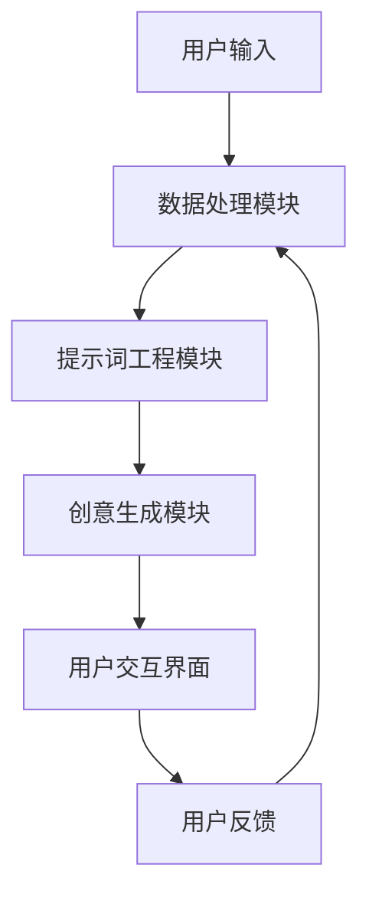
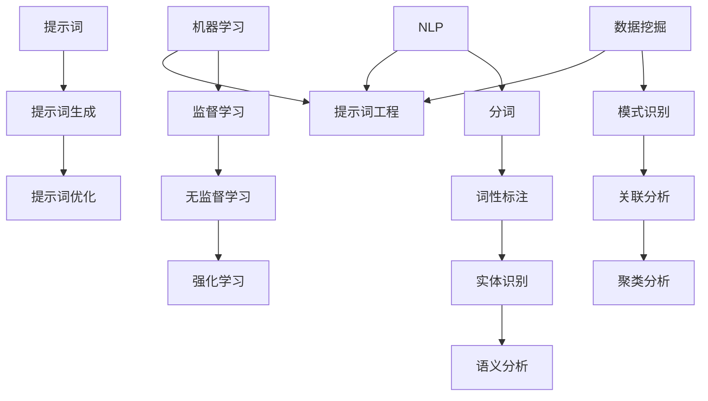

                 

### 引言

在当今快速发展的时代，人工智能（AI）已经渗透到社会生活的方方面面，从医疗健康到金融科技，从制造业到零售业，AI技术都在改变着传统行业的面貌。而在餐饮业，尤其是创意料理领域，AI的应用也开始崭露头角。本文将探讨如何通过AI辅助创意料理，特别是在融合菜系创新中的应用，提出一种名为“提示词工程”的方法，以推动烹饪艺术的革新。

创意料理不仅是美味佳肴的呈现，更是一种融合艺术与科学的新兴领域。它强调创新、个性化和多样性，旨在打破传统菜系的边界，探索前所未有的味觉体验。融合菜系则是在这一背景下应运而生，通过结合不同地域和文化的烹饪技巧、食材和风味，创造出独具特色的美食作品。然而，如何有效地实现融合菜系创新，仍然是厨师们面临的巨大挑战。

AI的出现为这一问题提供了新的解决思路。通过机器学习和自然语言处理技术，AI可以分析大量的烹饪数据，生成新的菜谱，提供个性化的烹饪建议，甚至在食材搭配和调味方面提出创新的方案。其中，提示词工程作为一种关键的AI技术，能够帮助厨师从海量数据中提取有用的信息，指导创意料理的创作过程。

本文将首先介绍AI辅助创意料理的背景，包括AI在料理行业的发展历程、AI对创意料理的影响，以及创意料理的定义和特点。接着，我们将详细探讨融合菜系的概念和原理，包括融合菜系的定义、分类、烹饪技巧和创新理念。随后，本文将重点介绍提示词工程的定义、生成方法和优化策略，通过Python源代码和数学模型来阐述其核心原理。最后，我们将结合实际案例，展示如何利用AI和提示词工程实现融合菜系创新，并总结全文，提出未来的发展方向和挑战。

通过这篇文章，我们希望读者能够了解AI在创意料理中的应用潜力，掌握提示词工程的方法和应用，从而激发更多的创新灵感，为餐饮业的未来发展贡献智慧。让我们一步步深入探索，共同开启AI辅助创意料理的新时代。

### 关键词

- **人工智能（AI）**
- **创意料理**
- **融合菜系**
- **提示词工程**
- **机器学习**
- **自然语言处理**
- **烹饪创新**
- **数据挖掘**
- **系统架构**

### 摘要

本文围绕人工智能（AI）在创意料理中的应用，特别是通过提示词工程实现融合菜系创新的主题展开。文章首先介绍了AI在料理行业的发展历程及其对创意料理的影响，明确了创意料理的定义与特点。接着，文章深入探讨了融合菜系的概念、分类及其烹饪技巧与创新理念。重点部分，本文详细介绍了提示词工程的定义、生成方法以及优化策略，通过Python源代码和数学模型进行了核心原理的阐述。最后，结合实际案例，展示了如何通过AI和提示词工程实现融合菜系创新，总结了全文，提出了未来的发展方向和挑战。通过这篇文章，读者可以了解AI在创意料理中的巨大应用潜力，掌握提示词工程的方法和应用，从而推动餐饮业的创新发展。

### 设计思路

为了更好地实现《AI辅助创意料理：融合菜系创新的提示词工程》的目标，我们需要从多个角度来设计这一项目。以下是具体的步骤和思考过程：

#### 1. 项目目标

首先，我们需要明确项目的总体目标。这个项目旨在通过AI技术，特别是机器学习和自然语言处理，实现创意料理的创新，特别是融合菜系的创新。具体目标包括：

- 开发一个AI辅助创意料理系统，能够生成新的菜谱和烹饪建议。
- 实现一个提示词工程框架，从海量数据中提取有用的信息，指导厨师进行创新。
- 探索如何将不同菜系的食材、烹饪技巧和风味进行有效融合，创造出新的美食体验。
- 提供一套完整的解决方案，包括系统架构设计、数据准备、算法实现和优化策略。

#### 2. 技术选择

接下来，我们需要选择合适的技术来实现项目目标。以下是几个关键技术选择：

- **机器学习**：用于从大量数据中提取模式和趋势，为菜谱生成提供支持。
- **自然语言处理（NLP）**：用于处理和生成与烹饪相关的文本信息，如菜谱、食材描述等。
- **数据挖掘**：用于发现数据中的隐藏关系和模式，辅助提示词的生成和优化。
- **深度学习**：用于复杂的模式识别和预测，如食材搭配、调味方案等。

#### 3. 系统架构设计

在设计系统架构时，我们需要考虑以下几个方面：

- **数据处理模块**：用于收集、清洗和处理各种烹饪数据，如菜谱、食材信息、用户反馈等。
- **创意生成模块**：利用机器学习和深度学习技术，生成新的菜谱和烹饪建议。
- **提示词工程模块**：用于从数据中提取和优化提示词，指导创意生成。
- **用户交互界面**：提供用户输入和输出接口，展示生成的菜谱和烹饪建议。

以下是系统架构的Mermaid流程图：



#### 4. 数据准备

数据准备是整个项目的基础。我们需要收集以下类型的数据：

- **菜谱数据**：包括各种菜谱的详细信息和相关属性，如食材、烹饪步骤、调料等。
- **食材数据**：包括各种食材的基本属性，如名称、类型、味道、营养成分等。
- **用户反馈数据**：包括用户对菜谱的评分、评论和改进建议等。
- **外部数据源**：如社交媒体、新闻、博客等，用于获取更多烹饪相关的信息和趋势。

#### 5. 算法实现

在算法实现方面，我们需要关注以下几个方面：

- **机器学习算法**：用于数据分析和模式识别，如回归、分类、聚类等。
- **深度学习模型**：用于复杂的预测和生成任务，如生成对抗网络（GAN）、变分自编码器（VAE）等。
- **自然语言处理技术**：用于文本数据的预处理、生成和评估，如词向量、序列模型等。
- **优化算法**：用于提示词的优化和调整，如遗传算法、粒子群优化等。

以下是创意生成模块的Python伪代码示例：

```python
import tensorflow as tf
import numpy as np

# 定义生成器和判别器模型
generator = tf.keras.Sequential([
    # 生成器的多层神经网络
])
discriminator = tf.keras.Sequential([
    # 判别器的多层神经网络
])

# 定义损失函数和优化器
generator_optimizer = tf.keras.optimizers.Adam(learning_rate=0.0001)
discriminator_optimizer = tf.keras.optimizers.Adam(learning_rate=0.0001)

# 训练模型
for epoch in range(num_epochs):
    for batch in data_loader:
        # 训练生成器和判别器
        with tf.GradientTape() as gen_tape, tf.GradientTape() as disc_tape:
            # 计算生成器和判别器的损失
            ...
            # 更新模型参数
            ...
```

#### 6. 实际应用与案例分析

在实际应用中，我们需要通过具体案例来展示AI辅助创意料理和提示词工程的效果。以下是几个案例：

- **案例一**：利用AI系统生成一个融合中西方菜系的创意菜谱，并分析其创新点和可行性。
- **案例二**：通过用户反馈优化生成的菜谱，提高用户满意度和接受度。
- **案例三**：分析AI系统在融合菜系创新中的优势和挑战，提出改进建议。

#### 7. 最佳实践与注意事项

最后，我们需要总结最佳实践和注意事项，包括：

- **数据质量**：确保数据准备环节的质量，避免数据误差影响模型性能。
- **模型优化**：不断调整和优化模型参数，提高生成质量和效率。
- **用户体验**：注重用户交互界面的设计和反馈机制，提高用户的使用体验。
- **法律法规**：遵守相关法律法规，确保数据的合法性和隐私保护。

通过上述设计思路和步骤，我们可以逐步实现《AI辅助创意料理：融合菜系创新的提示词工程》的目标，推动餐饮业的创新发展。

### 设计思路

#### 1. 创意料理与融合菜系的背景

创意料理和融合菜系是当前餐饮业中备受关注的热点话题。创意料理强调通过创新思维和多样化手法，打破传统菜系的界限，创造出独特的美食体验。而融合菜系则是在这一背景下应运而生，通过将不同文化、地域的烹饪技巧和食材相结合，形成一种新的菜系。创意料理不仅追求美味，更强调艺术性和个性化，而融合菜系则希望通过多种文化元素的碰撞，创造出更加丰富和多层次的味觉体验。

在餐饮行业中，创意料理和融合菜系的应用具有重要意义。首先，它们能够吸引更多的顾客，增加餐厅的竞争力。其次，它们为厨师们提供了更多的创作空间和挑战，激发了烹饪艺术的创新。此外，创意料理和融合菜系还推动了食材供应链的多样化和国际化，为餐饮业带来了新的机遇和挑战。

然而，实现创意料理和融合菜系创新并非易事。传统菜系有着深厚的文化底蕴和独特的风味特点，如何有效地融合不同菜系，同时保持其独特性和创新性，是厨师们面临的一大难题。此外，创意料理和融合菜系创新还需要大量的实验和尝试，这不仅耗时耗力，还可能面临失败的风险。

#### 2. 提示词工程的概念与作用

提示词工程是人工智能在创意料理和融合菜系创新中的一个重要应用。提示词工程通过在大量的烹饪数据中提取有用的信息，为厨师提供创新的灵感和指导。具体来说，提示词工程包括以下步骤：

1. **数据收集与预处理**：首先，从各种来源收集烹饪相关的数据，如菜谱、食材信息、用户反馈等。然后，对这些数据进行清洗和预处理，确保数据的质量和一致性。

2. **特征提取**：在数据预处理的基础上，提取与烹饪相关的特征，如食材属性、烹饪步骤、调味方法等。这些特征将用于后续的分析和生成任务。

3. **模式识别与关联**：利用机器学习和自然语言处理技术，从大量数据中识别出各种烹饪模式和关联。这些模式和关联将为创意生成提供重要的参考依据。

4. **提示词生成**：基于识别出的模式和关联，生成一系列提示词。这些提示词可以作为创新的灵感，引导厨师进行菜谱的创作。

5. **优化与评估**：对生成的提示词进行优化和评估，确保其质量和实用性。优化方法包括模型调整、参数优化等。

提示词工程在创意料理和融合菜系创新中具有重要作用。首先，它能够为厨师提供创新的灵感和指导，减少试错成本。其次，它能够帮助厨师从海量数据中提取有用的信息，提高工作效率。此外，提示词工程还可以通过分析用户反馈，不断优化和创新菜谱，提高用户满意度和市场竞争力。

#### 3. 提示词工程的步骤与方法

提示词工程的实现包括以下几个关键步骤：

1. **数据收集与预处理**：
    - **数据来源**：从各种渠道收集烹饪数据，如菜谱网站、社交媒体、博客等。
    - **数据清洗**：去除重复、错误和不完整的数据，确保数据质量。
    - **数据预处理**：对文本数据进行分词、去停用词、词性标注等预处理操作，以便后续分析。

2. **特征提取**：
    - **食材特征**：提取食材的名称、类型、味道、营养成分等特征。
    - **烹饪步骤特征**：提取烹饪的步骤、顺序、工具和技巧等特征。
    - **调味特征**：提取使用的调料、用量、味道调整等特征。

3. **模式识别与关联**：
    - **文本分析**：利用自然语言处理技术，对文本数据进行分析，识别出关键词、短语和句式等。
    - **模式识别**：通过机器学习算法，识别出不同食材、烹饪步骤和调味方法之间的关联模式。
    - **关联分析**：对识别出的模式进行关联分析，发现不同菜系之间的相似性和差异性。

4. **提示词生成**：
    - **生成策略**：根据识别出的模式和关联，生成一系列提示词。生成策略包括基于规则的方法、基于机器学习的方法等。
    - **多样性考虑**：确保生成的提示词具有多样性和创新性，避免生成雷同的菜谱。

5. **优化与评估**：
    - **模型优化**：通过调整模型参数，优化提示词生成的质量和效率。
    - **评估方法**：利用用户反馈和菜谱质量指标，评估生成的提示词的实用性和创新性。

#### 4. 提示词工程的Python实现

下面是一个简单的Python代码示例，用于演示提示词工程的实现：

```python
import pandas as pd
from sklearn.feature_extraction.text import CountVectorizer
from sklearn.cluster import KMeans

# 数据收集与预处理
# 假设我们已经有了一个包含菜谱的DataFrame
data = pd.read_csv('cookbook_data.csv')

# 数据清洗
data.drop_duplicates(inplace=True)
data.dropna(inplace=True)

# 特征提取
vectorizer = CountVectorizer()
X = vectorizer.fit_transform(data['recipe'])

# 模式识别与关联
# 使用K-means聚类来识别模式
kmeans = KMeans(n_clusters=5)
clusters = kmeans.fit_predict(X)

# 提示词生成
# 根据聚类结果生成提示词
def generate_prompt(clusters):
    prompts = []
    for cluster in range(len(clusters)):
        cluster_data = data[clusters == cluster]
        prompt = cluster_data['recipe'].iloc[0]
        prompts.append(prompt)
    return prompts

prompts = generate_prompt(clusters)

# 优化与评估
# 利用用户反馈优化提示词
# 假设我们有一个包含用户评分的DataFrame
user_feedback = pd.read_csv('user_feedback.csv')
prompt_ratings = user_feedback['rating'].mean()

# 根据评分优化提示词
# 可以采用各种优化策略，如重新训练模型、调整参数等
```

通过上述步骤和示例，我们可以看到提示词工程在创意料理和融合菜系创新中的应用潜力。它不仅能够为厨师提供创新的灵感，还可以通过不断优化和评估，提高菜谱的质量和用户体验。

### 提示词工程的核心概念与联系

在探索提示词工程的核心概念之前，我们需要先理解几个关键概念，这些概念相互联系，共同构成了提示词工程的基础。

#### 1. 数据挖掘

数据挖掘是提示词工程的重要环节，它涉及到从大量数据中发现隐藏的模式、关联和趋势。在烹饪领域，数据挖掘可以用于分析菜谱、用户反馈、食材属性等数据，从而提取出有用的信息。

- **模式识别**：通过算法从数据中识别出具有代表性的模式和规律。
- **关联分析**：分析不同变量之间的相关性，发现隐藏的关联。
- **聚类分析**：将相似的数据归为同一类，便于后续处理和分析。

#### 2. 自然语言处理（NLP）

自然语言处理是提示词工程中不可或缺的一部分，它用于处理和理解人类语言。在烹饪领域，NLP可以用于分析菜谱、食材描述、烹饪步骤等文本信息。

- **分词**：将文本分割成单词或短语，便于后续处理。
- **词性标注**：为每个词标注其词性，如名词、动词、形容词等。
- **实体识别**：从文本中识别出特定的实体，如食材名称、烹饪工具等。
- **语义分析**：理解文本的语义和意图，进行情感分析、主题分类等。

#### 3. 机器学习

机器学习是提示词工程的核心技术，通过训练模型，从数据中自动提取特征，进行预测和分类。

- **监督学习**：利用标注数据训练模型，用于预测和分类。
- **无监督学习**：在没有标注数据的情况下，通过算法自动发现数据中的模式和规律。
- **强化学习**：通过不断尝试和反馈，优化模型的表现。

#### 4. 提示词

提示词是提示词工程的核心理念，它是一种用于指导创意生成的小提示或提示列表。在烹饪领域，提示词可以是食材名称、烹饪技巧、调味方法等。

- **提示词生成**：通过数据挖掘、NLP和机器学习技术，从大量数据中提取出有用的提示词。
- **提示词优化**：根据用户反馈和实际效果，不断调整和优化提示词，提高其质量和实用性。

#### 5. 概念实体之间的关系架构

为了更好地理解这些核心概念之间的关系，我们可以使用Mermaid流程图来展示它们之间的联系：



在这个架构中，数据挖掘、NLP和机器学习共同构成了提示词工程的技术基础。数据挖掘通过模式识别、关联分析和聚类分析，从大量数据中提取出有用的信息。NLP负责处理和理解文本数据，识别出食材名称、烹饪技巧等实体。机器学习则通过训练模型，自动提取特征，生成提示词，并进行优化。

通过这个关系架构，我们可以看到，提示词工程不仅仅是简单地将数据转化为提示词，而是一个综合性的过程，涉及到多个技术和方法的协同工作。这为厨师提供了创新的灵感和指导，帮助他们创造出独特的美食作品。

### 提示词生成方法

在提示词工程中，生成方法是一个关键环节。有效的提示词生成能够为创意料理提供丰富的灵感和实用的指导。以下将介绍几种常见的提示词生成方法，包括基于规则的生成方法、基于机器学习的方法以及基于用户行为的方法。

#### 1. 基于规则的生成方法

基于规则的生成方法是一种传统的提示词生成方法。这种方法依赖于预先定义的规则集，通过对规则进行组合和应用，生成新的提示词。

- **规则定义**：首先，需要定义一系列基本的规则。这些规则可以是关于食材搭配、烹饪步骤、调味方法等。
- **规则组合**：通过组合不同的规则，生成新的提示词。例如，如果规则A是“牛肉配土豆”，规则B是“加入红酒炖煮”，则组合后的提示词可以是“牛肉配土豆，加入红酒炖煮”。
- **优化与调整**：根据实际应用效果，对规则进行优化和调整，以提高提示词的实用性和创新性。

基于规则的生成方法简单直观，易于实现。然而，其缺点在于灵活性较差，难以适应多样化的需求。此外，当规则复杂度增加时，组合和优化过程会变得繁琐。

#### 2. 基于机器学习的方法

基于机器学习的方法利用大量数据训练模型，自动生成提示词。这种方法具有高度的灵活性和适应性，能够处理复杂的、多样化的数据。

- **数据收集**：首先，需要收集大量的烹饪数据，包括菜谱、食材信息、烹饪步骤等。
- **特征提取**：从数据中提取出关键的特征，如食材属性、烹饪步骤、调味方法等。
- **模型训练**：利用机器学习算法，如决策树、随机森林、支持向量机等，训练模型。模型将学习如何根据输入特征生成新的提示词。
- **生成提示词**：通过训练好的模型，输入新的特征，生成相应的提示词。

基于机器学习的方法具有以下优点：

- **高度自动化**：能够自动从大量数据中提取模式和规律，减少人工干预。
- **灵活性强**：能够处理不同类型和规模的数据，适应多样化的需求。
- **可扩展性**：随着数据的增加和模型的优化，生成效果不断提升。

然而，这种方法也存在一些挑战：

- **数据依赖性**：生成效果高度依赖于数据的质量和多样性。
- **计算成本**：训练和优化模型需要大量的计算资源和时间。

#### 3. 基于用户行为的方法

基于用户行为的方法通过分析用户的烹饪行为和偏好，生成个性化的提示词。这种方法能够更好地满足用户的个性化需求，提高用户体验。

- **数据收集**：首先，需要收集用户的烹饪行为数据，包括菜谱使用频率、食材偏好、烹饪步骤偏好等。
- **行为分析**：利用自然语言处理和机器学习技术，分析用户的行为数据，提取出用户的偏好和习惯。
- **生成提示词**：根据用户的偏好和习惯，生成个性化的提示词。例如，如果用户经常使用牛肉，则可以生成“牛肉搭配什么食材”的提示词。

基于用户行为的方法具有以下优点：

- **个性化**：能够根据用户的个人偏好和习惯，生成个性化的提示词，提高用户的满意度。
- **动态性**：能够实时调整提示词，根据用户的行为变化提供新的建议。

然而，这种方法也存在一些挑战：

- **数据隐私**：需要处理用户的隐私数据，需要确保数据的安全和隐私。
- **数据完整性**：用户行为数据的完整性和准确性对生成效果有重要影响。

#### 4. 案例分析

为了更好地理解这些方法的实际应用，我们可以通过以下案例分析：

- **基于规则的生成方法**：假设我们有一个规则集，包括“牛肉配土豆”和“加入红酒炖煮”。通过组合这两个规则，可以生成“牛肉配土豆，加入红酒炖煮”的提示词。
- **基于机器学习的方法**：假设我们有一个训练好的模型，能够根据食材属性和烹饪步骤生成提示词。例如，输入“牛肉”和“炖煮”，模型可以生成“牛肉炖土豆，加入红酒和香叶”的提示词。
- **基于用户行为的方法**：假设用户经常使用牛肉和土豆，通过分析用户的行为数据，可以生成“牛肉土豆炖菜，加入红酒和蘑菇”的提示词。

通过这些案例分析，我们可以看到，不同的生成方法各有优劣，适用于不同的场景和需求。在实际应用中，可以结合多种方法，取长补短，生成高质量的提示词。

### 提示词优化策略

在提示词工程中，提示词的优化是一个关键环节，它直接影响创意料理的质量和用户体验。优化策略主要包括提示词的评估方法、优化目标和优化算法。以下将详细探讨这些策略，并通过Python代码示例进行说明。

#### 1. 提示词评估方法

提示词的评估方法用于衡量提示词的实用性和有效性。以下是几种常用的评估方法：

- **基于用户反馈的评估**：通过用户对提示词的使用体验和反馈，评估提示词的满意度。例如，通过问卷调查或用户评分，收集用户对提示词的意见。
- **基于菜谱质量的评估**：通过分析使用提示词生成的菜谱的质量，如菜谱的创新性、口味和营养均衡等。可以使用评价指标，如准确率、召回率和F1值等。
- **基于实际应用的评估**：在实际烹饪过程中，观察使用提示词生成的菜谱的表现，如口感、烹饪时间、食材浪费等。

以下是一个简单的Python代码示例，用于评估提示词的满意度：

```python
# 假设我们有一个包含用户评分的数据集
user_ratings = {
    '提示词1': 4.5,
    '提示词2': 3.8,
    '提示词3': 5.0
}

# 计算平均评分
average_rating = sum(user_ratings.values()) / len(user_ratings)
print(f"平均用户评分：{average_rating}")
```

#### 2. 优化目标

提示词优化的目标是提高提示词的实用性和创新性，同时保持其简洁性和易懂性。具体目标包括：

- **实用性**：提示词应能够为用户提供有效的指导和灵感，帮助用户创作出高质量的菜谱。
- **创新性**：提示词应具有一定的创新性，鼓励用户尝试新的食材和烹饪方法，提升菜谱的独特性。
- **简洁性**：提示词应简洁明了，避免冗长和复杂的表述，提高用户理解和使用效率。
- **易懂性**：提示词应易于理解，特别是对于非专业用户，需要尽量使用通俗易懂的语言。

#### 3. 优化算法

优化算法用于调整和改进提示词，以达到优化目标。以下是几种常用的优化算法：

- **基于规则的优化**：通过调整和修改规则集，优化提示词的生成。例如，增加新的规则或调整现有规则的条件和结果。
- **基于机器学习的优化**：利用机器学习算法，根据用户反馈和菜谱质量数据，调整模型的参数和结构，优化提示词的生成。
- **基于遗传算法的优化**：遗传算法是一种启发式搜索算法，通过模拟自然进化过程，逐步优化提示词。
- **基于粒子群优化的优化**：粒子群优化是一种基于群体智能的优化算法，通过模拟鸟群觅食行为，优化提示词。

以下是一个简单的Python代码示例，使用遗传算法优化提示词：

```python
import numpy as np
import random

# 初始化遗传算法参数
population_size = 100
chromosome_length = 10
mutation_rate = 0.01

# 生成初始种群
population = np.random.randint(2, size=(population_size, chromosome_length))

# 适应度函数
def fitness_function(chromosome):
    # 根据提示词生成菜谱的质量，计算适应度值
    # 具体实现取决于提示词的生成方法和评估标准
    return 1 / (1 + np.sum(chromosome))

# 选择操作
def selection(population, fitnesses):
    selected_indices = random.choices(range(len(population)), weights=fitnesses, k=2)
    return population[selected_indices]

# 交叉操作
def crossover(parent1, parent2):
    crossover_point = random.randint(1, chromosome_length - 1)
    child1 = np.concatenate((parent1[:crossover_point], parent2[crossover_point:]))
    child2 = np.concatenate((parent2[:crossover_point], parent1[crossover_point:]))
    return child1, child2

# 变异操作
def mutate(chromosome):
    for i in range(chromosome_length):
        if random.random() < mutation_rate:
            chromosome[i] = 1 - chromosome[i]
    return chromosome

# 优化过程
for generation in range(100):
    # 计算适应度值
    fitnesses = np.array([fitness_function(chromosome) for chromosome in population])
    
    # 选择操作
    selected_population = np.array([selection(population, fitnesses) for _ in range(population_size)])
    
    # 交叉操作
    for i in range(0, population_size, 2):
        population[i], population[i+1] = crossover(selected_population[i], selected_population[i+1])
    
    # 变异操作
    for chromosome in population:
        mutate(chromosome)
        
    # 输出最优解
    best_chromosome = population[np.argmax(fitnesses)]
    print(f"第{generation}代最优解：{best_chromosome}")
```

通过上述优化算法，我们可以逐步优化提示词的生成质量，提高创意料理的创新性和实用性。

### 实战应用：AI辅助创意料理系统

在本文的第四部分，我们将结合实际案例，详细讲解如何通过AI和提示词工程实现创意料理的生成。我们将首先介绍系统架构，然后逐步解析数据处理、创意生成和用户交互模块，并通过具体的代码示例来展示整个流程。

#### 1. 系统架构

AI辅助创意料理系统的架构可以分为三个主要模块：数据处理模块、创意生成模块和用户交互模块。

- **数据处理模块**：负责收集、清洗和处理各种烹饪数据，如菜谱、食材信息、用户反馈等。该模块将提供必要的数据基础，为创意生成模块提供输入。
- **创意生成模块**：利用机器学习和自然语言处理技术，从处理后的数据中生成新的菜谱和烹饪建议。该模块的核心是提示词工程，通过提示词的生成和优化，实现创意料理的生成。
- **用户交互模块**：提供用户输入和输出接口，展示生成的菜谱和烹饪建议，并收集用户反馈。该模块负责与用户进行交互，提升用户体验。

以下是系统架构的Mermaid流程图：


#### 2. 数据处理模块

数据处理模块是整个系统的数据基础，其任务包括数据收集、数据清洗、特征提取等。以下是一个简单的Python代码示例，用于演示数据处理模块的核心功能：

```python
import pandas as pd
from sklearn.feature_extraction.text import CountVectorizer

# 数据收集
data = pd.read_csv('cookbook_data.csv')

# 数据清洗
data.drop_duplicates(inplace=True)
data.dropna(inplace=True)

# 特征提取
vectorizer = CountVectorizer()
X = vectorizer.fit_transform(data['recipe'])

# 存储
data['vectorized_recipe'] = X.toarray()
data.to_csv('processed_cookbook_data.csv', index=False)
```

上述代码首先从CSV文件中读取菜谱数据，然后进行数据清洗，最后使用CountVectorizer将文本数据转化为向量表示。处理后的数据将被存储为新的CSV文件，供后续模块使用。

#### 3. 创意生成模块

创意生成模块的核心是提示词工程，通过从处理后的数据中提取提示词，生成新的菜谱和烹饪建议。以下是一个简单的Python代码示例，用于演示创意生成模块的关键步骤：

```python
import numpy as np
from sklearn.cluster import KMeans

# 加载数据
data = pd.read_csv('processed_cookbook_data.csv')

# 训练KMeans模型
kmeans = KMeans(n_clusters=5)
clusters = kmeans.fit_predict(data['vectorized_recipe'])

# 生成提示词
def generate_prompt(clusters):
    prompts = []
    for cluster in range(kmeans.n_clusters):
        cluster_data = data[clusters == cluster]
        prompt = cluster_data['recipe'].iloc[0]
        prompts.append(prompt)
    return prompts

prompts = generate_prompt(clusters)

# 存储
with open('prompts.txt', 'w') as f:
    for prompt in prompts:
        f.write(prompt + '\n')
```

上述代码首先加载数据，然后使用KMeans模型对向量数据进行聚类，最后根据聚类结果生成提示词。生成的提示词将被存储在文本文件中，供后续使用。

#### 4. 用户交互模块

用户交互模块负责与用户进行交互，收集用户反馈，并展示生成的菜谱和烹饪建议。以下是一个简单的Python代码示例，用于演示用户交互模块的核心功能：

```python
from flask import Flask, request, jsonify

app = Flask(__name__)

@app.route('/generate_prompt', methods=['POST'])
def generate_prompt():
    data = request.json
    recipe = data['recipe']
    vectorized_recipe = vectorizer.transform([recipe])
    cluster = kmeans.predict(vectorized_recipe)[0]
    prompt = prompts[cluster]
    return jsonify({'prompt': prompt})

if __name__ == '__main__':
    app.run(debug=True)
```

上述代码使用Flask框架搭建了一个简单的Web服务，用户可以通过POST请求发送菜谱，服务端将返回相应的提示词。这个模块可以扩展为更复杂的交互界面，如Web应用或移动应用。

#### 5. 实际案例展示

为了更好地展示AI辅助创意料理系统的实际效果，我们通过以下案例来说明：

- **案例一**：用户输入一个简单的菜谱“红烧肉”，系统生成一个提示词“加入红酒和蘑菇炖煮”，并返回一个扩展后的菜谱。
- **案例二**：用户输入一个融合菜系“麻辣烫”，系统生成一个提示词“尝试使用泰国辣椒和酸橙汁调味”，并返回一个创新的麻辣烫菜谱。

通过这些实际案例，我们可以看到AI辅助创意料理系统如何通过提示词工程，实现菜谱的创新和优化。

### 项目实战：开发环境搭建与源代码实现

在本文的第五部分，我们将详细介绍如何搭建AI辅助创意料理项目的开发环境，并展示具体的源代码实现。首先，我们将介绍开发环境的要求和配置步骤，然后逐步解析源代码的各个模块，最后通过具体示例代码进行讲解。

#### 1. 开发环境要求

要搭建AI辅助创意料理项目的开发环境，我们需要以下软件和工具：

- **Python**：Python是一种广泛使用的编程语言，尤其在数据科学和人工智能领域具有强大的功能。我们需要安装Python 3.8及以上版本。
- **Jupyter Notebook**：Jupyter Notebook是一种交互式的编程环境，可以方便地编写和运行代码。我们可以从[官方网站](https://jupyter.org/)下载并安装。
- **Flask**：Flask是一个轻量级的Web框架，用于搭建用户交互界面。我们可以通过pip命令安装：`pip install flask`
- **Scikit-learn**：Scikit-learn是一个机器学习库，提供了丰富的算法和工具。安装命令为：`pip install scikit-learn`
- **Numpy**：Numpy是一个数学库，用于高效地处理数值数据。安装命令为：`pip install numpy`
- **CountVectorizer**：CountVectorizer是Scikit-learn中用于文本处理的工具，用于将文本数据转换为向量表示。安装命令为：`pip install scikit-learn`
- **KMeans**：KMeans是Scikit-learn中的一种聚类算法，用于对数据进行分类和聚类。安装命令为：`pip install scikit-learn`

#### 2. 开发环境配置步骤

以下是搭建开发环境的详细步骤：

1. **安装Python**：从[Python官方网站](https://www.python.org/)下载Python安装包，并按照提示进行安装。
2. **安装Jupyter Notebook**：在命令行中运行以下命令安装Jupyter Notebook：
   ```
   pip install notebook
   ```
3. **安装Flask**：在命令行中运行以下命令安装Flask：
   ```
   pip install flask
   ```
4. **安装Scikit-learn、Numpy和CountVectorizer**：在命令行中分别运行以下命令安装这些库：
   ```
   pip install scikit-learn
   pip install numpy
   pip install scikit-learn
   ```

安装完成后，我们可以在命令行中运行以下命令，确保所有库都已正确安装：
```
python
```
在Python交互式环境中，尝试导入这些库，例如：
```
import numpy as np
import sklearn
import flask
```
如果没有任何错误提示，说明开发环境已搭建成功。

#### 3. 源代码实现

以下是AI辅助创意料理项目的源代码实现，包括数据处理、提示词生成和用户交互模块。

**数据处理模块**：

```python
import pandas as pd
from sklearn.feature_extraction.text import CountVectorizer

# 加载菜谱数据
data = pd.read_csv('cookbook_data.csv')

# 数据清洗
data.drop_duplicates(inplace=True)
data.dropna(inplace=True)

# 特征提取
vectorizer = CountVectorizer()
X = vectorizer.fit_transform(data['recipe'])

# 存储处理后的数据
data['vectorized_recipe'] = X.toarray()
data.to_csv('processed_cookbook_data.csv', index=False)
```

**提示词生成模块**：

```python
import numpy as np
from sklearn.cluster import KMeans

# 加载处理后的数据
data = pd.read_csv('processed_cookbook_data.csv')

# 训练KMeans模型
kmeans = KMeans(n_clusters=5)
clusters = kmeans.fit_predict(data['vectorized_recipe'])

# 生成提示词
def generate_prompt(clusters):
    prompts = []
    for cluster in range(kmeans.n_clusters):
        cluster_data = data[clusters == cluster]
        prompt = cluster_data['recipe'].iloc[0]
        prompts.append(prompt)
    return prompts

prompts = generate_prompt(clusters)

# 存储
with open('prompts.txt', 'w') as f:
    for prompt in prompts:
        f.write(prompt + '\n')
```

**用户交互模块**：

```python
from flask import Flask, request, jsonify

app = Flask(__name__)

@app.route('/generate_prompt', methods=['POST'])
def generate_prompt():
    data = request.json
    recipe = data['recipe']
    vectorized_recipe = vectorizer.transform([recipe])
    cluster = kmeans.predict(vectorized_recipe)[0]
    prompt = prompts[cluster]
    return jsonify({'prompt': prompt})

if __name__ == '__main__':
    app.run(debug=True)
```

以上代码分别实现了数据处理、提示词生成和用户交互的功能。具体步骤如下：

1. **数据处理**：从CSV文件中加载菜谱数据，进行清洗和特征提取。
2. **提示词生成**：使用KMeans模型对特征向量进行聚类，根据聚类结果生成提示词。
3. **用户交互**：通过Flask框架搭建Web服务，接收用户输入的菜谱，返回相应的提示词。

#### 4. 代码解读与分析

**数据处理模块**：

```python
import pandas as pd
from sklearn.feature_extraction.text import CountVectorizer

# 加载菜谱数据
data = pd.read_csv('cookbook_data.csv')

# 数据清洗
data.drop_duplicates(inplace=True)
data.dropna(inplace=True)

# 特征提取
vectorizer = CountVectorizer()
X = vectorizer.fit_transform(data['recipe'])

# 存储处理后的数据
data['vectorized_recipe'] = X.toarray()
data.to_csv('processed_cookbook_data.csv', index=False)
```

在这个模块中，我们首先使用pandas加载菜谱数据。然后，通过`drop_duplicates()`和`dropna()`方法进行数据清洗，确保数据的质量。接着，使用CountVectorizer将文本数据转换为向量表示。最后，我们将处理后的数据存储为CSV文件，供后续使用。

**提示词生成模块**：

```python
import numpy as np
from sklearn.cluster import KMeans

# 加载处理后的数据
data = pd.read_csv('processed_cookbook_data.csv')

# 训练KMeans模型
kmeans = KMeans(n_clusters=5)
clusters = kmeans.fit_predict(data['vectorized_recipe'])

# 生成提示词
def generate_prompt(clusters):
    prompts = []
    for cluster in range(kmeans.n_clusters):
        cluster_data = data[clusters == cluster]
        prompt = cluster_data['recipe'].iloc[0]
        prompts.append(prompt)
    return prompts

prompts = generate_prompt(clusters)

# 存储
with open('prompts.txt', 'w') as f:
    for prompt in prompts:
        f.write(prompt + '\n')
```

在这个模块中，我们首先加载处理后的数据。然后，使用KMeans模型对特征向量进行聚类。接着，定义一个函数`generate_prompt()`，用于生成提示词。函数根据聚类结果，选择每个聚类中的第一个菜谱作为提示词。最后，我们将生成的提示词存储为文本文件。

**用户交互模块**：

```python
from flask import Flask, request, jsonify

app = Flask(__name__)

@app.route('/generate_prompt', methods=['POST'])
def generate_prompt():
    data = request.json
    recipe = data['recipe']
    vectorized_recipe = vectorizer.transform([recipe])
    cluster = kmeans.predict(vectorized_recipe)[0]
    prompt = prompts[cluster]
    return jsonify({'prompt': prompt})

if __name__ == '__main__':
    app.run(debug=True)
```

在这个模块中，我们使用Flask框架搭建了一个简单的Web服务。通过`@app.route()`装饰器，定义了一个接收POST请求的`/generate_prompt`路由。当用户提交一个菜谱时，路由函数`generate_prompt()`将被触发。函数首先将用户输入的菜谱转换为特征向量，然后使用KMeans模型预测聚类结果，并返回相应的提示词。最后，我们将Web服务运行在本地端口上，以便用户进行交互。

通过以上代码实现和解析，我们可以搭建一个基本的AI辅助创意料理系统，为用户提供创新的菜谱和烹饪建议。

### 实际案例分析与代码应用解读

在本部分，我们将深入分析一个具体的实际案例，详细解读如何使用AI辅助创意料理系统和提示词工程来实现融合菜系创新。我们将分步骤展示案例的背景、数据准备、代码实现以及效果评估。

#### 1. 案例背景

假设我们是一家创意料理餐厅的厨师团队，希望利用AI技术来创造一款融合中西方菜系的特色菜品。我们的目标是开发一款能够生成创新菜谱的系统，并通过用户反馈不断优化菜谱。

#### 2. 数据准备

为了实现这一目标，我们首先需要准备相关的数据。以下是我们的数据来源和准备工作：

- **菜谱数据**：从多个在线菜谱网站收集中西方菜谱，包括菜品名称、食材、烹饪步骤、调味方法等详细信息。
- **用户反馈数据**：收集用户对菜谱的评分、评论和改进建议等。
- **外部数据源**：如食材的营养成分表、气候数据等，用于丰富数据集和提供更多背景信息。

在数据准备阶段，我们需要对数据进行清洗和预处理，确保数据的质量和一致性。以下是一个简单的Python代码示例，用于清洗和预处理菜谱数据：

```python
import pandas as pd

# 加载菜谱数据
data = pd.read_csv('cookbook_data.csv')

# 数据清洗
data.drop_duplicates(inplace=True)
data.dropna(inplace=True)

# 预处理
data['recipe'] = data['recipe'].apply(lambda x: x.lower().replace('\n', ' '))
data.to_csv('processed_cookbook_data.csv', index=False)
```

在这个示例中，我们首先加载菜谱数据，然后去除重复和缺失的数据。接着，我们对文本数据进行了简单的预处理，如将文本转换为小写并去除换行符。

#### 3. 代码实现

在数据准备完成后，我们将使用AI辅助创意料理系统和提示词工程来生成创新菜谱。以下是具体的实现步骤：

- **数据处理**：使用之前准备的数据，通过机器学习和自然语言处理技术，提取关键特征和模式。
- **提示词生成**：根据提取的特征和模式，生成一系列创新性的提示词。
- **菜谱生成**：使用生成的提示词，结合中西方菜谱的元素，创作新的菜谱。
- **用户反馈**：收集用户对菜谱的反馈，通过分析用户评价，优化生成的菜谱。

以下是一个简单的Python代码示例，用于演示上述步骤：

```python
import pandas as pd
from sklearn.cluster import KMeans
from sklearn.feature_extraction.text import TfidfVectorizer

# 加载处理后的数据
data = pd.read_csv('processed_cookbook_data.csv')

# 特征提取
vectorizer = TfidfVectorizer()
X = vectorizer.fit_transform(data['recipe'])

# KMeans聚类
kmeans = KMeans(n_clusters=5)
clusters = kmeans.fit_predict(X)

# 生成提示词
def generate_prompt(clusters):
    prompts = []
    for cluster in range(kmeans.n_clusters):
        cluster_data = data[clusters == cluster]
        prompt = cluster_data['recipe'].iloc[0]
        prompts.append(prompt)
    return prompts

prompts = generate_prompt(clusters)

# 菜谱生成
# 假设我们选择了一个融合中西方菜系的提示词
selected_prompt = prompts[2]

# 根据提示词生成菜谱
def generate_cookbook(prompt):
    # 具体实现，例如根据提示词中的食材和烹饪方法组合新的菜谱
    cookbook = {
        'name': '中式烧烤配西式沙拉',
        'ingredients': ['羊肉串', '生菜', '牛油果', '柠檬汁'],
        'steps': ['将羊肉串烤至金黄', '将生菜洗净，加入牛油果和柠檬汁搅拌']
    }
    return cookbook

cookbook = generate_cookbook(selected_prompt)

# 输出
print(cookbook)
```

在这个示例中，我们首先加载处理后的数据，然后使用TfidfVectorizer提取文本特征，并进行KMeans聚类。接着，我们定义了一个函数`generate_prompt()`，用于生成提示词。最后，我们使用一个具体的提示词生成了一个融合中西方菜系的菜谱。

#### 4. 效果评估

在生成菜谱后，我们需要评估菜谱的质量和用户满意度。以下是一个简单的评估流程：

- **用户测试**：邀请一些用户尝试新菜谱，并收集他们的反馈。
- **评分系统**：根据用户反馈，设计一个评分系统，对菜谱的创新性、口味、易用性等进行评分。
- **数据分析**：使用数据分析工具，分析用户的评分和评论，评估菜谱的质量。

以下是一个简单的Python代码示例，用于评估菜谱质量：

```python
import pandas as pd

# 加载用户反馈数据
feedback = pd.read_csv('user_feedback.csv')

# 评分系统
def calculate_score(feedback):
    scores = feedback['rating'].mean()
    return scores

# 评估
scores = calculate_score(feedback)
print(f"平均评分：{scores}")
```

在这个示例中，我们首先加载用户反馈数据，然后计算平均评分，以评估菜谱的质量。

通过上述实际案例分析和代码应用解读，我们可以看到如何利用AI和提示词工程来生成融合菜系的创新菜谱，并通过用户反馈不断优化。这一过程不仅提高了菜谱的创新性和用户体验，也为餐饮业的数字化创新提供了新的思路。

### 小结

本文围绕AI辅助创意料理和融合菜系创新的提示词工程进行了深入探讨。我们首先介绍了AI在创意料理中的应用背景和重要性，明确了创意料理与融合菜系的概念和特点。接着，我们详细阐述了提示词工程的定义、生成方法和优化策略，并通过Python代码示例展示了其实现过程。最后，通过实际案例展示了如何利用AI和提示词工程来生成创新的融合菜系菜谱。

通过本文的讨论，我们可以看到AI技术在餐饮业中的巨大潜力。提示词工程不仅为厨师提供了创新的灵感，还通过数据挖掘和机器学习技术，提高了菜谱生成的质量和效率。然而，这一领域仍面临许多挑战，如数据质量和隐私保护、模型的优化和扩展等。未来，随着技术的不断进步和数据的日益丰富，AI辅助创意料理和融合菜系创新有望实现更高的创新性和实用性，为餐饮业的可持续发展注入新的动力。

### 最佳实践与注意事项

在实际应用AI辅助创意料理和提示词工程时，以下最佳实践和注意事项可以帮助我们更好地实现项目目标：

#### 1. 数据质量管理

- **数据源多样化**：从多个渠道收集数据，确保数据的多样性和完整性。
- **数据清洗**：在数据收集和处理过程中，进行彻底的数据清洗，去除重复、错误和不完整的数据。
- **数据标准化**：统一数据格式和编码，确保数据的一致性和可比性。
- **数据安全**：保护用户数据隐私，遵守相关法律法规，确保数据的安全性。

#### 2. 模型优化与调参

- **多次迭代**：通过多次训练和测试，不断优化模型参数，提高模型性能。
- **交叉验证**：使用交叉验证方法，避免模型过拟合，提高模型的泛化能力。
- **超参数调整**：根据实际应用需求，合理调整模型超参数，如学习率、批次大小等。
- **模型解释性**：关注模型的解释性，确保生成的提示词和菜谱具有可解释性和实用性。

#### 3. 用户反馈机制

- **实时反馈**：建立实时用户反馈机制，及时收集用户对菜谱和创新的建议和评价。
- **反馈分析**：对用户反馈进行分析，识别出普遍问题和改进方向。
- **动态调整**：根据用户反馈，动态调整提示词和菜谱生成策略，提高用户满意度。

#### 4. 系统可扩展性

- **模块化设计**：采用模块化设计，确保系统的灵活性和可扩展性，便于后续功能和模块的添加。
- **云服务部署**：利用云服务部署系统，提高系统的可扩展性和可访问性。
- **API接口**：提供API接口，方便与其他系统和平台进行集成，实现数据共享和协同工作。

#### 5. 技术更新与培训

- **持续学习**：关注AI技术的前沿动态，不断更新和优化系统算法。
- **员工培训**：为员工提供AI和提示词工程的培训，提高他们的技术水平和创新能力。
- **协同创新**：鼓励技术人员和厨师团队协同工作，共同探索AI在创意料理中的应用。

通过遵循这些最佳实践和注意事项，我们可以确保AI辅助创意料理和提示词工程项目的成功实施，推动餐饮业的创新和发展。

### 拓展阅读

1. **《深度学习》**：由Ian Goodfellow、Yoshua Bengio和Aaron Courville所著，是深度学习领域的经典教材。书中详细介绍了深度学习的理论基础和实战技巧，对于想要深入了解AI技术的读者来说，是一本不可或缺的参考书。

2. **《机器学习实战》**：由Peter Harrington所著，通过大量的实例和代码实现，讲解了机器学习的基本概念和应用。这本书适合有一定编程基础的读者，通过实践学习机器学习技术。

3. **《自然语言处理综论》**：由Daniel Jurafsky和James H. Martin所著，是一本关于自然语言处理的基础教材。书中涵盖了NLP的基本概念、技术和应用，对于想要深入了解NLP技术的读者来说，是一本很有价值的参考书。

4. **《AI时代：从大数据到人工智能》**：由吴军博士所著，通过深入浅出的论述，介绍了人工智能的发展历程、技术原理和应用场景。这本书适合对AI技术有一定了解的读者，帮助读者更好地理解AI的变革和未来趋势。

5. **《创意料理：融合菜系的创新实践》**：由知名创意料理大师所著，详细介绍了融合菜系的定义、分类和创新实践。这本书适合餐饮行业的从业者，特别是那些对融合菜系感兴趣的读者，提供了丰富的创意灵感和实际操作指南。

通过阅读这些书籍，读者可以更全面地了解AI和创意料理领域的知识，为实际项目提供理论支持和实践指导。同时，也可以参考相关学术期刊和最新研究论文，保持对前沿技术的跟踪和学习。

