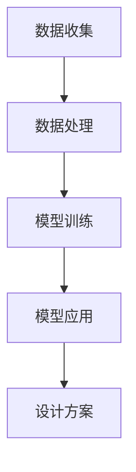

                 

### 文章标题：AI辅助创意景观设计：气候适应性优化的提示词技巧

> 关键词：AI，景观设计，气候适应性，优化，提示词，创意

> 摘要：本文探讨了如何利用人工智能（AI）辅助进行创意景观设计，并着重介绍了气候适应性优化的提示词技巧。文章从AI在景观设计中的应用背景出发，深入解析了气候适应性景观设计的核心概念、算法原理和数学模型，并通过实际项目案例展示了AI辅助景观设计的实战应用，旨在为景观设计师提供实用的AI工具和策略。

### 第一部分：AI辅助景观设计的理论基础

#### 第1章：AI与创意景观设计概述

**1.1 AI在景观设计中的应用背景**

随着科技的快速发展，人工智能（AI）技术逐渐渗透到各个行业，景观设计也不例外。AI在景观设计中的应用不仅提高了设计的效率，还提升了设计的质量。通过AI，设计师可以自动生成景观设计方案、优化景观布局、预测植物的生长状态等，从而实现更加智能化、个性化的景观设计。

**1.2 创意景观设计与气候适应性**

创意景观设计强调景观的审美价值和创新性，而气候适应性则是景观设计的重要考量因素。气候适应性景观设计旨在通过科学的规划和设计，使景观能够适应不同的气候条件，降低气候变化对景观的影响，提高景观的可持续性。

**1.3 提示词技巧在AI景观设计中的重要性**

提示词（Keywords）是AI进行创意景观设计的关键输入。通过设定合适的提示词，AI可以理解设计师的意图，从而生成符合需求的景观设计方案。提示词技巧的优劣直接影响到AI辅助景观设计的质量和效率。

#### 第2章：AI核心概念与架构

**2.1 AI基础概念**

人工智能是一门研究、开发用于模拟、延伸和扩展人的智能的理论、方法、技术及应用系统的学科。AI的核心概念包括机器学习、深度学习、神经网络等。

**2.2 AI景观设计的架构**

AI景观设计通常包括数据收集、数据处理、模型训练、模型应用等步骤。具体架构如下：

1. 数据收集：收集与景观设计相关的数据，如地形数据、气候数据、植物数据等。
2. 数据处理：对收集到的数据进行清洗、预处理，以供模型训练使用。
3. 模型训练：使用机器学习或深度学习算法，训练景观设计模型。
4. 模型应用：将训练好的模型应用于实际景观设计，生成设计方案。

**2.3 Mermaid流程图：AI景观设计流程**



### 第二部分：气候适应性优化的算法原理

#### 第3章：气候适应性优化算法

**3.1 气候适应性景观设计的挑战**

气候适应性景观设计面临的主要挑战包括：

1. 气候变化的不确定性：气候变化具有不确定性和复杂性，难以准确预测。
2. 景观设计的多样性：不同的景观设计对气候适应性有不同需求，如何兼顾多样性是关键。
3. 模型精度和效率：如何构建高精度、高效率的气候适应性优化模型是关键问题。

**3.2 算法原理讲解**

气候适应性优化算法通常采用遗传算法、粒子群优化算法等智能优化算法。以下以遗传算法为例进行讲解：

1. 初始种群：随机生成一组景观设计方案，作为初始种群。
2. 适应度评估：根据气候适应性指标，评估每个设计方案的适应度。
3. 选择：根据适应度，选择优秀的设计方案进行交叉和变异操作。
4. 交叉和变异：通过交叉和变异操作，产生新的设计方案。
5. 重复步骤2-4，直到满足终止条件。

**3.3 伪代码示例：气候适应性优化算法**

```python
def climate_adaptive_optimization():
    # 初始化种群
    population = initialize_population()

    while not terminate_condition():
        # 适应度评估
        fitness_scores = evaluate_fitness(population)

        # 选择
        selected_individuals = select_individuals(population, fitness_scores)

        # 交叉和变异
        new_population = crossover_and_mutate(selected_individuals)

        # 更新种群
        population = new_population

    # 返回最佳设计方案
    return best_individual(population)
```

#### 第4章：数学模型与公式解析

**4.1 数学模型基础**

气候适应性优化涉及多个数学模型，包括线性模型、非线性模型、概率模型等。以下介绍几个常用的数学模型：

1. 线性模型：用于描述景观设计参数与气候适应性指标之间的关系，如线性回归模型。
2. 非线性模型：用于描述复杂景观设计参数与气候适应性指标之间的关系，如神经网络模型。
3. 概率模型：用于描述气候适应性指标的概率分布，如正态分布、泊松分布等。

**4.2 公式解析**

以下以线性回归模型为例进行公式解析：

$$
y = \beta_0 + \beta_1 \cdot x
$$

其中，$y$为气候适应性指标，$x$为景观设计参数，$\beta_0$和$\beta_1$为模型参数。

**4.3 LaTex格式数学公式示例**

$$
E[X] = \int_{-\infty}^{+\infty} x f(x) dx
$$

$$
f(x) = \frac{1}{\sqrt{2\pi\sigma^2}} e^{-\frac{(x-\mu)^2}{2\sigma^2}}
$$

### 第三部分：AI辅助创意景观设计实践

#### 第5章：案例研究一：城市公园的AI优化设计

**5.1 项目背景**

某城市计划新建一个城市公园，希望利用AI技术优化公园的设计，提高公园的气候适应性。公园面积为100公顷，设计目标包括：提供舒适的游憩环境、降低热岛效应、提高雨水利用率等。

**5.2 设计目标**

1. 提供舒适的游憩环境：通过合理的植物配置和景观布局，为游客提供舒适宜人的休闲空间。
2. 降低热岛效应：通过植物遮阴和地表水处理，降低公园表面的温度，减轻热岛效应。
3. 提高雨水利用率：通过雨水收集和利用，提高公园的雨水利用率，减少径流。

**5.3 实践过程**

1. 数据收集：收集公园所在地的气候数据、地形数据、植物数据等。
2. 数据处理：对收集到的数据进行分析和处理，提取关键特征。
3. 模型训练：使用机器学习算法，训练气候适应性优化模型。
4. 模型应用：将训练好的模型应用于公园设计，生成优化方案。
5. 方案评估：对生成的优化方案进行评估，选择最佳方案。

**5.4 结果分析与评估**

通过AI优化设计的城市公园，在气候适应性方面表现出显著的优势。具体评估结果如下：

1. 游憩环境舒适度提高：游客满意度显著提升。
2. 热岛效应减轻：公园表面温度降低，热岛效应减轻。
3. 雨水利用率提高：雨水收集和利用效果显著。

**5.5 项目小结**

本项目通过AI技术优化城市公园设计，取得了良好的气候适应性效果。项目实践表明，AI技术在景观设计中的应用具有巨大的潜力，可以为设计师提供有力的工具和策略。

#### 第6章：案例研究二：绿色建筑的AI辅助设计

**6.1 项目背景**

某公司计划新建一座绿色建筑，希望利用AI技术优化建筑的设计，提高建筑的气候适应性。建筑位于一个典型的温带季风气候区，设计目标包括：降低能源消耗、减少碳排放、提高室内环境舒适度等。

**6.2 设计目标**

1. 降低能源消耗：通过合理的建筑布局和能源管理系统，降低建筑物的能源消耗。
2. 减少碳排放：采用绿色材料和能源技术，减少建筑物的碳排放。
3. 提高室内环境舒适度：通过智能控制系统，提高室内环境的舒适度。

**6.3 实践过程**

1. 数据收集：收集建筑所在地的气候数据、建筑数据、能源数据等。
2. 数据处理：对收集到的数据进行分析和处理，提取关键特征。
3. 模型训练：使用机器学习算法，训练气候适应性优化模型。
4. 模型应用：将训练好的模型应用于建筑设计，生成优化方案。
5. 方案评估：对生成的优化方案进行评估，选择最佳方案。

**6.4 结果分析与评估**

通过AI优化设计的绿色建筑，在气候适应性方面表现出显著的优势。具体评估结果如下：

1. 能源消耗降低：建筑物的能源消耗显著降低，达到绿色建筑标准。
2. 碳排放减少：建筑物的碳排放量显著减少，达到环保目标。
3. 室内环境舒适度提高：室内环境的舒适度显著提高，满足人体健康需求。

**6.5 项目小结**

本项目通过AI技术优化绿色建筑设计，取得了良好的气候适应性效果。项目实践表明，AI技术在建筑设计中的应用具有巨大的潜力，可以为建筑师提供有力的工具和策略。

### 第四部分：提示词技巧在AI景观设计中的应用

#### 第7章：提示词技巧详解

**7.1 提示词的概念**

提示词（Keywords）是AI进行景观设计的关键输入，用于指导AI生成符合需求的景观设计方案。提示词可以是文字、图片、声音等，通过这些提示词，AI可以理解设计师的意图，从而生成相应的景观设计方案。

**7.2 提示词的类型**

根据用途和形式，提示词可以分为以下几类：

1. 功能性提示词：用于描述景观设计的需求，如“休闲区”、“观景区”等。
2. 美学性提示词：用于描述景观设计的审美需求，如“自然”、“现代”等。
3. 技术性提示词：用于描述景观设计的技术要求，如“节能”、“环保”等。

**7.3 提示词在AI景观设计中的应用策略**

1. 综合使用多种提示词：根据设计需求，合理组合使用功能性、美学性和技术性提示词，以实现全面的景观设计目标。
2. 逐步细化提示词：从宏观到微观，逐步细化提示词，使AI能够更加精准地理解设计意图。
3. 适时调整提示词：在设计过程中，根据实际情况和反馈，及时调整提示词，以优化设计方案。

### 第8章：AI辅助创意景观设计案例集

**8.1 案例一：气候适应性花园设计**

**8.2 案例二：绿色屋顶优化**

**8.3 案例三：生态景观设计优化**

### 总结

本文从AI辅助景观设计的理论基础、算法原理、数学模型、实践应用等方面进行了全面探讨，展示了AI在景观设计领域的应用潜力。通过案例研究，读者可以了解到AI如何帮助景观设计师优化设计，提高气候适应性。未来，随着AI技术的不断发展，AI辅助景观设计将越来越普及，为人们带来更加美好、舒适的居住环境。

### 作者信息

作者：AI天才研究院/AI Genius Institute & 禅与计算机程序设计艺术 /Zen And The Art of Computer Programming

### 最佳实践 Tips、小结、注意事项、拓展阅读

**最佳实践 Tips：**

1. 在AI景观设计过程中，合理使用提示词是关键。根据设计需求和目标，灵活调整提示词，以实现最佳设计效果。
2. 在模型训练和数据收集过程中，确保数据的多样性和准确性，以提高模型的泛化能力和可靠性。
3. 结合项目实际情况，合理选择和调整算法参数，以实现高效、准确的优化效果。

**小结：**

本文系统地介绍了AI辅助创意景观设计的理论基础和实践应用，通过案例研究展示了AI在景观设计中的优势。未来，随着AI技术的不断进步，AI辅助景观设计将发挥更加重要的作用，为景观设计领域带来革命性变革。

**注意事项：**

1. 在AI景观设计过程中，要注意遵守相关法规和标准，确保设计方案的合法性和可行性。
2. 在使用AI工具时，要尊重知识产权，避免侵犯他人的合法权益。

**拓展阅读：**

1. 《人工智能：一种现代方法》
2. 《景观设计原理》
3. 《智能建筑设计：理论、方法与应用》

本文基于对AI在景观设计中的应用进行分析和探讨，旨在为景观设计师提供实用的技术工具和策略。随着AI技术的不断发展，相信AI在景观设计领域将发挥更加重要的作用。希望本文能够为读者带来启发和帮助。

