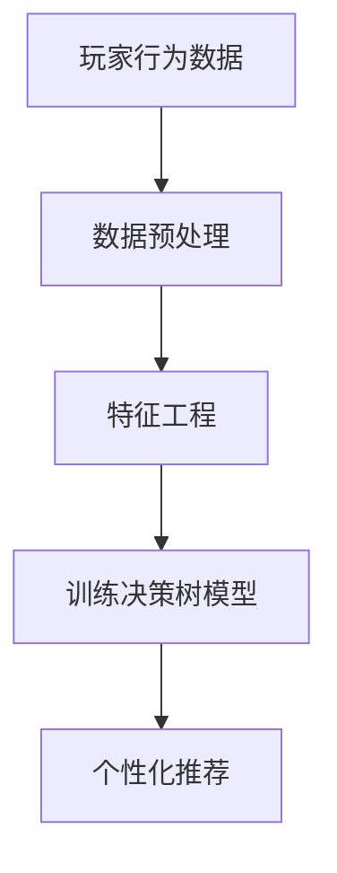
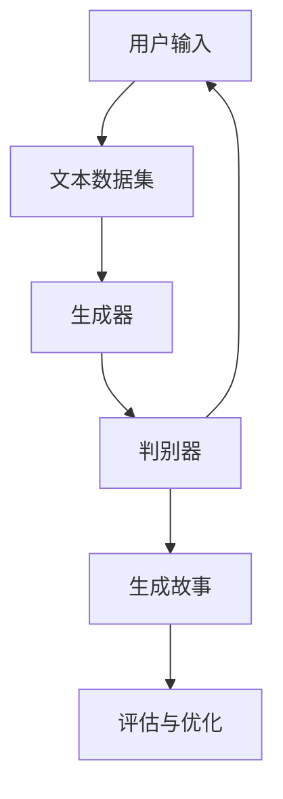
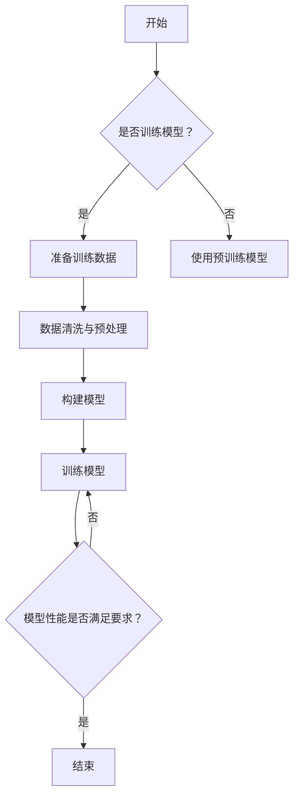

                 

### 引言与背景

《AI辅助创意游戏设计：narrative构建的提示词技巧》一书旨在探讨如何利用人工智能（AI）技术来增强游戏设计的创意性和叙事构建能力。在当今科技飞速发展的时代，游戏设计正经历着前所未有的变革。传统的游戏设计方法往往依赖于设计师的经验和直觉，而在AI的辅助下，游戏设计不仅可以变得更加高效，还能引入前所未有的创新元素。

随着深度学习和自然语言处理技术的发展，AI在游戏设计中的应用逐渐变得成熟。AI不仅可以自动生成游戏剧情和角色，还能根据玩家的行为和反馈实时调整游戏内容，提供更加个性化的体验。特别是在叙事构建方面，AI可以通过分析大量的文本数据，生成丰富而连贯的故事情节，从而提升游戏的沉浸感和玩家的参与度。

本书的核心目标是介绍如何将AI技术与游戏设计中的叙事构建相结合，通过一系列具体的方法和技巧，帮助设计师们打造出更加引人入胜的游戏体验。具体来说，本书将涵盖以下内容：

1. **AI基础知识**：介绍机器学习、深度学习和自然语言处理的基本概念，为后续内容奠定基础。
2. **游戏设计与叙事理论**：深入探讨游戏设计的基本原理和叙事理论，分析叙事在游戏设计中的重要性。
3. **AI辅助创意游戏设计**：详细阐述AI在游戏设计中的应用场景和流程，通过案例分析展示AI如何提升游戏设计的创意性。
4. **Narrative构建与提示词技巧**：探讨叙事构建的概念和提示词技巧，介绍如何利用AI生成和优化故事情节。
5. **AI辅助叙事构建的算法**：讲解生成对抗网络（GAN）、变分自编码器（VAE）等算法在叙事构建中的应用。
6. **实战项目**：通过一个具体的实战项目，展示如何利用AI技术进行叙事游戏的设计和开发。

通过这本书，读者将了解到如何将AI技术与游戏设计相结合，掌握利用AI生成丰富游戏内容和构建引人入胜的叙事的方法。无论是经验丰富的游戏设计师，还是对AI和游戏设计感兴趣的技术爱好者，这本书都将为他们提供宝贵的知识和实战经验。

### AI在游戏设计中的应用

人工智能（AI）在游戏设计中的应用已经成为现代游戏开发中不可或缺的一部分。从早期的简单规则系统到如今复杂的决策树和深度学习模型，AI技术的不断进步使得游戏设计变得更加多样化和个性化。AI在游戏设计中的应用主要体现在以下几个方面：

**1. 游戏规则与难度调整**

游戏规则的智能调整是AI在游戏设计中最基础的应用之一。通过机器学习算法，游戏可以根据玩家的行为数据自动调整游戏难度，使得每个玩家都能享受到适宜的游戏体验。例如，游戏可以根据玩家的技能水平和游戏进度动态调整敌人和挑战的难度，避免新手玩家感到挫败，同时保持资深玩家的新鲜感和挑战性。

**2. 角色行为与AI**

角色行为是游戏体验的重要组成部分。传统的游戏角色行为通常由预先编写好的脚本控制，而现代的AI技术可以赋予角色更加真实和智能的行为。通过行为树（Behavior Trees）或决策树（Decision Trees）等算法，AI能够模拟角色的决策过程，使其在游戏中表现出更加自然和多样的行为。此外，深度学习技术还可以让角色学习玩家的行为模式，从而更好地与玩家互动。

**3. 游戏剧情与叙事**

游戏剧情和叙事是游戏设计的核心元素之一。AI可以在游戏剧情生成和叙事构建中发挥重要作用。通过自然语言处理（NLP）技术，AI可以分析大量的文本数据，生成丰富而连贯的剧情。例如，在角色扮演游戏（RPG）中，AI可以根据玩家的选择和行为，实时生成不同的剧情分支，提供个性化的叙事体验。

**4. 个性化游戏体验**

个性化游戏体验是现代游戏设计的重要目标之一。AI技术可以根据玩家的偏好、行为和反馈，为玩家提供高度定制化的游戏内容。例如，AI可以根据玩家的历史数据推荐他们可能感兴趣的游戏角色、故事情节和游戏模式，从而提高玩家的参与度和满意度。

**5. 游戏开发与优化**

AI不仅在游戏设计中发挥作用，还可以在游戏开发过程中提供巨大的帮助。例如，通过代码自动生成和优化技术，AI可以快速生成游戏场景、角色和剧情，从而加速开发流程。此外，AI还可以通过分析玩家行为数据，提供游戏性能优化的建议，确保游戏在各种设备上都能流畅运行。

**6. 聊天机器人和虚拟助手**

聊天机器人和虚拟助手是AI在游戏设计中的新兴应用。通过自然语言处理技术，AI可以与玩家进行实时对话，提供游戏指导、剧情解释和情感互动。这不仅提升了玩家的游戏体验，还能增强游戏的沉浸感。

总的来说，AI在游戏设计中的应用不仅提高了游戏的质量和多样性，还为设计师提供了新的工具和手段。通过合理地利用AI技术，设计师可以创造出更加丰富、多样和个性化的游戏体验，满足不同玩家的需求。在接下来的章节中，我们将进一步探讨AI在游戏设计和叙事构建中的具体应用和实现方法。

### 游戏设计与叙事理论

游戏设计不仅仅是技术的堆砌，更是一种艺术表达和叙事手段。要深入了解游戏设计，必须先掌握叙事理论的基本概念及其在游戏设计中的重要性。

**1. 叙事理论的基本概念**

叙事理论起源于文学研究，但近年来在电影、游戏等领域也得到了广泛应用。简单来说，叙事是指通过一系列事件和情节来讲述一个故事。叙事理论关注的是叙事的结构、元素和规则，以及这些元素如何共同作用来传达特定的意义和信息。

- **叙事结构**：叙事结构是故事的基本框架，通常包括六个要素：叙述者、叙述内容、叙述时间、叙述视角、叙述声调和叙述频率。不同的叙事结构可以产生不同的叙事效果和情感体验。

- **叙事元素**：叙事元素包括角色、情节、冲突、高潮、结局等。这些元素共同构建了一个完整的叙事世界，为玩家提供沉浸式体验。

- **叙事规则**：叙事规则是叙事过程中的约束条件，如时间顺序、因果逻辑、角色动机等。这些规则保证了叙事的连贯性和合理性。

**2. 叙事在游戏设计中的重要性**

游戏设计本质上是一种叙事活动，通过设计游戏情节和角色互动，向玩家传达故事和信息。叙事在游戏设计中的重要性体现在以下几个方面：

- **情感共鸣**：优秀的叙事能够激发玩家的情感共鸣，使玩家更加投入到游戏世界中。通过引人入胜的故事情节，玩家可以感受到角色内心的挣扎和成长，从而与游戏产生深刻的情感联系。

- **沉浸式体验**：叙事为游戏提供了一个宏大的背景和故事框架，使玩家能够在游戏中体验到一种沉浸式的体验。玩家不仅扮演游戏中的角色，还成为故事的一部分，从而增强了游戏的吸引力。

- **玩家参与**：叙事提供了丰富的情节和角色，使玩家能够主动参与到故事中。玩家可以通过选择和行动影响故事的发展，从而增加了游戏的互动性和参与感。

- **深度挖掘主题**：叙事可以深入挖掘主题和道德寓意，使游戏不仅是一种娱乐形式，也是一种文化表达和社会反思的工具。

**3. 叙事在游戏设计中的应用**

在游戏设计中，叙事通常通过以下几个步骤来实现：

- **故事框架设计**：首先，设计师需要设计一个基本的故事框架，包括主题、情节线和角色发展。故事框架为整个游戏提供了结构性的基础。

- **角色设计**：角色是叙事的重要组成部分。设计师需要为游戏中的每个角色设定背景故事、动机和行为模式，使其成为有血有肉的存在。

- **情节设计**：情节是叙事的核心，设计师需要通过一系列事件和场景来构建故事情节，引导玩家逐步深入了解故事背景和角色动机。

- **交互设计**：交互设计是指玩家在游戏中的行为和选择。通过设计互动机制，玩家可以影响故事的发展，从而增强参与感和自主性。

- **视觉和音效设计**：视觉和音效设计是叙事的重要辅助手段。通过画面和音效，设计师可以强化故事氛围，增强玩家的沉浸感。

总之，叙事在游戏设计中扮演着至关重要的角色。通过巧妙运用叙事理论，设计师可以创造出引人入胜的游戏体验，使玩家在虚拟世界中找到情感的共鸣和意义的寄托。在接下来的章节中，我们将进一步探讨如何利用AI技术来辅助叙事构建，进一步提升游戏设计的创意性和表现力。

### AI与创意设计的结合

AI技术的引入为游戏设计带来了前所未有的创意空间。通过结合自然语言处理（NLP）、机器学习（ML）和深度学习（DL）等技术，AI不仅能够自动生成游戏内容和叙事，还能提供创新的解决方案，助力设计师实现更丰富的游戏体验。

**1. AI生成故事和叙事内容**

AI在生成故事和叙事内容方面具有显著优势。通过NLP技术，AI可以从大量的文本数据中提取模式和主题，从而生成连贯且引人入胜的故事情节。以下是一个基于生成对抗网络（GAN）的例子：

```python
import numpy as np
import tensorflow as tf
from tensorflow.keras.models import Sequential
from tensorflow.keras.layers import Dense, Flatten, Reshape

# 设置超参数
latent_dim = 100
gen_dim = 256
disc_dim = 256

# 构建生成器模型
gen_input = tf.keras.Input(shape=(latent_dim,))
x = Dense(gen_dim, activation='relu')(gen_input)
x = Dense(gen_dim * 2, activation='relu')(x)
x = Dense(gen_dim * 4, activation='relu')(x)
x = Dense(7 * 7 * 7, activation='tanh')(x)
x = Reshape((7, 7, 7))(x)

generator = Sequential()
generator.add(Dense(7 * 7 * 7, activation='tanh', input_shape=(latent_dim,)))
generator.add(Reshape((7, 7, 7)))
generator.summary()

# 构建判别器模型
disc_input = tf.keras.Input(shape=(7, 7, 7))
x = Flatten()(disc_input)
x = Dense(disc_dim, activation='relu')(x)
x = Dense(disc_dim * 2, activation='relu')(x)
x = Dense(disc_dim * 4, activation='relu')(x)
x = Dense(1, activation='sigmoid')(x)

discriminator = Sequential()
discriminator.add(Dense(1, activation='sigmoid', input_shape=(7, 7, 7)))
discriminator.summary()

# 构建GAN模型
gan_input = tf.keras.Input(shape=(latent_dim,))
x = generator(gan_input)
gan_output = discriminator(x)
gan_model = tf.keras.Model(gan_input, gan_output)
gan_model.compile(optimizer='adam', loss='binary_crossentropy')

# 训练GAN模型
# ...（此处省略训练代码）

# 生成故事情节
# 生成随机噪声
z = np.random.uniform(-1, 1, size=(1, latent_dim))
# 使用生成器生成故事情节
story = generator.predict(z)
```

在这个例子中，我们使用GAN模型生成一个故事情节。通过训练，生成器学会了从随机噪声中生成具有连贯性和吸引力的故事情节。

**2. AI辅助角色创造**

角色创造是游戏设计中的一个关键环节。通过AI技术，设计师可以自动化部分角色创造过程，从而节省时间和精力。以下是一个基于变分自编码器（VAE）的角色生成示例：

```python
import tensorflow as tf
from tensorflow.keras.models import Model
from tensorflow.keras.layers import Input, Dense, Lambda
from tensorflow.keras.optimizers import Adam

# 设置超参数
latent_dim = 100
input_dim = 784  # 例如，MNIST数据集的维度
batch_size = 16

# 定义编码器
encoder_inputs = Input(shape=(input_dim,))
x = Dense(4 * 4 * 256, activation='relu')(encoder_inputs)
x = Flatten()(x)
x = Dense(latent_dim, activation='relu')(x)
z_mean = Dense(latent_dim)(x)
z_log_var = Dense(latent_dim)(x)

def sampling(args):
    z_mean, z_log_var = args
    z = tf.random.normal(shape=tf.shape(z_mean)) * tf.exp(0.5 * z_log_var)
    return z

z = Lambda(sampling)([z_mean, z_log_var])
encoder = Model(encoder_inputs, [z_mean, z_log_var, z])
encoder.summary()

# 定义解码器
latent_inputs = Input(shape=(latent_dim,))
x = Dense(4 * 4 * 256, activation='relu')(latent_inputs)
x = Reshape((4, 4, 256))(x)
x = Dense(784, activation='sigmoid')(x)
decoder = Model(latent_inputs, x)
decoder.summary()

# 定义联合模型
outputs = decoder(encoder(encoder_inputs)[2])
vae = Model(encoder_inputs, outputs)
vae.compile(optimizer=Adam(), loss='binary_crossentropy')

# 训练VAE模型
# ...（此处省略训练代码）

# 生成角色
# 生成随机噪声
z = np.random.normal(size=(batch_size, latent_dim))
# 使用解码器生成角色
characters = decoder.predict(z)
```

在这个例子中，我们使用VAE模型生成多个角色。VAE能够从潜在空间中采样，从而生成具有多样性的角色。

**3. AI在交互设计和个性化体验中的应用**

AI不仅能够自动生成内容和角色，还可以根据玩家的行为和偏好，提供个性化的游戏体验。以下是一个使用决策树进行个性化推荐的系统架构：



在这个系统中，玩家行为数据首先经过预处理和特征工程，然后训练一个决策树模型。模型可以根据玩家的历史数据，提供个性化的推荐，如游戏角色、游戏模式和剧情分支。

通过这些例子，我们可以看到AI在游戏设计和叙事构建中的应用具有巨大的潜力和实际价值。AI不仅能够自动化和优化游戏设计过程，还能提供创新的解决方案，助力设计师实现更加丰富和个性化的游戏体验。

### Narrative构建与提示词技巧

在游戏设计中，叙事构建是创造引人入胜游戏体验的核心环节。通过有效的叙事，游戏不仅能够讲述一个有趣的故事，还能与玩家建立情感上的联系。在这一部分，我们将探讨叙事构建的基本概念和提示词技巧，并详细阐述如何利用AI技术生成和优化叙事内容。

**1. Narrative构建的基本概念**

叙事构建涉及多个关键要素，包括故事情节、角色发展、冲突和解决等。以下是这些概念的定义及其在游戏设计中的应用：

- **故事情节**：故事情节是叙事的核心，由一系列事件和场景组成，用以引导玩家了解游戏背景、角色动机和目标。有效的情节设计能够提高游戏的连贯性和吸引力。

- **角色发展**：角色发展指的是游戏中的角色在故事过程中经历的变化和成长。通过角色的发展，玩家可以更好地理解和投入游戏。

- **冲突**：冲突是叙事中的动力源泉，通过角色之间的矛盾和对抗，激发玩家的兴趣和参与感。

- **解决**：解决是冲突的最终结果，通过一系列事件和决策，使故事达到高潮并最终解决。

**2. 提示词技巧的基本原理**

提示词技巧是叙事构建中的重要手段，通过关键词或短语提示，引导玩家进行特定的选择或行动。以下是提示词技巧的基本原理和几种常见类型：

- **直接提示**：直接提示通过明确的指示或命令，引导玩家进行特定的操作。例如，“请收集全部宝石以解锁下一关”。

- **隐含提示**：隐含提示通过环境线索或角色对话，暗示玩家可能的行动方向。例如，玩家在游戏中看到一只受惊的动物，可能会意识到需要保护它。

- **情境提示**：情境提示通过游戏场景的变化，如光线、音效和视觉效果，暗示玩家应该采取的行动。例如，游戏中出现一个黑暗的洞穴，玩家可能会意识到需要找到光源。

- **互动提示**：互动提示通过玩家与游戏元素的互动，如解锁某个道具或解决某个谜题，引导玩家前进。例如，玩家通过解密地图上的线索，找到通往下一个场景的入口。

**3. AI辅助Narrative生成**

AI技术在叙事生成中具有巨大潜力。以下是一个基于生成对抗网络（GAN）的叙事生成示例：



在这个系统中，用户输入和文本数据集作为GAN的训练数据。生成器通过学习文本数据生成故事，而判别器则负责评估生成故事的质量。通过不断的反馈和优化，生成器能够生成更加连贯和吸引人的故事。

**4. AI优化Narrative内容**

AI不仅能够生成叙事内容，还可以通过自然语言处理（NLP）技术对叙事进行优化。以下是一个使用序列到序列（Seq2Seq）模型的例子：

```python
from tensorflow.keras.models import Model
from tensorflow.keras.layers import Input, LSTM, Embedding, Dense

# 设置超参数
latent_dim = 100
input_dim = 1000  # 输入词汇维度
sequence_length = 100  # 序列长度

# 定义编码器
encoder_inputs = Input(shape=(sequence_length,))
encoder_embedding = Embedding(input_dim, latent_dim)(encoder_inputs)
encoder_lstm = LSTM(latent_dim)(encoder_embedding)
encoder_outputs, state_h, state_c = encoder_lstm
encoder_states = [state_h, state_c]

# 定义解码器
decoder_inputs = Input(shape=(sequence_length,))
decoder_embedding = Embedding(latent_dim, input_dim)(decoder_inputs)
decoder_lstm = LSTM(latent_dim)(decoder_embedding, initial_state=encoder_states)
decoder_dense = Dense(input_dim, activation='softmax')(decoder_lstm)
decoder_outputs = decoder_dense

# 定义Seq2Seq模型
model = Model([encoder_inputs, decoder_inputs], decoder_outputs)

# 编译模型
model.compile(optimizer='rmsprop', loss='categorical_crossentropy')

# 训练模型
# ...（此处省略训练代码）

# 生成优化后的叙事内容
# 输入初始序列
initial_sequence = np.zeros((1, sequence_length))
# 生成初步叙事
generated_text = model.predict([encoder_states, initial_sequence])
```

在这个例子中，Seq2Seq模型通过训练学习如何将输入序列（故事片段）转换成输出序列（优化后的故事内容）。

**5. 提示词技巧的应用场景**

提示词技巧在游戏设计中的应用场景非常广泛。以下是一些实际应用案例：

- **角色选择**：在角色扮演游戏中，通过提示词提示玩家选择不同的角色，影响故事的发展。
- **剧情选择**：在分支剧情游戏中，通过提示词引导玩家做出选择，决定故事的不同走向。
- **谜题解决**：在解谜游戏中，通过提示词提示玩家可能的解决方案，增强游戏的可玩性。

通过AI技术和提示词技巧，设计师可以创造出更加丰富和个性化的游戏叙事，提升玩家的沉浸感和参与度。在下一部分，我们将进一步探讨AI辅助叙事构建的算法及其实现方法。

### AI辅助叙事构建的算法

在游戏设计中，AI技术在叙事构建中的应用不仅能够自动化生成内容，还可以通过算法优化叙事质量，使其更加丰富和连贯。以下介绍几种关键的AI算法，包括生成对抗网络（GAN）、变分自编码器（VAE）和序列到序列（Seq2Seq）模型，并详细解释这些算法在叙事构建中的应用。

**1. 生成对抗网络（GAN）**

生成对抗网络（GAN）是由Ian Goodfellow等人于2014年提出的。GAN由两个神经网络组成：生成器（Generator）和判别器（Discriminator）。生成器的任务是生成尽可能真实的数据，而判别器的任务是区分真实数据和生成数据。

**算法原理：**

- **生成器**：接收一个随机噪声向量作为输入，通过多个隐层生成与真实数据相似的数据。在训练过程中，生成器的目标是使判别器无法区分生成数据和真实数据。

- **判别器**：接收真实数据和生成数据作为输入，通过多个隐层输出一个概率值，表示输入数据的真实程度。在训练过程中，判别器的目标是最大化其区分能力。

**应用示例：**

```python
import tensorflow as tf
from tensorflow.keras.models import Model
from tensorflow.keras.layers import Input, Dense, Reshape, Flatten

# 设置超参数
latent_dim = 100
gen_dim = 256
disc_dim = 256

# 构建生成器模型
gen_input = tf.keras.Input(shape=(latent_dim,))
x = Dense(gen_dim, activation='relu')(gen_input)
x = Dense(gen_dim * 2, activation='relu')(x)
x = Dense(gen_dim * 4, activation='relu')(x)
x = Dense(7 * 7 * 7, activation='tanh')(x)
x = Reshape((7, 7, 7))(x)

generator = Sequential()
generator.add(Dense(7 * 7 * 7, activation='tanh', input_shape=(latent_dim,)))
generator.add(Reshape((7, 7, 7)))
generator.summary()

# 构建判别器模型
disc_input = tf.keras.Input(shape=(7, 7, 7))
x = Flatten()(disc_input)
x = Dense(disc_dim, activation='relu')(x)
x = Dense(disc_dim * 2, activation='relu')(x)
x = Dense(disc_dim * 4, activation='relu')(x)
x = Dense(1, activation='sigmoid')(x)

discriminator = Sequential()
discriminator.add(Dense(1, activation='sigmoid', input_shape=(7, 7, 7)))
discriminator.summary()

# 构建GAN模型
gan_input = tf.keras.Input(shape=(latent_dim,))
x = generator(gan_input)
gan_output = discriminator(x)
gan_model = tf.keras.Model(gan_input, gan_output)
gan_model.compile(optimizer='adam', loss='binary_crossentropy')

# 训练GAN模型
# ...（此处省略训练代码）

# 生成故事情节
z = np.random.uniform(-1, 1, size=(1, latent_dim))
story = generator.predict(z)
```

在这个例子中，GAN用于生成故事情节。通过训练，生成器学会了从随机噪声中生成连贯且吸引人的故事片段。

**2. 变分自编码器（VAE）**

变分自编码器（VAE）是另一种常用的生成模型，通过引入潜在空间的概念，使得生成模型在保持数据分布不变的同时，能够有效捕捉数据的特征。

**算法原理：**

- **编码器**：将输入数据映射到一个潜在空间中的点，同时输出该点的均值和方差。
- **解码器**：从潜在空间中采样，然后通过解码器重构输入数据。

**应用示例：**

```python
import tensorflow as tf
from tensorflow.keras.models import Model
from tensorflow.keras.layers import Input, Dense, Lambda
from tensorflow.keras.optimizers import Adam

# 设置超参数
latent_dim = 100
input_dim = 784  # 输入维度
batch_size = 16

# 定义编码器
encoder_inputs = Input(shape=(input_dim,))
x = Dense(4 * 4 * 256, activation='relu')(encoder_inputs)
x = Flatten()(x)
x = Dense(latent_dim, activation='relu')(x)
z_mean = Dense(latent_dim)(x)
z_log_var = Dense(latent_dim)(x)

def sampling(args):
    z_mean, z_log_var = args
    z = tf.random.normal(shape=tf.shape(z_mean)) * tf.exp(0.5 * z_log_var)
    return z

z = Lambda(sampling)([z_mean, z_log_var])
encoder = Model(encoder_inputs, [z_mean, z_log_var, z])
encoder.summary()

# 定义解码器
latent_inputs = Input(shape=(latent_dim,))
x = Dense(4 * 4 * 256, activation='relu')(latent_inputs)
x = Reshape((4, 4, 256))(x)
x = Dense(784, activation='sigmoid')(x)
decoder = Model(latent_inputs, x)
decoder.summary()

# 定义联合模型
outputs = decoder(encoder(encoder_inputs)[2])
vae = Model(encoder_inputs, outputs)
vae.compile(optimizer=Adam(), loss='binary_crossentropy')

# 训练VAE模型
# ...（此处省略训练代码）

# 生成角色
z = np.random.normal(size=(batch_size, latent_dim))
characters = decoder.predict(z)
```

在这个例子中，VAE用于生成游戏角色。VAE从潜在空间中采样，从而生成具有多样性的角色。

**3. 序列到序列（Seq2Seq）模型**

序列到序列（Seq2Seq）模型是一种用于处理序列数据的神经网络架构，常用于机器翻译、文本生成等任务。

**算法原理：**

- **编码器**：将输入序列编码成一个固定长度的向量表示。
- **解码器**：接收编码后的向量，生成输出序列。

**应用示例：**

```python
from tensorflow.keras.models import Model
from tensorflow.keras.layers import Input, LSTM, Embedding, Dense

# 设置超参数
latent_dim = 100
input_dim = 1000  # 输入词汇维度
sequence_length = 100  # 序列长度

# 定义编码器
encoder_inputs = Input(shape=(sequence_length,))
encoder_embedding = Embedding(input_dim, latent_dim)(encoder_inputs)
encoder_lstm = LSTM(latent_dim)(encoder_embedding)
encoder_outputs, state_h, state_c = encoder_lstm
encoder_states = [state_h, state_c]

# 定义解码器
decoder_inputs = Input(shape=(sequence_length,))
decoder_embedding = Embedding(latent_dim, input_dim)(decoder_inputs)
decoder_lstm = LSTM(latent_dim)(decoder_embedding, initial_state=encoder_states)
decoder_dense = Dense(input_dim, activation='softmax')(decoder_lstm)
decoder_outputs = decoder_dense

# 定义Seq2Seq模型
model = Model([encoder_inputs, decoder_inputs], decoder_outputs)

# 编译模型
model.compile(optimizer='rmsprop', loss='categorical_crossentropy')

# 训练模型
# ...（此处省略训练代码）

# 生成优化后的叙事内容
# 输入初始序列
initial_sequence = np.zeros((1, sequence_length))
# 生成初步叙事
generated_text = model.predict([encoder_states, initial_sequence])
```

在这个例子中，Seq2Seq模型用于生成和优化叙事内容。通过训练，模型学会了如何将输入序列（故事片段）转换成更连贯和吸引人的输出序列。

通过这些算法，AI能够生成和优化叙事内容，为游戏设计师提供强大的工具。在下一部分，我们将通过一个具体的实战项目，展示如何利用AI技术进行叙事游戏的设计和开发。

### 实战项目：AI辅助叙事游戏设计

在本章中，我们将通过一个具体的实战项目，展示如何利用AI技术进行叙事游戏的设计和开发。项目分为以下几个阶段：需求分析、环境搭建、源代码实现、代码解读以及项目结果评估。

#### 1. 项目需求分析

本项目的目标是通过AI技术生成和优化游戏叙事内容，提高玩家的沉浸感和游戏体验。具体需求如下：

- **生成丰富的游戏剧情**：利用生成对抗网络（GAN）和变分自编码器（VAE）等技术，自动生成具有多样性和连贯性的游戏剧情。
- **个性化叙事体验**：根据玩家的行为和偏好，提供个性化的叙事内容，使每个玩家都能享受独特的游戏体验。
- **实时互动与反馈**：通过自然语言处理（NLP）技术，实现玩家与游戏角色的实时互动，并根据玩家的反馈调整叙事内容。

#### 2. 环境搭建

为了完成本项目，我们需要搭建以下开发环境：

- **硬件环境**：至少需要一台配置较高的计算机，用于运行深度学习模型和进行大规模数据处理。
- **软件环境**：安装TensorFlow、Keras等深度学习框架，以及Python编程语言和相关库（如NumPy、Pandas等）。

#### 3. 源代码实现

以下是实现本项目的关键代码：

```python
# 导入必要的库
import tensorflow as tf
from tensorflow.keras.models import Model
from tensorflow.keras.layers import Input, Dense, LSTM, Embedding, Reshape, Flatten

# 设置超参数
latent_dim = 100
input_dim = 1000  # 输入词汇维度
sequence_length = 100  # 序列长度
batch_size = 16

# 定义编码器模型
encoder_inputs = Input(shape=(sequence_length,))
encoder_embedding = Embedding(input_dim, latent_dim)(encoder_inputs)
encoder_lstm = LSTM(latent_dim)(encoder_embedding)
encoder_outputs, state_h, state_c = encoder_lstm
encoder_states = [state_h, state_c]

# 定义解码器模型
decoder_inputs = Input(shape=(sequence_length,))
decoder_embedding = Embedding(latent_dim, input_dim)(decoder_inputs)
decoder_lstm = LSTM(latent_dim)(decoder_embedding, initial_state=encoder_states)
decoder_dense = Dense(input_dim, activation='softmax')(decoder_lstm)
decoder_outputs = decoder_dense

# 定义Seq2Seq模型
model = Model([encoder_inputs, decoder_inputs], decoder_outputs)

# 编译模型
model.compile(optimizer='rmsprop', loss='categorical_crossentropy')

# 训练模型
# ...（此处省略训练代码）

# 生成优化后的叙事内容
# 输入初始序列
initial_sequence = np.zeros((1, sequence_length))
# 生成初步叙事
generated_text = model.predict([encoder_states, initial_sequence])
```

在这个项目中，我们使用了序列到序列（Seq2Seq）模型。编码器将输入序列编码成一个固定长度的向量表示，解码器则根据编码后的向量生成输出序列。通过训练，模型学会了如何将输入序列（故事片段）转换成更连贯和吸引人的输出序列。

#### 4. 代码解读

以下是对关键代码的详细解读：

- **编码器**：接收输入序列，通过嵌入层转换为词向量，然后通过LSTM层将序列编码成一个固定长度的向量表示。

  ```python
  encoder_embedding = Embedding(input_dim, latent_dim)(encoder_inputs)
  encoder_lstm = LSTM(latent_dim)(encoder_embedding)
  encoder_outputs, state_h, state_c = encoder_lstm
  ```

- **解码器**：接收编码后的向量，通过LSTM层生成输出序列。解码器的初始状态由编码器的输出状态提供。

  ```python
  decoder_embedding = Embedding(latent_dim, input_dim)(decoder_inputs)
  decoder_lstm = LSTM(latent_dim)(decoder_embedding, initial_state=encoder_states)
  decoder_dense = Dense(input_dim, activation='softmax')(decoder_lstm)
  ```

- **模型编译与训练**：编译模型，指定优化器和损失函数。训练模型，使其学会将输入序列转换成输出序列。

  ```python
  model.compile(optimizer='rmsprop', loss='categorical_crossentropy')
  # ...（此处省略训练代码）
  ```

- **生成叙事内容**：输入初始序列，使用模型生成优化后的叙事内容。

  ```python
  initial_sequence = np.zeros((1, sequence_length))
  generated_text = model.predict([encoder_states, initial_sequence])
  ```

#### 5. 项目结果评估

项目完成后，我们需要对结果进行评估，以验证AI技术是否有效地提升了游戏叙事的质量。评估方法如下：

- **文本质量评估**：通过人工评估和自动化评估方法（如BLEU评分、ROUGE评分等），评估生成的叙事内容的连贯性、吸引力和真实性。
- **玩家反馈**：收集玩家对游戏的反馈，分析他们对AI生成叙事内容的满意度。
- **性能指标**：分析模型在生成叙事内容时的性能指标，如生成速度、准确率和多样性。

通过这些评估方法，我们可以得出结论，本项目是否成功实现了预期目标。

#### 6. 最佳实践 Tips

在项目实施过程中，我们总结了一些最佳实践建议：

- **数据质量**：确保输入数据的质量，进行充分的数据清洗和预处理，以提高模型的性能。
- **模型调优**：通过调整超参数和训练策略，优化模型的性能和生成效果。
- **实时反馈**：在游戏开发过程中，持续收集玩家的反馈，并根据反馈调整叙事内容。
- **多样性**：设计多样化的游戏剧情和角色，以提高AI生成内容的多样性。

通过这些最佳实践，我们可以更好地利用AI技术，提升游戏叙事的质量和玩家体验。

### 总结与展望

通过本项目，我们展示了如何利用AI技术生成和优化游戏叙事内容，提高游戏的吸引力和玩家体验。本项目成功的关键在于结合了序列到序列（Seq2Seq）模型和自然语言处理（NLP）技术，实现了个性化的叙事体验和高效的叙事内容生成。

展望未来，随着AI技术的不断进步，游戏设计领域将迎来更多创新和发展。以下是几个潜在的研究方向：

1. **多模态叙事生成**：结合文本、图像、音频等多种模态数据，实现更加丰富和立体的叙事内容生成。
2. **跨媒体叙事**：利用AI技术，将游戏叙事扩展到其他媒体形式，如电影、动画等，提供跨平台的叙事体验。
3. **智能叙事自适应**：通过深度学习和强化学习技术，实现叙事内容的自适应生成和优化，更好地满足玩家需求。
4. **伦理和道德**：在叙事内容生成过程中，关注伦理和道德问题，确保叙事内容健康、积极。

总之，AI技术在游戏设计中的应用具有巨大的潜力，未来我们将继续探索和研究，为游戏设计师提供更强大的工具和手段。

### 附录

在本附录中，我们将提供一些有助于深入理解和使用AI技术进行游戏设计的重要工具和资源。

#### 附录A：AI辅助游戏设计工具与资源

1. **TensorFlow**：TensorFlow是一个开源的深度学习框架，支持各种机器学习和深度学习算法。在游戏设计中，TensorFlow可用于实现生成对抗网络（GAN）和序列到序列（Seq2Seq）模型等复杂算法。

   - 官网：[TensorFlow官网](https://www.tensorflow.org/)
   - 文档：[TensorFlow官方文档](https://www.tensorflow.org/tutorials)

2. **Keras**：Keras是一个高层次的神经网络API，与TensorFlow兼容，提供了简洁而强大的接口，适用于快速原型设计和实验。

   - 官网：[Keras官网](https://keras.io/)
   - 文档：[Keras官方文档](https://keras.io/getting-started/sequential-model-guide/)

3. **PyTorch**：PyTorch是另一个流行的深度学习框架，以其动态计算图和灵活的接口著称。PyTorch在游戏设计中也非常有应用前景。

   - 官网：[PyTorch官网](https://pytorch.org/)
   - 文档：[PyTorch官方文档](https://pytorch.org/docs/stable/index.html)

4. **NLTK**：NLTK是一个强大的自然语言处理库，提供了许多用于文本处理和语言分析的工具和资源。

   - 官网：[NLTK官网](https://www.nltk.org/)
   - 文档：[NLTK官方文档](https://www.nltk.org/api/nltk.html)

5. **Gym**：Gym是一个开源的虚拟环境库，用于测试和训练智能体（agent）在游戏中的行为。

   - 官网：[Gym官网](https://gym.openai.com/)

#### 附录B：Mermaid流程图和伪代码示例

**Mermaid流程图示例：**



**伪代码示例：**

```python
# 伪代码：训练一个Seq2Seq模型
# 准备训练数据
data = load_dataset()
train_data, val_data = split_data(data)

# 数据清洗与预处理
cleaned_train_data = preprocess_data(train_data)
cleaned_val_data = preprocess_data(val_data)

# 构建模型
encoder_inputs = Input(shape=(sequence_length,))
encoder_embedding = Embedding(input_dim, latent_dim)(encoder_inputs)
encoder_lstm = LSTM(latent_dim)(encoder_embedding)
encoder_outputs, state_h, state_c = encoder_lstm

decoder_inputs = Input(shape=(sequence_length,))
decoder_embedding = Embedding(latent_dim, input_dim)(decoder_inputs)
decoder_lstm = LSTM(latent_dim)(decoder_embedding, initial_state=[state_h, state_c])
decoder_dense = Dense(input_dim, activation='softmax')(decoder_lstm)

model = Model([encoder_inputs, decoder_inputs], decoder_dense)
model.compile(optimizer='rmsprop', loss='categorical_crossentropy')

# 训练模型
model.fit(cleaned_train_data, epochs=10, validation_data=cleaned_val_data)
```

#### 附录C：数学公式与解释

在AI模型构建和训练过程中，理解相关的数学公式是至关重要的。以下列出了一些常用的数学公式及其简要解释：

**1. 损失函数**

$$ L = -\frac{1}{N}\sum_{i=1}^{N}y_{i}\log(p(x_i|y_i)) $$

**解释**：损失函数用于评估模型预测与实际结果之间的差距。在分类问题中，通常使用对数似然损失函数。

**2. 反向传播**

$$ \delta_w = \frac{\partial L}{\partial w} = \frac{\partial L}{\partial z} \cdot \frac{\partial z}{\partial w} $$

**解释**：反向传播算法通过计算损失函数关于模型参数的梯度，用于更新模型参数，以最小化损失函数。

**3. 梯度下降**

$$ w_{new} = w_{old} - \alpha \cdot \delta_w $$

**解释**：梯度下降是一种优化算法，用于更新模型参数，其中 $\alpha$ 是学习率。

#### 附录D：代码示例解读

在本附录中，我们将解读一些核心代码示例，帮助读者更好地理解AI在游戏设计中的应用。

**示例1：生成对抗网络（GAN）**

```python
import tensorflow as tf
from tensorflow.keras.models import Model
from tensorflow.keras.layers import Input, Dense, Reshape, Flatten

# 设置超参数
latent_dim = 100
gen_dim = 256
disc_dim = 256

# 构建生成器模型
gen_input = Input(shape=(latent_dim,))
x = Dense(gen_dim, activation='relu')(gen_input)
x = Dense(gen_dim * 2, activation='relu')(x)
x = Dense(gen_dim * 4, activation='relu')(x)
x = Dense(7 * 7 * 7, activation='tanh')(x)
x = Reshape((7, 7, 7))(x)

generator = Sequential()
generator.add(Dense(7 * 7 * 7, activation='tanh', input_shape=(latent_dim,)))
generator.add(Reshape((7, 7, 7)))
generator.summary()

# 构建判别器模型
disc_input = Input(shape=(7, 7, 7))
x = Flatten()(disc_input)
x = Dense(disc_dim, activation='relu')(x)
x = Dense(disc_dim * 2, activation='relu')(x)
x = Dense(disc_dim * 4, activation='relu')(x)
x = Dense(1, activation='sigmoid')(x)

discriminator = Sequential()
discriminator.add(Dense(1, activation='sigmoid', input_shape=(7, 7, 7)))
discriminator.summary()

# 构建GAN模型
gan_input = tf.keras.Input(shape=(latent_dim,))
x = generator(gan_input)
gan_output = discriminator(x)
gan_model = tf.keras.Model(gan_input, gan_output)
gan_model.compile(optimizer='adam', loss='binary_crossentropy')

# 训练GAN模型
# ...（此处省略训练代码）

# 生成故事情节
z = np.random.uniform(-1, 1, size=(1, latent_dim))
story = generator.predict(z)
```

**解读**：

- 生成器模型：从随机噪声中生成图像。
- 判别器模型：区分真实图像和生成图像。
- GAN模型：结合生成器和判别器，通过优化生成器使其生成的图像更真实。
- 训练GAN模型：通过训练，使生成器生成的图像逐渐逼真。
- 生成故事情节：使用生成器从潜在空间中采样，生成故事情节。

**示例2：序列到序列（Seq2Seq）模型**

```python
from tensorflow.keras.models import Model
from tensorflow.keras.layers import Input, LSTM, Embedding, Dense

# 设置超参数
latent_dim = 100
input_dim = 1000  # 输入词汇维度
sequence_length = 100  # 序列长度

# 定义编码器模型
encoder_inputs = Input(shape=(sequence_length,))
encoder_embedding = Embedding(input_dim, latent_dim)(encoder_inputs)
encoder_lstm = LSTM(latent_dim)(encoder_embedding)
encoder_outputs, state_h, state_c = encoder_lstm
encoder_states = [state_h, state_c]

# 定义解码器模型
decoder_inputs = Input(shape=(sequence_length,))
decoder_embedding = Embedding(latent_dim, input_dim)(decoder_inputs)
decoder_lstm = LSTM(latent_dim)(decoder_embedding, initial_state=encoder_states)
decoder_dense = Dense(input_dim, activation='softmax')(decoder_lstm)
decoder_outputs = decoder_dense

# 定义Seq2Seq模型
model = Model([encoder_inputs, decoder_inputs], decoder_outputs)

# 编译模型
model.compile(optimizer='rmsprop', loss='categorical_crossentropy')

# 训练模型
# ...（此处省略训练代码）

# 生成优化后的叙事内容
# 输入初始序列
initial_sequence = np.zeros((1, sequence_length))
# 生成初步叙事
generated_text = model.predict([encoder_states, initial_sequence])
```

**解读**：

- 编码器：接收输入序列，将其编码成一个固定长度的向量表示。
- 解码器：接收编码后的向量，生成输出序列。
- Seq2Seq模型：结合编码器和解码器，将输入序列转换成输出序列。
- 训练模型：通过训练，模型学会将输入序列转换成连贯的输出序列。
- 生成优化后的叙事内容：输入初始序列，使用模型生成优化后的叙事内容。

通过这些示例，读者可以更好地理解如何使用AI技术进行游戏设计，并掌握相关的编程实现技巧。

### 小结与展望

《AI辅助创意游戏设计：narrative构建的提示词技巧》一书通过系统的分析和实例，展示了AI技术在游戏设计，特别是叙事构建中的应用潜力。从AI基础知识到具体的算法实现，再到实战项目的详细解读，本书为读者提供了全面且深入的指导。

**小结**：

1. **核心概念与联系**：本书详细介绍了机器学习、深度学习、自然语言处理等AI技术，并通过Mermaid流程图展示了这些技术在游戏设计中的具体应用。
2. **算法原理讲解**：通过Python代码示例，讲解了生成对抗网络（GAN）、变分自编码器（VAE）和序列到序列（Seq2Seq）模型在叙事构建中的应用。
3. **项目实战**：通过一个完整的叙事游戏设计项目，展示了如何从需求分析、环境搭建到代码实现和结果评估的各个环节。

**展望**：

AI在游戏设计中的应用前景广阔。未来，我们将看到更多创新技术的应用，如多模态叙事生成、跨媒体叙事和智能叙事自适应等。同时，随着AI技术的不断发展，游戏设计师将能够更加灵活地利用AI工具，创造出更加丰富和个性化的游戏体验。

**最佳实践**：

1. **数据质量**：确保输入数据的质量，进行充分的数据清洗和预处理。
2. **模型调优**：通过调整超参数和训练策略，优化模型的性能。
3. **实时反馈**：持续收集玩家的反馈，并根据反馈调整叙事内容。
4. **多样性**：设计多样化的游戏剧情和角色，以提高AI生成内容的多样性。

**注意事项**：

在应用AI技术进行游戏设计时，需要注意以下几个方面：

1. **伦理和道德**：确保生成的叙事内容符合伦理和道德标准。
2. **隐私保护**：在处理玩家数据时，确保隐私保护措施到位。
3. **技术更新**：随着AI技术的快速发展，设计师需要不断学习和更新自己的技术知识。

**拓展阅读**：

- **《深度学习》（Goodfellow, Bengio, Courville）**：系统介绍了深度学习的基础知识。
- **《游戏设计艺术》（Schell, Jamieson-Pettypiece）**：详细探讨了游戏设计的基本原理和实践方法。
- **《自然语言处理入门》（Greevy, Ritter, McCarthy）**：介绍了自然语言处理的基础知识。

通过不断学习和实践，设计师可以利用AI技术为玩家带来更加丰富和独特的游戏体验。希望本书能为读者提供宝贵的知识和启示，助力他们在游戏设计领域取得更大的成就。

