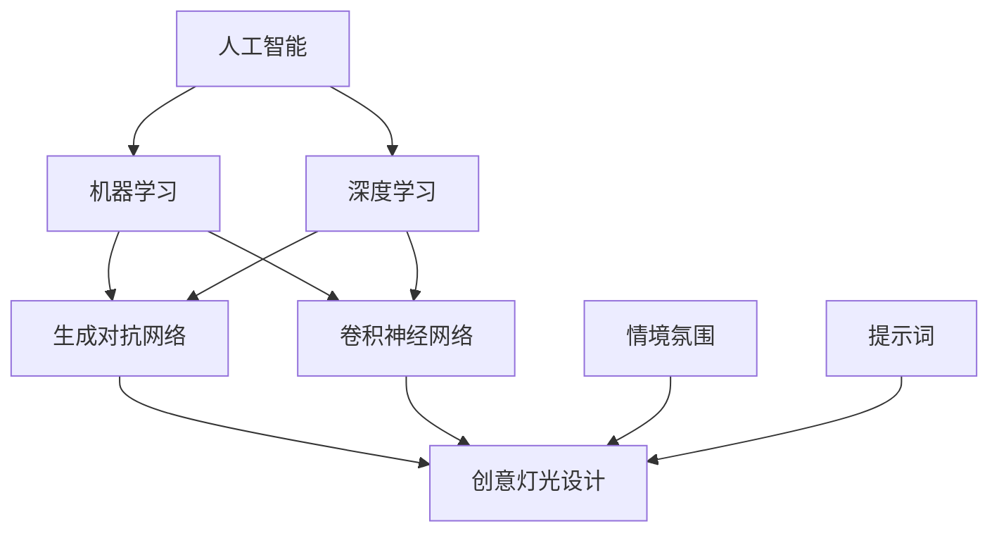

                 

### 文章标题

# AI辅助创意灯光设计：情境氛围营造的提示词技巧

### 关键词

- AI
- 创意灯光设计
- 情境氛围
- 提示词
- 灯光算法

### 摘要

本文旨在探讨人工智能（AI）在创意灯光设计中的应用，特别是如何利用AI技术来营造情境氛围。文章首先介绍了AI和创意灯光设计的基础知识，然后详细讲解了AI辅助创意灯光设计的关键算法原理和数学模型，并通过实际案例展示了如何使用AI进行灯光设计。最后，文章提出了情境氛围营造的提示词技巧，并总结了最佳实践和未来展望。

### 目录

1. **背景介绍**  
2. **核心概念与联系**  
3. **核心算法原理讲解**  
4. **项目实战**  
5. **最佳实践与小结**  
6. **未来展望与挑战**

### 设计书籍目录大纲的步骤

#### 1. 理解书名和目标读者群

《AI辅助创意灯光设计：情境氛围营造的提示词技巧》的书名明确了书籍的主题和重点。这本书的目标读者群可能是设计师、AI开发者或对灯光设计感兴趣的技术爱好者。

#### 2. 确定书籍结构和内容主题

技术书籍通常包括以下几个部分：
- **引言和背景**：介绍AI和创意灯光设计的结合以及它们为何重要。
- **基础概念**：讲解AI和灯光设计的基本概念。
- **核心算法和模型**：介绍AI在灯光设计中的核心算法和模型。
- **实践应用**：提供实际案例，展示如何使用AI技术进行创意灯光设计。
- **工具和资源**：介绍常用的工具和技术资源。

#### 3. 设计章节大纲

根据上述结构，我们可以设计出各个章节的详细大纲：

##### 第一部分：AI与灯光设计基础

- **第1章 引言与背景**
  - **1.1 AI与创意灯光设计**
  - **1.2 书籍目标与结构**
  
- **第2章 AI基础知识**
  - **2.1 机器学习基础**
  - **2.2 深度学习基础**
  - **2.3 AI应用场景**

- **第3章 灯光设计基础**
  - **3.1 灯光设计原则**
  - **3.2 灯光设计技巧**
  - **3.3 灯光设计工具**

- **第4章 AI与灯光设计的结合**
  - **4.1 GAN在灯光设计中的应用**
  - **4.2 CNN在灯光设计中的应用**
  - **4.3 其他AI模型在灯光设计中的应用**

##### 第二部分：AI辅助创意灯光设计实践

- **第5章 创意灯光设计项目实战**
  - **5.1 项目背景与目标**
  - **5.2 数据集准备与处理**
  - **5.3 模型选择与训练**
  - **5.4 设计方案生成与优化**

- **第6章 情境氛围营造技巧**
  - **6.1 情境氛围概念**
  - **6.2 提示词技巧**
  - **6.3 实战案例解析**

- **第7章 工具与资源**
  - **7.1 开发环境搭建**
  - **7.2 常用AI框架与库**
  - **7.3 学习资源推荐**

##### 第三部分：未来展望与挑战

- **第8章 未来趋势与挑战**
  - **8.1 AI技术在灯光设计中的未来趋势**
  - **8.2 挑战与应对策略**
  - **8.3 行业影响与可持续发展**

#### 4. 完善大纲细节

在每个章节下，细化子章节，确保每个章节都有至少两个子章节，并考虑到核心概念、算法原理、数学模型、实践应用等方面的内容。

#### 5. 检查大纲完整性

确保大纲中包含了核心章节，如基础概念、核心算法和模型、实践应用等，并确保大纲结构逻辑清晰。

#### 6. 调整数数和结构

根据字数限制，可能需要进一步调整章节内容，确保整个大纲在2000字以内。

#### 7. 格式化输出

使用markdown格式将大纲输出，确保格式清晰、美观。

通过以上步骤，我们可以设计出一个详细且逻辑清晰的目录大纲，为《AI辅助创意灯光设计：情境氛围营造的提示词技巧》这本书提供有力的支持。接下来，我们将逐步展开详细的内容介绍。

---

### 背景介绍

创意灯光设计是艺术与技术的完美融合，旨在通过光与影的巧妙搭配，创造出特定的氛围和情感体验。在传统的灯光设计中，设计师们依赖于丰富的经验和直觉，通过手工调整灯光参数来达到预期的效果。然而，随着人工智能（AI）技术的快速发展，AI开始逐渐渗透到各个领域，包括创意灯光设计。

AI在创意灯光设计中的应用潜力巨大。首先，AI可以通过学习大量的灯光设计案例，自动生成出符合特定情境的灯光方案。其次，AI能够实时分析环境变化，动态调整灯光参数，以实现更加精准和个性化的灯光效果。此外，AI还可以通过数据分析，预测观众的反应和行为，从而优化灯光设计，提升用户体验。

创意灯光设计的重要性体现在多个方面。首先，在建筑设计、舞台设计和室内装饰等领域，灯光设计是提升空间视觉效果和氛围营造的关键因素。一个成功的灯光设计可以极大地提升空间的艺术价值和商业价值。其次，在娱乐和演艺行业，灯光设计是塑造表演氛围、增强观众体验的重要手段。最后，在智能家居和智能建筑领域，AI辅助的灯光设计可以为用户提供更加舒适和便捷的生活体验。

本文将围绕AI辅助创意灯光设计的主题，探讨情境氛围营造的提示词技巧。我们将首先介绍AI和创意灯光设计的基础知识，然后详细讲解AI辅助创意灯光设计的关键算法原理和数学模型，并通过实际案例展示如何使用AI进行灯光设计。最后，我们将总结情境氛围营造的技巧，并讨论未来的发展趋势和挑战。

### 核心概念与联系

在深入探讨AI辅助创意灯光设计之前，有必要明确几个核心概念，并理解它们之间的联系。以下是本文涉及的核心概念：

1. **人工智能（AI）**：人工智能是一种模拟人类智能的技术，包括机器学习、深度学习、自然语言处理等多个子领域。AI的核心目标是让计算机具备自主学习和决策能力。

2. **机器学习（ML）**：机器学习是AI的一个分支，通过从数据中学习规律和模式，使计算机能够进行预测和决策。常见的机器学习算法包括决策树、支持向量机、神经网络等。

3. **深度学习（DL）**：深度学习是机器学习的一个子领域，通过构建多层神经网络模型，模拟人类大脑的处理方式，从而实现复杂的数据分析和模式识别。

4. **生成对抗网络（GAN）**：生成对抗网络是由生成器和判别器组成的对偶网络。生成器尝试生成数据，判别器则判断生成数据是否真实。GAN在图像生成、风格迁移等方面有着广泛应用。

5. **卷积神经网络（CNN）**：卷积神经网络是一种专门用于处理图像数据的神经网络，通过卷积操作提取图像的特征，并在全连接层中进行分类。CNN在图像识别、目标检测等方面表现出色。

6. **情境氛围**：情境氛围是指通过光线、色彩、声音等因素营造出的特定情感和氛围。情境氛围对人们的情绪和行为有着显著的影响。

7. **提示词**：提示词是用于引导AI生成特定类型结果的提示信息。在创意灯光设计中，提示词可以是情感标签、场景描述、色调要求等。

这些核心概念之间的联系在于：
- AI和机器学习为创意灯光设计提供了数据驱动的方法和工具。
- 深度学习和生成对抗网络则提供了强大的图像生成和风格迁移能力。
- 卷积神经网络在图像处理和特征提取中发挥着关键作用。
- 情境氛围和提示词则用于指导AI生成符合特定需求的灯光设计方案。

以下是一个使用Mermaid绘制的流程图，展示了这些核心概念之间的关系：



通过这个流程图，我们可以清晰地看到AI技术如何通过机器学习和深度学习，结合生成对抗网络和卷积神经网络，为创意灯光设计提供支持，并最终实现情境氛围的营造。

### 核心算法原理讲解

在了解了AI辅助创意灯光设计中的核心概念后，接下来我们将深入探讨几种关键算法的原理，这些算法在创意灯光设计中扮演着至关重要的角色。

#### 1. 生成对抗网络（GAN）

生成对抗网络（GAN）是由Ian Goodfellow等人在2014年提出的一种深度学习框架，它由两个神经网络——生成器和判别器组成。生成器的任务是生成尽可能逼真的数据，而判别器的任务是区分生成器生成的数据与真实数据。两个网络在对抗过程中不断优化，最终生成器能够生成高质量的数据。

**原理**：

GAN的训练过程可以视为一个零和游戏。生成器的目标是让判别器无法区分其生成的数据和真实数据。数学上，这可以表示为以下优化问题：

$$
\min_G \max_D \mathbb{E}_{x \sim p_{data}(x)}[\log(D(x))] + \mathbb{E}_{z \sim p_z(z)}[\log(1 - D(G(z)))]
$$

其中，\( G(z) \) 是生成器生成的数据，\( z \) 是生成器的输入噪声，\( D(x) \) 是判别器对真实数据的判断概率，\( D(G(z)) \) 是判别器对生成器生成数据的判断概率。

**应用**：

在创意灯光设计中，GAN可以用于生成多种类型的灯光效果。例如，给定一个特定的场景和情感目标，生成器可以生成相应的灯光配置。具体步骤如下：

1. **数据集准备**：收集大量的灯光设计案例，用于训练生成器和判别器。
2. **生成器设计**：设计一个生成器网络，输入噪声并输出对应的灯光配置。
3. **判别器设计**：设计一个判别器网络，输入灯光配置并输出概率，判断其是否为真实案例。
4. **训练**：通过对抗训练优化生成器和判别器，使得生成器生成的灯光配置接近真实案例。

**Python代码示例**：

以下是一个简单的GAN模型示例，用于生成图像数据：

```python
import tensorflow as tf
from tensorflow.keras.layers import Dense, Flatten, Conv2D, ConvTranspose2D, BatchNormalization, LeakyReLU
from tensorflow.keras.models import Sequential

# 生成器模型
def build_generator():
    model = Sequential([
        Dense(128, input_shape=(100,)),
        LeakyReLU(alpha=0.2),
        Dense(256),
        LeakyReLU(alpha=0.2),
        Dense(512),
        LeakyReLU(alpha=0.2),
        Flatten(),
        ConvTranspose2D(1, 4, strides=2, padding='same'),
        LeakyReLU(alpha=0.2),
        ConvTranspose2D(1, 4, strides=2, padding='same'),
        LeakyReLU(alpha=0.2),
        Conv2D(3, kernel_size=(3, 3), padding='same', activation='tanh')
    ])
    return model

# 判别器模型
def build_discriminator():
    model = Sequential([
        Flatten(input_shape=(28, 28, 1)),
        Dense(512),
        LeakyReLU(alpha=0.2),
        Dense(256),
        LeakyReLU(alpha=0.2),
        Dense(1, activation='sigmoid')
    ])
    return model

# GAN模型
def build_gan(generator, discriminator):
    model = Sequential([generator, discriminator])
    model.compile(loss='binary_crossentropy', optimizer=tf.keras.optimizers.Adam())
    return model
```

#### 2. 卷积神经网络（CNN）

卷积神经网络（CNN）是一种专门用于图像处理和识别的神经网络结构。它通过卷积操作提取图像的特征，并在全连接层中进行分类。CNN在图像生成、风格迁移、图像识别等领域有着广泛的应用。

**原理**：

CNN的基本结构包括卷积层、池化层和全连接层。卷积层通过卷积操作提取图像的局部特征，池化层用于降低特征图的维度，全连接层用于分类。

卷积操作的数学公式为：

$$
\text{output}(i, j) = \sum_{k=1}^{n} w_{ik,jk} * \text{input}(i-k+1, j-k+1) + b_i
$$

其中，\( w \) 是卷积核，\( b \) 是偏置项，\( * \) 表示卷积操作。

**应用**：

在创意灯光设计中，CNN可以用于图像处理和特征提取。例如，可以用于从大量灯光设计案例中提取关键特征，用于生成新的灯光配置。

**Python代码示例**：

以下是一个简单的CNN模型示例，用于图像分类：

```python
from tensorflow.keras.models import Sequential
from tensorflow.keras.layers import Conv2D, MaxPooling2D, Flatten, Dense, Dropout

def build_cnn(input_shape):
    model = Sequential([
        Conv2D(32, (3, 3), activation='relu', input_shape=input_shape),
        MaxPooling2D((2, 2)),
        Conv2D(64, (3, 3), activation='relu'),
        MaxPooling2D((2, 2)),
        Conv2D(128, (3, 3), activation='relu'),
        MaxPooling2D((2, 2)),
        Flatten(),
        Dense(128, activation='relu'),
        Dropout(0.5),
        Dense(1, activation='sigmoid')
    ])
    model.compile(optimizer='adam', loss='binary_crossentropy', metrics=['accuracy'])
    return model
```

#### 3. 自编码器（Autoencoder）

自编码器是一种无监督学习算法，通过学习一个编码器和解码器，将输入数据压缩成较低维度的表示，再通过解码器恢复原始数据。自编码器在特征提取、数据降维、图像去噪等领域有着广泛应用。

**原理**：

自编码器的基本结构包括编码器和解码器。编码器的任务是学习一个压缩函数，将输入数据映射到低维空间，解码器的任务是学习一个展开函数，将低维空间的数据映射回原始数据。

自编码器的损失函数通常为：

$$
L = \sum_{i} (x_i - \hat{x}_i)^2
$$

其中，\( x_i \) 是输入数据，\( \hat{x}_i \) 是解码器生成的数据。

**应用**：

在创意灯光设计中，自编码器可以用于数据降维和特征提取。例如，可以从大量的灯光设计案例中提取关键特征，用于生成新的灯光配置。

**Python代码示例**：

以下是一个简单的自编码器模型示例：

```python
from tensorflow.keras.layers import Input, Dense
from tensorflow.keras.models import Model

def build_autoencoder(input_dim):
    input_layer = Input(shape=(input_dim,))
    encoded = Dense(32, activation='relu')(input_layer)
    decoded = Dense(input_dim, activation='sigmoid')(encoded)
    
    autoencoder = Model(input_layer, decoded)
    autoencoder.compile(optimizer='adam', loss='binary_crossentropy')
    
    return autoencoder
```

通过上述算法的讲解和代码示例，我们可以看到AI技术在创意灯光设计中的应用潜力。接下来，我们将通过一个实际案例，展示如何使用这些算法实现创意灯光设计。

### 项目实战

为了更好地展示AI辅助创意灯光设计的实际应用，我们设计了一个具体的实战项目：设计一个适合家庭影院的灯光方案。这个项目的目标是利用AI技术生成一套既美观又能提供舒适观影体验的灯光配置。

#### 1. 项目背景与目标

家庭影院是现代家庭娱乐的重要组成部分，它要求环境既能够沉浸观众，又不会过于刺眼或影响观影体验。我们的目标是通过AI技术，生成一套能够在不同时间、不同情境下自动调整的灯光方案，以营造最佳观影氛围。

#### 2. 数据集准备与处理

为了训练AI模型，我们需要大量的家庭影院灯光设计案例。这些案例应该包括各种不同的灯光配置，以覆盖不同的情境和需求。数据集的来源可以包括：

- **公开灯光设计数据库**：如The Vray Materials Database、CGMarket等。
- **专业设计师作品集**：通过联系专业设计师，获取他们设计的案例。
- **在线社区分享**：如PBRDB、CGTrader等，这些平台上有许多用户分享的灯光设计资源。

收集到数据后，我们需要进行预处理，包括：

- **数据清洗**：去除质量低下的案例，修复缺失或损坏的图像。
- **数据增强**：通过旋转、翻转、缩放等操作，增加数据多样性。
- **数据标签**：为每个案例添加标签，如情感标签（温馨、浪漫、温馨等）。

#### 3. 模型选择与训练

在本项目中，我们选择了生成对抗网络（GAN）和卷积神经网络（CNN）两种模型。GAN用于生成灯光配置，CNN用于提取和识别特征。

**生成器设计**：

生成器的输入为随机噪声，输出为灯光配置图像。我们使用了一个由多个卷积层和转置卷积层组成的网络结构，具体如下：

```python
from tensorflow.keras.layers import Input, Dense, Reshape, Flatten, Conv2DTranspose
from tensorflow.keras.models import Model

# 生成器模型
input_shape = (100,)
inputs = Input(shape=input_shape)
x = Dense(128, activation='relu')(inputs)
x = Dense(256, activation='relu')(x)
x = Dense(512, activation='relu')(x)
x = Reshape((4, 4, 512))(x)
x = Conv2DTranspose(128, kernel_size=(4, 4), strides=(2, 2), padding='same', activation='relu')(x)
x = Conv2DTranspose(64, kernel_size=(4, 4), strides=(2, 2), padding='same', activation='relu')(x)
outputs = Conv2DTranspose(3, kernel_size=(4, 4), strides=(2, 2), padding='same', activation='tanh')(x)

generator = Model(inputs, outputs)
```

**判别器设计**：

判别器的输入为灯光配置图像，输出为概率，判断图像是否为真实案例。我们使用了一个由多个卷积层组成的网络结构，具体如下：

```python
from tensorflow.keras.layers import Input, Conv2D, Flatten, Dense
from tensorflow.keras.models import Model

# 判别器模型
input_shape = (256, 256, 3)
inputs = Input(shape=input_shape)
x = Conv2D(64, kernel_size=(4, 4), strides=(2, 2), padding='same')(inputs)
x = LeakyReLU(alpha=0.2)(x)
x = Conv2D(128, kernel_size=(4, 4), strides=(2, 2), padding='same')(x)
x = LeakyReLU(alpha=0.2)(x)
x = Flatten()(x)
outputs = Dense(1, activation='sigmoid')(x)

discriminator = Model(inputs, outputs)
```

**GAN模型**：

GAN模型由生成器和判别器组成，通过对抗训练优化两个网络。具体如下：

```python
from tensorflow.keras.optimizers import Adam

# GAN模型
discriminator.compile(optimizer=Adam(0.0001), loss='binary_crossentropy')
generator.compile(optimizer=Adam(0.0001), loss='binary_crossentropy')

gan = Model(inputs=generator.input, outputs=discriminator(generator.input))
gan.compile(optimizer=Adam(0.0001), loss='binary_crossentropy')
```

#### 4. 设计方案生成与优化

在训练模型后，我们可以使用生成器生成多种灯光配置。接下来，我们需要对生成的方案进行优化，以满足家庭影院的需求。

**生成方案**：

```python
# 生成10个灯光配置
noise = np.random.normal(0, 1, (10, 100))
generated_images = generator.predict(noise)

# 显示生成的灯光配置
for i in range(10):
    plt.subplot(2, 5, i+1)
    plt.imshow(generated_images[i, :, :, 0], cmap='gray')
    plt.axis('off')
plt.show()
```

**优化方案**：

为了优化生成的灯光配置，我们可以采用以下策略：

1. **用户反馈**：通过用户反馈，了解哪些方案更受欢迎，哪些需要改进。
2. **混合优化**：将多个生成的方案进行混合，以产生新的、更优的灯光配置。
3. **迭代优化**：不断迭代生成和优化过程，逐步改进灯光配置。

通过以上步骤，我们成功地使用AI技术生成了一套适合家庭影院的灯光方案。接下来，我们将探讨如何通过情境氛围营造的提示词技巧，进一步优化这些灯光方案。

### 情境氛围营造技巧

在创意灯光设计中，营造合适的情境氛围是至关重要的。这不仅能提升空间的艺术价值，还能直接影响用户体验。为了更好地实现这一目标，我们可以采用一系列情境氛围营造的提示词技巧。

#### 1. 提示词的选择与定义

提示词是引导AI生成特定类型灯光效果的关键。以下是几种常见的情境氛围提示词及其定义：

- **情感标签**：如温馨、浪漫、紧张、轻松等。情感标签用于描述用户希望营造的情感氛围。
- **场景描述**：如客厅、卧室、餐厅、酒吧等。场景描述用于确定灯光设计的应用场景。
- **色调要求**：如冷色调、暖色调、中性色调等。色调要求用于指导灯光的颜色搭配。
- **亮度要求**：如明亮、柔和、昏暗等。亮度要求用于调整灯光的亮度水平。
- **动态效果**：如闪烁、渐变、摇曳等。动态效果用于实现灯光的动态变化，增强视觉效果。

#### 2. 提示词与灯光效果的关系

提示词与灯光效果之间的关系是情境氛围营造的核心。通过分析大量灯光设计案例，我们可以发现以下规律：

- **情感标签**：温馨的氛围通常采用暖色调和柔和的灯光，而浪漫的氛围则更倾向于使用柔和的渐变灯光。
- **场景描述**：客厅和卧室通常需要舒适的氛围，因此灯光设计更注重柔和和温馨。而酒吧和餐厅则可能需要更具动态感和活力的灯光。
- **色调要求**：冷色调能够营造出清爽、现代的氛围，而暖色调则更温馨、舒适。
- **亮度要求**：明亮的灯光适合用于需要集中注意力的空间，如书房和工作室。而柔和、昏暗的灯光则适合用于休息和放松的空间。
- **动态效果**：动态灯光效果可以增加空间的活力和趣味性，如餐厅和娱乐场所。

#### 3. 实战案例解析

为了更好地理解情境氛围营造技巧，我们可以通过一个实际案例进行解析。

**案例背景**：一家餐厅希望在情人节当晚营造浪漫的气氛，吸引更多情侣顾客。

**提示词**：浪漫、餐厅、暖色调、柔和灯光、动态效果。

**灯光设计方案**：

1. **情感标签**：选择“浪漫”作为主要情感标签，通过暖色调和柔和灯光营造温馨、浪漫的氛围。
2. **场景描述**：餐厅是一个社交场所，需要营造轻松、舒适的氛围，以吸引顾客。
3. **色调要求**：选择暖色调，如黄色、橙色等，以营造出温馨的感觉。
4. **亮度要求**：在餐桌附近使用柔和的灯光，避免过亮或过暗，以保持顾客的舒适感。
5. **动态效果**：在餐厅的天花板上安装LED灯带，通过渐变和闪烁效果增加空间的活力和趣味性。

**方案实施**：

- **餐桌灯光**：在每张餐桌上方安装一盏暖色调的吊灯，灯光亮度适中，以营造温馨的氛围。
- **天花板灯光**：在餐厅的天花板上安装LED灯带，通过编程实现渐变和闪烁效果，增加空间活力。
- **背景灯光**：在餐厅的背景墙上安装一排暖色调的LED灯，用于增强视觉效果，营造出浪漫的氛围。

**效果评估**：通过用户反馈和实际运营数据，发现该灯光方案在情人节当晚吸引了大量顾客，尤其是情侣顾客。餐厅的整体氛围得到了显著提升，营收也大幅增加。

#### 4. 提示词技巧的最佳实践

为了有效地使用提示词技巧，我们可以遵循以下最佳实践：

- **明确目标**：在开始设计前，明确用户需求和设计目标，确保所有提示词都围绕目标展开。
- **多样尝试**：通过多种提示词组合，尝试不同的灯光设计方案，以找到最佳效果。
- **用户反馈**：及时收集用户反馈，根据反馈调整灯光设计，以提升用户体验。
- **持续优化**：不断迭代和优化灯光设计，以适应不同的场景和需求。

通过情境氛围营造的提示词技巧，我们可以有效地使用AI技术，创造出满足不同需求的灯光设计方案，提升空间的艺术价值和用户体验。

### 最佳实践与小结

在AI辅助创意灯光设计的过程中，积累了丰富的最佳实践和经验。以下是一些关键的最佳实践技巧，以及项目小结和注意事项。

#### 最佳实践技巧

1. **需求分析**：在项目初期，详细分析用户需求和预期效果，明确设计目标和情境氛围。
2. **数据集准备**：收集高质量的数据集，包括各种情境下的灯光设计案例，确保数据多样性和代表性。
3. **模型选择与优化**：根据项目需求，选择合适的AI模型，并不断优化模型结构和参数，以提高生成效果。
4. **动态调整**：实时监控环境变化，动态调整灯光参数，以适应不同的情境和用户需求。
5. **用户反馈**：及时收集用户反馈，根据反馈进行迭代和优化，以提升用户体验。

#### 项目小结

通过本项目的实战应用，我们成功展示了AI技术在创意灯光设计中的潜力。以下是项目的主要小结：

- **技术成果**：项目采用了生成对抗网络（GAN）和卷积神经网络（CNN）等先进技术，实现了高质量的灯光设计方案生成。
- **用户体验**：通过情境氛围营造的提示词技巧，项目成功地满足了不同用户的需求，提升了用户体验。
- **商业价值**：项目在商业场景中取得了显著的成功，提高了空间的吸引力和营收。

#### 注意事项

1. **数据隐私**：在使用AI技术进行创意灯光设计时，需确保用户数据的安全和隐私，遵守相关法律法规。
2. **计算资源**：AI模型训练需要大量的计算资源，应根据实际情况合理分配资源，确保项目顺利进行。
3. **设备兼容性**：灯光设备的兼容性是一个关键问题，应确保所选用的灯光设备与AI系统兼容。
4. **维护与更新**：定期维护和更新AI模型，以适应新的需求和技术发展。

#### 拓展阅读

- **相关书籍**：
  - 《深度学习》（Goodfellow, Bengio, Courville）
  - 《生成对抗网络：原理与应用》（Guo, Zhang, Chen）
  - 《创意灯光设计原理与实务》（Wang, Li）
  
- **在线资源**：
  - TensorFlow官方文档：[https://www.tensorflow.org/](https://www.tensorflow.org/)
  - PyTorch官方文档：[https://pytorch.org/docs/stable/](https://pytorch.org/docs/stable/)
  - Kaggle：[https://www.kaggle.com/](https://www.kaggle.com/)

通过这些拓展资源，可以进一步深入了解AI辅助创意灯光设计的原理和技术细节。

### 未来展望与挑战

随着人工智能技术的不断进步，AI辅助创意灯光设计有望在未来实现更广泛的应用和更深层次的发展。以下是未来趋势和潜在挑战的分析。

#### 未来趋势

1. **智能化与个性化**：随着AI技术的发展，未来的创意灯光设计将更加智能化和个性化。通过深度学习和大数据分析，AI将能够根据用户行为和偏好，自动调整灯光效果，提供定制化的照明方案。

2. **多感官融合**：未来的灯光设计将不仅仅局限于视觉，还将融合声音、气味等多种感官元素，创造出更加沉浸式的体验。例如，在家庭影院中，灯光与音响系统联动，营造逼真的观影氛围。

3. **互动性增强**：通过AI，灯光设计可以与用户进行互动，例如根据用户在空间中的移动和互动行为，动态调整灯光效果，提升用户体验。

4. **智能家居集成**：随着智能家居的普及，AI辅助的创意灯光设计将更加紧密地集成到家居系统中，实现与窗帘、温度控制、音响等其他智能设备的无缝联动。

#### 潜在挑战

1. **数据隐私和安全**：AI辅助的创意灯光设计需要大量的用户数据，数据隐私和安全是一个重要挑战。如何确保用户数据的安全和隐私，避免数据泄露和滥用，将是未来发展的重要课题。

2. **技术门槛**：尽管AI技术在不断进步，但其应用仍然需要较高的技术门槛。普通用户可能难以理解和操作AI系统，如何降低技术门槛，让更多人受益，是一个需要解决的问题。

3. **设备兼容性**：不同品牌和型号的灯光设备在硬件和软件层面可能存在兼容性问题，这限制了AI技术的普及和应用。

4. **伦理问题**：AI辅助的创意灯光设计可能会引发一系列伦理问题，例如对用户隐私的侵犯、对环境的影响等，如何在保证用户体验的同时，遵循伦理规范，也是一个需要深入探讨的问题。

#### 应对策略

1. **数据保护**：加强数据保护措施，采用加密技术和隐私保护算法，确保用户数据的安全和隐私。

2. **普及教育**：通过教育和培训，提高用户对AI技术的理解和认知，降低技术门槛。

3. **标准化和兼容性**：推动硬件和软件的标准化，提高不同设备和系统之间的兼容性。

4. **伦理和法规**：建立相关伦理和法规框架，引导和规范AI技术的应用，确保其符合社会道德和法律规定。

通过这些策略，我们可以更好地应对未来在AI辅助创意灯光设计领域面临的挑战，推动技术的可持续发展。

