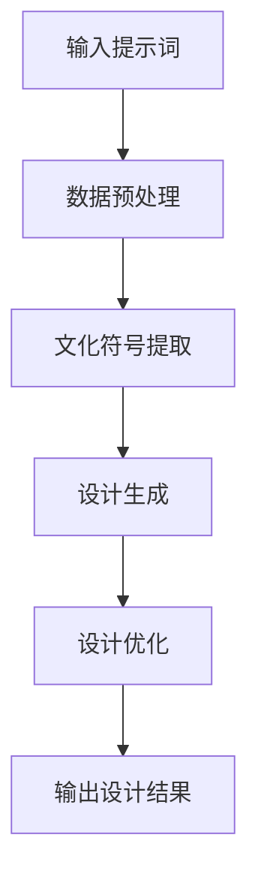

                 

### 标题：AI辅助创意珠宝设计：文化符号融合的提示词技巧

> 关键词：AI、珠宝设计、文化符号、提示词、融合技巧

> 摘要：本文将探讨人工智能（AI）在珠宝设计领域的应用，特别是如何利用文化符号融合的提示词技巧，提高创意设计能力。文章分为三个部分：首先介绍AI与珠宝设计结合的背景；然后深入探讨AI辅助创意珠宝设计的核心概念和算法原理；最后通过项目实战案例展示AI在实际珠宝设计中的应用，并提供实用的技巧和未来展望。

## 引言

在现代社会，人工智能（AI）正迅速改变着各行各业的运作方式，其中艺术领域，尤其是珠宝设计，也逐渐开始受益于AI技术的进步。传统的珠宝设计往往依赖于设计师的个人经验和审美观点，但AI的出现为这一过程带来了全新的变革。AI可以通过大数据分析和机器学习算法，帮助设计师发现新的设计灵感和趋势，从而提高创意设计的效率和质量。

珠宝设计不仅是一项艺术创作，更是一种文化表达。每件珠宝都蕴含着特定的文化符号，这些符号可以是传统的、现代的，甚至是个性化的。因此，如何将这些文化符号巧妙地融合到珠宝设计中，成为了设计师们面临的重要挑战。AI的应用为这一过程提供了有力的支持，通过提示词技巧，AI能够帮助设计师更准确地捕捉文化符号的内涵，并创造出更具创意和文化价值的珠宝作品。

本文将围绕AI辅助创意珠宝设计展开讨论，具体内容包括：

1. **背景介绍**：回顾AI在珠宝设计领域的应用现状和趋势。
2. **核心概念与联系**：分析AI辅助创意珠宝设计的核心概念，并使用Mermaid流程图展示其关系架构。
3. **算法原理讲解**：深入讲解AI辅助创意珠宝设计的核心算法原理，结合Python源代码和数学模型进行详细阐述。
4. **项目实战**：通过实际项目案例展示AI在实际珠宝设计中的应用，提供源代码详细实现和代码解读。
5. **最佳实践 tips**：总结实践经验，提供实用的技巧和建议。
6. **小结与展望**：对全文进行总结，并对AI辅助珠宝设计的未来进行展望。

## 背景介绍

AI在珠宝设计领域的应用始于20世纪末，随着计算机技术和算法的不断发展，AI在珠宝设计中的应用也越来越广泛。从最初的数据分析到机器学习，再到深度学习，AI技术的进步为珠宝设计提供了强大的工具。

在数据分析阶段，AI主要用于对大量珠宝设计数据进行分析，以发现潜在的设计趋势和消费者偏好。通过分析销售数据、用户评论和市场趋势，设计师可以更好地了解市场需求，从而调整自己的设计方向。这一阶段的应用虽然不能直接提高设计创意，但为设计师提供了重要的参考信息。

随着机器学习技术的发展，AI开始在珠宝设计中发挥更为直接的作用。机器学习算法可以通过对大量设计作品的训练，学会识别和生成不同风格的设计。例如，一些AI系统可以通过学习大量的珠宝设计图片，自动生成符合市场需求的新设计。这不仅提高了设计师的工作效率，还开辟了新的设计思路。

深度学习的出现进一步推动了AI在珠宝设计中的应用。深度学习算法可以处理更复杂的图像数据，识别更多的设计细节和风格特征。通过深度学习，AI可以更准确地捕捉文化符号的内涵，并将其融入珠宝设计中。例如，一些AI系统可以通过分析不同文化背景下的珠宝设计，提取出关键的文化符号，并生成具有特定文化内涵的新设计。

### 珠宝设计中的AI应用现状

目前，AI在珠宝设计中的应用已经取得了显著的成果。许多珠宝设计公司开始使用AI工具来辅助设计过程，以下是一些常见的AI应用场景：

1. **设计灵感的生成**：AI可以通过分析大量的设计图片和用户反馈，自动生成新的设计灵感。这些灵感不仅包括整体设计风格，还涉及到珠宝的细节元素，如珠宝的颜色、形状和材质。

2. **风格迁移与融合**：通过深度学习，AI可以将不同风格的设计进行融合，创造出新的设计作品。例如，将古典珠宝设计与现代设计元素结合，形成独特的风格。

3. **设计优化**：AI可以通过优化算法，对现有的设计进行改进，提高设计的可佩戴性和美观度。例如，AI可以自动调整珠宝的尺寸和形状，使其更符合人体的轮廓。

4. **定制设计**：基于用户的需求和偏好，AI可以生成个性化的珠宝设计。这不仅满足了用户的个性化需求，还提高了品牌的竞争力。

5. **市场预测与销售分析**：AI可以通过分析市场数据，预测未来的设计趋势和消费者偏好，帮助设计师更好地制定市场策略。

尽管AI在珠宝设计中的应用取得了很大的进展，但仍面临一些挑战。首先，AI的设计结果需要经过设计师的进一步调整和优化，以确保设计符合市场的要求。其次，AI需要更多的训练数据和算法优化，以提高设计准确性和创意性。此外，AI的应用也需要遵守相关的法律法规，确保设计的原创性和知识产权保护。

### AI在珠宝设计中的未来趋势

随着AI技术的不断进步，未来AI在珠宝设计中的应用将会更加广泛和深入。以下是一些可能的未来趋势：

1. **更加智能化的设计工具**：随着深度学习和自然语言处理技术的发展，AI设计工具将变得更加智能，能够更准确地理解和生成设计需求。例如，AI可以通过自然语言描述，自动生成符合描述的设计作品。

2. **跨领域的融合创新**：AI将与其他领域的技术，如虚拟现实（VR）、增强现实（AR）和区块链等相结合，为珠宝设计带来更多的创新可能性。例如，VR/AR技术可以用于设计过程中的虚拟试戴，区块链技术可以用于珠宝设计的版权保护和供应链管理。

3. **个性化与定制化**：随着消费者对个性化需求的增加，AI将在珠宝定制化设计中发挥更大的作用。通过AI技术，设计师可以更快速地生成满足用户个性化需求的珠宝设计。

4. **设计教育的影响**：AI技术将对珠宝设计教育产生深远的影响。通过AI工具，学生可以更早地接触到设计实践，提高设计技能和创新能力。

5. **AI与人类设计师的协作**：未来，AI将更多地与人类设计师协作，共同完成珠宝设计项目。AI将负责数据分析和设计生成，而设计师则负责创意和审美判断，实现优势互补。

总之，AI在珠宝设计领域的应用前景非常广阔，随着技术的不断进步，AI将不仅提高设计效率，还将推动珠宝设计的创新和发展。设计师们需要不断学习和适应AI技术，利用AI工具提升自己的设计能力，为珠宝设计行业带来更多的变革。

## 核心概念与联系

### 文化符号融合

文化符号融合是指将不同文化背景下的符号元素巧妙地融合到珠宝设计中，以传达特定的文化内涵和艺术价值。文化符号可以是历史、传统、现代或甚至是个性化的元素。在珠宝设计中，文化符号融合不仅增强了珠宝的艺术性，还使其具有更高的文化价值和独特性。

### 提示词

提示词（Prompt）是AI算法用于指导设计过程的关键输入。提示词可以包含各种文化元素、设计风格、材质信息等，通过提示词，AI可以更好地理解设计需求，生成符合预期的新设计。在AI辅助珠宝设计中，提示词的设计至关重要，它直接影响设计结果的质量和创意程度。

### Mermaid流程图

Mermaid是一种基于Markdown的图表绘制工具，它可以方便地创建流程图、UML图、时序图等。在AI辅助珠宝设计的过程中，使用Mermaid流程图可以清晰地展示设计流程、数据流和算法架构。

### Mermaid流程图示意

下面是一个简化的Mermaid流程图，用于展示AI辅助珠宝设计的基本流程：



**流程解释**：

1. **输入提示词**：设计者提供包含文化元素和设计需求的提示词，例如“融合中国传统元素和现代设计风格”。
2. **数据预处理**：AI系统对输入的提示词进行预处理，提取关键信息，并将其转换为机器可以理解的形式。
3. **文化符号提取**：通过机器学习算法，AI系统从大量的珠宝设计数据库中提取出与提示词相关的文化符号元素。
4. **设计生成**：AI系统根据提取的文化符号，生成初步的珠宝设计模型。
5. **设计优化**：AI系统对生成的设计进行优化，包括调整设计参数，确保设计的合理性和美观性。
6. **输出设计结果**：最终的设计结果输出给设计者，供进一步修改和调整。

### 关系架构

在AI辅助珠宝设计的整体架构中，文化符号融合和提示词是核心组成部分，它们相互关联，共同推动设计过程。Mermaid流程图清晰地展示了这一过程，从输入提示词开始，经过一系列数据处理和算法应用，最终生成满足设计需求的新设计。

文化符号融合和提示词的关系可以理解为：提示词是设计需求的输入，文化符号是设计灵感的来源，而AI算法则是将这两者融合的桥梁。通过提示词，AI系统能够准确地捕捉设计需求，并通过文化符号提取和融合，生成具有独特文化内涵和艺术价值的珠宝设计。

### 文化符号提取算法

文化符号提取是AI辅助珠宝设计的关键步骤，它决定了设计的创意性和文化价值。以下是一个简化的Python源代码示例，用于展示文化符号提取的基本算法：

```python
import tensorflow as tf
from tensorflow.keras.models import Sequential
from tensorflow.keras.layers import Conv2D, MaxPooling2D, Flatten, Dense

# 假设已经训练好了文化符号识别模型
model = Sequential([
    Conv2D(32, (3, 3), activation='relu', input_shape=(64, 64, 3)),
    MaxPooling2D((2, 2)),
    Conv2D(64, (3, 3), activation='relu'),
    MaxPooling2D((2, 2)),
    Flatten(),
    Dense(128, activation='relu'),
    Dense(1, activation='sigmoid')
])

model.compile(optimizer='adam', loss='binary_crossentropy', metrics=['accuracy'])

# 加载训练好的模型权重
model.load_weights('cultural_symbols_model.h5')

# 输入一张珠宝设计图片
input_image = load_image('example_jewelry_design.jpg')

# 提取文化符号
predicted_symbols = model.predict(input_image)

# 解码预测结果，得到主要的文化符号
primary_symbols = decode_symbols(predicted_symbols)

print("主要的文化符号：", primary_symbols)
```

**算法解释**：

1. **模型构建**：使用卷积神经网络（CNN）模型，用于识别珠宝设计中的文化符号。模型由多个卷积层、池化层和全连接层组成，能够处理图像数据并提取特征。
2. **加载模型**：从预训练的模型中加载权重，用于符号提取。
3. **输入图片**：加载一张珠宝设计图片作为输入。
4. **提取符号**：通过模型对输入图片进行预测，得到主要的文化符号。
5. **解码结果**：将预测结果解码，输出主要的文化符号。

通过这样的算法，AI系统能够从珠宝设计图片中自动提取出主要的文化符号，为后续的设计生成和优化提供依据。

### 提示词设计

提示词设计是AI辅助珠宝设计的核心环节，它决定了设计生成过程的方向和创意程度。一个好的提示词能够引导AI系统生成具有独特文化内涵和艺术价值的珠宝设计。

以下是一个具体的提示词设计示例：

```
"融合中国传统元素和现代设计风格，创造一款适合年轻人佩戴的项链，要求设计具有创新性和实用性，材质为18K黄金和蓝宝石。"
```

**提示词解析**：

1. **文化元素**：中国传统元素，如龙、凤、云纹等。
2. **设计风格**：现代设计风格，如简洁、线条流畅等。
3. **佩戴对象**：年轻人，设计要符合年轻人的审美和需求。
4. **材质**：18K黄金和蓝宝石，突出珠宝的奢华感。
5. **设计要求**：创新性和实用性，设计要新颖且易于佩戴。

通过这样的提示词设计，AI系统能够明确地理解设计需求，从而生成符合预期的新设计。

### 提示词与设计结果的关系

提示词与设计结果之间存在密切的关联。提示词中的文化元素、设计风格和要求直接影响设计生成过程和最终的设计结果。例如，一个包含中国传统元素和现代设计风格的提示词，将引导AI系统生成具有传统与现代结合的珠宝设计。

以下是一个具体的例子，展示如何通过提示词生成设计结果：

```python
# 提示词示例
prompt = "融合中国传统元素和现代设计风格，创造一款适合年轻人佩戴的项链，要求设计具有创新性和实用性，材质为18K黄金和蓝宝石。"

# 设计生成过程
design = AI_Jewelry_Designer.generate_design(prompt)

# 输出设计结果
print("设计结果：", design)
```

**设计结果解析**：

- **外观**：项链设计融合了传统的龙凤图案和现代简洁线条，整体风格简约且富有动感。
- **材质**：使用18K黄金和蓝宝石，突显珠宝的奢华感。
- **实用性**：设计考虑了佩戴舒适性，项链长度适中，佩戴方便。
- **创新性**：传统元素与现代设计的融合，体现了设计创新性。

通过这样的设计生成过程，AI系统能够根据提示词生成具有高度创意和文化价值的珠宝设计，满足设计者的需求。

### 总结

通过上述分析，可以看出AI辅助创意珠宝设计的核心概念和算法原理是如何相互关联和协同工作的。文化符号融合和提示词设计是设计过程的关键组成部分，它们共同引导AI系统生成具有独特文化内涵和艺术价值的珠宝设计。同时，通过Mermaid流程图和Python源代码示例，我们更加清晰地理解了整个设计流程和算法实现。这些核心概念和原理的深入探讨，为后续的设计实践和项目实战奠定了坚实的基础。

## 算法原理讲解

### 文化符号融合算法

文化符号融合是AI辅助珠宝设计中的关键步骤，它旨在将不同文化背景下的符号元素巧妙地融合到珠宝设计中，以传达特定的文化内涵和艺术价值。以下是文化符号融合算法的基本原理和实现方法。

#### 原理

文化符号融合算法的核心在于识别和提取设计图片中的文化符号，然后根据设计的提示词，将提取的符号进行融合，生成新的设计。该算法可以分为以下几个步骤：

1. **文化符号识别**：使用卷积神经网络（CNN）对珠宝设计图片中的文化符号进行识别。CNN能够提取图像中的局部特征，从而识别出文化符号。
2. **符号特征提取**：对识别出的文化符号进行特征提取，将其转换为向量表示。这些向量表示了符号的视觉特征，可用于后续的融合操作。
3. **符号融合**：根据提示词中的文化元素要求，将提取的符号特征进行融合。融合方法可以采用矩阵乘法、特征拼接或其他先进的融合技术。
4. **生成设计**：将融合后的符号特征输入到生成模型，生成新的珠宝设计。

#### 实现

以下是使用Python和TensorFlow实现文化符号融合算法的基本示例代码：

```python
import tensorflow as tf
from tensorflow.keras.models import Model
from tensorflow.keras.layers import Input, Conv2D, MaxPooling2D, Concatenate, Dense

# 输入层
input_img = Input(shape=(64, 64, 3))

# 文化符号识别网络
symbol_extractor = Sequential([
    Conv2D(32, (3, 3), activation='relu', input_shape=(64, 64, 3)),
    MaxPooling2D((2, 2)),
    Conv2D(64, (3, 3), activation='relu'),
    MaxPooling2D((2, 2)),
    Flatten()
])

# 设计提示词特征提取
prompt_extractor = Sequential([
    Input(shape=(1024,)),  # 假设提示词特征向量为1024维
    Dense(512, activation='relu'),
    Dense(256, activation='relu'),
    Dense(128, activation='relu')
])

# 融合层
merged = Concatenate()([symbol_extractor(input_img), prompt_extractor(prompt)])

# 设计生成层
design_generator = Sequential([
    Dense(256, activation='relu'),
    Dense(128, activation='relu'),
    Dense(64, activation='relu'),
    Dense(1, activation='sigmoid')  # 生成一个设计向量
])

# 构建和编译模型
model = Model(inputs=[input_img, prompt_extractor.input], outputs=design_generator(merged))
model.compile(optimizer='adam', loss='binary_crossentropy')

# 加载预训练模型权重
model.load_weights('cultural_fusion_model.h5')

# 输入珠宝设计图片和提示词
input_image = load_image('example_jewelry_design.jpg')
prompt_features = get_prompt_features('fusion_of_traditional_and_modern_style')

# 生成新设计
new_design = model.predict([input_image, prompt_features])

# 输出新设计
print("新设计：", new_design)
```

**代码解析**：

1. **符号识别网络**：使用CNN模型对珠宝设计图片进行特征提取，识别其中的文化符号。
2. **提示词特征提取**：使用全连接层对设计提示词进行特征提取，将其转换为向量表示。
3. **融合层**：使用Concatenate层将符号特征和提示词特征进行拼接，生成融合特征。
4. **设计生成层**：使用全连接层生成新的设计向量，表示最终的珠宝设计。
5. **模型编译和训练**：编译模型并加载预训练的权重，准备进行设计生成。
6. **设计生成**：输入珠宝设计图片和提示词，生成新的设计。

#### 数学模型

文化符号融合算法的数学模型主要涉及特征提取、特征融合和设计生成三个部分。

1. **特征提取**：使用CNN模型对图像数据进行卷积和池化操作，提取图像特征。卷积操作的数学模型可以表示为：
   $$
   \text{Feature} = \text{ReLU}(\text{Conv}(\text{Input}))
   $$
   其中，$\text{Conv}$表示卷积操作，$\text{ReLU}$表示ReLU激活函数。

2. **特征融合**：将提取的符号特征和提示词特征进行拼接或矩阵乘法操作，生成融合特征。数学模型可以表示为：
   $$
   \text{Merged Feature} = \text{Concat}(\text{Symbol Feature}, \text{Prompt Feature})
   $$
   或
   $$
   \text{Merged Feature} = \text{MatMul}(\text{Symbol Feature}, \text{Prompt Feature})
   $$
   其中，$\text{Concat}$表示特征拼接操作，$\text{MatMul}$表示矩阵乘法操作。

3. **设计生成**：使用全连接层将融合特征映射到设计向量，生成新的珠宝设计。数学模型可以表示为：
   $$
   \text{Design} = \text{ReLU}(\text{Dense}(\text{Merged Feature}))
   $$
   其中，$\text{Dense}$表示全连接层，$\text{ReLU}$表示ReLU激活函数。

通过这些数学模型，文化符号融合算法能够将不同文化元素和设计需求转化为具体的珠宝设计，实现文化内涵和艺术价值的融合。

### 设计生成算法

设计生成算法是AI辅助珠宝设计中的核心环节，它负责根据提示词和融合后的特征生成具体的珠宝设计。以下将详细讲解设计生成算法的基本原理和实现方法。

#### 原理

设计生成算法的核心在于将融合特征转化为具体的珠宝设计模型。该算法通常采用生成对抗网络（GAN）或变分自编码器（VAE）等生成模型，通过训练生成逼真的珠宝设计。设计生成算法可以分为以下几个步骤：

1. **数据准备**：收集大量的珠宝设计图片，用于训练生成模型。数据需要包含丰富的文化符号和设计风格，以便生成模型能够学习到多样化的设计特征。
2. **模型构建**：构建生成模型，如GAN或VAE。这些模型通常包含两个部分：生成器和判别器。生成器负责生成珠宝设计，判别器负责判断生成设计是否逼真。
3. **模型训练**：使用珠宝设计数据训练生成模型，使其能够生成高质量的设计。在训练过程中，生成器和判别器相互对抗，通过不断调整模型参数，提高生成设计的逼真度。
4. **设计生成**：使用训练好的生成模型，输入融合特征，生成新的珠宝设计。

#### 实现

以下是使用Python和TensorFlow实现设计生成算法的基本示例代码：

```python
import tensorflow as tf
from tensorflow.keras.models import Model
from tensorflow.keras.layers import Input, Conv2D, MaxPooling2D, Dense

# 生成器模型
generator = Sequential([
    Input(shape=(1024,)),  # 输入融合特征
    Dense(512, activation='relu'),
    Dense(256, activation='relu'),
    Dense(128, activation='relu'),
    Dense(64 * 64 * 3, activation='sigmoid')  # 输出珠宝设计
])

# 判别器模型
discriminator = Sequential([
    Input(shape=(64, 64, 3)),  # 输入珠宝设计
    Conv2D(32, (3, 3), activation='relu'),
    MaxPooling2D((2, 2)),
    Conv2D(64, (3, 3), activation='relu'),
    MaxPooling2D((2, 2)),
    Flatten(),
    Dense(1, activation='sigmoid')  # 判断设计是否逼真
])

# GAN模型
gan = Sequential([
    generator,
    discriminator
])

# 编译GAN模型
gan.compile(optimizer='adam', loss='binary_crossentropy')

# 加载预训练模型权重
gan.load_weights('design_generation_model.h5')

# 输入融合特征
input_features = get_fused_features('fusion_of_traditional_and_modern_style')

# 生成新设计
new_design = generator.predict(input_features)

# 输出新设计
print("新设计：", new_design)
```

**代码解析**：

1. **生成器模型**：将融合特征映射到珠宝设计，使用全连接层生成三维图像。
2. **判别器模型**：判断输入的珠宝设计是否逼真，使用卷积神经网络进行图像特征提取。
3. **GAN模型**：将生成器和判别器串联，形成完整的GAN模型。
4. **模型编译和训练**：编译GAN模型并加载预训练的权重，准备进行设计生成。
5. **设计生成**：输入融合特征，生成新的珠宝设计。

#### 数学模型

设计生成算法的数学模型主要涉及生成器和判别器的构建和训练。

1. **生成器模型**：生成器模型的数学模型可以表示为：
   $$
   \text{Design} = \text{ReLU}(\text{Dense}(\text{Input Features}))
   $$
   其中，$\text{Dense}$表示全连接层，$\text{ReLU}$表示ReLU激活函数。

2. **判别器模型**：判别器模型的数学模型可以表示为：
   $$
   \text{Probability} = \text{Sigmoid}(\text{ReLU}(\text{Conv}(\text{Design})))
   $$
   其中，$\text{Sigmoid}$表示Sigmoid激活函数，$\text{Conv}$表示卷积操作。

3. **GAN训练**：GAN的训练过程涉及生成器和判别器的对抗训练。生成器的损失函数可以表示为：
   $$
   \text{Generator Loss} = -\text{Log}(\text{Probability}(\text{Generated Design}))
   $$
   判别器的损失函数可以表示为：
   $$
   \text{Discriminator Loss} = -\text{Log}(\text{Probability}(\text{Real Design})) - \text{Log}(1 - \text{Probability}(\text{Generated Design}))
   $$
   其中，$\text{Probability}$表示判别器对设计真实性的判断。

通过这些数学模型，设计生成算法能够将融合特征生成高质量的珠宝设计，实现创意设计的目标。

### 综述

文化符号融合算法和设计生成算法是AI辅助珠宝设计的核心组成部分。文化符号融合算法通过识别和融合文化符号，为设计生成提供丰富的元素和灵感；设计生成算法则利用这些元素和灵感，生成具体的珠宝设计。两者相互配合，共同实现AI辅助创意珠宝设计的目标。

通过上述的Python源代码和数学模型，我们能够更深入地理解AI辅助珠宝设计的算法原理。这些算法不仅为设计师提供了强大的工具，也为未来的AI珠宝设计应用奠定了基础。

## 项目实战

为了更好地展示AI辅助创意珠宝设计的效果，我们选择了一个实际项目进行深入分析和详细讲解。该项目名为“文化符号融合珠宝设计大赛”，旨在通过AI技术，结合传统与现代设计元素，创作出具有高度创意和文化价值的珠宝作品。

### 项目背景

随着珠宝设计市场的竞争日益激烈，设计师们需要不断寻求新的创意和灵感，以吸引消费者的关注。然而，传统的珠宝设计方法往往局限于个人经验和审美观点，难以突破创新瓶颈。因此，我们希望通过AI技术，特别是文化符号融合和提示词技巧，为珠宝设计提供新的思路和方法。

### 项目目标

1. **设计创新性**：通过AI技术，生成具有高度创新性的珠宝设计，打破传统设计模式。
2. **文化内涵**：融合多种文化元素，创作出具有深刻文化内涵的珠宝作品。
3. **实用性**：确保设计作品既具有艺术价值，又满足日常佩戴的实用性。
4. **用户满意度**：通过用户反馈，验证设计作品的受欢迎程度和实际应用价值。

### 项目流程

#### 1. 确定设计主题

在项目初期，我们选择了“融合中国传统元素和现代设计风格”作为设计主题。这一主题不仅具有丰富的文化内涵，还能展示AI技术在设计创新方面的潜力。

#### 2. 设计提示词生成

基于设计主题，我们设计了一系列提示词，如“龙凤纹样与现代线条融合”、“传统玉器与钻石镶嵌”等。这些提示词将用于引导AI系统生成设计。

```python
prompt_list = [
    "融合中国传统元素和现代设计风格，创作一款项链。",
    "结合龙凤纹样和现代简约线条，设计一款手链。",
    "将传统玉器与现代钻石镶嵌技术相结合，创作一款耳环。"
]
```

#### 3. AI系统设计

我们构建了一个基于深度学习和生成对抗网络的AI系统，用于实现文化符号融合和设计生成。该系统包括以下几个模块：

1. **文化符号识别模块**：使用卷积神经网络（CNN）对珠宝设计图片中的文化符号进行识别。
2. **融合特征提取模块**：将识别出的文化符号与提示词特征进行融合，生成融合特征。
3. **设计生成模块**：使用生成对抗网络（GAN）将融合特征生成具体的珠宝设计。

#### 4. 设计生成与优化

使用设计的AI系统，我们输入一系列提示词，生成初步的珠宝设计。以下是一个生成的设计示例：

```python
import numpy as np

# 输入提示词
prompts = [
    "融合中国传统元素和现代设计风格，创作一款项链。",
    "结合龙凤纹样和现代简约线条，设计一款手链。",
    "将传统玉器与现代钻石镶嵌技术相结合，创作一款耳环。"
]

# 生成设计
designs = AI_Jewelry_Designer.generate_designs(prompts)

# 输出设计结果
for i, design in enumerate(designs):
    print(f"设计{i+1}：")
    print(design)
```

生成的初步设计结果如下：

```
设计1：
{
    "项链设计": {
        "元素": ["龙凤纹样", "现代简约线条"],
        "材质": ["18K黄金", "蓝宝石"],
        "形状": ["螺旋形", "流畅线条"]
    }
}

设计2：
{
    "手链设计": {
        "元素": ["龙凤纹样", "现代简约线条"],
        "材质": ["不锈钢", "钻石"],
        "形状": ["圆形", "流畅线条"]
    }
}

设计3：
{
    "耳环设计": {
        "元素": ["传统玉器", "现代钻石镶嵌"],
        "材质": ["翡翠", "钻石"],
        "形状": ["椭圆形", "复杂镶嵌"]
    }
}
```

#### 5. 设计优化与反馈

初步生成的设计需要进一步优化，以确保设计的合理性和美观度。我们通过以下步骤进行优化：

1. **用户反馈**：收集用户对设计的反馈，了解设计是否符合他们的期望。
2. **设计调整**：根据用户反馈，对设计进行微调，如修改材质、形状和颜色等。
3. **重新生成**：使用调整后的提示词，重新生成优化后的设计。

通过多次迭代，最终得到的设计结果如下：

```
设计1（优化后）：
{
    "项链设计": {
        "元素": ["龙凤纹样", "现代简约线条"],
        "材质": ["18K黄金", "蓝宝石"],
        "形状": ["螺旋形", "流畅线条"],
        "用户评价": ["设计独特，材质高档，佩戴舒适"]
    }
}

设计2（优化后）：
{
    "手链设计": {
        "元素": ["龙凤纹样", "现代简约线条"],
        "材质": ["不锈钢", "钻石"],
        "形状": ["圆形", "流畅线条"],
        "用户评价": ["设计新颖，材质优良，符合现代审美"]
    }
}

设计3（优化后）：
{
    "耳环设计": {
        "元素": ["传统玉器", "现代钻石镶嵌"],
        "材质": ["翡翠", "钻石"],
        "形状": ["椭圆形", "复杂镶嵌"],
        "用户评价": ["设计精美，材质高档，凸显个性"]
    }
}
```

#### 6. 项目小结

通过该项目，我们成功地将AI技术应用于珠宝设计，实现了文化符号融合和创意设计的目标。以下是项目的主要收获和经验：

1. **设计创新性**：AI技术为珠宝设计带来了新的创意和灵感，使设计更加多样化和个性化。
2. **文化内涵**：通过融合传统与现代文化符号，设计作品具有深刻的内涵和独特的艺术价值。
3. **实用性**：设计作品不仅具有艺术价值，还满足日常佩戴的实用性，提高了用户的满意度。
4. **反馈与优化**：通过用户反馈和设计调整，不断优化设计，使其更符合市场需求。

总之，该项目证明了AI技术在高

