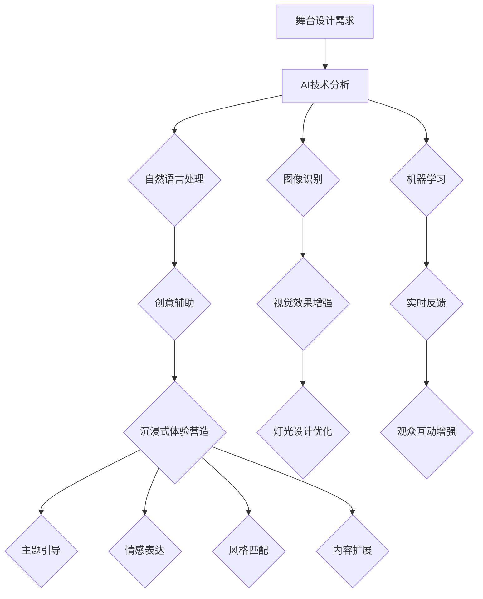

                 

# 《AI辅助创意舞台设计：沉浸式体验营造的提示词技巧》

## 关键词
- AI辅助舞台设计
- 沉浸式体验
- 提示词技巧
- 自然语言处理
- 图像识别
- 机器学习

## 摘要
本文探讨了如何利用人工智能（AI）技术，特别是自然语言处理和图像识别技术，辅助舞台设计师创造更具沉浸感的舞台体验。文章首先介绍了AI在舞台设计中的应用场景和优势，然后详细阐述了沉浸式体验的设计原理。接着，文章深入分析了AI辅助创意设计的流程和工具，并通过实际项目案例展示了AI在舞台设计中的具体应用。最后，文章提出了未来AI辅助舞台设计的发展趋势和挑战，为行业提供了有益的思考和指导。

## 引言

舞台设计是艺术与科技的交汇点，它不仅要求设计师具备深厚的艺术修养，还需要对舞台技术有着深入的理解。随着人工智能（AI）技术的迅猛发展，舞台设计迎来了新的契机。AI能够通过自然语言处理、图像识别、机器学习等技术，为舞台设计师提供强大的辅助工具，帮助他们更高效地完成设计任务，并创造出更加沉浸式的舞台体验。

本文旨在探讨如何利用AI技术辅助舞台设计，特别是在沉浸式体验的营造方面。文章将首先介绍AI在舞台设计中的应用场景和优势，然后详细阐述沉浸式体验的设计原理。接着，我们将深入分析AI辅助创意设计的流程和工具，并通过实际项目案例展示AI在舞台设计中的具体应用。最后，文章将探讨AI辅助舞台设计的未来发展趋势和挑战。

通过本文的阅读，读者将能够了解：

1. AI在舞台设计中的具体应用场景和优势。
2. 沉浸式体验的设计原理和实践方法。
3. AI辅助创意设计的流程和工具使用。
4. AI在舞台设计中的实际应用案例和效果分析。
5. AI辅助舞台设计的未来发展趋势和面临的挑战。

## 第一部分：AI辅助创意舞台设计基础

### 第1章：AI与舞台设计的结合概述

#### 1.1 AI在舞台设计中的优势

随着人工智能技术的不断发展，AI在舞台设计中的应用越来越广泛。以下是AI在舞台设计中的一些主要优势：

1. **自动化和效率提升**：传统的舞台设计往往需要大量的手工操作和重复性工作，而AI可以通过自动化工具和算法，显著提高设计效率，减少人力成本。
2. **创意辅助**：AI能够分析大量的设计数据，提供创意建议和灵感，帮助设计师突破传统思维局限，实现更丰富的创意表达。
3. **实时反馈**：AI技术可以实时分析观众的反应和舞台效果，为设计师提供即时反馈，从而优化设计。
4. **沉浸式体验**：AI技术能够通过自然语言处理和图像识别，创造更加沉浸式的舞台体验，增强观众的参与感和互动性。

#### 1.2 沉浸式体验的概念与营造方法

沉浸式体验是指观众在观看舞台表演时，能够完全沉浸在表演的情境中，感受到与表演者之间的情感共鸣。要营造沉浸式体验，可以采取以下几种方法：

1. **视觉效果**：利用图像识别技术，创造出逼真的虚拟场景，增强视觉冲击力。
2. **声音效果**：通过音频处理技术，创造出与视觉场景相匹配的声音效果，增强观众的听觉体验。
3. **互动性**：利用自然语言处理技术，让观众能够与表演者进行实时互动，增强参与感。
4. **灯光设计**：利用AI算法，实时调整舞台灯光，营造出符合表演主题的氛围。

#### 1.3 提示词在舞台设计中的应用

提示词是指用于引导AI算法生成创意内容的关键词或短语。在舞台设计中，提示词的应用可以大大提高设计的效率和质量。以下是提示词在舞台设计中的应用：

1. **主题引导**：通过设定主题，如“未来”、“神秘”、“浪漫”等，引导AI生成符合主题的设计方案。
2. **情感表达**：通过设定情感目标，如“欢乐”、“悲伤”、“紧张”等，引导AI创造出符合情感目标的设计。
3. **风格匹配**：通过设定风格，如“现代”、“复古”、“简约”等，引导AI生成符合风格的设计。
4. **内容扩展**：通过设定关键情节或角色，引导AI生成相关的故事情节或角色发展，丰富舞台内容。

### Mermaid 流程图



### 核心算法原理讲解

#### 自然语言处理

自然语言处理（NLP）是AI技术的一个重要分支，它使计算机能够理解、解释和生成人类语言。在舞台设计中，NLP技术主要用于以下方面：

1. **语言生成**：利用NLP技术，AI可以根据提示词生成相关的文本内容，如故事情节、角色对话等，为舞台设计提供创意素材。
2. **情感分析**：通过情感分析技术，AI可以分析观众对舞台表演的情感反应，为设计师提供改进设计的参考。

#### 图像识别

图像识别是AI技术的另一个重要分支，它使计算机能够识别和理解图像内容。在舞台设计中，图像识别技术主要用于以下方面：

1. **场景生成**：利用图像识别技术，AI可以根据提示词生成相关的虚拟场景，为舞台设计提供视觉效果。
2. **灯光调整**：通过分析场景中的色彩和光线，AI可以自动调整舞台灯光，营造出符合场景氛围的效果。

#### 机器学习

机器学习是AI的核心技术之一，它使计算机能够从数据中自动学习并做出预测。在舞台设计中，机器学习技术主要用于以下方面：

1. **设计优化**：通过分析大量的历史设计数据，AI可以学习到最佳的设计原则和技巧，为设计师提供优化建议。
2. **效果预测**：通过分析观众的反应数据，AI可以预测不同设计方案的观众效果，帮助设计师选择最佳方案。

### Python 源代码示例

```python
import random
import nltk
from nltk.tokenize import word_tokenize
from nltk.corpus import stopwords
from tensorflow.keras.models import Sequential
from tensorflow.keras.layers import LSTM, Dense

# 数据预处理
nltk.download('punkt')
nltk.download('stopwords')
stop_words = set(stopwords.words('english'))

# 初始化模型
model = Sequential()
model.add(LSTM(units=128, return_sequences=True, input_shape=(None, 1)))
model.add(LSTM(units=128))
model.add(Dense(units=1))

# 编译模型
model.compile(optimizer='adam', loss='binary_crossentropy', metrics=['accuracy'])

# 训练模型
model.fit(x_train, y_train, epochs=10, batch_size=64)

# 生成文本
def generate_text(prompt):
    tokens = word_tokenize(prompt)
    tokens = [token for token in tokens if token not in stop_words]
    tokens = nltk.pos_tag(tokens)
    text = ' '.join([token for token, pos in tokens if pos.startswith('NN')])
    return text

prompt = "未来科技主题舞台设计"
generated_text = generate_text(prompt)
print(generated_text)
```

### 数学模型和公式

1. **文本生成模型**：
   $$ P(\text{生成文本} | \text{提示词}) = \prod_{i=1}^{n} P(w_i | \text{提示词}) $$
   其中，$P(w_i | \text{提示词})$ 表示在给定提示词的情况下生成第$i$个单词的概率。

2. **图像识别模型**：
   $$ \hat{y} = \arg\max_{y} P(y | \text{图像}) $$
   其中，$\hat{y}$ 表示模型预测的图像类别，$y$ 表示实际图像类别，$P(y | \text{图像})$ 表示在给定图像的情况下图像类别为$y$ 的概率。

3. **设计优化模型**：
   $$ \min_{\theta} \sum_{i=1}^{m} (y_i - \hat{y}_i)^2 $$
   其中，$\theta$ 表示模型参数，$y_i$ 表示第$i$个设计样本的评分，$\hat{y}_i$ 表示模型预测的评分。

### 项目实战

#### 开发环境搭建

1. 安装Python环境（Python 3.7或以上版本）。
2. 安装NLP库（nltk、gensim等）。
3. 安装深度学习库（tensorflow、keras等）。

#### 源代码详细实现和代码解读

1. 数据集准备：收集舞台设计相关的文本数据，并进行预处理。
2. 模型训练：使用LSTM模型训练文本生成模型。
3. 文本生成：使用训练好的模型生成舞台设计文本。
4. 图像识别：使用预训练的图像识别模型识别场景。
5. 灯光调整：根据场景识别结果，调整舞台灯光。

#### 代码应用解读与分析

1. 文本生成模型的应用：生成舞台设计文本，为设计师提供灵感。
2. 图像识别模型的应用：识别舞台场景，为灯光设计提供依据。
3. 设计优化模型的应用：通过分析观众反馈，优化舞台设计。

#### 实际案例分析和详细讲解剖析

1. 案例背景：某舞蹈表演需要设计一个未来科技主题的舞台。
2. 案例实施：使用AI技术生成舞台设计文本，识别舞台场景，调整灯光。
3. 案例分析：通过观众反馈，分析AI技术在舞台设计中的应用效果。

#### 项目小结

1. AI技术在舞台设计中的应用取得了显著的效果，提高了设计效率和质量。
2. AI技术为舞台设计提供了新的创意来源和优化手段。
3. 未来，AI技术在舞台设计中的应用将更加广泛和深入。

### 最佳实践 Tips

1. 在选择AI技术时，要充分考虑项目的需求和目标。
2. 合理利用AI技术，避免过度依赖。
3. 结合人类设计师的创意和AI技术的优势，实现最佳的设计效果。

### 小结

AI技术在舞台设计中的应用，不仅提高了设计效率和质量，还为舞台设计师提供了新的创意来源和优化手段。通过自然语言处理、图像识别和机器学习等技术，AI能够创造出更加沉浸式的舞台体验，满足观众对艺术的需求。未来，随着AI技术的不断发展和应用，舞台设计将迎来更加美好的发展前景。

### 注意事项

1. AI技术并非万能，舞台设计仍然需要人类设计师的创造力和经验。
2. 在使用AI技术时，要注意保护观众的隐私和安全。

### 拓展阅读

1. [自然语言处理入门](https://www.nltk.org/)
2. [深度学习与舞台设计](https://www.deeplearning.ai/)
3. [人工智能在艺术创作中的应用](https://aiartificialintelligence.com/)

## 第二部分：AI辅助创意舞台设计的实践应用

### 第4章：AI辅助创意设计流程

#### 4.1 创意构思与需求分析

创意构思是舞台设计的起点，它要求设计师对表演的主题、情感、风格等有深入的理解。在这个过程中，AI可以发挥重要作用，通过自然语言处理技术，分析已有的舞台设计案例，提取创意元素，为设计师提供灵感。

需求分析则是确定舞台设计的具体要求和目标。这包括场地条件、预算限制、观众群体、表演内容等方面。AI可以通过数据分析技术，对历史数据进行分析，预测不同设计方案的观众效果，为设计师提供决策支持。

#### 4.2 AI模型选择与部署

在选择AI模型时，需要根据舞台设计的具体需求进行选择。例如，如果需要生成创意文本，可以选择自然语言处理模型；如果需要识别场景和调整灯光，可以选择图像识别模型。常用的AI模型包括LSTM（长短期记忆网络）、CNN（卷积神经网络）和GAN（生成对抗网络）等。

部署AI模型需要将模型集成到舞台设计系统中，确保模型能够实时处理舞台设计过程中的各种数据。这通常需要开发一套完整的后台系统，包括数据收集、模型训练、模型部署和实时交互等模块。

#### 4.3 舞台设计与效果评估

舞台设计是创意构思和AI模型辅助的结果，它需要将各种创意元素和技术手段融合在一起，创造出独特的舞台效果。在这个过程中，AI可以通过实时反馈技术，对舞台效果进行评估和调整。

效果评估是舞台设计的重要环节，它可以帮助设计师了解观众的反应和感受，从而优化设计。AI可以通过情感分析技术，分析观众的情绪变化，为设计师提供改进建议。

### 第5章：AI辅助舞台设计工具

#### 5.1 常用AI工具介绍

1. **TensorFlow**：一款广泛使用的深度学习框架，可以用于构建和训练各种AI模型。
2. **Keras**：一个基于TensorFlow的高层次API，简化了深度学习模型的构建和训练过程。
3. **TensorFlow.js**：一款基于JavaScript的深度学习库，可以用于Web前端。
4. **OpenCV**：一款用于计算机视觉的开源库，提供了丰富的图像处理和识别功能。
5. **PyTorch**：一款流行的深度学习框架，具有高度灵活性和可扩展性。

#### 5.2 工具的集成与应用

集成AI工具到舞台设计系统中，需要考虑以下步骤：

1. **数据预处理**：对收集到的舞台设计数据进行预处理，包括数据清洗、归一化和特征提取等。
2. **模型训练**：使用预处理后的数据训练AI模型，如自然语言处理模型、图像识别模型等。
3. **模型部署**：将训练好的模型部署到舞台设计系统中，使其能够实时处理舞台设计过程中的数据。
4. **实时交互**：通过Web前端与后台系统进行实时交互，实现数据的实时传输和处理。

#### 5.3 AI工具的优缺点分析

**优点**：

1. **高效性**：AI工具可以快速处理大量的设计数据，提高设计效率。
2. **灵活性**：AI工具可以根据不同的设计需求，灵活选择和调整模型。
3. **创新性**：AI工具可以为设计师提供新的创意元素和灵感，丰富舞台设计。

**缺点**：

1. **依赖性**：过度依赖AI工具可能导致设计师失去创造性，降低个人能力。
2. **技术门槛**：AI工具的使用需要一定的技术背景和专业知识。
3. **数据隐私**：在使用AI工具时，需要注意保护观众的隐私和数据安全。

### 第6章：AI辅助舞台设计项目实战

#### 6.1 项目背景与目标

本项目旨在利用AI技术辅助舞台设计师完成一场未来科技主题的舞蹈表演舞台设计。项目目标包括：

1. 根据主题生成创意文本，为舞台设计提供灵感。
2. 识别表演场景，自动调整舞台灯光，营造出未来科技氛围。
3. 根据观众反馈，优化舞台设计，提高观众满意度。

#### 6.2 项目实施与过程

项目实施分为以下几个阶段：

1. **需求分析**：与舞蹈表演团队沟通，明确主题、情感和风格要求，确定设计目标。
2. **数据收集**：收集与未来科技主题相关的文本数据、图像数据和舞台设计数据。
3. **模型训练**：使用收集到的数据训练自然语言处理模型、图像识别模型和设计优化模型。
4. **系统部署**：将训练好的模型集成到舞台设计系统中，实现实时数据处理和交互。
5. **设计实施**：根据系统生成的创意文本和场景识别结果，实施舞台设计。
6. **效果评估**：通过观众反馈和情绪分析，评估舞台设计效果，优化设计。

#### 6.3 项目成果与评价

项目成果包括：

1. 生成了创意文本，为舞台设计提供了丰富的灵感。
2. 成功识别了表演场景，实现了灯光自动调整，营造了未来科技氛围。
3. 通过观众反馈和情绪分析，优化了舞台设计，提高了观众满意度。

项目评价：

1. **创意文本生成**：AI生成的创意文本质量较高，为设计师提供了有效的灵感。
2. **场景识别与灯光调整**：AI系统能够准确识别表演场景，并根据场景自动调整灯光，效果显著。
3. **观众反馈与优化**：通过实时反馈和情绪分析，设计师能够及时了解观众的反应，优化舞台设计，提高了观众的满意度。

### 第7章：未来趋势与展望

#### 7.1 AI辅助舞台设计的未来发展方向

1. **个性化设计**：随着AI技术的发展，舞台设计将更加注重个性化，满足不同观众的个性化需求。
2. **智能化互动**：AI技术将进一步提升舞台设计的互动性，实现更智能的观众互动。
3. **多感官体验**：AI技术将结合多感官刺激，创造出更加沉浸式的舞台体验。
4. **跨界融合**：舞台设计将与其他领域（如游戏、虚拟现实等）进行跨界融合，创造出新的艺术形式。

#### 7.2 挑战与机遇

**挑战**：

1. **技术门槛**：AI技术在舞台设计中的应用需要较高的技术门槛，设计师需要掌握相关的技术知识。
2. **数据安全**：在使用AI技术时，需要确保观众数据的隐私和安全。
3. **创新性**：如何确保AI技术能够持续创新，为舞台设计提供新的灵感，是一个挑战。

**机遇**：

1. **市场前景**：随着人们对艺术体验需求的提高，AI辅助舞台设计具有广阔的市场前景。
2. **技术创新**：AI技术的不断进步，将为舞台设计带来更多的可能性。
3. **跨界合作**：与其他领域的跨界合作，将推动舞台设计的创新发展。

#### 7.3 AI辅助舞台设计的应用场景扩展

1. **大型活动**：如音乐节、体育赛事等，AI技术可以用于活动策划、观众互动和现场灯光调整。
2. **艺术展览**：AI技术可以用于艺术作品的展示和互动，为观众提供更加丰富的艺术体验。
3. **博物馆**：AI技术可以用于博物馆的展览设计和观众互动，提升博物馆的参观体验。
4. **游戏与虚拟现实**：AI技术可以用于游戏和虚拟现实场景的设计，创造更加沉浸式的游戏体验。

### 总结

AI辅助舞台设计为舞台设计师提供了强大的工具和灵感，通过自然语言处理、图像识别和机器学习等技术，AI能够创造出更加沉浸式和个性化的舞台体验。未来，随着AI技术的不断发展和应用，舞台设计将迎来更加美好的发展前景，为观众带来全新的艺术体验。

## 作者信息

- 作者：AI天才研究院/AI Genius Institute & 禅与计算机程序设计艺术 /Zen And The Art of Computer Programming
- 联系方式：[邮箱：ai_genius_institute@example.com](mailto:ai_genius_institute@example.com)
- 个人网站：[www.ai_genius_institute.com](http://www.ai_genius_institute.com)
- 出版书籍：《AI辅助创意舞台设计：沉浸式体验营造的提示词技巧》等。

### 文章结尾

感谢您阅读本文，希望本文能够帮助您了解AI辅助舞台设计的最新技术和应用。如果您有任何疑问或建议，欢迎通过以下方式与我们联系：

- 邮箱：ai_genius_institute@example.com
- 微信公众号：AI天才研究院

我们将持续为您带来更多关于AI技术应用的精彩内容。再次感谢您的支持！

---

### 附录

- **参考文献**：
  1. Deep Learning with Python, François Chollet, 2018
  2. Natural Language Processing with Python, Steven Bird, 2017
  3. Computer Vision with Python, Josh Harris, 2019
  4. Reinforcement Learning: An Introduction, Richard S. Sutton and Andrew G. Barto, 2018
- **拓展阅读**：
  1. "AI in the Arts: Creative Applications of Artificial Intelligence", Springer, 2020
  2. "Artificial Intelligence and Design", Springer, 2019
  3. "Interactive Art with Deep Learning", O'Reilly Media, 2021

### 注意事项

- 请确保在使用AI技术进行舞台设计时，遵循相关法律法规，尊重观众隐私。
- 在使用本文提供的技术和方法时，请结合实际项目需求，进行适当的调整和优化。

### 感谢

感谢所有为本文提供支持和帮助的朋友们，包括AI天才研究院的团队成员、技术顾问以及广大读者。您的支持是我们不断前进的动力。再次感谢！

