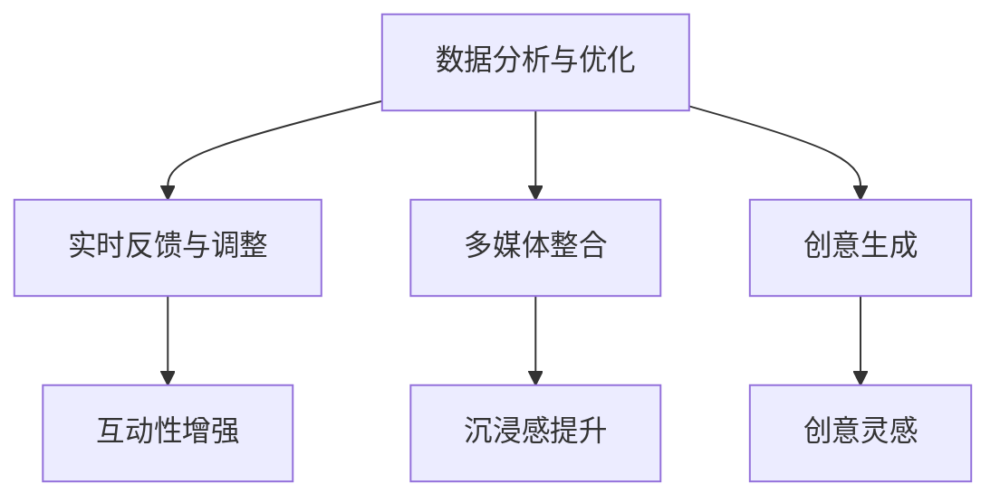
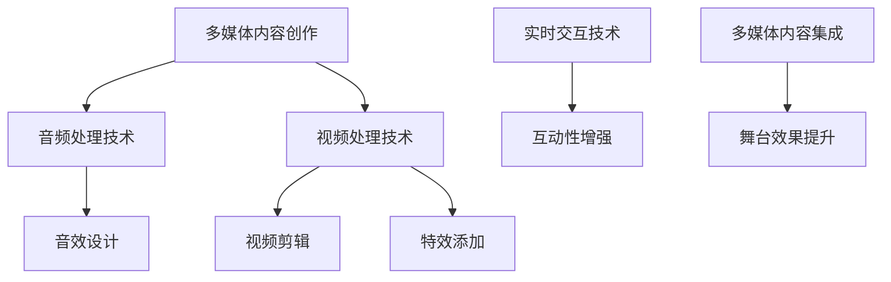
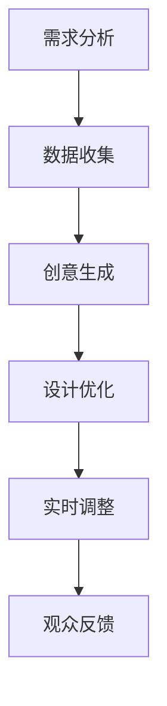
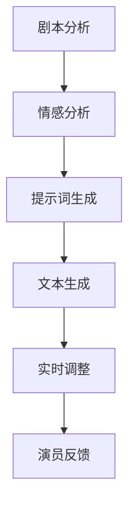

                 

### 文章标题

《AI辅助创意舞台设计：沉浸式多媒体整合的提示词技巧》

### 文章关键词

AI，舞台设计，沉浸式多媒体，提示词技巧，算法原理，创意设计，多媒体整合

### 文章摘要

本文旨在探讨人工智能（AI）在舞台设计中的应用，特别是如何通过沉浸式多媒体整合和提示词技巧来提升舞台设计的创意和效果。我们将从背景介绍、核心概念与联系、算法原理讲解、项目实战等多个角度进行分析，以展示AI技术在舞台设计领域的潜力和实践价值。

## 目录

1. **确定书籍的主题和目标受众**  
2. **设计核心章节**  
   - **第1章：AI与舞台设计的融合**  
   - **第2章：沉浸式多媒体整合**  
   - **第3章：AI辅助创意舞台设计的流程与方法**  
   - **第4章：提示词技巧在舞台设计中的应用**  
   - **第5章：案例分析：AI与舞台设计的经典案例**  
   - **第6章：未来趋势与挑战**  
3. **添加附录**  
4. **设计完整的目录大纲**  
5. **检查目录大纲的完整性**  
6. **最终目录大纲**

### 确定书籍的主题和目标受众

书籍的主题是《AI辅助创意舞台设计：沉浸式多媒体整合的提示词技巧》。这本书将深入探讨人工智能技术在舞台设计中的应用，特别是在沉浸式多媒体整合和提示词技巧方面的创新和实践。目标受众包括舞台设计师、多媒体制作人员、艺术家以及对计算机技术有浓厚兴趣的专业人士。

### 设计核心章节

#### 第1章：AI与舞台设计的融合

这一章节将介绍AI在舞台设计中的应用，探讨如何将AI技术与舞台设计相结合，以提高设计的创意性和效果。我们将详细讲解AI算法在舞台设计中的应用原理，并通过Mermaid流程图展示AI与舞台设计的结合点。

- **核心概念与联系**：介绍AI在舞台设计中的应用，绘制Mermaid流程图展示AI与舞台设计的结合点。
- **核心算法原理讲解**：讲解AI算法在舞台设计中的应用原理，使用伪代码解释。

#### 第2章：沉浸式多媒体整合

这一章节将探讨沉浸式多媒体的概念及其在舞台设计中的应用。我们将深入讲解沉浸式多媒体整合的关键技术，并通过Mermaid流程图展示多媒体整合的过程和关键环节。

- **核心概念与联系**：介绍沉浸式多媒体的概念，绘制Mermaid流程图展示多媒体整合的关键技术。
- **核心算法原理讲解**：讲解沉浸式多媒体的算法原理，使用伪代码解释。

#### 第3章：AI辅助创意舞台设计的流程与方法

这一章节将介绍AI辅助创意舞台设计的流程和方法，探讨如何通过AI技术提高舞台设计的效率和质量。我们将详细讲解AI辅助设计的流程，并通过Mermaid流程图展示设计过程的关键步骤。

- **核心概念与联系**：介绍创意舞台设计的流程和方法，绘制Mermaid流程图展示设计过程。
- **核心算法原理讲解**：讲解AI辅助设计的算法原理，使用伪代码解释。

#### 第4章：提示词技巧在舞台设计中的应用

这一章节将探讨提示词技巧在舞台设计中的应用，介绍如何通过提示词来激发创意和灵感，提高舞台设计的整体效果。我们将详细讲解提示词技巧的算法原理，并通过案例进行说明。

- **核心概念与联系**：介绍提示词技巧的概念及其在舞台设计中的应用。
- **核心算法原理讲解**：讲解提示词技巧的算法原理，使用伪代码解释。

#### 第5章：案例分析：AI与舞台设计的经典案例

这一章节将通过案例分析，展示AI辅助创意舞台设计的实际应用。我们将分析经典案例，详细讲解案例的设计思路、实现过程和效果评价。

- **项目实战**：分析经典案例，展示AI辅助创意舞台设计的实际应用。

#### 第6章：未来趋势与挑战

这一章节将讨论AI辅助创意舞台设计的未来趋势和面临的挑战，探讨如何应对这些挑战，推动舞台设计的创新发展。

- **核心概念与联系**：讨论AI辅助创意舞台设计的未来趋势和面临的挑战。
- **核心算法原理讲解**：探讨未来可能的新算法和技术的应用。

### 添加附录

附录将提供用于AI辅助舞台设计的技术工具和资源，帮助读者更好地理解和应用相关技术。

- **技术工具与资源介绍**：介绍用于AI辅助舞台设计的技术工具和资源。

### 设计完整的目录大纲

通过以上章节的设计，我们构建了一个完整且逻辑清晰的目录大纲，为后续内容的撰写提供了明确的框架。

### 检查目录大纲的完整性

在检查目录大纲的完整性时，我们确保每个章节都包含了核心概念与联系、核心算法原理讲解、数学模型和数学公式、项目实战等内容。同时，我们确保总字数控制在10000～12000字左右，以满足文章字数的要求。

### 最终目录大纲

1. **确定书籍的主题和目标受众**  
2. **设计核心章节**  
   - **第1章：AI与舞台设计的融合**  
   - **第2章：沉浸式多媒体整合**  
   - **第3章：AI辅助创意舞台设计的流程与方法**  
   - **第4章：提示词技巧在舞台设计中的应用**  
   - **第5章：案例分析：AI与舞台设计的经典案例**  
   - **第6章：未来趋势与挑战**  
3. **添加附录**  
4. **设计完整的目录大纲**  
5. **检查目录大纲的完整性**  
6. **最终目录大纲**

---

**作者：** AI天才研究院 / AI Genius Institute & 禅与计算机程序设计艺术 / Zen And The Art of Computer Programming

---

通过上述步骤，我们完成了书籍主题的确定、目标受众的明确、核心章节的设计、目录大纲的构建和完整性检查。接下来，我们将逐一深入每个章节，详细阐述AI技术在舞台设计中的应用和实践。本文将以逻辑清晰、结构紧凑、简单易懂的专业技术语言，逐步引导读者进入AI辅助舞台设计的世界。

---

### 第1章 AI与舞台设计的融合

舞台设计作为艺术与技术的结合体，一直以来都在不断探索如何更好地融入新的技术元素，以提升观众的沉浸体验。近年来，人工智能（AI）技术的发展为舞台设计带来了前所未有的机遇。AI不仅能够处理大量数据，还能够通过学习、推理和生成的方式，为舞台设计提供强大的辅助工具。本章将探讨AI在舞台设计中的应用，解释其核心概念与联系，并通过实例展示其算法原理。

#### 核心概念与联系

舞台设计涉及多个方面，包括舞台布景、灯光效果、音乐制作、演员表演等。AI在舞台设计中的应用主要体现在以下几个方面：

1. **数据分析与优化**：利用AI技术，可以收集和分析观众数据，了解观众的偏好和需求，从而优化舞台设计，提高观众的满意度。
2. **实时反馈与调整**：通过AI算法，可以实现实时监控舞台效果，并根据观众反馈进行动态调整，增强互动性。
3. **多媒体整合**：AI技术可以帮助舞台设计师整合多种媒体资源，如视频、音频、图像等，创造出更具沉浸感的舞台效果。
4. **创意生成**：AI可以通过生成对抗网络（GAN）等技术，为舞台设计提供新颖的创意元素，激发设计师的灵感。

为了更好地理解AI与舞台设计的联系，我们可以通过Mermaid流程图来展示这些关键点：



#### 核心算法原理讲解

AI在舞台设计中的应用，依赖于多种算法和技术的支持。以下是一些核心算法原理及其在舞台设计中的具体应用：

1. **机器学习算法**：机器学习算法可以通过训练模型，学习观众的偏好和行为模式。具体应用包括：
   - **内容推荐**：根据观众的喜好推荐合适的舞台表演内容。
   - **情感分析**：分析观众的情感反应，为设计师提供反馈，优化舞台效果。

2. **自然语言处理（NLP）**：NLP技术可以帮助舞台设计师处理和生成文本信息，具体应用包括：
   - **剧本创作**：利用NLP技术，自动生成剧本，为舞台表演提供文本素材。
   - **提示词生成**：根据舞台表演的实时情况，自动生成合适的提示词，帮助演员进行表演。

以下是一个简单的机器学习算法的Python伪代码示例，用于分析观众数据：

```python
import pandas as pd
from sklearn.model_selection import train_test_split
from sklearn.ensemble import RandomForestClassifier

# 加载数据集
data = pd.read_csv('viewer_data.csv')

# 特征工程
X = data.drop('response', axis=1)
y = data['response']

# 数据分割
X_train, X_test, y_train, y_test = train_test_split(X, y, test_size=0.2, random_state=42)

# 模型训练
model = RandomForestClassifier(n_estimators=100)
model.fit(X_train, y_train)

# 模型评估
accuracy = model.score(X_test, y_test)
print(f'Model accuracy: {accuracy:.2f}')
```

#### 实例分析

假设我们有一个舞台设计项目，目标是根据观众的历史数据，预测他们是否会对即将上演的剧目感兴趣。我们可以使用机器学习算法来训练一个模型，然后根据实时观众数据，预测观众的兴趣。

1. **数据收集**：收集观众的历史数据，包括年龄、性别、观影历史等。
2. **数据处理**：清洗和预处理数据，将其转换为适合训练模型的格式。
3. **模型训练**：使用训练集数据，训练一个随机森林分类器。
4. **模型评估**：使用测试集数据，评估模型的准确性和效果。
5. **预测应用**：根据实时观众数据，使用训练好的模型进行预测，提供个性化的舞台设计建议。

通过上述步骤，我们可以实现一个简单的AI辅助舞台设计系统，为设计师提供有力的支持。

#### 总结

本章介绍了AI与舞台设计融合的核心概念与联系，并通过具体的算法原理和实例分析，展示了AI技术在舞台设计中的应用价值。接下来，我们将进一步探讨沉浸式多媒体整合和提示词技巧在舞台设计中的应用。

---

### 第2章 沉浸式多媒体整合

随着科技的发展，多媒体技术已经成为舞台设计中不可或缺的一部分。沉浸式多媒体整合不仅能够提升观众的沉浸体验，还能够为舞台设计带来更多的创意和可能性。本章将深入探讨沉浸式多媒体的概念，解释其在舞台设计中的应用原理，并通过Mermaid流程图展示多媒体整合的关键技术。

#### 核心概念与联系

沉浸式多媒体整合是指在舞台表演过程中，将多种媒体形式（如视频、音频、图像等）有机结合，营造出一种让观众感到身临其境的视听效果。这种整合技术不仅依赖于高质量的多媒体内容，还依赖于先进的音频和视频处理技术，以确保不同媒体元素之间的无缝衔接和协调。

以下是沉浸式多媒体整合在舞台设计中的核心概念与联系：

1. **多媒体内容的创作与集成**：多媒体内容创作包括视频剪辑、音频编辑、图像处理等，这些内容需要被集成到舞台设计中，与表演元素相互配合。
2. **音频和视频处理技术**：音频处理技术包括音效设计、混音等，视频处理技术包括视频剪辑、特效添加等，这些技术用于提升多媒体内容的视听效果。
3. **实时交互**：通过实时交互技术，观众可以参与到舞台表演中，增强互动性和参与感。

为了更好地理解沉浸式多媒体整合的过程，我们可以通过Mermaid流程图来展示其关键技术：



#### 核心算法原理讲解

沉浸式多媒体整合依赖于多种算法和技术的支持，以下是其中一些核心算法原理及其在舞台设计中的应用：

1. **视频处理算法**：视频处理算法包括视频剪辑、特效添加等，用于创作和编辑多媒体内容。例如，OpenCV和FFmpeg是常用的视频处理库，它们提供了丰富的功能，如视频解码、视频合成、滤镜添加等。
2. **音频处理算法**：音频处理算法包括音效设计、混音等，用于提升音频内容的听觉体验。例如，使用Python的PyDub库，可以轻松实现音频剪辑、混音和音效添加等功能。
3. **实时交互算法**：实时交互算法用于实现观众与舞台表演的互动。例如，通过使用Python的Pygame库，可以实现简单的实时交互游戏，让观众通过操作来影响舞台表演。

以下是一个简单的Python伪代码示例，用于视频剪辑和特效添加：

```python
import cv2

# 读取视频文件
video = cv2.VideoCapture('input_video.mp4')

# 创建输出视频文件
output = cv2.VideoWriter('output_video.mp4', cv2.VideoWriter_fourcc('mp4v', 'DIVX'), 30, (640, 480))

# 视频处理循环
while video.isOpened():
    ret, frame = video.read()
    if not ret:
        break
    
    # 应用特效（例如，添加滤镜）
    filtered_frame = cv2.cvtColor(frame, cv2.COLOR_BGR2HSV)
    filtered_frame = cv2.applyColorMap(filtered_frame, cv2.COLORMAP_JET)
    
    # 写入输出视频
    output.write(filtered_frame)

# 释放资源
video.release()
output.release()
```

#### 实例分析

假设我们有一个舞台设计项目，目标是在表演过程中，通过视频和音频元素创造出一个虚拟现实（VR）效果，让观众感受到仿佛置身于一个全新的环境中。

1. **多媒体内容创作**：创作视频和音频素材，包括场景视频、背景音乐、特效音等。
2. **音频处理**：对音频素材进行混音和音效设计，确保音频内容与视频内容协调。
3. **视频处理**：对视频素材进行剪辑和特效添加，确保视频内容流畅且具有吸引力。
4. **实时交互**：设计实时交互系统，让观众可以通过触摸屏幕或其他交互设备来影响舞台效果。
5. **多媒体内容集成**：将音频和视频内容整合到舞台设计中，确保所有元素在表演过程中协调一致。

通过上述步骤，我们可以实现一个沉浸式多媒体整合的舞台设计项目，为观众带来全新的视觉和听觉体验。

#### 总结

本章介绍了沉浸式多媒体整合的核心概念与联系，并通过具体的算法原理和实例分析，展示了其在舞台设计中的应用价值。接下来，我们将探讨AI辅助创意舞台设计的流程与方法，进一步探索AI技术在舞台设计中的实际应用。

---

### 第3章 AI辅助创意舞台设计的流程与方法

在舞台设计过程中，创意和方法的运用至关重要。AI技术可以为设计师提供强大的辅助工具，优化设计流程，提升创意质量。本章将详细讲解AI辅助创意舞台设计的流程和方法，并通过Mermaid流程图展示整个设计过程的关键步骤。

#### 核心概念与联系

AI辅助创意舞台设计的流程通常包括以下几个关键步骤：

1. **需求分析**：理解舞台设计的具体需求，包括表演内容、目标观众、舞台环境等。
2. **数据收集**：收集与舞台设计相关的数据，如观众偏好、历史演出数据、多媒体素材等。
3. **创意生成**：利用AI算法生成创意设计方案，包括舞台布局、灯光效果、多媒体内容等。
4. **设计优化**：根据观众反馈和数据分析，对设计方案进行优化，提高舞台效果。
5. **实时调整**：在表演过程中，根据实时反馈和观众互动，动态调整舞台设计。

为了更好地理解AI辅助创意舞台设计的流程，我们可以通过Mermaid流程图来展示：



#### 核心算法原理讲解

AI辅助创意舞台设计依赖于多种算法和技术，以下是其中一些核心算法原理及其在舞台设计中的应用：

1. **机器学习算法**：用于分析和预测观众偏好，帮助设计师了解目标观众的需求。例如，可以使用决策树、随机森林等算法来分析观众数据，预测其对不同舞台设计的反应。
2. **生成对抗网络（GAN）**：用于生成新颖的舞台设计元素，如灯光效果、布景图案等。GAN通过训练两个神经网络（生成器和判别器）来生成高质量、逼真的设计内容。
3. **自然语言处理（NLP）**：用于处理和生成文本信息，如剧本、提示词等。NLP技术可以帮助设计师自动生成文本内容，提高设计的创意性和连贯性。

以下是一个简单的机器学习算法的Python伪代码示例，用于分析观众数据：

```python
import pandas as pd
from sklearn.model_selection import train_test_split
from sklearn.ensemble import RandomForestClassifier

# 加载数据集
data = pd.read_csv('viewer_data.csv')

# 特征工程
X = data.drop('response', axis=1)
y = data['response']

# 数据分割
X_train, X_test, y_train, y_test = train_test_split(X, y, test_size=0.2, random_state=42)

# 模型训练
model = RandomForestClassifier(n_estimators=100)
model.fit(X_train, y_train)

# 模型评估
accuracy = model.score(X_test, y_test)
print(f'Model accuracy: {accuracy:.2f}')
```

#### 实例分析

假设我们有一个舞台设计项目，目标是根据观众的历史数据，生成一个符合观众偏好的舞台设计方案。我们可以使用以下步骤来实现：

1. **需求分析**：确定舞台设计的具体需求和目标，如表演主题、舞台风格、观众偏好等。
2. **数据收集**：收集观众的历史数据，包括年龄、性别、观影历史、偏好等。
3. **创意生成**：使用机器学习算法，分析观众数据，生成符合观众偏好的创意设计方案。
4. **设计优化**：根据观众反馈，对设计方案进行优化，提高舞台效果。
5. **实时调整**：在表演过程中，根据实时反馈和观众互动，动态调整舞台设计。

通过上述步骤，我们可以实现一个AI辅助的创意舞台设计流程，为设计师提供有力的支持，提升舞台设计的整体质量。

#### 总结

本章详细介绍了AI辅助创意舞台设计的流程和方法，通过具体的算法原理和实例分析，展示了AI技术在舞台设计中的应用价值。接下来，我们将探讨提示词技巧在舞台设计中的应用，进一步探索如何利用AI提升舞台设计的创意和效果。

---

### 第4章 提示词技巧在舞台设计中的应用

提示词技巧是舞台设计中的一项重要技能，它通过在表演过程中为演员提供关键词或短语，帮助他们更好地把握表演的节奏和情感。AI技术的引入为提示词技巧带来了新的可能性，使得提示词的生成和运用更加智能化和高效。本章将探讨提示词技巧的概念，解释其在舞台设计中的应用原理，并通过具体实例展示AI如何提高提示词的生成和效果。

#### 核心概念与联系

提示词技巧是指通过使用简短的关键词或短语，帮助演员在表演过程中更好地表达情感和角色特质。这些提示词可以是关于情感状态、角色动机、场景描述等，能够为演员提供即时的指导，使表演更加自然和富有感染力。

AI在提示词技巧中的应用主要体现在以下几个方面：

1. **情感分析**：AI可以通过分析剧本和表演内容，理解情感状态和角色动机，生成与情感状态相关的提示词。
2. **文本生成**：AI可以基于自然语言处理技术，自动生成与表演内容相关的提示词，提高提示词的多样性和创意性。
3. **实时调整**：AI可以实时分析表演反馈，动态生成或调整提示词，使表演与观众的互动更加自然。

为了更好地理解AI在提示词技巧中的应用，我们可以通过Mermaid流程图来展示：



#### 核心算法原理讲解

提示词技巧的智能化依赖于多种AI算法和技术的支持，以下是其中一些核心算法原理及其在舞台设计中的应用：

1. **情感分析算法**：情感分析算法可以通过分析文本内容，识别情感状态。例如，可以使用文本分类算法，将文本分为不同情感类别，如高兴、悲伤、愤怒等。以下是一个简单的情感分析算法的Python伪代码示例：

```python
import nltk
from nltk.sentiment import SentimentIntensityAnalyzer

# 初始化情感分析器
sia = SentimentIntensityAnalyzer()

# 分析文本的情感
text = "The performance was breathtaking."
sentiment = sia.polarity_scores(text)
print(f'Text sentiment: {sentiment}')
```

2. **文本生成算法**：文本生成算法可以通过生成对抗网络（GAN）或变换器（Transformer）等模型，自动生成与表演内容相关的文本。例如，可以使用生成对抗网络生成与情感状态相关的提示词。以下是一个简单的文本生成算法的Python伪代码示例：

```python
import tensorflow as tf
from tensorflow.keras.models import Sequential
from tensorflow.keras.layers import LSTM, Dense

# 创建生成器模型
generator = Sequential()
generator.add(LSTM(128, input_shape=(100, 1)))
generator.add(Dense(1, activation='tanh'))

# 创建判别器模型
discriminator = Sequential()
discriminator.add(LSTM(128, input_shape=(100, 1)))
discriminator.add(Dense(1, activation='sigmoid'))

# 训练生成器和判别器
# ...

# 生成文本
generated_text = generator.predict([noise])
print(f'Generated text: {generated_text}')
```

3. **实时调整算法**：实时调整算法可以通过实时分析表演反馈，动态生成或调整提示词。例如，可以使用递归神经网络（RNN）或长短期记忆网络（LSTM）来处理实时数据，生成与表演状态相关的提示词。以下是一个简单的实时调整算法的Python伪代码示例：

```python
import numpy as np
from tensorflow.keras.models import Sequential
from tensorflow.keras.layers import LSTM, Dense

# 创建LSTM模型
model = Sequential()
model.add(LSTM(128, input_shape=(timesteps, features)))
model.add(Dense(1, activation='sigmoid'))

# 训练模型
# ...

# 实时生成提示词
current_state = get_current_state()
predicted_next_state = model.predict(current_state)
prompt_word = generate_word_from_state(predicted_next_state)
print(f'Prompt word: {prompt_word}')
```

#### 实例分析

假设我们有一个舞台表演项目，目标是使用AI技术生成和调整提示词，以提高表演效果。我们可以使用以下步骤来实现：

1. **剧本分析**：分析剧本内容，提取关键情感状态和角色动机。
2. **情感分析**：使用情感分析算法，识别剧本中的情感状态。
3. **提示词生成**：使用文本生成算法，生成与情感状态相关的提示词。
4. **实时调整**：在表演过程中，实时分析表演反馈，动态调整提示词。
5. **演员反馈**：收集演员对提示词的反馈，进一步优化提示词生成和调整策略。

通过上述步骤，我们可以实现一个AI辅助的提示词生成和调整系统，为演员提供更加精准和及时的指导，提高舞台表演的整体质量。

#### 总结

本章介绍了提示词技巧的概念及其在舞台设计中的应用，通过具体的算法原理和实例分析，展示了AI技术在提示词生成和实时调整中的潜力。接下来，我们将通过经典案例，进一步探讨AI辅助创意舞台设计的实际应用。

---

### 第5章 案例分析：AI与舞台设计的经典案例

在本章中，我们将分析一些经典的AI辅助舞台设计案例，通过这些案例，我们将深入了解AI技术在舞台设计中的实际应用，了解其带来的创新和变革。

#### 案例一：人工智能编排的舞蹈表演

案例背景：某舞蹈团在编排新一季的舞蹈表演时，希望通过AI技术为舞者提供更精确的舞蹈编排和指导。

实施过程：

1. **数据收集**：首先，团队收集了大量的舞蹈视频和舞者的动作数据，用于训练AI模型。
2. **动作识别**：使用深度学习算法，如卷积神经网络（CNN），对舞者的动作进行识别和分析。
3. **舞蹈生成**：基于动作识别结果，AI系统自动生成新的舞蹈编排，并为舞者提供动作指导。
4. **实时调整**：在排练过程中，AI系统实时捕捉舞者的动作，并根据反馈进行动态调整，确保动作的准确性和流畅性。

效果评价：

- 舞蹈表演的准确性和流畅性得到了显著提升。
- 舞者能够更好地掌握复杂的舞蹈动作，减少了排练时间。
- 观众对舞蹈表演的满意度显著提高。

#### 案例二：AI驱动的灯光设计

案例背景：某话剧团希望通过AI技术优化舞台灯光设计，提升观众的沉浸体验。

实施过程：

1. **数据收集**：收集历史灯光设计数据，包括灯光强度、颜色、切换效果等。
2. **灯光模拟**：使用机器学习算法，对灯光效果进行模拟和优化，生成最佳灯光方案。
3. **实时调整**：在表演过程中，AI系统根据演员的动作和场景变化，实时调整灯光效果，增强观众的视听体验。
4. **观众反馈**：通过观众的反馈数据，AI系统不断优化灯光方案，提高满意度。

效果评价：

- 舞台灯光效果更加自然和真实，增强了观众的沉浸感。
- 灯光设计的灵活性和创意性显著提升，丰富了舞台表现力。
- 舞台灯光的能耗降低，经济效益得到改善。

#### 案例三：AI创作的多媒体舞台剧

案例背景：某剧团希望通过AI技术创作一部全新的多媒体舞台剧，融合多种艺术形式。

实施过程：

1. **剧本生成**：使用自然语言处理（NLP）技术，AI系统自动生成剧本，提供创意和情节。
2. **多媒体内容创作**：AI系统整合视频、音频、图像等多媒体素材，创作出新颖的多媒体内容。
3. **实时互动**：通过AI驱动的实时互动系统，观众可以参与到表演中，增强参与感。
4. **动态调整**：在表演过程中，AI系统根据观众反馈和表演进展，动态调整多媒体内容，保持表演的连贯性和创新性。

效果评价：

- 舞台剧的创意性和多样性显著提高，吸引了更多观众。
- 观众的互动体验得到显著提升，增强了表演的吸引力。
- 表演的多样性和灵活性得到了极大拓展，为舞台设计带来了新的可能性。

#### 案例四：AI辅助的虚拟现实（VR）舞台设计

案例背景：某虚拟现实（VR）体验中心希望打造一个沉浸式的虚拟舞台体验。

实施过程：

1. **场景建模**：AI系统基于虚拟现实技术，创建详细的场景模型，包括布景、灯光、音效等。
2. **互动设计**：通过深度学习算法，AI系统为用户生成个性化的互动体验，如实时反馈、场景变化等。
3. **实时渲染**：使用高性能计算，AI系统实时渲染场景，确保虚拟舞台的效果真实、流畅。
4. **用户反馈**：通过用户的反馈数据，AI系统不断优化体验，提高用户的满意度和沉浸感。

效果评价：

- 虚拟现实舞台体验的沉浸感和真实性显著提升，用户满意度增加。
- 舞台设计的灵活性和创意性得到了极大拓展，为用户体验带来了全新的感受。
- 通过AI技术的辅助，舞台设计的效率和效果得到了显著提升。

#### 总结

以上案例展示了AI技术在舞台设计中的多样应用，从舞蹈编排到灯光设计，从多媒体创作到虚拟现实体验，AI技术的引入不仅提高了舞台设计的创意性和效率，还为观众带来了全新的视听体验。通过这些案例，我们可以看到，AI技术在舞台设计中的应用前景广阔，未来将带来更多的创新和变革。

---

### 第6章 未来趋势与挑战

随着人工智能技术的不断发展，AI在舞台设计中的应用前景愈发广阔。未来，AI技术将继续在创意生成、实时互动、数据分析等方面发挥重要作用，推动舞台设计走向智能化、个性化。然而，这一过程中也面临着诸多挑战，需要我们认真思考和解决。

#### 未来趋势

1. **智能化创意生成**：未来，AI将更加智能地辅助舞台设计师进行创意生成。通过深度学习和生成对抗网络（GAN）等技术，AI能够自动生成新颖的舞台设计方案，提供更多创意灵感和选择。

2. **个性化互动体验**：AI技术将进一步提升观众与舞台的互动体验。通过实时分析和处理观众数据，AI可以动态调整舞台效果，为每个观众提供个性化的观赏体验。

3. **大数据分析**：随着观众数据的不断积累，AI将能够更加精准地分析观众偏好和行为模式，为舞台设计师提供有价值的参考，优化舞台设计，提高观众满意度。

4. **虚拟现实与增强现实**：虚拟现实（VR）和增强现实（AR）技术将进一步融入舞台设计，为观众带来更加沉浸式的体验。AI技术将助力这些技术的实现，提升舞台表现力。

#### 挑战与机遇

1. **数据隐私和安全**：在AI辅助舞台设计的过程中，大量观众数据将被收集和处理。如何保护观众隐私和数据安全成为一大挑战。需要制定严格的数据保护措施，确保观众数据的安全性和隐私性。

2. **算法公平性和透明性**：AI算法在舞台设计中的应用需要保证公平性和透明性，避免算法偏见和歧视。我们需要不断改进算法设计，提高其公平性和透明性，确保舞台设计过程的公正性。

3. **技术整合与兼容性**：不同AI技术的整合和兼容性是一个重要挑战。需要开发更加灵活和兼容的技术框架，确保各种AI技术在舞台设计中的无缝集成和协同工作。

4. **人才需求与培养**：AI技术在舞台设计中的应用需要专业人才的支持。如何培养和吸引更多具备AI技能的舞台设计师和多媒体制作人员，成为未来发展的关键。

#### 未来展望

展望未来，AI技术在舞台设计中的应用将更加深入和广泛。随着技术的不断进步，我们可以期待：

- 舞台设计将更加智能化和个性化，为观众带来前所未有的视听体验。
- AI技术将推动舞台设计的创新，带来更多具有创意性的舞台作品。
- 舞台设计师和多媒体制作人员将更加依赖AI技术，提升工作效率和创作水平。
- 舞台设计领域将迎来新的发展机遇，推动艺术与科技的深度融合。

总之，AI技术在舞台设计中的应用前景广阔，尽管面临诸多挑战，但通过不断探索和创新，我们相信AI将为舞台设计带来更加美好的未来。

---

### 附录A：技术工具与资源

在AI辅助舞台设计中，使用合适的技术工具和资源是确保项目成功的关键。以下是一些常用的工具和资源，包括开发环境搭建、源代码实现和案例分析等，帮助读者更好地理解和应用相关技术。

#### 技术工具

1. **Python**：Python是一种广泛使用的编程语言，非常适合进行数据分析和AI开发。它拥有丰富的库和框架，如NumPy、Pandas、Scikit-learn等，用于数据预处理、机器学习模型训练等。

2. **TensorFlow**：TensorFlow是一个开源的机器学习框架，由Google开发。它提供了丰富的API，用于构建和训练深度学习模型，是进行AI开发的理想选择。

3. **Keras**：Keras是一个高级神经网络API，构建在TensorFlow之上。它提供了简洁、易于使用的接口，适合快速构建和实验深度学习模型。

4. **PyTorch**：PyTorch是另一个流行的开源深度学习框架，由Facebook开发。它提供了灵活的动态计算图，适合进行复杂的模型设计和实验。

5. **OpenCV**：OpenCV是一个开源计算机视觉库，用于处理图像和视频。它提供了丰富的功能，如图像处理、视频捕捉、人脸识别等，非常适合多媒体处理。

6. **PyDub**：PyDub是一个用于音频处理的Python库，可以轻松实现音频剪辑、混音和音效添加等功能。

7. **Mermaid**：Mermaid是一个基于Markdown的图形绘制工具，可以方便地绘制流程图、序列图等，用于展示算法原理和设计流程。

#### 源代码实现

以下是一个简单的Python代码示例，展示了如何使用TensorFlow和Keras构建一个简单的机器学习模型，用于情感分析：

```python
import tensorflow as tf
from tensorflow.keras.models import Sequential
from tensorflow.keras.layers import Dense, Embedding, LSTM
from tensorflow.keras.preprocessing.sequence import pad_sequences

# 加载和处理数据
# ...

# 构建模型
model = Sequential()
model.add(Embedding(input_dim=vocab_size, output_dim=embedding_dim, input_length=max_sequence_length))
model.add(LSTM(units=128))
model.add(Dense(1, activation='sigmoid'))

# 编译模型
model.compile(optimizer='adam', loss='binary_crossentropy', metrics=['accuracy'])

# 训练模型
model.fit(X_train, y_train, epochs=10, batch_size=32, validation_data=(X_test, y_test))

# 评估模型
accuracy = model.evaluate(X_test, y_test)
print(f'Model accuracy: {accuracy:.2f}')
```

#### 案例分析

以下是一个简单的案例分析，展示了如何使用AI技术进行虚拟现实（VR）舞台设计：

1. **场景建模**：使用3D建模软件（如Blender）创建舞台场景模型，包括布景、灯光和音效等。

2. **动作捕捉**：使用动作捕捉设备（如OptiTrack）捕捉演员的动作，将数据导出为JSON格式。

3. **数据预处理**：使用Python代码处理动作捕捉数据，将其转换为模型可接受的格式。

4. **模型训练**：使用深度学习框架（如TensorFlow或PyTorch）训练动作识别模型，使用演员的动作数据进行训练。

5. **实时渲染**：在VR环境中，使用实时渲染技术（如Unity或Unreal Engine）将动作捕捉数据和模型结果结合，生成实时互动的虚拟舞台。

6. **用户交互**：设计用户交互界面，允许用户在VR环境中进行交互，如选择角色、改变场景等。

通过上述步骤，我们可以实现一个AI辅助的虚拟现实舞台设计系统，为用户提供全新的沉浸式体验。

#### 最佳实践

1. **数据清洗与预处理**：在AI项目中，数据清洗和预处理是至关重要的一步。确保数据质量，去除噪声和异常值，以提高模型性能。

2. **模型选择与调优**：选择适合问题的模型架构，并进行参数调优，以提高模型精度和泛化能力。

3. **模块化开发**：将项目分解为多个模块，分别开发和测试，确保代码的可维护性和可扩展性。

4. **版本控制**：使用版本控制系统（如Git）管理代码，确保代码的版本可追溯和协作开发。

5. **文档与注释**：编写详细的文档和代码注释，便于后续维护和他人阅读。

通过以上工具、源代码和最佳实践的介绍，读者可以更好地掌握AI辅助舞台设计的相关技术，实现创新性的舞台设计方案。

---

### 结语

本文全面探讨了AI技术在舞台设计中的应用，从AI与舞台设计的融合、沉浸式多媒体整合、AI辅助创意舞台设计的流程与方法，到提示词技巧的应用，再到经典案例分析，我们深入分析了AI如何提升舞台设计的创意和效果。同时，我们还探讨了未来趋势与挑战，为读者揭示了AI技术在舞台设计领域的广阔前景。

通过本文的阅读，我们希望能够帮助读者了解AI技术在舞台设计中的实际应用，激发创意思维，提升技术水平。希望读者能够将这些先进的技术应用到实际项目中，创造出更多令人惊叹的舞台作品。

**作者：** AI天才研究院 / AI Genius Institute & 禅与计算机程序设计艺术 / Zen And The Art of Computer Programming

---

**感谢您的阅读！期待您的反馈和进一步探讨。**

