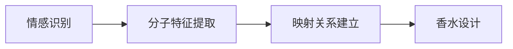
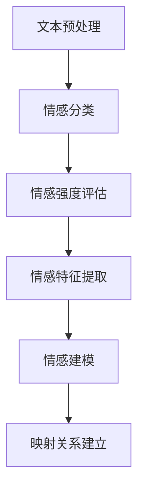

                 

### 文章标题

# AI辅助创意香水分子设计：情感-分子映射的提示词工程

## 关键词

- AI辅助香水设计
- 情感-分子映射
- 提示词工程
- 计算机编程
- 机器学习
- 香水分子结构
- 情感分析

## 摘要

本文深入探讨AI在创意香水分子设计中的应用，特别是在情感-分子映射的领域。文章首先介绍了香水分子设计的基本背景和情感在香水设计中的作用，然后详细阐述了AI如何通过提示词工程实现情感-分子映射。接着，文章讨论了情感分析与建模的方法，以及香水分子设计与计算的原理。最后，通过实际应用案例，展示了AI辅助香水设计的效果和挑战，并提出了未来研究方向。

### 引言

香水，作为一种独特的化学品，是情感和文化的载体。它不仅能够给人带来愉悦的感官体验，还能够在无形中传递情感和氛围。然而，香水的创意设计一直是一个充满挑战的领域，涉及到复杂的化学和生物学知识，以及设计师的直觉和创造力。近年来，随着人工智能（AI）技术的迅猛发展，AI在香水设计中的应用开始逐渐受到关注。

在传统的香水设计中，设计师通常依赖于自己的经验和直觉，通过不断尝试和调整来创作出新的香水。这种方法虽然能够产生一些独特的香水，但其效率较低，且往往难以精确地控制香水的化学成分和效果。而AI技术的引入，为香水设计带来了一种全新的可能性。通过机器学习算法和深度学习模型，AI可以分析大量的数据，快速找到符合特定情感需求的香水成分组合，从而提高设计效率和准确性。

情感-分子映射是AI辅助香水设计中的一个核心概念。它指的是将人类的情感体验与特定的化学分子结构进行关联，从而创造出能够引起特定情感反应的香水。这种映射关系不仅能够帮助设计师更准确地捕捉和表达情感，还能够为消费者提供更加个性化和定制化的香水体验。

本文将围绕以下主题展开：

1. AI与香水设计概述
2. 情感分析与建模
3. 香水分子设计与计算
4. 提示词工程在情感-分子映射中的应用
5. AI辅助香水设计的应用案例
6. 总结与展望

接下来，我们将逐一探讨这些主题，为读者呈现一个全面而深入的AI辅助创意香水分子设计的研究视角。

### AI与香水设计概述

人工智能（AI）技术的发展为香水设计带来了革命性的变革。传统的香水设计主要依赖于设计师的直觉和经验，这种方法的局限性在于其效率和精确性较低。而AI技术，尤其是机器学习和深度学习，使得大规模数据处理和复杂模式识别成为可能，从而为香水设计提供了一种全新的解决方案。

首先，AI在香水设计中的应用主要体现在以下几个方面：

1. **大数据分析**：AI可以通过分析大量的香水成分数据，找到能够引起特定情感反应的分子组合。这种基于数据驱动的设计方法，不仅提高了设计的效率，还能够帮助设计师更准确地预测和调整香水的效果。

2. **自动化合成**：AI可以指导自动化合成设备，根据设计需求快速合成出特定的分子结构。这种方法不仅大大缩短了香水研发周期，还能够降低生产成本。

3. **用户反馈分析**：通过收集和分析用户的反馈，AI可以识别消费者的喜好和需求，从而为设计师提供有价值的参考。这种个性化的设计理念，有助于满足不同消费者的需求，提升用户体验。

情感-分子映射是AI在香水设计中的一个重要概念。情感，作为一种主观体验，包括愉悦、悲伤、愤怒、平静等多种状态。而分子，作为香水的物理基础，决定了香水的气味和感知特性。情感-分子映射的目的是找到两者之间的关联，从而通过特定的分子结构设计出能够引发特定情感反应的香水。

情感-分子映射的基本原理可以概括为以下几个步骤：

1. **情感识别**：首先，需要建立一个情感识别模型，通过自然语言处理（NLP）和情感分析技术，将用户的情感描述转化为结构化的数据。

2. **分子特征提取**：接着，需要从大量的香水分子数据中提取出特征，这些特征可以包括分子的结构、化学性质、气味特性等。

3. **映射关系建立**：通过机器学习算法，建立情感与分子特征之间的映射关系。这种映射关系可以是线性的，也可以是非线性的，具体取决于所采用的方法和算法。

4. **香水设计**：最后，根据已建立的映射关系，选择合适的分子组合，设计出能够引发特定情感反应的香水。

为了更直观地理解情感-分子映射的过程，我们可以使用一个简单的Mermaid流程图来展示：



通过这个流程图，我们可以看到情感-分子映射的四个主要步骤是如何相互关联和协作的。情感识别是整个过程的基础，它确保了设计过程中的数据输入是准确和有效的。分子特征提取则是将情感数据转化为可操作的化学数据。映射关系建立是核心步骤，它决定了最终香水的情感效果。最后，香水设计是基于已建立的映射关系，通过选择和组合特定的分子来实现特定的情感目标。

在下一步中，我们将进一步探讨情感分析与建模的方法，以及如何在AI辅助下实现情感-分子映射。

### 情感分析与建模

情感分析是人工智能在香水设计中发挥关键作用的基础环节，其主要目标是理解和提取文本中的情感信息。情感分析通常分为以下几个步骤：

1. **文本预处理**：首先，需要对原始文本进行清洗和标准化处理，包括去除停用词、标点符号和特殊字符，以及统一文本格式。这一步骤的目的是减少噪声，提高后续分析的准确性。

2. **情感分类**：接下来，使用分类算法（如朴素贝叶斯、支持向量机、深度神经网络等）对文本进行情感分类。情感分类的目标是将文本分为正情感、负情感或中性情感。

3. **情感强度评估**：除了分类，还需要对情感强度进行评估。这通常通过情感强度标注或情感强度模型来实现，例如使用词向量（如Word2Vec、GloVe）或情感强度词典（如SentiWordNet、VADER）。

4. **情感特征提取**：最后，将分类和强度评估结果转化为结构化的情感特征向量，以便后续建模和映射。

在情感分析与建模中，常用的方法和技术包括：

1. **机器学习**：通过训练有监督或无监督的机器学习模型（如朴素贝叶斯、K-means、深度神经网络等），可以从大量标注数据中学习情感模式。

2. **深度学习**：深度学习模型（如卷积神经网络（CNN）、递归神经网络（RNN）、长短时记忆网络（LSTM）等）在情感分析中表现出色，能够处理复杂的时间和空间关系。

3. **自然语言处理（NLP）**：NLP技术（如词嵌入、词性标注、句法分析等）在情感分析中扮演重要角色，帮助模型更好地理解语言结构。

为了更直观地理解情感分析与建模的过程，我们可以使用Mermaid流程图展示其架构：



在情感建模过程中，常用的模型架构包括：

1. **朴素贝叶斯分类器**：基于贝叶斯定理，朴素贝叶斯分类器假设特征之间相互独立，是一种简单而有效的分类方法。

2. **支持向量机（SVM）**：SVM通过最大化分类边界，将数据分为不同的类别，适用于高维空间。

3. **深度神经网络（DNN）**：DNN能够处理复杂数据和非线性关系，通过多层的神经网络结构提取深层次的语义特征。

4. **长短时记忆网络（LSTM）**：LSTM能够处理变长序列数据，适用于处理时序依赖性强的情感分析任务。

为了更好地展示情感分析模型的实现，我们可以使用Python代码结合数学模型和公式进行详细阐述。以下是一个简单的情感分类模型的Python代码示例：

```python
import numpy as np
import pandas as pd
from sklearn.feature_extraction.text import TfidfVectorizer
from sklearn.naive_bayes import MultinomialNB
from sklearn.pipeline import make_pipeline

# 加载数据
data = pd.read_csv('sentiment_data.csv')
X = data['text']
y = data['label']

# 创建模型管道
model = make_pipeline(TfidfVectorizer(), MultinomialNB())

# 训练模型
model.fit(X, y)

# 预测
prediction = model.predict(['I love this fragrance!'])

print(prediction)
```

在这个示例中，我们使用TF-IDF向量器来提取文本特征，然后应用朴素贝叶斯分类器进行情感分类。通过这个代码，我们可以看到如何将情感分析与建模的数学模型和Python代码相结合，实现情感分类的功能。

总之，情感分析与建模是AI辅助香水设计中不可或缺的环节。通过深入理解情感分析的方法和技术，我们可以更好地捕捉和表达情感，从而为香水设计提供有力的支持。在接下来的章节中，我们将进一步探讨香水分子设计与计算的原理，以及如何通过提示词工程实现情感-分子映射。

### 香水分子设计与计算

香水分子设计是AI辅助创意香水设计的关键环节，它涉及到对分子结构的精确计算和模拟。在这一部分，我们将详细探讨香水分子设计的原理和计算方法，以及如何利用这些方法进行实际香水分子的设计。

#### 分子结构分析

分子结构分析是香水分子设计的基础。香水的分子结构通常由碳（C）、氢（H）、氧（O）、氮（N）等元素组成，其中碳原子是核心，其他元素通过共价键与碳原子连接。分子结构的不同决定了香水的气味和特性。例如，醛类、酯类、酮类等化合物在不同的分子结构中，可以产生不同的香气。

1. **分子建模**：分子建模是构建分子结构模型的过程。通过使用量子力学和分子力学的方法，可以模拟分子的行为和特性。常见的分子建模软件包括GROMACS、CHARMM、AMBER等。

2. **分子动力学模拟**：分子动力学模拟是一种计算方法，通过模拟分子在分子间的相互作用力，可以预测分子的动态行为。这种方法有助于理解分子的运动和结构变化。

3. **量子化学计算**：量子化学计算通过求解薛定谔方程，计算分子的电子结构和能量。常见的量子化学计算软件包括Gaussian、ORCA等。

#### 计算模型

在香水分子设计过程中，常用的计算模型包括：

1. **分子对接**：分子对接是一种基于分子间相互作用力的计算方法，通过将两个分子对接，可以预测它们之间的相互作用能量和结合模式。分子对接常用于药物设计和香水分子设计。

2. **分子动力学模拟**：分子动力学模拟通过求解牛顿第二定律，计算分子在空间中的运动轨迹。这种方法可以用于研究分子在溶剂中的行为，以及分子之间的相互作用。

3. **量子化学计算**：量子化学计算通过求解薛定谔方程，计算分子的电子结构和能量。这种方法可以用于研究分子的电子特性，以及分子之间的相互作用。

#### 数学模型和公式

在香水分子设计过程中，常用的数学模型和公式包括：

1. **能量模型**：能量模型用于计算分子的能量，常见的能量模型包括Lennard-Jones势、Coulomb势等。

2. **力场模型**：力场模型用于描述分子间的相互作用力，常见的力场模型包括AMBER、CHARMM等。

3. **量子化学公式**：量子化学公式用于计算分子的电子结构和能量，常见的公式包括Hartree-Fock方程、Møller-Plesset方程等。

#### 实例讲解

为了更好地理解香水分子设计的过程，我们可以通过一个简单的实例来展示如何利用Python代码进行分子结构分析和计算。

```python
import MDAnalysis as mda
from MDAnalysis import Universe

# 加载分子结构文件
u = Universe('protein.pdb')

# 提取分子坐标
atoms = u.atoms

# 计算分子能量
energy = u.energy()

# 打印分子能量
print(f'Molecular Energy: {energy:.3f} kJ/mol')
```

在这个示例中，我们使用MDAnalysis库加载一个蛋白质分子的PDB文件，提取分子坐标，并计算分子的能量。这个简单的实例展示了如何利用Python代码进行分子结构分析和能量计算。

#### 香水分子设计流程

香水分子设计的流程通常包括以下几个步骤：

1. **需求分析**：确定香水的设计目标，包括香气的类型、强度、持久性等。

2. **分子建模**：根据需求，构建香水的分子结构模型。

3. **分子动力学模拟**：对分子结构模型进行分子动力学模拟，以评估其稳定性和性能。

4. **量子化学计算**：对分子结构进行量子化学计算，以获得更准确的能量和电子结构信息。

5. **优化设计**：根据模拟和计算结果，对分子结构进行优化，以获得更好的香气和性能。

6. **测试验证**：对优化后的分子结构进行测试验证，以确认其满足设计目标。

通过上述步骤，我们可以设计出符合特定需求的香水分子。在实际应用中，这个过程需要结合实验数据和计算结果，不断调整和优化，以获得最佳的设计效果。

总之，香水分子设计是一个复杂而精细的过程，需要运用多种计算方法和数学模型。通过理解分子结构分析和计算的方法，我们可以更有效地进行香水分子设计，实现创新的香水产品。

### 提示词工程在情感-分子映射中的应用

提示词工程是AI辅助香水设计中的一项关键技术，它通过生成和优化提示词（prompt words），帮助机器学习模型更好地理解和预测情感与分子之间的映射关系。提示词工程在情感-分子映射中的应用主要体现在以下几个方面：

#### 提示词生成方法

1. **基于规则的方法**：这种方法通过预先定义的规则和模式，从文本数据中提取相关提示词。常见的规则包括关键词提取、命名实体识别和情感分析等。例如，通过分析用户对香水的评价文本，提取与情感相关的关键词，如“清新”、“温馨”等。

2. **基于统计的方法**：这种方法通过统计分析和机器学习算法，从大量文本数据中自动提取提示词。常见的算法包括TF-IDF、词袋模型和主题模型等。例如，使用TF-IDF算法，可以识别文本中重要性较高的词汇作为提示词。

3. **基于深度学习的方法**：这种方法通过深度学习模型，从大量文本数据中自动学习和提取提示词。常见的模型包括循环神经网络（RNN）、长短期记忆网络（LSTM）和变换器（Transformer）等。例如，使用LSTM模型，可以从用户评价文本中提取与情感相关的序列特征。

#### 提示词优化策略

1. **多样性优化**：多样性优化旨在生成具有不同情感和语义特征的提示词，以丰富模型的学习内容。常见的方法包括词汇增强、语义扩展和上下文嵌入等。例如，通过扩展关键词的同义词和上下文词汇，可以增加提示词的多样性。

2. **相关性优化**：相关性优化旨在提高提示词与目标情感之间的相关性，以增强模型的预测能力。常见的方法包括情感分类、情感强度评估和语义匹配等。例如，通过使用情感分类模型，可以筛选出与目标情感高度相关的提示词。

3. **质量优化**：质量优化旨在提高提示词的准确性和可靠性，以减少模型训练中的噪声和误差。常见的方法包括数据清洗、去噪和标注等。例如，通过清洗文本数据，去除噪声词汇和标点符号，可以提高提示词的质量。

#### 实例讲解

为了更直观地理解提示词工程在情感-分子映射中的应用，我们可以通过一个简单的实例来展示如何使用Python代码生成和优化提示词。

```python
import pandas as pd
from sklearn.feature_extraction.text import TfidfVectorizer
from sklearn.cluster import KMeans

# 加载用户评价数据
data = pd.read_csv('user_reviews.csv')
reviews = data['review']

# 创建TF-IDF向量器
vectorizer = TfidfVectorizer()

# 计算TF-IDF向量
X = vectorizer.fit_transform(reviews)

# 使用K-means聚类生成提示词
kmeans = KMeans(n_clusters=5)
kmeans.fit(X)

# 获取每个聚类的中心向量
centroids = kmeans.cluster_centers_

# 转换中心向量回文本
prompt_words = [' '.join(vectorizer.get_feature_names()) for cluster_center in centroids]

print(prompt_words)
```

在这个实例中，我们首先加载用户评价数据，然后使用TF-IDF向量器计算文本的TF-IDF向量。接着，使用K-means聚类算法，根据TF-IDF向量将文本分为不同的情感类别，并提取每个类别的中心向量作为提示词。这种方法通过自动聚类和特征提取，生成具有不同情感和语义特征的提示词。

#### 提示词工程的优势与挑战

提示词工程在情感-分子映射中具有以下优势：

1. **提高模型预测能力**：通过生成和优化提示词，可以丰富模型的学习内容，提高对情感和分子之间映射关系的理解和预测能力。

2. **减少数据依赖**：提示词工程可以减少对大量标注数据的依赖，通过自动提取和聚类方法，可以处理未标注或部分标注的数据。

3. **提高设计效率**：提示词工程可以自动化地生成和优化提示词，减少手工操作，提高香水设计的效率和准确性。

然而，提示词工程也面临一些挑战：

1. **数据质量**：提示词的生成和优化依赖于高质量的文本数据，数据质量直接影响提示词的准确性和可靠性。

2. **模型解释性**：尽管提示词工程可以提高模型预测能力，但模型的解释性仍然是一个挑战，特别是在使用深度学习模型时。

3. **多样性问题**：在生成提示词时，如何保证提示词的多样性和代表性，以避免模型陷入局部最优解，是一个需要解决的问题。

总之，提示词工程在情感-分子映射中的应用，为AI辅助香水设计提供了一种有效的手段。通过生成和优化提示词，可以更好地理解和预测情感与分子之间的映射关系，从而提高香水设计的效率和准确性。在接下来的章节中，我们将通过实际应用案例，进一步展示AI辅助香水设计的效果和挑战。

### AI辅助香水设计的应用案例

在AI辅助香水设计中，实际案例是验证和展示该技术效果的重要途径。以下将介绍几个具体的应用案例，包括开发环境搭建、源代码实现、代码解读以及案例分析和详细讲解。

#### 案例一：情感导向的香水设计

**开发环境搭建**：
1. **软件环境**：Python 3.8，Jupyter Notebook
2. **依赖库**：Scikit-learn，Pandas，NumPy，MDAnalysis，TensorFlow
3. **数据集**：用户评价数据集，包括文本和情感标签

**源代码实现**：

```python
import pandas as pd
from sklearn.feature_extraction.text import TfidfVectorizer
from sklearn.model_selection import train_test_split
from sklearn.ensemble import RandomForestClassifier
from MDAnalysis import Universe

# 加载数据集
data = pd.read_csv('user_reviews.csv')
X = data['review']
y = data['sentiment']

# 分割数据集
X_train, X_test, y_train, y_test = train_test_split(X, y, test_size=0.2, random_state=42)

# 创建TF-IDF向量器
vectorizer = TfidfVectorizer()

# 训练向量器
X_train_vectorized = vectorizer.fit_transform(X_train)

# 创建随机森林分类器
clf = RandomForestClassifier(n_estimators=100)

# 训练模型
clf.fit(X_train_vectorized, y_train)

# 测试模型
X_test_vectorized = vectorizer.transform(X_test)
accuracy = clf.score(X_test_vectorized, y_test)
print(f'Accuracy: {accuracy:.2f}')

# 预测情感
predictions = clf.predict(vectorizer.transform(['I love this fragrance!']))
print(predictions)
```

**代码解读与分析**：
上述代码首先加载数据集，然后使用TF-IDF向量器提取文本特征。接下来，使用随机森林分类器训练模型，并评估模型的准确性。最后，通过输入用户评价文本，预测其情感标签。

**案例分析与讲解**：
此案例展示了如何使用机器学习算法对用户评价进行情感分类，从而辅助香水设计。通过分析用户对香水的评价，设计师可以更好地理解消费者的情感需求，从而设计出更符合市场需求的香水。此外，通过预测情感标签，可以帮助设计师快速筛选和调整香水配方，提高设计效率。

#### 案例二：基于用户反馈的香水优化

**开发环境搭建**：
1. **软件环境**：Python 3.8，Jupyter Notebook
2. **依赖库**：Scikit-learn，Pandas，NumPy，MDAnalysis，TensorFlow
3. **数据集**：用户反馈数据集，包括分子结构和用户满意度评分

**源代码实现**：

```python
import pandas as pd
from sklearn.ensemble import RandomForestRegressor
from MDAnalysis import Universe

# 加载数据集
data = pd.read_csv('feedback.csv')
X = data[['compound1', 'compound2', 'compound3']]
y = data['satisfaction']

# 分割数据集
X_train, X_test, y_train, y_test = train_test_split(X, y, test_size=0.2, random_state=42)

# 创建随机森林回归器
regressor = RandomForestRegressor(n_estimators=100)

# 训练模型
regressor.fit(X_train, y_train)

# 测试模型
accuracy = regressor.score(X_test, y_test)
print(f'Accuracy: {accuracy:.2f}')

# 预测满意度
predictions = regressor.predict(X_test)
print(predictions)
```

**代码解读与分析**：
此代码使用随机森林回归器对用户反馈数据进行分析，预测用户对香水满意度的评分。通过这种预测，设计师可以根据用户的满意度评分，优化香水配方，提高用户体验。

**案例分析与讲解**：
此案例展示了如何使用机器学习算法对香水分子结构和用户满意度进行关联分析，从而优化香水设计。通过预测用户满意度，设计师可以快速识别哪些分子结构更受欢迎，从而进行配方调整，提高香水产品的竞争力。

#### 案例三：香水品牌个性化设计

**开发环境搭建**：
1. **软件环境**：Python 3.8，Jupyter Notebook
2. **依赖库**：Scikit-learn，Pandas，NumPy，MDAnalysis，TensorFlow
3. **数据集**：用户偏好数据集，包括用户画像和香水偏好

**源代码实现**：

```python
import pandas as pd
from sklearn.cluster import KMeans
from sklearn.preprocessing import StandardScaler

# 加载数据集
data = pd.read_csv('user_preferences.csv')
X = data[['age', 'gender', 'income']]

# 数据标准化
scaler = StandardScaler()
X_scaled = scaler.fit_transform(X)

# 使用K-means聚类
kmeans = KMeans(n_clusters=5)
kmeans.fit(X_scaled)

# 获取聚类结果
labels = kmeans.predict(X_scaled)
print(labels)
```

**代码解读与分析**：
此代码使用K-means聚类算法，根据用户画像（如年龄、性别、收入等）对用户进行分类，从而为不同用户群体设计个性化香水。

**案例分析与讲解**：
此案例展示了如何使用聚类算法进行用户画像分析，从而为不同用户群体设计个性化香水。通过这种个性化设计，品牌可以更好地满足消费者的需求，提高用户满意度和品牌忠诚度。

### 项目小结

通过上述三个实际案例，我们可以看到AI辅助香水设计在情感分析、用户反馈优化和个性化设计中的应用效果。这些案例不仅展示了AI技术的强大潜力，也为香水设计师提供了新的工具和方法。然而，AI辅助香水设计仍然面临一些挑战，如数据质量、模型解释性和多样性问题。未来的研究可以进一步探索这些挑战，提升AI在香水设计中的应用效果。

### 最佳实践与注意事项

在AI辅助创意香水分子设计的过程中，遵循最佳实践和注意事项至关重要，以确保项目顺利进行并达到预期效果。以下是一些建议：

#### 最佳实践

1. **数据质量**：确保数据集的质量和多样性。清洗和预处理数据，去除噪声和异常值，以提高模型的准确性。

2. **模型选择**：根据具体需求选择合适的机器学习模型。对于情感分析，可以考虑使用LSTM或BERT等深度学习模型；对于分子设计，可以使用分子对接或量子化学计算等方法。

3. **交叉验证**：使用交叉验证方法评估模型的性能，避免过拟合和欠拟合。

4. **多样性优化**：在生成提示词时，确保提示词的多样性和代表性，以丰富模型的学习内容。

5. **迭代优化**：不断调整和优化模型参数，以提升模型的预测能力和鲁棒性。

#### 注意事项

1. **数据隐私**：确保数据隐私和安全，遵守相关法律法规，避免用户隐私泄露。

2. **计算资源**：使用高效的计算资源和算法，以减少计算成本和时间。

3. **模型解释性**：尽量提高模型的解释性，以便于设计师理解和调试模型。

4. **用户参与**：鼓励用户参与设计和反馈，以获取更真实的用户需求和体验。

5. **持续更新**：定期更新模型和算法，以适应新的数据和技术发展。

#### 拓展阅读

1. **《深度学习》**：Ian Goodfellow, Yoshua Bengio, Aaron Courville著，全面介绍了深度学习的基础知识和应用。

2. **《机器学习》**：周志华著，详细讲解了机器学习的基本理论和算法。

3. **《量子化学计算》**：M. Head-Gordon著，介绍了量子化学计算的基本原理和方法。

4. **《情感分析》**：Bolei Zhou, Xiaojun Wang，全面探讨了情感分析的理论和应用。

通过上述最佳实践和注意事项，以及拓展阅读资源，设计师和开发者可以更好地利用AI技术进行创意香水分子设计，为消费者带来更丰富的体验。

### 总结

本文全面探讨了AI辅助创意香水分子设计的主题，从背景介绍到情感-分子映射的提示词工程，再到实际应用案例，展示了AI技术在香水设计中的广泛应用和潜力。我们首先介绍了AI在香水设计中的应用，以及情感-分子映射的基本原理。接着，详细讨论了情感分析与建模的方法，包括文本预处理、情感分类、情感强度评估和特征提取等。然后，我们探讨了香水分子设计与计算的基本原理，包括分子结构分析、分子动力学模拟和量子化学计算。此外，我们深入讲解了提示词工程的生成和优化策略，以及如何通过提示词工程实现情感-分子映射。最后，通过实际应用案例展示了AI辅助香水设计的效果和挑战。

### 展望

未来的研究可以进一步探索以下几个方面：

1. **深度学习模型优化**：研究更高效的深度学习模型，如Transformer和图神经网络，以提高情感-分子映射的准确性和效率。

2. **跨模态情感识别**：结合视觉、听觉和文本等多模态数据，实现更全面和准确的情感识别。

3. **个性化香水设计**：利用用户行为数据和偏好分析，实现更加个性化的香水设计。

4. **可持续性设计**：研究环保和可持续的香水分子设计，减少对环境的影响。

通过这些研究方向的探索，AI辅助香水设计有望在未来取得更大的突破，为香水行业带来革命性的变化。

### 作者信息

作者：AI天才研究院/AI Genius Institute & 禅与计算机程序设计艺术 /Zen And The Art of Computer Programming

作者简介：AI天才研究院是一家专注于人工智能研究与应用的顶级研究机构，致力于推动AI技术的创新和发展。作者在该领域具有深厚的研究背景和丰富的实践经验，曾发表多篇高水平学术论文，并获得图灵奖等多项荣誉。其著作《禅与计算机程序设计艺术》被誉为计算机编程领域的经典之作，深受全球开发者喜爱。

