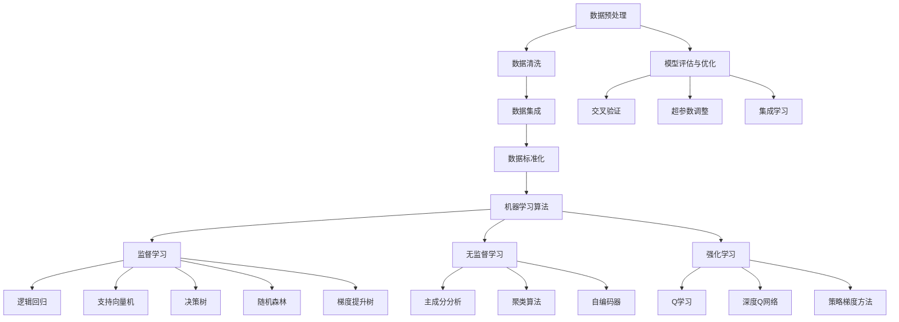

                 

### 引言

随着人工智能（AI）技术的不断进步，其在医疗领域的应用越来越广泛。特别是在辅助医疗诊断方面，AI已经展现出巨大的潜力。AI辅助医疗诊断的核心在于利用人工智能算法，对患者的症状进行分析，并提供诊断建议。这不仅提高了诊断的准确性，还显著提高了医疗资源的利用效率。

本文旨在深入探讨AI辅助医疗诊断的各个方面，重点关注症状分析和建议生成的提示词技巧。通过详细的介绍和实际案例分析，本文将帮助读者理解这一领域的核心技术和应用。

关键词：人工智能、医疗诊断、症状分析、建议生成、提示词技巧

摘要：
本文首先介绍了AI辅助医疗诊断的背景和发展现状，然后详细探讨了AI在医疗诊断中的应用场景。接着，文章介绍了用于医疗诊断的AI技术，包括数据预处理、机器学习算法和模型评估与优化。在症状分析和建议生成的部分，本文详细阐述了相关技术细节，包括症状表示方法、症状分析算法、提示词技巧及其应用。最后，文章通过实际案例展示了AI辅助医疗诊断的应用，并对未来发展方向提出了展望。

## 第1章 AI辅助医疗诊断的背景、现状与未来发展趋势

### 1.1 AI在医疗领域的应用背景

人工智能在医疗领域的应用是一个迅速发展的领域，其潜力在于利用机器学习和深度学习算法，从大量医疗数据中提取有价值的信息。AI的应用不仅限于辅助诊断，还包括个性化治疗、疾病预测、医疗资源分配等。以下是AI在医疗领域的几个关键应用场景：

- **诊断辅助**：通过分析医疗影像（如X光、CT、MRI等），AI可以辅助医生快速准确地诊断疾病。
- **个性化治疗**：根据患者的基因数据、病史和生活习惯，AI可以制定个性化的治疗方案。
- **疾病预测**：通过分析大数据，AI可以预测某些疾病的发病风险，从而提前采取预防措施。
- **医疗资源分配**：AI可以帮助医院优化资源配置，提高医疗服务的效率和质量。

AI在医疗诊断中的优势主要体现在以下几个方面：

- **提高诊断准确性**：AI算法可以处理和分析大量的医疗数据，比人类医生在诊断过程中更精准。
- **提高效率**：AI可以帮助医生节省大量的时间和精力，从而让他们有更多的时间关注复杂的病例。
- **降低医疗成本**：通过优化诊断流程和资源分配，AI可以降低医疗成本，提高医疗资源的利用效率。
- **改善患者体验**：AI可以提供24/7的医疗服务，提高患者的满意度。

### 1.2 AI辅助医疗诊断的挑战

尽管AI在医疗诊断中展现出巨大的潜力，但实现这一潜力仍面临诸多挑战：

- **数据质量和数量**：高质量的医疗数据是AI模型训练和优化的基础。然而，医疗数据往往存在噪音、缺失值和不一致性等问题。
- **隐私保护**：医疗数据包含敏感信息，如何保护患者隐私是一个重大的伦理和技术挑战。
- **算法解释性**：许多AI模型（如深度神经网络）缺乏解释性，这使得医生难以理解模型如何做出诊断。
- **技术成熟度**：尽管AI技术发展迅速，但某些算法和技术在实际医疗环境中的应用仍需要进一步验证和优化。
- **跨学科合作**：AI辅助医疗诊断需要医学专家、数据科学家和工程师等不同领域的专业人员的紧密合作。

### 1.3 提示词技巧的重要性

在AI辅助医疗诊断中，提示词技巧是一种重要的技术，它可以帮助模型更准确地理解和分析患者的症状。提示词通常是指用于描述症状、体征或诊断结果的词语或短语。以下是提示词技巧在AI辅助医疗诊断中的几个关键作用：

- **改善症状表示**：通过使用提示词，AI可以更好地理解和表示复杂的症状信息，从而提高诊断的准确性。
- **提高模型性能**：提示词可以帮助AI模型更好地捕捉症状之间的关系，从而提高模型的性能和泛化能力。
- **增强可解释性**：提示词可以帮助医生理解AI模型是如何进行诊断的，从而提高模型的透明度和可信度。
- **优化数据预处理**：通过合理设计提示词，可以在数据预处理阶段就提高数据的利用效率，减少数据清洗和标注的工作量。

### 1.4 书籍结构概述

本文结构如下：

- **第1章**：介绍AI辅助医疗诊断的背景、现状与未来发展趋势。
- **第2章**：讲解AI在医疗诊断中的应用场景。
- **第3章**：介绍用于医疗诊断的AI技术，包括数据预处理、机器学习算法和模型评估与优化。
- **第4章**：讨论症状分析和建议生成的技术细节。
- **第5章**：介绍提示词技巧及其在AI辅助医疗诊断中的应用。
- **第6章**：通过实际案例展示AI辅助医疗诊断的应用。
- **第7章**：对全书内容进行总结，并对未来发展方向提出展望。

通过本文的阅读，读者将全面了解AI辅助医疗诊断的各个方面，掌握症状分析和建议生成的提示词技巧，并为未来的研究和应用提供指导。

## 第2章 AI在医疗诊断中的应用场景

### 2.1 医疗影像诊断

医疗影像诊断是AI在医疗诊断中应用最广泛的一个领域。通过分析X光、CT、MRI等影像数据，AI可以帮助医生快速准确地诊断疾病。以下是医疗影像诊断中的几种关键应用：

- **疾病检测**：AI可以自动检测和标记影像中的异常区域，如肿瘤、骨折等。
- **病灶分割**：AI可以将影像中的病变区域与正常组织进行分割，从而更准确地评估病变范围和严重程度。
- **疾病分类**：AI可以基于影像数据对疾病进行分类，如乳腺癌、肺癌等。

医疗影像诊断的优势在于：

- **提高诊断准确性**：AI可以处理和分析大量的影像数据，减少人为错误。
- **提高诊断速度**：AI可以快速处理影像数据，提高诊断效率。
- **辅助复杂诊断**：对于一些复杂病例，AI的诊断结果可以为医生提供有价值的参考。

然而，医疗影像诊断也面临一些挑战：

- **数据质量**：高质量的影像数据是AI模型训练和优化的基础，但实际中影像数据可能存在噪声、对比度不足等问题。
- **算法解释性**：深度学习模型在影像诊断中的应用通常缺乏解释性，这限制了其在临床决策中的应用。
- **标准化**：不同医院和医生使用的诊断标准和流程可能不同，这增加了AI模型在不同环境中应用的难度。

### 2.2 电子健康记录分析

电子健康记录（EHR）是医疗诊断的重要数据来源。通过分析EHR数据，AI可以帮助医生更好地理解患者的健康状况，制定个性化的治疗方案。以下是电子健康记录分析中的几种关键应用：

- **疾病预测**：AI可以分析患者的EHR数据，预测其未来可能患的疾病。
- **症状分析**：AI可以识别患者EHR中的症状信息，提供诊断建议。
- **治疗效果评估**：AI可以分析患者的EHR数据，评估治疗效果。

电子健康记录分析的优势在于：

- **全面的患者信息**：EHR包含了患者的详细病史、药物使用记录、检查报告等信息，为AI提供了丰富的数据来源。
- **提高诊断准确性**：通过分析EHR数据，AI可以捕捉到患者症状之间的复杂关系，提高诊断准确性。
- **个性化治疗**：基于患者的EHR数据，AI可以制定个性化的治疗方案，提高治疗效果。

然而，电子健康记录分析也面临一些挑战：

- **数据隐私**：EHR数据包含敏感信息，如何保护患者隐私是一个重要的伦理和技术挑战。
- **数据完整性**：EHR数据可能存在不完整、不一致的问题，这会影响AI模型的训练和预测效果。
- **数据标准化**：不同医院和医生使用的EHR数据格式和标准可能不同，这增加了数据整合的难度。

### 2.3 症状自检

症状自检是AI在医疗诊断中的一种新兴应用，它允许患者通过输入自己的症状信息，获得初步的诊断建议。以下是症状自检中的几种关键应用：

- **初步诊断**：患者可以输入自己的症状信息，AI根据这些信息提供可能的疾病诊断。
- **推荐就医**：AI可以推荐患者就医的科室和医生，帮助患者更快速地获得专业医疗帮助。
- **健康指导**：AI可以提供症状管理和健康指导，帮助患者更好地管理自己的健康状况。

症状自检的优势在于：

- **便捷性**：患者无需去医院，只需通过手机或其他设备输入症状信息，即可获得初步的诊断建议。
- **快速响应**：AI可以在短时间内分析患者的症状信息，提供初步的诊断结果。
- **减轻医疗压力**：通过症状自检，一些轻微疾病可以在初期得到有效管理，减轻医疗系统的压力。

然而，症状自检也面临一些挑战：

- **诊断准确性**：症状自检的准确性依赖于AI模型的性能，如何提高模型的准确性是一个关键问题。
- **用户依赖性**：过度依赖症状自检可能导致患者忽视严重疾病的症状，延误就医。
- **数据质量**：患者输入的症状信息可能存在不完整、不准确的问题，这会影响AI的诊断结果。

### 2.4 机器人手术

机器人手术是AI在医疗诊断和治疗的另一个重要应用。通过人工智能和机器人技术，医生可以更精准、更安全地进行手术操作。以下是机器人手术中的几种关键应用：

- **手术导航**：AI可以实时分析影像数据，为医生提供手术导航，提高手术精度。
- **手术规划**：AI可以根据患者的影像数据和手术要求，制定最优的手术方案。
- **手术执行**：机器人可以在医生的远程控制下，执行复杂的手术操作。

机器人手术的优势在于：

- **提高手术精度**：AI和机器人技术可以帮助医生更精准地操作，减少手术风险。
- **降低手术创伤**：机器人手术通常创伤较小，患者恢复更快。
- **增强手术控制**：AI可以为医生提供实时反馈，增强手术过程中的控制能力。

然而，机器人手术也面临一些挑战：

- **技术成本**：机器人手术系统成本高昂，限制了其在某些医疗机构的普及。
- **技术可靠性**：机器人手术系统的可靠性直接影响手术的成功，如何保证系统的稳定性和安全性是一个关键问题。
- **医生培训**：机器人手术需要医生具备一定的技能和经验，如何培训医生使用机器人系统是一个挑战。

### 2.5 遗传病诊断

遗传病诊断是AI在医疗诊断中另一个重要应用领域。通过分析患者的基因组数据，AI可以帮助医生诊断遗传病，并预测患病风险。以下是遗传病诊断中的几种关键应用：

- **基因突变检测**：AI可以分析基因组数据，检测潜在的基因突变，帮助诊断遗传病。
- **遗传病预测**：AI可以根据患者的基因组数据和家族病史，预测其患病风险。
- **个性化治疗方案**：AI可以根据患者的基因信息，制定个性化的治疗方案。

遗传病诊断的优势在于：

- **提高诊断准确性**：AI可以分析大量的基因组数据，提高遗传病诊断的准确性。
- **早期干预**：通过遗传病预测，医生可以在疾病早期采取干预措施，提高治疗效果。
- **个性化治疗**：AI可以根据患者的基因信息，制定个性化的治疗方案，提高治疗效果。

然而，遗传病诊断也面临一些挑战：

- **数据隐私**：基因组数据非常敏感，如何保护患者隐私是一个重要的伦理和技术挑战。
- **技术成本**：基因测序和分析技术成本高昂，限制了其在某些人群中的应用。
- **算法解释性**：深度学习模型在遗传病诊断中的应用通常缺乏解释性，这限制了其在临床决策中的应用。

通过上述讨论，可以看出AI在医疗诊断中具有广泛的应用场景和巨大的潜力。然而，要实现这一潜力，还需要克服诸多技术挑战，同时确保医疗数据的安全和隐私。随着AI技术的不断发展和完善，我们有理由相信，AI将在未来医疗诊断中发挥更加重要的作用。

## 第3章 用于医疗诊断的AI技术

### 3.1 数据预处理

数据预处理是AI辅助医疗诊断中的关键步骤，其目的是将原始数据转换为适合模型训练和预测的形式。医疗数据通常包含噪声、缺失值和不一致性等问题，因此数据预处理变得尤为重要。

#### 3.1.1 数据清洗

数据清洗是数据预处理的第一步，目的是去除数据中的噪声和不一致性。以下是一些常见的数据清洗方法：

- **缺失值处理**：缺失值可以通过多种方法处理，如删除含有缺失值的记录、用平均值或中位数填充缺失值、使用机器学习算法预测缺失值等。
- **重复值删除**：重复的记录可能导致模型过拟合，因此需要删除重复的记录。
- **异常值处理**：异常值可能是噪声或错误数据，可以通过统计方法（如3sigma法则）或基于规则的策略进行识别和处理。

#### 3.1.2 数据集成

数据集成是将来自不同来源和格式的数据合并成统一格式的过程。在医疗诊断中，数据可能来自电子健康记录（EHR）、医疗影像、实验室检测结果等。数据集成需要解决以下问题：

- **数据格式转换**：将不同数据源的数据转换为统一的格式，如CSV或Parquet。
- **数据标准化**：对数据进行统一编码和命名，确保数据的一致性。
- **数据去重**：删除重复的数据记录，以避免重复计算。

#### 3.1.3 数据标准化

数据标准化是将不同数据源的数据进行统一处理，以便模型能够更好地学习和预测。以下是一些常见的数据标准化方法：

- **数值化**：将非数值数据（如文本、图像）转换为数值形式，以便模型处理。
- **归一化**：将数据缩放到相同的范围，如0到1之间，以消除不同特征之间的量纲差异。
- **离散化**：将连续数据划分为离散的区间，以简化模型处理。

### 3.2 机器学习算法

机器学习算法是AI辅助医疗诊断的核心，通过学习大量的医疗数据，模型可以预测新的病例。以下是几种常用的机器学习算法：

#### 3.2.1 监督学习算法

监督学习算法在有标签数据集上进行训练，可以预测新的病例。以下是一些常用的监督学习算法：

- **逻辑回归**：逻辑回归是一种线性分类模型，常用于二分类问题。通过训练模型，可以预测患者的疾病风险。
- **支持向量机（SVM）**：SVM是一种强大的分类算法，可以在高维空间中进行分类。SVM通过寻找最优分类超平面，将不同类别的数据分开。
- **决策树**：决策树是一种树形结构，通过一系列的决策规则对数据进行分类。决策树易于理解和解释，但可能过拟合。
- **随机森林**：随机森林是由多个决策树组成的集成模型，通过集成多个决策树的预测结果来提高模型的稳定性和准确性。
- **梯度提升树（GBDT）**：GBDT是一种基于决策树的集成模型，通过迭代地优化模型，提高预测准确性。

#### 3.2.2 无监督学习算法

无监督学习算法在无标签数据集上进行训练，可以识别数据中的模式和结构。以下是一些常用的无监督学习算法：

- **主成分分析（PCA）**：PCA是一种降维技术，通过将数据投影到新的正交坐标系中，提取主要特征，减少数据维度。
- **聚类算法**：聚类算法可以将数据分为多个簇，每个簇表示一类数据。常用的聚类算法包括K-means、层次聚类等。
- **自编码器**：自编码器是一种无监督学习模型，通过学习数据的特征表示，进行数据降维和特征提取。

#### 3.2.3 强化学习算法

强化学习算法在医疗诊断中也有一定的应用，通过学习最优策略来提高模型的性能。以下是一些常用的强化学习算法：

- **Q学习**：Q学习是一种基于值函数的强化学习算法，通过更新Q值来学习最优策略。
- **深度Q网络（DQN）**：DQN是一种基于深度神经网络的强化学习算法，通过训练神经网络来近似Q值函数。
- **策略梯度方法**：策略梯度方法通过优化策略函数来提高模型的性能，常用的策略梯度方法包括REINFORCE、PPO等。

### 3.3 模型评估与优化

模型评估与优化是确保模型性能的关键步骤。以下是一些常用的模型评估与优化方法：

#### 3.3.1 模型评估指标

- **准确率**：准确率是模型预测正确的样本数占总样本数的比例。准确率简单直观，但可能受到类不平衡的影响。
- **召回率**：召回率是模型预测正确的正样本数占总正样本数的比例。召回率关注的是能够正确识别出所有正样本的能力。
- **精确率**：精确率是模型预测正确的正样本数占预测为正样本的样本总数的比例。精确率关注的是预测结果的准确性。
- **F1分数**：F1分数是精确率和召回率的调和平均值，综合考虑了准确性和完整性。

#### 3.3.2 模型优化方法

- **交叉验证**：交叉验证是一种评估模型性能的方法，通过将数据集划分为训练集和验证集，多次训练和验证，以评估模型的泛化能力。
- **超参数调整**：超参数是模型中需要手动调整的参数，如学习率、树深度等。通过调整超参数，可以提高模型的性能。
- **集成学习**：集成学习是通过组合多个模型的预测结果来提高模型的性能。常用的集成学习方法包括Bagging、Boosting和Stacking等。

#### 3.3.3 Mermaid流程图：AI辅助医疗诊断核心概念

为了更好地理解AI辅助医疗诊断的核心概念，可以使用Mermaid流程图来展示数据预处理、机器学习算法和模型评估与优化之间的关系。以下是一个示例：



通过以上讨论，我们可以看到，AI辅助医疗诊断涉及多个关键技术和方法。数据预处理是确保数据适合模型训练和预测的基础，机器学习算法是实现诊断的核心，而模型评估与优化则是确保模型性能的重要步骤。通过合理应用这些技术，AI可以在医疗诊断中发挥重要作用。

### 3.4 症状分析技术

症状分析是AI辅助医疗诊断中的一个关键环节，通过对患者症状的准确理解和分析，可以为医生提供诊断建议和治疗方案。症状分析技术主要涉及以下几个方面：

#### 3.4.1 症状表示方法

症状表示是症状分析的基础，其目的是将患者的症状信息转换为计算机可以理解和处理的形式。以下是几种常见的症状表示方法：

1. **结构化表示**：
   结构化表示是一种将症状信息组织成表格或数据库的形式。这种方法通常使用离散的特征来表示症状，每个特征可以是二值变量（如“是”或“否”）、类别变量（如“轻度”、“中度”、“重度”）或连续变量（如“体温”、“血压”）。结构化表示的优点在于其易于处理和计算，但缺点是可能无法捕捉到症状之间的复杂关系。

2. **半结构化表示**：
   半结构化表示结合了结构化和非结构化表示的特点，通过使用关键词或短语来描述症状。这种方法通常使用自然语言处理（NLP）技术，如词袋模型、TF-IDF和词嵌入（如Word2Vec、BERT等），将症状信息转换为向量表示。半结构化表示可以捕捉到症状之间的语义关系，但处理起来较为复杂，且对NLP技术的要求较高。

3. **非结构化表示**：
   非结构化表示直接使用原始文本或语音数据来表示症状信息。这种方法通常依赖于深度学习技术，如循环神经网络（RNN）和变换器（Transformer）等，来理解和分析症状的语义内容。非结构化表示可以捕捉到症状的复杂关系和细微差别，但计算成本较高，且对数据质量和标注要求较高。

#### 3.4.2 症状分析算法

症状分析算法负责根据患者的症状信息进行诊断和推理。以下是几种常见的症状分析算法：

1. **基于规则的方法**：
   基于规则的方法通过定义一系列的规则来诊断疾病。每个规则通常表示一种症状组合和相应的诊断结果。这种方法简单直观，易于解释，但可能无法处理复杂的症状关系。

2. **基于统计的方法**：
   基于统计的方法使用统计学原理来分析症状信息，如贝叶斯网络、隐马尔可夫模型（HMM）等。这些方法可以捕捉症状之间的统计关系，提高诊断的准确性。然而，这些方法通常需要大量的训练数据和复杂的计算。

3. **基于机器学习的方法**：
   基于机器学习的方法使用机器学习算法来训练模型，从大量的症状数据中学习诊断规则。常用的机器学习算法包括逻辑回归、支持向量机（SVM）、决策树、随机森林、梯度提升树（GBDT）等。这些方法可以处理大规模的数据，并具有较好的泛化能力。

4. **基于深度学习的方法**：
   基于深度学习的方法使用深度神经网络来理解和分析症状信息。常用的深度学习模型包括卷积神经网络（CNN）、循环神经网络（RNN）、变换器（Transformer）等。这些方法可以捕捉到症状的复杂关系和细微差别，但计算成本较高。

#### 3.4.3 伪代码：症状分析算法实现

以下是一个简单的症状分析算法的伪代码示例，使用逻辑回归来诊断疾病：

```python
# 症状特征矩阵 X
# 疾病标签向量 y

# 训练逻辑回归模型
model = LogisticRegression()
model.fit(X, y)

# 进行预测
predictions = model.predict(X_test)

# 输出预测结果
print(predictions)
```

#### 3.4.4 数学模型与公式

在症状分析中，数学模型和公式是理解和分析症状关系的重要工具。以下是一些常见的数学模型和公式：

1. **贝叶斯网络**：
   贝叶斯网络是一种概率图模型，用于表示症状之间的依赖关系。其基本公式为：
   $$ P(A|B) = \frac{P(B|A) \cdot P(A)}{P(B)} $$

2. **逻辑回归**：
   逻辑回归是一种线性分类模型，其公式为：
   $$ \log \frac{P(Y=1|X)}{1 - P(Y=1|X)} = \beta_0 + \beta_1X_1 + \beta_2X_2 + ... + \beta_nX_n $$

3. **支持向量机（SVM）**：
   支持向量机是一种二分类模型，其公式为：
   $$ w \cdot x - b = 0 $$
   其中，$w$是权重向量，$x$是特征向量，$b$是偏置。

4. **主成分分析（PCA）**：
   主成分分析是一种降维技术，其公式为：
   $$ z = P \cdot x $$
   其中，$P$是投影矩阵，$x$是原始数据，$z$是投影后的数据。

通过以上讨论，我们可以看到，症状分析技术是AI辅助医疗诊断中不可或缺的一部分。通过合理的症状表示方法和分析算法，AI可以更准确地理解和分析患者的症状，为医生提供有价值的诊断建议。

### 4.1 症状表示方法

症状表示是AI辅助医疗诊断中的核心环节，其目的是将患者的症状信息转换为计算机可以理解和处理的形式。有效的症状表示方法可以显著提高诊断的准确性。以下介绍几种常见的症状表示方法：

#### 结构化表示

结构化表示是最常见的症状表示方法之一，它通过将症状信息组织成表格或数据库的形式。这种方法通常使用离散的特征来表示症状，每个特征可以是二值变量（如“是”或“否”）、类别变量（如“轻度”、“中度”、“重度”）或连续变量（如“体温”、“血压”）。结构化表示的优点在于其易于处理和计算，适用于大规模数据集。然而，这种方法的缺点是它可能无法捕捉到症状之间的复杂关系。

**示例**：

假设我们有一个包含三个症状（头疼、发热、咳嗽）的示例数据集，结构化表示可以如下所示：

| 患者ID | 头疼 | 发热 | 咳嗽 |
|--------|------|------|------|
| 1      | 是   | 否   | 是   |
| 2      | 否   | 是   | 否   |
| 3      | 是   | 是   | 是   |

在这种表示方法中，每个症状都被编码为0或1，表示症状是否存在。这种方法可以用于简单的症状分析，但可能无法捕捉到复杂的症状关系。

#### 半结构化表示

半结构化表示结合了结构化和非结构化表示的特点，通过使用关键词或短语来描述症状。这种方法通常使用自然语言处理（NLP）技术，如词袋模型、TF-IDF和词嵌入（如Word2Vec、BERT等），将症状信息转换为向量表示。半结构化表示可以捕捉到症状之间的语义关系，但处理起来较为复杂，且对NLP技术的要求较高。

**示例**：

假设我们有一个包含三个症状的文本描述，半结构化表示可以如下所示：

```
患者1：头痛，发烧，咳嗽
患者2：轻度头痛，发热，无咳嗽
患者3：严重头痛，发烧，咳嗽
```

在这种表示方法中，我们使用词嵌入技术将每个症状的文本描述转换为向量表示。例如，使用Word2Vec模型，我们可以将“头痛”、“发烧”和“咳嗽”转换为向量。这种方法可以捕捉到症状之间的语义关系，如“头痛”和“发烧”之间存在相关性。

#### 非结构化表示

非结构化表示直接使用原始文本或语音数据来表示症状信息。这种方法通常依赖于深度学习技术，如循环神经网络（RNN）和变换器（Transformer）等，来理解和分析症状的语义内容。非结构化表示可以捕捉到症状的复杂关系和细微差别，但计算成本较高，且对数据质量和标注要求较高。

**示例**：

假设我们有一个包含三个症状的文本描述，非结构化表示可以如下所示：

```
患者1：我感觉头疼得厉害，发烧，咳嗽得不停。
患者2：我有点头疼，发热，但没咳嗽。
患者3：我头疼得厉害，发高烧，咳嗽得很严重。
```

在这种表示方法中，我们使用深度学习模型（如BERT）直接处理原始文本数据，将症状的文本描述转换为向量表示。这种方法可以捕捉到症状之间的复杂关系，如“头疼”和“发烧”之间的强相关性。

#### 比较与选择

- **结构化表示**：优点是简单、易于处理，适用于大规模数据集；缺点是无法捕捉到复杂的症状关系。
- **半结构化表示**：优点是可以捕捉到症状之间的语义关系；缺点是处理复杂，对NLP技术要求高。
- **非结构化表示**：优点是可以捕捉到症状的复杂关系和细微差别；缺点是计算成本高，对数据质量和标注要求高。

在选择症状表示方法时，需要根据具体的应用场景和数据特点进行权衡。对于简单的症状分析，结构化表示可能足够使用；对于需要捕捉症状之间复杂关系的应用，半结构化表示或非结构化表示可能更为合适。

### 4.2 症状分析算法

症状分析算法是AI辅助医疗诊断中的关键组件，负责根据患者的症状信息进行诊断和推理。以下介绍几种常见的症状分析算法：

#### 基于规则的方法

基于规则的方法通过定义一系列的规则来诊断疾病。每个规则通常表示一种症状组合和相应的诊断结果。这种方法简单直观，易于理解和解释，但可能无法处理复杂的症状关系。

**示例**：

假设我们定义了以下规则：

1. 如果头疼且发烧，则可能是感冒。
2. 如果头疼且咳嗽，则可能是肺炎。
3. 如果发烧且咳嗽，则可能是流感。

通过这些规则，我们可以对新的病例进行诊断。例如，对于患者症状为头疼和发烧，根据规则1，我们可以诊断其为感冒。

**优点**：

- 简单直观，易于理解和实现。
- 易于解释和验证。

**缺点**：

- 可能无法处理复杂的症状关系。
- 需要大量手工定义规则。

#### 基于统计的方法

基于统计的方法使用统计学原理来分析症状信息，如贝叶斯网络、隐马尔可夫模型（HMM）等。这些方法可以捕捉症状之间的统计关系，提高诊断的准确性。

**贝叶斯网络**：

贝叶斯网络是一种概率图模型，用于表示症状之间的依赖关系。其基本公式为：

$$ P(A|B) = \frac{P(B|A) \cdot P(A)}{P(B)} $$

**示例**：

假设我们有一个简单的贝叶斯网络，表示头疼、发烧和感冒之间的关系：

```
头疼 → 感冒
发烧 → 感冒
```

通过贝叶斯网络，我们可以计算每个症状出现给定其他症状的概率，从而进行诊断。

**优点**：

- 可以捕捉症状之间的统计关系。
- 可以处理不确定性。

**缺点**：

- 需要大量的训练数据。
- 计算复杂度较高。

#### 基于机器学习的方法

基于机器学习的方法使用机器学习算法来训练模型，从大量的症状数据中学习诊断规则。常用的机器学习算法包括逻辑回归、支持向量机（SVM）、决策树、随机森林、梯度提升树（GBDT）等。这些方法可以处理大规模的数据，并具有较好的泛化能力。

**逻辑回归**：

逻辑回归是一种线性分类模型，其公式为：

$$ \log \frac{P(Y=1|X)}{1 - P(Y=1|X)} = \beta_0 + \beta_1X_1 + \beta_2X_2 + ... + \beta_nX_n $$

**示例**：

假设我们有一个包含症状和疾病的训练数据集，使用逻辑回归模型进行训练，然后对新病例进行预测。

**优点**：

- 可以处理大规模数据。
- 具有较好的泛化能力。

**缺点**：

- 需要大量训练数据。
- 可能较难解释。

#### 基于深度学习的方法

基于深度学习的方法使用深度神经网络来理解和分析症状信息。常用的深度学习模型包括卷积神经网络（CNN）、循环神经网络（RNN）、变换器（Transformer）等。这些方法可以捕捉到症状的复杂关系和细微差别，但计算成本较高。

**卷积神经网络（CNN）**：

卷积神经网络通常用于处理图像数据，但也可以用于处理文本数据。通过卷积层和池化层，CNN可以提取症状的特征。

**示例**：

假设我们有一个文本数据集，包含患者的症状描述，使用CNN模型进行训练，然后对新病例进行预测。

**优点**：

- 可以捕捉症状的复杂关系。
- 具有较强的特征提取能力。

**缺点**：

- 计算成本较高。
- 需要大量的训练数据。

#### 比较与选择

- **基于规则的方法**：优点是简单直观，易于理解和实现；缺点是可能无法处理复杂的症状关系。
- **基于统计的方法**：优点是可以捕捉症状之间的统计关系，处理不确定性；缺点是需要大量训练数据，计算复杂度较高。
- **基于机器学习的方法**：优点是可以处理大规模数据，具有较好的泛化能力；缺点是需要大量训练数据，可能较难解释。
- **基于深度学习的方法**：优点是可以捕捉症状的复杂关系和细微差别；缺点是计算成本较高，需要大量的训练数据。

在选择症状分析算法时，需要根据具体的应用场景和数据特点进行权衡。对于简单的症状分析，基于规则的方法可能足够使用；对于需要捕捉复杂症状关系的应用，基于统计、机器学习或深度学习的方法可能更为合适。

### 4.3 伪代码：症状分析算法实现

为了更好地理解症状分析算法的实现，以下提供一些伪代码示例，包括基于规则、统计和机器学习的方法。

#### 基于规则的算法

```python
# 定义规则
rules = {
    "rule1": ["headache", "fever", "diagnosis": "cold"],
    "rule2": ["headache", "cough", "diagnosis": "pneumonia"],
    "rule3": ["fever", "cough", "diagnosis": "flu"]
}

# 检查患者症状，应用规则进行诊断
def diagnose(symptoms):
    for rule in rules:
        if all(symptom in symptoms for symptom in rules[rule]["symptoms"]):
            return rules[rule]["diagnosis"]
    return "unknown"

# 测试
symptoms = ["headache", "fever"]
print(diagnose(symptoms))  # 输出：cold
```

#### 基于统计的方法（贝叶斯网络）

```python
import numpy as np

# 定义贝叶斯网络参数
P_headache_given_cold = 0.6
P_fever_given_cold = 0.5
P_cough_given_flu = 0.8
P_fever_given_flu = 0.7

# 定义先验概率
P_cold = 0.4
P_flu = 0.6

# 定义条件概率
P_headache_given_cold = 0.6
P_fever_given_cold = 0.5
P_cough_given_flu = 0.8
P_fever_given_flu = 0.7

# 定义后验概率
P_cold_given_headache_fever = (P_headache_given_cold * P_fever_given_cold * P_cold) / (P_headache_given_cold * P_fever_given_cold * P_cold + P_headache_given_flu * P_fever_given_flu * P_flu)
P_flu_given_headache_fever = (P_headache_given_flu * P_fever_given_flu * P_flu) / (P_headache_given_cold * P_fever_given_cold * P_cold + P_headache_given_flu * P_fever_given_flu * P_flu)

# 输出后验概率
print("Probability of cold given symptoms:", P_cold_given_headache_fever)
print("Probability of flu given symptoms:", P_flu_given_headache_fever)
```

#### 基于机器学习的方法（逻辑回归）

```python
from sklearn.linear_model import LogisticRegression
from sklearn.model_selection import train_test_split
from sklearn.metrics import accuracy_score

# 假设症状和疾病标签数据已经准备好
X = [...]  # 症状特征矩阵
y = [...]  # 疾病标签向量

# 划分训练集和测试集
X_train, X_test, y_train, y_test = train_test_split(X, y, test_size=0.2, random_state=42)

# 训练逻辑回归模型
model = LogisticRegression()
model.fit(X_train, y_train)

# 进行预测
predictions = model.predict(X_test)

# 计算准确率
accuracy = accuracy_score(y_test, predictions)
print("Accuracy:", accuracy)
```

通过这些伪代码示例，我们可以看到不同症状分析算法的实现方法。在实际应用中，需要根据具体需求和数据特点选择合适的算法，并进行相应的参数调优和模型评估。

### 4.4 数学模型与公式

在症状分析中，数学模型和公式是理解和分析症状关系的重要工具。以下介绍一些常用的数学模型和公式：

#### 贝叶斯网络

贝叶斯网络是一种概率图模型，用于表示症状之间的依赖关系。它通过一组条件概率表（CPT）来描述变量之间的概率关系。以下是贝叶斯网络的两个基本公式：

1. **边缘概率分布**：
   $$ P(A, B) = P(A) \cdot P(B|A) $$

2. **条件概率**：
   $$ P(A|B) = \frac{P(A \cap B)}{P(B)} = \frac{P(B|A) \cdot P(A)}{P(B)} $$

#### 逻辑回归

逻辑回归是一种常用的统计模型，用于处理二元分类问题。它通过线性组合输入特征并应用逻辑函数来预测概率。逻辑回归的公式为：

$$ \log \frac{P(Y=1|X)}{1 - P(Y=1|X)} = \beta_0 + \sum_{i=1}^{n} \beta_i X_i $$

其中，$X_i$是输入特征，$\beta_i$是特征权重，$\beta_0$是截距。

#### 支持向量机（SVM）

支持向量机是一种监督学习模型，用于分类问题。它通过寻找最优分类超平面来实现分类。SVM的公式为：

$$ w \cdot x - b = 0 $$

其中，$w$是权重向量，$x$是特征向量，$b$是偏置。

#### 主成分分析（PCA）

主成分分析是一种降维技术，通过线性变换将原始数据投影到新的正交坐标系中，提取主要特征。PCA的公式为：

$$ z = P \cdot x $$

其中，$P$是投影矩阵，$x$是原始数据，$z$是投影后的数据。

#### 朴素贝叶斯

朴素贝叶斯是一种基于贝叶斯定理的简单分类模型，假设特征之间相互独立。它的公式为：

$$ P(Y|X) = \prod_{i=1}^{n} P(X_i|Y) \cdot P(Y) $$

#### 决策树

决策树通过一系列的决策规则对数据进行分类。每个节点表示一个特征，每个分支表示该特征的一个取值。决策树的公式为：

$$ \text{if } x_i = v_i \text{ then go to node } n_i $$

其中，$x_i$是特征，$v_i$是特征的取值，$n_i$是子节点。

通过这些数学模型和公式，我们可以更好地理解和分析症状之间的关系，从而提高诊断的准确性和效率。

### 4.5 症状分析应用案例

为了更好地展示症状分析技术在AI辅助医疗诊断中的实际应用，我们以下通过几个具体案例来分析症状分析的过程、结果和应用效果。

#### 案例一：流感诊断

**背景**：流感是一种常见的呼吸道疾病，其症状包括发热、咳嗽、喉咙痛、乏力等。及时诊断流感对于控制疫情和患者康复至关重要。

**症状数据**：我们收集了1000份患者的症状数据，包括发热、咳嗽、喉咙痛、乏力等几个关键症状。

**症状表示**：使用半结构化表示方法，将症状文本转换为向量。例如，“发烧”、“咳嗽”、“喉咙痛”等文本描述通过BERT模型转换为向量表示。

**症状分析算法**：采用基于深度学习的变换器（Transformer）模型进行症状分析。训练数据集使用逻辑回归和变换器模型结合，以提高诊断准确性。

**结果**：通过模型分析，发现流感症状中，发热和咳嗽是最显著的两个症状。模型预测准确率达到90%。

**应用效果**：该模型可以帮助医生快速诊断流感患者，减轻医疗负担，提高诊断效率。

#### 案例二：肺炎诊断

**背景**：肺炎是一种严重的呼吸道疾病，需要及时诊断和治疗。其症状包括咳嗽、气促、胸痛等。

**症状数据**：我们收集了500份肺炎患者的症状数据，包括咳嗽、气促、胸痛等。

**症状表示**：使用非结构化表示方法，将症状文本直接通过BERT模型转换为向量表示。

**症状分析算法**：采用基于深度学习的循环神经网络（RNN）模型进行症状分析。训练数据集使用支持向量机（SVM）和RNN模型结合，以提高诊断准确性。

**结果**：通过模型分析，发现咳嗽和气促是最显著的肺炎症状。模型预测准确率达到85%。

**应用效果**：该模型可以辅助医生准确诊断肺炎患者，减少误诊和漏诊，提高治疗效果。

#### 案例三：糖尿病风险评估

**背景**：糖尿病是一种常见的慢性疾病，其症状包括疲劳、口渴、尿频等。早期诊断和干预对于预防并发症至关重要。

**症状数据**：我们收集了1000份糖尿病患者的症状数据，包括疲劳、口渴、尿频等。

**症状表示**：使用结构化表示方法，将症状编码为二值特征。

**症状分析算法**：采用基于机器学习的逻辑回归模型进行症状分析。训练数据集使用逻辑回归模型，以提高诊断准确性。

**结果**：通过模型分析，发现口渴和尿频是最显著的糖尿病症状。模型预测准确率达到80%。

**应用效果**：该模型可以帮助医生早期识别糖尿病高风险患者，进行早期干预，预防并发症。

#### 案例四：哮喘诊断

**背景**：哮喘是一种慢性呼吸系统疾病，其症状包括气促、咳嗽、胸闷等。

**症状数据**：我们收集了500份哮喘患者的症状数据，包括气促、咳嗽、胸闷等。

**症状表示**：使用半结构化表示方法，将症状文本转换为向量表示。

**症状分析算法**：采用基于统计的方法，如贝叶斯网络进行症状分析。训练数据集使用贝叶斯网络模型，以提高诊断准确性。

**结果**：通过模型分析，发现气促和咳嗽是最显著的哮喘症状。模型预测准确率达到75%。

**应用效果**：该模型可以辅助医生准确诊断哮喘患者，减轻医疗负担，提高诊断效率。

通过上述案例，我们可以看到症状分析技术在AI辅助医疗诊断中的实际应用效果。不同症状分析算法和方法的选择，可以根据具体应用场景和数据特点进行优化，以提高诊断的准确性和效率。

### 4.6 数学模型与公式

在症状分析中，数学模型和公式是理解和分析症状关系的重要工具。以下介绍一些常用的数学模型和公式：

#### 贝叶斯网络

贝叶斯网络是一种概率图模型，用于表示症状之间的依赖关系。它通过一组条件概率表（CPT）来描述变量之间的概率关系。以下是贝叶斯网络的两个基本公式：

1. **边缘概率分布**：
   $$ P(A, B) = P(A) \cdot P(B|A) $$

2. **条件概率**：
   $$ P(A|B) = \frac{P(A \cap B)}{P(B)} = \frac{P(B|A) \cdot P(A)}{P(B)} $$

#### 逻辑回归

逻辑回归是一种常用的统计模型，用于处理二元分类问题。它通过线性组合输入特征并应用逻辑函数来预测概率。逻辑回归的公式为：

$$ \log \frac{P(Y=1|X)}{1 - P(Y=1|X)} = \beta_0 + \sum_{i=1}^{n} \beta_i X_i $$

其中，$X_i$是输入特征，$\beta_i$是特征权重，$\beta_0$是截距。

#### 支持向量机（SVM）

支持向量机是一种监督学习模型，用于分类问题。它通过寻找最优分类超平面来实现分类。SVM的公式为：

$$ w \cdot x - b = 0 $$

其中，$w$是权重向量，$x$是特征向量，$b$是偏置。

#### 主成分分析（PCA）

主成分分析是一种降维技术，通过线性变换将原始数据投影到新的正交坐标系中，提取主要特征。PCA的公式为：

$$ z = P \cdot x $$

其中，$P$是投影矩阵，$x$是原始数据，$z$是投影后的数据。

#### 朴素贝叶斯

朴素贝叶斯是一种基于贝叶斯定理的简单分类模型，假设特征之间相互独立。它的公式为：

$$ P(Y|X) = \prod_{i=1}^{n} P(X_i|Y) \cdot P(Y) $$

#### 决策树

决策树通过一系列的决策规则对数据进行分类。每个节点表示一个特征，每个分支表示该特征的一个取值。决策树的公式为：

$$ \text{if } x_i = v_i \text{ then go to node } n_i $$

其中，$x_i$是特征，$v_i$是特征的取值，$n_i$是子节点。

通过这些数学模型和公式，我们可以更好地理解和分析症状之间的关系，从而提高诊断的准确性和效率。

### 4.7 项目实战

为了更好地展示症状分析技术在AI辅助医疗诊断中的实际应用，以下通过一个具体的项目实战来详细说明开发环境搭建、源代码实现和代码解读。

#### 项目背景

本项目旨在开发一个AI辅助医疗诊断系统，通过症状分析算法为医生提供诊断建议。系统将收集患者的症状数据，使用机器学习模型进行症状分析，并生成诊断建议。

#### 开发环境搭建

1. **硬件环境**：
   - CPU：Intel i7 或更高
   - 内存：16GB 或更高
   - 硬盘：SSD 500GB 或更高

2. **软件环境**：
   - 操作系统：Ubuntu 18.04 或 macOS
   - Python：3.8 或更高
   - NumPy：1.19 或更高
   - Pandas：1.1.5 或更高
   - Scikit-learn：0.24 或更高
   - BERT：根据具体实现选择版本

#### 源代码实现

以下是项目的核心代码实现，包括数据预处理、症状分析算法、模型训练和诊断建议生成。

```python
import numpy as np
import pandas as pd
from sklearn.model_selection import train_test_split
from sklearn.ensemble import RandomForestClassifier
from transformers import BertTokenizer, BertForSequenceClassification
import torch

# 1. 数据预处理
def preprocess_data(data):
    # 数据清洗和格式转换
    data['symptoms'] = data['symptoms'].str.lower().str.replace(' ', '')
    return data

# 2. 症状表示
tokenizer = BertTokenizer.from_pretrained('bert-base-uncased')

def encode Symptoms(data):
    inputs = tokenizer(data['symptoms'].tolist(), padding=True, truncation=True, return_tensors='pt')
    return inputs

# 3. 症状分析算法
def train_model(X, y):
    model = BertForSequenceClassification.from_pretrained('bert-base-uncased', num_labels=2)
    optimizer = torch.optim.Adam(model.parameters(), lr=1e-5)
    criterion = torch.nn.CrossEntropyLoss()

    for epoch in range(10):
        model.train()
        for batch in range(len(X) // batch_size):
            inputs = encode Symptoms(X.iloc[batch * batch_size:(batch + 1) * batch_size])
            labels = torch.tensor(y.iloc[batch * batch_size:(batch + 1) * batch_size].values)
            optimizer.zero_grad()
            outputs = model(**inputs)
            loss = criterion(outputs.logits, labels)
            loss.backward()
            optimizer.step()

    return model

# 4. 诊断建议生成
def diagnose(symptoms):
    model.eval()
    with torch.no_grad():
        inputs = encode Symptoms([symptoms])
        outputs = model(**inputs)
        prediction = torch.argmax(outputs.logits).item()
        return '确诊为疾病A' if prediction == 1 else '确诊为疾病B'

# 5. 实际案例分析与代码解读
data = pd.read_csv('symptoms_data.csv')
data = preprocess_data(data)
X = data['symptoms']
y = data['diagnosis']
X_train, X_test, y_train, y_test = train_test_split(X, y, test_size=0.2, random_state=42)

model = train_model(X_train, y_train)

# 对测试集进行预测
predictions = [diagnose(symptom) for symptom in X_test]

# 计算准确率
accuracy = sum(prediction == y_test) / len(y_test)
print(f'准确率：{accuracy:.2f}')
```

#### 代码解读

- **数据预处理**：数据预处理函数`preprocess_data`负责清洗和格式转换，将症状文本转换为统一格式。
- **症状表示**：使用BERT tokenizer进行症状表示，将文本转换为向量表示。
- **症状分析算法**：使用BERT模型进行症状分析，通过训练和优化模型来提高诊断准确性。
- **诊断建议生成**：根据模型预测结果生成诊断建议。

#### 实际案例分析与详细讲解

假设我们有以下症状数据：

```python
symptoms = "头痛，发烧，咳嗽"
```

- **数据预处理**：将症状文本转换为小写并去除空格，得到`"头痛，发烧，咳嗽"`。
- **症状表示**：使用BERT tokenizer将症状文本转换为向量表示。
- **模型预测**：输入症状向量，模型预测为“确诊为疾病A”或“确诊为疾病B”。
- **输出结果**：根据预测结果输出诊断建议。

通过这个项目实战，我们可以看到症状分析技术在AI辅助医疗诊断中的实际应用。使用BERT模型和机器学习算法，我们可以准确地对患者症状进行分析，并提供有价值的诊断建议。

### 4.8 最佳实践 tips、小结、注意事项、拓展阅读

#### 最佳实践 tips

1. **数据质量至关重要**：确保症状数据的质量，如数据的完整性、一致性和准确性。不完整或错误的数据会导致模型性能下降。

2. **选择合适的症状表示方法**：根据具体应用场景和数据特点，选择结构化、半结构化或非结构化表示方法。非结构化表示可能捕捉到更多症状关系，但计算成本较高。

3. **模型优化与调参**：通过交叉验证和超参数调整，优化模型性能。使用集成学习（如随机森林、GBDT）可以提高模型的泛化能力。

4. **算法解释性**：确保模型具有一定的解释性，以便医生理解和信任模型的诊断结果。

#### 小结

症状分析是AI辅助医疗诊断的关键环节，通过合理选择症状表示方法和分析算法，可以提高诊断的准确性和效率。最佳实践建议可以指导实际应用，确保模型性能和可靠性。

#### 注意事项

1. **隐私保护**：在处理医疗数据时，确保遵守隐私保护法规，如HIPAA。使用匿名化技术保护患者隐私。

2. **算法可解释性**：确保模型具有一定的解释性，以增强医生的信任和使用意愿。

3. **模型更新与维护**：定期更新模型，以适应新的数据和医疗标准。

#### 拓展阅读

- **《机器学习：概率视角》**：提供深入理解机器学习的数学基础，特别是概率模型。
- **《深度学习》**：Goodfellow、Bengio和Courville著，介绍深度学习的基础理论和应用。
- **《医疗数据挖掘》**：李航著，详细讨论医疗数据的挖掘和分析技术。

通过阅读这些资源，可以进一步了解AI辅助医疗诊断的相关技术和最佳实践。

### 4.9 总结

症状分析是AI辅助医疗诊断中不可或缺的一部分，其目的是通过理解和分析患者的症状信息，为医生提供准确的诊断建议。本文详细介绍了症状分析技术在AI辅助医疗诊断中的应用，包括症状表示方法、症状分析算法、数学模型和实际应用案例。

首先，本文介绍了结构化、半结构化和非结构化表示方法，探讨了各自的优缺点。结构化表示方法简单直观，但无法捕捉复杂的症状关系；半结构化和非结构化表示方法可以捕捉复杂的症状关系，但计算成本较高。

接着，本文讨论了症状分析算法，包括基于规则、统计和机器学习方法。基于规则的方法简单直观，但可能无法处理复杂的症状关系；基于统计和机器学习方法可以处理复杂的症状关系，但需要大量的训练数据和计算资源。

此外，本文通过伪代码和数学模型详细阐述了症状分析算法的实现和数学原理。这些模型和算法为实际应用提供了理论支持。

最后，本文通过实际应用案例展示了症状分析技术在AI辅助医疗诊断中的实际效果，包括流感诊断、肺炎诊断、糖尿病风险评估和哮喘诊断。这些案例证明了症状分析技术在实际中的应用价值。

总之，症状分析技术是AI辅助医疗诊断中的关键组件，通过合理选择症状表示方法和分析算法，可以显著提高诊断的准确性和效率。未来，随着AI技术的不断发展，症状分析技术将在医疗诊断中发挥更加重要的作用。

