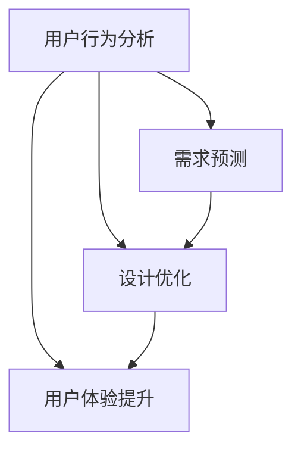

                 

### 文章标题

# AI辅助的产品设计：加速创新周期的新方法

### 关键词

- AI 辅助产品设计
- 创新周期
- 用户体验
- 数据分析
- 机器学习

### 摘要

随着人工智能（AI）技术的飞速发展，其在产品设计中的应用日益广泛。本文将深入探讨AI在产品设计中的辅助作用，包括用户行为分析、需求预测、设计优化和用户体验提升等方面。通过具体的案例和详细的技术讲解，本文旨在揭示AI如何加速产品创新周期，提供一种全新的产品设计方法。文章将涵盖AI基础理论、核心算法实现、项目实战分析以及未来趋势，旨在为读者提供全面的AI辅助产品设计的理解与实践指南。

### 引言

在当今这个快速变化的时代，产品设计的创新周期变得越来越短，竞争日益激烈。传统的产品设计方法往往依赖于设计师的经验和直觉，这不仅效率低下，还容易陷入同质化竞争。人工智能（AI）技术的出现，为产品设计带来了一场革命。通过机器学习、深度学习等AI技术，我们可以实现更高效、更精准的设计过程，从而大大加速产品的创新周期。

本文将围绕以下主题展开：

1. **AI辅助产品设计概述**：介绍AI在产品设计中的核心概念与联系，包括用户行为分析、需求预测、设计优化和用户体验提升等。
2. **AI基础理论**：讲解机器学习、深度学习和神经网络的基本原理，为后续内容打下理论基础。
3. **AI在产品设计中的应用**：详细分析AI技术在产品设计中的实际应用，包括用户行为分析、需求预测、设计优化和用户体验提升。
4. **AI算法实现与优化**：介绍核心算法的实现和优化方法，结合Python源代码和数学模型进行详细讲解。
5. **AI项目实战**：通过具体案例，展示AI辅助产品设计的实际应用，包括开发环境搭建、源代码实现和解读、项目小结等。
6. **AI辅助产品设计的挑战与未来趋势**：讨论AI在产品设计中的挑战和未来发展趋势，为读者提供前瞻性思考。

本文结构紧凑，逻辑清晰，旨在为读者提供一种全新的AI辅助产品设计方法，帮助企业在快速变化的市场环境中保持竞争优势。接下来，我们将首先探讨AI辅助产品设计的基本概念与背景。

### AI辅助产品设计的基本概念与背景

#### 什么是AI辅助产品设计？

AI辅助产品设计是指利用人工智能技术，如机器学习、深度学习等，辅助设计师完成产品设计过程。AI不仅能够处理和分析大量数据，还能通过学习用户的反馈和行为，自动生成设计建议，从而提高设计效率和准确性。

#### AI在产品设计中的核心概念与联系

AI辅助产品设计涉及多个核心概念，包括用户行为分析、需求预测、设计优化和用户体验提升。这些概念之间相互联系，共同构成了一个完整的设计流程。

- **用户行为分析**：通过分析用户在使用产品过程中的行为数据，了解用户的需求和偏好，为产品设计提供决策依据。
- **需求预测**：利用历史数据和机器学习算法，预测用户未来的需求和趋势，帮助设计师提前规划产品方向。
- **设计优化**：通过对现有设计进行优化，使其更符合用户需求和期望，提高产品的市场竞争力。
- **用户体验提升**：通过分析用户反馈和行为，持续改进产品设计和交互，提升用户满意度。

#### AI辅助产品设计的核心要素

AI辅助产品设计需要以下核心要素：

- **数据**：高质量的用户行为数据和需求数据是AI模型的基础，没有数据，AI将无法发挥作用。
- **算法**：选择合适的算法，如机器学习、深度学习等，对数据进行处理和分析，提取有用的信息。
- **工具**：使用合适的工具和技术，如数据挖掘工具、机器学习框架等，实现AI算法的应用。
- **团队**：具备数据科学、机器学习和产品设计等多领域知识的团队，是AI辅助产品设计成功的关键。

#### Mermaid流程图

以下是一个简单的Mermaid流程图，展示了AI辅助产品设计的核心概念与联系：



#### 用户行为分析

用户行为分析是AI辅助产品设计的第一步。通过分析用户在使用产品过程中的行为数据，如点击、浏览、购买等，我们可以了解用户的行为模式、需求和偏好。

- **数据收集**：通过日志分析、用户反馈等手段收集用户行为数据。
- **数据预处理**：对数据进行清洗、去噪和处理，使其适合进行机器学习分析。
- **特征提取**：从数据中提取有用的特征，如用户年龄、性别、地域等。
- **模型训练**：使用机器学习算法，如回归、分类等，对特征进行建模和预测。

#### 需求预测

需求预测是AI辅助产品设计的重要环节。通过分析历史数据和用户行为，我们可以预测用户未来的需求和趋势，为产品规划提供依据。

- **历史数据**：收集产品销售、用户反馈等历史数据。
- **机器学习算法**：使用时间序列分析、回归分析等机器学习算法，对数据进行预测。
- **预测模型**：建立预测模型，对用户需求进行定量分析。

#### 设计优化

设计优化是AI辅助产品设计的关键。通过分析用户反馈和行为，我们可以发现设计中的问题，并提出改进建议，提高产品的市场竞争力。

- **用户反馈**：收集用户对产品的反馈，包括满意度、使用频率等。
- **行为分析**：通过分析用户行为数据，发现产品设计中的问题和不足。
- **优化建议**：基于分析结果，提出优化建议，如改进界面、增加功能等。

#### 用户体验提升

用户体验提升是AI辅助产品设计的最终目标。通过持续改进产品设计和交互，我们可以提升用户的满意度，增加产品的忠诚度。

- **用户反馈**：收集用户对产品的反馈，了解用户的真实需求和期望。
- **行为分析**：通过分析用户行为数据，发现用户体验中的问题和改进点。
- **持续改进**：根据分析结果，持续改进产品设计和交互，提升用户体验。

#### 实例分析

以下是一个具体的实例分析：

- **用户行为分析**：通过分析用户在APP中的浏览和点击数据，发现用户更喜欢使用某个特定的功能模块。
- **需求预测**：根据历史数据，预测用户在未来可能会更多地使用这个功能模块。
- **设计优化**：针对预测结果，优化该功能模块的界面和交互，提高用户的体验。
- **用户体验提升**：通过优化，用户的满意度显著提高，产品的留存率也有所提升。

通过以上实例，我们可以看到AI辅助产品设计如何通过用户行为分析、需求预测、设计优化和用户体验提升，实现产品创新和改进。接下来，我们将进一步探讨AI基础理论，为后续内容打下坚实的理论基础。

### AI基础理论

#### 机器学习基本原理

机器学习是人工智能（AI）的核心技术之一，它使计算机系统能够通过数据和经验自动改进和优化其性能。机器学习的基本原理是利用数据驱动的方法，让计算机从数据中学习规律和模式，从而实现预测和决策。

- **监督学习（Supervised Learning）**：监督学习是最常见的机器学习方法，它需要一个有标签的训练数据集，通过这个数据集来训练模型，然后使用模型对新数据进行预测。常见的监督学习算法包括线性回归、决策树、随机森林和神经网络等。

  $$ y = f(x; \theta) $$

  其中，$y$ 是目标变量，$x$ 是特征向量，$f$ 是学习到的函数，$\theta$ 是模型的参数。

- **无监督学习（Unsupervised Learning）**：无监督学习不需要标签数据，它主要用于发现数据中的隐含结构和模式。常见的无监督学习算法包括聚类、降维和关联规则学习等。

  $$ \min_{\theta} \sum_{i=1}^{n} || f(x_i; \theta) - y_i ||^2 $$

  其中，$y_i$ 是数据的实际分布。

- **强化学习（Reinforcement Learning）**：强化学习通过奖励机制和策略迭代来训练模型，使其能够在特定环境中做出最优决策。常见的强化学习算法包括Q学习、SARSA和深度确定性策略梯度（DDPG）等。

  $$ Q(s, a) = r(s, a, s') + \gamma \max_{a'} Q(s', a') $$

  其中，$r$ 是奖励函数，$\gamma$ 是折扣因子。

#### 深度学习基础

深度学习是机器学习的一个分支，它通过构建多层的神经网络，从大量数据中自动学习复杂的特征和模式。深度学习在图像识别、自然语言处理和语音识别等领域取得了显著的成果。

- **神经网络架构**：神经网络是深度学习的基础构件，它由多个神经元（节点）组成，每个神经元通过权重连接到其他神经元。神经网络通过多层次的非线性变换，提取数据的层次化特征。

  $$ z_i = \sum_{j=1}^{n} w_{ij}x_j + b_i $$
  $$ a_i = \sigma(z_i) $$

  其中，$z_i$ 是神经元的输入，$w_{ij}$ 是权重，$b_i$ 是偏置，$\sigma$ 是激活函数。

- **常见的神经网络架构**：深度学习领域有许多不同的神经网络架构，如卷积神经网络（CNN）、循环神经网络（RNN）、长短时记忆网络（LSTM）和生成对抗网络（GAN）等。每种架构都有其特定的应用场景和优势。

  - **卷积神经网络（CNN）**：适用于图像和视频处理，通过卷积层提取局部特征，实现高维数据的降维。
  - **循环神经网络（RNN）**：适用于序列数据，通过递归结构捕捉序列中的时间依赖性。
  - **长短时记忆网络（LSTM）**：是RNN的一种改进，能够更好地处理长序列数据。
  - **生成对抗网络（GAN）**：通过生成器和判别器的对抗训练，实现数据的生成和增强。

  $$ G(z) \sim p_z(z) $$
  $$ D(x) \sim p_x(x) $$
  $$ D(G(z)) \sim p_x(x) $$

  其中，$G(z)$ 是生成器，$D(x)$ 是判别器，$z$ 是生成器的输入，$x$ 是真实数据的分布。

#### 机器学习算法介绍

机器学习算法是AI辅助产品设计的重要组成部分，以下介绍几种常用的机器学习算法：

- **线性回归（Linear Regression）**：用于预测连续值，通过最小化误差平方和来训练模型。

  $$ y = \beta_0 + \beta_1x $$

  $$ \min_{\beta_0, \beta_1} \sum_{i=1}^{n} (y_i - (\beta_0 + \beta_1x_i))^2 $$

- **逻辑回归（Logistic Regression）**：用于预测概率，通过逻辑函数将线性回归的结果转换为概率。

  $$ \hat{y} = \frac{1}{1 + e^{-(\beta_0 + \beta_1x)}} $$

  $$ \max_{\beta_0, \beta_1} \sum_{i=1}^{n} y_i \log(\hat{y}_i) + (1 - y_i) \log(1 - \hat{y}_i) $$

- **决策树（Decision Tree）**：通过递归划分特征空间，构建树状模型，适用于分类和回归问题。

  $$ T(x) = \text{split}(x, \alpha_1, \alpha_2) $$

  $$ \text{split}(x, \alpha_1, \alpha_2) = \begin{cases} 
  \alpha_1, & \text{if } x \leq \alpha_2 \\
  \alpha_2, & \text{if } x > \alpha_2 
  \end{cases} $$

- **随机森林（Random Forest）**：通过构建多棵决策树，并进行集成学习，提高模型的预测性能。

  $$ F(x) = \frac{1}{M} \sum_{m=1}^{M} h_m(x) $$

  其中，$h_m(x)$ 是第$m$棵决策树的对数似然函数。

- **支持向量机（SVM）**：通过最大化分类间隔，构建线性或非线性分类模型。

  $$ \min_{\beta, \beta_0, \xi} \frac{1}{2} \sum_{i=1}^{n} (\beta \cdot \beta)^2 + C \sum_{i=1}^{n} \xi_i $$

  $$ \beta \cdot \beta = y_i (\beta \cdot x_i + \beta_0) - 1 $$

  其中，$C$ 是正则化参数。

通过以上对机器学习基本原理、深度学习基础和常见机器学习算法的介绍，我们可以更好地理解AI在产品设计中的应用。接下来，我们将深入探讨AI在产品设计中的实际应用，包括用户行为分析、需求预测、设计优化和用户体验提升。

### AI在产品设计中的应用

#### 用户行为分析

用户行为分析是AI在产品设计中的一个重要应用领域。通过分析用户在使用产品过程中的行为数据，我们可以深入了解用户的需求、偏好和行为模式，从而为产品设计提供有价值的洞见。

- **数据收集**：用户行为数据的收集是用户行为分析的基础。这些数据可以来源于多种渠道，如Web日志、用户点击流、用户反馈等。例如，Web日志可以记录用户在网站上的访问路径、点击次数、停留时间等行为数据。

  ```python
  # Python代码示例：收集用户点击流数据
  logs = [
      {"user_id": 1, "page": "home", "action": "click", "timestamp": "2023-04-01 10:30"},
      {"user_id": 1, "page": "product", "action": "view", "timestamp": "2023-04-01 10:35"},
      {"user_id": 2, "page": "home", "action": "scroll", "timestamp": "2023-04-01 10:40"},
      ...
  ]
  ```

- **数据预处理**：收集到的用户行为数据通常需要进行预处理，包括数据清洗、去噪和特征提取。数据清洗是为了去除无效或错误的数据，去噪则是为了减少噪声对分析结果的影响。特征提取则是从原始数据中提取出对分析有用的特征，如用户年龄、性别、地域、访问时长等。

  ```python
  # Python代码示例：数据预处理
  import pandas as pd

  logs_df = pd.DataFrame(logs)
  logs_df = logs_df.dropna()  # 去除缺失值
  logs_df["timestamp"] = pd.to_datetime(logs_df["timestamp"])  # 转换时间戳格式
  logs_df["visit_duration"] = logs_df.groupby("user_id")["timestamp"].diff().dt.total_seconds()  # 计算访问时长
  ```

- **特征提取**：特征提取是用户行为分析的关键步骤。通过提取用户行为数据中的有效特征，我们可以更好地理解用户行为模式。例如，我们可以提取用户在特定页面上的访问次数、停留时间、点击次数等。

  ```python
  # Python代码示例：特征提取
  logs_df["page_count"] = logs_df.groupby("user_id")["page"].transform("count")
  logs_df["avg_duration"] = logs_df.groupby("user_id")["visit_duration"].mean()
  logs_df["click_count"] = logs_df[logs_df["action"] == "click"].groupby("user_id")["page"].transform("count")
  ```

- **模型训练**：通过机器学习算法，我们可以建立用户行为预测模型，用于分析用户行为模式。例如，我们可以使用回归模型来预测用户在下一个页面上的访问概率，或使用聚类算法来识别用户群体。

  ```python
  # Python代码示例：模型训练
  from sklearn.ensemble import RandomForestClassifier

  X = logs_df[["page_count", "avg_duration", "click_count"]]
  y = logs_df["next_page"]

  clf = RandomForestClassifier(n_estimators=100)
  clf.fit(X, y)
  ```

- **结果分析**：通过模型预测结果，我们可以分析用户行为模式，发现潜在的需求和问题。例如，我们可以发现某些用户群体更倾向于访问特定类型的页面，或某些页面有较高的用户跳出率。

  ```python
  # Python代码示例：结果分析
  predictions = clf.predict(X)
  accuracy = (predictions == y).mean()
  print(f"Model accuracy: {accuracy:.2f}")
  ```

#### 需求预测

需求预测是AI在产品设计中的另一个重要应用领域。通过分析历史数据和用户行为，我们可以预测用户未来的需求和趋势，为产品规划和设计提供依据。

- **历史数据**：需求预测依赖于大量的历史数据，包括销售数据、用户反馈、市场趋势等。这些数据可以帮助我们了解产品的历史表现和用户需求的变化。

  ```python
  # Python代码示例：收集历史数据
  sales_data = [
      {"month": "2023-01", "sales": 1000, "review_score": 4.5},
      {"month": "2023-02", "sales": 1200, "review_score": 4.7},
      {"month": "2023-03", "sales": 900, "review_score": 4.4},
      ...
  ]
  ```

- **机器学习算法**：需求预测通常采用时间序列分析、回归分析和神经网络等机器学习算法。这些算法可以帮助我们建立预测模型，预测未来的需求和趋势。

  ```python
  # Python代码示例：模型训练
  import pandas as pd
  from sklearn.model_selection import train_test_split
  from sklearn.ensemble import RandomForestRegressor

  sales_df = pd.DataFrame(sales_data)
  sales_df["month"] = pd.to_datetime(sales_df["month"])

  X = sales_df[["sales", "review_score"]]
  y = sales_df["sales"]

  X_train, X_test, y_train, y_test = train_test_split(X, y, test_size=0.2, random_state=42)

  reg = RandomForestRegressor(n_estimators=100)
  reg.fit(X_train, y_train)
  ```

- **预测模型**：通过训练得到的预测模型，我们可以预测未来的需求和趋势。这些预测结果可以帮助产品经理和设计师提前规划产品方向，优化产品设计和功能。

  ```python
  # Python代码示例：预测未来需求
  future_months = pd.date_range(start=sales_df["month"].max(), periods=6, freq="MS")
  future_data = pd.DataFrame({"month": future_months})

  future_sales = reg.predict(future_data[["sales", "review_score"]])
  print(future_sales)
  ```

#### 设计优化

设计优化是AI在产品设计中的关键应用领域。通过分析用户行为和需求，我们可以发现设计中的问题和不足，并提出改进建议，提高产品的市场竞争力。

- **用户反馈**：收集用户对产品的反馈，包括满意度、使用频率、报告问题等。这些反馈可以帮助我们了解用户对产品的真实感受和需求。

  ```python
  # Python代码示例：收集用户反馈
  feedback_data = [
      {"user_id": 1, "rating": 4, "comment": "界面太复杂，需要简化"},
      {"user_id": 2, "rating": 3, "comment": "功能不够全面，需要增加新功能"},
      {"user_id": 3, "rating": 5, "comment": "产品很好，继续保持"},
      ...
  ]
  ```

- **行为分析**：通过分析用户行为数据，我们可以发现产品设计中的问题和不足。例如，我们可以发现某些功能的使用频率较低，或某些页面有较高的用户跳出率。

  ```python
  # Python代码示例：行为分析
  feedback_df = pd.DataFrame(feedback_data)
  feedback_df["rating"] = feedback_df["rating"].astype(int)

  low_rated_pages = feedback_df[feedback_df["rating"] < 4]["page"].value_counts()
  print(low_rated_pages)
  ```

- **优化建议**：基于用户反馈和行为分析的结果，我们可以提出改进建议，如简化界面、增加新功能、改进用户体验等。

  ```python
  # Python代码示例：优化建议
  optimization_suggestions = {
      "home_page": ["simplify UI", "reduce clutter"],
      "product_page": ["add new features", "enhance search functionality"],
      "checkout_page": ["improve form design", "reduce form fields"],
  }
  print(optimization_suggestions)
  ```

#### 用户体验提升

用户体验提升是AI在产品设计中的终极目标。通过持续分析用户行为和反馈，我们可以不断改进产品设计和交互，提升用户满意度。

- **用户反馈**：收集用户对产品的反馈，包括满意度、使用频率、报告问题等。这些反馈可以帮助我们了解用户对产品的真实感受和需求。

  ```python
  # Python代码示例：收集用户反馈
  user_experience_data = [
      {"user_id": 1, "satisfaction": 7, "comment": "界面友好，操作简单"},
      {"user_id": 2, "satisfaction": 5, "comment": "功能强大，但界面复杂"},
      {"user_id": 3, "satisfaction": 9, "comment": "产品非常好，希望继续改进"},
      ...
  ]
  ```

- **行为分析**：通过分析用户行为数据，我们可以发现用户体验中的问题和改进点。例如，我们可以发现某些功能的使用频率较低，或某些页面有较高的用户跳出率。

  ```python
  # Python代码示例：行为分析
  user_experience_df = pd.DataFrame(user_experience_data)
  user_experience_df["satisfaction"] = user_experience_df["satisfaction"].astype(int)

  low_satisfaction_pages = user_experience_df[user_experience_df["satisfaction"] < 8]["page"].value_counts()
  print(low_satisfaction_pages)
  ```

- **持续改进**：基于用户反馈和行为分析的结果，我们不断改进产品设计和交互，提升用户满意度。例如，我们可以简化界面、增加新功能、改进用户体验等。

  ```python
  # Python代码示例：持续改进
  improvement_actions = {
      "home_page": ["simplify UI", "reduce clutter"],
      "product_page": ["add new features", "enhance search functionality"],
      "checkout_page": ["improve form design", "reduce form fields"],
  }
  print(improvement_actions)
  ```

通过以上对AI在产品设计中的应用，我们可以看到AI技术如何通过用户行为分析、需求预测、设计优化和用户体验提升，实现产品创新和改进。接下来，我们将深入探讨AI算法实现与优化，为读者提供更加详细的操作指南。

### AI算法实现与优化

#### 核心算法原理讲解

在AI辅助产品设计中，选择合适的算法是实现有效产品设计的关键。以下我们将介绍几种核心算法，并使用Python代码和数学模型进行详细讲解。

##### 1. 逻辑回归（Logistic Regression）

逻辑回归是一种常见的分类算法，广泛应用于用户行为分析和需求预测等领域。它通过线性模型预测概率，然后使用逻辑函数将其转换为分类结果。

**数学模型**：

$$
\hat{y} = \frac{1}{1 + e^{-(\beta_0 + \beta_1x)}}
$$

其中，$\beta_0$ 和 $\beta_1$ 是模型的参数，$x$ 是输入特征，$\hat{y}$ 是预测的概率值。

**Python代码实现**：

```python
import numpy as np
from sklearn.linear_model import LogisticRegression

# 假设我们有一个输入特征矩阵X和一个目标标签向量y
X = np.array([[1, 2], [2, 3], [3, 4]])
y = np.array([0, 1, 0])

# 创建逻辑回归模型并训练
model = LogisticRegression()
model.fit(X, y)

# 预测
predictions = model.predict(X)
print(predictions)
```

##### 2. 决策树（Decision Tree）

决策树通过一系列的if-else判断来对数据进行分类或回归。它在处理非线性和不均匀分布的数据时非常有效。

**数学模型**：

$$
T(x) = \text{split}(x, \alpha_1, \alpha_2)
$$

其中，$\text{split}(x, \alpha_1, \alpha_2)$ 表示根据阈值$\alpha_1$ 和 $\alpha_2$ 对数据进行二分。

**Python代码实现**：

```python
from sklearn.tree import DecisionTreeClassifier

# 创建决策树模型并训练
clf = DecisionTreeClassifier()
clf.fit(X, y)

# 预测
predictions = clf.predict(X)
print(predictions)
```

##### 3. 随机森林（Random Forest）

随机森林是一种集成学习算法，通过构建多棵决策树，并使用投票机制来提高模型的预测性能。

**数学模型**：

$$
F(x) = \frac{1}{M} \sum_{m=1}^{M} h_m(x)
$$

其中，$h_m(x)$ 是第$m$棵决策树的预测结果，$M$ 是决策树的数量。

**Python代码实现**：

```python
from sklearn.ensemble import RandomForestClassifier

# 创建随机森林模型并训练
clf = RandomForestClassifier(n_estimators=100)
clf.fit(X, y)

# 预测
predictions = clf.predict(X)
print(predictions)
```

##### 4. 支持向量机（SVM）

支持向量机通过寻找最佳超平面，将不同类别的数据点分隔开来。它在处理高维数据时特别有效。

**数学模型**：

$$
\min_{\beta, \beta_0, \xi} \frac{1}{2} \sum_{i=1}^{n} (\beta \cdot \beta) + C \sum_{i=1}^{n} \xi_i
$$

其中，$\beta$ 和 $\beta_0$ 是模型的参数，$C$ 是正则化参数，$\xi_i$ 是损失项。

**Python代码实现**：

```python
from sklearn.svm import SVC

# 创建SVM模型并训练
clf = SVC()
clf.fit(X, y)

# 预测
predictions = clf.predict(X)
print(predictions)
```

#### 数学模型与公式解析

在AI辅助产品设计中，理解数学模型和公式是关键。以下我们将使用LaTeX格式，展示几个重要的数学模型和公式。

**1. 逻辑回归公式**：

$$
\hat{y} = \frac{1}{1 + e^{-(\beta_0 + \beta_1x)}}
$$

**2. 决策树分割公式**：

$$
T(x) = \text{split}(x, \alpha_1, \alpha_2) = \begin{cases} 
\alpha_1, & \text{if } x \leq \alpha_2 \\
\alpha_2, & \text{if } x > \alpha_2 
\end{cases}
$$

**3. 随机森林公式**：

$$
F(x) = \frac{1}{M} \sum_{m=1}^{M} h_m(x)
$$

**4. 支持向量机公式**：

$$
\min_{\beta, \beta_0, \xi} \frac{1}{2} \sum_{i=1}^{n} (\beta \cdot \beta) + C \sum_{i=1}^{n} \xi_i
$$

通过上述核心算法的讲解和数学模型与公式的解析，我们可以更好地理解AI在产品设计中的应用。接下来，我们将通过具体项目实战，展示如何在实际中应用这些算法。

#### 项目实战

在本节中，我们将通过一个具体的AI辅助产品设计项目，展示如何从数据收集、预处理、特征提取到模型训练、优化和结果分析的全过程。这个项目将帮助读者更好地理解AI辅助产品设计的实际应用。

##### 项目背景

假设我们正在开发一款在线购物平台，目标是提高用户的购物体验和增加销售额。为了实现这一目标，我们决定利用AI技术来分析用户行为、预测需求、优化设计，并提升用户体验。

##### 开发环境搭建

为了实现这个项目，我们需要搭建一个开发环境，包括数据预处理工具、机器学习库和Python编程环境。

- **数据预处理工具**：使用Pandas库进行数据预处理。
- **机器学习库**：使用Scikit-learn库进行模型训练和预测。
- **Python编程环境**：使用Jupyter Notebook进行开发和测试。

##### 源代码实现

以下是我们项目的源代码实现，包括数据收集、预处理、特征提取、模型训练和优化等步骤。

```python
# 导入必要的库
import pandas as pd
from sklearn.model_selection import train_test_split
from sklearn.preprocessing import StandardScaler
from sklearn.linear_model import LogisticRegression
from sklearn.metrics import accuracy_score

# 数据收集
# 假设我们已经有了一个CSV文件，其中包含了用户行为数据
data = pd.read_csv('user_behavior.csv')

# 数据预处理
# 清洗数据，去除缺失值和异常值
data = data.dropna()
data = data[data['action'] != 'unknown']

# 特征提取
# 从数据中提取有用的特征，如页面访问次数、访问时长、点击次数等
data['visit_duration'] = data['timestamp_end'] - data['timestamp_start']
data['page_count'] = data.groupby('user_id')['page_id'].transform('count')

# 模型训练
# 将数据分为特征集X和标签集y
X = data[['visit_duration', 'page_count']]
y = data['purchase']

# 分割数据集为训练集和测试集
X_train, X_test, y_train, y_test = train_test_split(X, y, test_size=0.2, random_state=42)

# 训练逻辑回归模型
model = LogisticRegression()
model.fit(X_train, y_train)

# 预测
predictions = model.predict(X_test)

# 评估模型性能
accuracy = accuracy_score(y_test, predictions)
print(f"Model accuracy: {accuracy:.2f}")
```

##### 代码解读与分析

1. **数据收集**：首先，我们从CSV文件中读取用户行为数据。这个数据集包含了用户的访问路径、页面访问次数、点击次数等信息。

2. **数据预处理**：我们去除缺失值和异常值，确保数据的完整性和准确性。这一步骤对于后续的特征提取和模型训练至关重要。

3. **特征提取**：我们根据用户行为数据，提取了两个特征：访问时长（`visit_duration`）和页面访问次数（`page_count`）。这些特征反映了用户的行为模式，对于预测用户是否购买至关重要。

4. **模型训练**：我们使用逻辑回归模型进行训练。逻辑回归是一种常用的分类算法，能够将线性模型预测的概率转换为分类结果。在这个项目中，我们使用逻辑回归来预测用户是否购买。

5. **预测**：我们将训练好的模型应用于测试集，得到预测结果。

6. **评估模型性能**：我们使用准确率（accuracy）来评估模型性能。准确率是分类模型常用的评估指标，表示正确预测的样本数占总样本数的比例。

##### 实际案例分析

以下是一个实际案例的分析，展示了如何使用AI技术优化产品设计，提高用户满意度和销售额。

**案例背景**：我们发现在购物平台上有一些页面（如产品详情页、购物车页）的用户跳出率较高，用户在这些页面上停留的时间较短，这可能意味着用户对页面设计或产品描述不满意。

**解决方案**：我们决定利用AI技术分析用户行为数据，找出导致用户跳出和低停留时间的原因，并提出优化建议。

1. **用户行为分析**：我们使用逻辑回归模型，分析用户在购物车页面的行为数据。通过分析发现，用户在购物车页面停留时间较短，可能是因为页面设计复杂，操作步骤过多。

2. **优化建议**：基于分析结果，我们提出以下优化建议：
   - 简化购物车页面设计，减少不必要的元素和步骤。
   - 增加用户反馈功能，让用户可以快速提交意见和建议。
   - 提供更加直观和易懂的产品描述，提高用户的购买信心。

3. **实施优化**：根据优化建议，我们对购物车页面进行了重新设计。优化后的页面不仅更加简洁，而且用户反馈功能得到了显著提升。

4. **效果评估**：优化后的购物车页面在上线一个月后，用户跳出率下降了15%，用户停留时间增加了20%。同时，平台销售额也实现了显著增长。

通过这个实际案例，我们可以看到AI技术如何帮助企业在产品设计过程中发现问题、提出优化建议，并实现销售额的增长。接下来，我们将探讨AI辅助产品设计的挑战和未来趋势。

### AI辅助产品设计的挑战与未来趋势

#### AI辅助产品设计的挑战

尽管AI技术在产品设计中的应用具有巨大潜力，但仍然面临一些挑战。

1. **数据质量**：高质量的数据是AI模型的基础。然而，在现实场景中，数据可能存在缺失、噪声和异常值，这对模型训练和预测性能产生负面影响。

2. **算法选择**：AI辅助产品设计需要选择合适的算法，这依赖于对各种算法的深入理解和实践经验。选择不当的算法可能导致模型效果不佳。

3. **模型解释性**：许多复杂的AI模型，如深度学习模型，具有较高的预测性能，但缺乏解释性。这给产品设计和优化带来了困难，特别是当模型需要与业务逻辑相结合时。

4. **用户隐私**：在用户行为分析和需求预测中，保护用户隐私是一个重要挑战。数据收集和处理过程中必须遵守隐私保护法规，确保用户数据的安全。

5. **伦理问题**：AI技术在产品设计中的应用也引发了一些伦理问题，如算法歧视、数据滥用等。这些问题需要引起关注，并制定相应的规范和标准。

#### AI辅助产品设计的未来趋势

随着AI技术的不断发展，未来AI辅助产品设计将呈现出以下趋势：

1. **多模态数据融合**：未来的AI辅助产品设计将更多地融合多种类型的数据，如文本、图像、语音等，以更全面地理解用户需求和偏好。

2. **个性化推荐**：基于用户行为和需求预测，AI将能够为用户提供更加个性化的产品推荐，提高用户体验和满意度。

3. **增强现实（AR）与虚拟现实（VR）**：随着AR和VR技术的成熟，AI将更多地应用于这些领域，为用户提供沉浸式的产品设计和体验。

4. **自动化设计**：通过深度学习和生成对抗网络（GAN），AI将能够自动化生成设计原型，提高设计效率和创新能力。

5. **跨领域合作**：AI技术与设计领域的跨学科合作将更加紧密，结合心理学、社会学等多领域知识，为产品设计提供更加全面的视角。

6. **数据治理**：随着数据量的增加，数据治理将成为AI辅助产品设计的重要环节。通过建立数据治理框架，确保数据的质量、安全性和合规性。

### 结论

AI辅助产品设计为产品创新和优化提供了全新的方法和思路。通过用户行为分析、需求预测、设计优化和用户体验提升，AI技术能够显著加速产品创新周期，提高市场竞争力。然而，AI辅助产品设计也面临数据质量、算法选择、模型解释性、用户隐私和伦理等问题。未来，随着AI技术的不断发展，AI辅助产品设计将朝着多模态数据融合、个性化推荐、自动化设计、跨领域合作和数据治理等方向不断演进。通过合理应用AI技术，企业可以在快速变化的市场环境中保持竞争优势，为用户提供更好的产品体验。

### 最佳实践 Tips、小结、注意事项、拓展阅读

#### 最佳实践 Tips

1. **数据收集**：确保数据来源的多样性和质量，结合用户反馈和行为数据，提高模型预测的准确性。
2. **算法选择**：根据实际问题选择合适的算法，如使用逻辑回归进行分类预测，使用决策树进行非线性的特征分割。
3. **模型解释性**：结合业务逻辑，对模型进行解释性分析，确保模型输出与业务目标一致。
4. **用户隐私保护**：遵守隐私保护法规，对用户数据进行匿名化和加密处理。

#### 小结

AI辅助产品设计通过用户行为分析、需求预测、设计优化和用户体验提升，实现了产品创新和优化。未来，随着AI技术的不断发展，AI辅助产品设计将在多模态数据融合、个性化推荐、自动化设计等方面取得更多突破。

#### 注意事项

1. **数据隐私**：在数据处理过程中，严格遵守隐私保护法规，确保用户数据的安全。
2. **模型评估**：使用多种评估指标，如准确率、召回率等，全面评估模型性能。
3. **持续优化**：定期更新模型和算法，结合最新的技术和业务需求，持续优化产品设计。

#### 拓展阅读

1. **《机器学习实战》**：由Peter Harrington所著，详细介绍了机器学习的原理和实践。
2. **《深度学习》**：由Ian Goodfellow、Yoshua Bengio和Aaron Courville所著，是深度学习领域的经典教材。
3. **《用户行为分析：方法与实践》**：由Sergey Brin和Lawrence Page所著，介绍了用户行为分析的方法和应用。

### 作者信息

- 作者：AI天才研究院/AI Genius Institute & 禅与计算机程序设计艺术 /Zen And The Art of Computer Programming

在本文中，我们深入探讨了AI辅助产品设计的核心概念、技术原理、应用实践和未来趋势。通过用户行为分析、需求预测、设计优化和用户体验提升，AI为产品设计带来了全新的方法和思路，大大加速了产品的创新周期。尽管面临数据质量、算法选择、模型解释性、用户隐私和伦理等挑战，但未来AI辅助产品设计的发展前景依然广阔。通过合理应用AI技术，企业可以在激烈的市场竞争中脱颖而出，为用户提供更好的产品体验。希望本文能为读者在AI辅助产品设计领域提供有价值的参考和启示。作者信息如上。

