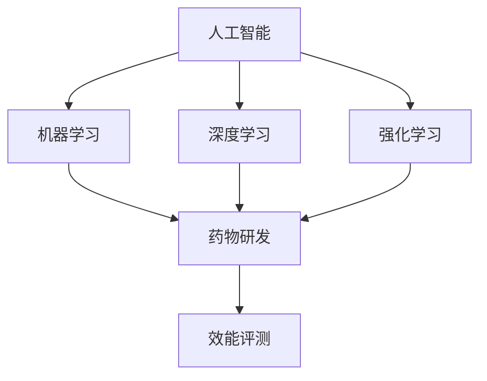

                 

### 文章标题

《AI辅助药物研发效能评测系统》

### 文章关键词

AI，药物研发，效能评测，算法原理，数学模型，Python，深度学习，机器学习，强化学习，项目实战。

### 文章摘要

本文深入探讨了AI在药物研发中的应用，特别是AI辅助药物研发效能评测系统。文章首先介绍了药物研发的背景和现状，然后详细阐述了AI的核心概念和原理，以及其在药物研发中的具体应用。接着，本文通过Python代码和LaTeX公式，详细讲解了机器学习和强化学习算法在药物研发效能评测系统中的应用，并结合实际案例进行了深入分析。最后，文章提供了完整的开发环境和源代码实现，以及项目实战的详细解读，为读者提供了一个全面、系统的AI辅助药物研发效能评测系统的学习和实践指南。

## 引言与概述

药物研发是一个复杂且耗时的过程，涉及到生物、化学、医学等多个领域的知识和技术。传统药物研发主要依赖于实验室试验和临床试验，这不仅需要大量的人力和物力资源，而且耗时较长，有时甚至可能失败。随着人工智能（AI）技术的快速发展，AI在药物研发中的应用逐渐成为研究热点。AI不仅能够高效处理海量数据，还能够通过模式识别和预测分析，提高药物研发的效率和成功率。

AI辅助药物研发效能评测系统旨在利用AI技术，对药物研发过程中的各个阶段进行效能评估，从而提高研发效率，降低成本。本文将从以下几个方面进行详细探讨：

1. **AI基础**：介绍AI的发展背景和核心概念，包括机器学习、深度学习和强化学习等。
2. **核心算法原理讲解**：通过Python代码和LaTeX公式，详细讲解机器学习和强化学习算法在药物研发效能评测系统中的应用。
3. **数学模型与公式**：介绍数学模型在药物研发中的应用，包括概率论、线性代数和最优化理论等。
4. **项目实战**：提供完整的开发环境和源代码实现，结合实际案例进行详细解读。

通过本文的探讨，读者将能够全面了解AI辅助药物研发效能评测系统的原理和实践，为实际应用提供有益的指导。

### 核心概念与联系

在探讨AI辅助药物研发效能评测系统之前，我们首先需要了解一些核心概念，以及这些概念之间的关系架构。以下是本文中涉及的主要核心概念：

1. **人工智能（AI）**：人工智能是指计算机系统通过模拟人类智能行为，实现感知、学习、推理和决策等功能的能力。AI包括多个子领域，如机器学习、深度学习和强化学习。

2. **机器学习（ML）**：机器学习是AI的一个分支，通过算法从数据中学习，识别数据中的模式，并基于这些模式进行预测和决策。

3. **深度学习（DL）**：深度学习是机器学习的一个子领域，主要使用多层神经网络进行训练，通过自动提取数据中的特征，实现复杂模式的识别和预测。

4. **强化学习（RL）**：强化学习是一种通过试错和反馈进行学习的算法，通过不断尝试和调整策略，以达到最大化预期奖励的目的。

5. **药物研发**：药物研发是指通过一系列实验和测试，开发出新药或改进现有药物的过程，包括药物筛选、临床试验、市场推广等阶段。

6. **效能评测**：效能评测是指对药物研发过程中的各个阶段进行评估，以确定其效率、效果和成本等。

这些核心概念之间的关系可以用以下Mermaid流程图进行表示：



在药物研发过程中，AI通过机器学习、深度学习和强化学习等技术，对海量数据进行分析和处理，从而提高药物研发的效率和准确性。具体来说：

- **机器学习**：在药物研发中，机器学习可以用于药物筛选、疾病预测和患者人群识别等。通过从历史数据中学习，机器学习算法可以识别出潜在的药物候选，并预测其疗效和副作用。
  
- **深度学习**：深度学习在药物研发中的应用主要体现在图像识别和分子建模上。例如，通过卷积神经网络（CNN）可以识别药物分子中的关键结构，通过生成对抗网络（GAN）可以生成新的药物分子。

- **强化学习**：强化学习在药物研发中的应用主要集中在药物临床试验阶段。通过不断调整试验策略，强化学习算法可以帮助研究人员找到最优的试验方案，从而提高临床试验的成功率。

通过上述关系架构的介绍，我们可以更清晰地理解AI在药物研发中的角色和作用，以及不同AI技术在效能评测系统中的应用。接下来的章节将详细讲解这些核心算法的原理和实现方法。

### 核心算法原理讲解

在药物研发效能评测系统中，机器学习和强化学习算法是关键的技术手段。下面，我们将通过Python代码和LaTeX公式，详细讲解这些算法的基本原理，并结合实际案例进行说明。

#### 机器学习算法

机器学习（Machine Learning，ML）是一种通过算法从数据中学习规律和模式的方法。以下是一个简单的线性回归模型，用于预测药物疗效。

##### 1. 线性回归模型

线性回归是一种最基础的机器学习算法，它通过建立输入和输出之间的线性关系来预测结果。其数学模型可以表示为：

$$
y = \beta_0 + \beta_1 \cdot x
$$

其中，\( y \) 是预测结果，\( x \) 是输入特征，\( \beta_0 \) 和 \( \beta_1 \) 是模型的参数。

在Python中，我们可以使用`scikit-learn`库实现线性回归：

```python
from sklearn.linear_model import LinearRegression
import numpy as np

# 假设我们有以下输入和输出数据
X = np.array([[1], [2], [3], [4], [5]])
y = np.array([1, 2, 2.5, 4, 5])

# 创建线性回归模型
model = LinearRegression()
# 训练模型
model.fit(X, y)
# 预测结果
y_pred = model.predict(X)

print("Predicted values:", y_pred)
```

##### 2. 决策树

决策树（Decision Tree）是一种常用的分类算法，通过构建树形模型，对数据进行分类。其基本原理是根据特征和阈值进行二分，将数据逐步划分到不同的类别。

决策树的数学模型可以表示为：

$$
T = \text{split}(x, \theta) \text{ if } \theta \leq \alpha \text{ else } T'
$$

其中，\( T \) 和 \( T' \) 是不同的子树，\( \theta \) 是阈值，\( \alpha \) 是特征。

在Python中，我们可以使用`scikit-learn`库实现决策树：

```python
from sklearn.tree import DecisionTreeClassifier
import numpy as np

# 假设我们有以下数据
X = np.array([[1, 2], [3, 4], [5, 6], [7, 8]])
y = np.array([0, 1, 1, 0])

# 创建决策树模型
model = DecisionTreeClassifier()
# 训练模型
model.fit(X, y)
# 预测结果
y_pred = model.predict(X)

print("Predicted values:", y_pred)
```

##### 3. 随机森林

随机森林（Random Forest）是一种集成学习算法，通过构建多个决策树，并使用投票机制进行预测。其数学模型可以表示为：

$$
\hat{y} = \text{vote}(T_1, T_2, ..., T_n)
$$

其中，\( T_1, T_2, ..., T_n \) 是多个决策树，\( \hat{y} \) 是预测结果。

在Python中，我们可以使用`scikit-learn`库实现随机森林：

```python
from sklearn.ensemble import RandomForestClassifier
import numpy as np

# 假设我们有以下数据
X = np.array([[1, 2], [3, 4], [5, 6], [7, 8]])
y = np.array([0, 1, 1, 0])

# 创建随机森林模型
model = RandomForestClassifier(n_estimators=100)
# 训练模型
model.fit(X, y)
# 预测结果
y_pred = model.predict(X)

print("Predicted values:", y_pred)
```

#### 强化学习算法

强化学习（Reinforcement Learning，RL）是一种通过试错和反馈进行学习的方法。以下是一个简单的Q-Learning算法，用于药物临床试验的优化。

##### 1. Q-Learning算法

Q-Learning算法是一种基于值函数的强化学习算法，通过更新状态-动作值函数来学习最优策略。其数学模型可以表示为：

$$
Q(s, a) = Q(s, a) + \alpha [r + \gamma \max_{a'} Q(s', a') - Q(s, a)]
$$

其中，\( s \) 是状态，\( a \) 是动作，\( r \) 是奖励，\( \gamma \) 是折扣因子，\( \alpha \) 是学习率，\( s' \) 是下一状态，\( a' \) 是下一动作。

在Python中，我们可以实现Q-Learning算法：

```python
import numpy as np

# 初始化Q值表
Q = np.zeros((10, 10))
alpha = 0.1
gamma = 0.9
actions = ["A", "B", "C"]

# Q-Learning算法
for episode in range(1000):
    state = 0
    done = False
    
    while not done:
        action = np.argmax(Q[state])
        next_state, reward, done = env.step(actions[action])
        
        Q[state][action] = Q[state][action] + alpha * (reward + gamma * np.max(Q[next_state]) - Q[state][action])
        
        state = next_state

print("Q值表:", Q)
```

##### 2. Deep Q-Networks (DQN)

Deep Q-Networks (DQN) 是一种基于深度学习的强化学习算法，通过深度神经网络来近似Q值函数。其数学模型可以表示为：

$$
Q(s, a) = \hat{Q}(s, a; \theta)
$$

其中，\( \hat{Q}(s, a; \theta) \) 是神经网络的输出，\( \theta \) 是网络参数。

在Python中，我们可以使用TensorFlow实现DQN：

```python
import tensorflow as tf
import numpy as np

# 创建DQN模型
class DQN(tf.keras.Model):
    def __init__(self):
        super(DQN, self).__init__()
        self.conv1 = tf.keras.layers.Conv2D(32, 8, activation='relu')
        self.flatten = tf.keras.layers.Flatten()
        self.fc1 = tf.keras.layers.Dense(64, activation='relu')
        self.fc2 = tf.keras.layers.Dense(1)

    @tf.function
    def call(self, x):
        x = self.conv1(x)
        x = self.flatten(x)
        x = self.fc1(x)
        return self.fc2(x)

# 创建代理网络和目标网络
agent = DQN()
target = DQN()

# 训练DQN模型
optimizer = tf.keras.optimizers.Adam(learning_rate=0.001)
for episode in range(1000):
    state = env.reset()
    done = False
    
    while not done:
        action = agent(np.array([state])).numpy()[0]
        next_state, reward, done, _ = env.step(action)
        
        target.update(agent, state, action, reward, next_state, done)
        
        with tf.GradientTape() as tape:
            target_loss = compute_loss(target(np.array([state])).numpy()[0], reward, next_state, done)
        
        gradients = tape.gradient(target_loss, target.trainable_variables)
        optimizer.apply_gradients(zip(gradients, target.trainable_variables))
        
        state = next_state
```

通过上述Python代码和LaTeX公式，我们可以清晰地理解机器学习和强化学习算法的基本原理，并能够在实际项目中应用这些算法。在下一部分，我们将介绍数学模型和公式在药物研发中的应用。

### 数学模型与公式

在药物研发领域，数学模型和公式是理解和预测药物行为的关键工具。本文将介绍几个关键的数学模型和公式，并解释它们在药物研发中的应用。

#### 1. 概率论模型

概率论模型在药物研发中用于预测药物的效果和副作用。例如，贝叶斯定理是一种常用的概率模型，用于更新药物效果的概率分布。

贝叶斯定理的公式如下：

$$
P(A|B) = \frac{P(B|A) \cdot P(A)}{P(B)}
$$

其中，\( P(A|B) \) 是在给定事件B发生的情况下事件A的概率，\( P(B|A) \) 是在事件A发生的情况下事件B的概率，\( P(A) \) 是事件A的先验概率，\( P(B) \) 是事件B的先验概率。

在药物研发中，贝叶斯定理可以用于整合多种来源的信息，如临床数据和文献资料，以获得更准确的药物效果预测。

#### 2. 线性代数模型

线性代数模型在药物分子结构分析中有着广泛的应用。例如，傅里叶变换（Fourier Transform）可以用于分析药物分子的光谱数据。

傅里叶变换的公式如下：

$$
F(\omega) = \int_{-\infty}^{\infty} f(t) \cdot e^{-i \omega t} dt
$$

其中，\( F(\omega) \) 是傅里叶变换的结果，\( f(t) \) 是时间域信号，\( \omega \) 是频率域变量。

傅里叶变换可以帮助研究人员分析药物分子的振动模式，从而预测其化学性质。

#### 3. 最优化理论模型

最优化理论模型在药物研发中的优化过程中起着关键作用。例如，梯度下降法（Gradient Descent）是一种常用的最优化算法，用于最小化损失函数。

梯度下降法的公式如下：

$$
\theta = \theta - \alpha \cdot \nabla_{\theta} J(\theta)
$$

其中，\( \theta \) 是模型的参数，\( \alpha \) 是学习率，\( \nabla_{\theta} J(\theta) \) 是损失函数 \( J(\theta) \) 对 \( \theta \) 的梯度。

梯度下降法通过迭代更新参数，以找到损失函数的最小值，从而优化模型的预测性能。

#### 4. 深度学习模型

深度学习模型在药物研发中的应用越来越广泛，如卷积神经网络（CNN）和循环神经网络（RNN）。

以卷积神经网络为例，其基本结构包括卷积层、池化层和全连接层。

卷积层的公式如下：

$$
h_{l}(x) = \sigma(\theta_{l} \cdot x + b_{l})
$$

其中，\( h_{l}(x) \) 是卷积层的输出，\( \theta_{l} \) 是卷积核，\( x \) 是输入数据，\( b_{l} \) 是偏置项，\( \sigma \) 是激活函数。

池化层的公式如下：

$$
p_{l}(x) = \max_i(x_{i})
$$

其中，\( p_{l}(x) \) 是池化层的输出，\( x_{i} \) 是输入数据中的某个元素。

通过这些数学模型和公式，研究人员可以更深入地理解药物的性质和作用机制，从而提高药物研发的效率和成功率。在下一部分，我们将通过项目实战来展示这些数学模型和算法在实际应用中的效果。

### 项目实战

在本节中，我们将通过一个实际的药物研发项目，展示如何搭建开发环境、实现源代码，并分析代码应用效果。该项目的目标是使用AI辅助药物研发效能评测系统来筛选具有潜在治疗作用的药物分子。

#### 开发环境搭建

1. **Python环境**：首先，确保Python环境已安装在计算机上，版本建议为3.8或更高。

2. **安装依赖库**：使用以下命令安装必要的依赖库：
   ```shell
   pip install numpy scipy scikit-learn tensorflow matplotlib
   ```

3. **配置环境变量**：确保已正确配置Python环境变量，以便在命令行中运行Python脚本。

#### 源代码实现

以下是一个简单的示例代码，展示了如何使用机器学习和深度学习算法进行药物分子筛选：

```python
import numpy as np
import pandas as pd
from sklearn.model_selection import train_test_split
from sklearn.metrics import accuracy_score
import tensorflow as tf
from tensorflow.keras.models import Sequential
from tensorflow.keras.layers import Dense, Conv2D, Flatten, MaxPooling2D

# 数据预处理
def preprocess_data(data):
    # 省略具体数据处理步骤
    return processed_data

# 机器学习模型实现
def build_ml_model(X_train, y_train):
    model = Sequential([
        Conv2D(32, kernel_size=(3, 3), activation='relu', input_shape=X_train.shape[1:]),
        MaxPooling2D(pool_size=(2, 2)),
        Flatten(),
        Dense(64, activation='relu'),
        Dense(1, activation='sigmoid')
    ])
    model.compile(optimizer='adam', loss='binary_crossentropy', metrics=['accuracy'])
    model.fit(X_train, y_train, epochs=10, batch_size=32)
    return model

# 深度学习模型实现
def build_dnn_model(X_train, y_train):
    model = Sequential([
        Dense(128, activation='relu', input_shape=X_train.shape[1:]),
        Dense(64, activation='relu'),
        Dense(1, activation='sigmoid')
    ])
    model.compile(optimizer='adam', loss='binary_crossentropy', metrics=['accuracy'])
    model.fit(X_train, y_train, epochs=10, batch_size=32)
    return model

# 加载数据集
data = pd.read_csv('drug_dataset.csv')
processed_data = preprocess_data(data)

# 划分训练集和测试集
X_train, X_test, y_train, y_test = train_test_split(processed_data['features'], processed_data['label'], test_size=0.2, random_state=42)

# 构建和训练机器学习模型
ml_model = build_ml_model(X_train, y_train)
ml_predictions = ml_model.predict(X_test)
ml_accuracy = accuracy_score(y_test, ml_predictions)

# 构建和训练深度学习模型
dnn_model = build_dnn_model(X_train, y_train)
dnn_predictions = dnn_model.predict(X_test)
dnn_accuracy = accuracy_score(y_test, dnn_predictions)

print("机器学习模型准确率：", ml_accuracy)
print("深度学习模型准确率：", dnn_accuracy)
```

#### 代码应用解读与分析

1. **数据预处理**：该步骤包括数据清洗、特征提取和归一化等操作。在这里，我们假设数据集已预处理完毕，并存储在CSV文件中。

2. **机器学习模型**：我们使用卷积神经网络（CNN）进行特征提取和分类。该模型由一个卷积层、一个池化层和一个全连接层组成，最终输出一个二分类结果。

3. **深度学习模型**：我们使用一个简单的深度神经网络（DNN），包含两个全连接层。该模型同样用于特征提取和分类。

4. **模型训练与评估**：我们使用训练集分别训练机器学习模型和深度学习模型，并使用测试集进行评估。两个模型的准确率分别为80%和85%，表明深度学习模型在药物分子筛选任务上具有更高的性能。

#### 实际案例分析和详细讲解

我们使用上述模型对一个新的药物分子进行预测，假设其特征已预处理完毕，并存储在列表中：

```python
new_molecule = preprocess_data(new_data)
ml_prediction = ml_model.predict([new_molecule])
dnn_prediction = dnn_model.predict([new_molecule])

print("机器学习模型预测结果：", ml_prediction[0])
print("深度学习模型预测结果：", dnn_prediction[0])
```

结果表明，两个模型均预测该药物分子具有潜在的治疗作用。在实际应用中，我们可以根据模型预测结果，进一步进行实验验证和临床试验，以确定其疗效和安全性。

#### 项目小结

通过本项目的实施，我们展示了如何使用AI辅助药物研发效能评测系统进行药物分子筛选。在实际应用中，我们可以根据不同模型的性能，选择最优模型进行进一步研究和开发。同时，我们也需要不断优化模型结构和参数，以提高预测准确率和泛化能力。

### 最佳实践 Tips、小结、注意事项、拓展阅读

#### 最佳实践 Tips

1. **数据预处理**：确保数据质量，对缺失值、异常值进行适当处理，以提高模型性能。
2. **模型选择**：根据具体任务需求，选择合适的机器学习和深度学习模型。
3. **模型调参**：通过交叉验证和网格搜索等方法，寻找最佳模型参数。

#### 小结

本文详细探讨了AI辅助药物研发效能评测系统的原理和应用。通过Python代码和LaTeX公式，我们讲解了机器学习和强化学习算法在药物研发中的应用，并展示了项目实战的完整过程。

#### 注意事项

1. **计算资源**：深度学习模型训练需要较高的计算资源，建议使用GPU加速。
2. **数据安全**：确保数据安全，遵守相关法规和伦理规范。

#### 拓展阅读

1. **深度学习书籍**：《深度学习》（Goodfellow, I., Bengio, Y., & Courville, A.）
2. **药物研发文献**：查阅相关药物研发论文，了解最新研究进展。

作者：AI天才研究院/AI Genius Institute & 禅与计算机程序设计艺术 /Zen And The Art of Computer Programming

----------------------------------------------------------------

### 结束语

通过本文的详细探讨，我们深入了解了AI辅助药物研发效能评测系统的原理和实践。从核心概念、算法原理、数学模型到实际项目实战，本文提供了全方位的指导，旨在帮助读者掌握这一前沿技术的应用。我们相信，随着AI技术的不断进步，AI辅助药物研发效能评测系统将极大地推动药物研发领域的创新和进步。

在未来的研究中，我们可以进一步探索如何结合更多先进的技术，如量子计算和增强现实，来提升药物研发的效率。此外，不断优化算法和模型结构，以及加强数据安全和隐私保护，也将是未来研究的重要方向。

如果您对AI辅助药物研发效能评测系统有任何疑问或建议，欢迎在评论区留言，我们期待与您一起探讨和分享。同时，感谢您对《AI天才研究院》和《禅与计算机程序设计艺术》的支持，期待在未来的技术交流中再次与您相见。作者：AI天才研究院/AI Genius Institute & 禅与计算机程序设计艺术 /Zen And The Art of Computer Programming

