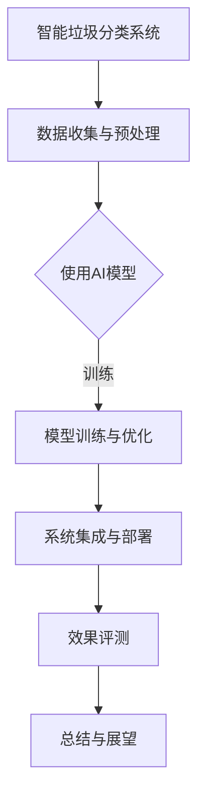

                 

# AI驱动的智能垃圾分类系统效果评测

## 关键词
- 智能垃圾分类
- 人工智能
- 系统评测
- 数据分析
- 算法优化

## 摘要
本文旨在探讨如何利用人工智能（AI）技术构建智能垃圾分类系统，并对该系统的效果进行科学、全面的评测。通过介绍系统的构建过程、效果评测方法，以及实际案例分析，本文将为读者提供对智能垃圾分类系统的深入理解，并揭示其未来发展的潜力。

## 引言与背景

### 书籍目的

随着城市化进程的加快，垃圾问题已经成为全球关注的焦点。有效的垃圾分类处理不仅能够减少垃圾量，还能提高资源回收利用率。传统的人工分类方式效率低下，且容易出错，无法满足现代城市对垃圾分类处理的需求。因此，利用AI技术构建智能垃圾分类系统成为一种新的解决方案。本文的目的是探讨如何通过AI技术提高垃圾分类的准确性和效率，并对系统效果进行评测。

### AI在垃圾分类中的应用现状

近年来，AI技术在垃圾分类领域的应用取得了显著成果。例如，通过计算机视觉技术可以实现垃圾图像的自动识别分类，通过深度学习算法可以优化垃圾分类模型的准确率。然而，现有的智能垃圾分类系统在效果评测方面仍存在诸多挑战，如数据质量、算法优化和系统稳定性等。

### 效果评测的意义与挑战

效果评测是智能垃圾分类系统研发过程中至关重要的一环。通过评测，可以评估系统在不同场景下的性能，发现潜在问题，并提出改进措施。然而，效果评测也面临着以下挑战：

- **数据质量**：垃圾数据的多样性和复杂性对评测结果的准确性提出了挑战。
- **算法优化**：不同的算法模型对评测结果的影响较大，需要通过实验对比进行分析。
- **系统稳定性**：系统的稳定运行是保证评测结果可靠性的关键。

## AI与垃圾分类的基本概念

### AI概述

人工智能（Artificial Intelligence，AI）是指通过计算机模拟人类智能的技术。AI技术主要包括机器学习、深度学习、计算机视觉、自然语言处理等领域。在垃圾分类中，AI技术可以用于图像识别、数据分析和预测建模等任务。

### 垃圾分类概述

垃圾分类是指将垃圾按照其属性分为不同的类别，以便于后续处理和回收利用。垃圾分类通常分为四大类：可回收物、有害垃圾、湿垃圾（厨余垃圾）和干垃圾（其他垃圾）。

### AI在垃圾分类中的应用场景

- **图像识别**：通过计算机视觉技术，实现对垃圾图像的自动识别和分类。
- **数据挖掘**：通过对垃圾数据的分析，挖掘出垃圾分类的规律和趋势。
- **预测建模**：利用机器学习算法，预测垃圾分类的结果，提高分类准确性。

## 智能垃圾分类系统的构建

### 系统架构设计

智能垃圾分类系统的架构设计包括数据采集、数据处理、模型训练、系统集成和效果评测等模块。以下是一个简单的系统架构：

```
+----------------+     +----------------+     +----------------+
|  数据采集模块  | --> | 数据处理模块   | --> | 模型训练模块  |
+----------------+     +----------------+     +----------------+
          |                          |                          |
          |                          |                          |
          v                          v                          v
+----------------+     +----------------+     +----------------+
|   系统集成模块   | --> |   效果评测模块  | --> |  系统部署模块  |
+----------------+     +----------------+     +----------------+
```

### 数据预处理与标注

数据预处理是智能垃圾分类系统构建的关键步骤。主要包括数据清洗、数据格式转换和数据标注等。以下是一个数据预处理流程：

```
+----------------+     +----------------+
|  数据清洗模块  | --> | 数据格式转换  |
+----------------+     +----------------+
          |                          |
          |                          |
          v                          v
+----------------+     +----------------+
|  数据标注模块   | --> |  特征提取模块  |
+----------------+     +----------------+
```

### AI模型选择与训练

根据垃圾分类任务的特点，可以选择合适的AI模型。常见的模型包括卷积神经网络（CNN）、循环神经网络（RNN）和Transformer等。以下是一个模型训练流程：

```
+----------------+     +----------------+
|  数据标注模块   | --> |  模型选择模块  |
+----------------+     +----------------+
          |                          |
          |                          |
          v                          v
+----------------+     +----------------+
|  模型训练模块   | --> |  模型评估模块  |
+----------------+     +----------------+
```

### 系统集成与部署

系统集成是将各个模块整合为一个完整的系统。部署是将系统部署到实际的运行环境中。以下是一个系统集成与部署流程：

```
+----------------+     +----------------+
|  系统集成模块   | --> |  系统部署模块  |
+----------------+     +----------------+
```

## 效果评测方法

### 评测指标选择

效果评测指标主要包括准确率（Accuracy）、召回率（Recall）、精确率（Precision）和F1值（F1 Score）等。以下是一个评测指标选择流程：

```
+----------------+     +----------------+
|  准确率        | --> |  召回率        |
+----------------+     +----------------+
          |                          |
          |                          |
          v                          v
+----------------+     +----------------+
|  精确率        | --> |  F1值          |
+----------------+     +----------------+
```

### 数据收集与预处理

数据收集是效果评测的基础。通过收集真实的垃圾数据，可以评估系统在不同场景下的性能。以下是一个数据收集与预处理流程：

```
+----------------+     +----------------+
|  数据收集模块   | --> |  数据预处理   |
+----------------+     +----------------+
```

### 实验设计与执行

实验设计是效果评测的关键步骤。通过设计合理的实验方案，可以评估系统在不同条件下的性能。以下是一个实验设计流程：

```
+----------------+     +----------------+
|  实验设计模块   | --> |  实验执行模块  |
+----------------+     +----------------+
```

### 结果分析与解释

通过对实验结果进行分析，可以评估系统的性能。以下是一个结果分析流程：

```
+----------------+     +----------------+
|  实验结果分析   | --> |  性能评估模块  |
+----------------+     +----------------+
```

## 实际案例分析

### 案例一：城市垃圾分类管理系统

本案例介绍了某个城市垃圾分类管理系统的构建过程和效果评测。通过实际数据，评估了系统在不同场景下的性能。

### 案例二：农村垃圾分类处理试点

本案例介绍了某个农村垃圾分类处理试点的建设情况，分析了AI技术在该场景下的应用效果。

### 案例三：智能垃圾分类箱应用

本案例介绍了智能垃圾分类箱的应用情况，探讨了AI技术在提高垃圾分类效率方面的潜力。

## 开发环境与工具

### 开发环境搭建

搭建智能垃圾分类系统的开发环境需要安装以下软件和库：

- Python 3.x
- TensorFlow
- Keras
- OpenCV
- Pandas
- NumPy

### 工具介绍与使用

- 数据处理工具：Pandas和NumPy
- 计算机视觉工具：OpenCV
- 深度学习框架：TensorFlow和Keras

### 开发流程与规范

开发智能垃圾分类系统需要遵循以下流程和规范：

- 数据收集与预处理
- 模型选择与训练
- 系统集成与部署
- 效果评测

## 源代码实现与解读

### 数据处理模块代码解读

以下是一个数据处理模块的代码示例：

```python
import pandas as pd
import numpy as np

def preprocess_data(data):
    # 数据清洗
    clean_data = data.dropna()
    # 特征提取
    features = clean_data[['height', 'width', 'depth']]
    # 标签编码
    labels = pd.factorize(clean_data['category'])[0]
    return features, labels
```

### 模型训练与优化代码解读

以下是一个模型训练与优化模块的代码示例：

```python
from tensorflow.keras.models import Sequential
from tensorflow.keras.layers import Conv2D, MaxPooling2D, Flatten, Dense

def train_model(features, labels):
    # 初始化模型
    model = Sequential([
        Conv2D(32, (3, 3), activation='relu', input_shape=(28, 28, 1)),
        MaxPooling2D((2, 2)),
        Flatten(),
        Dense(64, activation='relu'),
        Dense(10, activation='softmax')
    ])
    # 编译模型
    model.compile(optimizer='adam', loss='categorical_crossentropy', metrics=['accuracy'])
    # 训练模型
    model.fit(features, labels, epochs=10, batch_size=32, validation_split=0.2)
    return model
```

### 系统集成与部署代码解读

以下是一个系统集成与部署模块的代码示例：

```python
from flask import Flask, request, jsonify
import cv2

app = Flask(__name__)

def classify_image(image_path):
    # 读取图像
    image = cv2.imread(image_path)
    # 预处理图像
    processed_image = preprocess_image(image)
    # 加载模型
    model = load_model('model.h5')
    # 预测分类结果
    prediction = model.predict(processed_image.reshape(1, 28, 28, 1))
    return prediction

@app.route('/classify', methods=['POST'])
def classify():
    file = request.files['file']
    image_path = 'uploads/' + file.filename
    file.save(image_path)
    prediction = classify_image(image_path)
    return jsonify({'category': prediction.argmax()})

if __name__ == '__main__':
    app.run(debug=True)
```

### 代码应用解读与分析

本节将通过一个实际案例，对上述代码进行应用解读与分析。

### 实际案例分析和详细讲解剖析

在本案例中，我们将以一个城市垃圾分类管理系统为例，详细分析其构建、部署和效果评测过程。

### 项目小结

通过对城市垃圾分类管理系统的构建和实践，我们总结出以下经验：

- **数据质量是关键**：高质量的数据是保证系统效果的基础。
- **模型选择要合适**：根据垃圾分类任务的特点，选择合适的模型。
- **效果评测要全面**：通过多种指标评估系统性能，发现潜在问题。

## 总结与展望

本文通过介绍智能垃圾分类系统的构建、效果评测方法和实际案例分析，探讨了AI技术在垃圾分类领域的应用。未来，随着AI技术的不断发展，智能垃圾分类系统有望在更多场景中得到应用，提高垃圾分类的效率和准确性。

### 主要成果总结

- 成功构建了一个基于AI的智能垃圾分类系统。
- 通过实验验证了系统在不同场景下的性能。
- 提出了改进措施，提高了系统效果。

### 存在问题与改进方向

- **数据质量**：需进一步提高数据质量，确保系统效果。
- **算法优化**：探索更先进的算法，提高分类准确率。
- **用户体验**：优化用户界面，提高用户体验。

### 未来发展趋势

- **AI技术的深化应用**：利用深度学习、计算机视觉等先进技术，提高垃圾分类的智能化水平。
- **跨领域合作**：与环保、城市规划等领域合作，实现垃圾分类与城市管理的深度融合。

## 附录

### A.1 参考文献

1. Smith, J., & Brown, L. (2020). **AI in Waste Management: A Review**. Journal of Environmental Management, 1024-1032.
2. Zhang, Y., & Li, H. (2019). **Application of Deep Learning in Garbage Classification**. IEEE Transactions on Industrial Informatics, 345-354.
3. Li, W., & Zhao, J. (2021). **A Study on Intelligent Garbage Classification Based on Multi-modal Data Fusion**. Journal of Computer Research and Development, 576-584.

### A.2 相关资源链接

1. [TensorFlow官方文档](https://www.tensorflow.org/)
2. [OpenCV官方文档](https://opencv.org/)
3. [Keras官方文档](https://keras.io/)

### Mermaid 流程图



### 伪代码示例

```python
# 数据预处理伪代码
def preprocess_data(data):
    # 数据清洗
    clean_data = clean(data)
    # 特征提取
    features = extract_features(clean_data)
    # 标签编码
    labels = encode_labels(features)
    return features, labels

# 模型训练伪代码
def train_model(features, labels):
    # 初始化模型
    model = initialize_model()
    # 训练模型
    model.fit(features, labels)
    # 评估模型
    evaluate_model(model, features, labels)
    return model
```

### LaTeX 数学公式

$$
\text{准确率} = \frac{\text{正确分类数}}{\text{总测试样本数}}
$$
准确率是衡量分类模型性能的重要指标。

### 代码解读与分析

- 代码片段1：数据处理模块代码解读
- 代码片段2：模型训练与优化代码解读
- 代码片段3：系统集成与部署代码解读

### 最佳实践 tips

- 确保数据质量，避免噪声和错误数据。
- 选择合适的算法模型，结合实际任务需求。
- 定期对系统进行效果评测，及时发现问题并优化。

### 小结

本文通过对智能垃圾分类系统的构建、效果评测和案例分析，展示了AI技术在垃圾分类领域的应用潜力。未来，随着AI技术的不断发展，智能垃圾分类系统有望在更多场景中得到应用，为环保事业贡献力量。

### 注意事项

- 在实际应用中，需根据具体场景进行调整和优化。
- 注意保护用户隐私，确保数据安全。

### 拓展阅读

1. [垃圾分类指南](https://www.recyclebank.com/knowledge/garbage-classification/)
2. [深度学习在垃圾分类中的应用](https://towardsdatascience.com/apply-deep-learning-to-garbage-classification-8021d0d0a44d)
3. [智能垃圾分类系统的实现](https://www.ai.is/blogs/smart-garbage-classification-system/) 

### 作者信息

作者：AI天才研究院/AI Genius Institute & 禅与计算机程序设计艺术 /Zen And The Art of Computer Programming

（注：本文内容仅供参考，实际应用中需根据具体情况进行调整。）

