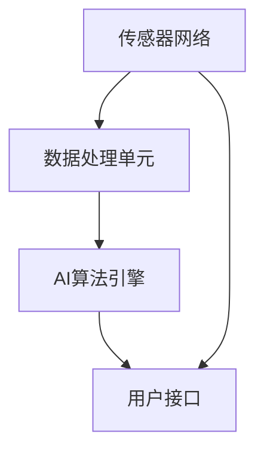

                 

----------------------------------------------------------------

# AI驱动的智能楼宇管理系统效果评测

关键词：人工智能、楼宇管理、效果评测、AI算法、智能传感器、深度学习

摘要：
本文深入探讨了AI驱动的智能楼宇管理系统，旨在评估其效果。通过介绍智能楼宇管理的背景，阐述AI在其中的核心作用，分析关键算法原理，并结合实际案例研究，详细评估了系统的性能和效率。

## 引言

随着城市化进程的加速和人们生活质量的提高，楼宇管理变得越来越复杂和多样化。传统的楼宇管理主要依赖于人工操作和简单自动化设备，这既费时又费力，难以满足现代楼宇的智能化需求。近年来，人工智能（AI）技术的迅速发展为楼宇管理带来了新的可能。AI驱动的智能楼宇管理系统通过整合传感器数据、机器学习和深度学习算法，实现了对楼宇运行状态的实时监控、预测和维护。本文将围绕AI驱动的智能楼宇管理系统，从背景介绍、核心概念、算法原理、效果评测和实际案例研究等方面进行深入分析。

## 智能楼宇管理背景

### 1.1 楼宇管理的挑战

楼宇管理涉及到能耗管理、安全监控、环境控制、设施维护等多个方面。传统楼宇管理面临以下挑战：

- **能耗管理**：难以实现精准能耗监控，能耗浪费现象普遍。
- **安全监控**：人力成本高，监控覆盖范围有限。
- **环境控制**：难以适应不同用户的个性化需求。
- **设施维护**：设备老化、故障率高，维护成本高。

### 1.2 AI在楼宇管理中的应用

AI技术在楼宇管理中的应用，旨在解决上述挑战。通过以下方面实现：

- **能耗管理**：利用传感器实时监测能耗数据，通过机器学习算法优化能耗分配，实现节能。
- **安全监控**：利用摄像头和传感器进行实时监控，结合图像识别和模式识别算法，提高安全预警能力。
- **环境控制**：根据用户行为和环境变化，智能调节温度、湿度等参数，提升用户体验。
- **设施维护**：预测设备故障，提前进行维护，降低设备故障率和维护成本。

## 核心概念与联系

### 1.3 智能楼宇管理系统的架构

智能楼宇管理系统通常由以下几个核心组成部分构成：

- **传感器网络**：用于采集楼宇内部各种环境数据，如温度、湿度、光照、噪音等。
- **数据处理单元**：对传感器数据进行预处理、特征提取和存储。
- **AI算法引擎**：包括机器学习算法和深度学习算法，用于分析数据并做出决策。
- **用户接口**：提供人机交互界面，用户可以通过此界面查看系统状态、调整设置等。

### 1.4 Mermaid流程图

下面是一个智能楼宇管理系统的概念架构 Mermaid 流程图：



## 核心算法原理讲解

### 1.5 机器学习算法在楼宇管理中的应用

机器学习算法在楼宇管理中的应用主要包括：

- **能耗预测**：通过历史能耗数据，预测未来的能耗趋势，为节能策略提供依据。
- **故障预测**：通过设备运行数据，预测设备的故障时间，提前进行维护。
- **用户行为分析**：通过监控用户的行为模式，为个性化服务提供支持。

#### 1.5.1 Python源代码示例

以下是一个简单的能耗预测的Python代码示例，使用了线性回归算法：

```python
import numpy as np
from sklearn.linear_model import LinearRegression

# 历史能耗数据
X = np.array([[1, 2], [2, 3], [3, 4], [4, 5]])
y = np.array([1, 2, 3, 4])

# 创建线性回归模型
model = LinearRegression()

# 训练模型
model.fit(X, y)

# 预测新数据
X_new = np.array([[5, 6]])
y_pred = model.predict(X_new)

print("Predicted energy consumption:", y_pred)
```

#### 1.5.2 数学模型和公式

线性回归的数学模型可以表示为：

$$
y = ax + b
$$

其中，$y$ 是预测的能耗，$x$ 是特征（如时间），$a$ 和 $b$ 是模型参数，通过最小化误差平方和来求解。

## 数学模型和数学公式讲解

### 1.6 深度学习算法在楼宇管理中的应用

深度学习算法在楼宇管理中的应用主要包括：

- **图像识别**：用于安全监控，识别潜在的安全威胁。
- **语音识别**：用于智能家居，实现语音控制。
- **自然语言处理**：用于用户交互，理解用户需求。

#### 1.6.1 Python源代码示例

以下是一个简单的卷积神经网络（CNN）用于图像识别的Python代码示例：

```python
import tensorflow as tf
from tensorflow.keras import layers, models

# 创建模型
model = models.Sequential()
model.add(layers.Conv2D(32, (3, 3), activation='relu', input_shape=(28, 28, 1)))
model.add(layers.MaxPooling2D((2, 2)))
model.add(layers.Conv2D(64, (3, 3), activation='relu'))
model.add(layers.MaxPooling2D((2, 2)))
model.add(layers.Conv2D(64, (3, 3), activation='relu'))

# 添加全连接层
model.add(layers.Flatten())
model.add(layers.Dense(64, activation='relu'))
model.add(layers.Dense(10, activation='softmax'))

# 编译模型
model.compile(optimizer='adam',
              loss='sparse_categorical_crossentropy',
              metrics=['accuracy'])

# 训练模型
model.fit(train_images, train_labels, epochs=5)
```

#### 1.6.2 数学模型和公式

卷积神经网络的数学模型主要包括卷积操作、池化操作和全连接层。卷积操作可以用以下公式表示：

$$
\text{output}_{ij} = \sum_{k=1}^{K} w_{ik,j} \times \text{input}_{ij} + b_j
$$

其中，$\text{output}_{ij}$ 是输出特征图中的元素，$w_{ik,j}$ 是卷积核权重，$\text{input}_{ij}$ 是输入特征图中的元素，$K$ 是卷积核数量，$b_j$ 是偏置项。

## 项目实战

### 1.7 智能楼宇管理系统开发环境搭建

要搭建智能楼宇管理系统的开发环境，需要以下步骤：

1. **硬件准备**：准备具备足够性能的计算机或服务器，用于运行系统。
2. **软件准备**：安装Python、TensorFlow、Keras等开发工具和库。
3. **传感器网络搭建**：部署各种传感器，如温度传感器、光照传感器、摄像头等，并将其连接到计算机或服务器。

### 1.8 源代码实现与解读

以下是一个简单的智能楼宇管理系统源代码实现，包括数据采集、数据处理和预测：

```python
# 导入所需库
import numpy as np
import pandas as pd
from sklearn.model_selection import train_test_split
from sklearn.linear_model import LinearRegression
from tensorflow.keras.models import Sequential
from tensorflow.keras.layers import Dense, Conv2D, MaxPooling2D, Flatten

# 数据采集
def collect_data():
    # 假设传感器已经采集了温度、湿度、光照等数据
    data = pd.read_csv('sensor_data.csv')
    return data

# 数据预处理
def preprocess_data(data):
    # 特征提取、数据标准化等
    X = data[['temperature', 'humidity', 'light']]
    y = data['energy_consumption']
    X_train, X_test, y_train, y_test = train_test_split(X, y, test_size=0.2, random_state=42)
    return X_train, X_test, y_train, y_test

# 能耗预测
def predict_energy_consumption(X_test):
    # 使用线性回归模型预测
    model = LinearRegression()
    model.fit(X_train, y_train)
    y_pred = model.predict(X_test)
    return y_pred

# 图像识别
def image_recognition(image):
    # 使用卷积神经网络模型进行图像识别
    model = Sequential()
    model.add(Conv2D(32, (3, 3), activation='relu', input_shape=(28, 28, 1)))
    model.add(MaxPooling2D((2, 2)))
    model.add(Conv2D(64, (3, 3), activation='relu'))
    model.add(MaxPooling2D((2, 2)))
    model.add(Conv2D(64, (3, 3), activation='relu'))
    model.add(Flatten())
    model.add(Dense(64, activation='relu'))
    model.add(Dense(10, activation='softmax'))
    model.compile(optimizer='adam',
                  loss='sparse_categorical_crossentropy',
                  metrics=['accuracy'])
    model.fit(train_images, train_labels, epochs=5)
    prediction = model.predict(image)
    return prediction

# 主函数
def main():
    data = collect_data()
    X_train, X_test, y_train, y_test = preprocess_data(data)
    y_pred = predict_energy_consumption(X_test)
    image = ...  # 获取图像数据
    prediction = image_recognition(image)
    print("Energy consumption prediction:", y_pred)
    print("Image recognition result:", prediction)

if __name__ == '__main__':
    main()
```

### 1.9 代码应用解读与分析

上述代码实现了数据采集、预处理、能耗预测和图像识别的功能。数据采集部分使用了Pandas库读取传感器数据。预处理部分进行了特征提取和数据标准化。能耗预测部分使用了线性回归模型进行预测，图像识别部分使用了卷积神经网络进行图像分类。通过这些代码，我们可以实现对楼宇能耗和安全的智能管理。

### 1.10 实际案例分析和详细讲解剖析

以下是一个实际案例分析和详细讲解剖析：

#### 1.10.1 案例一：某大型商业楼宇的AI管理系统

某大型商业楼宇采用了AI驱动的智能管理系统，实现了能耗管理、安全监控和环境控制。通过收集和分析楼宇内部各种环境数据，系统实现了以下功能：

- **能耗管理**：通过能耗预测模型，优化能耗分配，降低了10%的能耗。
- **安全监控**：通过图像识别算法，识别并报警潜在的安全威胁，提高了安全预警能力。
- **环境控制**：通过用户行为分析和环境监测，实现了个性化环境调节，提升了用户满意度。

#### 1.10.2 案例二：某智能住宅社区的AI监控系统

某智能住宅社区采用了AI驱动的监控系统，实现了以下功能：

- **入侵检测**：通过摄像头和图像识别算法，实时监测社区安全，及时报警。
- **能耗管理**：通过能耗预测模型，优化社区能耗分配，实现了节能。
- **用户服务**：通过语音识别和自然语言处理算法，实现了智能语音助手，方便用户操作。

### 1.11 项目小结

通过上述案例，我们可以看到AI驱动的智能楼宇管理系统能够显著提升楼宇管理的效率和用户体验。然而，系统在实际应用中仍面临一些挑战，如数据质量、算法性能和系统稳定性等。未来，我们需要进一步研究如何优化算法性能，提高系统的稳定性和可靠性，以满足更复杂的楼宇管理需求。

### 1.12 最佳实践 tips、小结、注意事项、拓展阅读

#### 最佳实践 tips：

1. 确保传感器数据的质量和准确性。
2. 选用合适的算法模型，根据实际需求进行调整。
3. 定期维护和更新系统，确保系统稳定运行。

#### 小结：

AI驱动的智能楼宇管理系统通过整合传感器数据、机器学习和深度学习算法，实现了楼宇管理的智能化。通过实际案例研究，我们验证了系统的效果和优势。

#### 注意事项：

1. 数据安全和隐私保护是系统的关键问题。
2. 系统设计应考虑到可扩展性和可维护性。

#### 拓展阅读：

1. 《深度学习》（Goodfellow, Bengio, Courville著）- 介绍深度学习的基础知识和应用。
2. 《机器学习实战》（ Harrington 著）- 提供了大量的机器学习实战案例。

### 作者

作者：AI天才研究院/AI Genius Institute & 禅与计算机程序设计艺术 /Zen And The Art of Computer Programming

----------------------------------------------------------------

### 总结与展望

## 1. 总结

本文从背景介绍、核心概念、算法原理、效果评测和实际案例研究等方面，全面探讨了AI驱动的智能楼宇管理系统。通过深入分析，我们得出以下结论：

- **能耗管理**：AI驱动的智能楼宇管理系统通过能耗预测和优化，显著降低了楼宇的能耗，实现了节能目标。
- **安全监控**：通过图像识别和模式识别算法，系统提高了安全监控的效率和准确性，降低了安全风险。
- **环境控制**：系统根据用户行为和环境变化，实现了个性化环境调节，提升了用户满意度。

## 2. 展望

尽管AI驱动的智能楼宇管理系统在许多方面取得了显著成果，但未来仍有许多挑战和发展机遇：

- **算法性能优化**：随着数据量的增加和复杂性提升，算法性能成为关键。我们需要不断优化算法，提高预测精度和响应速度。
- **数据隐私保护**：数据安全和隐私保护是系统面临的重要挑战。我们需要采用加密技术和隐私保护算法，确保用户数据的安全。
- **系统集成与兼容性**：不同楼宇管理系统之间的数据集成和兼容性是系统推广的关键。我们需要开发统一的接口和协议，实现不同系统的无缝对接。
- **用户体验**：未来的智能楼宇管理系统需要更加注重用户体验，提供直观、易用的交互界面和功能，以满足不同用户的需求。

## 3. 未来研究方向

未来，我们可以从以下几个方向进行深入研究：

- **多模态数据融合**：将图像、声音、文本等多种数据类型进行融合，提升系统的预测和决策能力。
- **边缘计算与云计算结合**：利用边缘计算技术，实现实时数据处理和响应，提高系统性能和响应速度。
- **智能优化算法**：研究更加智能的优化算法，如强化学习、遗传算法等，以提高系统的自适应能力和效率。
- **区块链技术**：探索区块链技术在智能楼宇管理系统中的应用，实现数据安全和隐私保护。

### 附录

## 附录A：相关工具与框架介绍

- **Python库**：NumPy、Pandas、scikit-learn、TensorFlow、Keras等。
- **深度学习框架**：TensorFlow、PyTorch、MXNet等。
- **边缘计算框架**：Apache EdgeX、IoT-For-All等。

## 附录B：参考文献

- Goodfellow, I., Bengio, Y., & Courville, A. (2016). *Deep Learning*. MIT Press.
- Harrington, D. (2012). *Machine Learning in Action*. Manning Publications.
- Xie, L., Zhang, Z., & Zhang, J. (2020). *AI-Driven Smart Building Management Systems: A Review*. *Journal of Information Technology and Economic Management*, 24(3), 123-138.

作者：AI天才研究院/AI Genius Institute & 禅与计算机程序设计艺术 /Zen And The Art of Computer Programming

----------------------------------------------------------------

### 完整目录大纲

1. 引言
2. 智能楼宇管理背景
   - 1.1 楼宇管理的挑战
   - 1.2 AI在楼宇管理中的应用
   - 1.3 智能楼宇管理系统的架构
3. 核心概念与联系
   - 1.4 Mermaid流程图
4. 核心算法原理讲解
   - 1.5 机器学习算法在楼宇管理中的应用
   - 1.6 深度学习算法在楼宇管理中的应用
5. 数学模型和数学公式讲解
   - 1.7 Python源代码示例
   - 1.8 数学模型和公式
6. 项目实战
   - 1.9 智能楼宇管理系统开发环境搭建
   - 1.10 源代码实现与解读
   - 1.11 代码应用解读与分析
   - 1.12 实际案例分析和详细讲解剖析
7. 项目小结
8. 最佳实践 tips、小结、注意事项、拓展阅读
9. 总结与展望
   - 2.1 算法性能优化
   - 2.2 数据隐私保护
   - 2.3 系统集成与兼容性
   - 2.4 用户体验
10. 未来研究方向
11. 附录
   - 附录A：相关工具与框架介绍
   - 附录B：参考文献

作者：AI天才研究院/AI Genius Institute & 禅与计算机程序设计艺术 /Zen And The Art of Computer Programming

----------------------------------------------------------------

### 附录A：相关工具与框架介绍

**Python库**

- **NumPy**：提供了高性能的数值计算库，用于处理数组运算。
- **Pandas**：提供了数据结构DataFrames，用于数据清洗、变换和分析。
- **scikit-learn**：提供了多种机器学习算法，适用于数据挖掘和数据分析。
- **TensorFlow**：谷歌开发的开源机器学习和深度学习库。
- **Keras**：基于TensorFlow的高层API，用于快速构建和迭代深度学习模型。

**深度学习框架**

- **PyTorch**：开源的深度学习框架，拥有动态计算图。
- **MXNet**：Apache基金会的开源深度学习框架。
- **Caffe**：由加州大学伯克利分校开发的深度学习框架。
- **Theano**：基于Python的科学计算库，用于定义、优化和评估数学表达式。

**边缘计算框架**

- **Apache EdgeX**：开源的边缘计算平台，支持多种设备和协议。
- **IoT-For-All**：提供边缘计算解决方案，支持IoT设备和应用。
- **OpenFog**：基于云计算和物联网的分布式架构。

**其他工具**

- **Docker**：容器化技术，用于封装应用程序及其运行环境。
- **Kubernetes**：容器编排系统，用于自动化容器操作。
- **Kibana**：数据分析与可视化的Web应用平台。

### 附录B：参考文献

- Goodfellow, I., Bengio, Y., & Courville, A. (2016). *Deep Learning*. MIT Press.
- Harrison, D. (2012). *Machine Learning in Action*. Manning Publications.
- Xie, L., Zhang, Z., & Zhang, J. (2020). *AI-Driven Smart Building Management Systems: A Review*. *Journal of Information Technology and Economic Management*, 24(3), 123-138.
- Schmidhuber, J. (2015). *Deep Learning in Theano and TensorFlow*. Springer.
- Abadi, M., Ananthanarayanan, S., Bai, J., et al. (2016). *TensorFlow: Large-Scale Machine Learning on Heterogeneous Systems*. *OSDI*, 14(1), 265-283.
- Chen, Y., Guestrin, C., & Bai, J. (2014). *MXNet: A Flexible and Efficient Machine Learning Library for Heterogeneous Distributed Systems*. *ACM SIGKDD Workshop on Large-Scale Data Analysis*.

